+++
title = "Tweets by Eric Topol Aug 31"
Summary = ""
tags = ["Twitter"]
category = "Twitter"
+++

---

<a href="https://twitter.com/erictopol/status/1432505183590760450" target="_blank" rel="noreferer">00:47 UCT</a>

It seems it should be the other way around.....
https://www.ft.com/content/ec9d43ec-b625-4f5b-b48d-7ff8c91e3093 

<a href="E-FH2NgVIAIhFmC.jpg"  >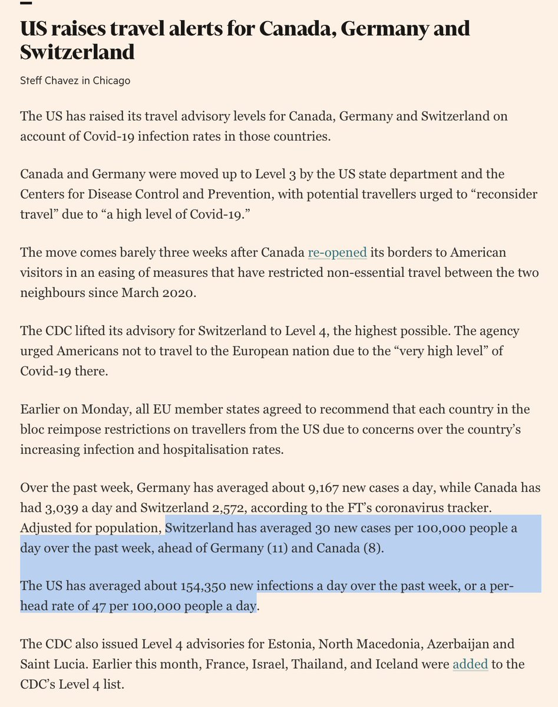</img></a>

---

<a href="https://twitter.com/erictopol/status/1432522443516628994" target="_blank" rel="noreferer">01:55 UCT</a>

New Zealand is achieving containment of its Delta "wave" @minhealthnz with 49 cases today
https://www.health.govt.nz/news-media/media-releases/49-additional-community-cases-covid-19-1-new-case-managed-isolation-facility-over-76000-vaccines
An amazing graph of their pandemic confirmed and probable cases over &gt;18 months in a country of 4.9 million people 

<a href="E-FWpsSVkAMTIYX.jpg"  >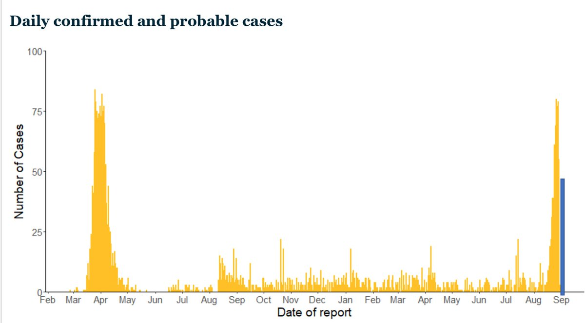</img></a>

---

<a href="https://twitter.com/erictopol/status/1432541301245833220" target="_blank" rel="noreferer">03:10 UCT</a>

That's quite a top 10 list
https://newsnodes.com/worldmonitor/ 

<a href="E-FosrjVEAUf4Ju.jpg"  >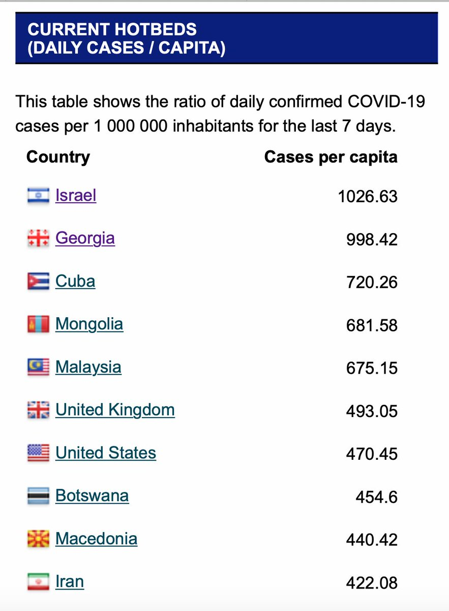</img></a>

---

<a href="https://twitter.com/erictopol/status/1432710047444918281" target="_blank" rel="noreferer">14:21 UCT</a>

Just published @ScienceMagazine 
The importance of rapid, cross-reactive immunity for  prior Covid and vaccine effect
"Our results highlight the functional contribution of pre-existing spike-cross-reactive T cells in SARS-CoV-2 infection and vaccination"
https://www.science.org/doi/10.1126/science.abh1823 

<a href="E-IB0__WEAwxtTT.jpg"  >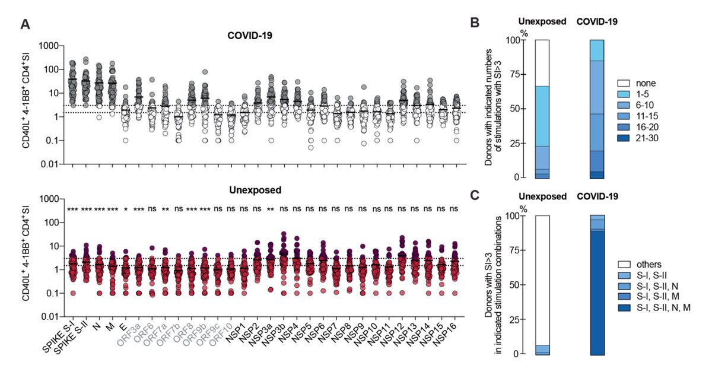</img></a>

---

<a href="https://twitter.com/erictopol/status/1432732528750718983" target="_blank" rel="noreferer">15:50 UCT</a>

I like this "Propitiously Boring Implications for Vaccine Escape" 👍👍
"The modest ensemble of mutations relative to the WT (wild-type) shown to reduce vaccine efficacy might constitute the majority of all possible escape mutations."
https://www.biorxiv.org/content/10.1101/2021.08.30.458225v1 

<a href="E-IVgUVUUAMiNtM.jpg"  >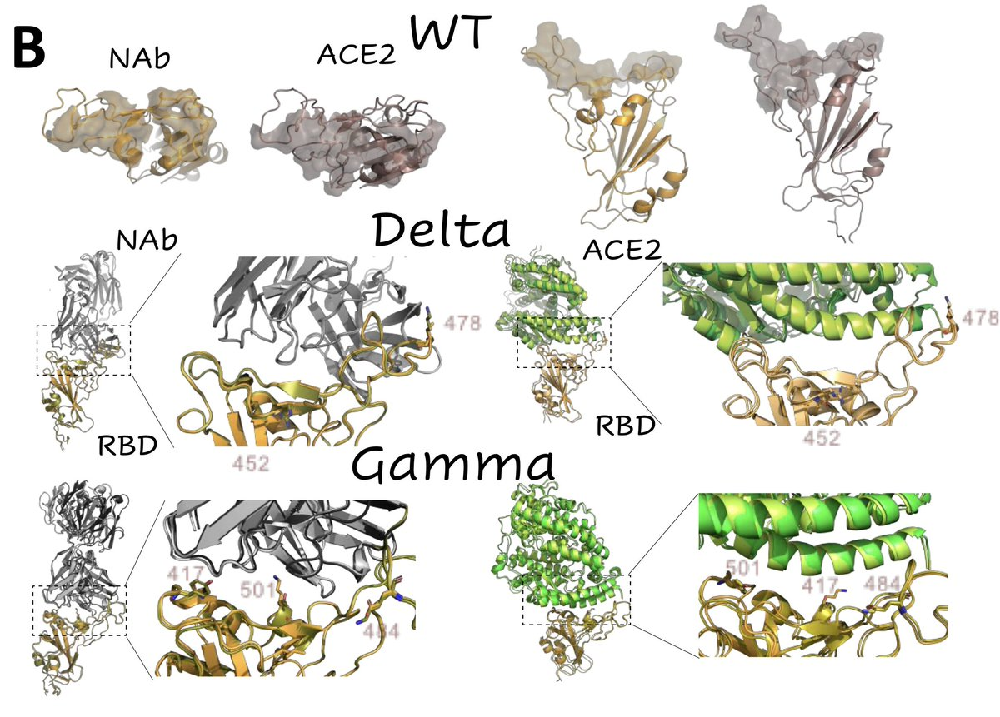</img></a><a href="E-IVifsVgAItbWm.jpg"  >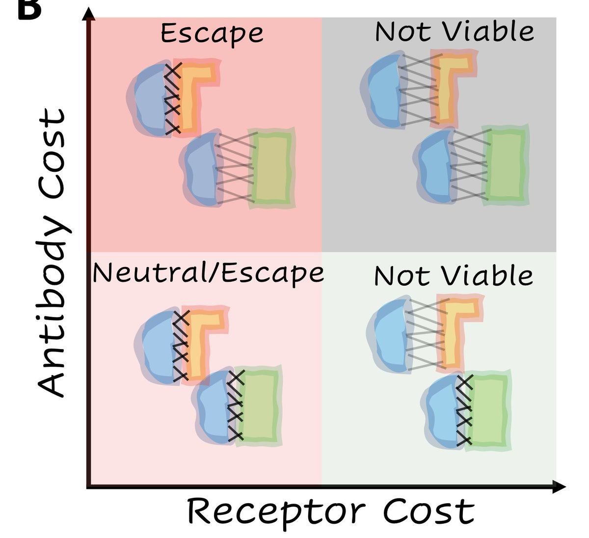</img></a>

---

<a href="https://twitter.com/erictopol/status/1432732535205687296" target="_blank" rel="noreferer">15:50 UCT</a>

Goes along with what @RobertoBurioni and I wrote in @NatureMedicine about #SARSCoV2 reaching peak fitness https://www.nature.com/articles/s41591-021-01421-7
The best we can hope for is it —🦠—doesn't get worse than Delta and escape our vaccine mediated protection 

<a href="E-IWN_aUUAIdAhH.png"  >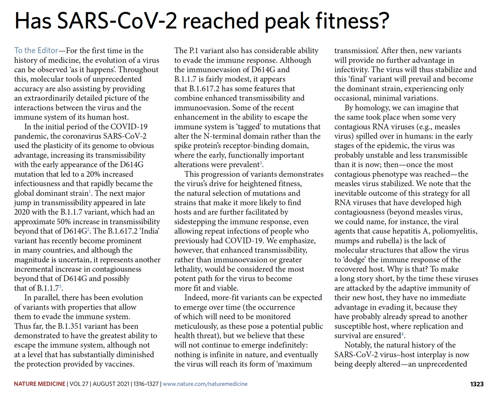</img></a>

---

<a href="https://twitter.com/erictopol/status/1432736926348439554" target="_blank" rel="noreferer">16:07 UCT</a>

Safety of mRNA vaccination in over 400 "highly allergic" individuals, promoted with the use of a simple algorithm
https://jamanetwork.com/journals/jamanetworkopen/fullarticle/2783626 @JAMANetworkOpen

---

<a href="https://twitter.com/erictopol/status/1432742529925988357" target="_blank" rel="noreferer">16:30 UCT</a>

Good synthesis of many recent studies that I've been highlighting and in full agreement with Trevor's conclusion https://twitter.com/trvrb/status/1432725239188783106

---

<a href="https://twitter.com/erictopol/status/1432752910710960128" target="_blank" rel="noreferer">17:11 UCT</a>

This same pattern triplicated, quadruplicated, again and again.
Hybrid immunity, here against in people with autoimmune disease
https://www.medrxiv.org/content/10.1101/2021.08.26.21258418v1
[Confirmed prior covid should be considered as = 1 dose of vaccine] 

<a href="E-IoWgdVcAAUzvE.jpg"  >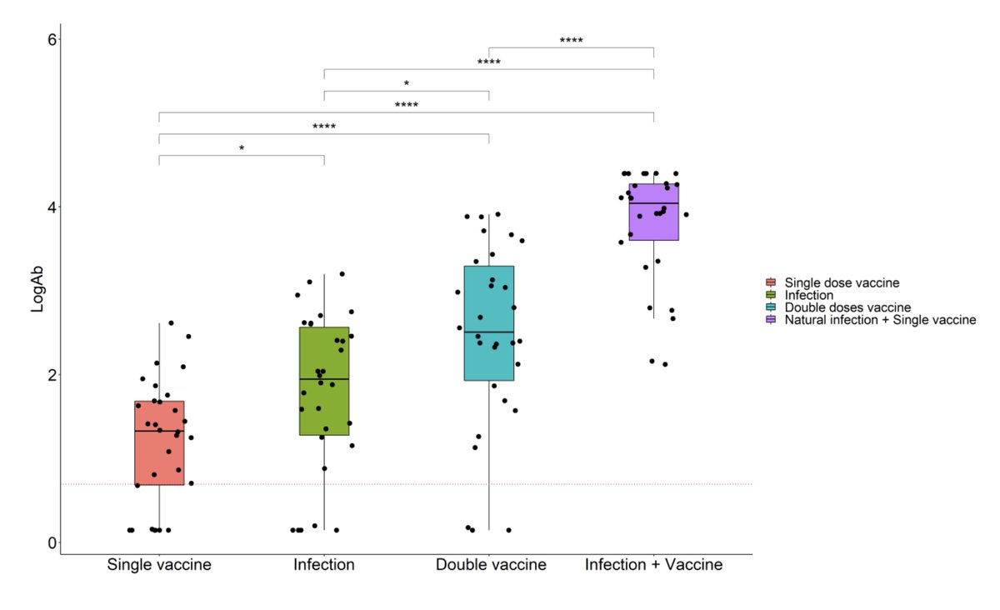</img></a>

---

<a href="https://twitter.com/erictopol/status/1432755346087428097" target="_blank" rel="noreferer">17:21 UCT</a>

@SammourMD @mbelshazly @CCFcards @ClevelandClinic @venumenon10 She’s a legend!  I had the privilege of working with her for 14 of those years and hundreds of fellows

---

<a href="https://twitter.com/erictopol/status/1432759544321511430" target="_blank" rel="noreferer">17:37 UCT</a>

Key lessons tracing 2 (mostly Delta) outbreaks:
—122 primary cases: 104 (85%) were in not fully vaccinated
—18 (15%) were in fully vaccinated persons
—8 of 38 (21%) close contacts of these got Covid
—No vaccinated persons w/ COVID-19 were hospitalized
https://www.cdc.gov/mmwr/volumes/70/wr/mm7035e4.htm?s_cid=mm7035e4_w 

<a href="E-IumrxUUAMwuFh.jpg"  >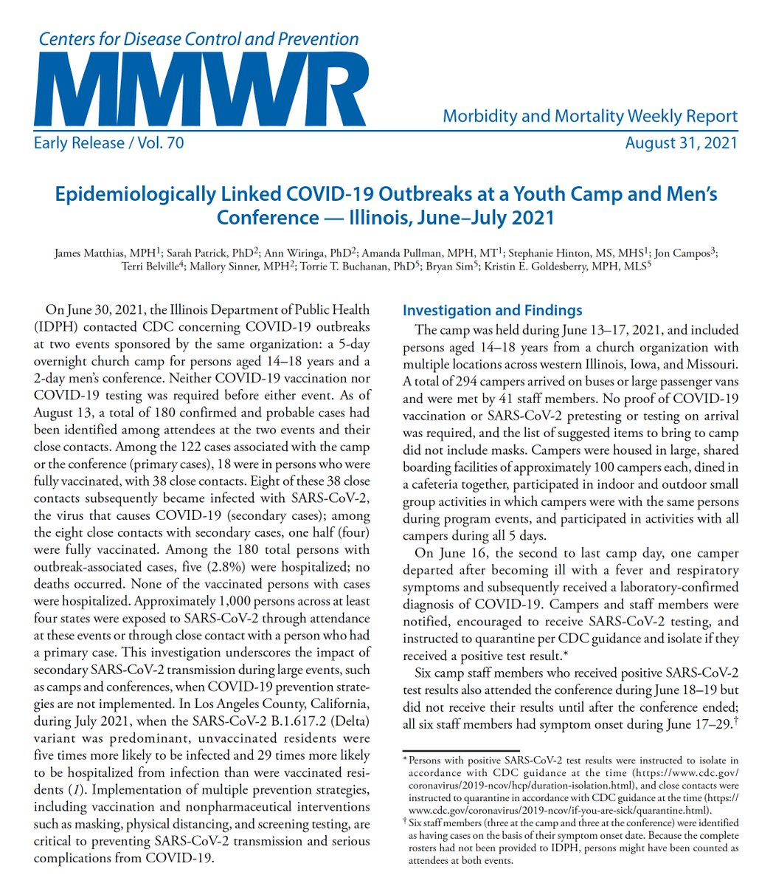</img></a>

---

<a href="https://twitter.com/erictopol/status/1432763743591534593" target="_blank" rel="noreferer">17:54 UCT</a>

That's right (for those questioning):
8 of 38 (21%) of close contacts of fully vaccinated got covid. And 4 of the 8 were in fully vaccinated. 
Fully vaccinated doesn't prevent transmission, even though it is less frequent.
And 5 of the unvaccinated who got covid were hospitalized 

<a href="E-Iy56wVQAIvhv9.jpg"  >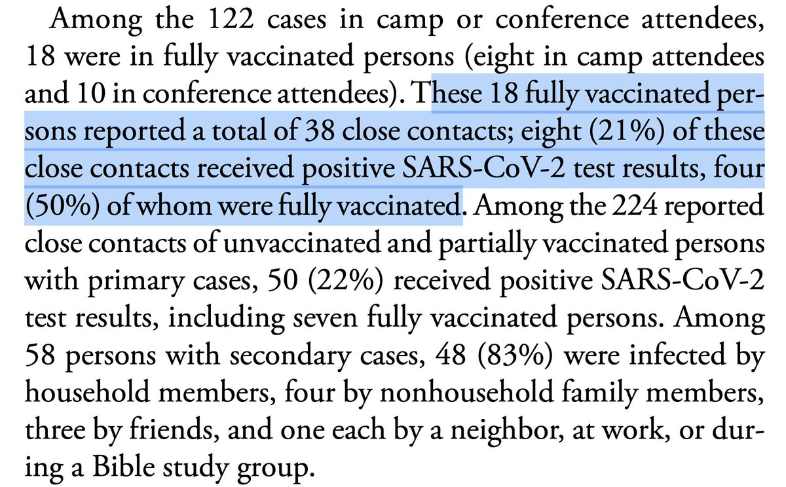</img></a>

---

<a href="https://twitter.com/erictopol/status/1432775613551505409" target="_blank" rel="noreferer">18:41 UCT</a>

Do 3rd shot Pfizer vaccine boosters restore effectiveness vs infections (any) and, if so, when? and how long?
https://www.medrxiv.org/content/10.1101/2021.08.29.21262792v1
New preprint from Israel says yes (VE to 70-84%),  ≥ 2 weeks, and duration unclear 

<a href="E-I8ldQUUAAvt5b.jpg"  >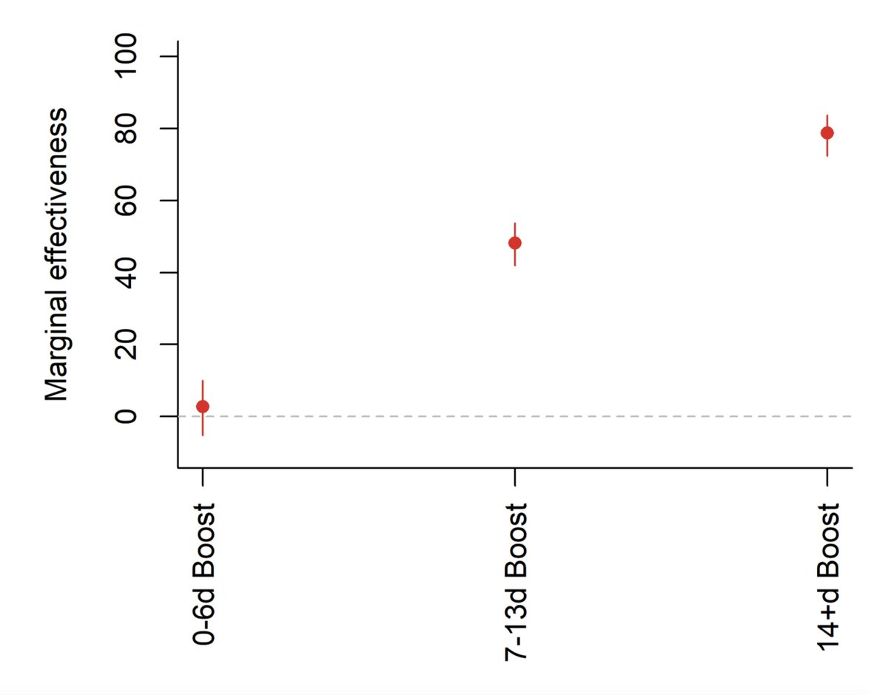</img></a><a href="E-I8m15UUAMh9sp.png"  >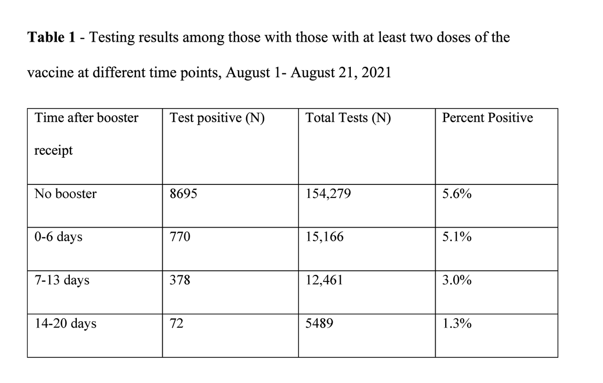</img></a>

---

<a href="https://twitter.com/erictopol/status/1432777908309794816" target="_blank" rel="noreferer">18:50 UCT</a>

@feldman_gil Thanks. Do you have this same graph for severe illness?

---

<a href="https://twitter.com/erictopol/status/1432785383025102850" target="_blank" rel="noreferer">19:20 UCT</a>

New @PNASNews 
Exposure maps of airborne transmission and the flaws of models and current guidelines that have given a consistent and gross underestimate of infection risk 
https://www.pnas.org/content/118/37/e2105279118 

<a href="https://twitter.com/erictopol/status/1432785383025102850" target="_blank" rel="noreferer">Annimation or video</a>

---

<a href="https://twitter.com/erictopol/status/1432785390377705474" target="_blank" rel="noreferer">19:20 UCT</a>

Effect of sneezing at different temperatures and humidity %, time to evaporation 

<a href="E-JGBgIUYAEjIUW.jpg"  >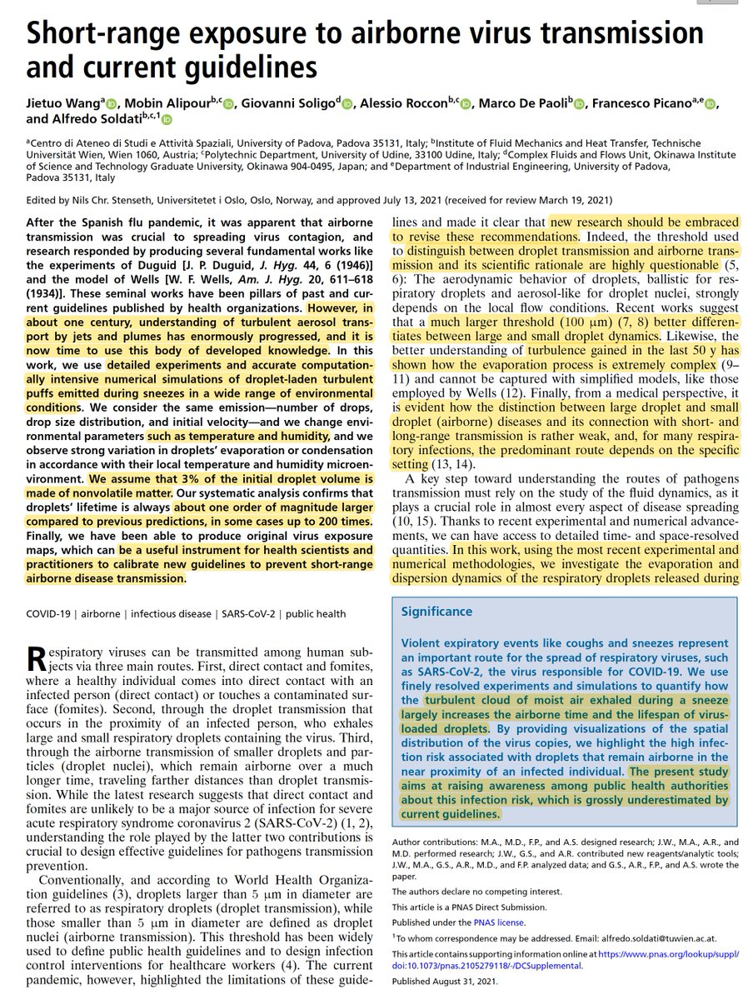</img></a><a href="E-JGT4_VIAI4HIv.jpg"  >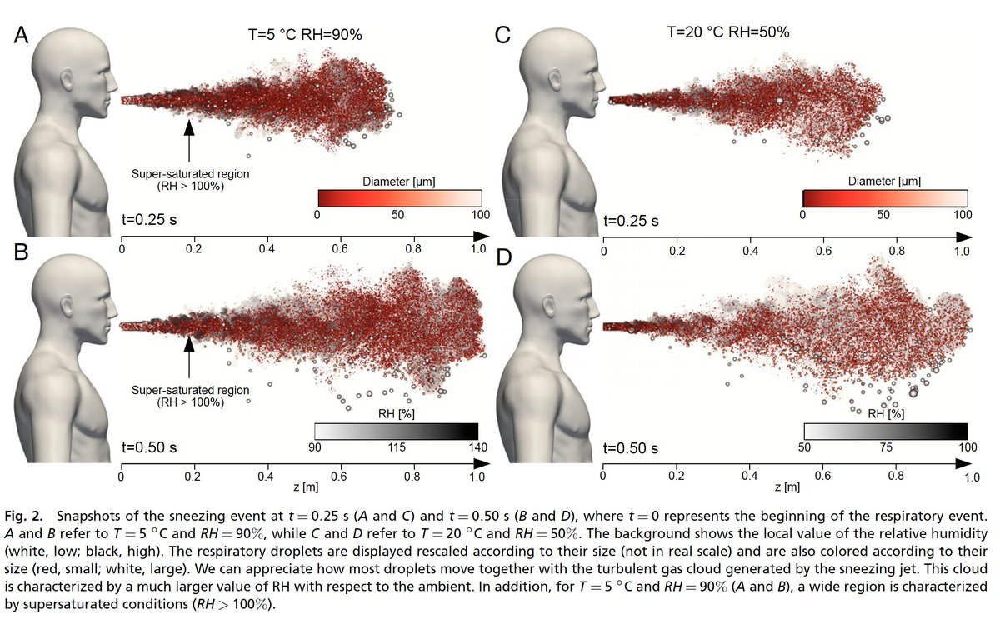</img></a><a href="E-JGeP1VgAAU6u0.jpg"  >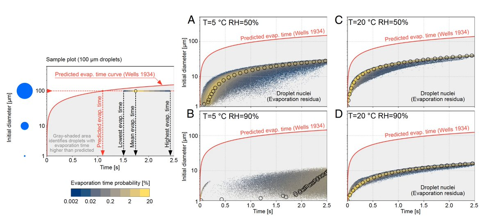</img></a><a href="E-JGft2VIAEXHkL.jpg"  >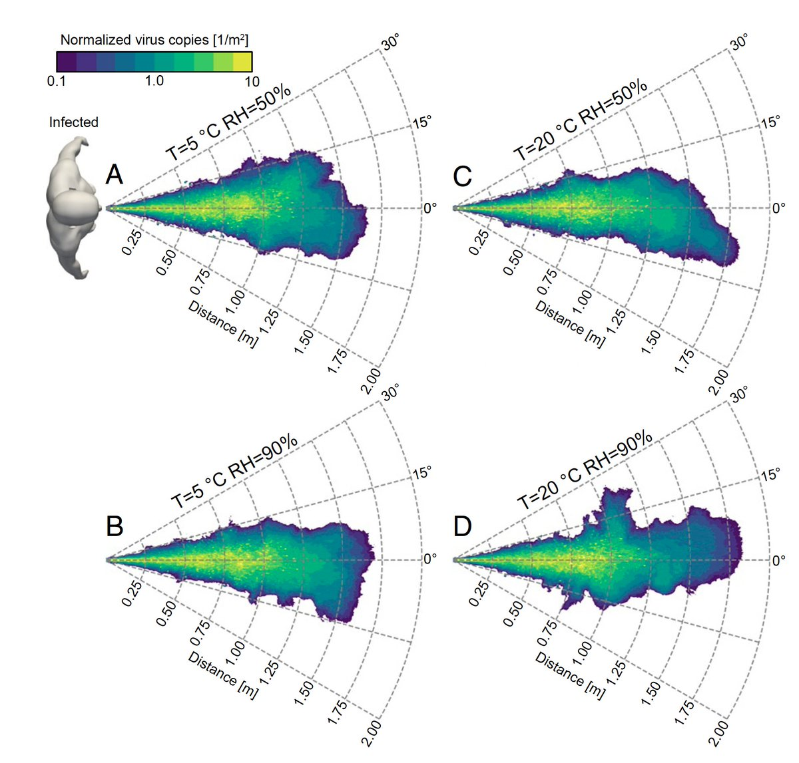</img></a>

---

<a href="https://twitter.com/erictopol/status/1432789037647990786" target="_blank" rel="noreferer">19:35 UCT</a>

Humidity makes a difference
Here effect of sneeze at 68° Fahrenheit, 50% relative humidity 

<a href="https://twitter.com/erictopol/status/1432789037647990786" target="_blank" rel="noreferer">Annimation or video</a>

---

<a href="https://twitter.com/erictopol/status/1432789050990075904" target="_blank" rel="noreferer">19:35 UCT</a>

Same temperature, 90% relative humidity 

<a href="https://twitter.com/erictopol/status/1432789050990075904" target="_blank" rel="noreferer">Annimation or video</a>

---

<a href="https://twitter.com/erictopol/status/1432815827418419205" target="_blank" rel="noreferer">21:21 UCT</a>

Latest data on Pfizer vaccine effectiveness against infection (any) which is very high in the recently immunized teen group, and getting back to high levels in older age groups boosted (w/ % boosted by age) https://twitter.com/BarakRaveh/status/1432808773396074496

---

<a href="https://twitter.com/erictopol/status/1432815833940574209" target="_blank" rel="noreferer">21:21 UCT</a>

Graphs from @feldman_gil through August 23rd for cases and severe cases in Israel by vaccination status and age groups. Divergence (and reduction in vaccinated) for cases in the age groups well along booster initiative. Reduction not evident in severe cases/100K by age groups. 

<a href="E-JhICsVgAUtDdR.jpg"  >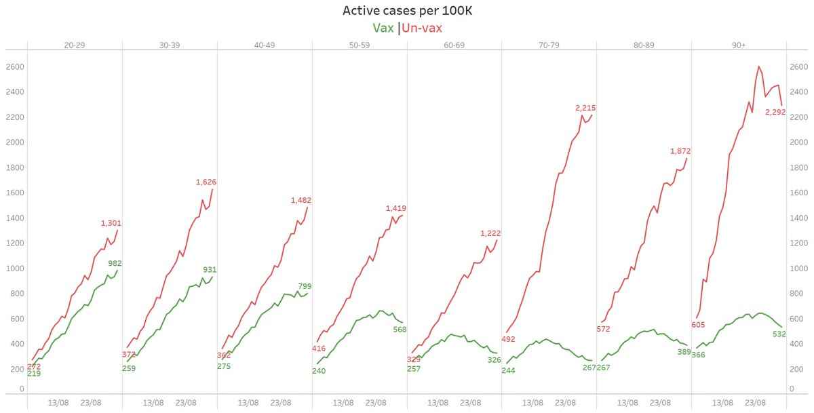</img></a><a href="E-JhKe6VcAMD_S5.jpg"  >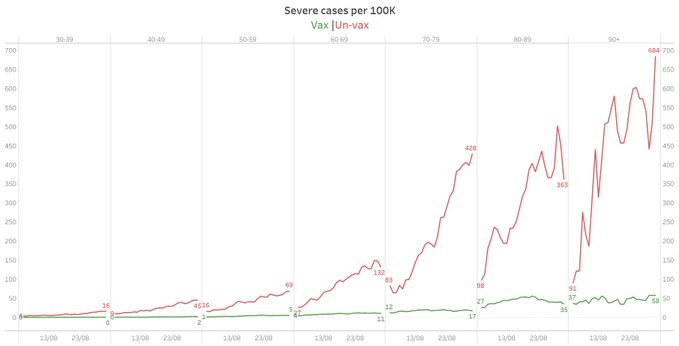</img></a>

---

<a href="https://twitter.com/erictopol/status/1432816654296104964" target="_blank" rel="noreferer">21:24 UCT</a>

RT @chngin_the_wrld: How about a little #COVID19vaccine humor on the elusiveness of #herdimmunity? I bet @EricTopol will get a kick out of…

---

<a href="https://twitter.com/erictopol/status/1432828020398514176" target="_blank" rel="noreferer">22:09 UCT</a>

RT @GHS: “We now have over one hundred and two thousand hospitalized Americans, and we have no idea what proportion are vaccinated or not v…

---

<a href="https://twitter.com/erictopol/status/1432832547625394186" target="_blank" rel="noreferer">22:27 UCT</a>

Should antibody levels be used to guide booster shots?
https://www.researchsquare.com/article/rs-858160/v1
A new preprint poses that question, showing marked heterogeneity in 1,060 people after vaccination or prior covid
(neutralizing antibody level not measured) 

<a href="E-JwpGtVkAAJ5A3.jpg"  >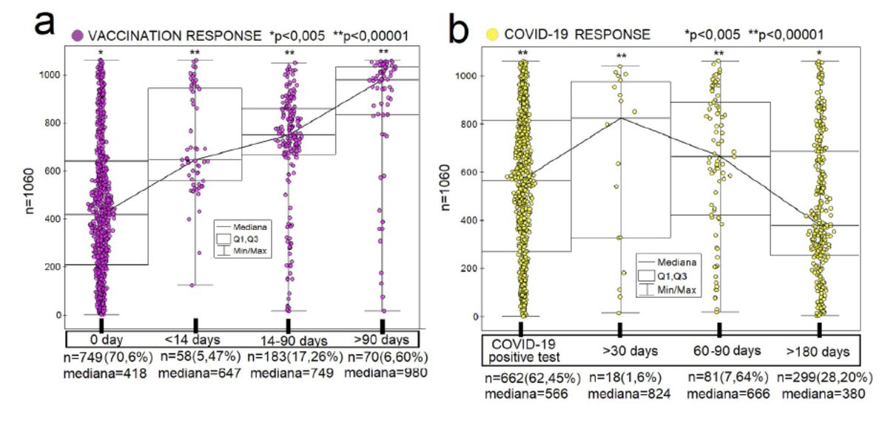</img></a>

---

<a href="https://twitter.com/erictopol/status/1432836274017103881" target="_blank" rel="noreferer">22:42 UCT</a>

Kentucky and South Carolina trying to become the next Mississippi and Florida 

<a href="E-J09ECVEAA-Aa6.jpg"  >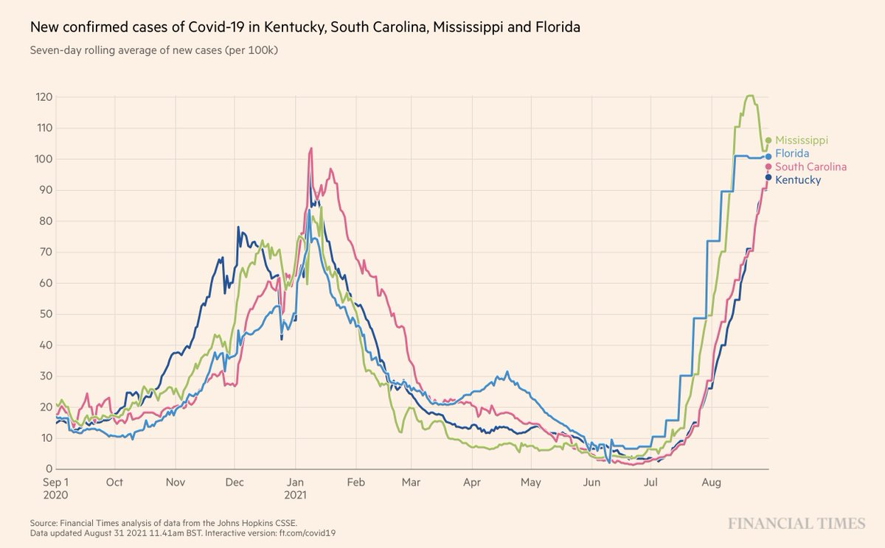</img></a>

---

<a href="https://twitter.com/erictopol/status/1432855689987121152" target="_blank" rel="noreferer">23:59 UCT</a>

🇳🇿 prepared for Delta with led to quick control of their Delta outbreak, 50 cases today
410 days of the pandemic with ZERO community transmissions
https://www.health.govt.nz/our-work/diseases-and-conditions/covid-19-novel-coronavirus/covid-19-data-and-statistics/covid-19-source-cases
Thanks for inputs by @conal_tuohy and @Thoughtfulnz 

<a href="E-KFHhXVQAIB2Yb.jpg"  >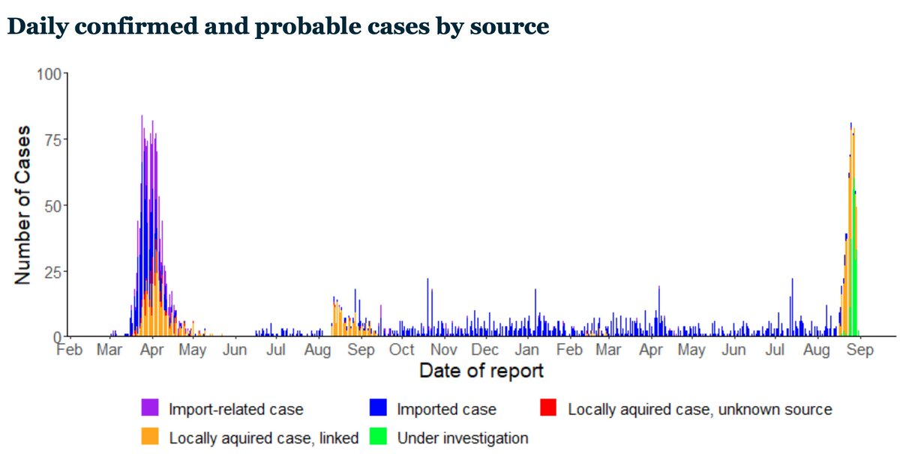</img></a>