+++
title = "Tweets by Eric Topol Sept 01"
Summary = ""
tags = ["Twitter"]
category = "Twitter"
+++

---

<a href="https://twitter.com/erictopol/status/1432880624042274822" target="_blank" rel="noreferer">01:38 UCT</a>

With vaccinations, the UK suppressed covid deaths in their Delta wave (compared with Alpha) by &gt; 90%
In the US, that suppression is &lt; 60%
https://newsnodes.com/us
US 7-day average now &gt; 1300 deaths 

<a href="E-KdO91UcAAq-Yp.jpg"  >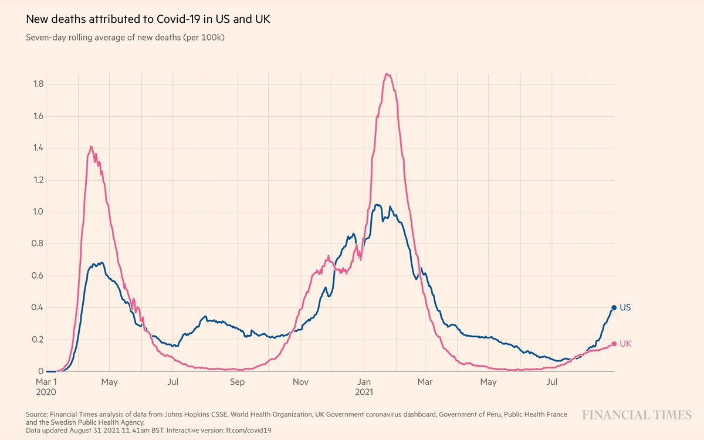</img></a><a href="E-Kcm-tUUAECLLy.jpg"  >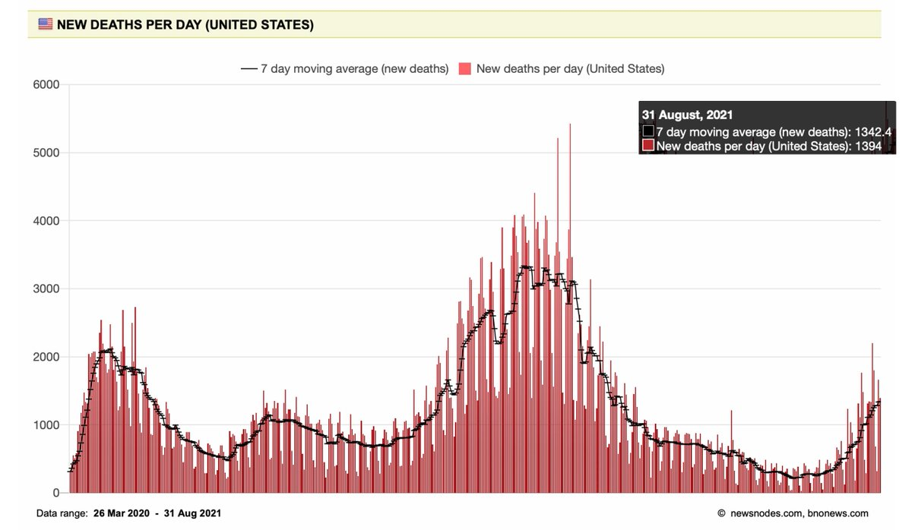</img></a>

---

<a href="https://twitter.com/erictopol/status/1432890285353099269" target="_blank" rel="noreferer">02:17 UCT</a>

@PeterHotez @nytimes @tarahaelle Spot on Peter and @tarahaelle 

<a href="E-Kl_usUUAAuHMn.jpg"  >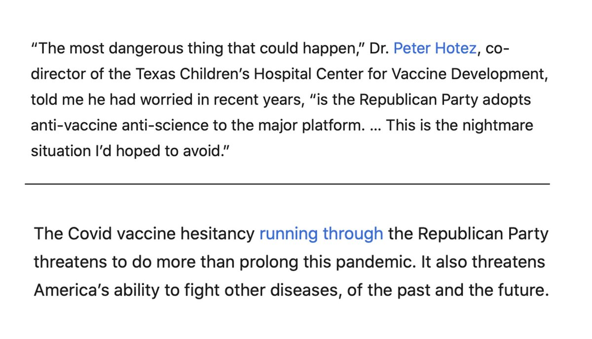</img></a>

---

<a href="https://twitter.com/erictopol/status/1432935856772300804" target="_blank" rel="noreferer">05:18 UCT</a>

The irony of a @CDCgov Advisory Committee ACIP physician offered an unsolicited booster shot by his physician
https://www.ft.com/content/4c140ede-1b13-4b7f-ae8e-5a0a709b64be @FT by @nikasgari 

<a href="E-LOyUkVkAYpBmR.jpg"  >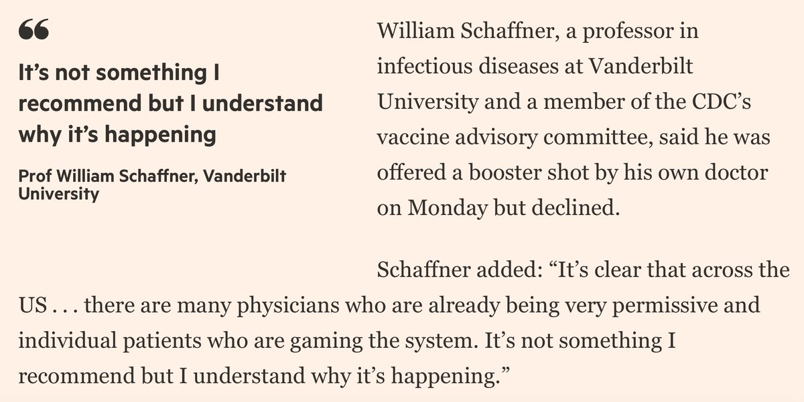</img></a>

---

<a href="https://twitter.com/erictopol/status/1433050779657506825" target="_blank" rel="noreferer">12:55 UCT</a>

Adjacent countries, yet so far apart
🇨🇦🇺🇸 

<a href="E-LT68SVEAIwmKd.jpg"  >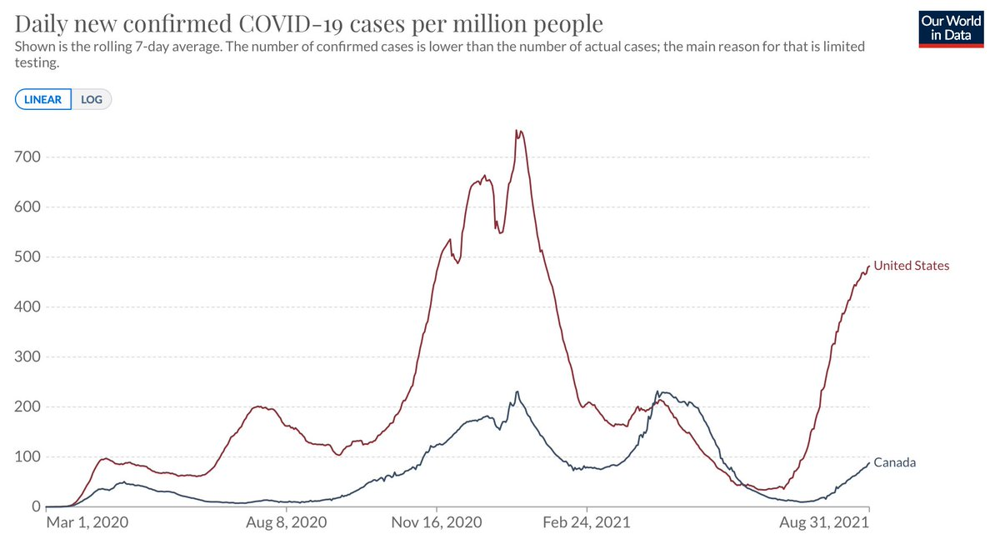</img></a><a href="E-LTkK1VQAoJZe0.jpg"  >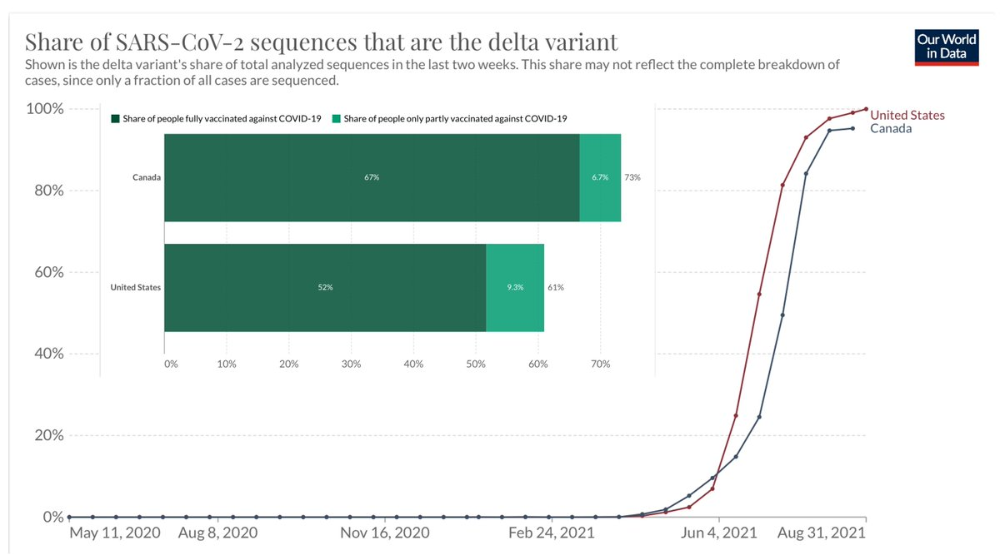</img></a><a href="E-LTmddVQAIBsYk.jpg"  >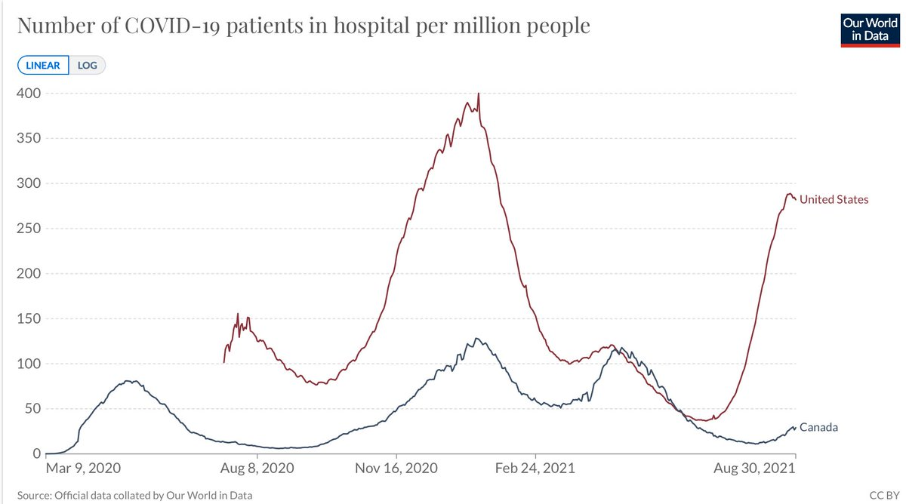</img></a><a href="E-LTp1IUUAMesgk.jpg"  >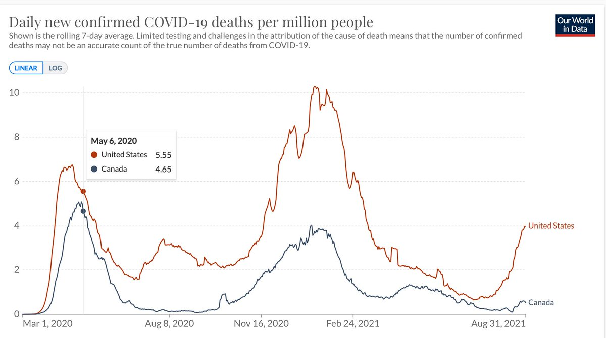</img></a>

---

<a href="https://twitter.com/erictopol/status/1433055144845844481" target="_blank" rel="noreferer">13:12 UCT</a>

Our covid times :-) 

<a href="E-M78VGVUAAO6D6.jpg"  >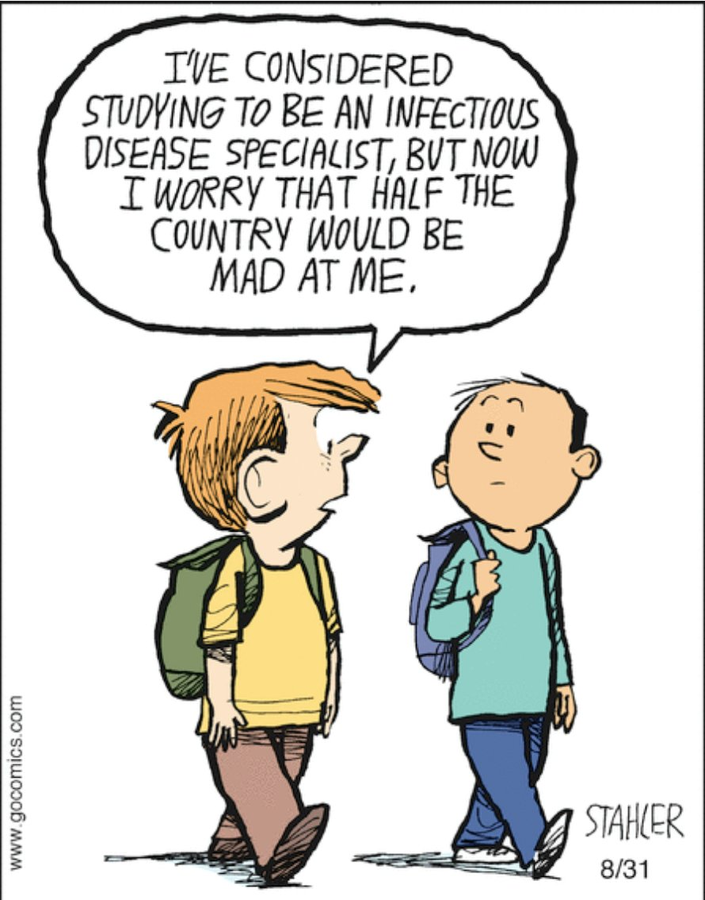</img></a>

---

<a href="https://twitter.com/erictopol/status/1433059147138748419" target="_blank" rel="noreferer">13:28 UCT</a>

This doesn't look good
"First findings from world’s largest study on #LongCovid  in children" 
https://www.sciencemediacentre.org/first-findings-from-worlds-largest-study-on-long-covid-in-children/
https://www.sciencemediacentre.org/expert-reaction-to-preprint-from-the-clock-study-looking-at-long-covid-in-children/
https://www.ft.com/content/31c30156-e446-469a-86d6-a1b93ccf91a0  @mroliverbarnes @FT @AlabiOso where is the preprint to review? 

<a href="E-M_DYZVUAY2kay.jpg"  >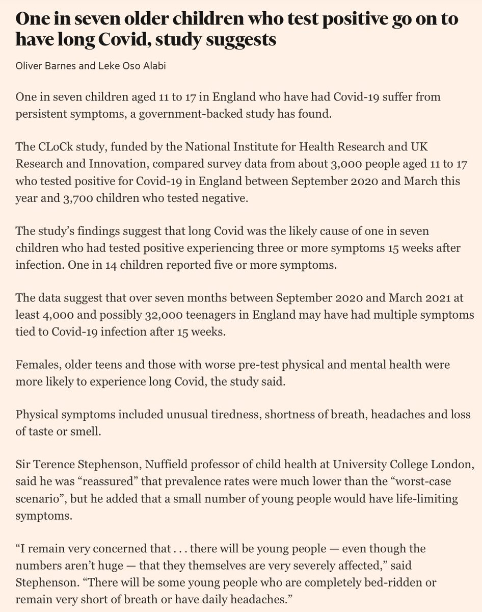</img></a>

---

<a href="https://twitter.com/erictopol/status/1433060471054028805" target="_blank" rel="noreferer">13:33 UCT</a>

@FanchetAldo Thank you!

---

<a href="https://twitter.com/erictopol/status/1433063291979399171" target="_blank" rel="noreferer">13:44 UCT</a>

From the preprint and its supplementary material (thanks to @FanchetAldo for the link)
https://assets.researchsquare.com/files/rs-798316/v1/8322114d-03ed-42ad-8fdb-883a05a64643.pdf?c=1628633145 

<a href="E-NDEFBVgAMAZlN.png"  >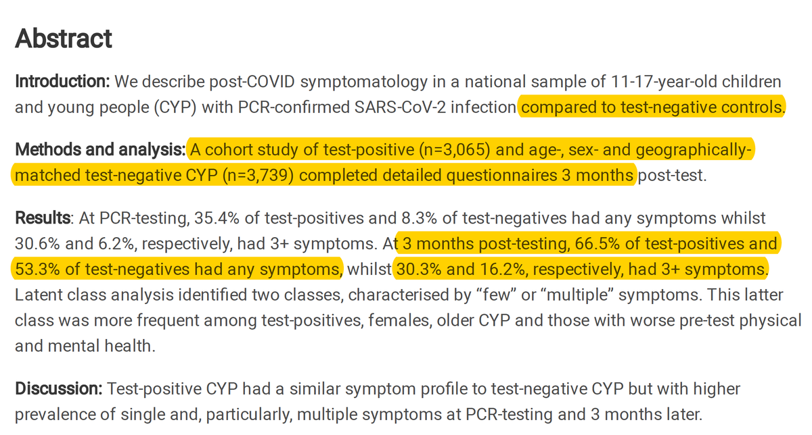</img></a><a href="E-NDG1IVIAEUOb1.jpg"  >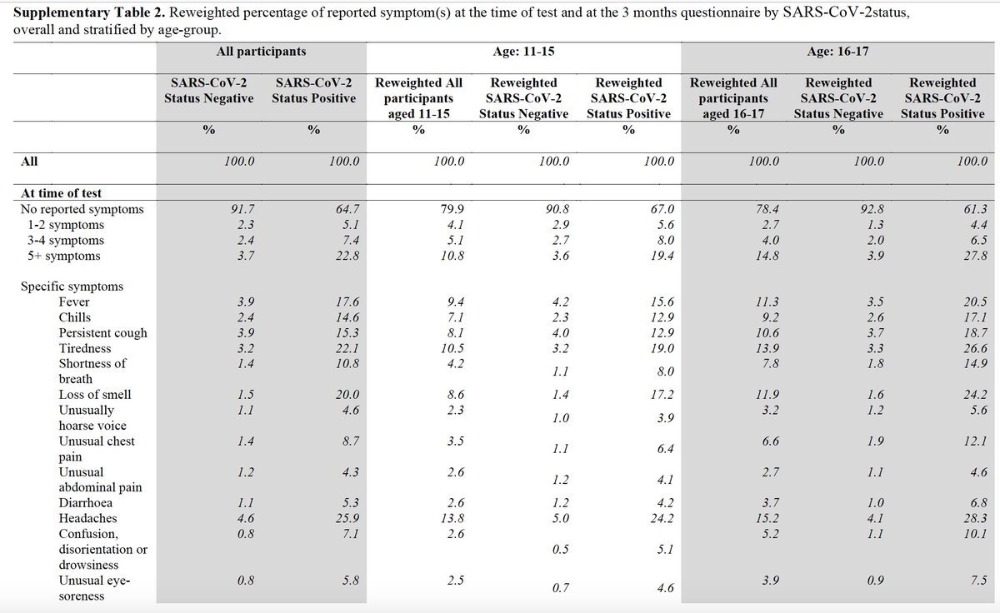</img></a>

---

<a href="https://twitter.com/erictopol/status/1433065133136248836" target="_blank" rel="noreferer">13:52 UCT</a>

Same Delta %, absolute 15 per cent total population difference in fully vaccinated, other factors not easily quantified.
US vs Canada now
5X cases
8X hospitalizations
10X deaths

---

<a href="https://twitter.com/erictopol/status/1433066410633154560" target="_blank" rel="noreferer">13:57 UCT</a>

@cshperspectives Likely contributes. But I wonder if relative lack of anti-science, anti-vaxx movement influence, and civic duty/social contract are dominant factors

---

<a href="https://twitter.com/erictopol/status/1433067189444046848" target="_blank" rel="noreferer">14:00 UCT</a>

@AlphonseSoued There are no such data for the United States, a serious problem that I have been writing about. If there were, I’d certainly be posting it

---

<a href="https://twitter.com/erictopol/status/1433074082665304077" target="_blank" rel="noreferer">14:27 UCT</a>

Do Delta waves follow a 2-month cycle? 
Good graph by @ashhwu @nytgraphics 
I don't think so. But while they are happening in select countries they seem like it's forever.
Discussion by @DLeonhardt 
https://twitter.com/DLeonhardt/status/1433051835913355266 

<a href="E-NM9N-VkAMgJqk.jpg"  >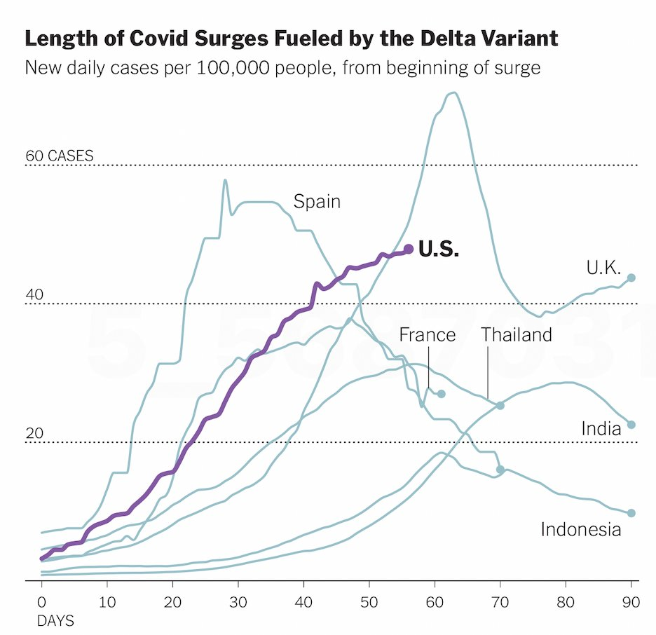</img></a>

---

<a href="https://twitter.com/erictopol/status/1433077932793077766" target="_blank" rel="noreferer">14:42 UCT</a>

A soundbite that went viral but wasn't accurate
https://apnews.com/article/health-pandemics-coronavirus-pandemic-9845c7257300ff6546c20489e642a1ea @AP

---

<a href="https://twitter.com/erictopol/status/1433092000274739205" target="_blank" rel="noreferer">15:38 UCT</a>

A repurposed drug JAK blocker, used for rheumatoid arthritis, discovered to have potential for severe Covid via #AI, in a randomized trial, has a very significant reduction of mortality (more than dexamethasone or IL-6 blockade) and excellent safety
https://www.thelancet.com/journals/lanres/article/PIIS2213-2600(21)00331-3/fulltext 

<a href="E-NdI_sUUAELupq.jpg"  >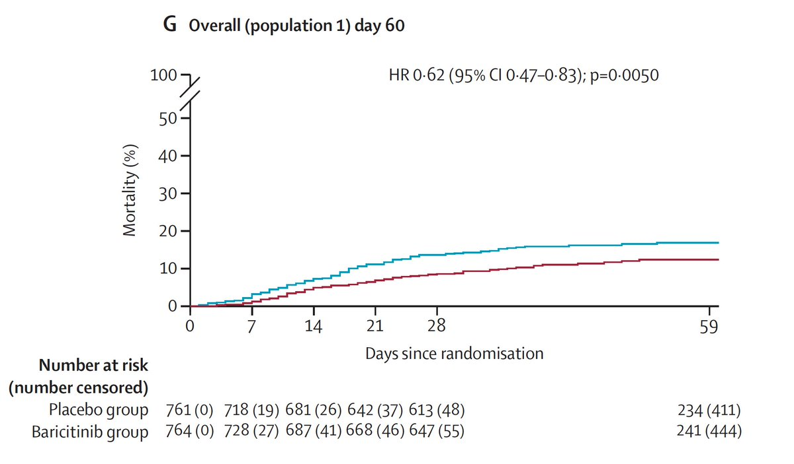</img></a>

---

<a href="https://twitter.com/erictopol/status/1433092007941996548" target="_blank" rel="noreferer">15:38 UCT</a>

Accompanying editorial
https://www.thelancet.com/journals/lanres/article/PIIS2213-2600(21)00358-1/fulltext
Yes, it's the 1st one.
And it gets little attention even though it's a big sign of progress 

<a href="E-NdXwyUYAg9IB4.jpg"  >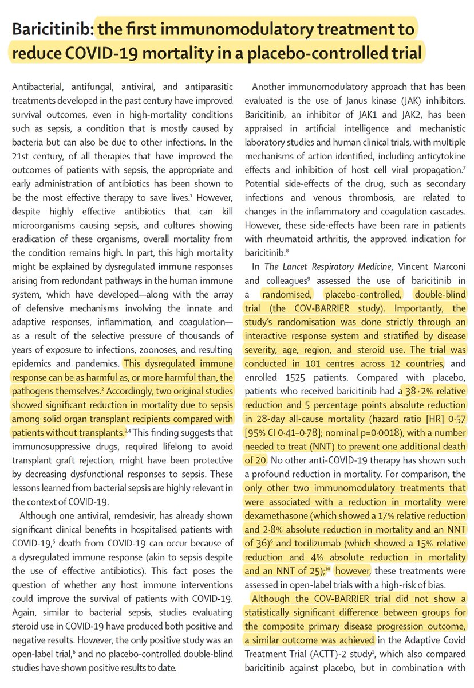</img></a><a href="E-NdZVsVgAAsARl.jpg"  >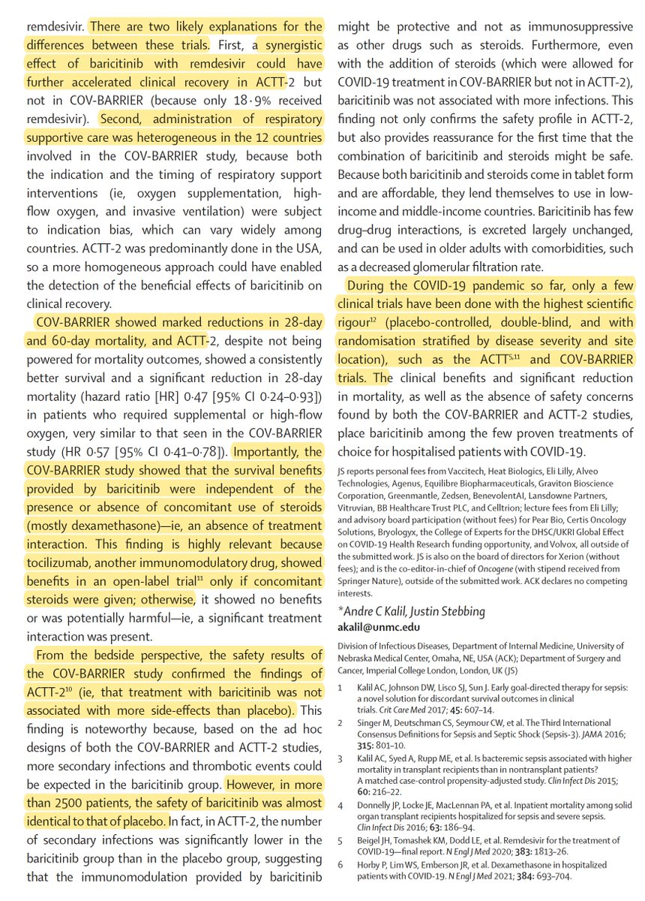</img></a>

---

<a href="https://twitter.com/erictopol/status/1433094800316657667" target="_blank" rel="noreferer">15:50 UCT</a>

Great thread by @WesElyMD with context for why this is such an important finding 
https://twitter.com/WesElyMD/status/1433084748835049478

---

<a href="https://twitter.com/erictopol/status/1433123855778729986" target="_blank" rel="noreferer">17:45 UCT</a>

Mu (B.1.621), the recent @WHO designated variant of interest, doesn't look like it has any chance to compete with Delta
http://outbreak.info 

<a href="E-N6X_YVEAAJ2DL.jpg"  >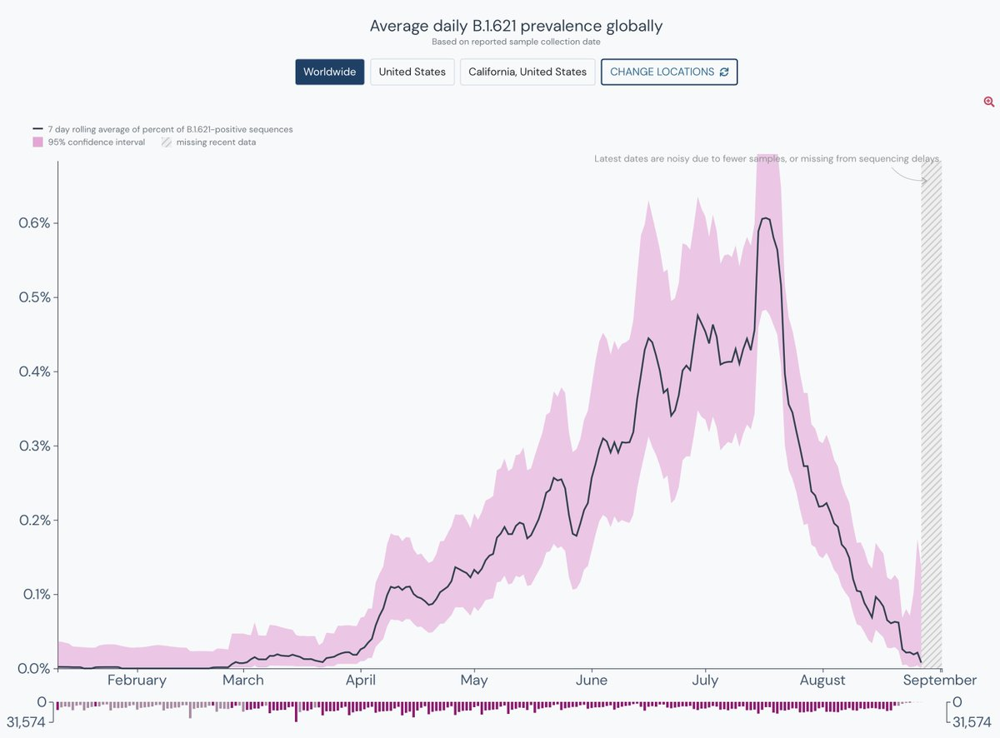</img></a><a href="E-N6ZOuUcAEVhsq.jpg"  >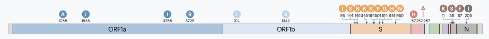</img></a><a href="E-N6asGVcAUG_YW.jpg"  >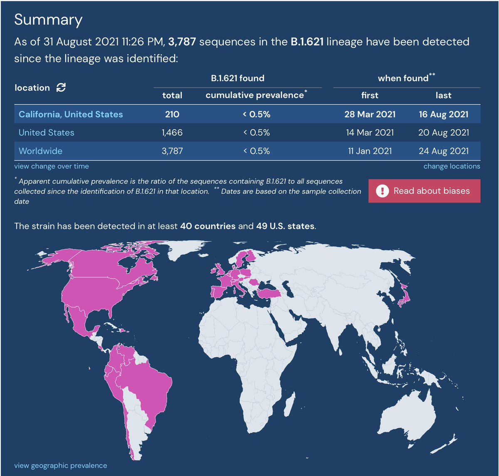</img></a>

---

<a href="https://twitter.com/erictopol/status/1433127686050701315" target="_blank" rel="noreferer">18:00 UCT</a>

RT @BillBramhall: Cartoon https://twitter.com/BillBramhall/status/1433127027217997824

<a href="E-N9bkaWYAQtDjT.jpg"  >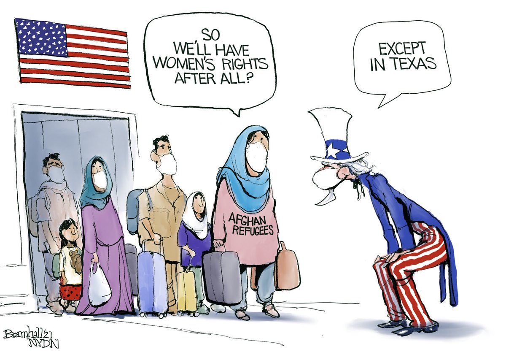</img></a>

---

<a href="https://twitter.com/erictopol/status/1433151366520721412" target="_blank" rel="noreferer">19:34 UCT</a>

Viral load, Delta infections, vaccinations and boosters
A new preprint suggests that viral load (by PCR Ct) of Pfizer breakthrough infections in initially much reduced (15-fold) but increases significantly by 3 months, and is reduced after a booster shot 
https://www.medrxiv.org/content/10.1101/2021.08.29.21262798v1 

<a href="E-OSwykUYAI9MgN.png"  >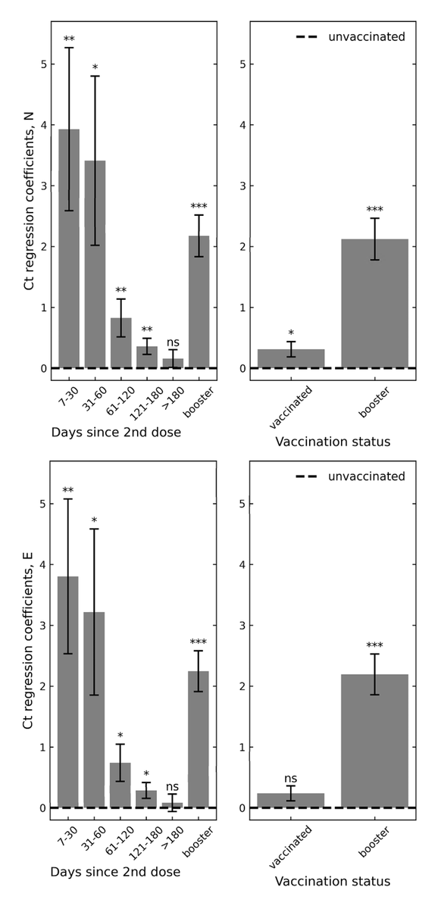</img></a>

---

<a href="https://twitter.com/erictopol/status/1433153861166845952" target="_blank" rel="noreferer">19:44 UCT</a>

Signs that the US Delta wave is losing steam
—Test positivity is decreasing
—Hospital admissions are decreasing, total hospitalizations at  a ~100,000 plateau
—Slowing in new case growth
Let's hope this continues........ 

<a href="E-OU8p_VEAAoPgL.jpg"  >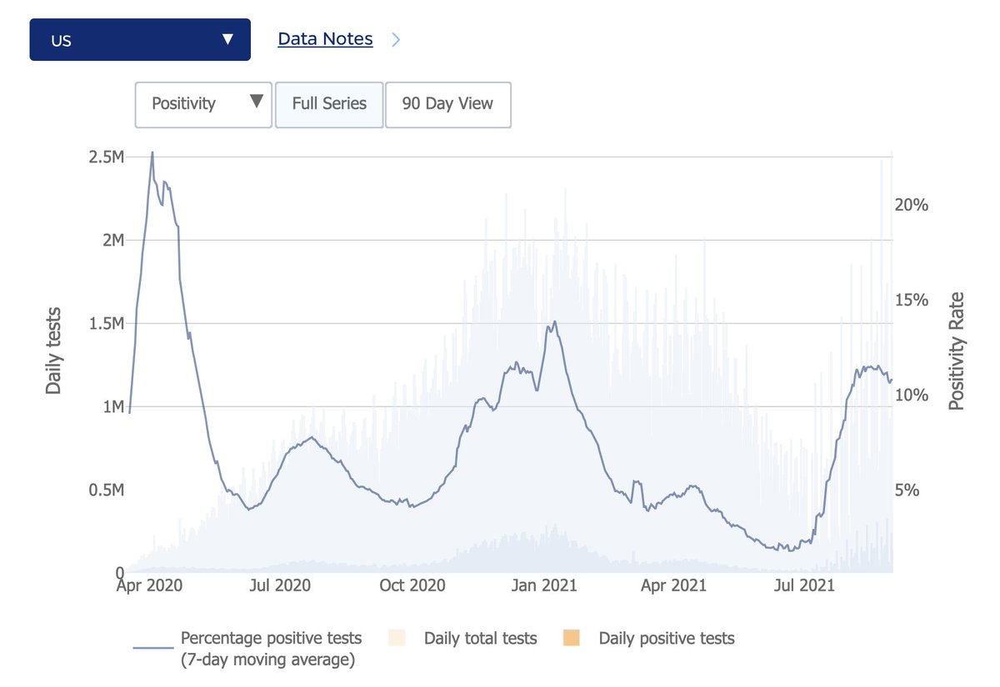</img></a><a href="E-OVTKAVkAEgE2r.jpg"  >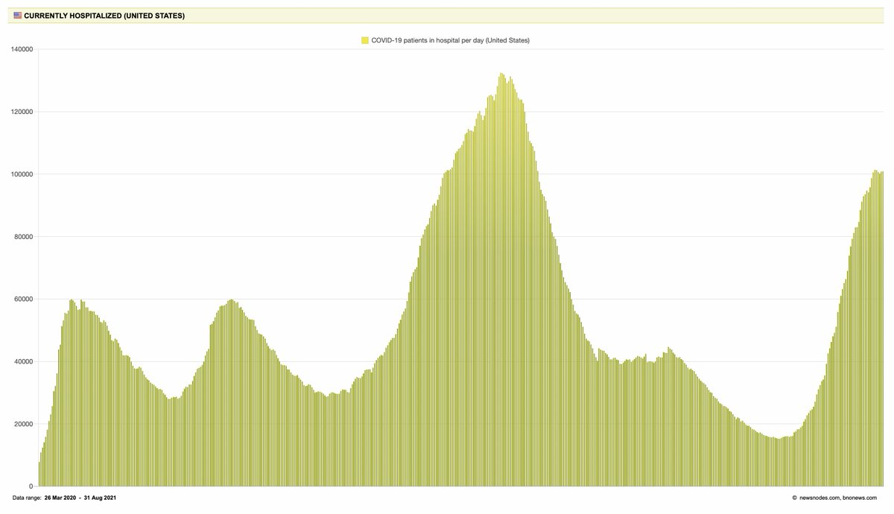</img></a><a href="E-OVf3tVgAYwd_s.jpg"  >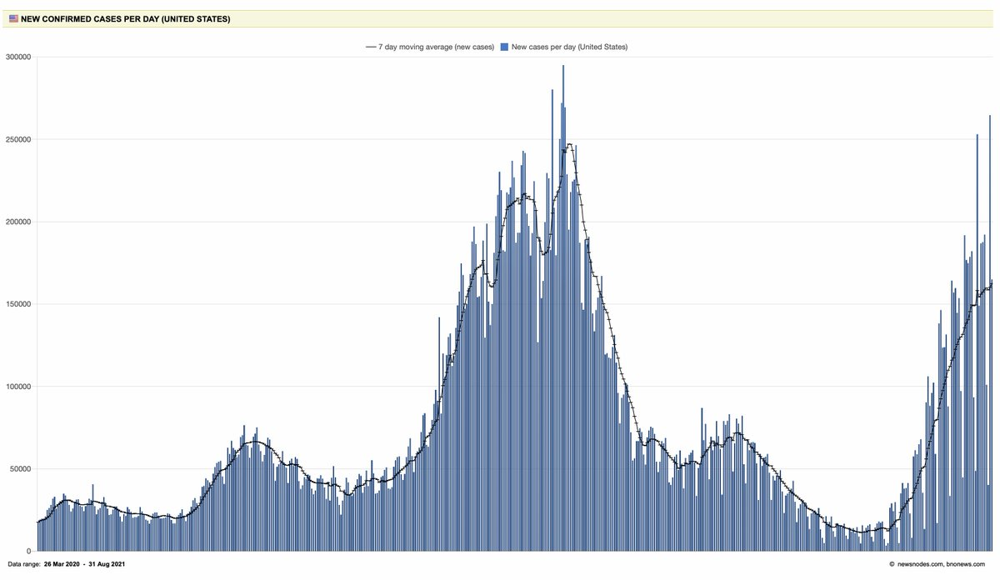</img></a>

---

<a href="https://twitter.com/erictopol/status/1433155147501162497" target="_blank" rel="noreferer">19:49 UCT</a>

Israel's Delta U-turn begins.
While the US and UK converge. 

<a href="E-OW3dDVIAEBkFz.jpg"  >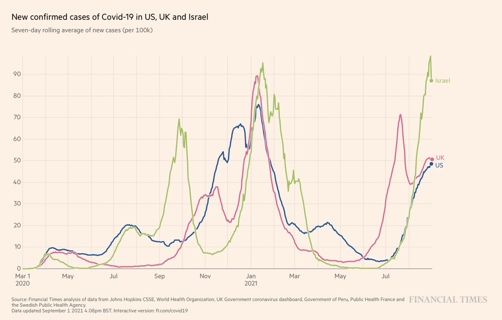</img></a>

---

<a href="https://twitter.com/erictopol/status/1433166062225395713" target="_blank" rel="noreferer">20:33 UCT</a>

@PeterHotez Right, Peter. Trying to be optimistic which is hard, especially with the school opening factor And just because we descend (which hasn't happened yet), doesn't mean that it's stable....as seen in many places now.

---

<a href="https://twitter.com/erictopol/status/1433172826819813376" target="_blank" rel="noreferer">21:00 UCT</a>

Just published @NEJM
Breakthrough infections in health care workers before and during the Delta wave
mRNA Vaccine effectiveness vs symptomatic infections dropped from 94% to 66% [95% CI 49,77] 

<a href="E-OiCAMWEAYfa4H.jpg"  >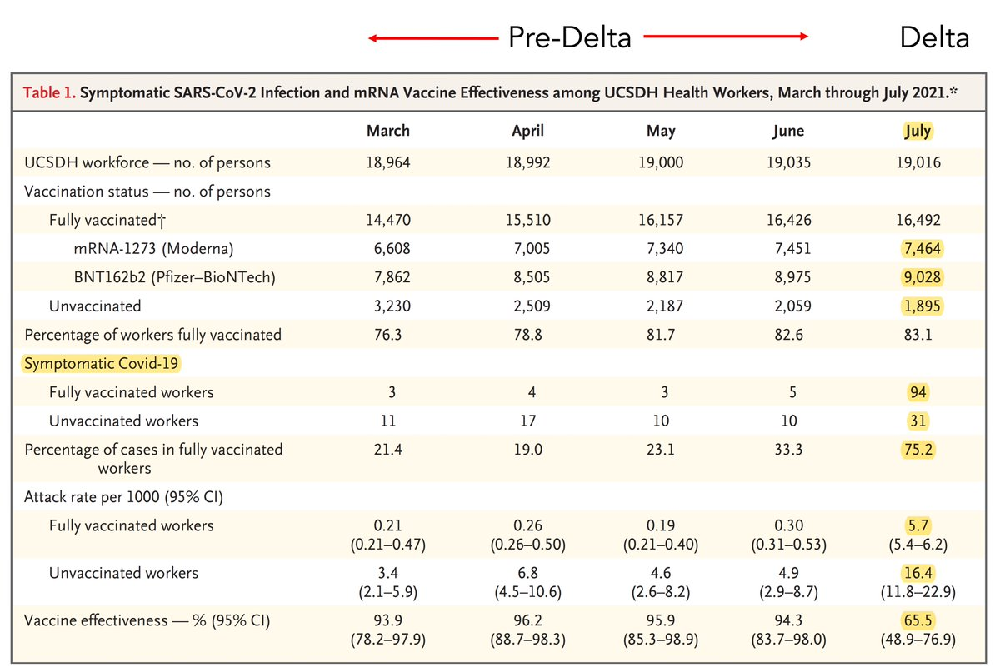</img></a>

---

<a href="https://twitter.com/erictopol/status/1433172836315717636" target="_blank" rel="noreferer">21:00 UCT</a>

"Our data suggest that vaccine effectiveness against any symptomatic disease is considerably lower against the Delta variant and may wane over time since vaccination"
The breakthrough attack rate went from pre-Delta 0.25/100,000 to Delta 5.7/100,000 in fully vaccinated (23-fold) 

<a href="E-OjlpnWUAg6z5_.jpg"  >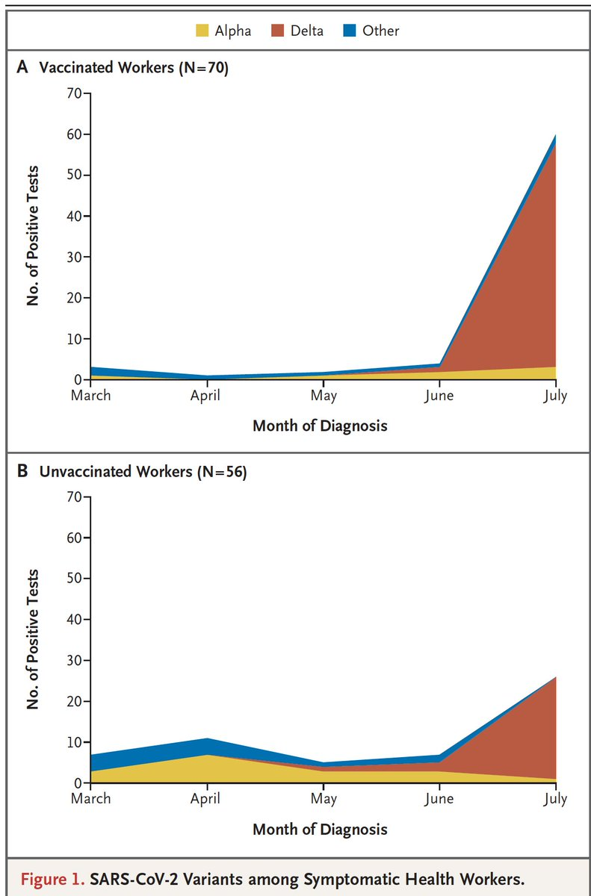</img></a>

---

<a href="https://twitter.com/erictopol/status/1433173437380501509" target="_blank" rel="noreferer">21:02 UCT</a>

Here's the link to the report
https://www.nejm.org/doi/full/10.1056/NEJMc2112981?query=featured_home
which aligns to what I have been highlighting w/r to reduced mRNA vaccine effectiveness in the Delta wave vs *symptomatic* disease

---

<a href="https://twitter.com/erictopol/status/1433175607198818304" target="_blank" rel="noreferer">21:11 UCT</a>

Remember the primary endpoint of the clinical trials for covid vaccines was reduction in symptomatic infections. That's what this is about.
It is NOT about protection from hospitalization or deaths, which is still well preserved by these vaccines at 6 months + Delta

---

<a href="https://twitter.com/erictopol/status/1433205137984540679" target="_blank" rel="noreferer">23:08 UCT</a>

New @TheLancet 
The heightened immune response to longer spacing @AstraZeneca 1st -&gt; 2nd vaccine doses and the response 3rd booster dose, with high neutralizing antibodies and T cells
https://www.thelancet.com/journals/lancet/article/PIIS0140-6736(21)01699-8/fulltext 

<a href="E-PD2HAUUAA1nBo.jpg"  >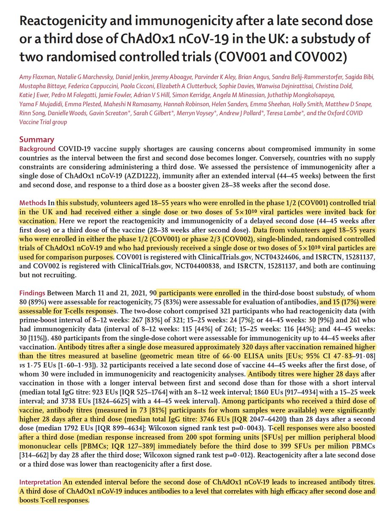</img></a><a href="E-PD4APVcAcPjcJ.jpg"  >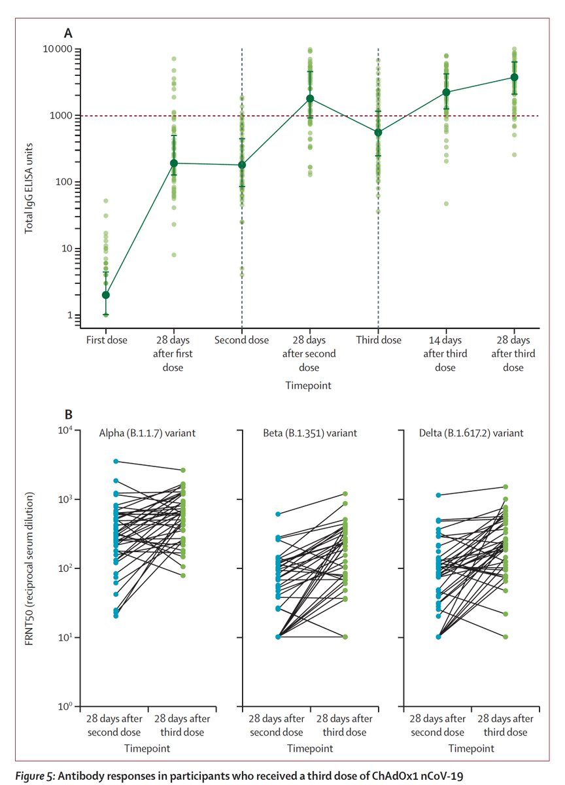</img></a>