+++
title = "Tweets by Eric Topol Sept 02"
Summary = ""
tags = ["Twitter"]
category = "Twitter"
+++

---

<a href="https://twitter.com/erictopol/status/1433273455370141697" target="_blank" rel="noreferer">03:39 UCT</a>

Other studies in the past week with consistent findings of decline in protection vs symptomatic infections
https://twitter.com/EricTopol/status/1431623165495496719

---

<a href="https://twitter.com/erictopol/status/1433282855107317760" target="_blank" rel="noreferer">04:17 UCT</a>

The kidneys are not getting enough attention in #LongCovid. A new, large study of ~90,000 people w/ Covid @DeptVetAffairs and controls
https://jasn.asnjournals.org/content/early/2021/08/25/ASN.2021060734 by @zalaly and colleagues @ASNKidney https://www.nytimes.com/2021/09/01/health/covid-kidney-damage.html by @PamBelluck 

<a href="E-QJB2yVkAEQHBR.jpg"  >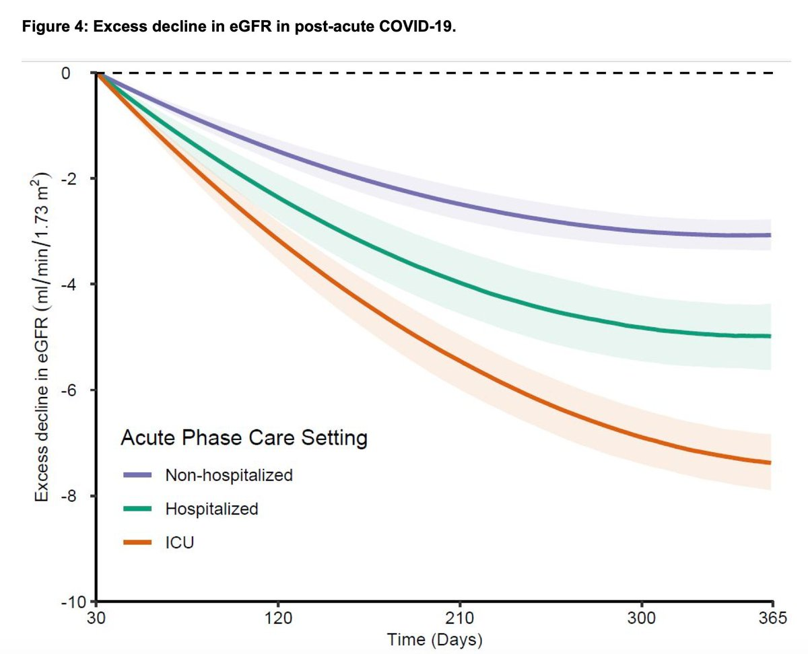</img></a><a href="E-QJW_yVUAEV0kD.jpg"  >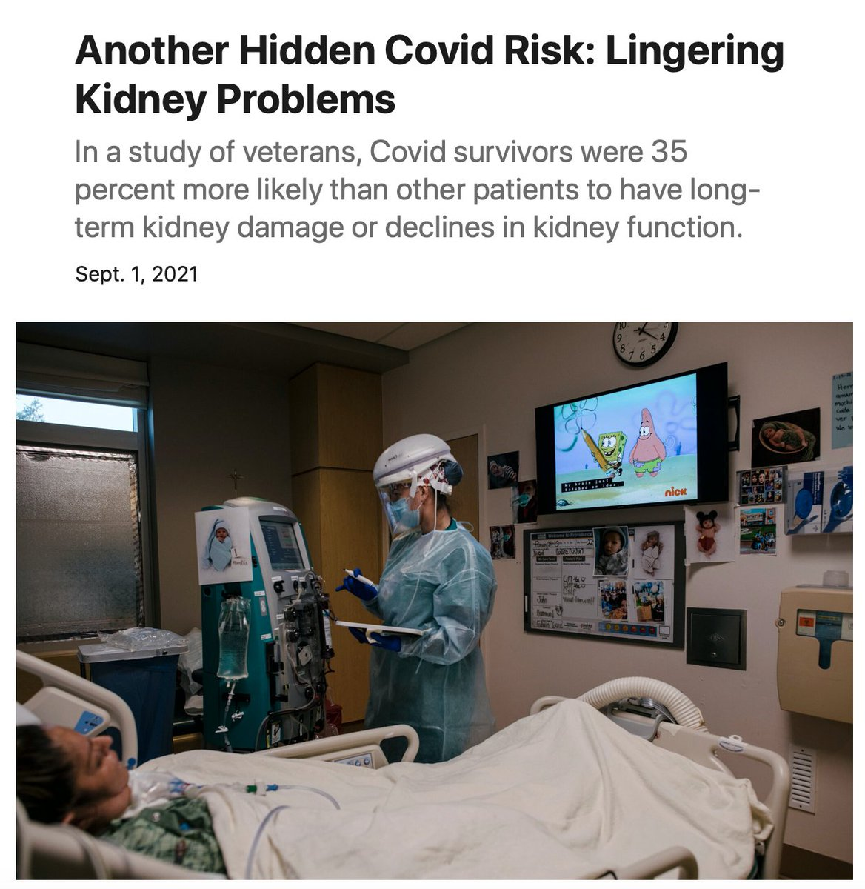</img></a>

---

<a href="https://twitter.com/erictopol/status/1433426148122189830" target="_blank" rel="noreferer">13:46 UCT</a>

Good to see: Some of the first data to show vaccinations reduce the chance of #LongCovid when a breakthrough infection occurs, perhaps as much as 50%, via self-reported symptoms
https://www.thelancet.com/journals/laninf/article/PIIS1473-3099(21)00460-6/fulltext @TheLancetInfDis 
https://www.nytimes.com/2021/09/01/health/breakthrough-infections-long-covid.html?searchResultPosition=1 by @EmilyAnthes 

<a href="E-SM3eYVUAsfeZp.jpg"  >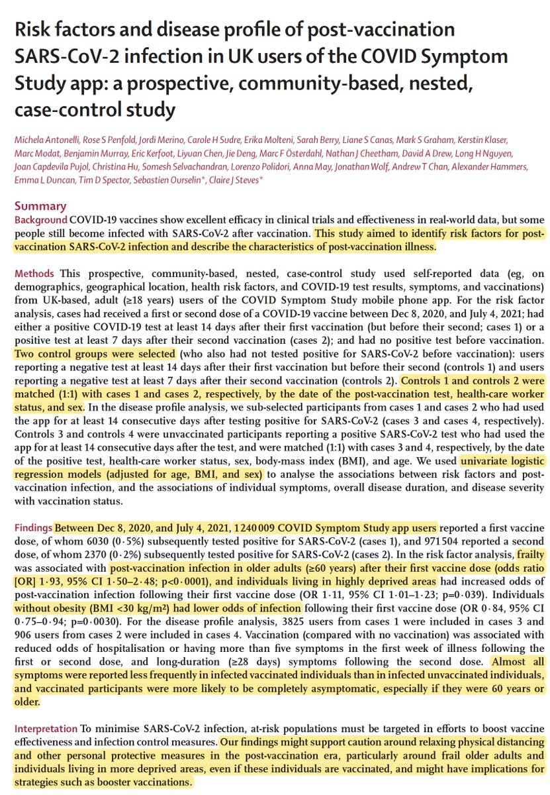</img></a><a href="E-SNPKsUcAEQOos.jpg"  >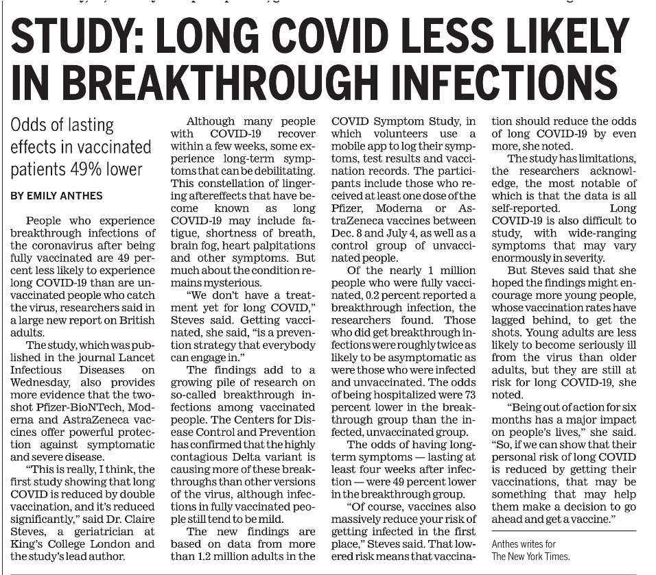</img></a>

---

<a href="https://twitter.com/erictopol/status/1433430686241722379" target="_blank" rel="noreferer">14:04 UCT</a>

3 Southern states are newly leading the US pandemic and currently have more new cases/100,000 people than any country of the world 

<a href="E-SRDDKVgAkIAZj.jpg"  >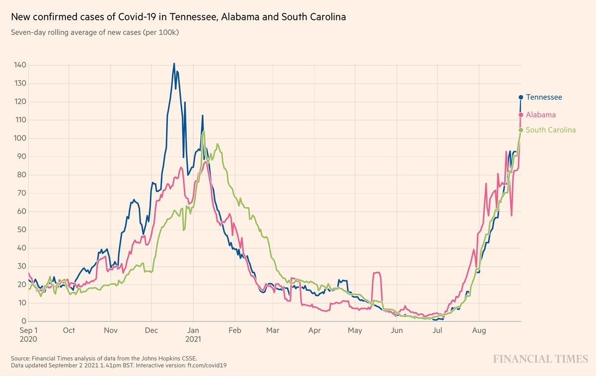</img></a>

---

<a href="https://twitter.com/erictopol/status/1433432972498067467" target="_blank" rel="noreferer">14:13 UCT</a>

At ≥ 28 days post-infection assessment, 11.4% of the unvaccinated control group had persistent symptoms (a rate in keeping with prior reports) which was reduced to 5.2% in the vaccinated group

---

<a href="https://twitter.com/erictopol/status/1433435150503735297" target="_blank" rel="noreferer">14:22 UCT</a>

Key point in editorial
"These data importantly assuage concerns about the potential for impaired responses after repeated use of a replication deficient simian adenoviral vector and suggest that a 3rd dose ... could be successful if necessary."
https://www.thelancet.com/journals/lancet/article/PIIS0140-6736(21)01817-1/fulltext 

<a href="E-SVj8zVIAQ0Yad.jpg"  >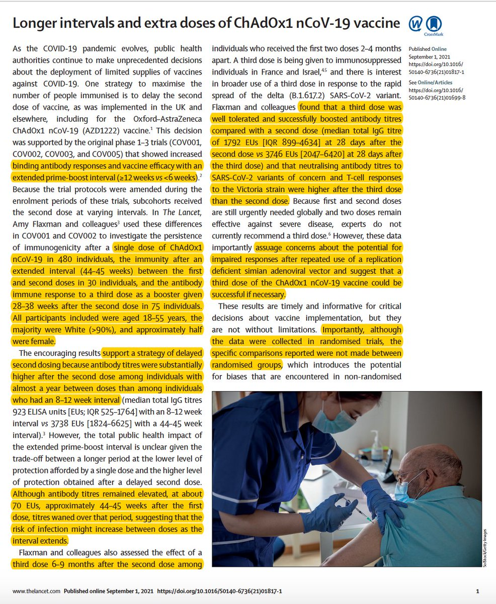</img></a>

---

<a href="https://twitter.com/erictopol/status/1433447242443091973" target="_blank" rel="noreferer">15:10 UCT</a>

A second study shows markedly higher antibody response for @moderna_tx compared with @Pfizer vaccination, especially in people age ≥ 50
@JAMANetworkOpen https://jamanetwork.com/journals/jamanetworkopen/fullarticle/2783685 

<a href="E-ScIfUUcAAgwiK.jpg"  >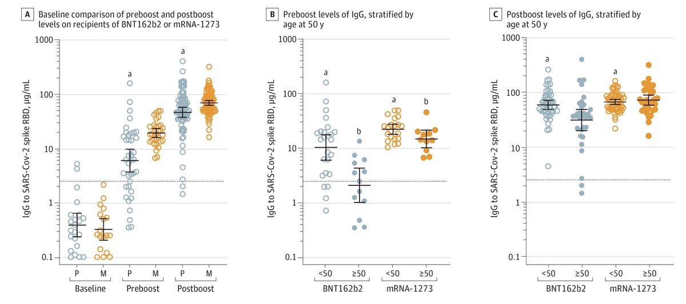</img></a>

---

<a href="https://twitter.com/erictopol/status/1433448004673892359" target="_blank" rel="noreferer">15:13 UCT</a>

Very consistent with the much larger study published earlier this week
https://twitter.com/EricTopol/status/1432436808042749952

---

<a href="https://twitter.com/erictopol/status/1433465783162601480" target="_blank" rel="noreferer">16:24 UCT</a>

A systematic review of #AI for mammography is very disappointing
"Thirty four (94%) of 36 AI systems evaluated in these studies were less accurate than a single radiologist, and all were less accurate than consensus of two or more radiologists"
https://www.bmj.com/content/374/bmj.n1872 @bmj_latest 

<a href="E-SwuhJVgAQ5Rax.jpg"  >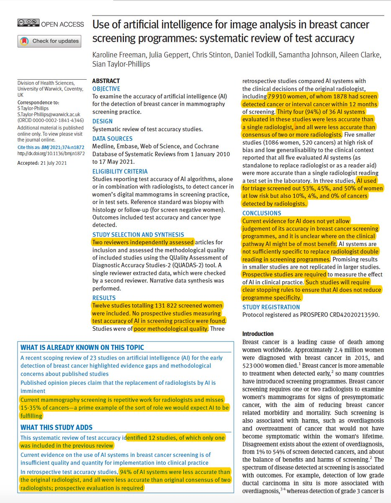</img></a><a href="E-SwvlSVkAAgpPj.jpg"  >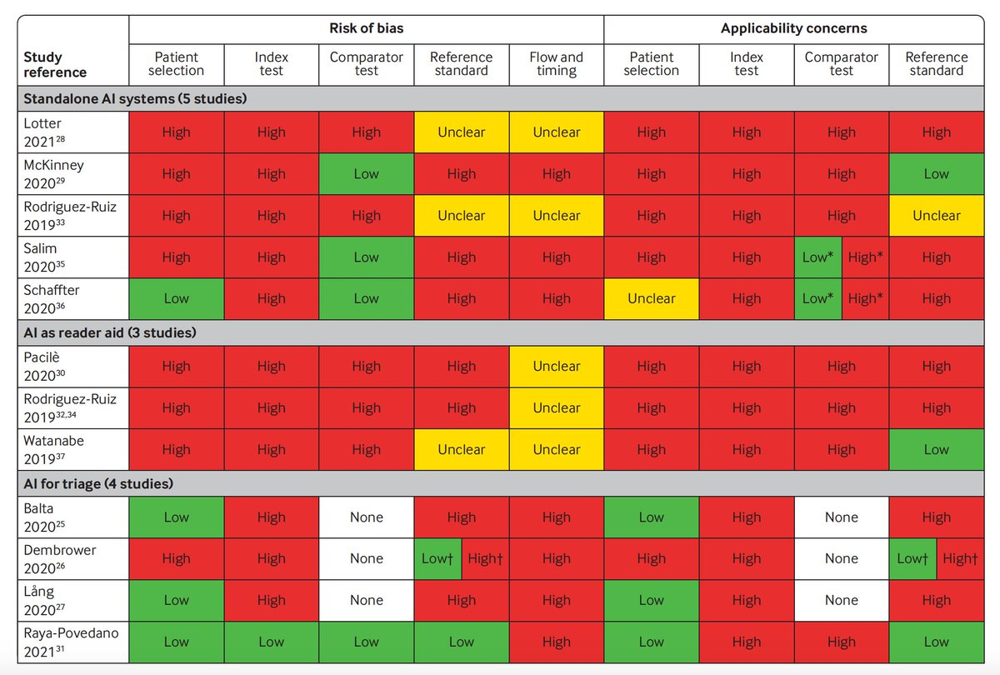</img></a><a href="E-SwxEXVQAIq3bo.jpg"  >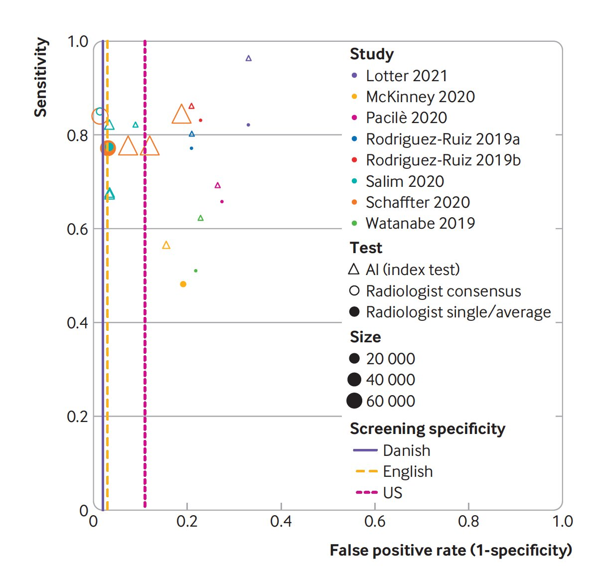</img></a>

---

<a href="https://twitter.com/erictopol/status/1433474136332931077" target="_blank" rel="noreferer">16:57 UCT</a>

A unique, high resolution study of 23 breakthrough infections (pre-Delta) shows how vaccination reduces transmission, leads to less virus culture positivity, for less days, less shedding, and may be tissue restricted (only found in saliva)
https://www.medrxiv.org/content/10.1101/2021.08.30.21262701v1 

<a href="E-S4hlUVkAQkWgF.jpg"  >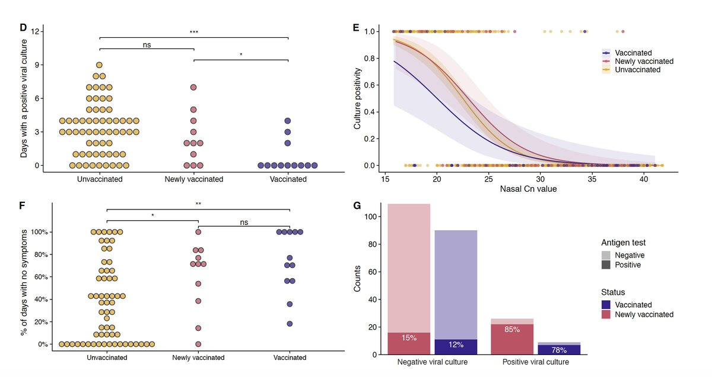</img></a>

---

<a href="https://twitter.com/erictopol/status/1433508794202394630" target="_blank" rel="noreferer">19:15 UCT</a>

@maddow It's about time @AmerMedicalAssn took a stand on this

---

<a href="https://twitter.com/erictopol/status/1433527755728056325" target="_blank" rel="noreferer">20:30 UCT</a>

Many countries have gotten &gt; 95% of people over age 65 fully vaccinated. The US is at 82%, which is leaving many vulnerable in this high-risk group. @paula_span is on it
https://www.nytimes.com/2021/09/02/health/covid-vaccines-seniors.html
(no less the immunity waning in the 1st group vaccinated &gt; 6 months ago)

---

<a href="https://twitter.com/erictopol/status/1433540946734444548" target="_blank" rel="noreferer">21:22 UCT</a>

@B333Si @LFL983 @doctorsoumya That is completely wrong. Cases are not soaring in Iceland now. 

<a href="E-T10z3VcBcAMtK.jpg"  >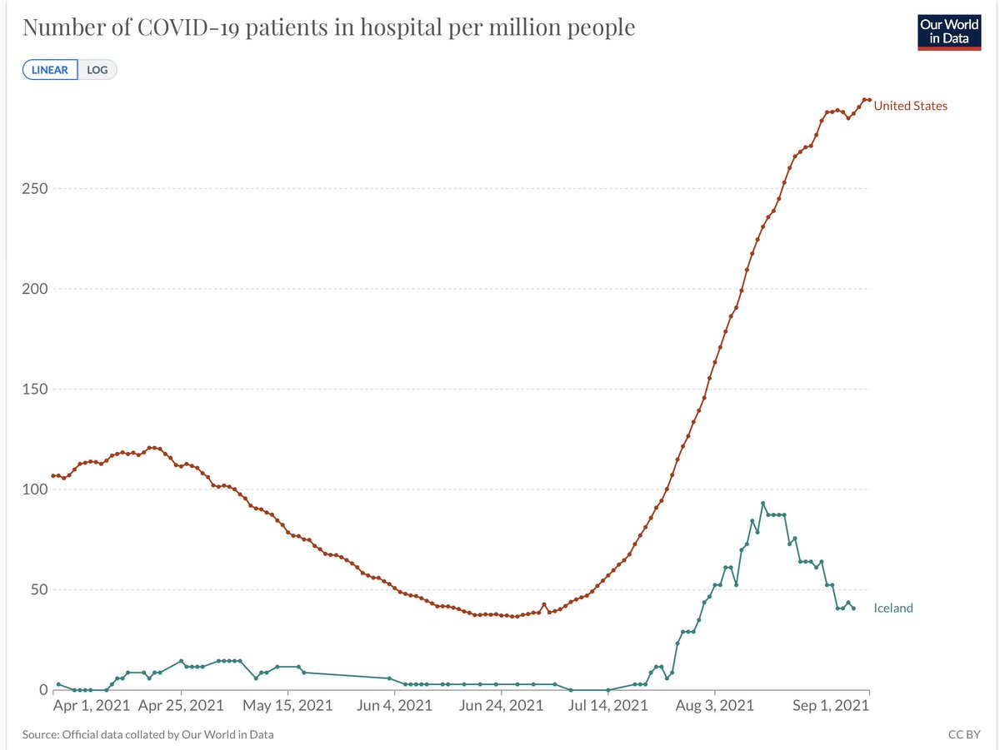</img></a>

---

<a href="https://twitter.com/erictopol/status/1433542848234745878" target="_blank" rel="noreferer">21:30 UCT</a>

Portugal is ~25 per cent points above the US in % fully vaccinated people, and one of top few of the world.
Look at how it has handled Delta vs the US. 

<a href="E-T3KwZVcB8fJOi.jpg"  ></img></a><a href="E-T3MNLUcAI8gs2.jpg"  >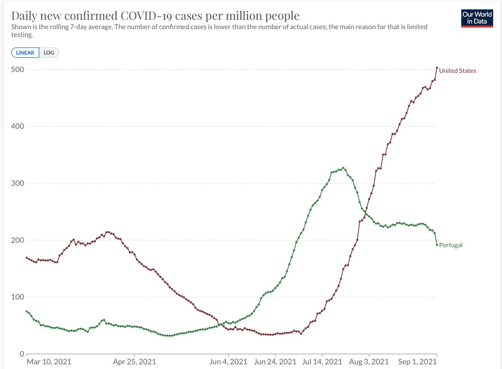</img></a><a href="E-T3NBXVcBIySQk.jpg"  >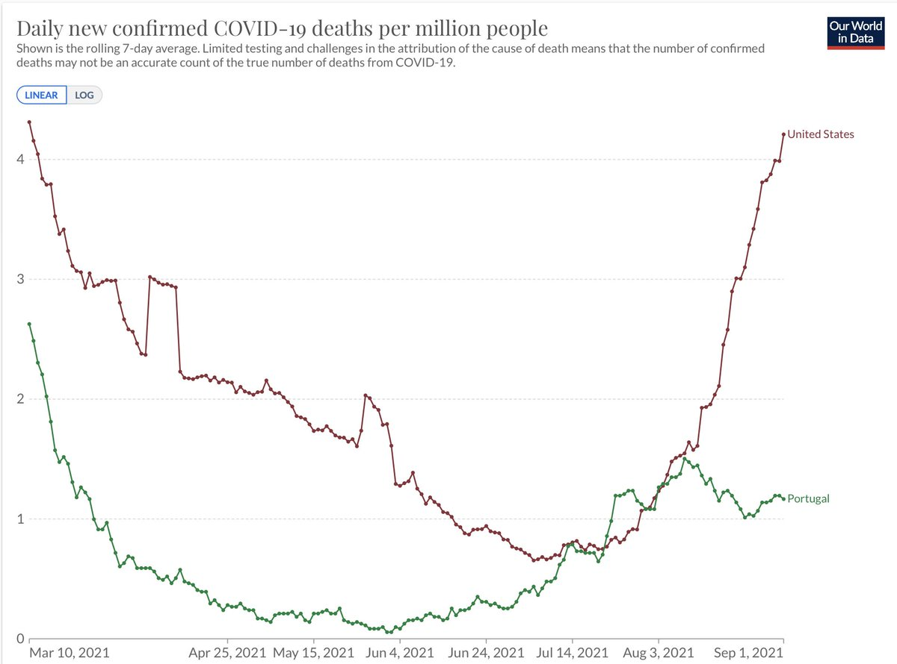</img></a><a href="E-T3QF0VcCcvFzQ.jpg"  >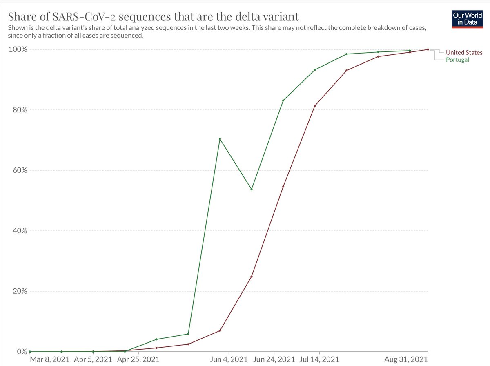</img></a>

---

<a href="https://twitter.com/erictopol/status/1433552461910867970" target="_blank" rel="noreferer">22:08 UCT</a>

Hospitalization graph (with correct country!) 

<a href="E-UAU0nVcEEkAud.jpg"  >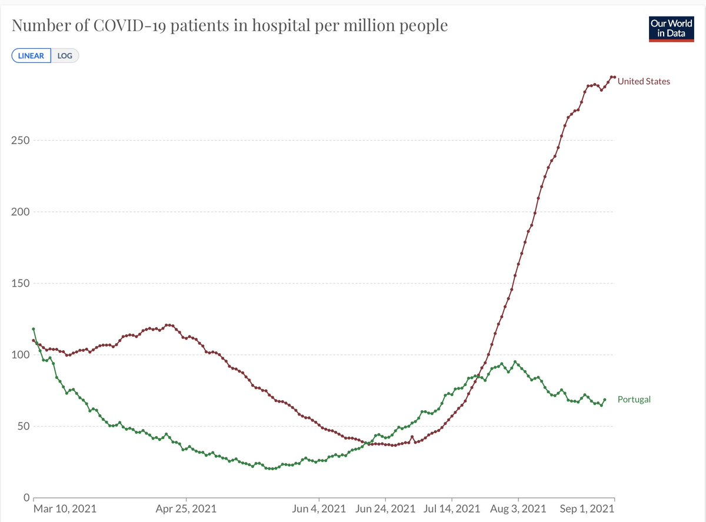</img></a>

---

<a href="https://twitter.com/erictopol/status/1433559123820363796" target="_blank" rel="noreferer">22:35 UCT</a>

The Delta wave impact in 14 countries by % vaccination and case spread
—Israel, no longer in the top 10 for vaccination, is an outlier, &gt; 100/100,000
—the US and UK ~50/100,000
—the rest are in descent or below 20/100,000
Delta can be beat. 11 of 14 countries are doing it. 

<a href="E-UENE2VQAEzuA0.jpg"  >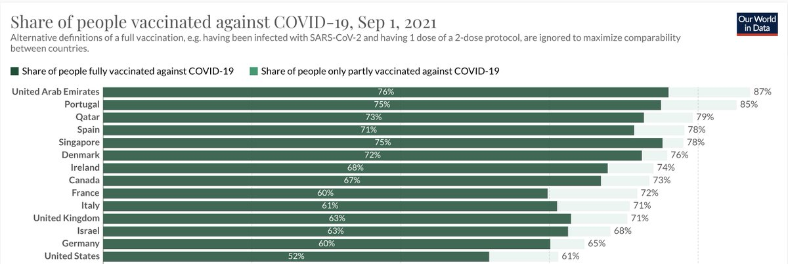</img></a><a href="E-UEaC7VkAQ6RS3.jpg"  >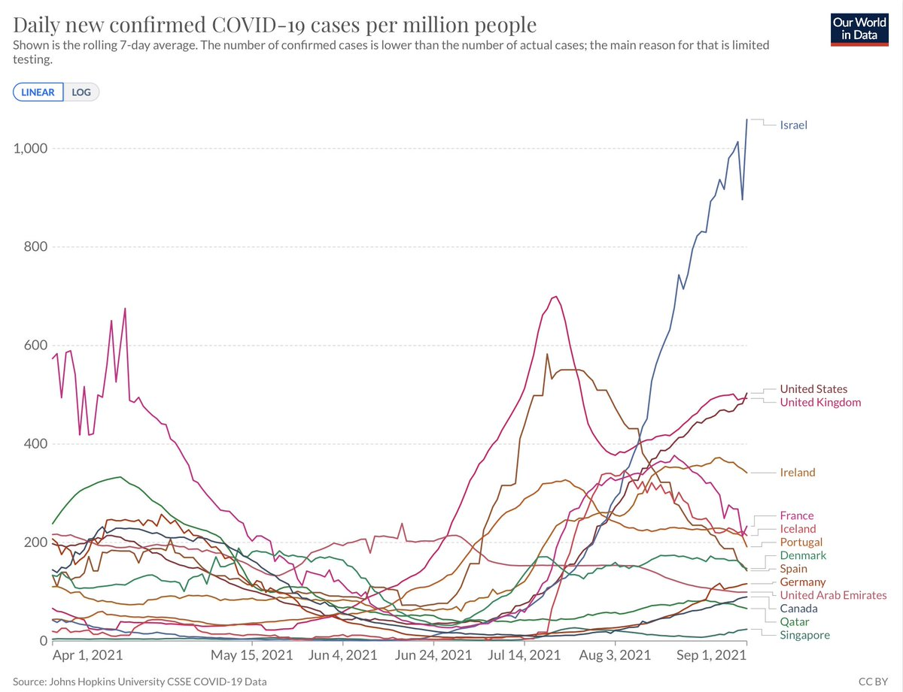</img></a>

---

<a href="https://twitter.com/erictopol/status/1433567655579906048" target="_blank" rel="noreferer">23:08 UCT</a>

Hawaii had managed the pandemic well until Delta hit; the highest 1st dose vaccination rate for the US, 2nd dose above average. Hospitals are filled, 95% w/ unvaccinated residents. Oxygen is in shortage.
A pattern seen in many island nations + Delta
https://www.nytimes.com/live/2021/09/02/world/covid-delta-variant-vaccine?type=styln-live-updates&label=coronavirus%20updates&index=0#hawaii-covid-oxygen-shortage 

<a href="E-UNwkNUYAczHRg.jpg"  >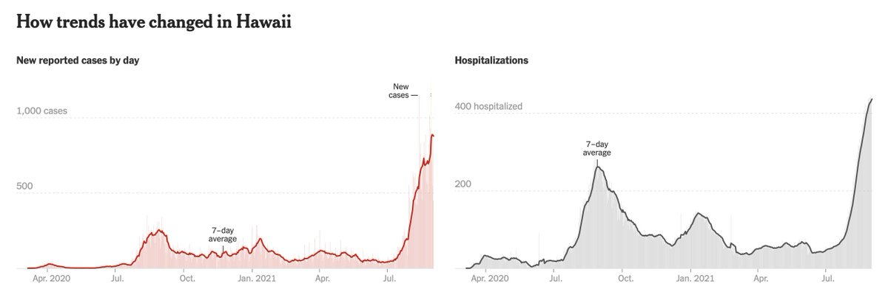</img></a><a href="E-ULeSUVEAE-JO_.jpg"  >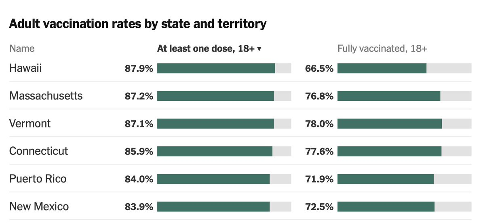</img></a><a href="E-UMGU0UYAYS_JG.jpg"  >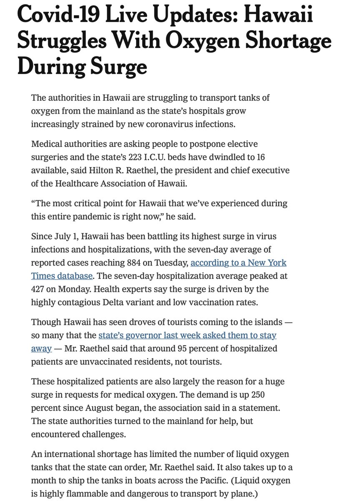</img></a><a href="E-UM_P8VkAETp11.jpg"  >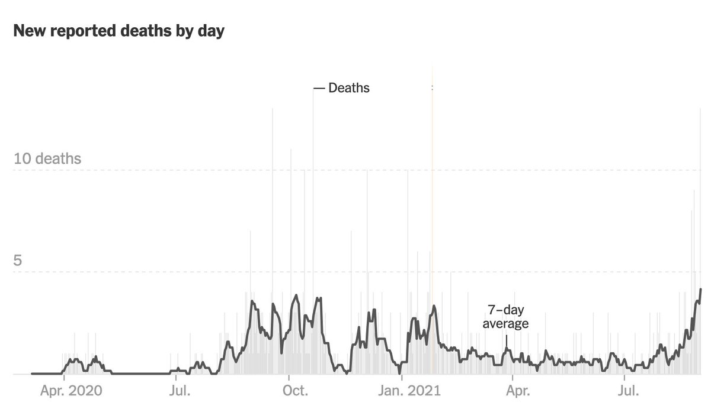</img></a>