+++
title = "Tweets by Eric Topol Sept 03"
Summary = ""
tags = ["Twitter"]
category = "Twitter"
+++

---

<a href="https://twitter.com/erictopol/status/1433602892443709463" target="_blank" rel="noreferer">01:28 UCT</a>

Elegant work published today @SciImmunology that could never be done in humans to dissect out each component of the adaptive immune response to #SARSCoV2. Better than the paper is a thread by the master explainer! https://twitter.com/VirusesImmunity/status/1433570048715763714

---

<a href="https://twitter.com/erictopol/status/1433606986931662880" target="_blank" rel="noreferer">01:45 UCT</a>

Not only has the data to support potential use of Ivermectin been exceptionally weak from small studies, but now 2 of the studies most cited have been shown to be fraudulent, one from Egypt and now this one from Argentina
https://twitter.com/erictopol/status/1429977888967729170?s=21 https://twitter.com/stephaniemlee/status/1433551906480148480

---

<a href="https://twitter.com/erictopol/status/1433618962630123522" target="_blank" rel="noreferer">02:32 UCT</a>

Despite the lack of evidence, why did @joerogan and so many take Ivermectin?  Remember the emergency podcast to "save the world"? And that it was "99 percent effective" and "the pandemic would end in a month" but it was being suppressed by a conspiracy.
https://quillette.com/2021/07/06/looking-for-covid-19-miracle-drugs-we-already-have-them-theyre-called-vaccines/ 

<a href="E-U8Hy1VQAM3h8s.png"  >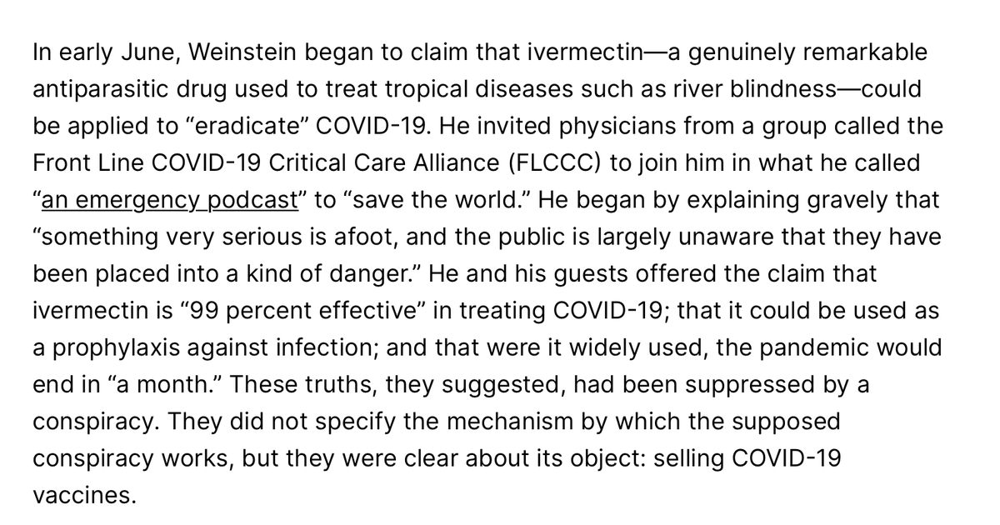</img></a>

---

<a href="https://twitter.com/erictopol/status/1433625537134542848" target="_blank" rel="noreferer">02:58 UCT</a>

If you are interested in the truth about Ivermectin's dataset and the fraudulent issues, I highly recommend the 3-part series by @GidMK, culminating in today's on the Argentina study 
https://twitter.com/GidMK/status/1433555208211079171

---

<a href="https://twitter.com/erictopol/status/1433627626749399080" target="_blank" rel="noreferer">03:07 UCT</a>

@GidMK I cited you and your Part 1 extensively in the podcast with @SamHarrisOrg which antedated the retraction of the Egypt trial https://samharris.org/podcasts/256-contagion-bad-ideas/

---

<a href="https://twitter.com/erictopol/status/1433663736208756738" target="_blank" rel="noreferer">05:30 UCT</a>

@segal_eran Thanks, Eran. Didn’t know about the big initiative of testing in kids. And very good to see hospitalizations are in descent

---

<a href="https://twitter.com/erictopol/status/1433784671876227084" target="_blank" rel="noreferer">13:31 UCT</a>

A lot has recently been made of 3 variants:  Lambda, Mu  (B.1.621)  and C 1.2. None of them are/can compete with Delta and will fade away. This new @PHE_uk report with @kallmemeg's thread addresses the C.1.2 story https://twitter.com/kallmemeg/status/1433728819484110859

---

<a href="https://twitter.com/erictopol/status/1433784912910249985" target="_blank" rel="noreferer">13:32 UCT</a>

@TheMrsWhale @mehdirhasan this was an analysis of countries with Delta waves
(you are right about top 10 for vaccinations)

---

<a href="https://twitter.com/erictopol/status/1433789166408454150" target="_blank" rel="noreferer">13:49 UCT</a>

An impressive data visualization for 56 years of rainfall and the double hit with all-time record 3 days ago, by @charlie_smart_ @nytgraphics #dataviz 

<a href="E-XXjBRVEAU9ef3.jpg"  >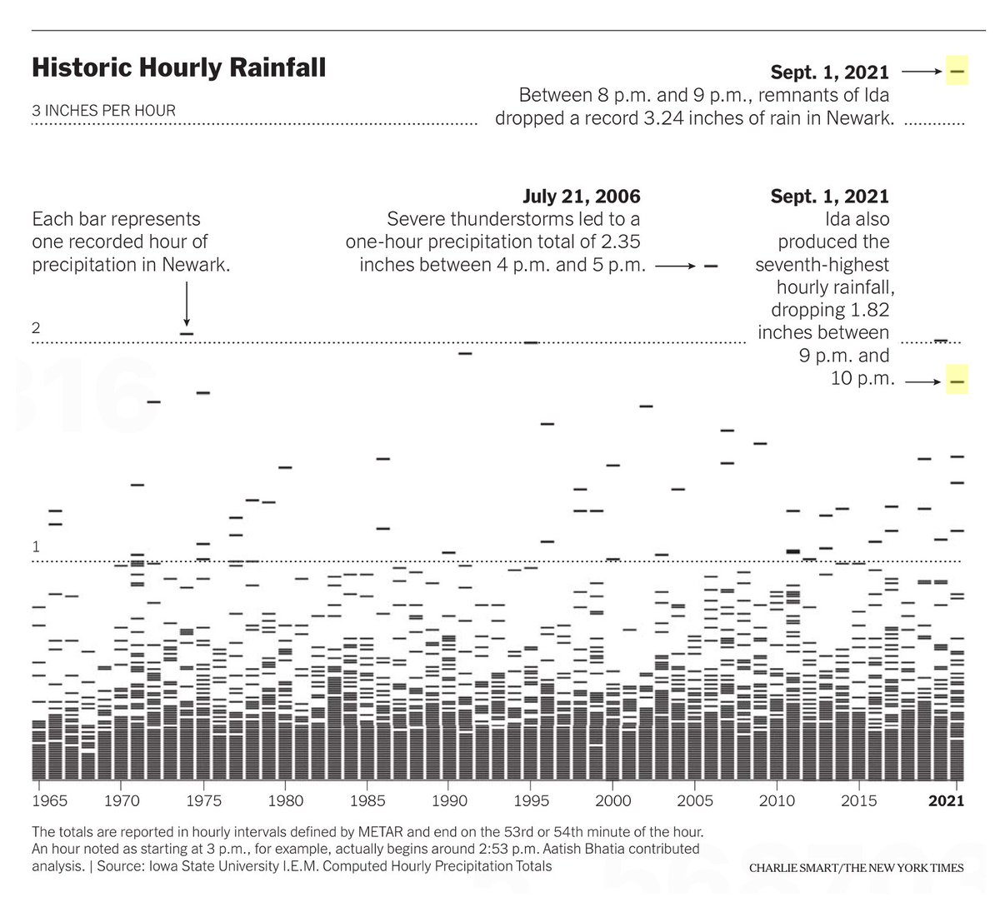</img></a>

---

<a href="https://twitter.com/erictopol/status/1433791490258399238" target="_blank" rel="noreferer">13:58 UCT</a>

"How is it possible the US could have 3,000 deaths reported yesterday?"
"Florida" 

<a href="E-XZup4VkAgJ1Ta.jpg"  >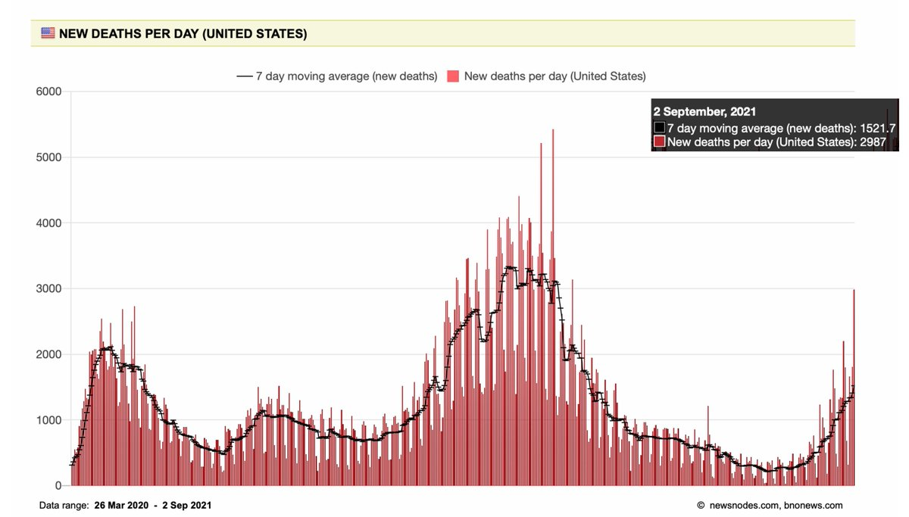</img></a><a href="E-XZwHkUUAY1nWM.jpg"  >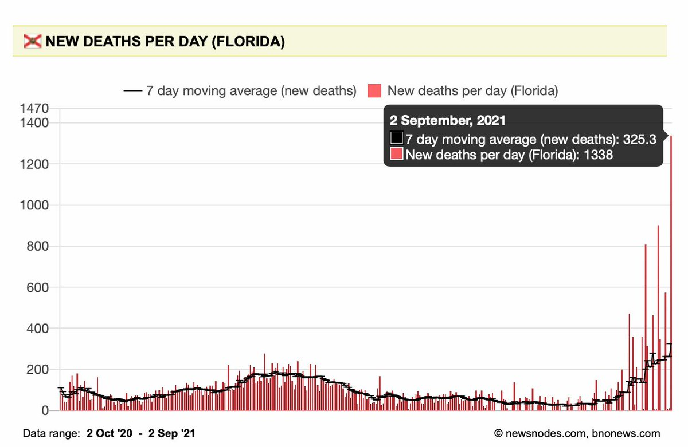</img></a>

---

<a href="https://twitter.com/erictopol/status/1433798135034171405" target="_blank" rel="noreferer">14:24 UCT</a>

More in Ivermectin
--The role of doctors and @FoxNews 
https://www.washingtonpost.com/health/2021/09/01/ivermectin-covid-treatment/
by @KnowlesHannah @anniegowen @badjujusf
--The role of Amazon, by @greene
https://www.washingtonpost.com/technology/2021/09/02/amazon-ivermectin-reviews-covid/
--@sdutBreen 

<a href="E-XdNNJVcAMvosc.jpg"  >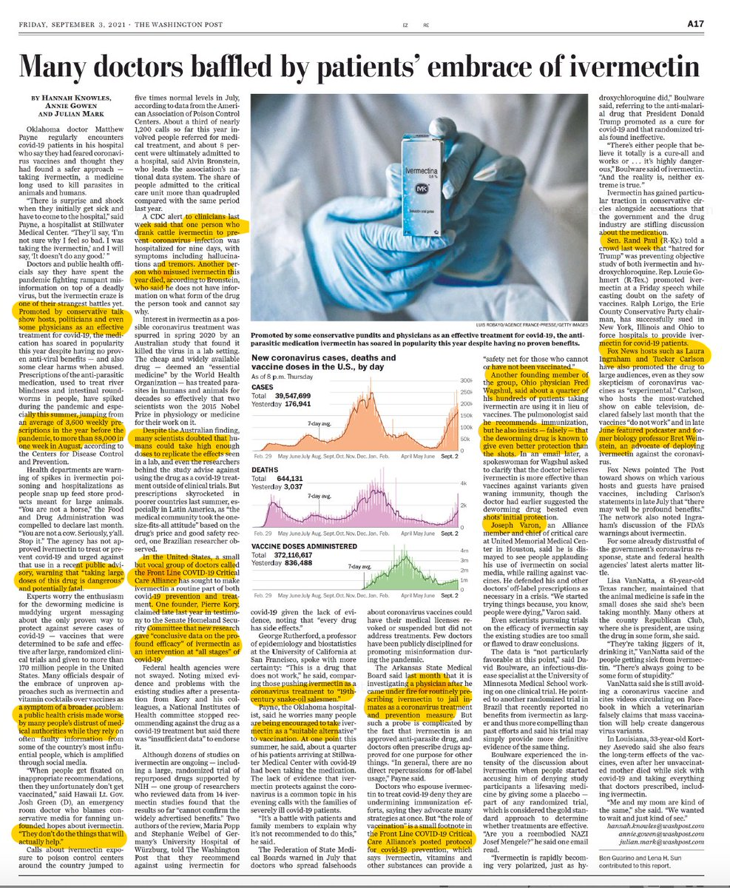</img></a><a href="E-XdV2nVcAAA-jv.jpg"  >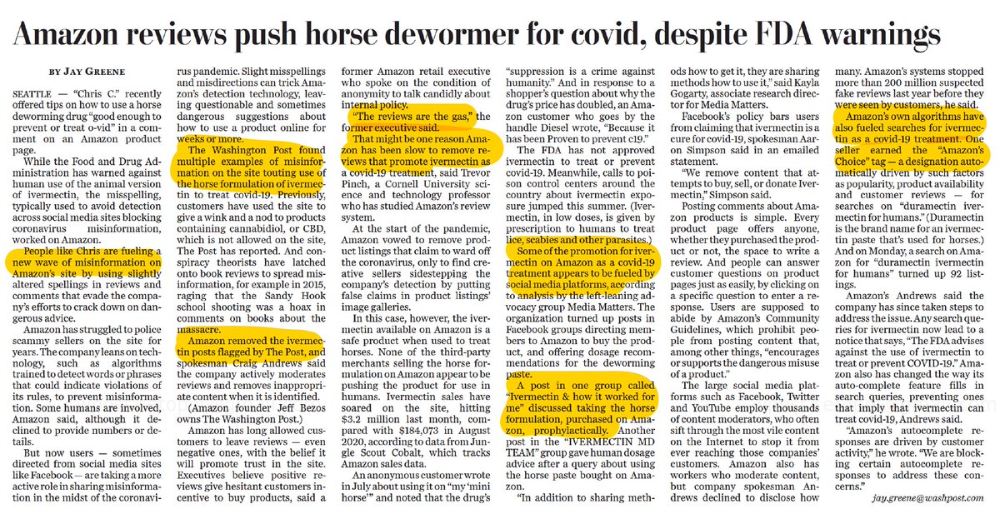</img></a><a href="E-XdYPQVgAEPsmn.jpg"  >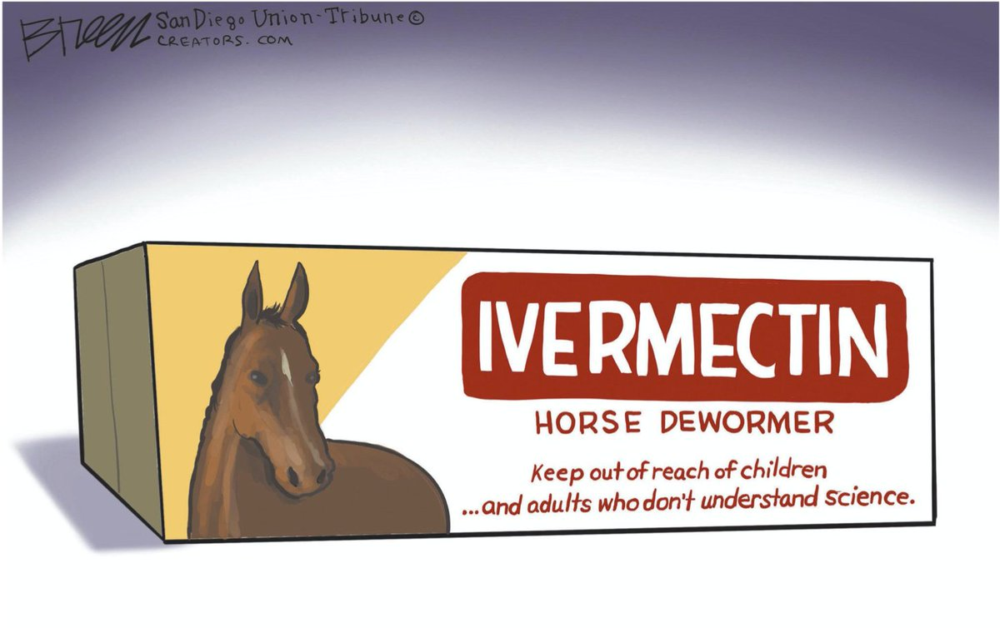</img></a>

---

<a href="https://twitter.com/erictopol/status/1433801113619206146" target="_blank" rel="noreferer">14:36 UCT</a>

Delta wave hospitalizations
—Israel is in sharp descent
—UK modest increase; 1/3rd level of the US
—US sitting at a plateau of ~100,000
@OurWorldInData 

<a href="E-Xhl_9VUAUSS_R.jpg"  >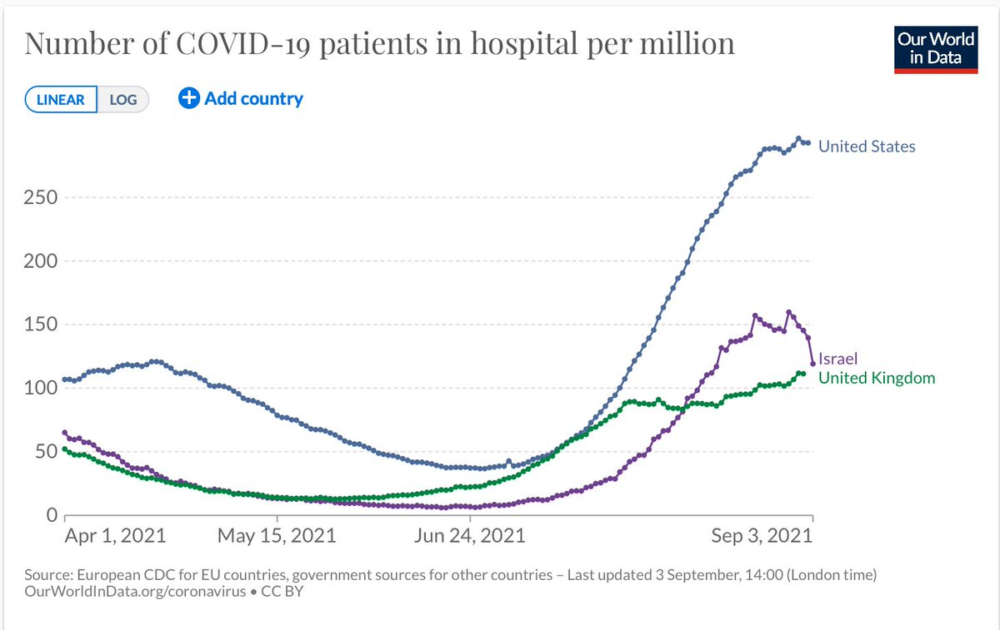</img></a>

---

<a href="https://twitter.com/erictopol/status/1433807237785415684" target="_blank" rel="noreferer">15:00 UCT</a>

RT @MaxBoot: US vaccination rate 19 points lower than Spain, 15 points lower than Canada, 9 points lower than France. 

 We are experiencin…

---

<a href="https://twitter.com/erictopol/status/1433819869707837440" target="_blank" rel="noreferer">15:51 UCT</a>

Mixed messages, debate, and data deficiency syndrome on the US booster plan https://www.nytimes.com/2021/09/03/us/coronavirus-booster-shots.html
If the US had national data on hospitalizations by vaccination status, vaccine, when given, demographics, it would shed considerable light. But we don't.

---

<a href="https://twitter.com/erictopol/status/1433822739970678791" target="_blank" rel="noreferer">16:02 UCT</a>

@MadisonMills22 Because Israel is an outlier and we can learn a lot from outliers
https://twitter.com/EricTopol/status/1433559123820363796

---

<a href="https://twitter.com/erictopol/status/1433837305496686592" target="_blank" rel="noreferer">17:00 UCT</a>

On top of the world, South Carolina, 
107/100,000 residents
2nd in the world, per capita, of any country or state
Tennessee, 102/100,000 

<a href="E-YDMUOVkAExySn.jpg"  >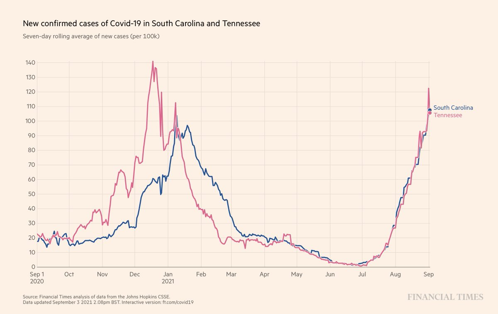</img></a>

---

<a href="https://twitter.com/erictopol/status/1433847575417810946" target="_blank" rel="noreferer">17:41 UCT</a>

The impact of the US Delta wave on children and adolescents, by age group
new @CDCMMWR https://www.cdc.gov/mmwr/volumes/70/wr/mm7036e1.htm?s_cid=mm7036e1_w 

<a href="E-YLfCcVUAkVYU4.jpg"  >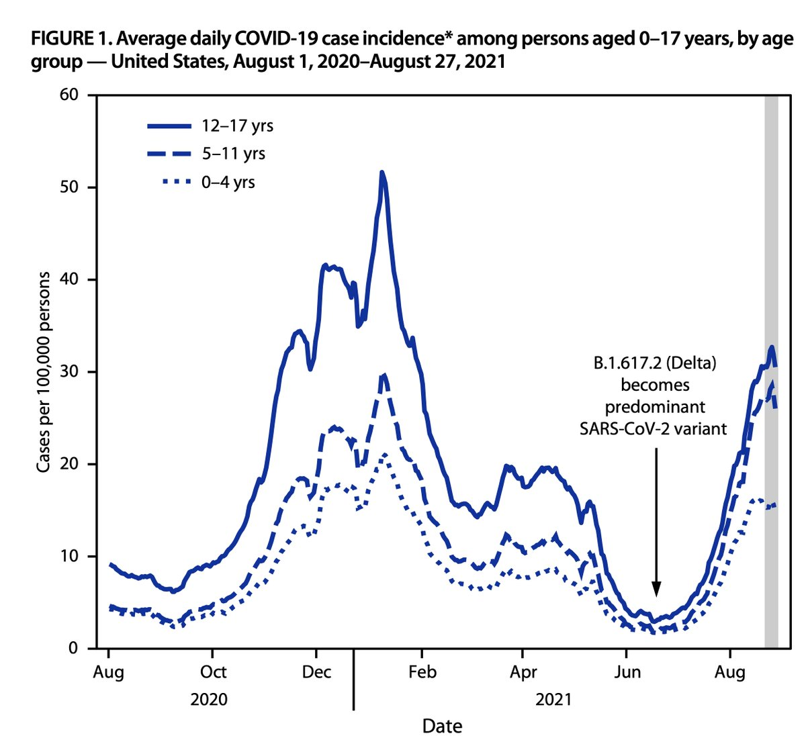</img></a>

---

<a href="https://twitter.com/erictopol/status/1433847585068908545" target="_blank" rel="noreferer">17:41 UCT</a>

The vaccination status of the state had an impact on ED visits and hospitalizations of kids (Table)
Graph showing the hospitalizations, ICU admissions, and need for mechanical ventilation 

<a href="E-YLkXvVQAQ3E9g.png"  >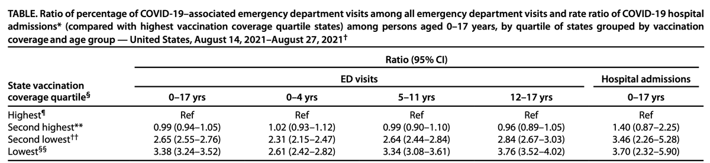</img></a><a href="E-YLuyuUcAATYtu.jpg"  >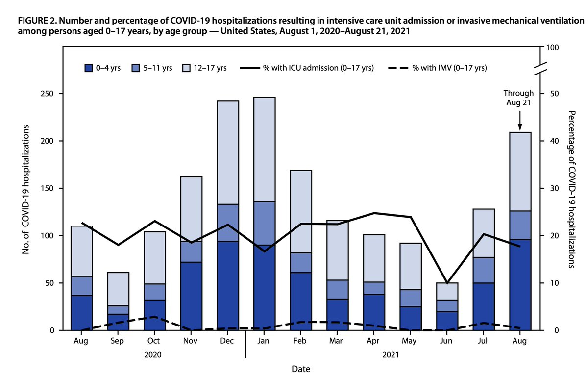</img></a>

---

<a href="https://twitter.com/erictopol/status/1433853023273426949" target="_blank" rel="noreferer">18:02 UCT</a>

RT @DanRather: Vaccines are one of the greatest achievements in the history of humankind. Perhaps the greatest. The amount of cumulative su…

---

<a href="https://twitter.com/erictopol/status/1433857194223493129" target="_blank" rel="noreferer">18:19 UCT</a>

The other @CDCgov report today in kids; impact of Delta and vaccinations in adolescents https://www.cdc.gov/mmwr/volumes/70/wr/mm7036e2.htm?s_cid=mm7036e2_w 

<a href="E-YVXjPVkAIc6X4.jpg"  >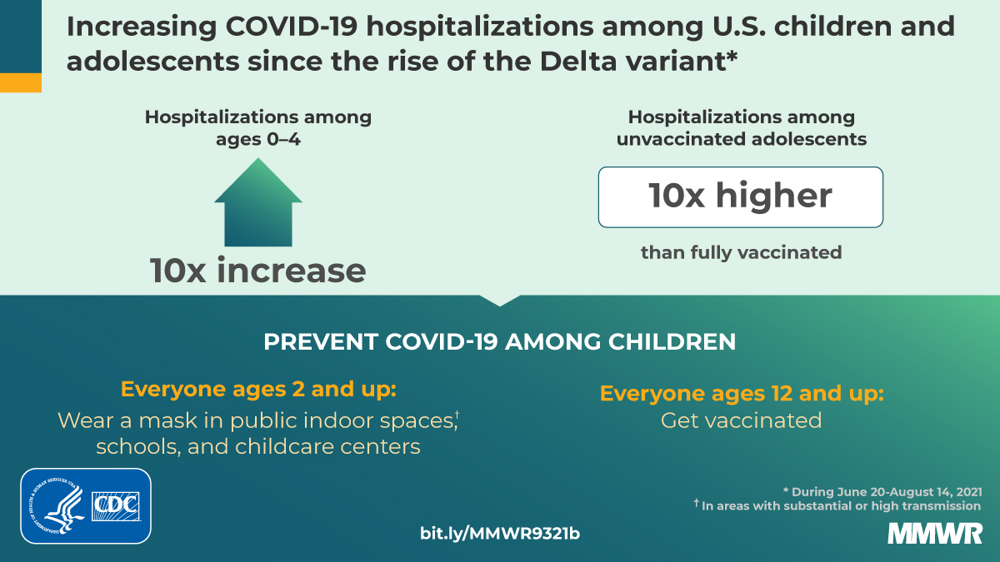</img></a><a href="E-YVMJjUYAUBRZc.jpg"  ></img></a>

---

<a href="https://twitter.com/erictopol/status/1433887701309145090" target="_blank" rel="noreferer">20:20 UCT</a>

The first covid DNA vaccine is approved for emergency use in India and there are 10 more in the pipeline
https://www.nature.com/articles/d41586-021-02385-x @Nature 

<a href="E-YxP0NVEAY8WSR.png"  >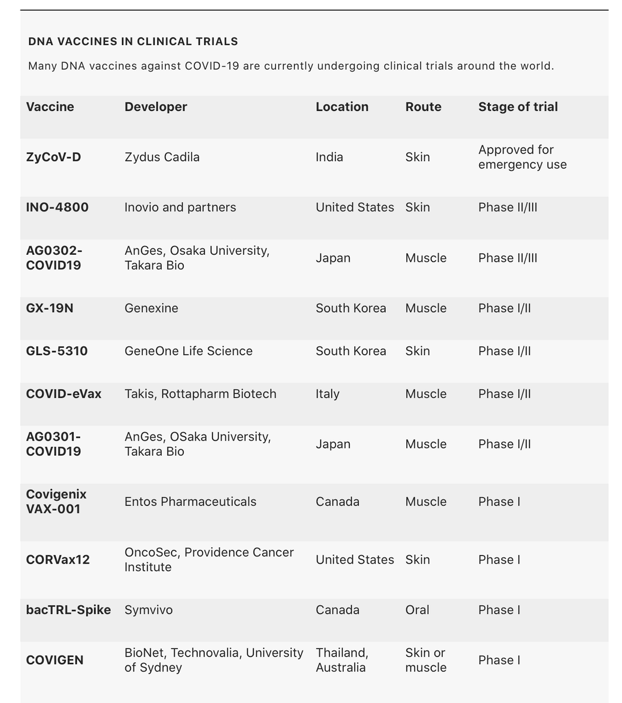</img></a>

---

<a href="https://twitter.com/erictopol/status/1433905912251490306" target="_blank" rel="noreferer">21:33 UCT</a>

Prior covid and variants of concern (VOC) are not a good mix. Better protection vs VOCs with vaccination. Best with the combination if you've been through covid.
New @ScienceAdvances https://www.science.org/doi/10.1126/sciadv.abj5365 

<a href="E-ZAo9hVQAAm2cU.jpg"  >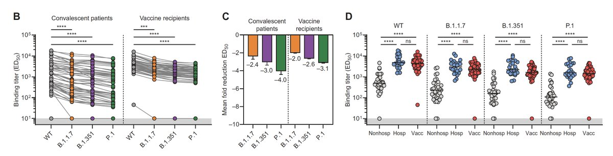</img></a><a href="E-ZAtshVEAQzA3h.jpg"  >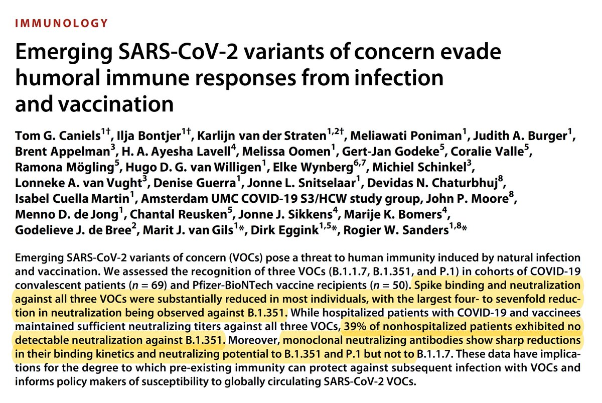</img></a><a href="E-ZBThTVQAAOi7A.jpg"  >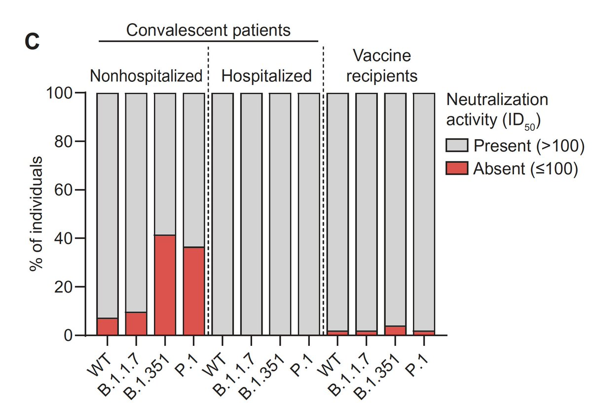</img></a>

---

<a href="https://twitter.com/erictopol/status/1433907516245569542" target="_blank" rel="noreferer">21:39 UCT</a>

How to lose public confidence?
1. Announce a booster program on Sept 20 for all at 8 months post-vaccine
2. Change it to 6 months, then 5 months, then back to 8 
3. Lack of agreement among leadership group
4. Have no US national data
5. Announce the program will be "scaled back"

---

<a href="https://twitter.com/erictopol/status/1433915315306450946" target="_blank" rel="noreferer">22:10 UCT</a>

@der_nister @ScienceAdvances Prior covid plus vaccine 1-dose is the best immunity vs covid we have seen

---

<a href="https://twitter.com/erictopol/status/1433919476999720969" target="_blank" rel="noreferer">22:26 UCT</a>

This is what good news about vaccinations looks like in a country which keeps track of their current data and posts excellent reports on a frequent basis
via @john_actuary #VaccinesWork 🏴󠁧󠁢󠁥󠁮󠁧󠁿 

<a href="E-ZNbX2VUAAc5bQ.jpg"  >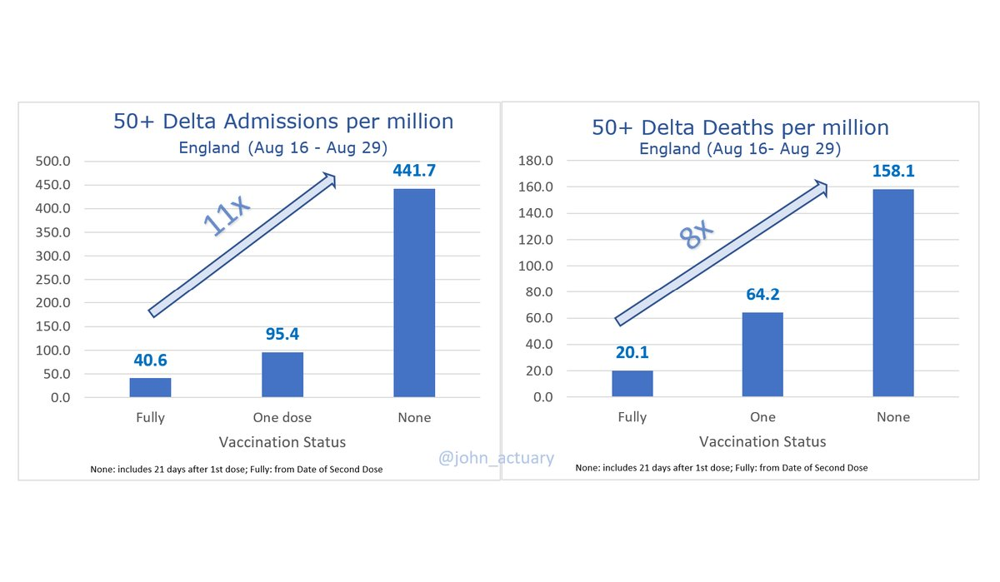</img></a>

---

<a href="https://twitter.com/erictopol/status/1433923805592756229" target="_blank" rel="noreferer">22:44 UCT</a>

Delta in Denmark, new @TheLancetInfDis 
https://www.thelancet.com/journals/laninf/article/PIIS1473-3099(21)00580-6/fulltext
2.8 X fold risk of hospitalization compared with Alpha, replicating a recent report from England (2.3 X)
That heightened risk was not significant with vaccination 
(1.25 X, [95% CI 0.34,4.6]) 

<a href="E-ZRqXbVQAQ3cIP.jpg"  >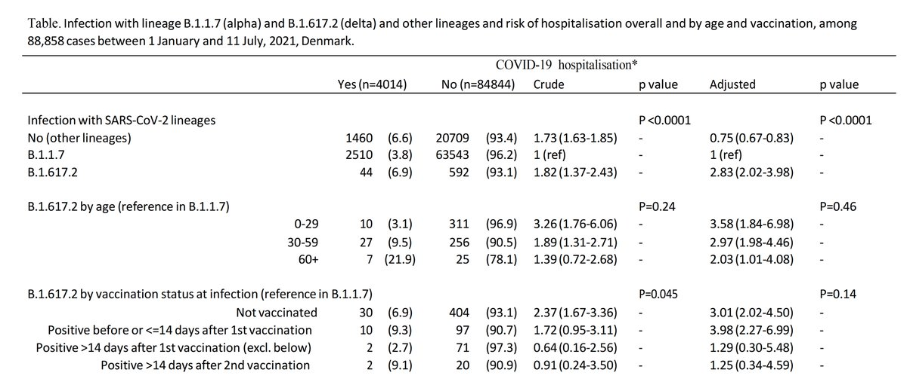</img></a>