+++
title = "Tweets by Eric Topol Sept 04"
Summary = ""
tags = ["Twitter"]
category = "Twitter"
+++

---

<a href="https://twitter.com/erictopol/status/1433964945092198404" target="_blank" rel="noreferer">01:27 UCT</a>

RT @TWenseleers: Adding to the evidence for increased hospitalisation risk following infection by Delta, this time based on Danish data.

---

<a href="https://twitter.com/erictopol/status/1433991105008193537" target="_blank" rel="noreferer">03:11 UCT</a>

On a US Delta wave day when there were more than 2,000 deaths and 190,000 new cases, the "only" positive thing was that hospitalizations didn't increase (actually when down a bit), sitting at a ~100,000 plateau 

<a href="E-aO6zRVcAE7P8e.jpg"  >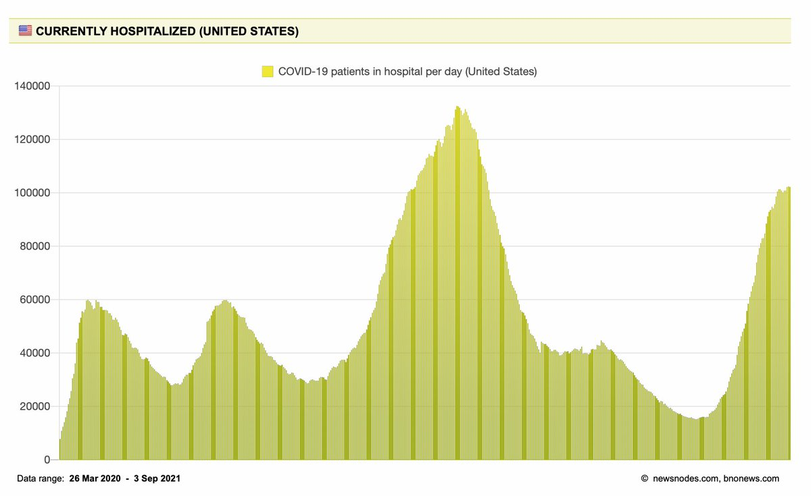</img></a>

---

<a href="https://twitter.com/erictopol/status/1434147305800667139" target="_blank" rel="noreferer">13:32 UCT</a>

Does the @moderna_tx mRNA vaccine (including dose, dosing schedule) have an edge over @pfizer's, and what are the implications for boosters?
https://www.ft.com/content/aaddc31b-415d-43d0-b314-bc89a8b860e0 @FT by @hannahkuchler 

<a href="E-cdAWMVEAIRi_J.jpg"  >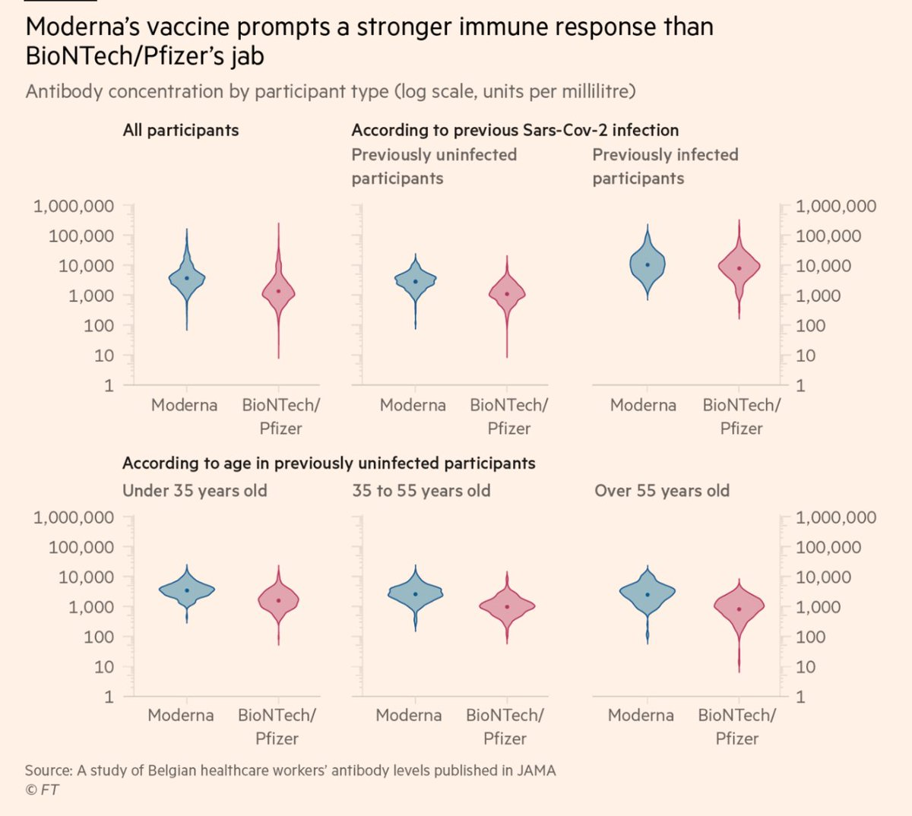</img></a><a href="E-cdDacVkAIW_ys.jpg"  >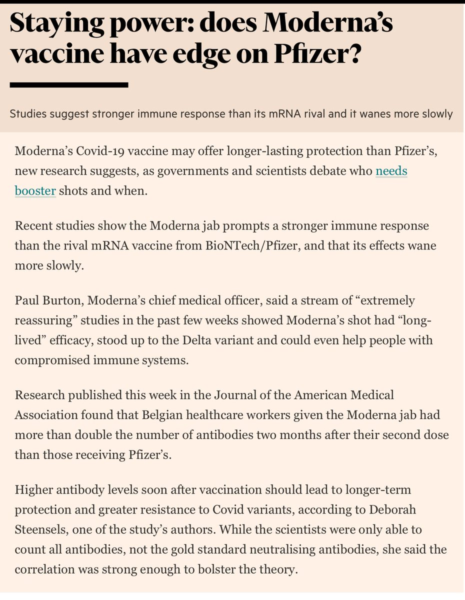</img></a><a href="E-cdGY3VgAAbHwt.jpg"  >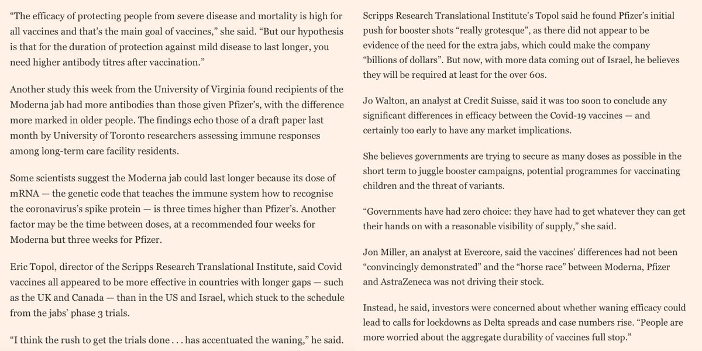</img></a>

---

<a href="https://twitter.com/erictopol/status/1434148059332571136" target="_blank" rel="noreferer">13:35 UCT</a>

Links to the 2 studies reported this week on the difference in antibody response https://twitter.com/EricTopol/status/1433447242443091973

---

<a href="https://twitter.com/erictopol/status/1434150373913104388" target="_blank" rel="noreferer">13:44 UCT</a>

The @WSJ Editorial Board reviews the recent data on boosters and weighs in on the debate https://www.wsj.com/articles/the-covid-booster-debate-third-shot-pfizer-moderna-anthony-fauci-joe-biden-11630702772?mod=opinion_lead_pos1 

<a href="E-cgB63VEAA5M8b.jpg"  >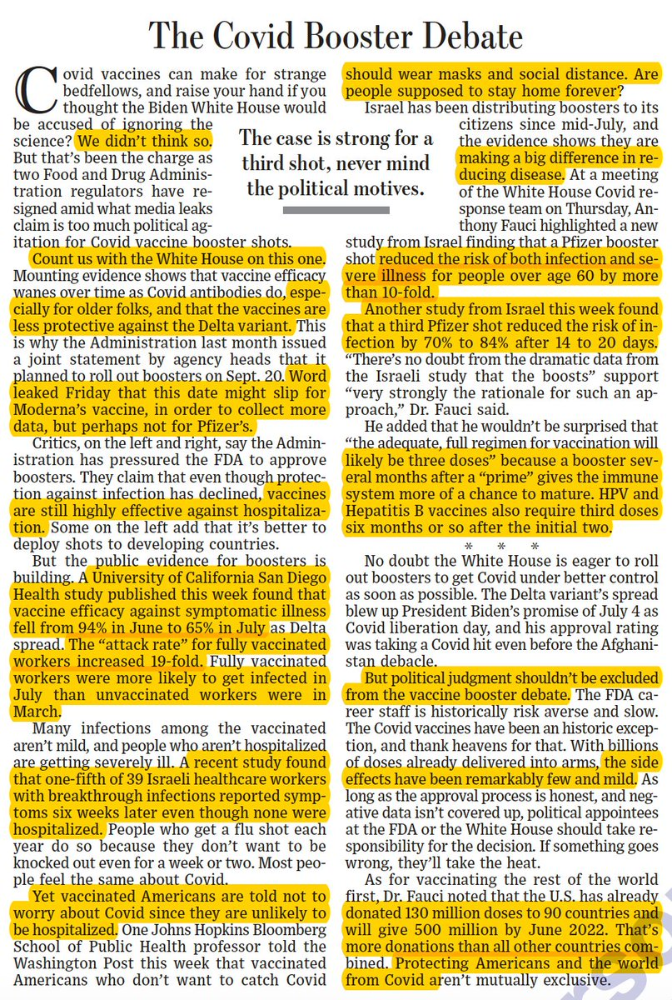</img></a>

---

<a href="https://twitter.com/erictopol/status/1434154841446572044" target="_blank" rel="noreferer">14:02 UCT</a>

Pediatric covid hospitalizations by state fully vaccination per cent, past 30 days
https://time.com/6092446/pediatric-covid-19-surge/ by @Jamie_Ducharme @TIMEHealth 
Florida, an off-the-chart outlier 

<a href="E-ci4vWVcAEvrkZ.jpg"  >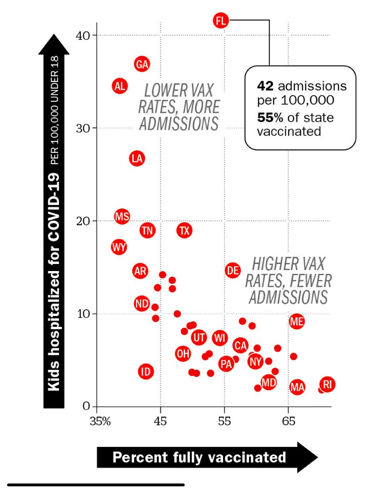</img></a>

---

<a href="https://twitter.com/erictopol/status/1434164903753838594" target="_blank" rel="noreferer">14:42 UCT</a>

A sharp descent of hospitalizations in Israel's Delta wave
As cases still on the rise, now mainly attributed to mass testing in children before starting school
@OurWorldInData 

<a href="E-cs35XVUAMLyAD.jpg"  >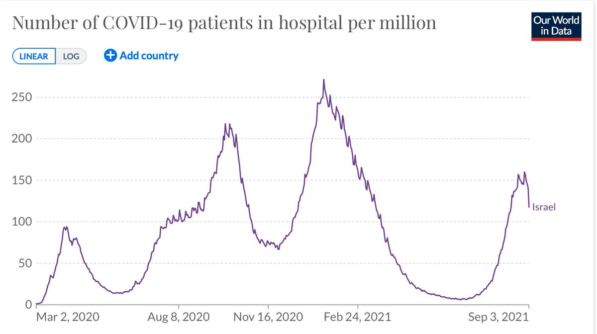</img></a><a href="E-cr8lRUcAE7WaK.jpg"  >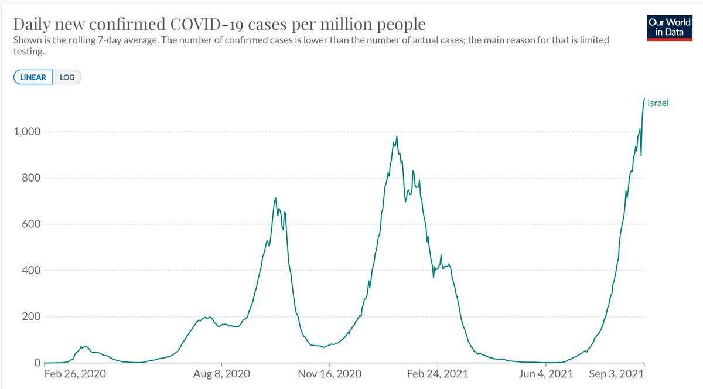</img></a>

---

<a href="https://twitter.com/erictopol/status/1434191163683008515" target="_blank" rel="noreferer">16:26 UCT</a>

Kentucky, not shown on the graph, with 49% vaccination rate, now at peak pandemic, with this really sad and eminently preventable school struggle 

<a href="E-dE-bGUYAAEzOT.jpg"  >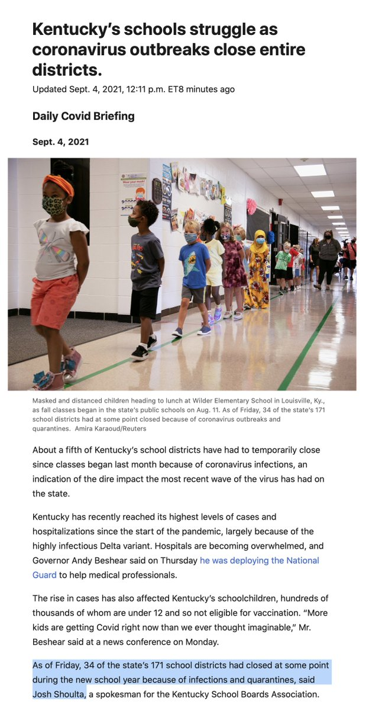</img></a><a href="E-dFKydUYAgPA6z.jpg"  >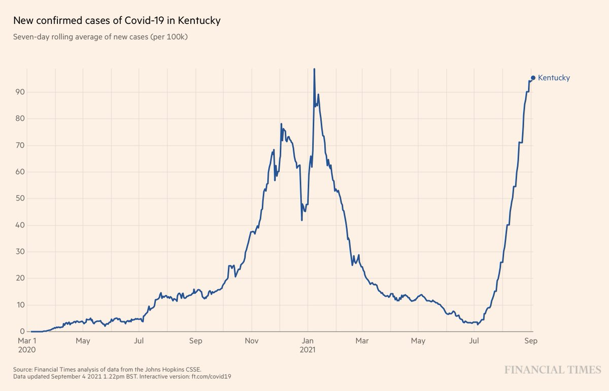</img></a>

---

<a href="https://twitter.com/erictopol/status/1434193548258148354" target="_blank" rel="noreferer">16:36 UCT</a>

The 2 CDC reports from yesterday on kids in the Delta wave show the importance of vaccination in adults, at the state level, to help protect kids from infections, emergency department visits, and hospitalizations 
https://twitter.com/EricTopol/status/1433847575417810946 

<a href="E-dHKGVVcAAU4Xc.png"  ></img></a>

---

<a href="https://twitter.com/erictopol/status/1434194927806607361" target="_blank" rel="noreferer">16:41 UCT</a>

The latest on mask efficacy from the randomized trial of policy in 350,000 people from 600 villages in Bangladesh
https://www.theatlantic.com/ideas/archive/2021/09/masks-were-working-all-along/619989/ by @DKThomp @TheAtlantic 
https://www.economist.com/graphic-detail/2021/09/03/real-world-evidence-shows-face-masks-reduce-covid-19s-spread 

<a href="E-dH9SEVEAMPhwa.jpg"  >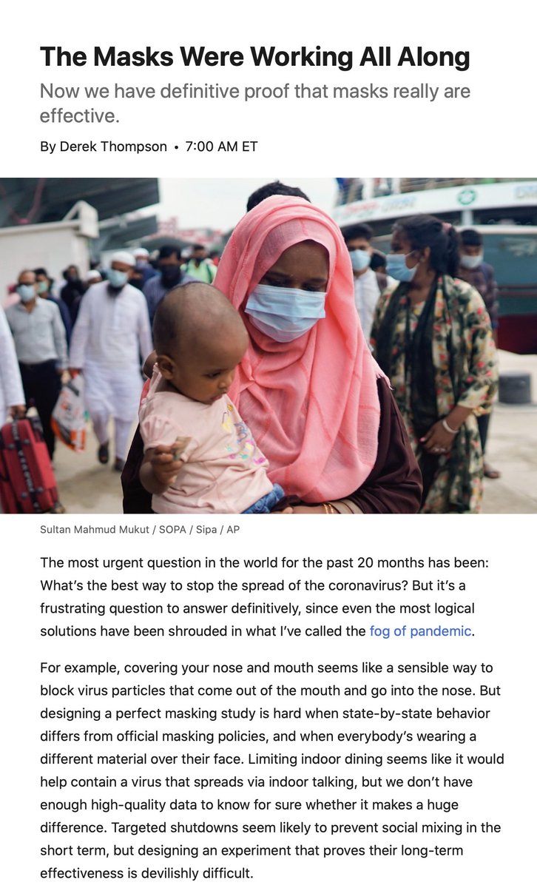</img></a><a href="E-dIJJcVcAANfV6.jpg"  >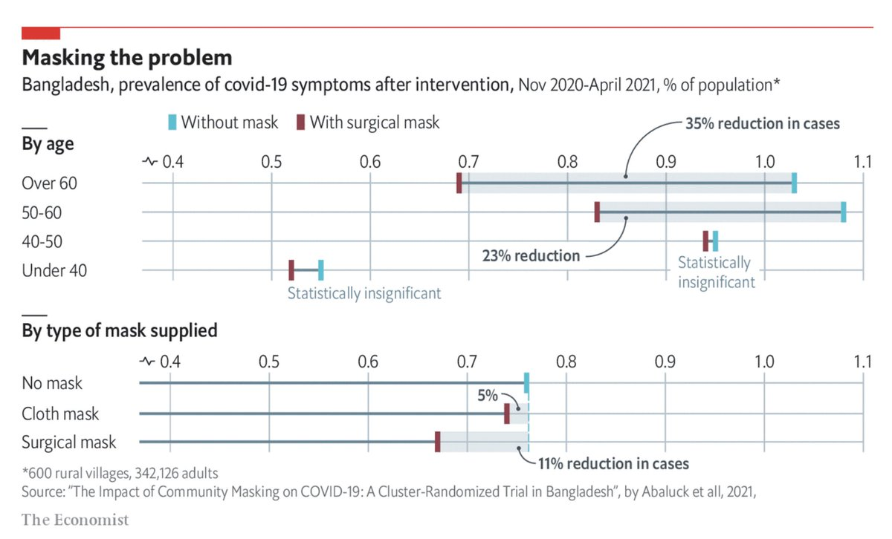</img></a>

---

<a href="https://twitter.com/erictopol/status/1434201376247070723" target="_blank" rel="noreferer">17:07 UCT</a>

Based on a large body of data, I lobbied the CDC this week to count confirmed prior Covid as equivalent to 1-dose of vaccine, which would reduce waste, unnecessary side-effects, and provide the same access to activities as 2-doses, no Covid.
I got nowhere.

---

<a href="https://twitter.com/erictopol/status/1434203000474456069" target="_blank" rel="noreferer">17:13 UCT</a>

The immune response for Prior Covid plus 1-dose vaccine (hybrid immunity) has not been beaten or matched by any 2-dose vaccine or mix/match combination to date.

---

<a href="https://twitter.com/erictopol/status/1434230261802156041" target="_blank" rel="noreferer">19:01 UCT</a>

To date, there are limited clinical data for Moderna vaxx waning. The UCSD HCW study this week did not report their data split out by Pfizer (55%), Moderna (45%) vaccines, but the results for symptomatic infections were similar. If we had national US data we would know now.

---

<a href="https://twitter.com/erictopol/status/1434238427411611648" target="_blank" rel="noreferer">19:34 UCT</a>

Having it 2-ways on boosters
The primary endpoint for the large, placebo-controlled covid vaccine trials was symptomatic infections (SI), a proxy for hospitalizations/deaths (H/D)
With a Pfizer reduction of protection for SI at 6 months, many argue that H/D will not be affected

---

<a href="https://twitter.com/erictopol/status/1434240754910588928" target="_blank" rel="noreferer">19:43 UCT</a>

@KenHaddad can you provide the link to this report?

---

<a href="https://twitter.com/erictopol/status/1434286121232470018" target="_blank" rel="noreferer">22:43 UCT</a>

Florida, the outlier for the 4th wave, no matter how you look at the US
h/t @gelliottmorris 

<a href="E-ebe4mVkAAJgWo.jpg"  >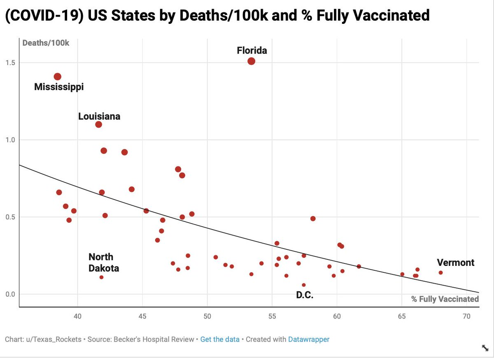</img></a>

---

<a href="https://twitter.com/erictopol/status/1434289353199550465" target="_blank" rel="noreferer">22:56 UCT</a>

The Delta wave deaths in these 14 countries
The US, and its lowest vaccination rate, stands out.
@OuwWorldinData 

<a href="E-eeEffVcAEHLFm.jpg"  >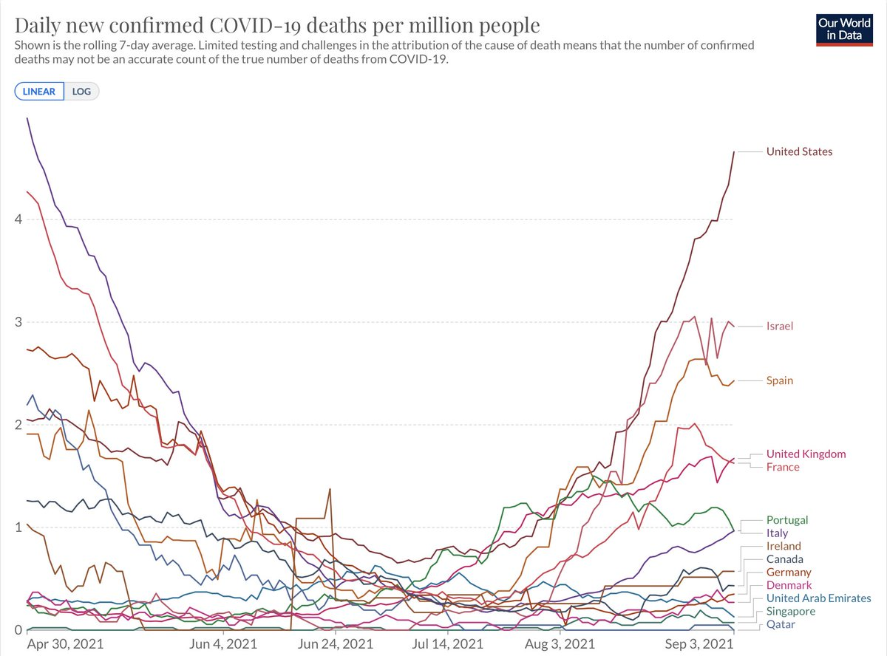</img></a>

---

<a href="https://twitter.com/erictopol/status/1434297208187224069" target="_blank" rel="noreferer">23:27 UCT</a>

For the best summary of the benefits of hybrid immunity, including not just the 25-100 fold antibody response (cf vaccine or natural immunity), but also their breadth of neutralizing capacity, @profshanecrotty has it @ScienceMagazine 
https://www.science.org/doi/full/10.1126/science.abj2258 

<a href="E-elEzFVgAQd3wG.jpg"  >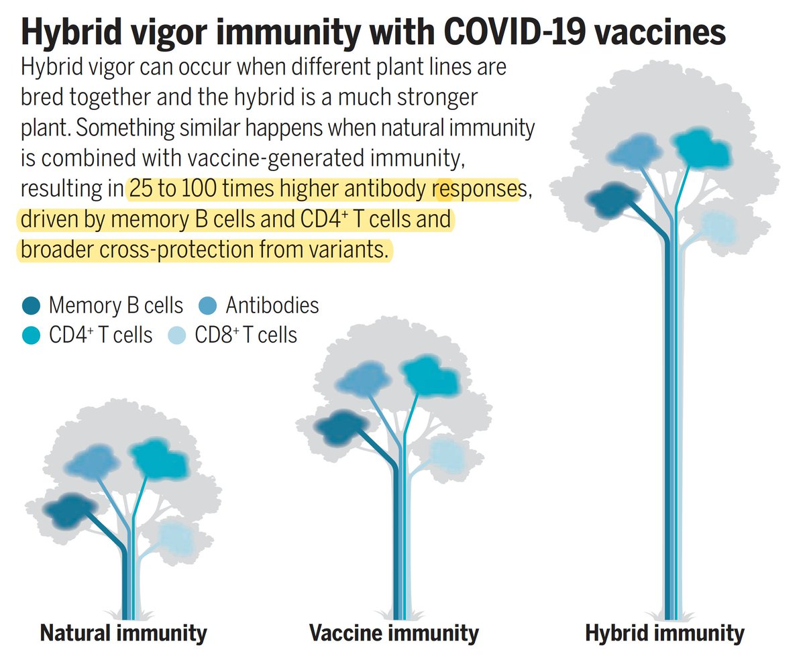</img></a>