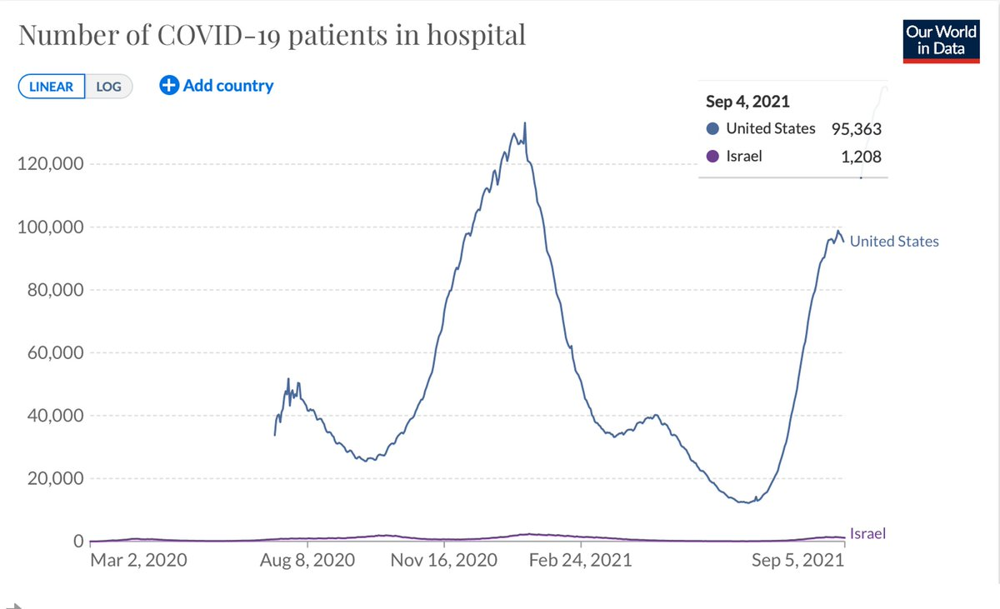
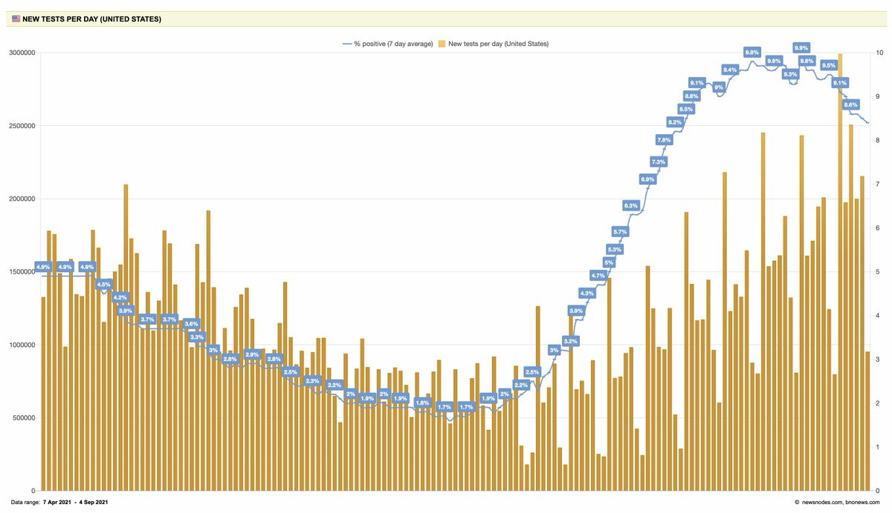

+++
title = "Tweets by Eric Topol Sept 05"
Summary = ""
tags = ["Twitter"]
category = "Twitter"
+++

---

<a href="https://twitter.com/erictopol/status/1434311781212561410" target="_blank" rel="noreferer">00:25 UCT</a>

RT @PeterHotez: Mixed feelings: yes of course we need a mission control for pandemic threats and one generously funded. But isn’t that why…

---

<a href="https://twitter.com/erictopol/status/1434520561661583376" target="_blank" rel="noreferer">14:15 UCT</a>

Why don’t we have the data for ~100,000 US  hospitalized patients for vaccination status, timing, vaccine, demographics? Few know @HHSgov has the legal authority to mandate that data collection. But @SecBecerra won’t do it. 
Please tell us why you are not doing that @SecBecerra

---

<a href="https://twitter.com/erictopol/status/1434522949466275845" target="_blank" rel="noreferer">14:24 UCT</a>

It’s up to you to change this, @SecBecerra 
https://www.theguardian.com/commentisfree/2021/aug/09/america-is-flying-blind-when-it-comes-to-the-delta-variant

---

<a href="https://twitter.com/erictopol/status/1434525485480833025" target="_blank" rel="noreferer">14:35 UCT</a>

Why do we have to rely so much on Israel's data to make decisions about boosters when we have 90X more data  in the US not being collected? 

<a href="E-h1MItVQAIOp0z.jpg"  ></img></a>

---

<a href="https://twitter.com/erictopol/status/1434563639671803908" target="_blank" rel="noreferer">17:06 UCT</a>

I deleted the post about Sam Harris denouncing the Ivermectin proponents, not aware the statement was coming from a satire website, Thanks @cmyeaton for alerting me on that.

---

<a href="https://twitter.com/erictopol/status/1434580917108965376" target="_blank" rel="noreferer">18:15 UCT</a>

RT @YouMi90: @EricTopol @HHSGov @SecBecerra In Germany, we got these.
Top Line is over 60 y without vaccines
Second Line is under 60 y with…

---

<a href="https://twitter.com/erictopol/status/1434585261187342336" target="_blank" rel="noreferer">18:32 UCT</a>

A positive sign: in recent weeks US testing has improved  (still way less than it should be) and the % positivity steadily dropping, now 8.4%
https://newsnodes.com/us 

<a href="E-ikTm4UUAQAGaO.jpg"  ></img></a>

---

<a href="https://twitter.com/erictopol/status/1434608889756983298" target="_blank" rel="noreferer">20:06 UCT</a>

Denmark study
https://twitter.com/EricTopol/status/1433923805592756229
UK study
https://www.thelancet.com/journals/laninf/article/PIIS1473-3099(21)00475-8/fulltext

---

<a href="https://twitter.com/erictopol/status/1434608888070828035" target="_blank" rel="noreferer">20:06 UCT</a>

Does Delta increase the risk of hospitalization compared with Alpha, independent of its higher level of contagiousness?
A new study from Norway says no, not consistent with 2 recent reports from UK (2.3X risk) and Denmark (2.8X risk)
https://www.medrxiv.org/content/10.1101/2021.09.02.21263014v1

---

<a href="https://twitter.com/erictopol/status/1434664890807975942" target="_blank" rel="noreferer">23:48 UCT</a>

RT @kimbrunhuber: Covid cases &amp; hospitalizations among children &amp; teens are skyrocketing. Battles over mask mandates in schools aren't help…

