+++
title = "Tweets by Eric Topol Sept 07"
Summary = ""
tags = ["Twitter"]
category = "Twitter"
+++

---

<a href="https://twitter.com/erictopol/status/1435240779673264137" target="_blank" rel="noreferer">13:57 UCT</a>

New @NatureMedicine
Vaccine effectiveness in pregnancy of 97% vs symptomatic infection in over 10,000 expectant mothers and matched controls @BioNTech_Group/@Pfizer vaccine  https://www.nature.com/articles/s41591-021-01490-8
@RanBalicer @dagan_noa and colleagues @ClalitHealth 

<a href="E-r_z3dUYAEfNIm.jpg"  >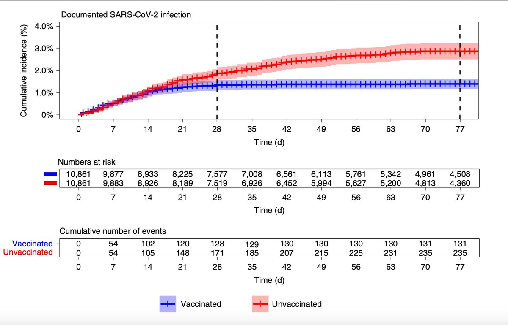</img></a>

---

<a href="https://twitter.com/erictopol/status/1435245570294104067" target="_blank" rel="noreferer">14:16 UCT</a>

We have no national data for fully vaccinated people who have been hospitalized. 12% in Alabama.  We need to know more: vaccine, when vaxxed, age, medical conditions, etc. @SecBecerra @HHSGov can mandate that data collection. Flying blind is unacceptable. https://twitter.com/kaitlancollins/status/1435193873534537728

---

<a href="https://twitter.com/erictopol/status/1435248361540501517" target="_blank" rel="noreferer">14:27 UCT</a>

I'm sorry, @SecBecerra, but we most hold you accountable for not mandating this national data collection. Your unwillingness to respond to queries or speak to the public to explain why you have not done this is notable. We urgently await your action on this matter.

---

<a href="https://twitter.com/erictopol/status/1435266016204898304" target="_blank" rel="noreferer">15:37 UCT</a>

New @CellCellPress on #SARSCoV2 evolution and convergence
"The adaptive evolution of 501Y lineage viruses has involved repeated selectively favoured convergent mutations at 35 genome sites"
Then came Delta, a detour from this 501Y meta signature
https://www.cell.com/cell/fulltext/S0092-8674(21)01050-3?rss=yes&utm_source=dlvr.it&utm_medium=twitter
@sergeilkp 

<a href="E-sVcTdVUAsXCaW.jpg"  >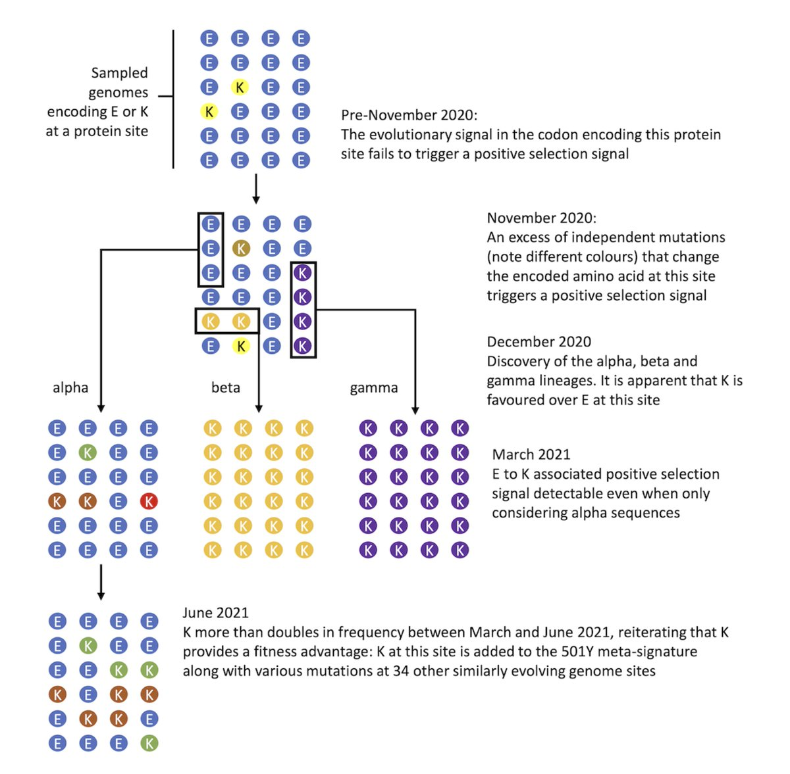</img></a>

---

<a href="https://twitter.com/erictopol/status/1435268880553807876" target="_blank" rel="noreferer">15:49 UCT</a>

"Right now — knock on wood — the kids are still winning with their innate immunity.”
A new @Nature features on the immune response in children, how it differs from adults, effect of Delta
https://www.nature.com/articles/d41586-021-02423-8
by @SmritiMallapaty 

<a href="E-sZN3TVQAE9QmI.jpg"  >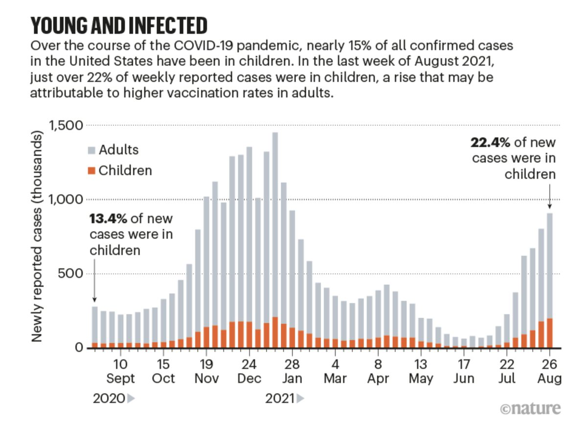</img></a>

---

<a href="https://twitter.com/erictopol/status/1435272196667031556" target="_blank" rel="noreferer">16:02 UCT</a>

A new systematic review of over 12 million people from 54 studies at up to 8 months following Covid. &gt;90% prevalence of IgG antibodies, reinfection 0.2% (an 81% risk reduction)  https://www.medrxiv.org/content/10.1101/2021.09.03.21263103v1 ("did not examine evidence for immunity against the new variants") 

<a href="E-sbJs4VIAIXT52.jpg"  >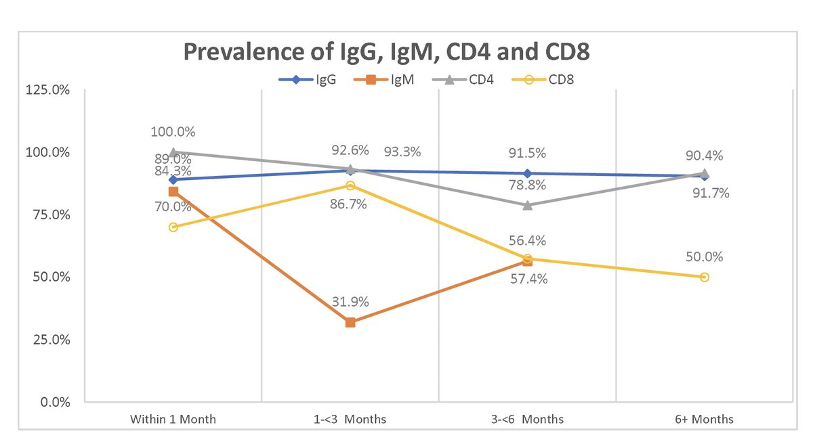</img></a><a href="E-sbwaCVcAc0nBR.jpg"  >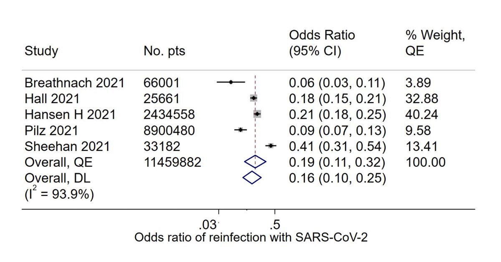</img></a>

---

<a href="https://twitter.com/erictopol/status/1435291080098926596" target="_blank" rel="noreferer">17:17 UCT</a>

RT @_cingraham: The shitty national data collection at this point is really unconscionable. We're 18 months into this thing. CDC data has f…

---

<a href="https://twitter.com/erictopol/status/1435304535237349376" target="_blank" rel="noreferer">18:10 UCT</a>

On the list of 100 reasons for why high quality rapid home tests should be made freely and widely available, add this one.
#COVIDisAirborne 
https://www.researchsquare.com/article/rs-775996/v1 

<a href="E-s5rpeVUAIOrMX.jpg"  >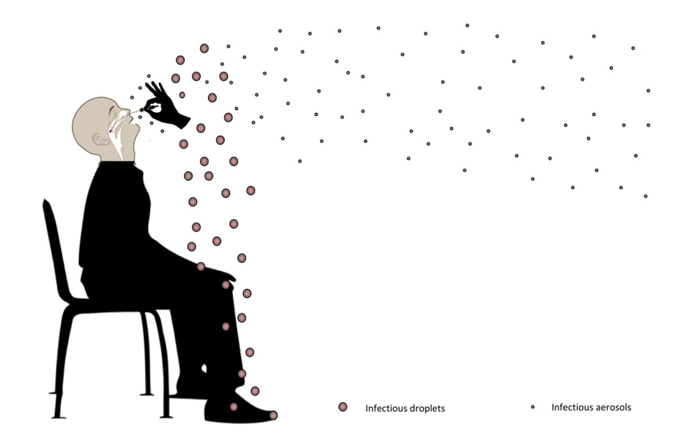</img></a>

---

<a href="https://twitter.com/erictopol/status/1435308719814758400" target="_blank" rel="noreferer">18:27 UCT</a>

Is South Carolina, leading the world in cases per capita of any state or country, near vertical in rise, vying to be the new Florida? 

<a href="E-s9hn3UUAIe4ub.jpg"  >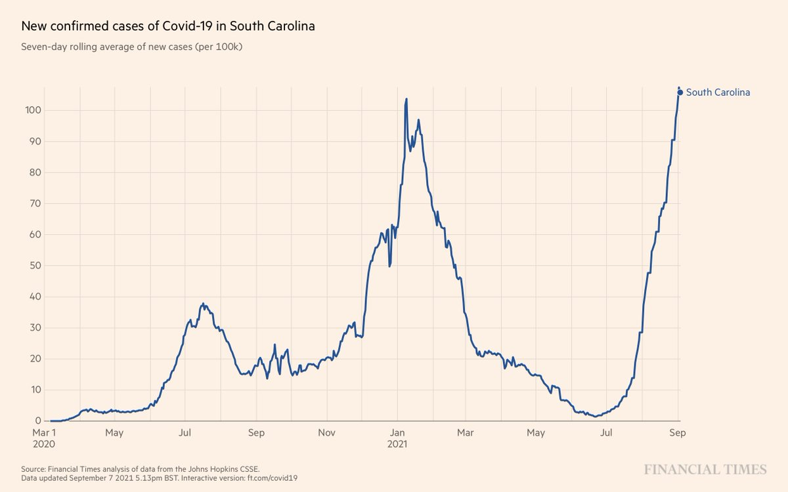</img></a><a href="E-s9M7dVcAQNHet.jpg"  >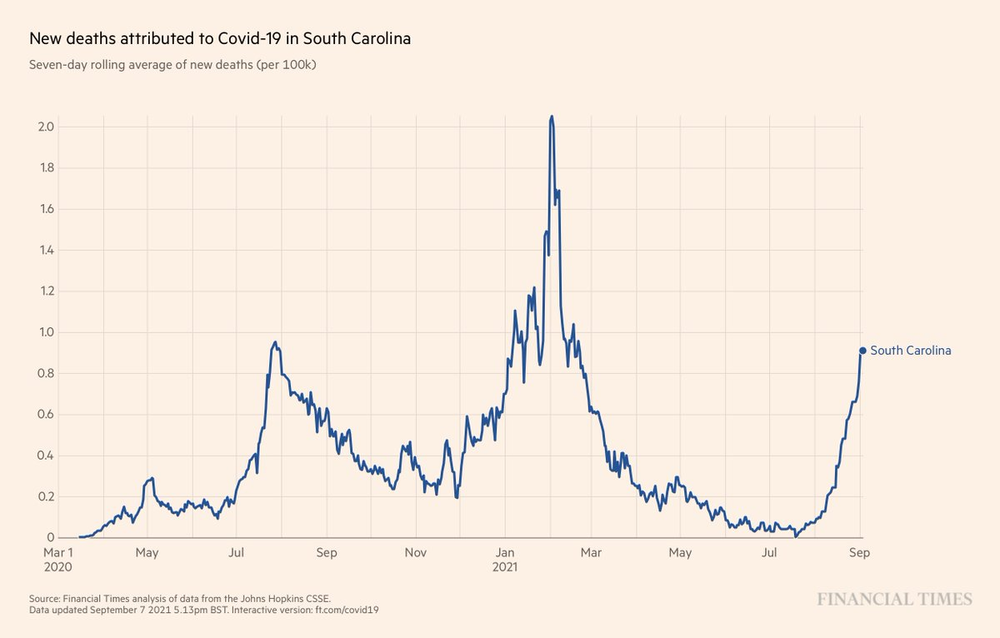</img></a>

---

<a href="https://twitter.com/erictopol/status/1435309289896235008" target="_blank" rel="noreferer">18:29 UCT</a>

Maybe you'll believe @trvrb with this elegant analysis
https://twitter.com/trvrb/status/1435249802631995396

---

<a href="https://twitter.com/erictopol/status/1435311195687297026" target="_blank" rel="noreferer">18:37 UCT</a>

Scroll to top. The link isn't at the start of the thread, which begins with this. 

<a href="E-s_1XqUUAE0CSs.jpg"  >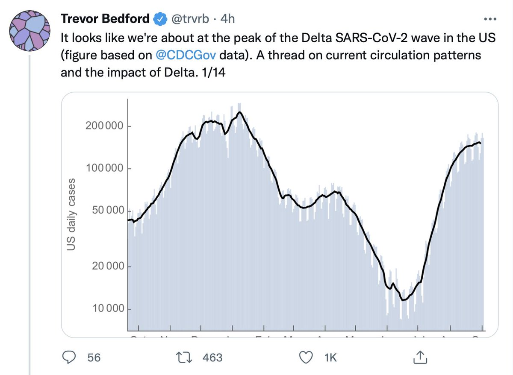</img></a>

---

<a href="https://twitter.com/erictopol/status/1435338949950464001" target="_blank" rel="noreferer">20:27 UCT</a>

Our covid times :-)
by @BrendanLoper 

<a href="E-tZJH-VkAMqsCd.png"  >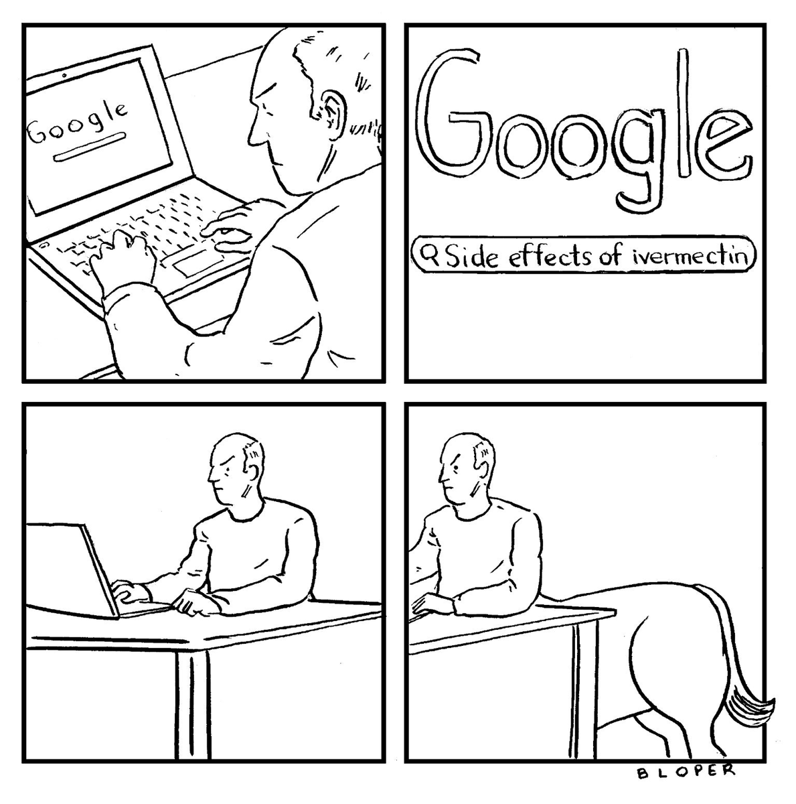</img></a>

---

<a href="https://twitter.com/erictopol/status/1435342798803247104" target="_blank" rel="noreferer">20:42 UCT</a>

Whatever happened to managed competition?
The US is up to 25 per cent points behind many countries throughout the world. 

<a href="E-tcoZ3UYAA2cKx.jpg"  >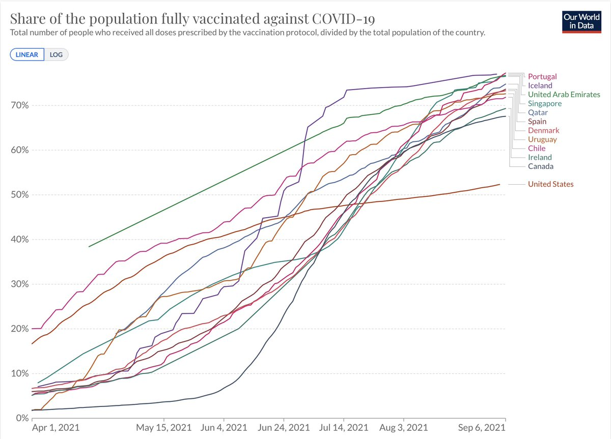</img></a>

---

<a href="https://twitter.com/erictopol/status/1435356525665472514" target="_blank" rel="noreferer">21:37 UCT</a>

A new preprint from Israel that says their data "support the decision to add a booster vaccine for those aged 60 and over" but the data are only on PCR + infections and IgG antibody decline with no clinical outcomes
https://www.medrxiv.org/content/10.1101/2021.09.01.21262957v1

---

<a href="https://twitter.com/erictopol/status/1435387035766845440" target="_blank" rel="noreferer">23:38 UCT</a>

Data from the 54 patients hospitalized @YaleMedicine for covid infections post-vaccination between late March and July 1 (no genomics, unlikely Delta, but of interest)
https://www.thelancet.com/journals/laninf/article/PIIS1473-3099(21)00558-2/fulltext @TheLancetInfDis by @hyungjchun and colleagues 

<a href="E-uD_3DVIAAnsDb.jpg"  >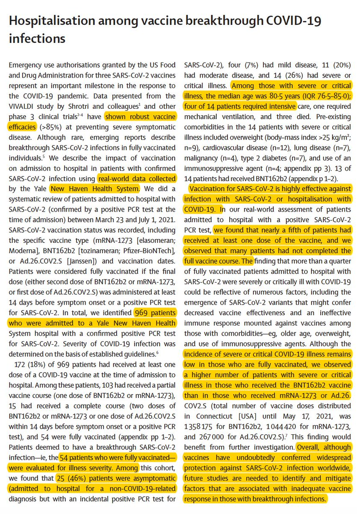</img></a><a href="E-uECdMUUAIjs5n.jpg"  >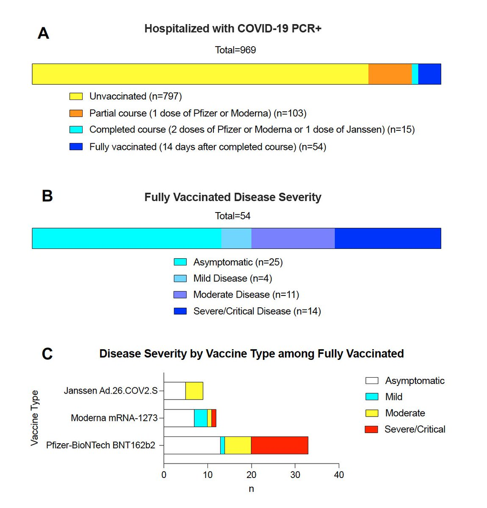</img></a>