+++
title = "Tweets by Eric Topol Sept 08"
Summary = ""
tags = ["Twitter"]
category = "Twitter"
+++

---

<a href="https://twitter.com/erictopol/status/1435392591596453888" target="_blank" rel="noreferer">00:00 UCT</a>

A US retrospective, case-control study of durability of Pfizer vaccine protection vs symptomatic infection
https://www.medrxiv.org/content/10.1101/2021.09.04.21263115v1 "wanes over time" 
Primary analysis adjusted odds ratio 3.2 [1.3,7.7] at 4 months after full vaccination by @_nference and @MayoClinic @BadleyAndrew 

<a href="E-uJQFrVEAA4cAM.jpg"  >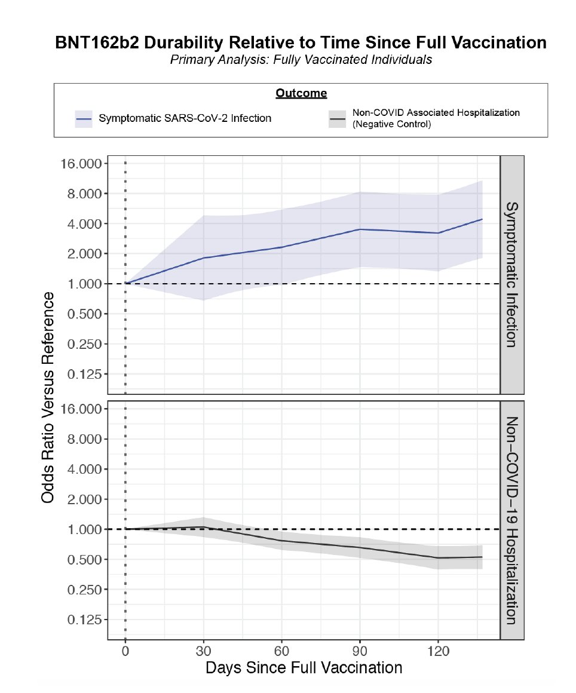</img></a>

---

<a href="https://twitter.com/erictopol/status/1435426527806517248" target="_blank" rel="noreferer">02:15 UCT</a>

You know we've lowered expectations for the US 4th wave when the best we can hope for now is to not exceed ~100,000 hospitalizations 

<a href="E-uott1VEAE82ko.jpg"  >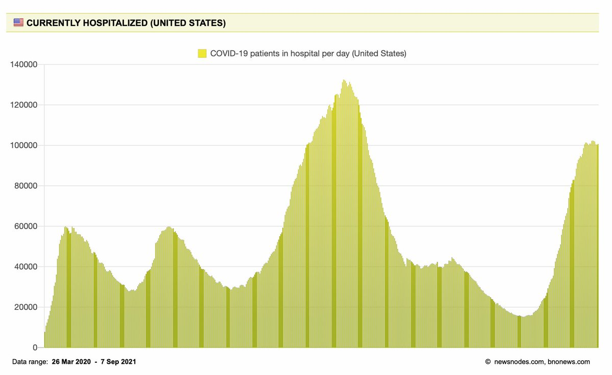</img></a>

---

<a href="https://twitter.com/erictopol/status/1435427496980205571" target="_blank" rel="noreferer">02:19 UCT</a>

RT @PeterHotez: This is simply not true. Vaccines for smallpox, later childhood vaccines for measles, mumps, rubella, Hib (vaccines discove…

---

<a href="https://twitter.com/erictopol/status/1435457858074669060" target="_blank" rel="noreferer">04:19 UCT</a>

Interesting to read @Pfizer's chief scientific officer addressing dose selection of their vaccine, push for boosters, and comparison with Moderna data
@FT https://www.ft.com/content/3ee3efaa-766c-42c9-baf7-9825d3e78edf by @nikasgari 

<a href="E-vFDqkUUAEc5Kx.jpg"  >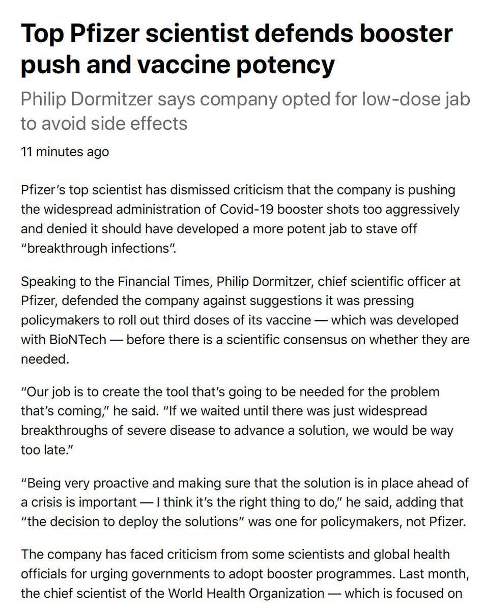</img></a><a href="E-vEbWdVgAIR4zS.jpg"  >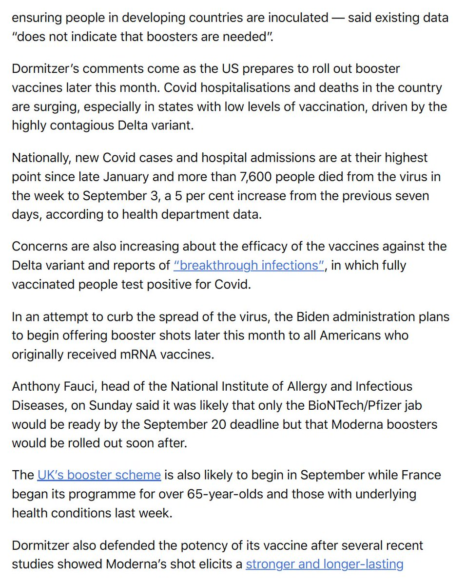</img></a><a href="E-vEcxDUcAQ14OT.jpg"  >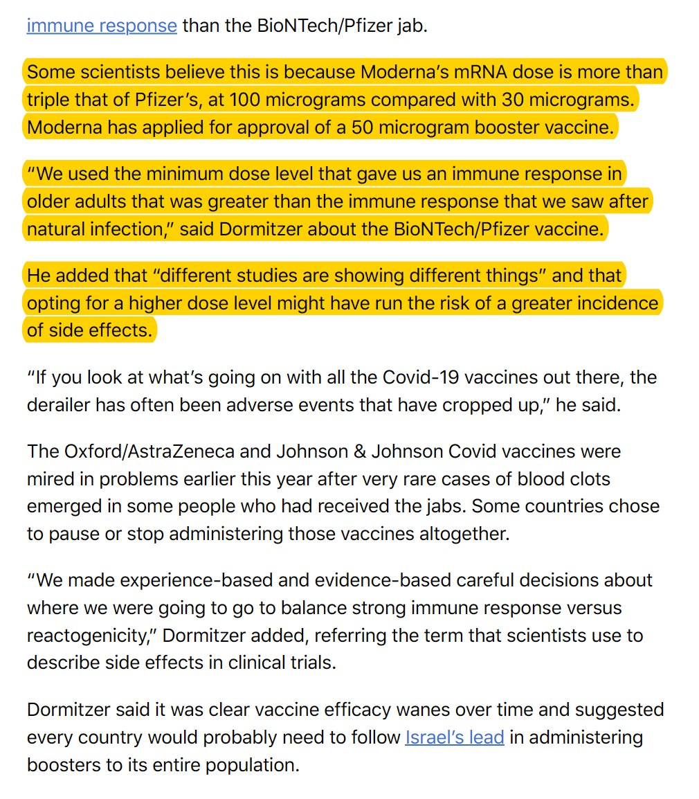</img></a>

---

<a href="https://twitter.com/erictopol/status/1435610885435768833" target="_blank" rel="noreferer">14:28 UCT</a>

Impressive new data for real-world effectiveness (VE) of Moderna vaccine in a prospective study of &gt;350,000 vaccinees &amp; matched unvaccinated individuals, w/ virus sequencing
https://papers.ssrn.com/sol3/papers.cfm?abstract_id=3916094
VE hospitalization 96%, symptomatic infection 88%
@BruxvoortKatia @KPSCalResearch 

<a href="E-xPTwvVEAASbw6.jpg"  >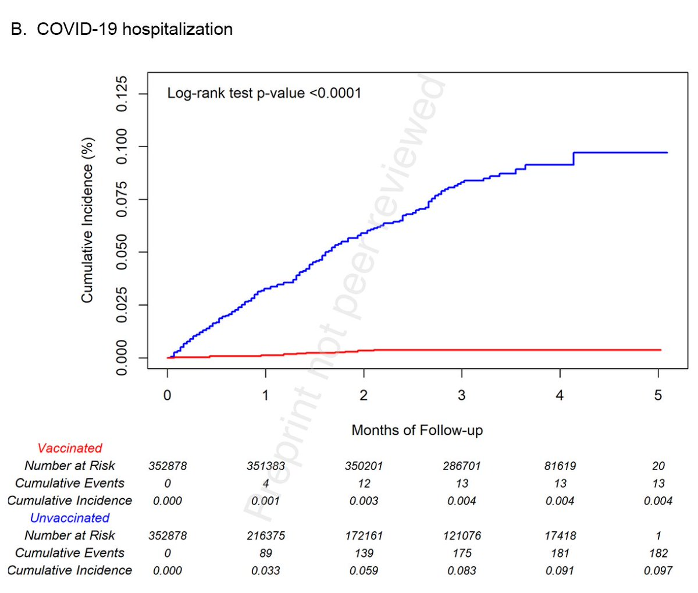</img></a><a href="E-xPV9pUUAAVBtn.jpg"  >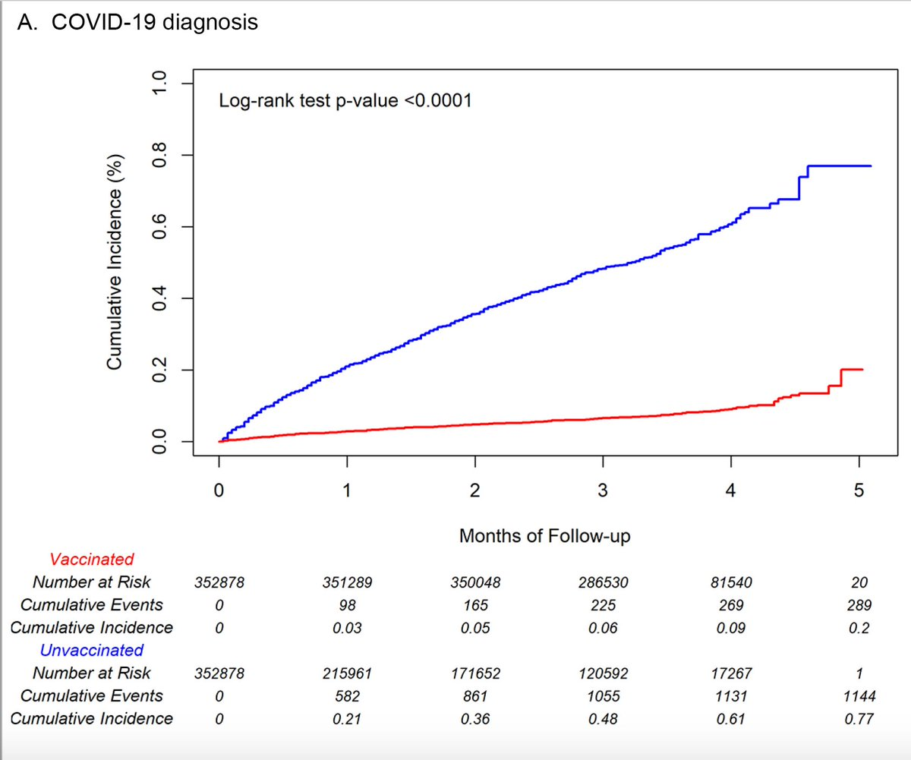</img></a>

---

<a href="https://twitter.com/erictopol/status/1435613450827272197" target="_blank" rel="noreferer">14:38 UCT</a>

Virus sequencing data from over 5,000 individuals with  infections March to June 

<a href="E-xSuHJVkAMjJiq.jpg"  >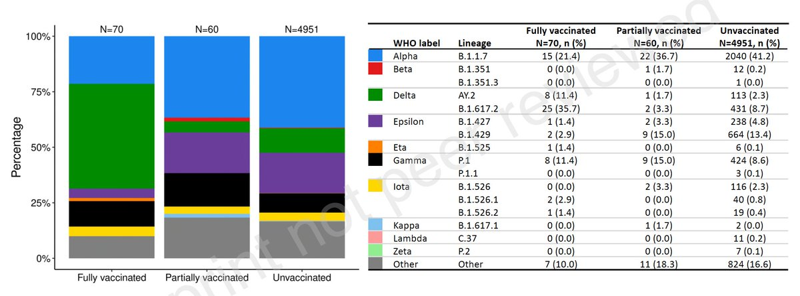</img></a>

---

<a href="https://twitter.com/erictopol/status/1435631425366081538" target="_blank" rel="noreferer">15:49 UCT</a>

Notable is that @KPSCalResearch also published their data on the Pfizer vaccine, which looks different for protection from infections (VE 47% at ≥5 months) and hospitalizations (VE 90%), but included a higher proportion of Delta through August 8, 2001
https://papers.ssrn.com/sol3/papers.cfm?abstract_id=3909743 

<a href="E-xjISBVgAAOTEZ.jpg"  >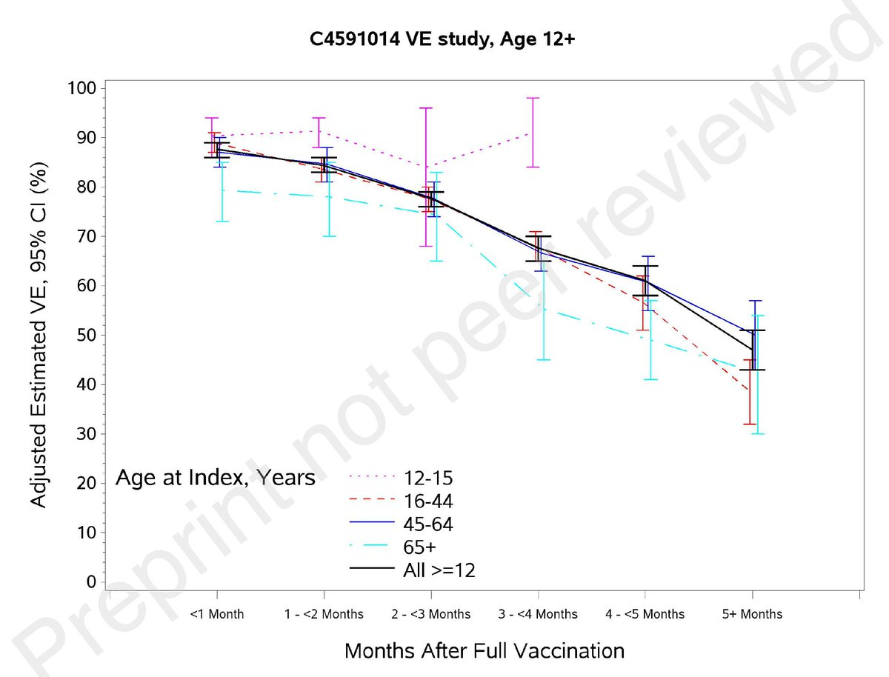</img></a>

---

<a href="https://twitter.com/erictopol/status/1435656081020129284" target="_blank" rel="noreferer">17:27 UCT</a>

@florian_krammer This is very good, Florian
Would add
Kaiser So Cal (any infections, hospitalizations)
https://papers.ssrn.com/sol3/papers.cfm?abstract_id=3909743
UCSD HCW NEJM Keehner et al (Symptomatic infections)
Israel (Goldberg, MedRxiv)
Portugal (Kislaya MedRxiv)

---

<a href="https://twitter.com/erictopol/status/1435656617836437512" target="_blank" rel="noreferer">17:29 UCT</a>

@Bob_Wachter Much appreciated, Bob 🙏

---

<a href="https://twitter.com/erictopol/status/1435658153417318404" target="_blank" rel="noreferer">17:35 UCT</a>

That big 💉💉 gap shows up in hospitalizations (countries with available data @OurWorldInData) 

<a href="E-x7cWbUcAEFQA9.jpg"  >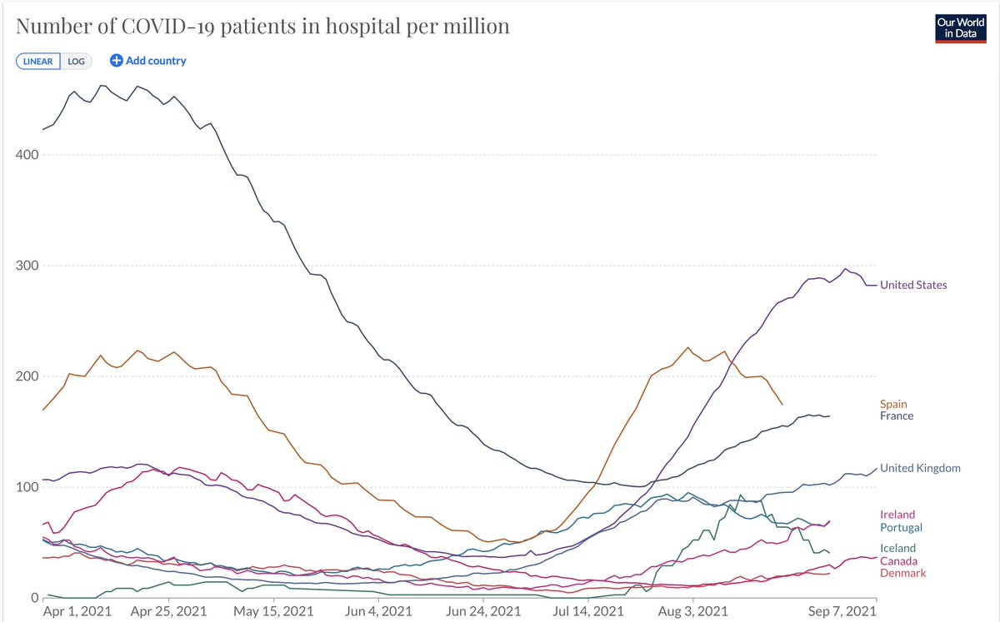</img></a>

---

<a href="https://twitter.com/erictopol/status/1435665397148045314" target="_blank" rel="noreferer">18:04 UCT</a>

What happens to hospitalizations among unvaccinated &amp; fully vaccinated during the Delta wave?  US data is hard to come by, but Utah gives us a look. They approximately double
https://coronavirus-dashboard.utah.gov/risk.html
July -&gt;
Fully vaccinated 2 -&gt; 4/100,000
Unvaccinated 7 -&gt; 16/100,000
@MCSlab_uiuc 

<a href="E-yCDA-UcAMGV-k.jpg"  >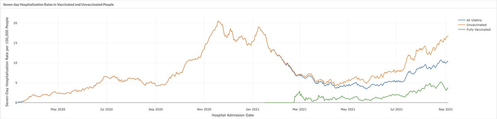</img></a>

---

<a href="https://twitter.com/erictopol/status/1435666024964128772" target="_blank" rel="noreferer">18:07 UCT</a>

Above was corrected per 100K, not %
Here are Oklahoma data in tabular form (July-August, = Delta)
~8% hospitalizations among fully vaccinated with age shift to older compared with the unvaccinated hospitalizations 

<a href="E-yCTT3VQAkX1Z3.jpg"  >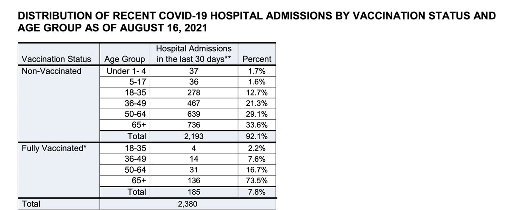</img></a>

---

<a href="https://twitter.com/erictopol/status/1435682012153581573" target="_blank" rel="noreferer">19:10 UCT</a>

Pretty damn sad that it takes judges, repetitively, to order what is medically sound to combat anti-science in the US pandemic. And even worse it's about protecting children.
https://www.ft.com/content/56594b25-673b-4136-9f5c-08121d048ad5 

<a href="E-yP-HbVIAQDhXB.jpg"  >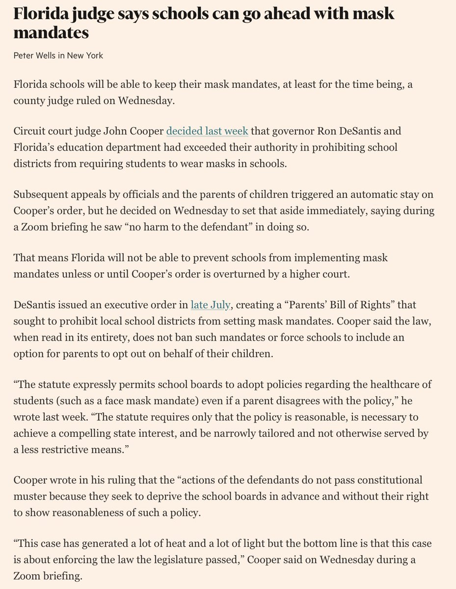</img></a>

---

<a href="https://twitter.com/erictopol/status/1435687148246605826" target="_blank" rel="noreferer">19:31 UCT</a>

If the Mu variant (B.1.621) is the most immune evasive we've seen in the pandemic, as a lab study preprint suggests, then why is it being displaced by Delta? https://www.biorxiv.org/content/10.1101/2021.09.06.459005v1
https://www.science.org/content/article/united-states-boosts-tracking-coronavirus-strains-mu-variant-draws-scrutiny 
Delta's transmissibility overrides Mu's immune evasion (as it did Beta) 

<a href="E-yUYHNVIAEFK4L.jpg"  >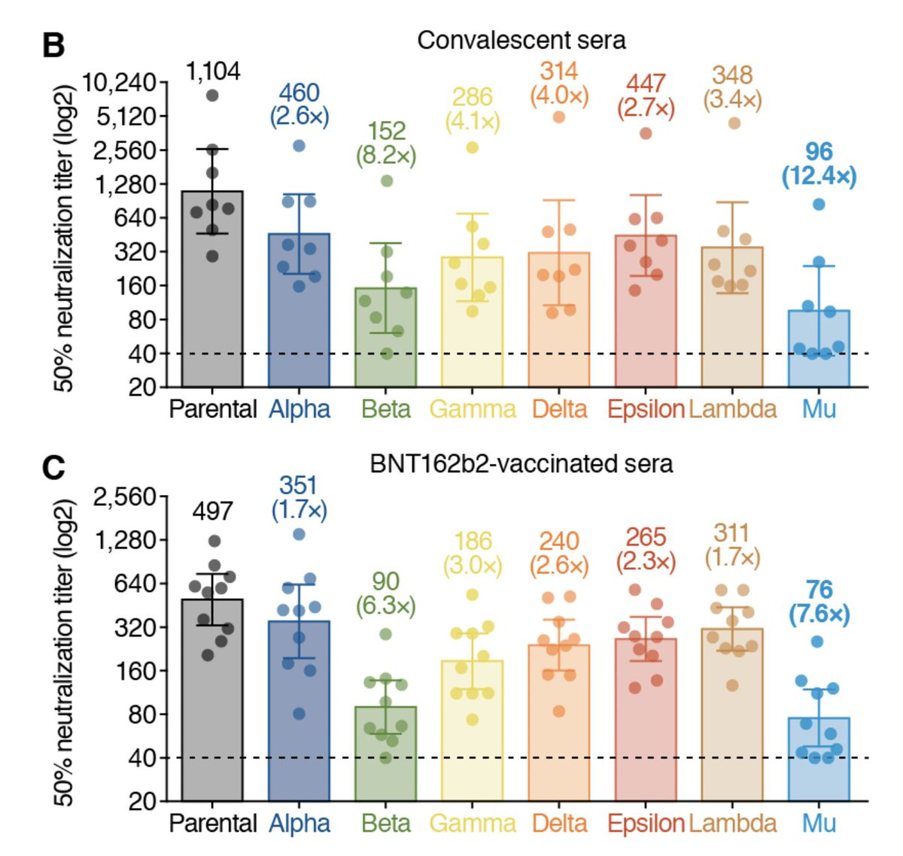</img></a><a href="E-yVDq3VkAAiR0X.jpg"  >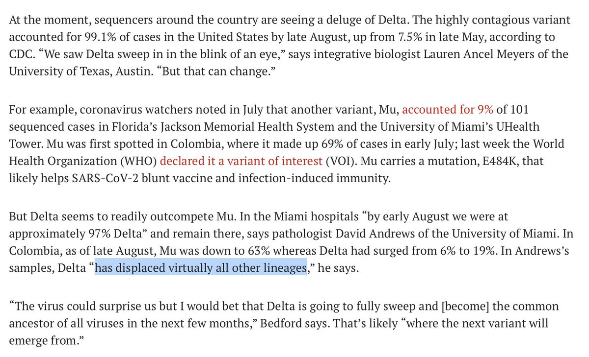</img></a>

---

<a href="https://twitter.com/erictopol/status/1435692666788868102" target="_blank" rel="noreferer">19:53 UCT</a>

@SystemsVirology @ScienceMagazine @NewsfromScience Thank you for such rigorous work (again) to define the immune escape feature of all the variants of concern and interest.  I was just trying to put in perspective the analogy between Beta and Mu when Delta is around.

---

<a href="https://twitter.com/erictopol/status/1435698514290360320" target="_blank" rel="noreferer">20:16 UCT</a>

This new pandemic record among children is depressing, to say the least. Now 27% of new US cases are in kids, another record @hospitals4kids @AmerAcadPeds
https://downloads.aap.org/AAP/PDF/AAP%20and%20CHA%20-%20Children%20and%20COVID-19%20State%20Data%20Report%209.2%20FINAL.pdf
Best way to prevent covid in children right now is vaccination in adults; we are way short on that 

<a href="E-yenZfVUAA9zrX.jpg"  >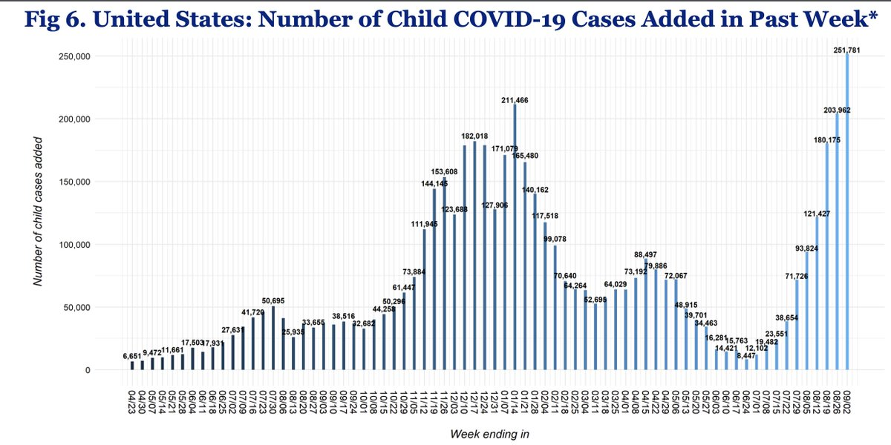</img></a>

---

<a href="https://twitter.com/erictopol/status/1435715570402402306" target="_blank" rel="noreferer">21:24 UCT</a>

✓ Boosters start immediately for ≥ age 60, HCW if past 5-6 months w/ Pfizer vax
✓ #1 priority: universal #SARSCoV2 vaccine to override all variants; nasal vaccine
✓ Green pass for fully vaccinated; confirmed prior covid = 1 dose vaccine
✓ More vaxx mandates; 80% total pop🎯

---

<a href="https://twitter.com/erictopol/status/1435715569072762882" target="_blank" rel="noreferer">21:24 UCT</a>

A 6-point Covid plan is being announced by @POTUS 
My plan:
✓Ample supply rapid home tests &amp; medical grade masks provided free to all households (daily use: schools)
✓National Covid daily tracking &amp; posting w/ hospitalization data:💉, timing, age, prior Covid, 🦠genomics, etc

---

<a href="https://twitter.com/erictopol/status/1435718329386233860" target="_blank" rel="noreferer">21:34 UCT</a>

@jklmd123 @POTUS that's included in the last one!

---

<a href="https://twitter.com/erictopol/status/1435720490962735108" target="_blank" rel="noreferer">21:43 UCT</a>

@moxfyre @POTUS Absolutely

---

<a href="https://twitter.com/erictopol/status/1435722838284013570" target="_blank" rel="noreferer">21:52 UCT</a>

A new US study of vaccine effectiveness (VE) pre-Delta for age ≥50: VE 89% vs hospitalization for mRNA vaccines; 68% for J&amp;J vaxx. https://www.nejm.org/doi/full/10.1056/NEJMoa2110362?query=featured_home 

<a href="E-y2HsUVkAMG0pg.jpg"  >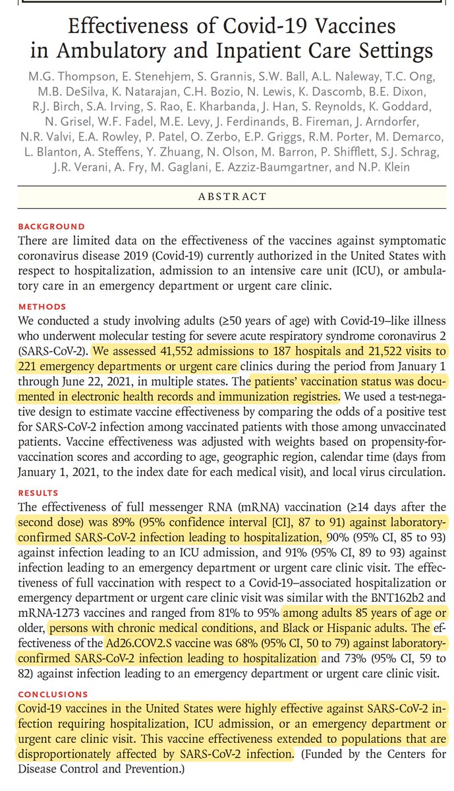</img></a><a href="E-y2JeSVEAARg0b.jpg"  >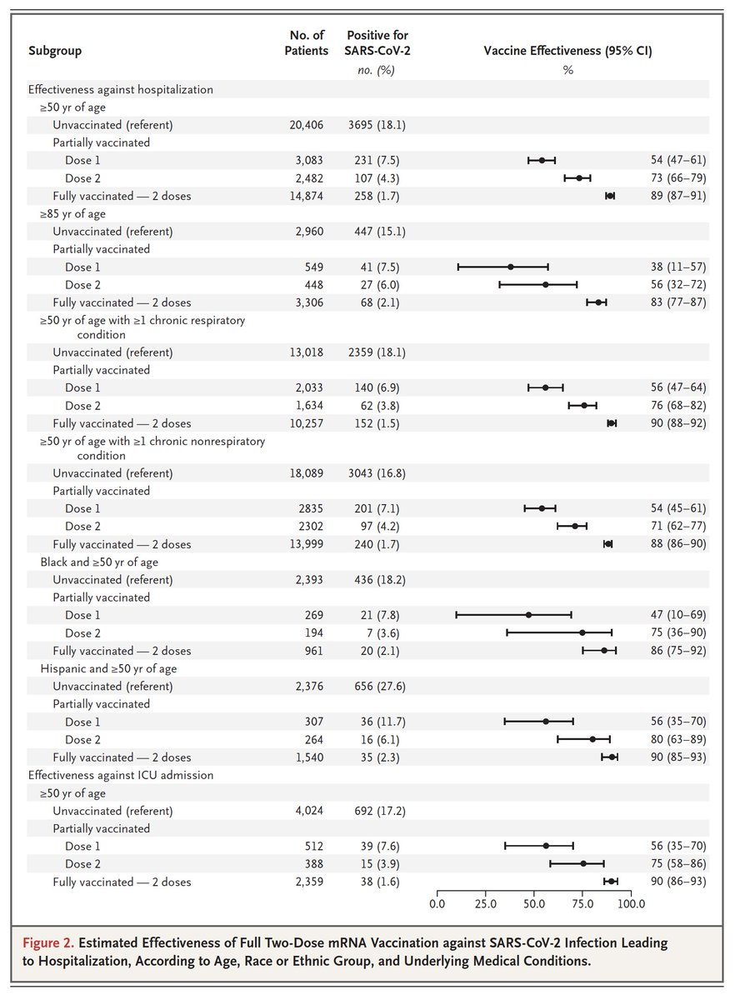</img></a>

---

<a href="https://twitter.com/erictopol/status/1435724461211217922" target="_blank" rel="noreferer">21:59 UCT</a>

Just published @NEJM
Reassuring data on vaccination preventing transmission from over 144,000 health care workers and their &gt;194,000 household contacts https://www.nejm.org/doi/full/10.1056/NEJMc2106757?query=featured_home 

<a href="E-y3WnhVEAMKH08.jpg"  >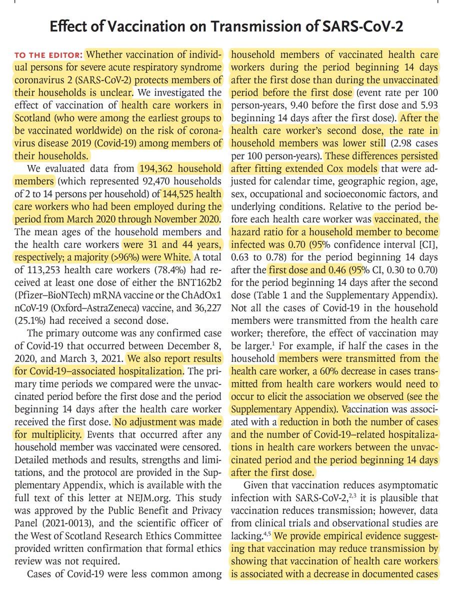</img></a><a href="E-y3YZ3VIAA-PS6.jpg"  >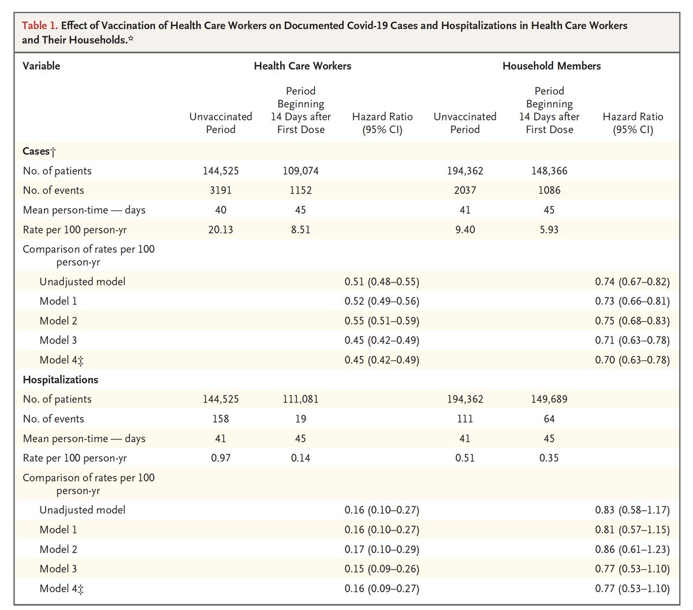</img></a>

---

<a href="https://twitter.com/erictopol/status/1435746974477651970" target="_blank" rel="noreferer">23:28 UCT</a>

I want to thank @SecBecerra's senior staff who met with me today to discuss this situation and plan to work on it. https://twitter.com/EricTopol/status/1434520561661583376

