+++
title = "Tweets by Eric Topol Sept 09"
Summary = ""
tags = ["Twitter"]
category = "Twitter"
+++

---

<a href="https://twitter.com/erictopol/status/1435788923171598343" target="_blank" rel="noreferer">02:15 UCT</a>

A big step for required vaccination in schools will come tomorrow from @CountyofLA, the 2nd largest school district in the US with &gt;600,000 students, for age ≥ 12
http://laschoolboard.org/sites/default/files/09-09-21SpclBdMaterials.pdf @lapublichealth 

<a href="E-zxicDUcAAFNb8.jpg"  >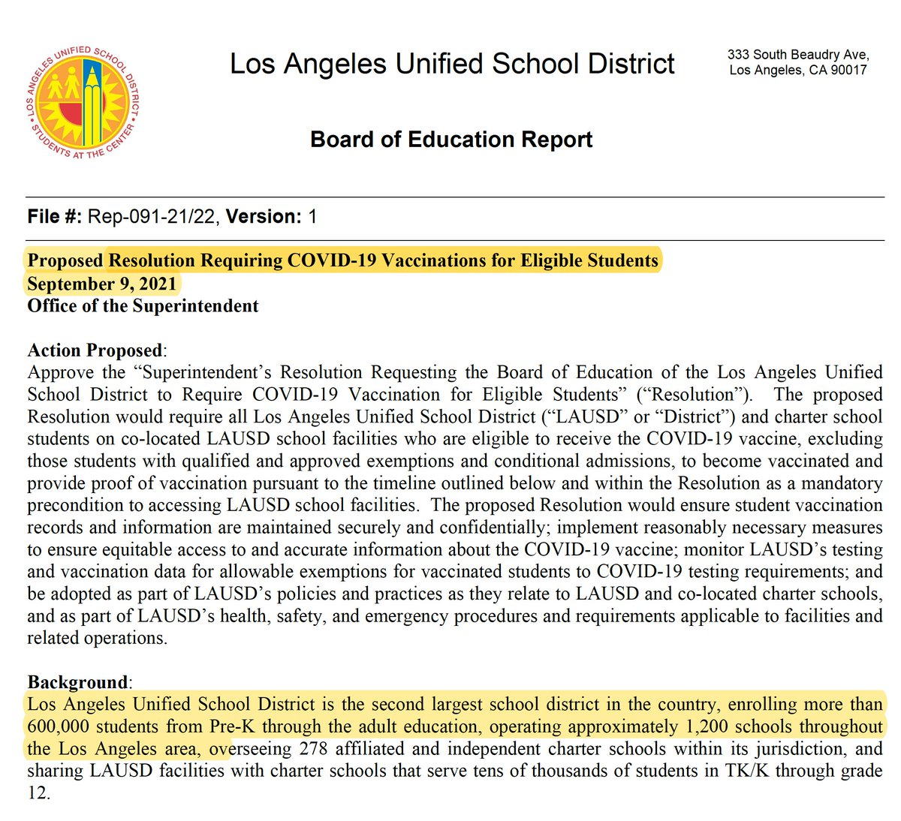</img></a>

---

<a href="https://twitter.com/erictopol/status/1435796803362848771" target="_blank" rel="noreferer">02:46 UCT</a>

Crushed it.
🇳🇿 vs Delta
https://www.health.govt.nz/our-work/diseases-and-conditions/covid-19-novel-coronavirus/covid-19-data-and-statistics/covid-19-source-cases
down to 13 today 

<a href="E-z5TcQUYAUtsvE.jpg"  >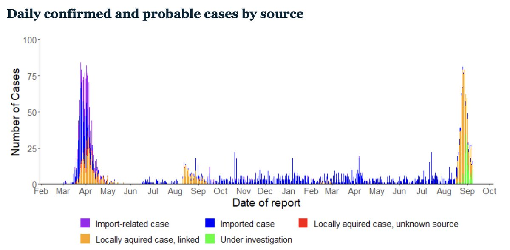</img></a>

---

<a href="https://twitter.com/erictopol/status/1435808022115205123" target="_blank" rel="noreferer">03:31 UCT</a>

@DennisOwen Health Care Workforce
(Which needs to be 100% fully vaccinated)

---

<a href="https://twitter.com/erictopol/status/1435814336979562498" target="_blank" rel="noreferer">03:56 UCT</a>

RT @ashishkjha: This is great leadership. What we need to keep people in hospitals safe. 

You can't be a unvaccinated healthcare provider…

---

<a href="https://twitter.com/erictopol/status/1435965798732816384" target="_blank" rel="noreferer">13:58 UCT</a>

New @NatureMedicine 
A randomized trial of convalescent plasma shows it not only didn't help, but actually harmed
"Patients in the convalescent plasma arm had more serious adverse events (33.4% versus 26.4%; RR = 1.27, 95% CI 1.02–1.57, P = 0.034)."
https://www.nature.com/articles/s41591-021-01488-2 

<a href="E-2TMwSVEAUCDUH.jpg"  >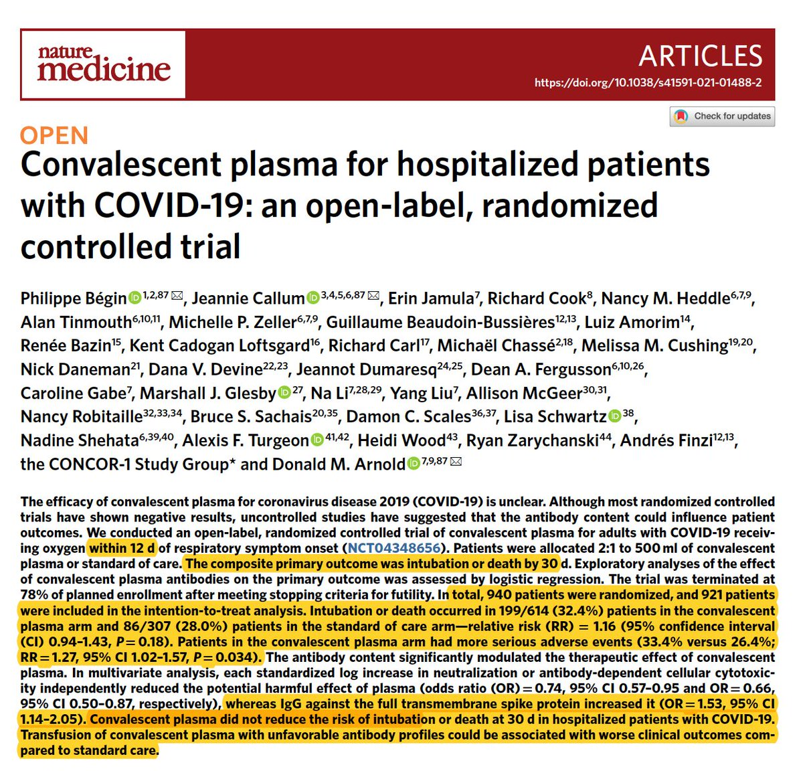</img></a><a href="E-2TO6RVEAEUFDP.jpg"  >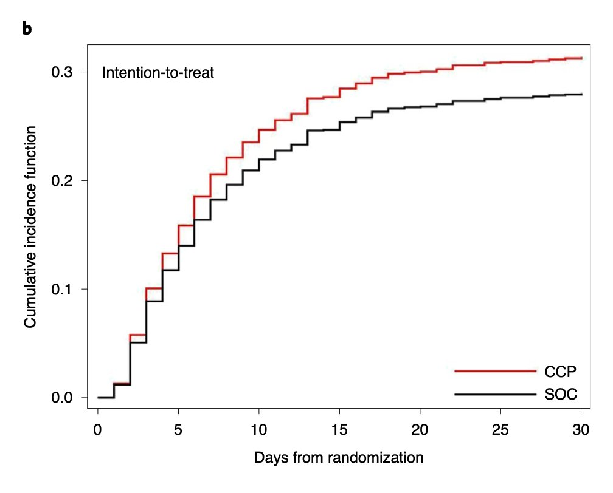</img></a>

---

<a href="https://twitter.com/erictopol/status/1435967208270692362" target="_blank" rel="noreferer">14:03 UCT</a>

Recall the @US_FDA gave an emergency authorization for this treatment in August 2020 with no randomized clinical trial data, which promoted its use in hundreds of thousands of patients
https://www.medscape.com/viewarticle/936611

---

<a href="https://twitter.com/erictopol/status/1435984559502286852" target="_blank" rel="noreferer">15:12 UCT</a>

Once crucial lesson the pandemic has taught us is the essentiality of genomic surveillance and "molecular epidemiology." A new outstanding review @Nature Medicine by @MarionKoopmans @1986Bom and colleagues https://www.nature.com/articles/s41591-021-01472-w 

<a href="E-2kNaZUYAM-lo-.jpg"  ></img></a><a href="E-2kTNyVcAAVN89.jpg"  >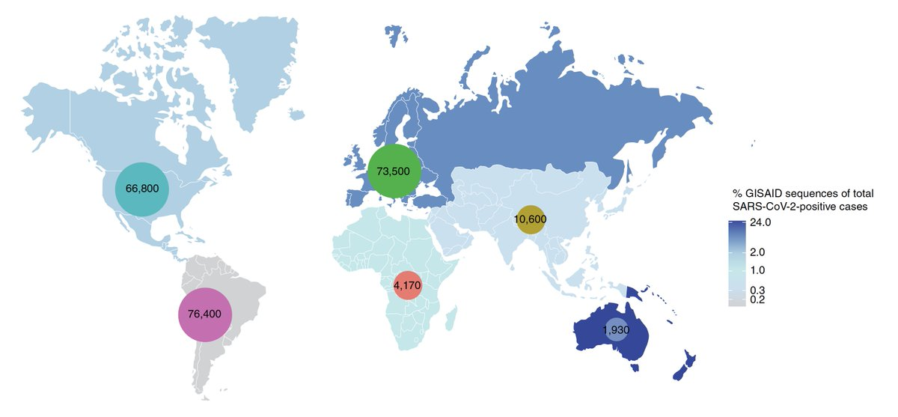</img></a>

---

<a href="https://twitter.com/erictopol/status/1435993132928155650" target="_blank" rel="noreferer">15:46 UCT</a>

Is Delta more virulent? @DLeonhardt concludes it isn't with many inputs https://www.nytimes.com/2021/09/09/briefing/delta-variant-cases-severity.html
But UK and Denmark studies show a 2.3X and 2.8X increased risk of hospitalization compared with Alpha
And the rate of rise of US hospitalizations is clearly increased in the Delta wave 

<a href="E-2r83tVgAEOovy.jpg"  >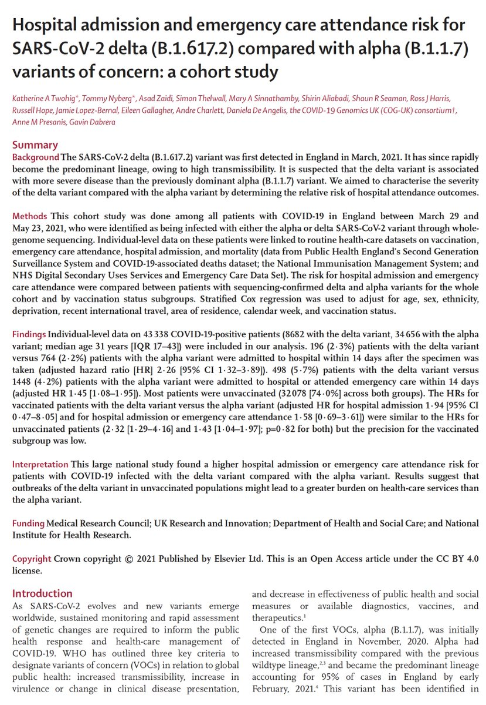</img></a><a href="E-2r-RoVQAItIK_.jpg"  >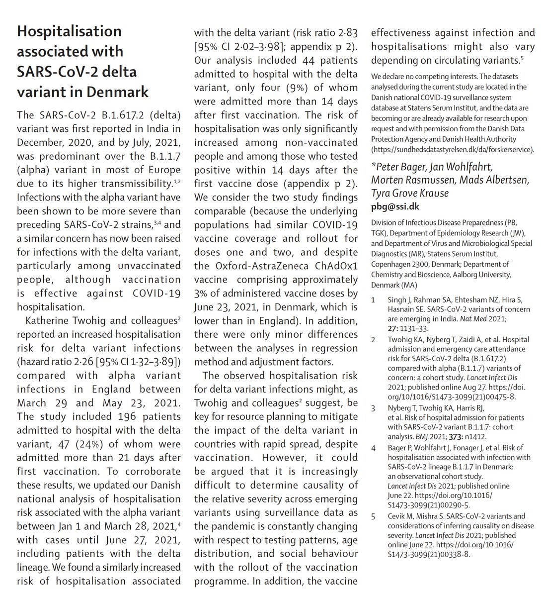</img></a><a href="E-2sAitVkAkG-Er.jpg"  >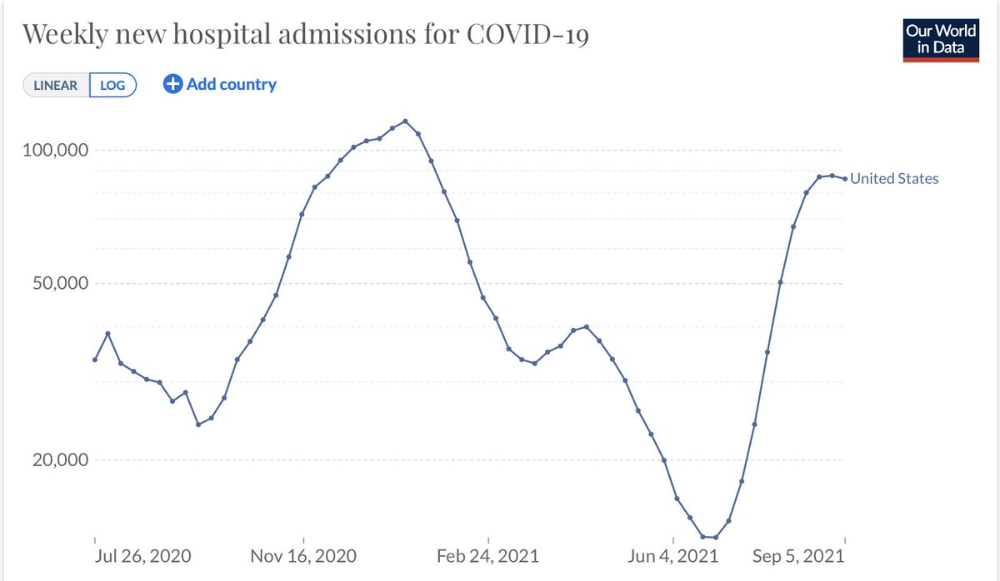</img></a><a href="E-2sClNVcAITCBH.jpg"  >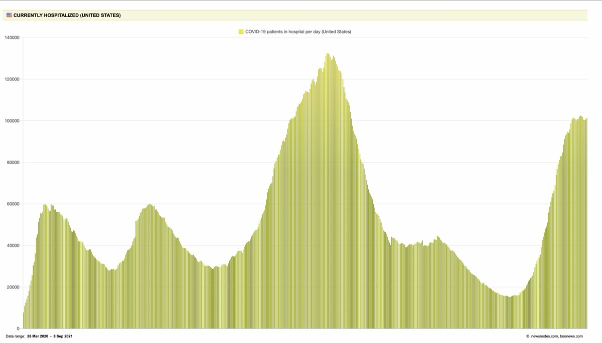</img></a>

---

<a href="https://twitter.com/erictopol/status/1435995935918620672" target="_blank" rel="noreferer">15:58 UCT</a>

What mRNA technology has the potential to bring us
—an HIV vaccine (30 years later)
https://www.economist.com/science-and-technology/a-new-aids-vaccine-heads-to-clinical-trials/21804378
—a vaccine vs 3 pathogens at once 

<a href="E-2uLvZVkAY8PsC.jpg"  >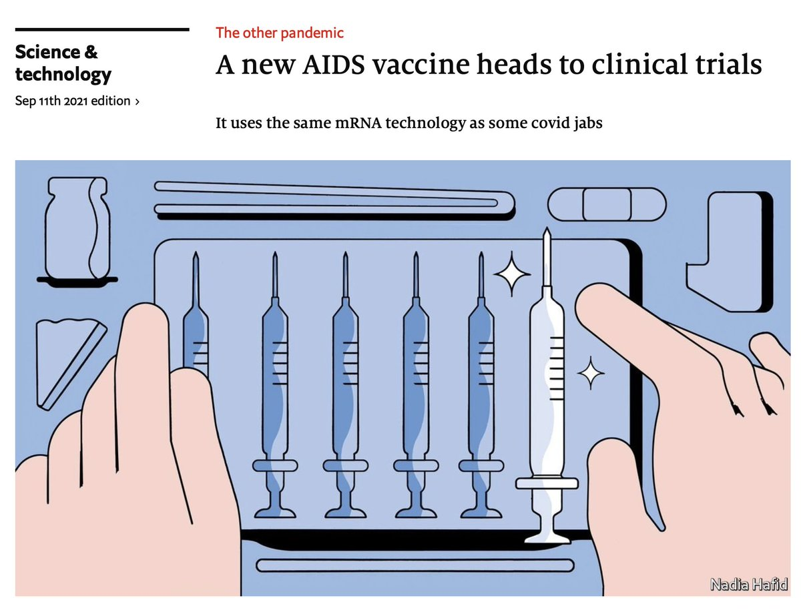</img></a><a href="E-2uVivVkAQslh-.jpg"  >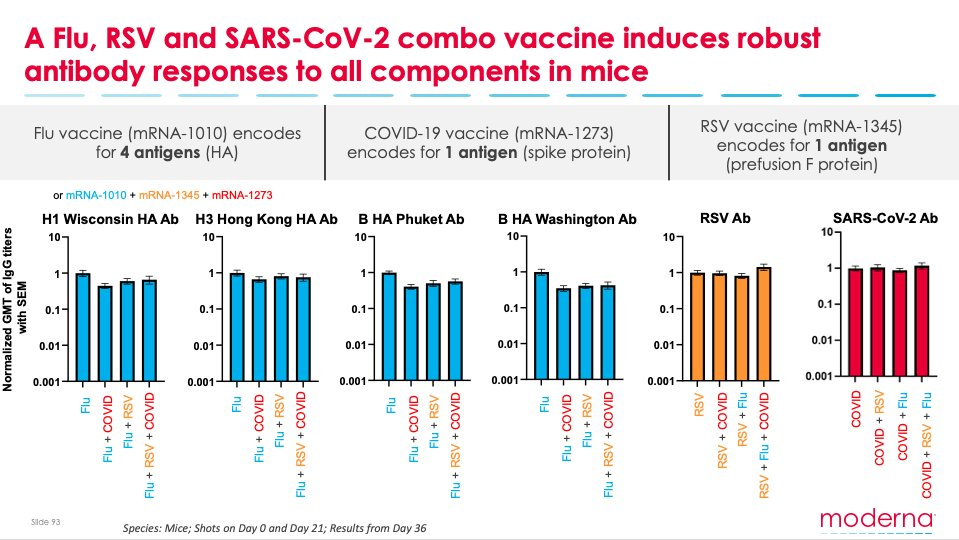</img></a>

---

<a href="https://twitter.com/erictopol/status/1435997315202895876" target="_blank" rel="noreferer">16:03 UCT</a>

Striking relationship between adult vaccinations and children getting covid, requiring hospitalization (at state level)
https://www.nytimes.com/interactive/2021/09/09/us/covid-children-cases-icu.html by @LaurenLeatherby and 
@amyswalk @nytgraphics 

<a href="E-2vsagVcAE7PwU.jpg"  >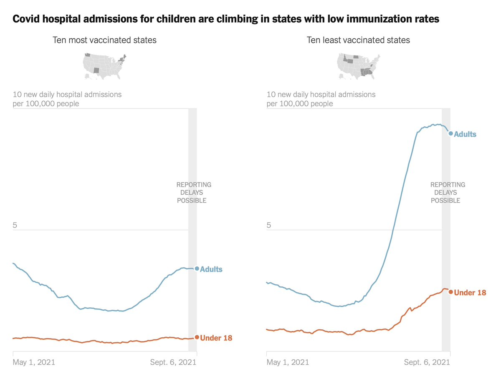</img></a>

---

<a href="https://twitter.com/erictopol/status/1436000001700683784" target="_blank" rel="noreferer">16:14 UCT</a>

Annotations
—Green pass required for air, rail travel as has been done in Canada and many countries
—Requirement for vaccination all health care workers, teachers
—Need US data to decide about Moderna, J&amp;J boosters (can't come from Israel) 

<a href="E-2yD9EUYAE4bu0.jpg"  >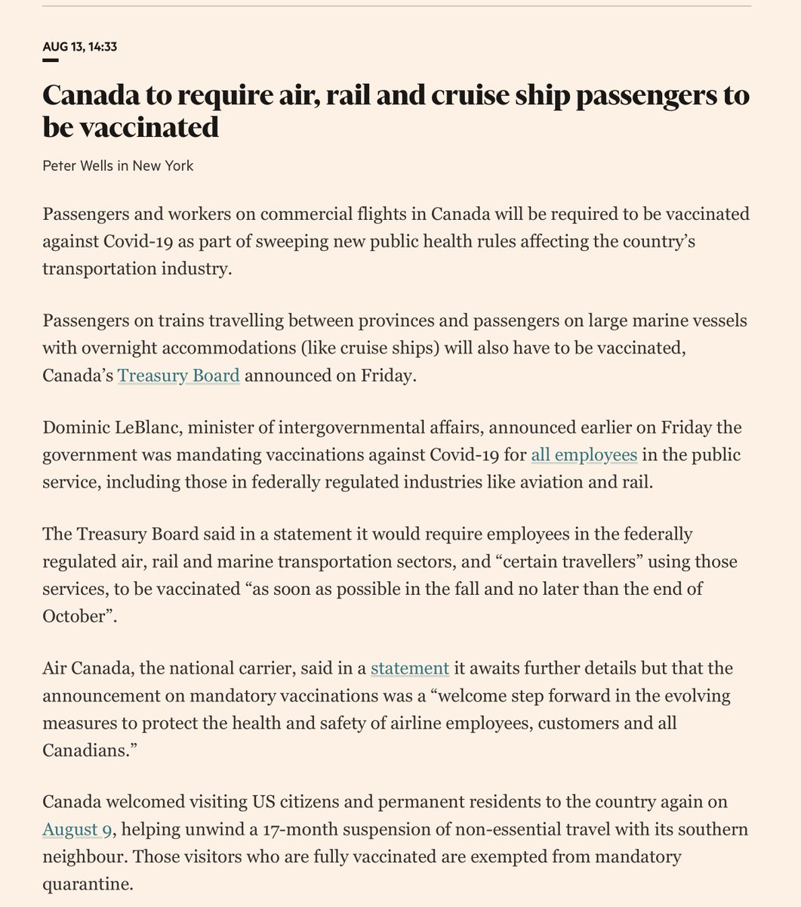</img></a>

---

<a href="https://twitter.com/erictopol/status/1436005711847170050" target="_blank" rel="noreferer">16:36 UCT</a>

Thrilled to see Jeff Kelly, my friend and @scrippsresearch colleague, recognized for a breakthrough prize for his ingenious and indefatigable protein folding work vs amyloid disease https://twitter.com/scrippsresearch/status/1435943585858433030

---

<a href="https://twitter.com/erictopol/status/1436009739729571840" target="_blank" rel="noreferer">16:52 UCT</a>

You can add multiple types of cancer to the list of potentials, too (clinical trials starting)
https://www.science.org/doi/10.1126/scitranslmed.abc7804 @ScienceTM 

<a href="E-26v8LVIAcqcoi.png"  >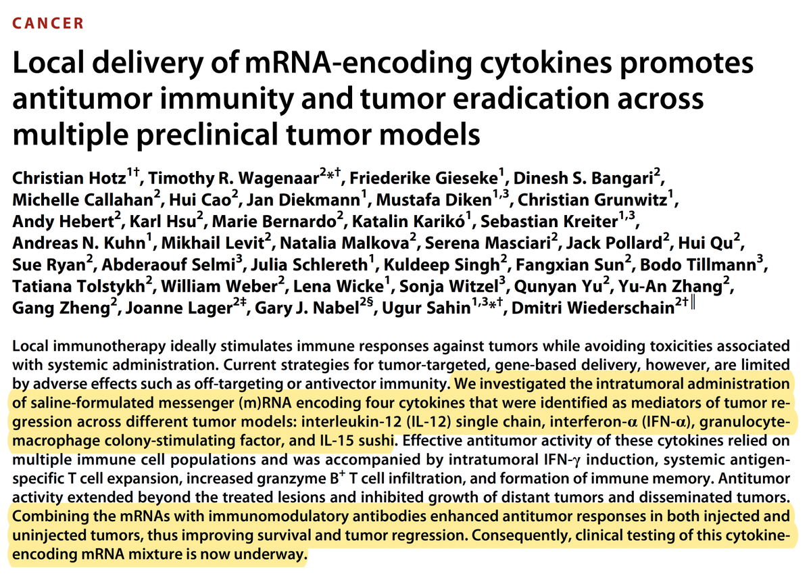</img></a>

---

<a href="https://twitter.com/erictopol/status/1436013639127822337" target="_blank" rel="noreferer">17:08 UCT</a>

@skathire @ScienceTM Yes, of course. Heard of that, Sek 😉

---

<a href="https://twitter.com/erictopol/status/1436015423242137601" target="_blank" rel="noreferer">17:15 UCT</a>

Th kidneys are the Rodney Dangerfield of #LongCovid. They don't get no respect https://www.nature.com/articles/s41581-021-00487-3
@KidneydrChirag @NatRevNeph 

<a href="E-2_6OxVIAY669N.jpg"  >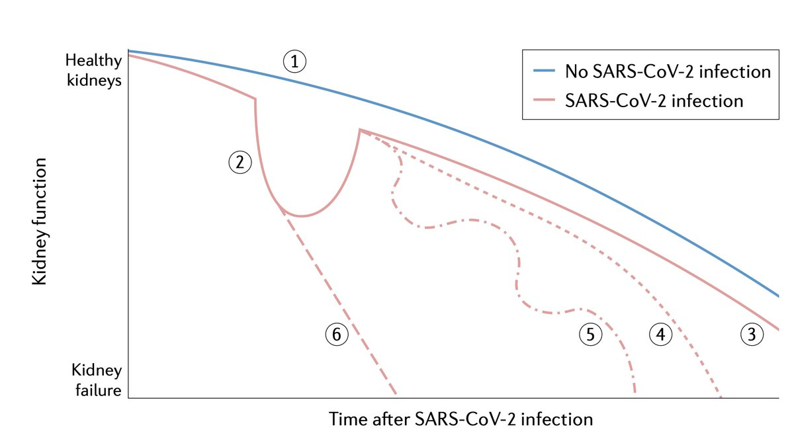</img></a>

---

<a href="https://twitter.com/erictopol/status/1436022182715400246" target="_blank" rel="noreferer">17:42 UCT</a>

This is big, good and overdue. 👏👏 https://twitter.com/HeidiNBC/status/1436011140337836039

---

<a href="https://twitter.com/erictopol/status/1436026691810304028" target="_blank" rel="noreferer">18:00 UCT</a>

The new http://science.org is a winner. Integrates all the Science journals news, perspectives, career stuff, Covid-19. @hholdenthorp's editorial 
"The past 18 months of pandemic life have revealed how much appetite there is for a trusted forum for scientific conversation." 

<a href="E-3IxLmVIBgA24w.jpg"  >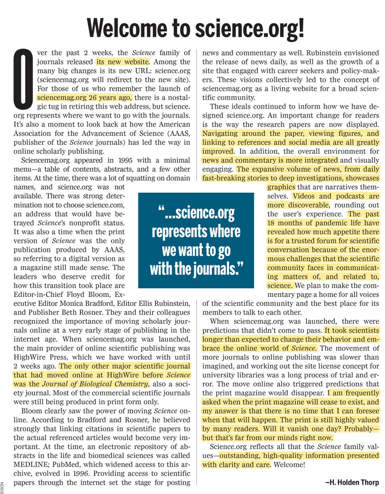</img></a><a href="E-3IzJ3VIAwL8AL.jpg"  >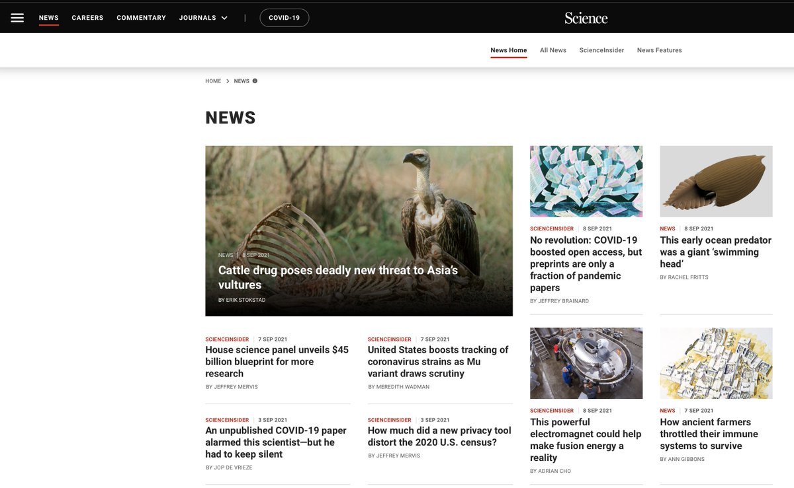</img></a>

---

<a href="https://twitter.com/erictopol/status/1436034427763638272" target="_blank" rel="noreferer">18:31 UCT</a>

Just published @SciImmunology 
The importance of antibodies to the S2 portion of the #SARSCoV2 spike protein related to survival from Covid and cross-reactivity with a common cold coronavirus
https://www.science.org/doi/10.1126/sciimmunol.abj2901 @ragoninstitute 

<a href="E-3QrmCVUA05HSp.jpg"  >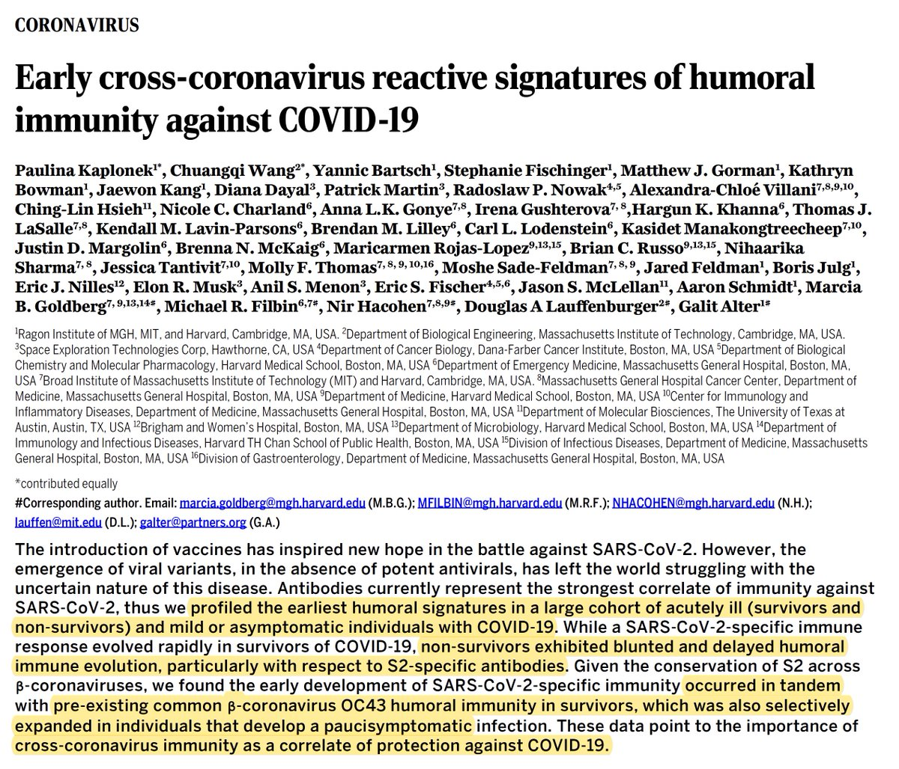</img></a>

---

<a href="https://twitter.com/erictopol/status/1436051335275696135" target="_blank" rel="noreferer">19:38 UCT</a>

What's good and not good about @POTUS's new Covid plan
Good: major 💉mandates for 17 million health care workforce, Fed &amp; private co employees. Discounts on rapid home tests. 
Not Good:
—No data mess fix
—No Green Pass: air, rail, public transport; access to many activities 

<a href="E-3dZVuVUBYcO8W.jpg"  >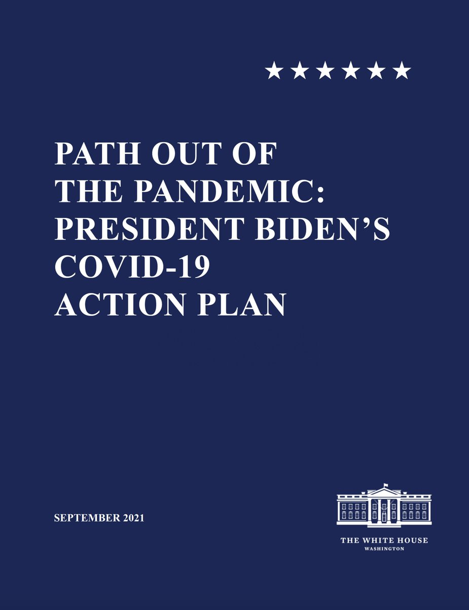</img></a>

---

<a href="https://twitter.com/erictopol/status/1436051338765357079" target="_blank" rel="noreferer">19:38 UCT</a>

—No free, ample supply of rapid home tests, medical-grade masks to all households. 35% off a $10+/test is unhelpful
—Lack of frequent (qd or qod),free testing for all schools
—No mention of priority to get a universal #SARSCoV2 vaccine or nasal vaccine
—Fuzzy ?? booster program

---

<a href="https://twitter.com/erictopol/status/1436054612075696131" target="_blank" rel="noreferer">19:51 UCT</a>

—Continued lack of recognition of Prior Covid to = 1 dose of vaccine (important for Green pass/CDC cards)
—A vaccine-centric, lack attention to data deficiency,  soft package that is not the aggressive "path out of the pandemic" that we need now.

---

<a href="https://twitter.com/erictopol/status/1436057409911345161" target="_blank" rel="noreferer">20:02 UCT</a>

RT @JuliaRaifman: @EricTopol We have got to do better than this. 

Tens of thousands more lives and livelihoods are at stake. We need a ful…

---

<a href="https://twitter.com/erictopol/status/1436066484963332115" target="_blank" rel="noreferer">20:38 UCT</a>

Summary of the good part of the plan 

<a href="E-3u0pyVUAYlspn.jpg"  >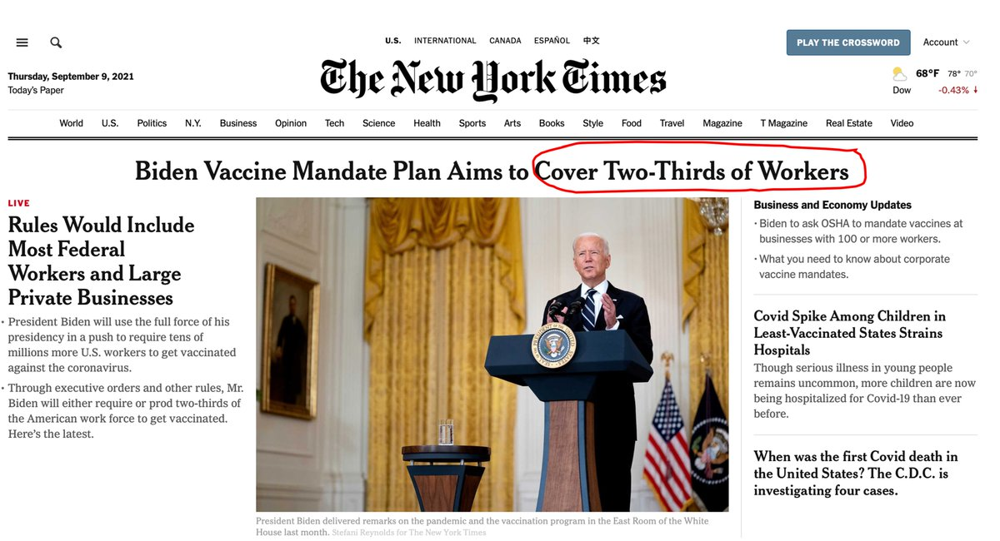</img></a>

---

<a href="https://twitter.com/erictopol/status/1436070445527158795" target="_blank" rel="noreferer">20:54 UCT</a>

Exhibit 99,999 of #VaccinesWork 
From today's @PHE_uk report https://assets.publishing.service.gov.uk/government/uploads/system/uploads/attachment_data/file/1016465/Vaccine_surveillance_report_-_week_36.pdf
Graphs via @JamesWard73 
Yes, there are some people, particularly advanced age, who get hospitalized or even die post-vaccination, but the 💉💉benefit is so overwhelming 

<a href="E-3yC5KVUAAk8Y8.png"  >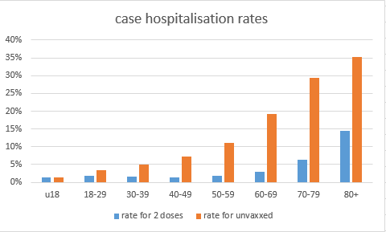</img></a><a href="E-3yLh9VUA8-t3F.png"  >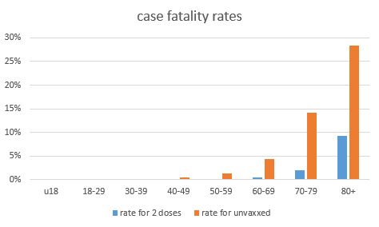</img></a>

---

<a href="https://twitter.com/erictopol/status/1436075459301679104" target="_blank" rel="noreferer">21:14 UCT</a>

No, it's not a "pandemic of the unvaccinated" @POTUS (a refrain just now)
That omits children age &lt; 12, with their highest covid rate since the US pandemic began.
The pandemic affects every person, irrespective of vaccination status, even if unvaccinated are the driving force.

---

<a href="https://twitter.com/erictopol/status/1436076263488188433" target="_blank" rel="noreferer">21:17 UCT</a>

@JamesSurowiecki @POTUS His statement was clearly directed to the eligible unvaccinated.

---

<a href="https://twitter.com/erictopol/status/1436078096239652871" target="_blank" rel="noreferer">21:24 UCT</a>

In full agreement with you, Leana
https://twitter.com/EricTopol/status/1436051335275696135 https://twitter.com/DrLeanaWen/status/1436077470105604096

---

<a href="https://twitter.com/erictopol/status/1436085058436100097" target="_blank" rel="noreferer">21:52 UCT</a>

@JamesSurowiecki @POTUS 💯, James.  I also wouldn't ignore people who have been vaccinated and have had symptomatic infections.

---

<a href="https://twitter.com/erictopol/status/1436097371130130448" target="_blank" rel="noreferer">22:41 UCT</a>

Comparison of CoronaVac and Pfizer vaccines for induction of IgG antibodies in &gt;40,000 vaccinees over 5 months reveals significant differences in 2-dose positivity (77% vs 95%) and decline pattern @TheLancetInfDis https://www.thelancet.com/journals/laninf/article/PIIS1473-3099(21)00479-5/fulltext 

<a href="E-4J4gfUYAIGKnh.jpg"  >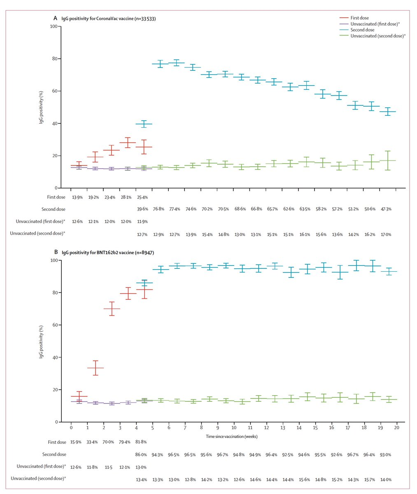</img></a>

---

<a href="https://twitter.com/erictopol/status/1436105969684017180" target="_blank" rel="noreferer">23:15 UCT</a>

An oral covid vaccine that triggers mucosal immunity, stored at room temperature, induces high levels of IgG and IgA and protection in widely accepted experimental models https://www.biorxiv.org/content/10.1101/2021.09.09.459634v1.full.pdf 

<a href="E-4Sb3HVcAMMHdF.jpg"  >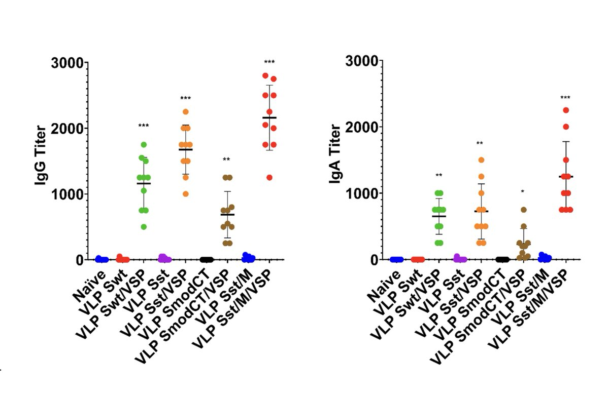</img></a><a href="E-4Sda7VcAoTMM9.jpg"  >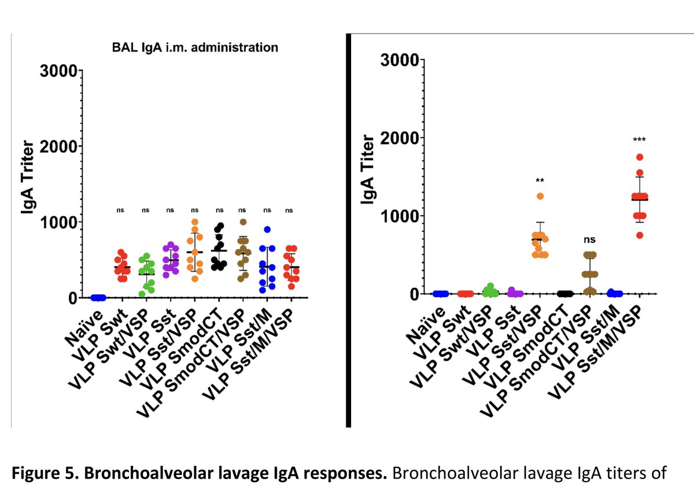</img></a>