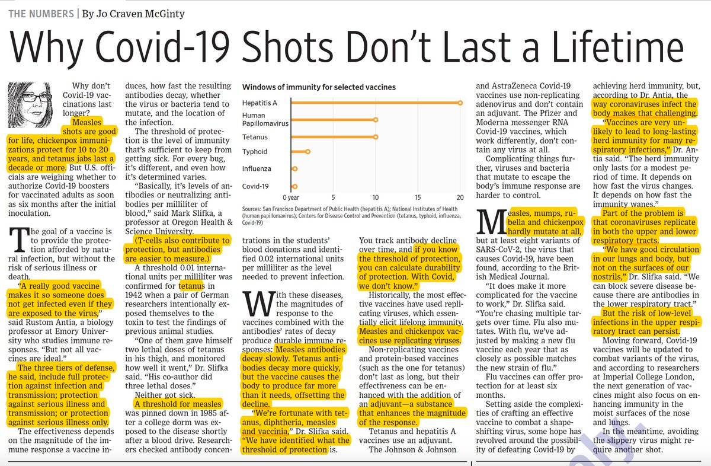
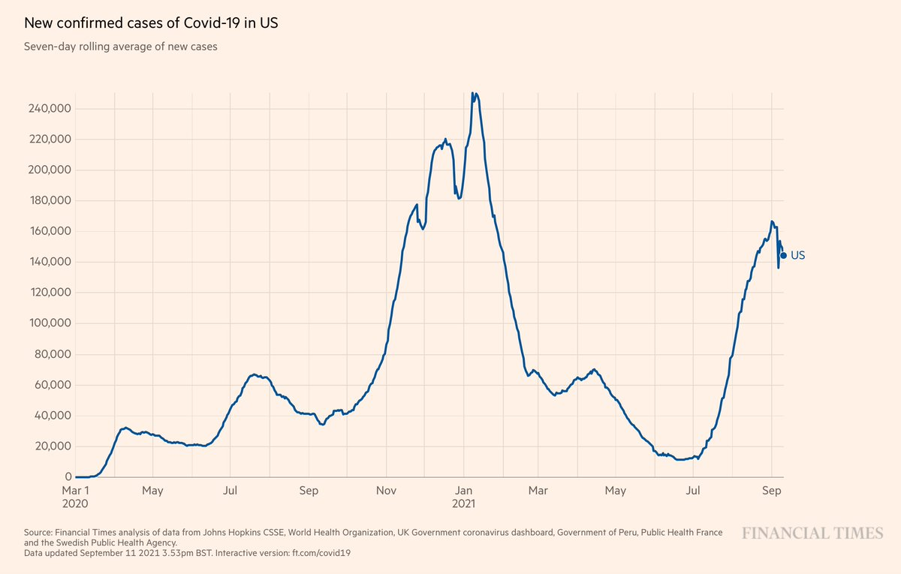
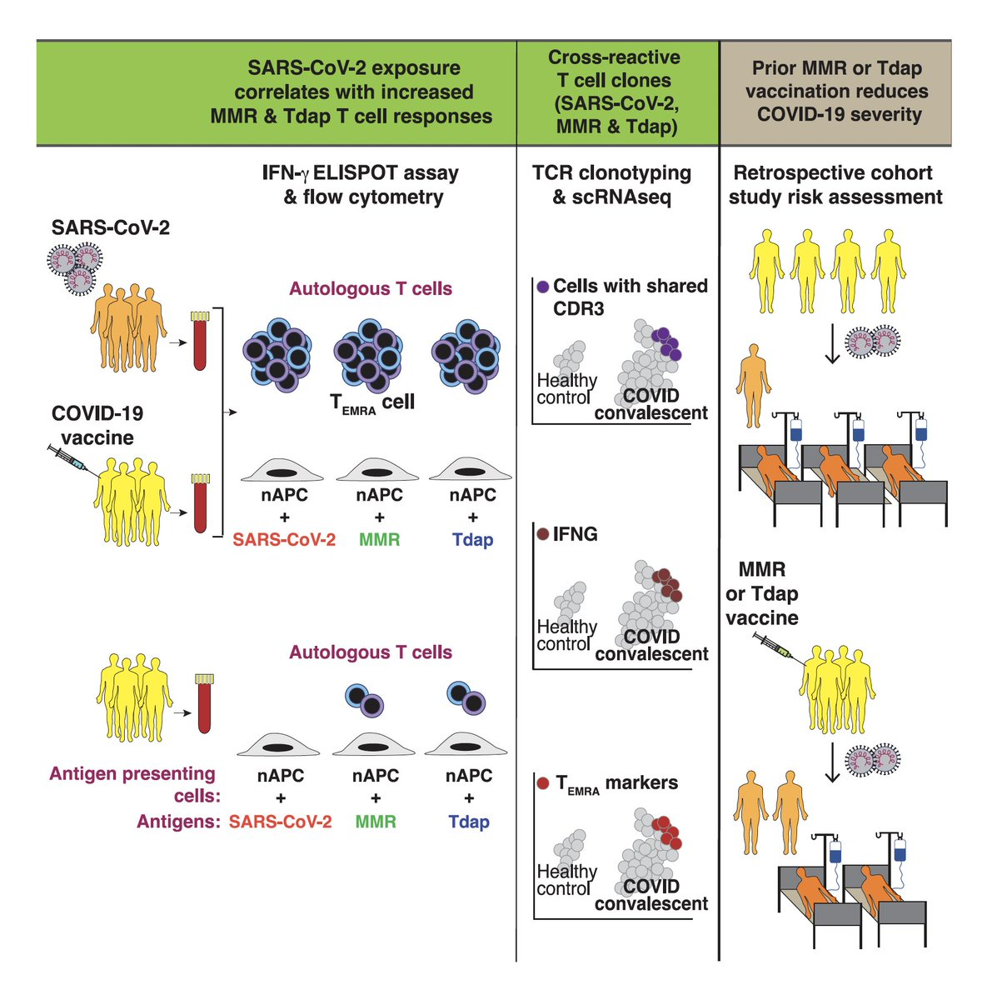
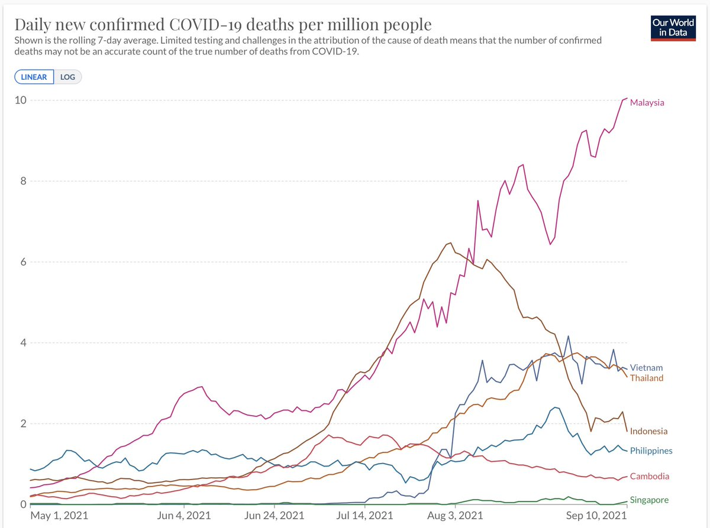
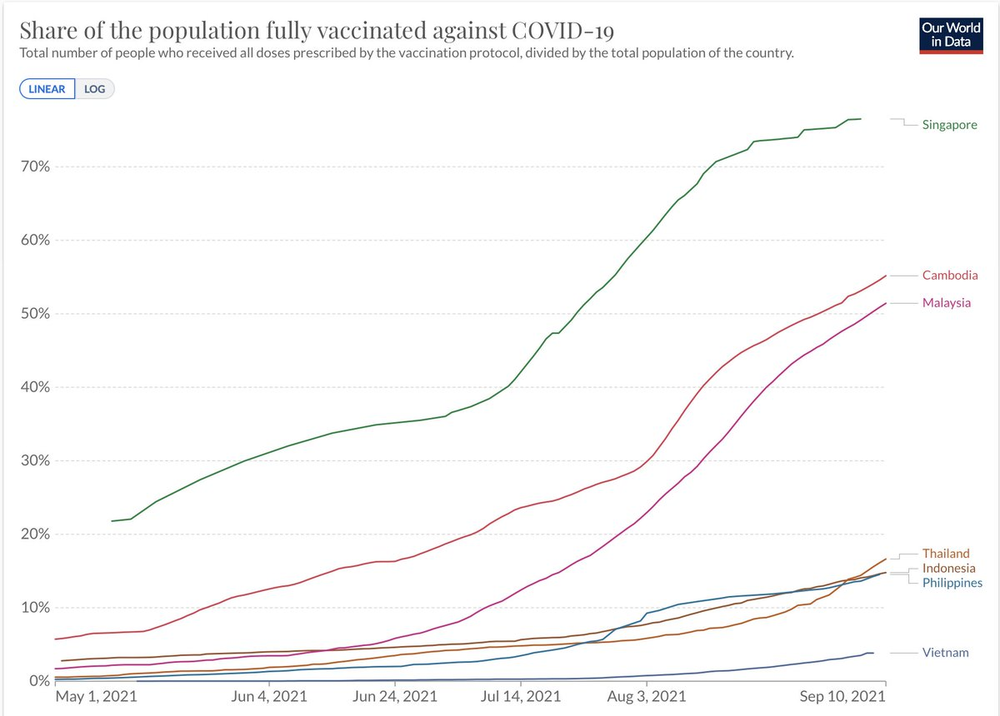
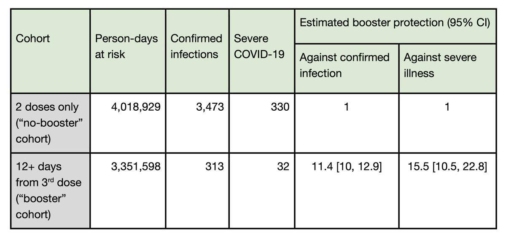
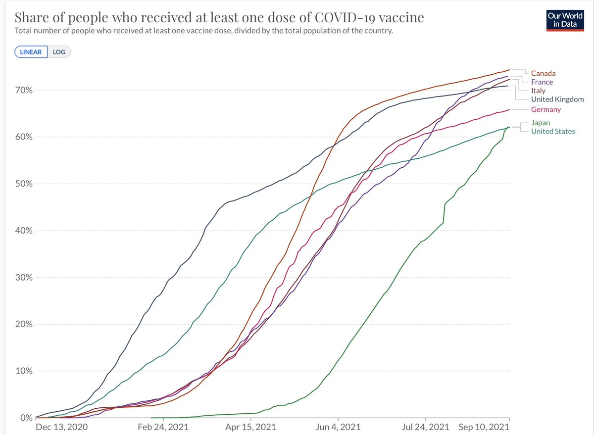
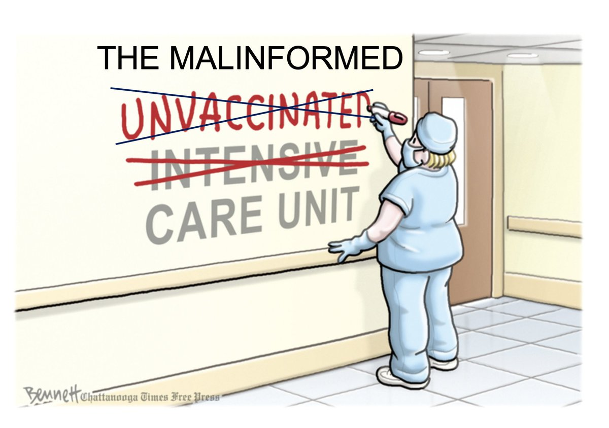
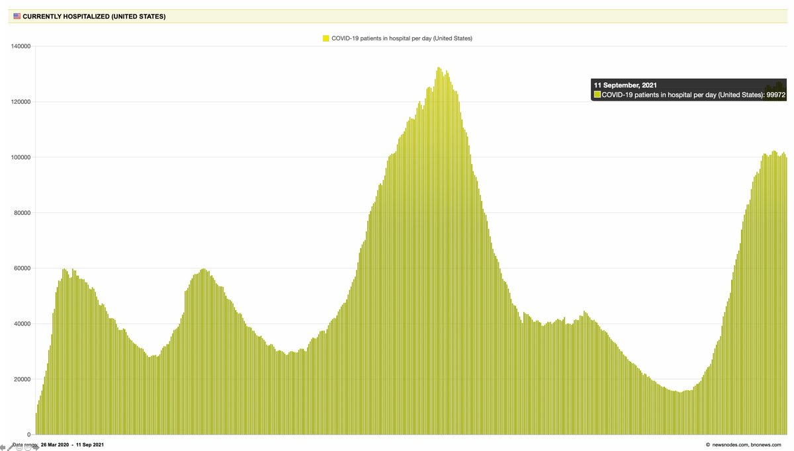

+++
title = "Tweets by Eric Topol Sept 11"
Summary = ""
tags = ["Twitter"]
category = "Twitter"
+++

---

<a href="https://twitter.com/erictopol/status/1436716500371468294" target="_blank" rel="noreferer">15:41 UCT</a>

On the durability of vaccines, including covid (simplified)
https://www.wsj.com/articles/some-vaccines-last-a-lifetime-heres-why-covid-19-shots-dont-11631266201?mod=searchresults_pos1&page=1 by @mcjomcg 
Focuses on neutralizing antibodies; the memory T cell response is helping to provide durable protection from Covid pneumonia 

<a href="E_A86yOUUAUvsxV.jpg"  ></img></a>

---

<a href="https://twitter.com/erictopol/status/1436720321378222086" target="_blank" rel="noreferer">15:56 UCT</a>

A wobbly beginning of a descent.
If only we could get back to ~10,000 cases/day, where we were in June, the only (and brief) time we achieved containment. 

<a href="E_BBF8cUYAECA4z.jpg"  ></img></a>

---

<a href="https://twitter.com/erictopol/status/1436739169812811779" target="_blank" rel="noreferer">17:11 UCT</a>

RT @EricTopol: More on the 3 CDC reports 
Benefit data are summarized in🧵👇
They converged on reduced vaccine effectiveness vs hospitalizati…

---

<a href="https://twitter.com/erictopol/status/1436748285704761356" target="_blank" rel="noreferer">17:47 UCT</a>

Why do prior vaccinations with measles-mumps-rubella (MMR) or tetanus-diphtheria-pertussis (Tdap) provide some protection against Covid severity?
https://www.cell.com/med/fulltext/S2666-6340(21)00294-4
T cell breadth
https://www.cell.com/med/fulltext/S2666-6340(21)00294-4
@MedCellPress 

<a href="E_BaafqVEAMxzr3.jpg"  ></img></a>

---

<a href="https://twitter.com/erictopol/status/1436767522221543426" target="_blank" rel="noreferer">19:04 UCT</a>

RT @allison__news: Former President Bush, "So much of our politics has become a naked appeal to anger, fear and resentment...On America’s d…

---

<a href="https://twitter.com/erictopol/status/1436775953003212801" target="_blank" rel="noreferer">19:37 UCT</a>

The Delta wave in Southeast Asia
@OurWorldInData 
Vaccines make a difference, but seen well when the %  of total population is very high (i.e. Singapore)
Also covered @TheEconomist 
https://www.economist.com/asia/what-the-delta-variant-did-to-south-east-asia/21804360 

<a href="E_BzwdcVEAA_FQg.jpg"  ></img></a><a href="E_Bzyu6VkAESSU5.jpg"  ></img></a>

---

<a href="https://twitter.com/erictopol/status/1436779572771495939" target="_blank" rel="noreferer">19:51 UCT</a>

@_Ominus_ @OurWorldInData @TheEconomist Israel never got close to 80% (Singapore), still at 63%

---

<a href="https://twitter.com/erictopol/status/1436794740620488707" target="_blank" rel="noreferer">20:52 UCT</a>

This week, the @NEJM will be publishing these and more data on 3rd Pfizer shots for &gt; 1 million Israelis age &gt; 60, according to @CNN @elizcohencnn https://www.cnn.com/2021/09/10/health/covid-booster-israel-data-fda-meeting/index.html and @IsraelMOH's Alory-Preis and @MiloLabWIS will be presenting @US_FDA's advisory committee 

<a href="E_CFJsrVUAUzMdh.jpg"  ></img></a>

---

<a href="https://twitter.com/erictopol/status/1436806482553569286" target="_blank" rel="noreferer">21:38 UCT</a>

"The U.S. is falling to the lowest vaccination rates of the world’s wealthiest democracies"
@OurWorldinData
https://www.nytimes.com/live/2021/09/11/world/covid-delta-variant-vaccine?type=styln-live-updates&label=coronavirus%20updates&index=0#us-vaccination-rate-low by @AlyssaLukpat 

<a href="E_CPkZpVEAAsxZL.jpg"  ></img></a>

---

<a href="https://twitter.com/erictopol/status/1436836114568912899" target="_blank" rel="noreferer">23:36 UCT</a>

I changed the ICU name for this cartoon. Most of the  people in it have been fed unmitigated misinformation, which has not been aggressively countered since well before the US vaccine campaign began.
And many kids who've suffered collateral damage from this too 

<a href="E_CpMYxVIAAensx.jpg"  ></img></a>

---

<a href="https://twitter.com/erictopol/status/1436836681236189186" target="_blank" rel="noreferer">23:38 UCT</a>

@PeterHotez Sorry, Peter, I would never want to ruin your weekend!
And yes we can—we must—fix this.

---

<a href="https://twitter.com/erictopol/status/1436840979462459395" target="_blank" rel="noreferer">23:55 UCT</a>

These days we'll take any sign of progress, however small.
The 1st time US covid hospitalizations have dropped below 100,000 in nearly 3 weeks 

<a href="E_CuvmGVkAEqot3.jpg"  ></img></a>

---

<a href="https://twitter.com/erictopol/status/1436841972505800711" target="_blank" rel="noreferer">23:59 UCT</a>

@lauraapollo @PeterHotez Exactly.

