+++
title = "Tweets by Eric Topol Sept 13"
Summary = ""
tags = ["Twitter"]
category = "Twitter"
+++

---

<a href="https://twitter.com/erictopol/status/1437398837878919179" target="_blank" rel="noreferer">12:52 UCT</a>

Just published @Nature 
The pivotal mechanism of #SARSCoV2 induction of cellular senescence (VIS) for severe lung disease, cytokine storm, thrombosis https://www.nature.com/articles/s41586-021-03995-1 "a central pathogenic principal and valid therapeutic target"

---

<a href="https://twitter.com/erictopol/status/1437401470341582848" target="_blank" rel="noreferer">13:03 UCT</a>

BTW the US is 39th on the list of fully vaccinated
https://ig.ft.com/coronavirus-vaccine-tracker/?areas=gbr&areas=isr&areas=usa&areas=eue&areas=can&areas=chn&areas=ind&cumulative=1&doses=total&populationAdjusted=1

---

<a href="https://twitter.com/erictopol/status/1437405800419393537" target="_blank" rel="noreferer">13:20 UCT</a>

Analysis of all covid deaths in England from Jan-July 2021 (total 51,281) shows 0.8% were in fully vaccinated breakthrough cases: median age 84, 13% immunocompromised
In contrast, 37.4% were among unvaccinated
https://www.ft.com/content/03c21dd0-f5cc-45f6-a10f-44ddd63a75af by @valentinaromei @FT 

<a href="E_KuXI2VEAQOf1d.jpg"  >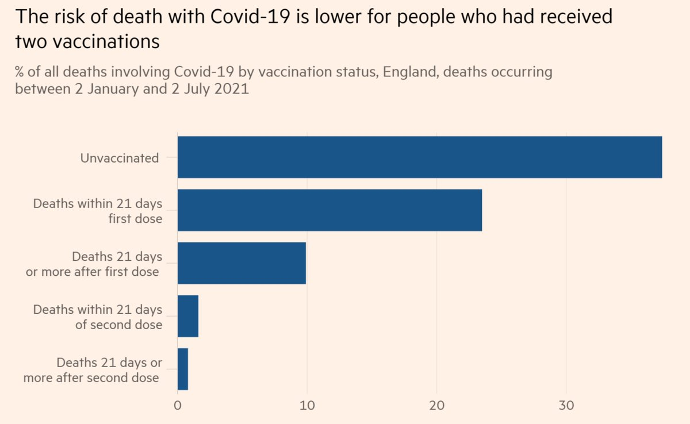</img></a>

---

<a href="https://twitter.com/erictopol/status/1437409399232811009" target="_blank" rel="noreferer">13:34 UCT</a>

With the data, there wouldn't be any guessing games about whether boosters are needed for the J&amp;J vaccine. We would know that already
https://www.nytimes.com/2021/09/13/briefing/johnson-and-johnson-boosters-explainer.html?searchResultPosition=2 by @DLeonhardt 

<a href="E_KzucSUcAM--uM.jpg"  >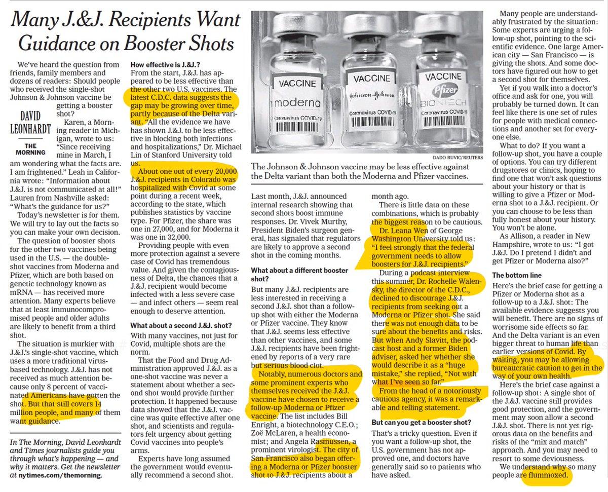</img></a>

---

<a href="https://twitter.com/erictopol/status/1437411771229212677" target="_blank" rel="noreferer">13:44 UCT</a>

Low tech surgery :-)
@NewYorker 

<a href="E_K2UxnVQAIjBqZ.jpg"  >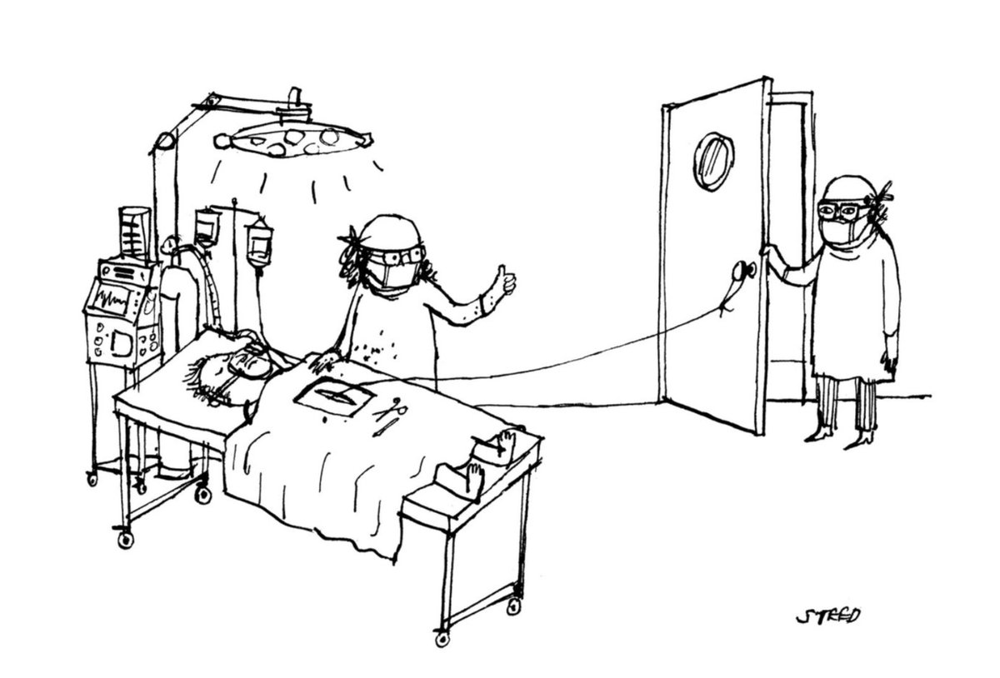</img></a>

---

<a href="https://twitter.com/erictopol/status/1437415563228180482" target="_blank" rel="noreferer">13:59 UCT</a>

A new @TheLancet viewpoint by an international panel on boosters: "To date, none of these studies has provided evidence of substantially declining protection against severe disease." https://els-jbs-prod-cdn.jbs.elsevierhealth.com/pb-assets/Lancet/pdfs/S0140673621020468-1631529799470.pdf But that'll change w/ this week's @NEJM Israel report, Pfizer💉, age &gt;60 

<a href="E_K41FjVcAQAVIG.jpg"  >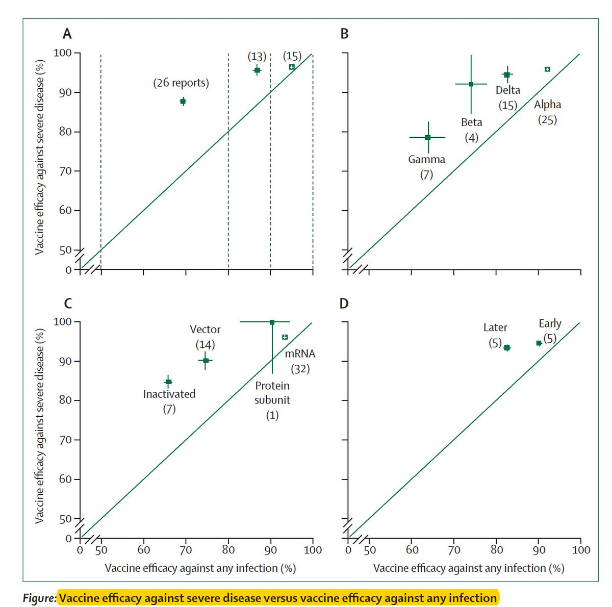</img></a>

---

<a href="https://twitter.com/erictopol/status/1437421520268103680" target="_blank" rel="noreferer">14:22 UCT</a>

Here's the @ONS report on deaths by vaccination status https://twitter.com/ons/status/1437332898110230535?s=12

---

<a href="https://twitter.com/erictopol/status/1437436770426114057" target="_blank" rel="noreferer">15:23 UCT</a>

A French nursing home outbreak involving 14 fully vaccinated residents with the Alpha (B.1.1.7) variant https://jamanetwork.com/journals/jamanetworkopen/fullarticle/2783985 @JAMANetworkOpen 

<a href="E_LLyvDVgAEoASt.jpg"  >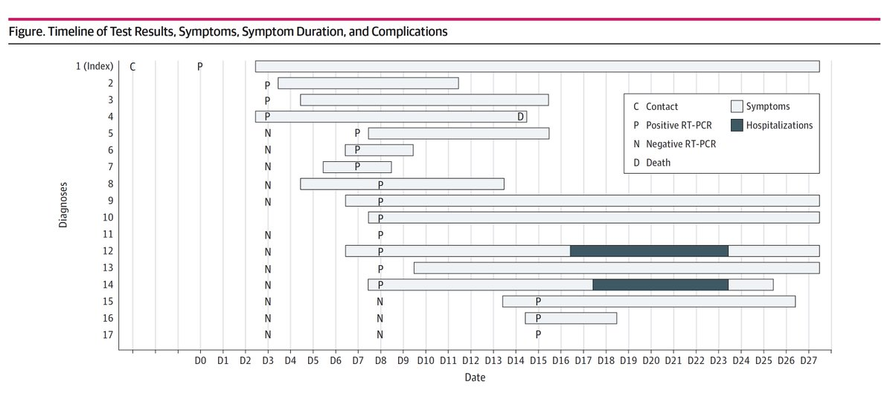</img></a>

---

<a href="https://twitter.com/erictopol/status/1437446640462270469" target="_blank" rel="noreferer">16:02 UCT</a>

And declined further yesterday 

<a href="E_LV7wOUUAATHxx.jpg"  >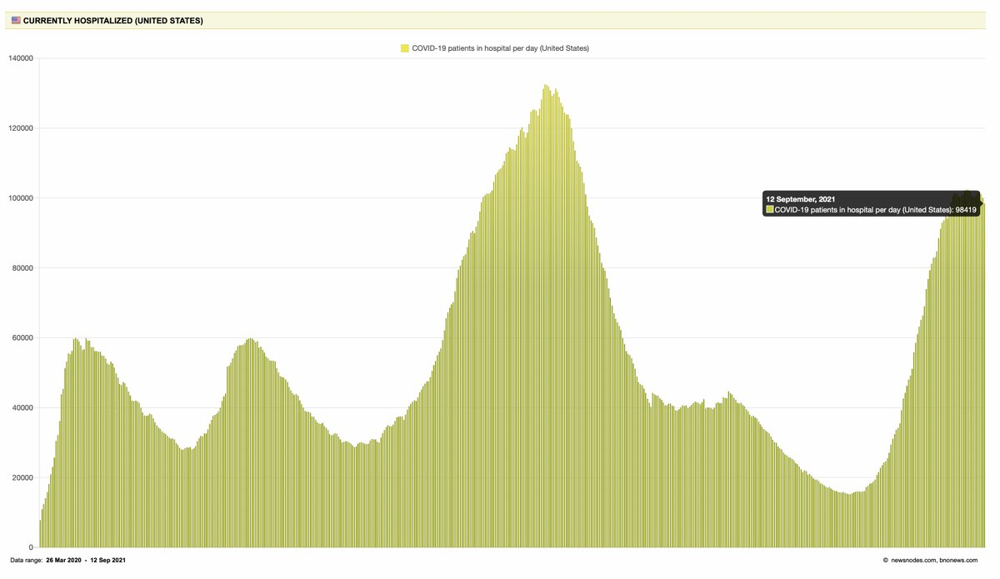</img></a>

---

<a href="https://twitter.com/erictopol/status/1437450182140960771" target="_blank" rel="noreferer">16:16 UCT</a>

This is where I disagree w/ the panel. Many studies on reduced efficacy have been published in the media &amp; preprints. Waiting for "robust data" that is adjudicated by the eminent authorities is not how it works. The public wants to know, has a right to know, and that builds trust 

<a href="E_LXZWFVgAY1tdl.jpg"  >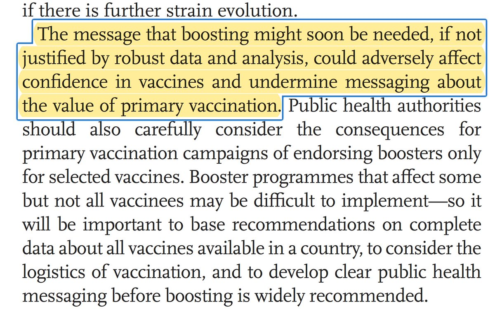</img></a>

---

<a href="https://twitter.com/erictopol/status/1437488641031368704" target="_blank" rel="noreferer">18:49 UCT</a>

The 3 @CDCMMWR reports were concordant for reduced vaccine effectiveness vs hospitalizations for people over age 65, by 10-15 per cent points, during the US Delta wave.  Another issue unaddressed by the Lancet viewpoint.
https://twitter.com/EricTopol/status/1436413269581828098

---

<a href="https://twitter.com/erictopol/status/1437497132378853378" target="_blank" rel="noreferer">19:23 UCT</a>

Analysis of over 2 million #SARSCoV2 genomes to determine which mutations drive contagiousness 
"Highlighting the key role of non-S (spike protein) mutations, particularly in N, ORF1b, and ORF1a, in promoting increased growth rate." https://www.medrxiv.org/content/10.1101/2021.09.07.21263228v1 

<a href="E_MDvddVQAADJ7E.jpg"  >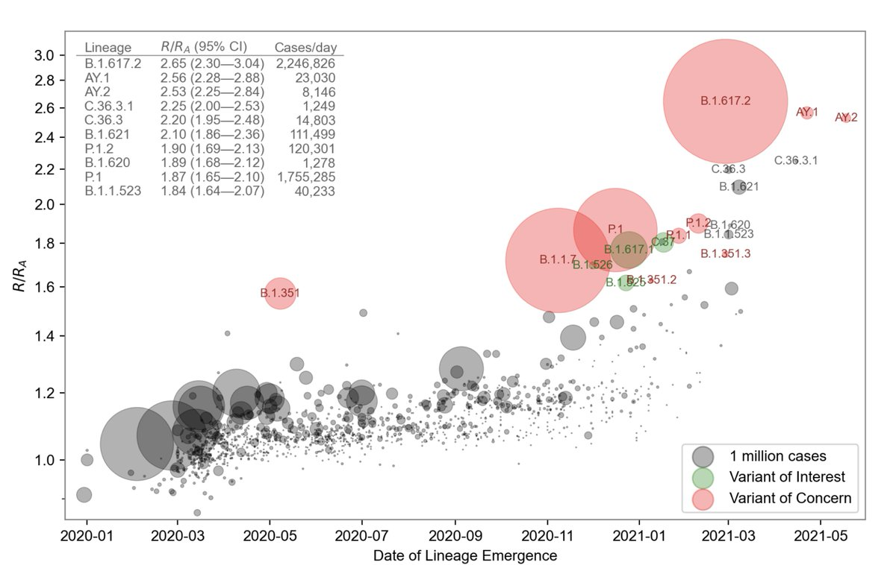</img></a>

---

<a href="https://twitter.com/erictopol/status/1437507722526674945" target="_blank" rel="noreferer">20:05 UCT</a>

@NateSilver538 Just to add, Nate, that their statement represents, in my view, blatant paternalism. Lack of respect for people to handle the truth, i.e.2 messages at once (1-vaccines are very effective and 2-that vaccine effectiveness may have limits in durability or for specific subgroups)

---

<a href="https://twitter.com/erictopol/status/1437512408726061062" target="_blank" rel="noreferer">20:24 UCT</a>

RT @MCSlab_uiuc: A 3rd shot may be needed for the older population since it is not expected that we will expand vaccine coverage to levels…

---

<a href="https://twitter.com/erictopol/status/1437516688916840449" target="_blank" rel="noreferer">20:41 UCT</a>

Today down to &lt;96,000 
A 3-day streak of fewer hospitalizations; need to keep it going👍  https://twitter.com/EricTopol/status/1436840979462459395

<a href="E_MUXpRVgAEwACW.jpg"  >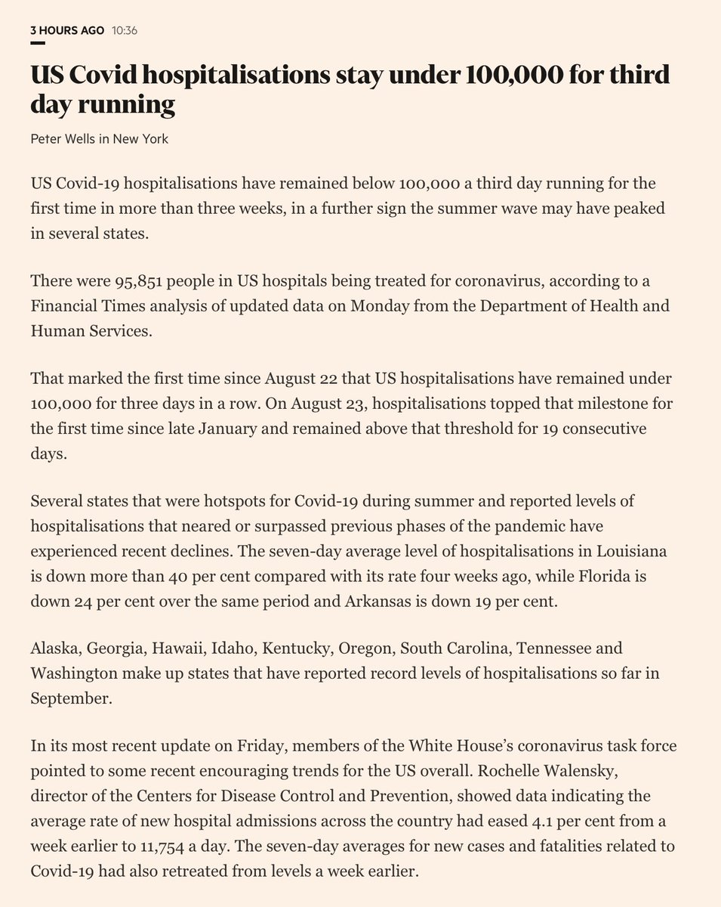</img></a>

---

<a href="https://twitter.com/erictopol/status/1437529317014048768" target="_blank" rel="noreferer">21:31 UCT</a>

What proportion of Americans have some Covid-19 immunity (natural infection or vaccine-induced) as of July 15, 2021? 
62%, with marked variability by age groups
https://www.acpjournals.org/doi/pdf/10.7326/M21-2721
@AnnalsofIM by @Alison_Galvani @YaleSPH and colleagues 

<a href="E_Meu5bUYAEx7dU.jpg"  >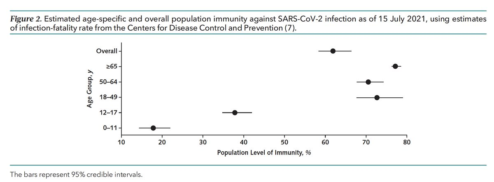</img></a><a href="E_MewSCVkAEEwLy.jpg"  >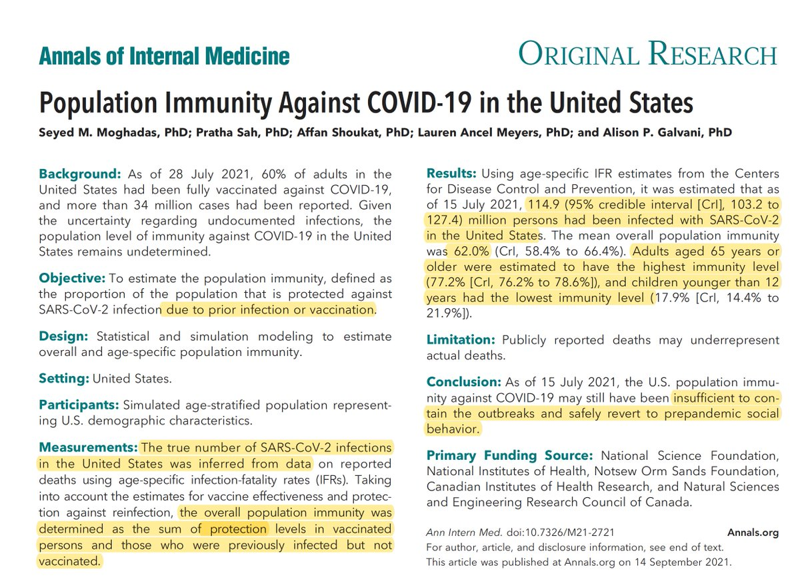</img></a>

---

<a href="https://twitter.com/erictopol/status/1437540952072081411" target="_blank" rel="noreferer">22:17 UCT</a>

Israel has the *only* data for whether a 3rd shot can restore vaccine effectiveness (VE). This is how today's @TheLancet viewpoint disses that data and negates 3 CDC reports last week that VE vs hospitalizations falls for age &gt; 65 🧵https://twitter.com/EricTopol/status/1437415563228180482 

<a href="E_MrWGqVIAY2269.jpg"  >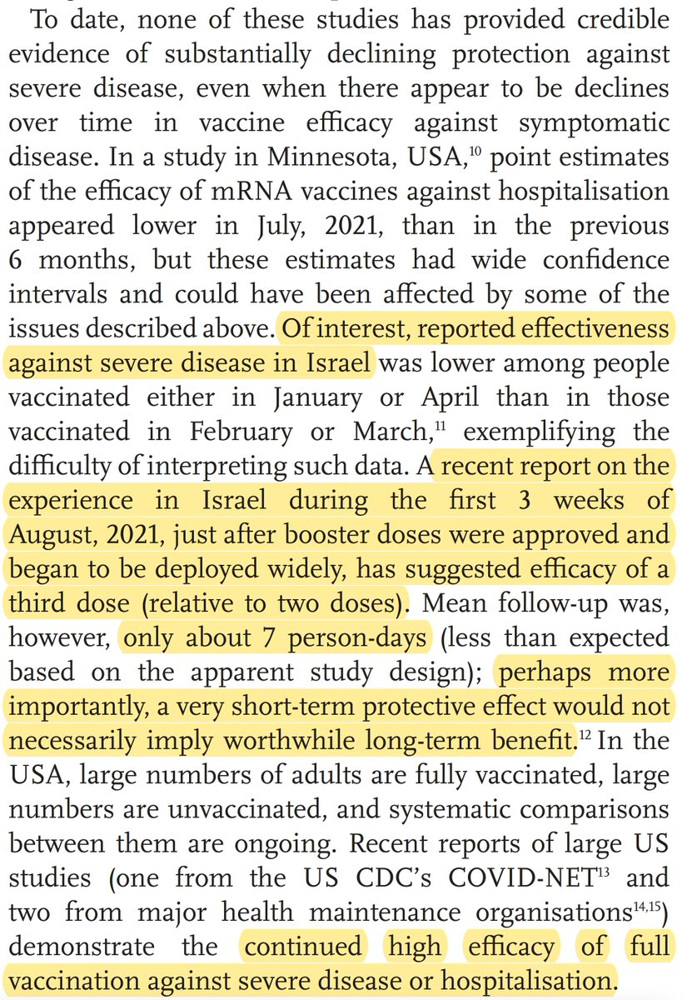</img></a>

---

<a href="https://twitter.com/erictopol/status/1437551394412654596" target="_blank" rel="noreferer">22:58 UCT</a>

Pathetic infighting inside the @US_FDA and @WhiteHouse Administration about boosters is the last thing we need right now
https://www.ft.com/content/af8da7d4-43ea-41d6-90ee-f959b3675cc5 @kiranstacey 
Note FDA disclaimer
The 2 FDA scientists who quit and authored @TheLancet piece should not be part of the review process 

<a href="E_M0mEBUUAc0DrC.jpg"  >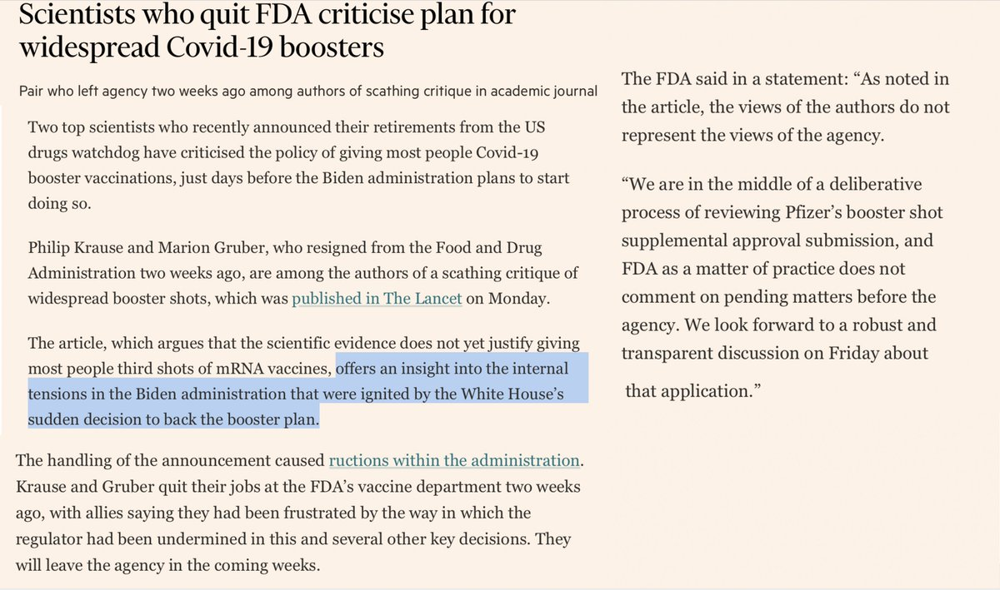</img></a>

---

<a href="https://twitter.com/erictopol/status/1437554358682468352" target="_blank" rel="noreferer">23:10 UCT</a>

@silenced112 @discoball2000 Read. Of adult population, not total population.

