+++
title = "Tweets by Eric Topol Sept 14"
Summary = ""
tags = ["Twitter"]
category = "Twitter"
+++

---

<a href="https://twitter.com/erictopol/status/1437596363307438082" target="_blank" rel="noreferer">01:57 UCT</a>

And that Israel's data shows that VE vs severe illness is restored by a 3rd shot for those age ≥ 60.
The duration of the restored VE can be debated, but likely several months, at minimum. /2

---

<a href="https://twitter.com/erictopol/status/1437596362153988096" target="_blank" rel="noreferer">01:57 UCT</a>

Let me be clear about the evidence on 3rd shots. It is unequivocal for Pfizer's vaccine, given w/ 3 week spacing. In people over age 60, there is significant reduction of effectiveness (VE) vs hospitalizations and symptomatic infections at 5+ months after primary vaccination. /1

---

<a href="https://twitter.com/erictopol/status/1437596367602343939" target="_blank" rel="noreferer">01:57 UCT</a>

It's not the "general population" but there are over 70 million Americans age ≥ 60. They should not be sitting vulnerable while infighting takes place /3
https://www.nytimes.com/2021/09/13/health/fda-coronavirus-booster-shots.html 

<a href="E_NdhnMVQAMSQwn.jpg"  >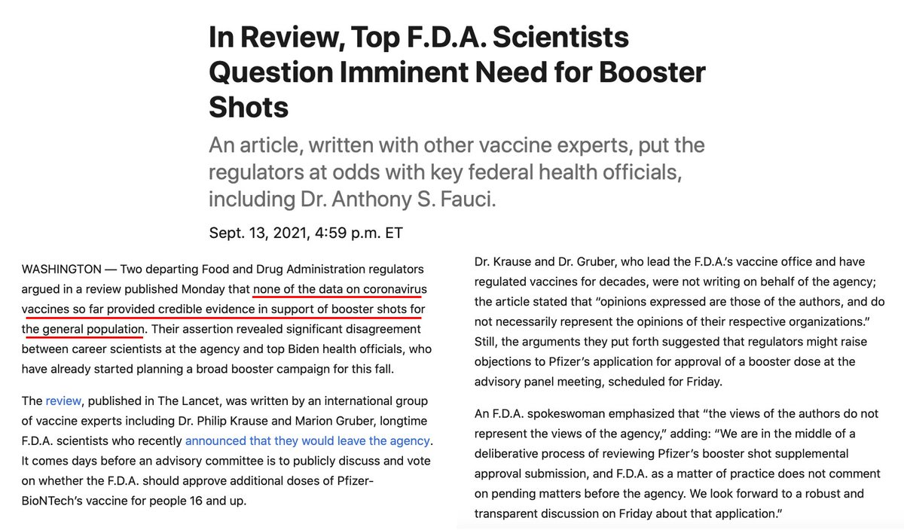</img></a>

---

<a href="https://twitter.com/erictopol/status/1437596369959616520" target="_blank" rel="noreferer">01:57 UCT</a>

The need for 3rd shots for age &lt;60 or for Moderna's vaccine are unresolved at this time.
Not addressed:
Frontline health care workers, who are short-staffed, and at increased risk for infection/transmission, should all be considered for 3rd shots /4

---

<a href="https://twitter.com/erictopol/status/1437600868283531267" target="_blank" rel="noreferer">02:15 UCT</a>

@CharlesMBrenner No data on that that I’ve seen

---

<a href="https://twitter.com/erictopol/status/1437608790656835592" target="_blank" rel="noreferer">02:46 UCT</a>

@jjaimemiranda The last paragraph of @TheLancet's essay argues against boosters in favor of primary vaccinations. I am not questioning that point, Jaime. I am simply providing the specific, clearcut evidence for 3rd shots that was not properly presented by the authors. 

<a href="E_NheM6VcAACqwG.jpg"  ></img></a>

---

<a href="https://twitter.com/erictopol/status/1437609292668944384" target="_blank" rel="noreferer">02:48 UCT</a>

@GreeterDan @coleywolly @Nucleics_Inc here it is
https://twitter.com/EricTopol/status/1437409399232811009

---

<a href="https://twitter.com/erictopol/status/1437617018782449668" target="_blank" rel="noreferer">03:19 UCT</a>

This is not about global equity, which the Lancet essay was clearly advancing.  It's not either or. There are 76 million vaccine doses distributed in the US, not given,  that are not going to be sent OUS.  https://covid.cdc.gov/covid-data-tracker/#vaccinations_vacc-total-admin-rate-total
and well over 15 million have already been wasted 

<a href="E_NwNYPVkAQzmY6.jpg"  >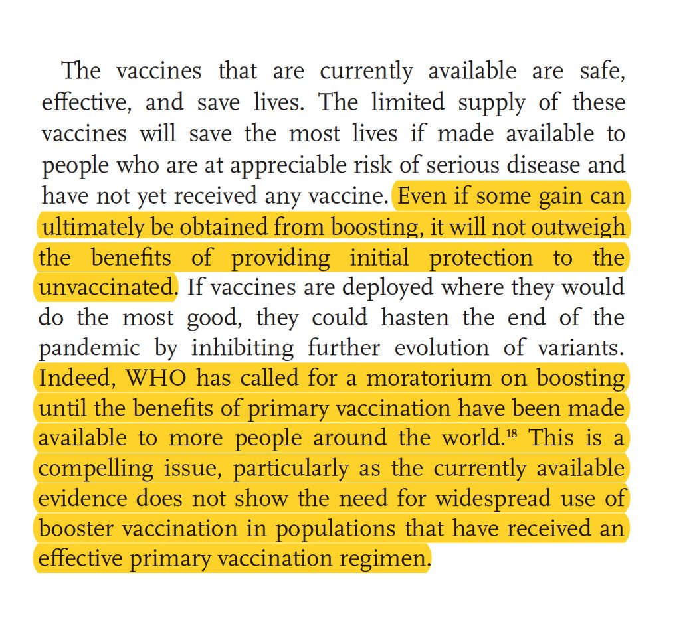</img></a>

---

<a href="https://twitter.com/erictopol/status/1437755731864784897" target="_blank" rel="noreferer">12:30 UCT</a>

New and notable
The UK's JCVI has reviewed all the data on this matter and is going forward with 3rd shots for all age 50+ starting in the next few days 

<a href="E_PvBw9VQAIypv3.jpg"  >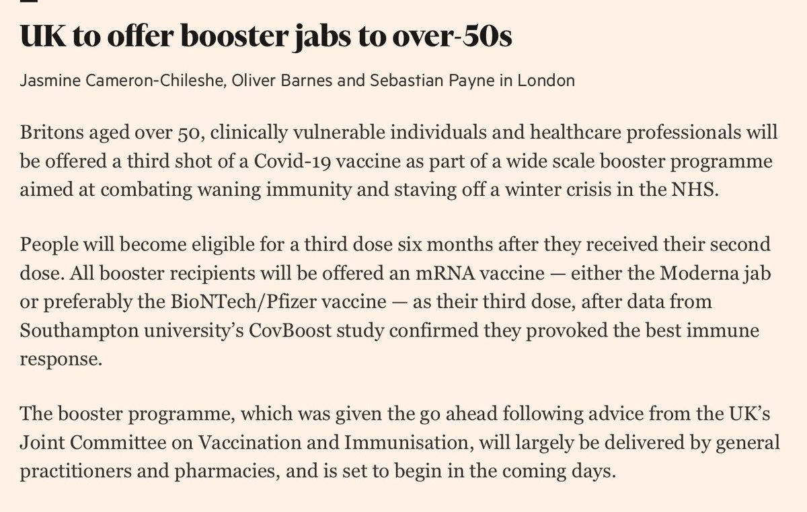</img></a>

---

<a href="https://twitter.com/erictopol/status/1437756346607177735" target="_blank" rel="noreferer">12:33 UCT</a>

@celinegounder Thanks Celine. But please don't refer to age 60+ as "elderly" 😉

---

<a href="https://twitter.com/erictopol/status/1437769203558203397" target="_blank" rel="noreferer">13:24 UCT</a>

Deaths in the US 4th wave far exceeded expectations and the rates of peer countries with high vaccination rates. Quantifying the preventable lost lives and where
https://www.nytimes.com/interactive/2021/09/14/opinion/states-undervaccination-deaths.html @nytopinion @nytgraphics @2plus2make5 @jalinegerardin @Nat_Lash 

<a href="E_P6pllVEAkTedT.jpg"  >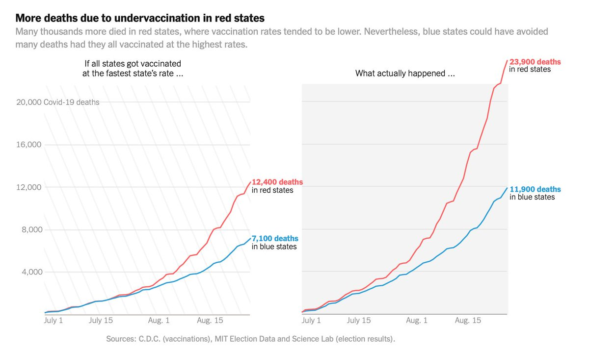</img></a>

---

<a href="https://twitter.com/erictopol/status/1437777227551236102" target="_blank" rel="noreferer">13:56 UCT</a>

RT @ashishkjha: I agree with this thread by @EricTopol
 
Some are arguing that there is no evidence for a 3rd short

This is not correct. T…

---

<a href="https://twitter.com/erictopol/status/1437787150918037505" target="_blank" rel="noreferer">14:35 UCT</a>

Just published @ScienceMagazine 
The durable impact of low dose @moderna_tx vaccine on memory T cells, how it compares w/ natural immunity, &amp; biologic relevance of cross-reactive T cells
https://www.science.org/doi/10.1126/science.abj9853
by @jmateust @profshanecrotty @Dani6020 and colleagues @ljiresearch 

<a href="E_QJrf8WUAYCpNL.jpg"  >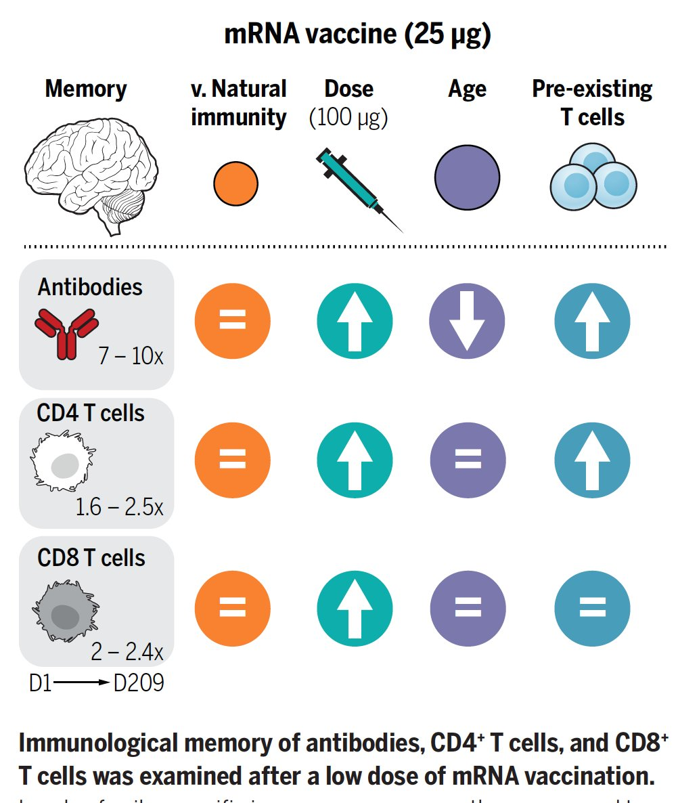</img></a>

---

<a href="https://twitter.com/erictopol/status/1437806968492605440" target="_blank" rel="noreferer">15:54 UCT</a>

New @SciImmunology 
Discovery of CD8+ T cells in the tonsils lymphoid tissue with #SARSCoV2 specificity
https://www.science.org/doi/10.1126/sciimmunol.abk0894  Not yet known if they might provide some protection from Covid-19 in people who have never been exposed 

<a href="E_QdxwlVUAAOckG.jpg"  >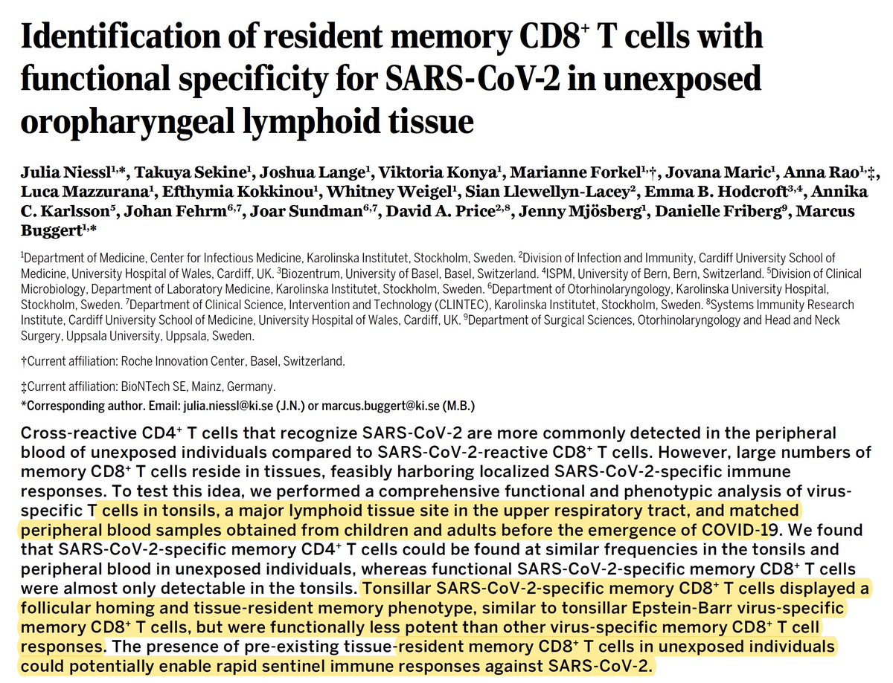</img></a>

---

<a href="https://twitter.com/erictopol/status/1437812087032406021" target="_blank" rel="noreferer">16:14 UCT</a>

3 days, 3 different booster takes
—Yesterday 2 FDA scientists who resigned + @WHO wrote @TheLancet that boosters should not be used 
—Today UK announced boosters for all age &gt;50
—Tomorrow Israel publishes data to show benefit of boosters (+ safety) in &gt; 1 million people age &gt; 60

---

<a href="https://twitter.com/erictopol/status/1437817165894148097" target="_blank" rel="noreferer">16:35 UCT</a>

RT @profshanecrotty: Thanks! Longer explanation here: https://twitter.com/profshanecrotty/status/1437795168195948547?s=21

---

<a href="https://twitter.com/erictopol/status/1437822491477430274" target="_blank" rel="noreferer">16:56 UCT</a>

What the Delta wave did in New York City, a familiar pattern
https://www1.nyc.gov/site/doh/covid/covid-19-data.page#daily
Beginning in July cases went up for both unvaccinated and vaccinated, but MUCH more in the former
And hospitalizations among vaxxed well protected 
via @davechokshi @NYCHealthCommr 

<a href="E_Qr2yvVIAg52pC.jpg"  >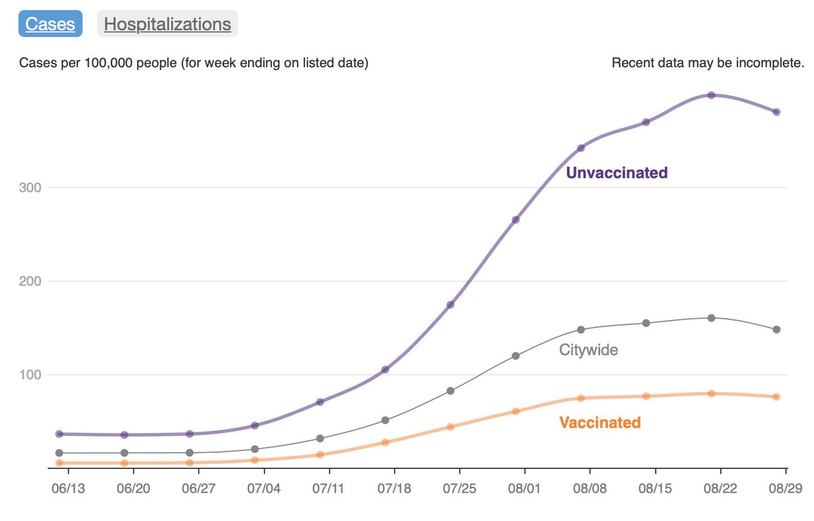</img></a><a href="E_Qrx8GUUAcG6Ke.jpg"  >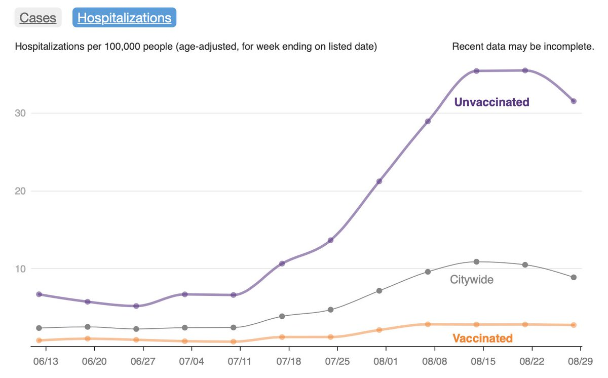</img></a>

---

<a href="https://twitter.com/erictopol/status/1437839208660418561" target="_blank" rel="noreferer">18:02 UCT</a>

Congratulations to my friend @kaifulee on the birthday of his new book #AI2041 
“In the story of #AI and humans, if we get the dance between artificial intelligence and human society right, it would unquestionably be the single greatest achievement in human history.” 

<a href="E_Q68PwUcAEtFSK.jpg"  ></img></a>

---

<a href="https://twitter.com/erictopol/status/1437842554897121282" target="_blank" rel="noreferer">18:15 UCT</a>

If you want to know about #SARSCoV2, vaccines, and where we are headed, you talk to @florian_krammer. So we did
https://www.medscape.com/viewarticle/958292 w/ @cuttingforstone @Medscape podcast
A sample of his acumen from the transcript 

<a href="E_Q98dFVIAAwlhX.png"  >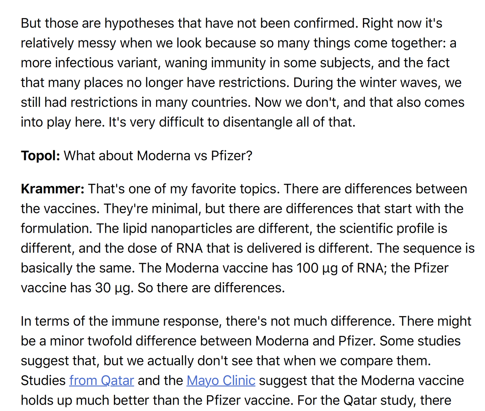</img></a>

---

<a href="https://twitter.com/erictopol/status/1437847908930363394" target="_blank" rel="noreferer">18:37 UCT</a>

RT @segal_eran: New severely ill Covid-19 patients in Israel in the past week, per 100,000 people:

Vaccinated with 3 doses: 0.28
Vaccinate…

---

<a href="https://twitter.com/erictopol/status/1437851640053133317" target="_blank" rel="noreferer">18:51 UCT</a>

RT @JoyHenningsenMD: 📣This timely discussion btwn ⁦@EricTopol⁩ &amp; ⁦@florian_krammer⁩ is a MUST-read 💯 and covers:

▪️the #DeltaVariant traje…

---

<a href="https://twitter.com/erictopol/status/1437861061449842689" target="_blank" rel="noreferer">19:29 UCT</a>

Does abdominal #obesity reduce the immune response to @BioNTech_Group /@Pfizer's  vaccine?
https://www.medrxiv.org/content/10.1101/2021.09.10.21262710v1 Looks that way for people without prior Covid. As assessed by waist circumference ✓ (far better than BMI) serially, including after 3 months 

<a href="E_ROZ9WVkAAkLhl.jpg"  >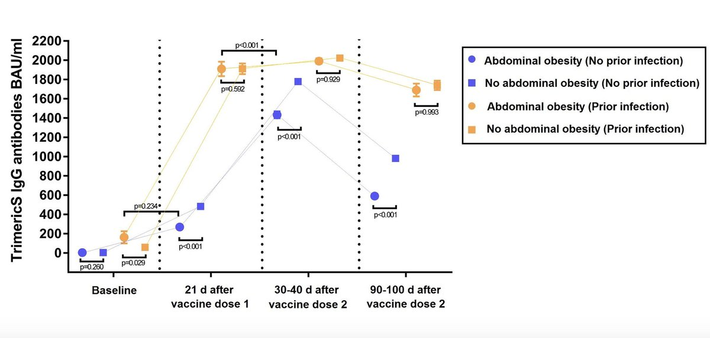</img></a>

---

<a href="https://twitter.com/erictopol/status/1437883016458604546" target="_blank" rel="noreferer">20:56 UCT</a>

With the dose of Pfizer 30 ug vs Moderna 100 ug mRNA, this factor could play out to be important w/r to propensity for immunity waning

---

<a href="https://twitter.com/erictopol/status/1437890711139995648" target="_blank" rel="noreferer">21:27 UCT</a>

New data on waning immunity justifying 3rd shot (boosters) from @PHE_uk today, reviewed and graphics @FT
https://www.ft.com/content/cf83b3a1-fe06-4c9f-999c-7500090aee7c
1. Astra Zeneca (red)  and Pfizer (blue) 💉waning of protection vs hospitalization, pronounced in age 65+
@clivecookson @mroliverbarnes @jburnmurdoch 

<a href="E_RojnVVgAAbywK.jpg"  >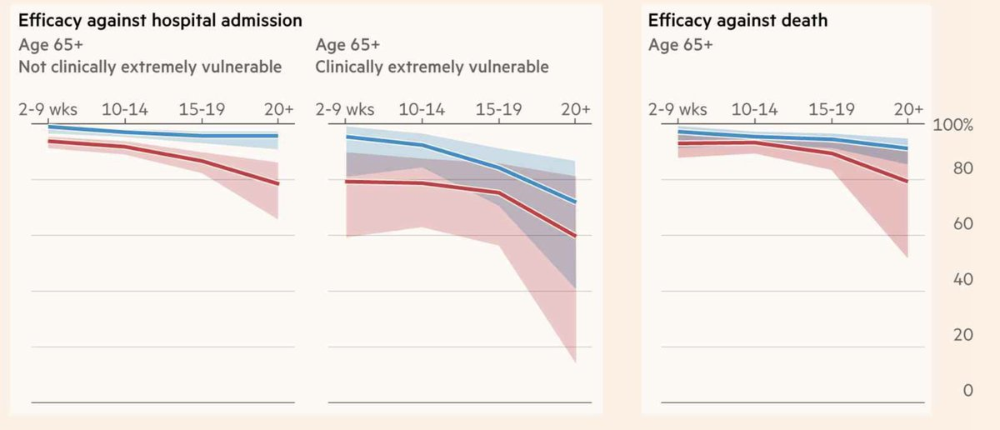</img></a>

---

<a href="https://twitter.com/erictopol/status/1437890715715993600" target="_blank" rel="noreferer">21:27 UCT</a>

2. Effectiveness (VE) vs symptomatic infection over time and, in age 80+, difference dose in spacing (&lt;4 weeks vs 8+ weeks) 
Note for AZ drop in VE is to &lt; 50% at &gt;5 months 

<a href="E_Ro5M0UYAEyMc2.jpg"  >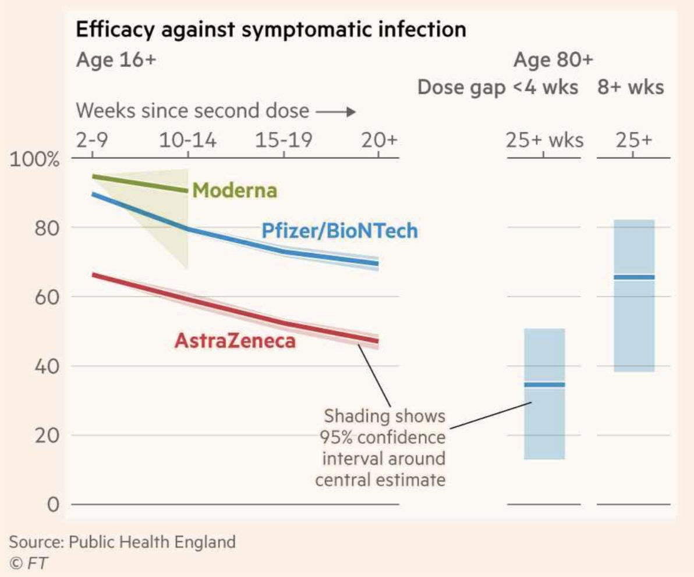</img></a>

---

<a href="https://twitter.com/erictopol/status/1437896925961867265" target="_blank" rel="noreferer">21:51 UCT</a>

Key summary graphic
Israeli data for &gt;1 million people, age ≥60 for unvaccinated, vaccinated 2-doses, and + booster: cases, severe disease, and deaths 
from https://www.ft.com/content/cf83b3a1-fe06-4c9f-999c-7500090aee7c 

<a href="E_RvYB5UcAEMhb2.jpg"  >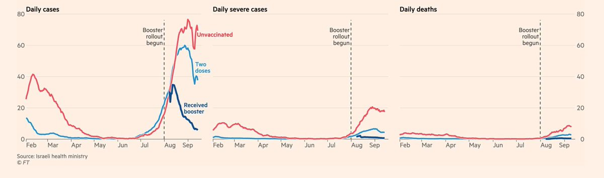</img></a>

---

<a href="https://twitter.com/erictopol/status/1437898822026366978" target="_blank" rel="noreferer">21:59 UCT</a>

These updated data represent a marked contrast with earlier @PHE_uk reports of 88% VE Pfizer 2-dose and 67% AZ 2-dose in @NEJM July 21 (vs Delta) 

<a href="E_RxQl2UUAM7sU-.jpg"  >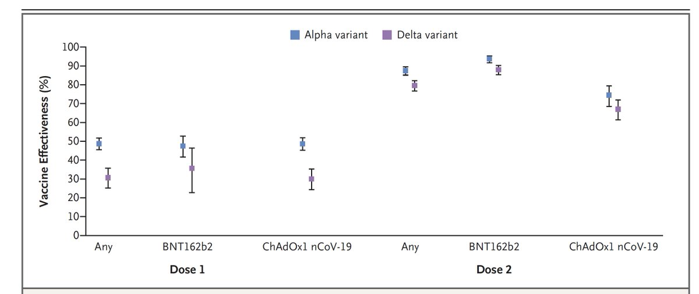</img></a>

---

<a href="https://twitter.com/erictopol/status/1437912294629855232" target="_blank" rel="noreferer">22:53 UCT</a>

More, new reassuring data about mRNA vaccine (@BioNTech_Group) neutralization vs Delta plus, Lambda, and other variants of interest 👍https://www.biorxiv.org/content/10.1101/2021.09.13.460163v1 

<a href="E_R9ZPtVkAAUyCS.jpg"  >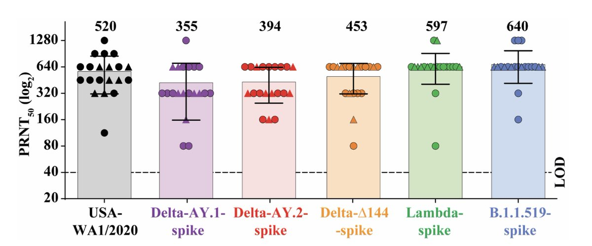</img></a><a href="E_R9bh7VEAEJKhf.jpg"  >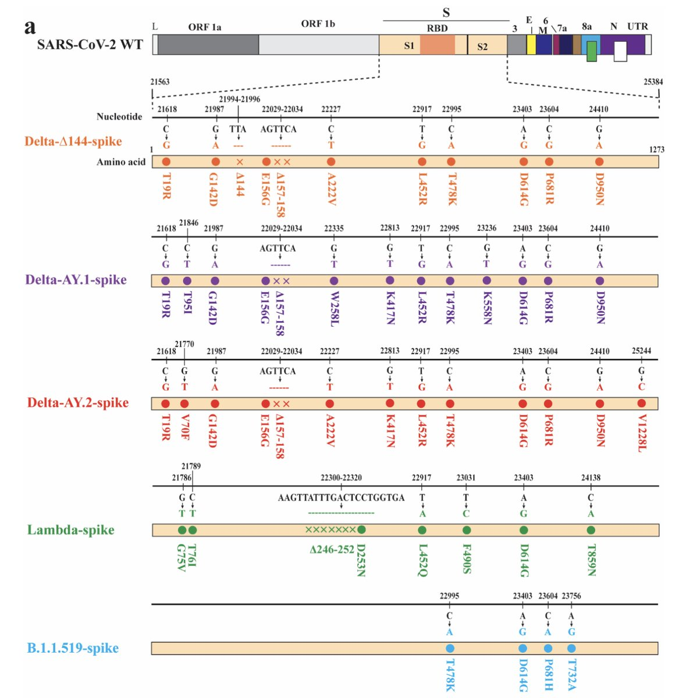</img></a>

---

<a href="https://twitter.com/erictopol/status/1437918171512459268" target="_blank" rel="noreferer">23:16 UCT</a>

What an outstanding ★ feature on the long history of mRNA vaccines and their future potential, by @ElieDolgin @Nature https://www.nature.com/articles/d41586-021-02483-w 

<a href="E_SCxvzUcAI0mok.jpg"  >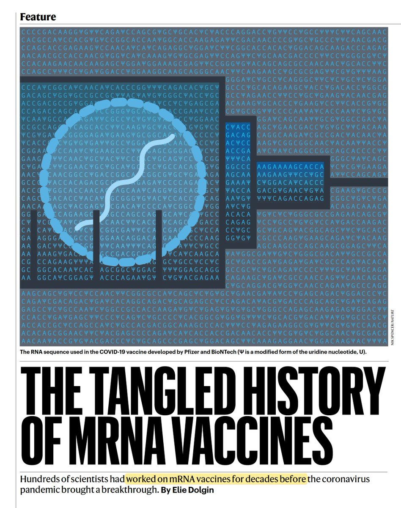</img></a><a href="E_SCzLEVkAAeO4b.jpg"  >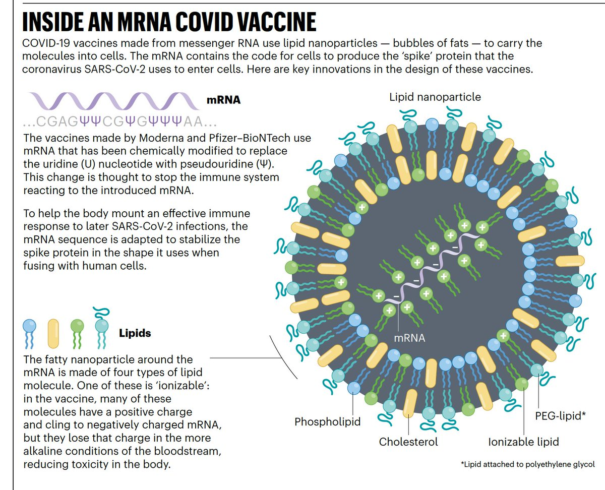</img></a><a href="E_SC0kQVQAIZzR9.jpg"  >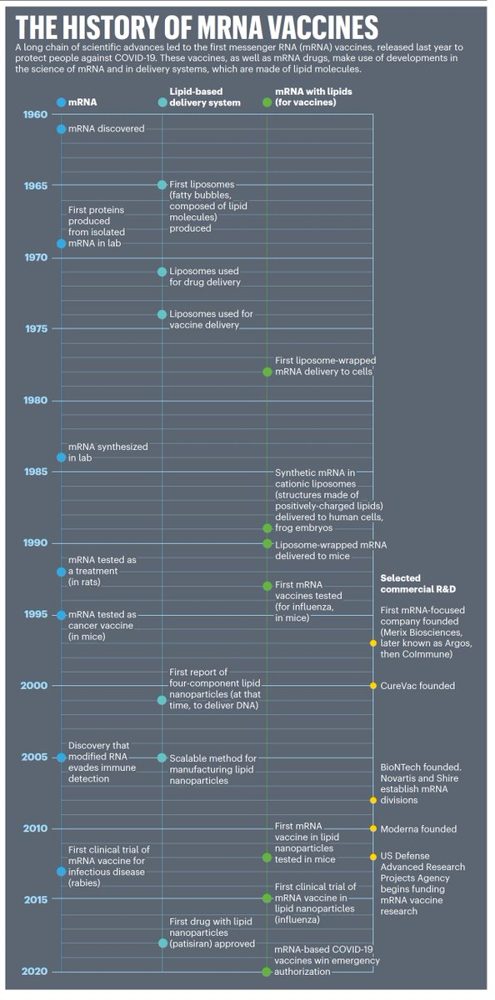</img></a>