+++
title = "Tweets by Eric Topol Sept 15"
Summary = ""
tags = ["Twitter"]
category = "Twitter"
+++

---

<a href="https://twitter.com/erictopol/status/1437942350727184385" target="_blank" rel="noreferer">00:52 UCT</a>

A randomized trial of daily antigen testing in &gt; 200 secondary schools in England
https://www.thelancet.com/journals/lancet/article/PIIS0140-6736(21)01908-5/fulltext
https://www.thelancet.com/journals/lancet/article/PIIS0140-6736(21)02092-4/fulltext 
The tests had 99.93% specificity. The findings "point the way to policies that support continued in-person learning for contacts of positive cases" 

<a href="E_SXnHGVgAEv8em.jpg"  >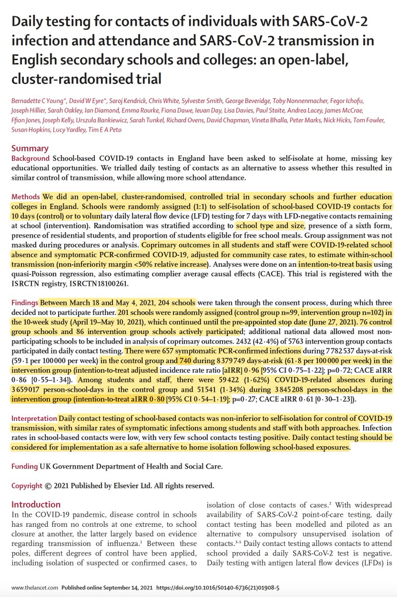</img></a><a href="E_SYS_EVUAEMznr.jpg"  >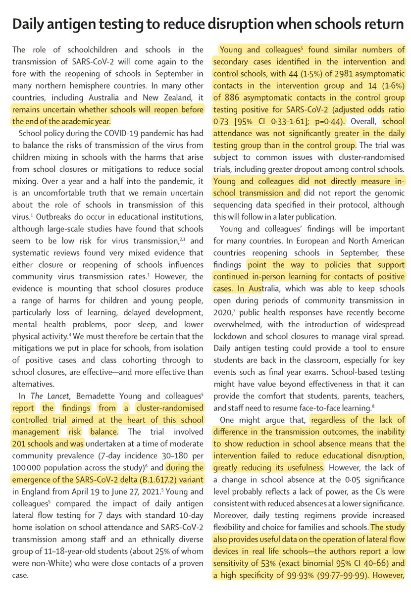</img></a>

---

<a href="https://twitter.com/erictopol/status/1437943780091432960" target="_blank" rel="noreferer">00:58 UCT</a>

"Everyone just incrementally added something—including me"—@kkariko 
Over 3 decades of perseverance to get mRNA in a position to be a platform for the pandemic vaccines,
She's a hero of mine, and a Nobel laureate in the future. 

<a href="E_SZ1TIUUAQAfEb.jpg"  >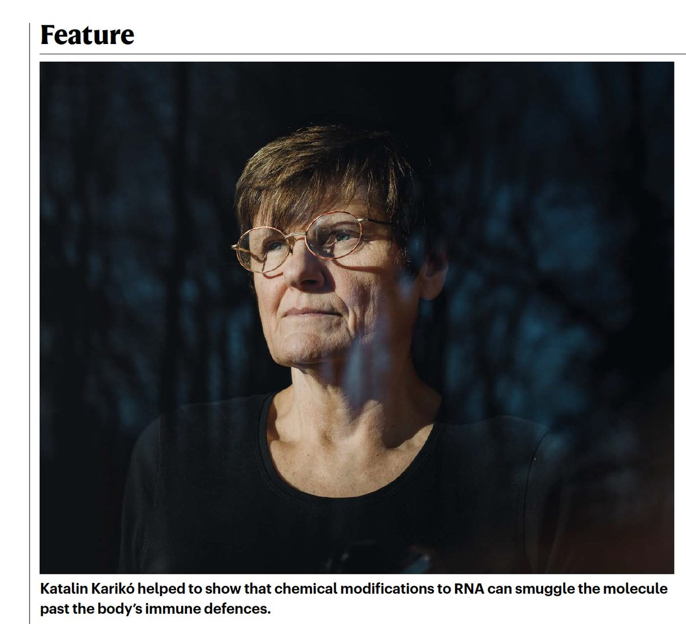</img></a>

---

<a href="https://twitter.com/erictopol/status/1437967349517225988" target="_blank" rel="noreferer">02:31 UCT</a>

Preview of tomorrow
https://twitter.com/EricTopol/status/1437896925961867265

---

<a href="https://twitter.com/erictopol/status/1438118553979289604" target="_blank" rel="noreferer">12:32 UCT</a>

If there was any question for how challenging it is to contain Delta, Singapore is near 80% of its total population vaccinated, one of the highest in the world.
Started its booster program yesterday for age ≥ 60
https://www.ft.com/content/160080b5-dc6b-47b0-b073-8aca600bc521
@OurWorldInData 

<a href="E_U36LWUcAIVVkp.jpg"  >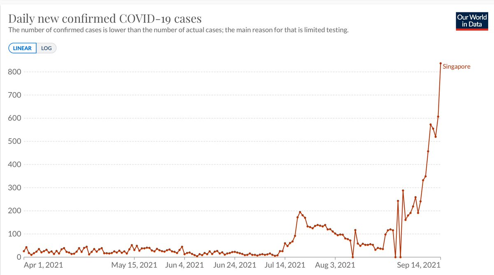</img></a>

---

<a href="https://twitter.com/erictopol/status/1438121194000039936" target="_blank" rel="noreferer">12:43 UCT</a>

History will remember what happened in Florida in the US 4th wave with copious vaccines and knowledge of how to prevent covid fatalities 

<a href="E_U6mtjUYAIhc1h.jpg"  >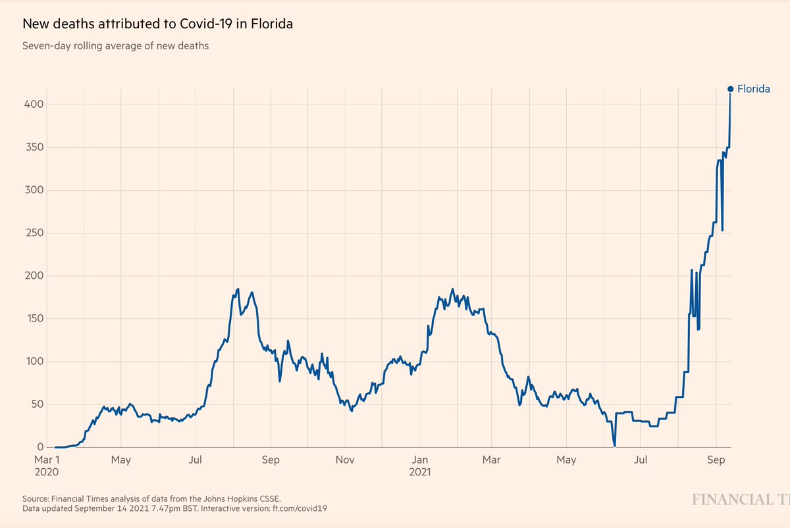</img></a>

---

<a href="https://twitter.com/erictopol/status/1438127109977690113" target="_blank" rel="noreferer">13:06 UCT</a>

@amandamull If you go into the preprint and review the citations, you will find the limited data is based on BMI, a poor surrogate metric for abdominal obesity. As far as I know,  this is the 1st study that correlated waist circumference with the immune response to vaccination over time.

---

<a href="https://twitter.com/erictopol/status/1438131867706814467" target="_blank" rel="noreferer">13:25 UCT</a>

The new @PHE_uk data on attrition of protection for both AZ and Pfizer vaccines vs symptomatic infection at 5+ months, across all age groups https://khub.net/documents/135939561/338928724/Vaccine+effectiveness+and+duration+of+protection+of+covid+vaccines+against+mild+and+severe+COVID-19+in+the+UK.pdf/10dcd99c-0441-0403-dfd8-11ba2c6f5801 no follow-up data for Spikevax (Moderna) 

<a href="E_VFKIxVkAIW_YQ.jpg"  >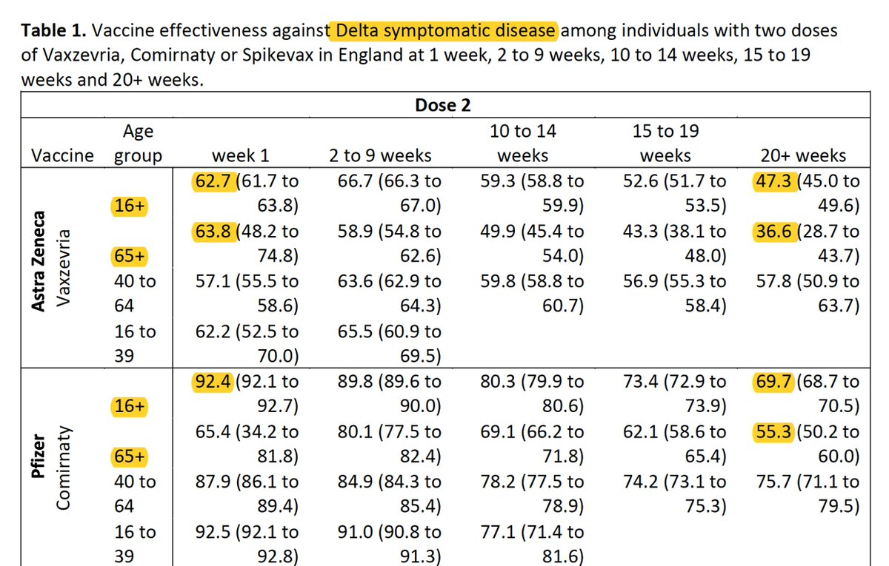</img></a>

---

<a href="https://twitter.com/erictopol/status/1438137410236215299" target="_blank" rel="noreferer">13:47 UCT</a>

Numb? Don't be. Most (as in ~90% now) of this is preventable.
—Over 2,200 deaths yesterday
—7-day average over 1,900 our day
—Days away from confirmed deaths exceeding 1918 pandemic estimate of 675,000 American lost lives 

<a href="E_VJBgdVgAMpE37.jpg"  >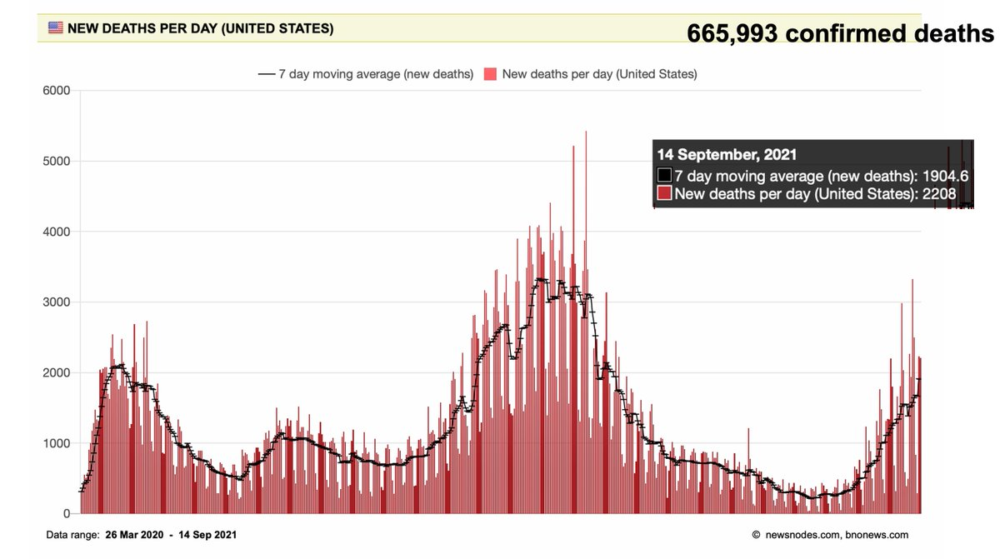</img></a>

---

<a href="https://twitter.com/erictopol/status/1438157563179110403" target="_blank" rel="noreferer">15:07 UCT</a>

RT @UGruntmanis: This was the best by @florian_krammer  “Mask not what your country can do for you. Mask what you can do for your country!"…

---

<a href="https://twitter.com/erictopol/status/1438174690615300104" target="_blank" rel="noreferer">16:15 UCT</a>

This new @TheLancetInfDis review on #SARSCoV2 transmission makes the strong case for mucosal immunity, which could be achieved via nasal or oral vaccines, that are unfortunately not getting priority for development https://www.thelancet.com/journals/laninf/article/PIIS1473-3099(21)00472-2/fulltext @dariusdariusdar 

<a href="E_VraOEVgAMUgnN.jpg"  >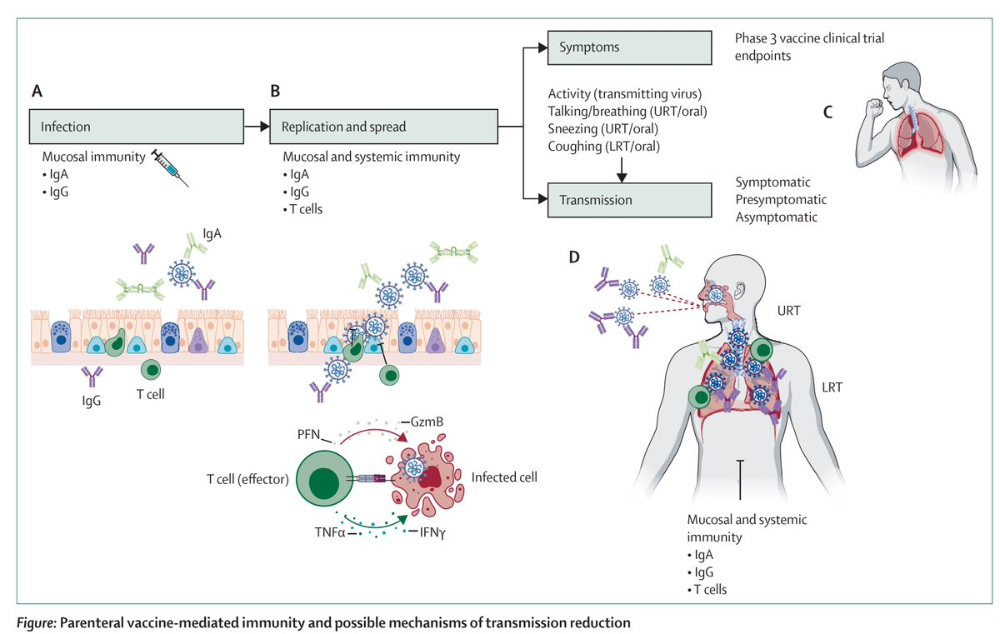</img></a>

---

<a href="https://twitter.com/erictopol/status/1438180099187097600" target="_blank" rel="noreferer">16:37 UCT</a>

The @Pfizer @US_FDA booster documents https://www.fda.gov/media/152161/download
reviews all data on effectiveness (VE) vs infection
—waning immunity not related to Delta, just a matter of time, 6% reduction of VE every 2 months
—restoration to 95% VE by 3rd shot
—recommends booster for all age 16+ 

<a href="E_VxDbjVcAEd8J3.jpg"  ></img></a>

---

<a href="https://twitter.com/erictopol/status/1438182203490377728" target="_blank" rel="noreferer">16:45 UCT</a>

The (Pfizer) bottom line, w/ antibody % safety data in this 53 page report.
Their case is not made sufficiently for all age groups, predominantly relying on infections, not protection from severe illness, which exists now for age ≥ 60
That may change with ongoing follow-up data. 

<a href="E_VyRAiVQAIgoB7.png"  >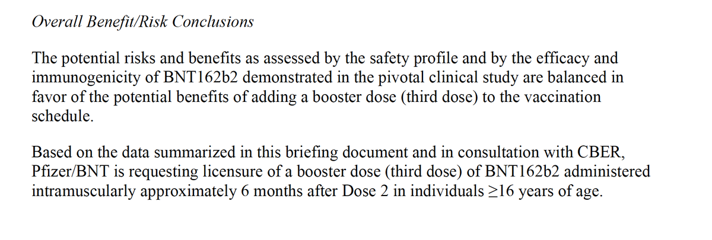</img></a>

---

<a href="https://twitter.com/erictopol/status/1438186064259076100" target="_blank" rel="noreferer">17:00 UCT</a>

The shameful saga of Ivermectin in the US with 88,000 prescriptions by doctors in a recent week, beyond the ingestion and toxicity of the horse version https://twitter.com/BBCRosAtkins/status/1437868102126026752

---

<a href="https://twitter.com/erictopol/status/1438188373626130434" target="_blank" rel="noreferer">17:10 UCT</a>

Little evidence of difference in booster effect by age or variant (WT/Wuhan vs Delta/DA)) difference for neutralization assays. Substantial increase on this log-scale NT50 plot across the board. 

<a href="E_V4VnLVUAEp6S7.jpg"  >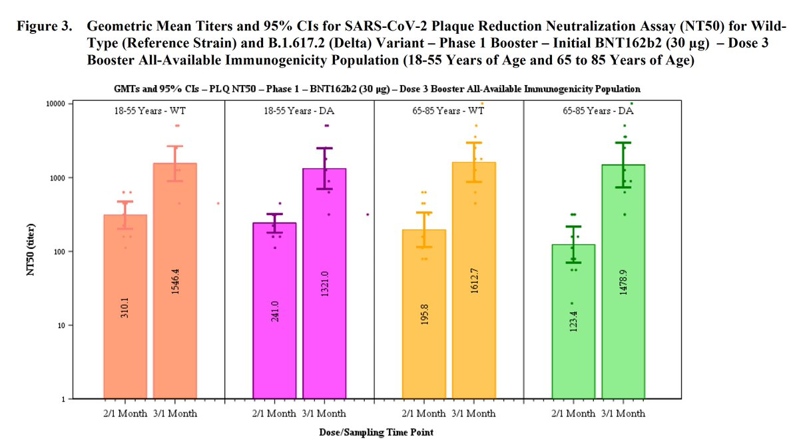</img></a>

---

<a href="https://twitter.com/erictopol/status/1438222396033363968" target="_blank" rel="noreferer">19:25 UCT</a>

There are a lot of questions about a Delta-specific vaccine. I asked @florian_krammer about that and a universal betacoronavirus vaccine and his answers provide important perspective (Hint: Delta vaccine not needed right now)
https://www.medscape.com/viewarticle/958292 

<a href="E_WXb4pVQAAou4A.jpg"  >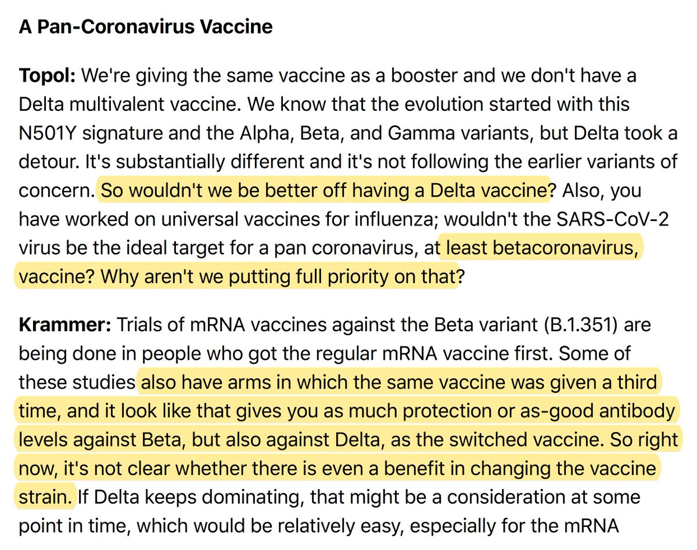</img></a><a href="E_WXi2LVgAQUfO6.png"  >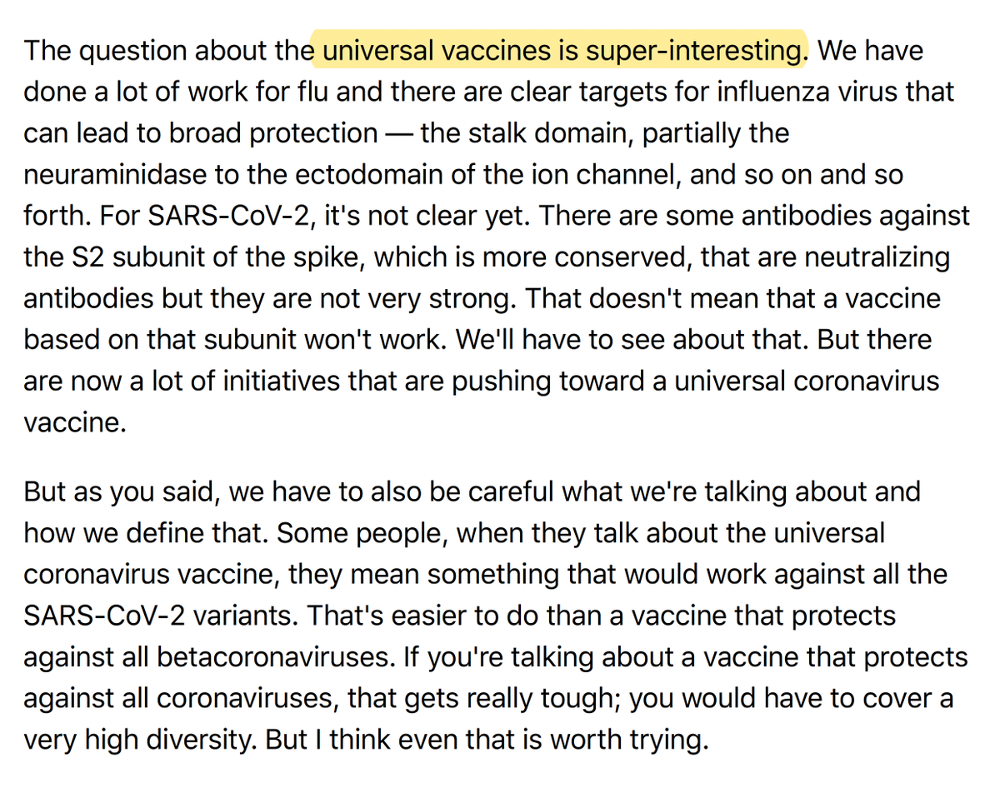</img></a>

---

<a href="https://twitter.com/erictopol/status/1438235428067307520" target="_blank" rel="noreferer">20:17 UCT</a>

As anticipated (2nd in thread), the FDA internal review disagreed with Pfizer's recommendations
https://www.wsj.com/articles/fda-says-covid-19-vaccines-remain-effective-without-boosters-11631726504?mod=hp_lead_pos2 by @JaredSHopkins @felschwartz which will make Friday's meeting and its outcome quite interesting 

<a href="E_WjZglVUAA1ESN.jpg"  >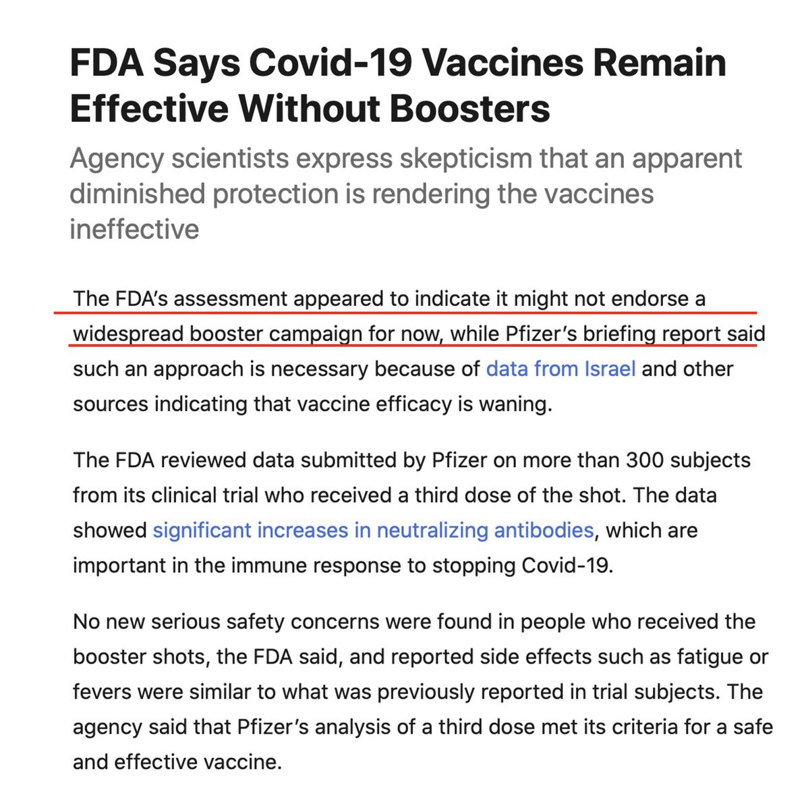</img></a>

---

<a href="https://twitter.com/erictopol/status/1438246525897883648" target="_blank" rel="noreferer">21:01 UCT</a>

3 new @NEJM papers today on @Pfizer/@BioNTech_Group vaccine
1. 3rd shot (Booster) in over 1.1 million Israelis, age ≥ 60, &gt; 12 days later
19.5-fold reduction in severe illness
http://www.nejm.org/doi/full/10.1056/NEJMoa2114255 

<a href="E_WqexDVUAAAb1l.jpg"  >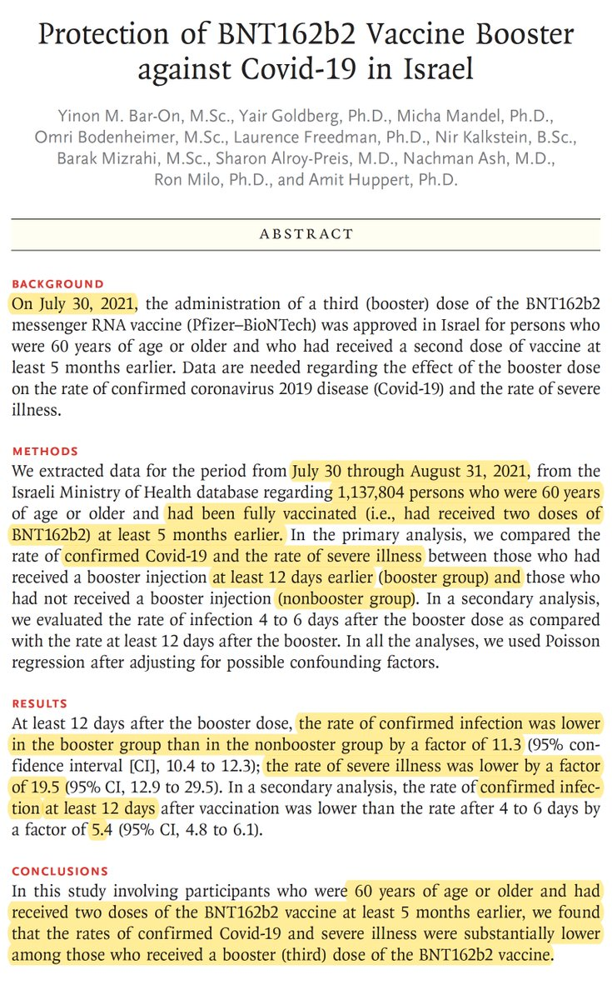</img></a><a href="E_WqsigVcAIBoL5.jpg"  ></img></a>

---

<a href="https://twitter.com/erictopol/status/1438246531455348738" target="_blank" rel="noreferer">21:01 UCT</a>

2. 6-month follow-up of the original placebo-controlled trials (adult + teens; &gt; 44,000 participants) showed gradual reduction in efficacy vs symptomatic infections from 96% (fully vaxxed) to 83% (&gt; 4 months)
http://www.nejm.org/doi/full/10.1056/NEJMoa2110345 

<a href="E_WsErNUUAI1WLX.jpg"  >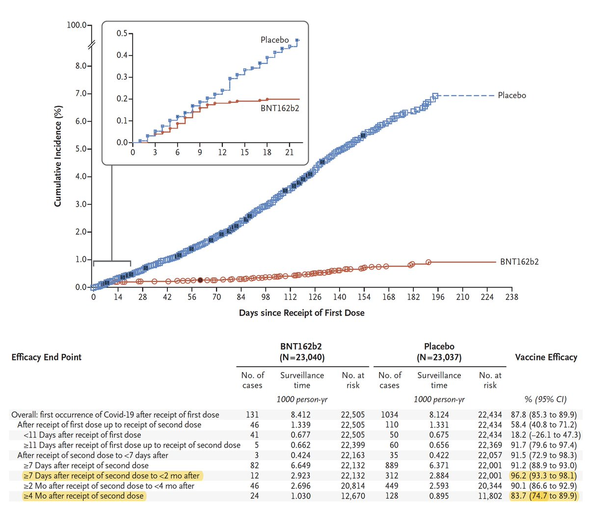</img></a>

---

<a href="https://twitter.com/erictopol/status/1438246537033699335" target="_blank" rel="noreferer">21:01 UCT</a>

3. Small 3rd shot-&gt; Neutralizing antibody study vs Wild-type and Delta by age group, showing significant increase immune response not much affected by variant or age 

<a href="E_Ws8kSVcAAegpE.jpg"  >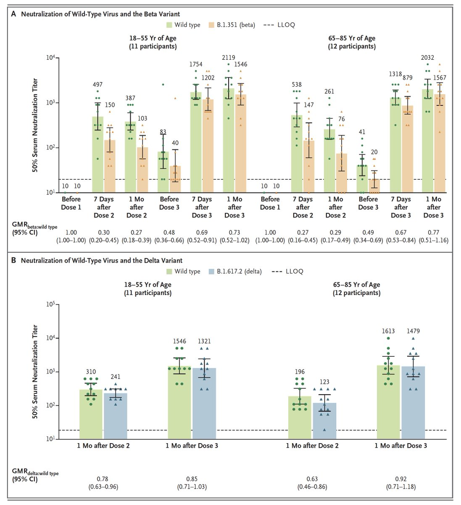</img></a>

---

<a href="https://twitter.com/erictopol/status/1438249272118439942" target="_blank" rel="noreferer">21:12 UCT</a>

Kudos to strong work by @yinonbaron @MiloLabWIS
 @IsraelMOH and their colleagues for rapid peer-review of their data from over 1 million people to shed light on impact of the 3rd shot. The only booster-outcome data that exists right now. 🙏

---

<a href="https://twitter.com/erictopol/status/1438252521248620549" target="_blank" rel="noreferer">21:24 UCT</a>

Circling back on the "let me be clear" initial post of this thread
Here are the published @NEJM data today on 3rd shot impact for over 1.1 million Israelis age 60 or older, &gt; 12 days out:
A 19.5-fold reduction in severe illness
http://nejm.org/doi/full/10.1056/NEJMoa2114255 

<a href="E_Wy1ScVgAIYYEV.jpg"  ></img></a>

---

<a href="https://twitter.com/erictopol/status/1438253687244165120" target="_blank" rel="noreferer">21:29 UCT</a>

New data on @Moderna_tx vaccine also shows waning of immunity,  36% fewer symptomatic breakthrough infections in an 8-month follow-up compared with 13-month, which the company says supports need for 3rd shots 
https://www.ft.com/content/160080b5-dc6b-47b0-b073-8aca600bc521 

<a href="E_Wz94NVIAEm2WU.jpg"  >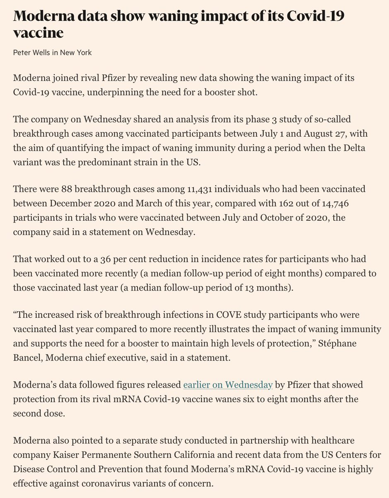</img></a>

---

<a href="https://twitter.com/erictopol/status/1438259670615879682" target="_blank" rel="noreferer">21:53 UCT</a>

There is no posted preprint yet on the Moderna data, just this press release https://www.businesswire.com/news/home/20210915006076/en/Moderna-Highlights-New-Clinical-Data-on-its-COVID-19-Vaccine 

<a href="E_W5fSHXsAMPlre.jpg"  >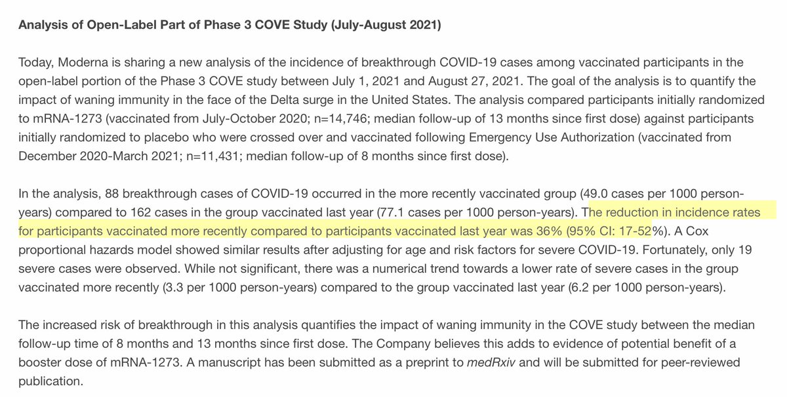</img></a>