+++
title = "Tweets by Eric Topol Sept 16"
Summary = ""
tags = ["Twitter"]
category = "Twitter"
+++

---

<a href="https://twitter.com/erictopol/status/1438312660974538755" target="_blank" rel="noreferer">01:23 UCT</a>

Where do we stand for the 3rd shot decision later this week after a bolus of new reports from Israel, Pfizer, @PHE_UK, AZ, and Moderna?
Evidence is clear-cut for a 3rd shot in people age ≥ 60 months out from Pfizer (protect vs severe illness) 

<a href="E_Xos0SUcAM9mVt.jpg"  >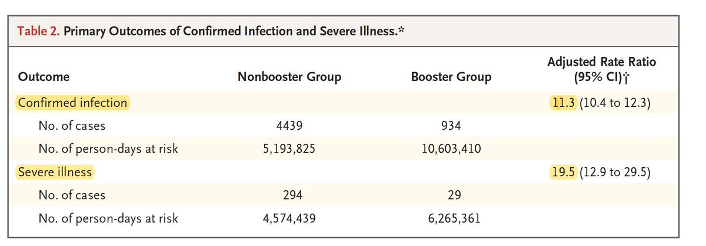</img></a><a href="E_XmYnZUcAAkMB2.jpg"  ></img></a><a href="E_XmbyEUcAMfgQT.jpg"  ></img></a><a href="E_Xm7vkVIAMoRUE.jpg"  >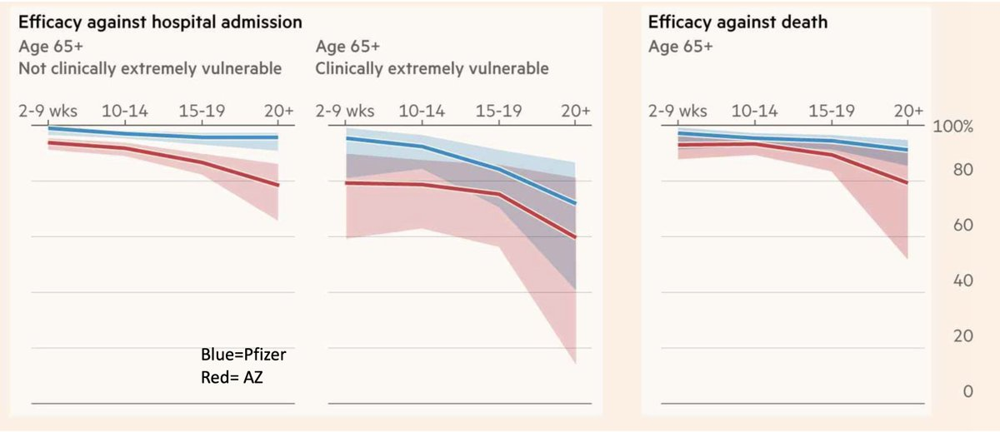</img></a>

---

<a href="https://twitter.com/erictopol/status/1438312663096823811" target="_blank" rel="noreferer">01:23 UCT</a>

That subgroup + frontline healthcare workers makes sense to go forward
All of these vaccines show some attrition of protection for different endpoints, across all ages, w/some variability in timing. This will require close follow-up to make informed decisions
Links in prior posts

---

<a href="https://twitter.com/erictopol/status/1438316459990552578" target="_blank" rel="noreferer">01:39 UCT</a>

RT @CarlosdelRio7: At the besieged FDA, ‘it never stops!’ as decisions loom on boosters, pediatric shots and more. Agree with ⁦@EricTopol⁩…

---

<a href="https://twitter.com/erictopol/status/1438356836416045056" target="_blank" rel="noreferer">04:19 UCT</a>

@CarlosdelRio7 Tony and Katalin are in good company with you, Carlos. Richly deserved. Congrats!

---

<a href="https://twitter.com/erictopol/status/1438495825076768770" target="_blank" rel="noreferer">13:31 UCT</a>

Today England started giving 3rd shots for all healthcare workers, age &gt;50, and clinically vulnerable individuals who are 6 months out from their 2nd dose, irrespective of what vaccine they received.
While the US fights about whether boosters are needed at all. Brilliant. 

<a href="E_aOV5qUUAAEToH.jpg"  >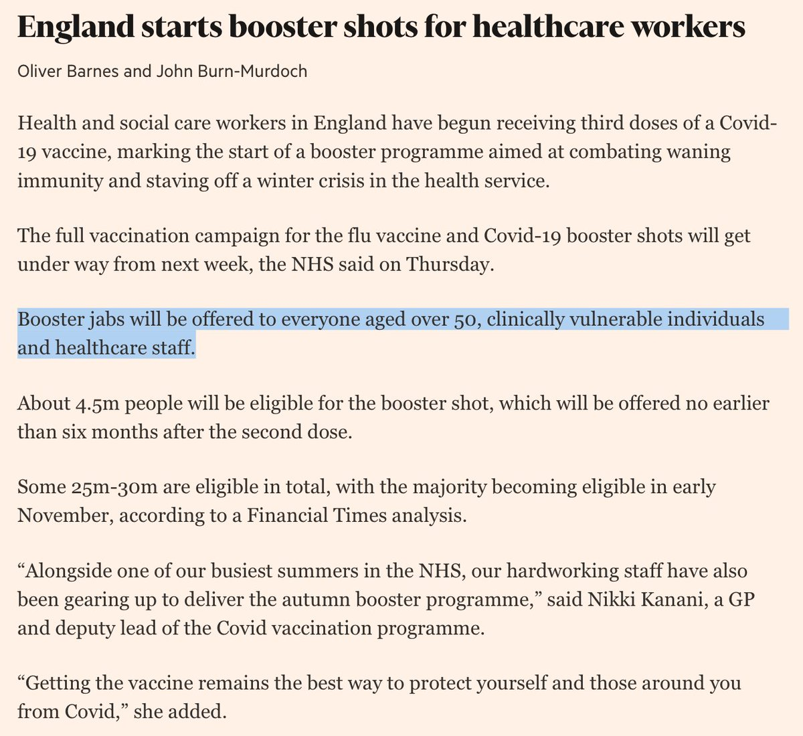</img></a><a href="E_aQKxJUYAQ7ZQ_.jpg"  >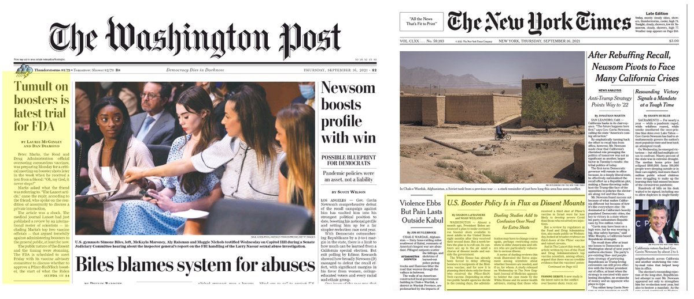</img></a>

---

<a href="https://twitter.com/erictopol/status/1438496682723864577" target="_blank" rel="noreferer">13:35 UCT</a>

https://www.washingtonpost.com/health/2021/09/15/fda-under-fire-boosters-vaccines/ by @lauriemcginley2 and @ddiamond A1 @washingtonpost 

<a href="E_aRChQUYA8mRg8.png"  >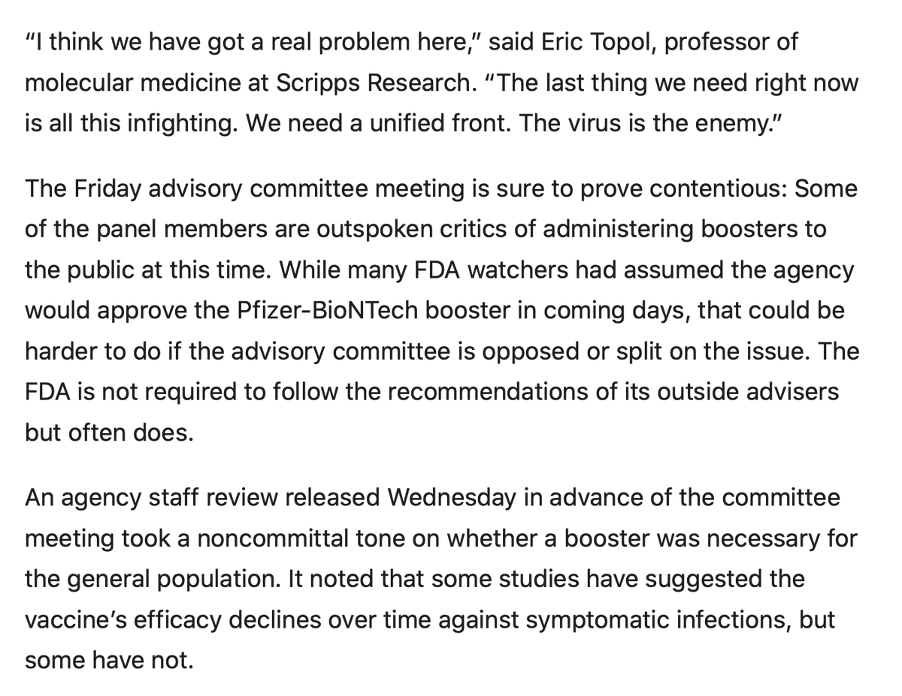</img></a>

---

<a href="https://twitter.com/erictopol/status/1438499684394307593" target="_blank" rel="noreferer">13:47 UCT</a>

There's only one country in the world that has already lost the lives of 1 of every 500 residents and is now averaging 2,000 covid deaths a day. 

<a href="E_aS08YVEAQ2sTv.jpg"  >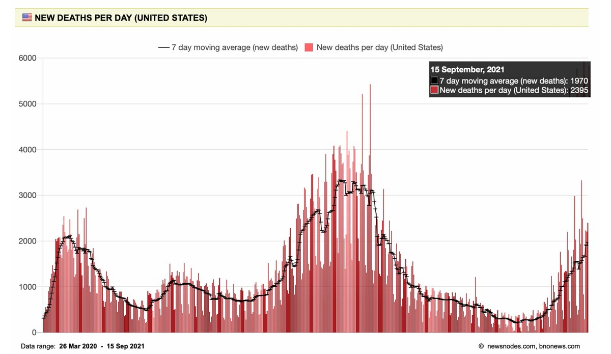</img></a>

---

<a href="https://twitter.com/erictopol/status/1438514700019388422" target="_blank" rel="noreferer">14:46 UCT</a>

Yet another step towards a pan-sarbecovirus vaccine that could be broadly effective against all #SARSCoV2 variants using receptor binding domain nanoparticles  https://www.cell.com/cell/fulltext/S0092-8674(21)01062-X#secsectitle0015 @CellCellPress 

<a href="E_ahZOSVUAwpglr.jpg"  >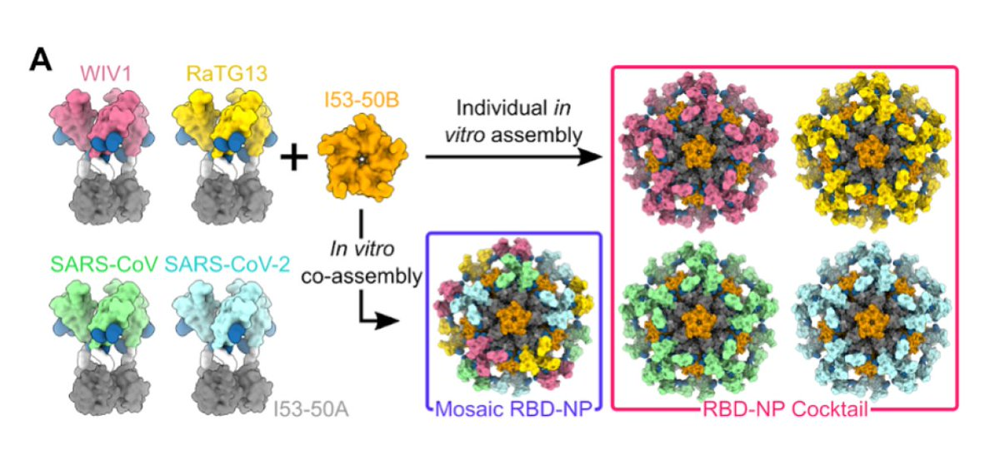</img></a>

---

<a href="https://twitter.com/erictopol/status/1438516803383148557" target="_blank" rel="noreferer">14:55 UCT</a>

The new US and world leader in covid cases per capita, WV 

<a href="E_ajVdeVEAMsjAN.jpg"  >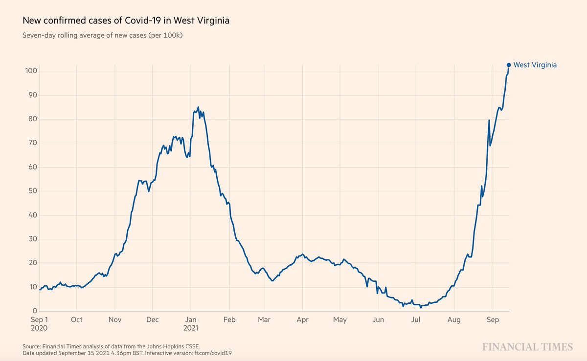</img></a>

---

<a href="https://twitter.com/erictopol/status/1438521508909912071" target="_blank" rel="noreferer">15:13 UCT</a>

The @IsraelMOH will be presenting at the @US_FDA meeting tomorrow on boosters. Their data are compelling evidence for the benefit for age 60 and greater to prevent severe disease, and for safety
https://www.fda.gov/media/152205/download 

<a href="E_anMKYVUAQi9lC.jpg"  >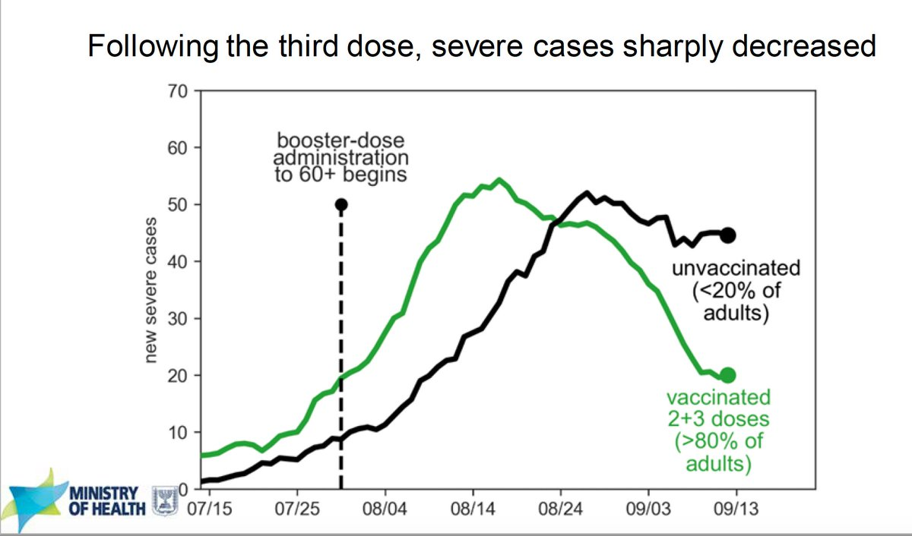</img></a><a href="E_anOvVVcAEHcAh.jpg"  >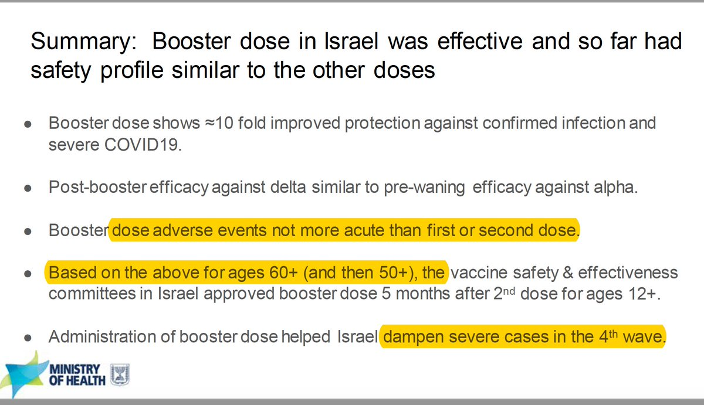</img></a>

---

<a href="https://twitter.com/erictopol/status/1438538263849947137" target="_blank" rel="noreferer">16:20 UCT</a>

The UK suppression of cases and deaths with vaccinations during the Delta wave, by age groups
https://www.economist.com/graphic-detail/2021/09/18/despite-delta-severe-covid-19-is-much-rarer-among-vaccinated-britons
using @PHE_uk dat @TheEconomist 

<a href="E_a21gBVQAUfn_F.jpg"  >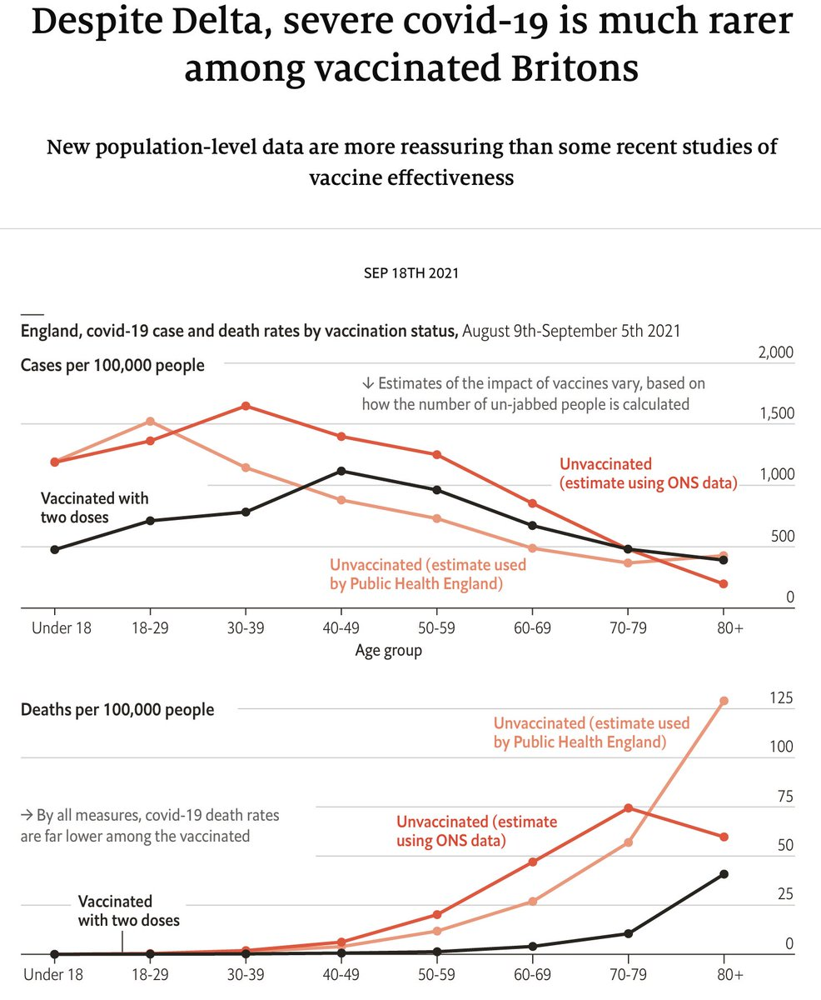</img></a>

---

<a href="https://twitter.com/erictopol/status/1438542673422401536" target="_blank" rel="noreferer">16:37 UCT</a>

If you think there's a controversy in the US now for age 60+, wait till there's more Israeli follow up data on severe illness for the 40-49 and 50-59 year old groups (slides from above) 

<a href="E_a6wPNVQAYHFmk.jpg"  >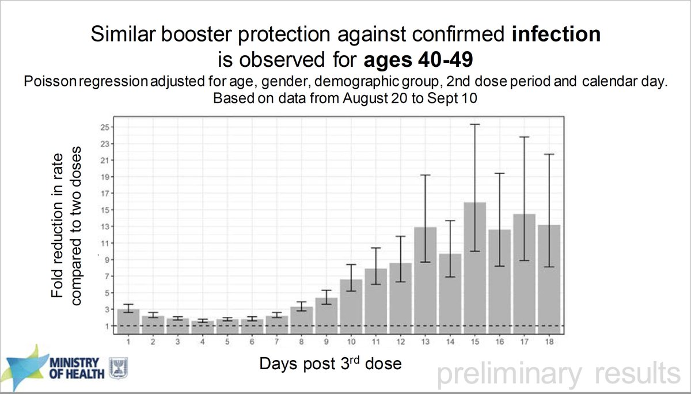</img></a><a href="E_a6xxxVUAMXI_Z.jpg"  >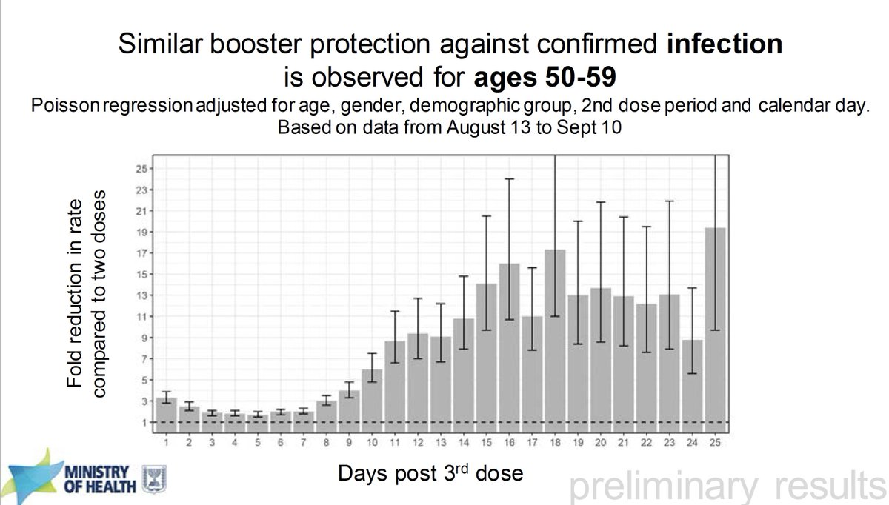</img></a>

---

<a href="https://twitter.com/erictopol/status/1438544575224639489" target="_blank" rel="noreferer">16:45 UCT</a>

@shadihamid It is not misleading at all. None of those countries are still having 2,000 deaths per day.

---

<a href="https://twitter.com/erictopol/status/1438581247651901443" target="_blank" rel="noreferer">19:11 UCT</a>

An encouraging study about waning of vaccine protection
"Rapid waning of efficacy vs COVID-19 in the first two months after the 2nd dose tapers off thereafter and that the trajectory is consistent w/ a long-term efficacy of ~80% against hospitalisation"
https://www.medrxiv.org/content/10.1101/2021.09.12.21263448v1

---

<a href="https://twitter.com/erictopol/status/1438588532243656705" target="_blank" rel="noreferer">19:40 UCT</a>

Countries moving forward with booster shots
for people age &gt;65 +/- health care workers

Israel
UK
Singapore
France
Germany
Finland
Ireland
Czech Republic
Austria
Greece
South Korea
Hungary 
Indonesia
Cambodia
Chile
Uruguay
Thailand

https://www.reuters.com/article/us-health-coronavirus-booster-idUKKBN2GA190

---

<a href="https://twitter.com/erictopol/status/1438598772775260165" target="_blank" rel="noreferer">20:20 UCT</a>

Or how about age 20 and up? via @feldman_gil 
https://twitter.com/feldman_gil/status/1438598295824355335

---

<a href="https://twitter.com/erictopol/status/1438620332718362635" target="_blank" rel="noreferer">21:46 UCT</a>

The US, now ranked 37 on the list of fully vaccinated of total population, and dropping lower every week
https://ig.ft.com/coronavirus-vaccine-tracker/?areas=gbr&areas=isr&areas=usa&areas=eue&areas=can&areas=chn&areas=ind&cumulative=1&doses=total&populationAdjusted=1 

<a href="E_cBgCLVkAAaQ4F.jpg"  >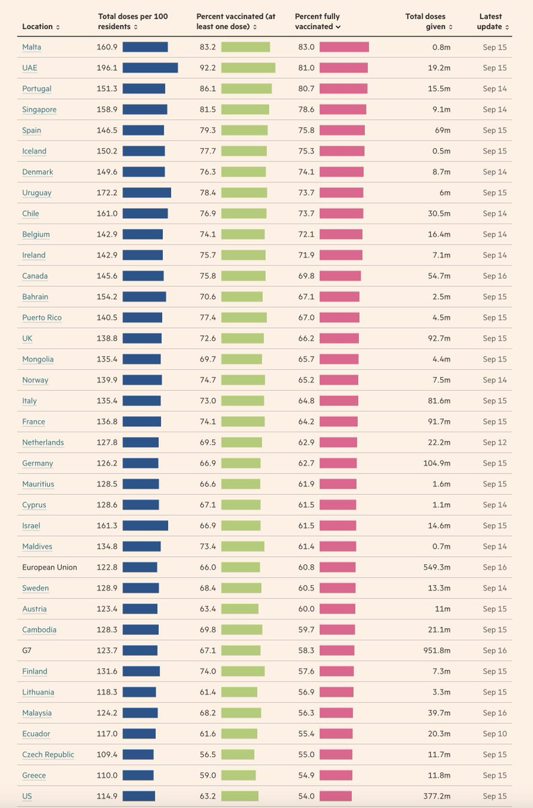</img></a>

---

<a href="https://twitter.com/erictopol/status/1438641679435636736" target="_blank" rel="noreferer">23:11 UCT</a>

RT @scrippsresearch: Rapid testing may be one of the most under-utilized tools in the arsenal against the #coronavirus. @EricTopol &amp; @danie…

