+++
title = "Tweets by Eric Topol Sept 17"
Summary = ""
tags = ["Twitter"]
category = "Twitter"
+++

---

<a href="https://twitter.com/erictopol/status/1438675264846716932" target="_blank" rel="noreferer">01:24 UCT</a>

It's interesting to watch certain FDA scientists and US public health experts diss or harshly critique waning vaccine effectiveness and 3rd shot data from Israel and the UK when they have no national data of their own

---

<a href="https://twitter.com/erictopol/status/1438681372994932737" target="_blank" rel="noreferer">01:49 UCT</a>

The @PHE_uk and @IsraelMOH carefully track their national data and issue frequent excellent reports, use such data for decisions about vaccine dose-spacing (UK), teens, boosters (IL/UK), etc. The US does not have *national* data for vaccine effectiveness

---

<a href="https://twitter.com/erictopol/status/1438703947804393473" target="_blank" rel="noreferer">03:18 UCT</a>

File under horrific and hard to believe this is happening
There were 3,449 covid deaths in the US reported today, with 1,554 from recent days in Florida 

<a href="E_dNVfFVUAY5-nF.jpg"  >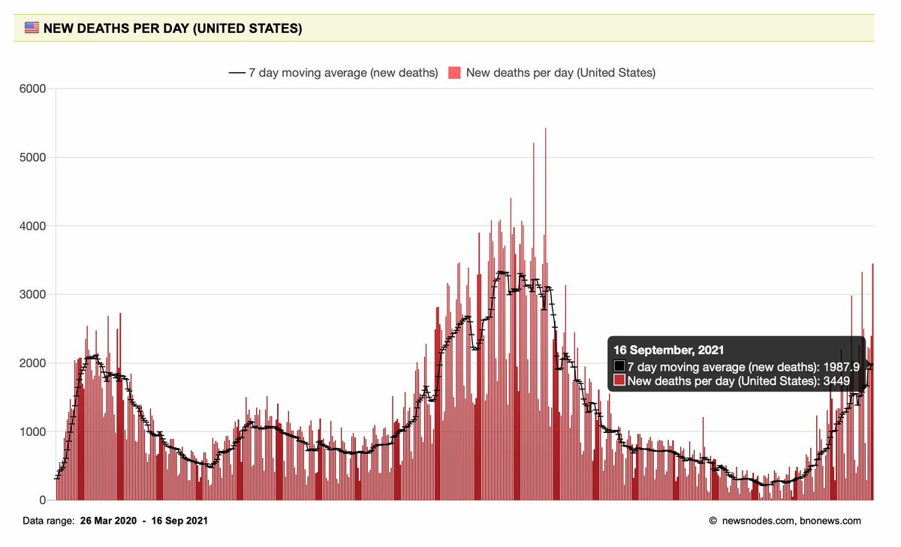</img></a><a href="E_dNj3AVEAAfJAC.jpg"  >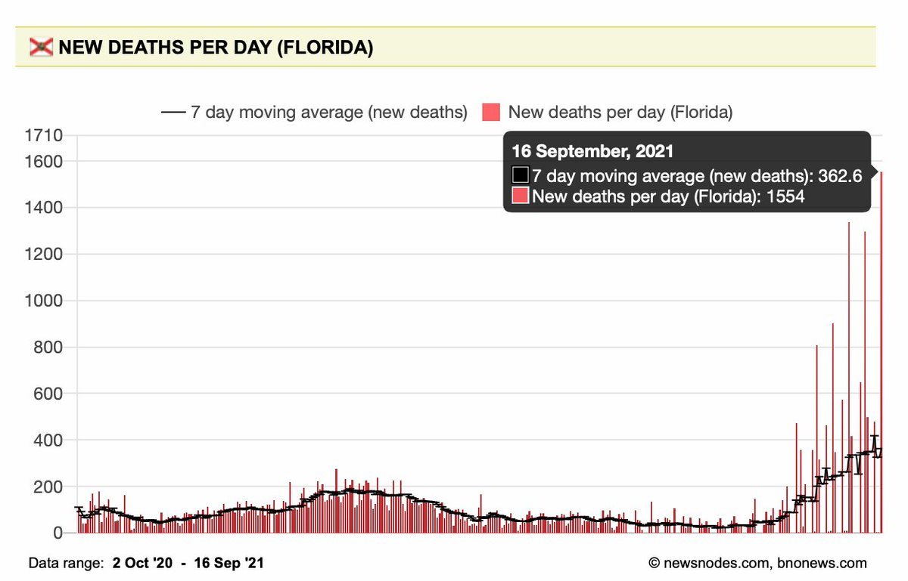</img></a>

---

<a href="https://twitter.com/erictopol/status/1438710792392634370" target="_blank" rel="noreferer">03:45 UCT</a>

Best product name for a covid vaccine to date?

---

<a href="https://twitter.com/erictopol/status/1438854121864400902" target="_blank" rel="noreferer">13:15 UCT</a>

Just published @NatureRevGenet 
A tour de force review of the #SARSCoV2 variants 
https://www.nature.com/articles/s41576-021-00408-x 

<a href="E_fV2TNVIAIKiAc.jpg"  >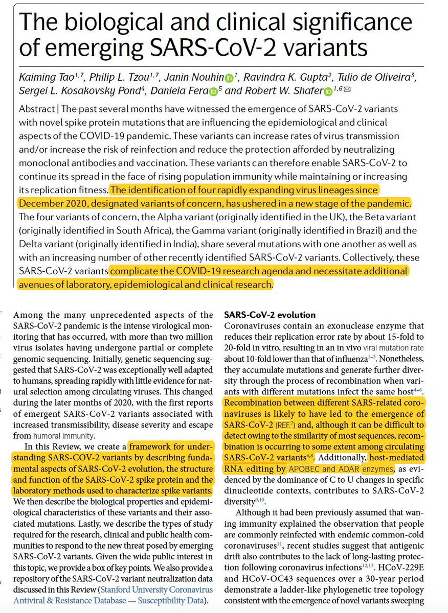</img></a><a href="E_fWGH7VkAMmAyG.jpg"  >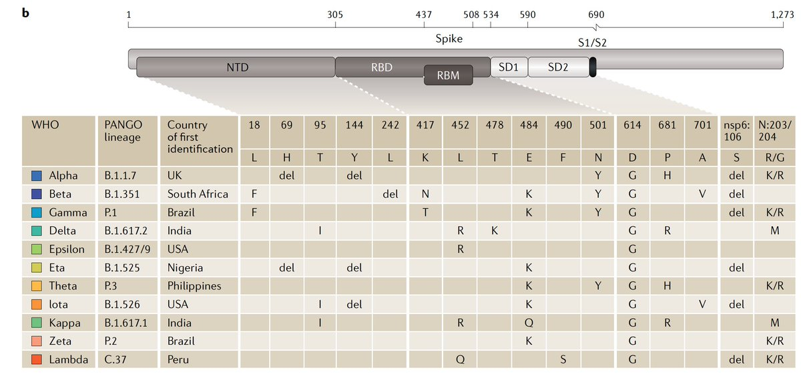</img></a><a href="E_fWJxfVIAI3RNY.jpg"  >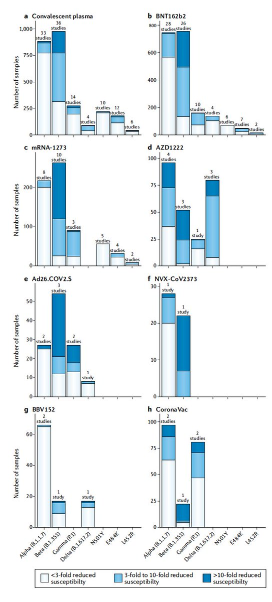</img></a>

---

<a href="https://twitter.com/erictopol/status/1438858008059023366" target="_blank" rel="noreferer">13:30 UCT</a>

A new @ONS UK report on #LongCovid frequency and duration in ~50,000 people, half w/ infections, half controls, and multiple types of assessment
https://www.ons.gov.uk/peoplepopulationandcommunity/healthandsocialcare/conditionsanddiseases/articles/technicalarticleupdatedestimatesoftheprevalenceofpostacutesymptomsamongpeoplewithcoronaviruscovid19intheuk/26april2020to1august2021
Unusual in children; increase in women, middle-age, high viral load (Ct). Overall lower % than previous reports 

<a href="E_fY5h2UcAIZpF9.png"  >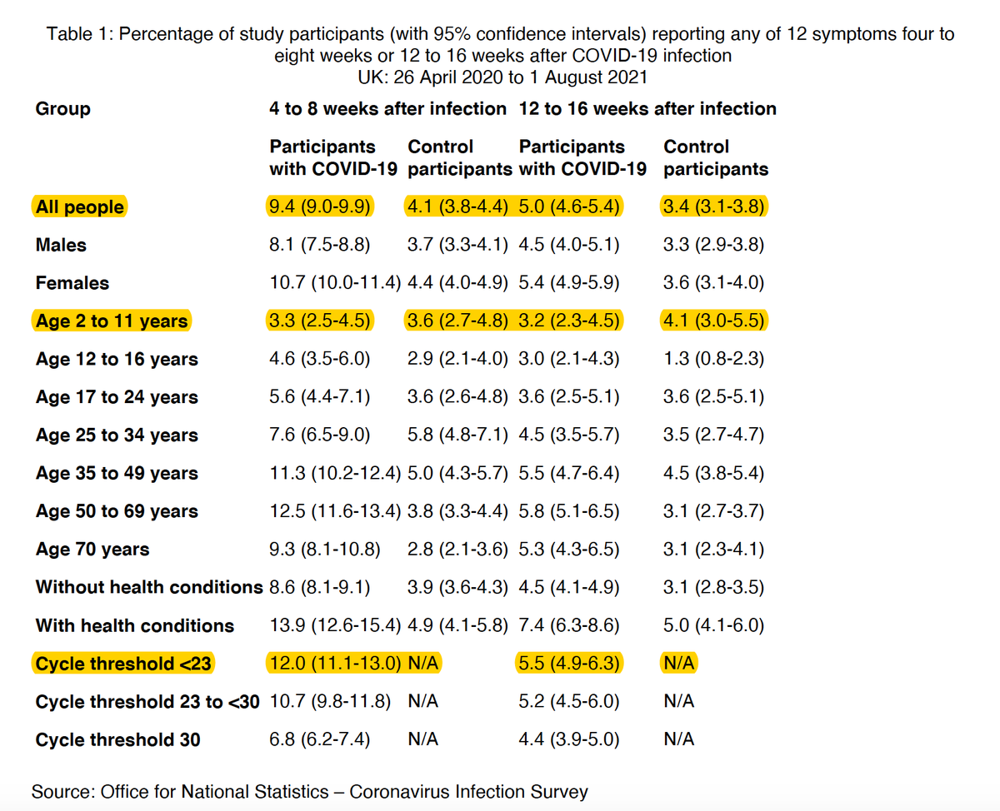</img></a><a href="E_fZOvfVUAQhpdA.png"  >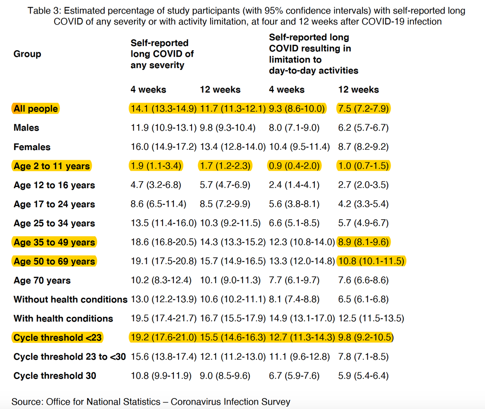</img></a>

---

<a href="https://twitter.com/erictopol/status/1438863985810415620" target="_blank" rel="noreferer">13:54 UCT</a>

RT @matthewherper: This current discussion from the CDC on collecting data about the vaccines just reveals how terrible the U.S. collection…

---

<a href="https://twitter.com/erictopol/status/1438919014504296448" target="_blank" rel="noreferer">17:33 UCT</a>

New @CDCMMWR on US vaccinations, antibody (Ab) response, and protection from hospitalization (H)  in non-immunocompromised people, March-August https://www.cdc.gov/mmwr/volumes/70/wr/mm7038e1.htm?s_cid=mm7038e1_w
Vaccine Effectiveness vs H:
Moderna 93%, Pfizer 88%, J&amp;J 71%
See Table below for details, Figure for Ab response 

<a href="E_gQtvjUYAIVYgC.jpg"  >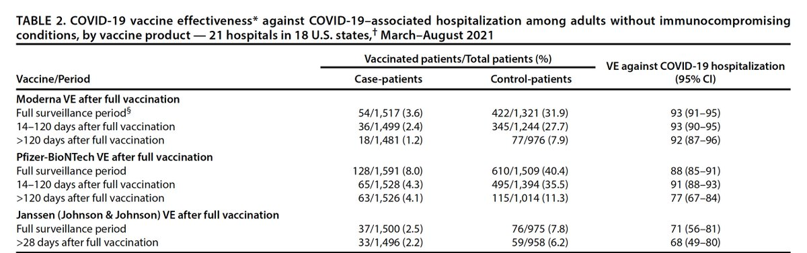</img></a><a href="E_gRBBwVgAAVL4r.jpg"  >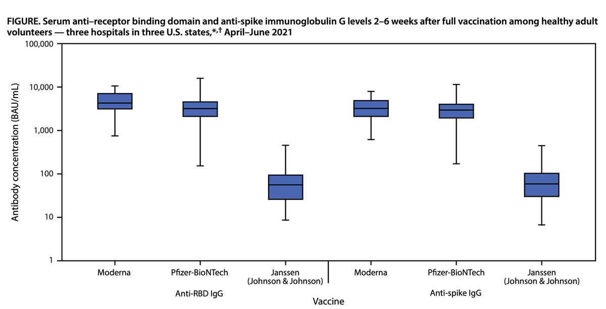</img></a>

---

<a href="https://twitter.com/erictopol/status/1438920082793517056" target="_blank" rel="noreferer">17:37 UCT</a>

Note Pfizer's data after 120 days reduction of vaccine effectiveness vs hospitalization  91% (88-93) to 77% (67-84). That is statistically significant and not trivial.

---

<a href="https://twitter.com/erictopol/status/1438921818069364739" target="_blank" rel="noreferer">17:44 UCT</a>

These US IVY network data and much more (including July/August timing) were not part of today's @US_FDA VRBPAC  and Monday's ACIP Pfizer booster review. That is unfortunate with continued assertions by many that there is fully preserved vaccine protection from hospitalizations

---

<a href="https://twitter.com/erictopol/status/1438940885861896193" target="_blank" rel="noreferer">19:00 UCT</a>

Agree with this call with a qualifier. 
Not "probably."
Age ≥ 60. There is unequivocal benefit of the 3rd shot. 
Need further data for making the decision on younger age groups. https://twitter.com/megtirrell/status/1438938594756935689

---

<a href="https://twitter.com/erictopol/status/1438943452956225536" target="_blank" rel="noreferer">19:10 UCT</a>

@davidrlurie Understood. Ultimately, need for a 3rd shot will likely be validated for all vaccines and much broader w/r to age and other features. Just don't have enough data now.

---

<a href="https://twitter.com/erictopol/status/1438950683957358598" target="_blank" rel="noreferer">19:39 UCT</a>

The vote question was set up to fail, calling for a blanket approval for all age 16+ (related to aggressive Pfizer EUA request). How could that possibly be voted for in favor when such broad data do not exist anywhere?
Of course, the vote was 16 to 3 against. 

<a href="E_gtJ9-WQAoc1K2.jpg"  >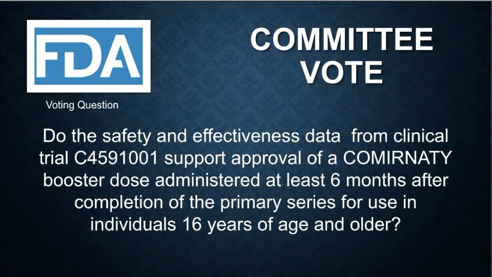</img></a>

---

<a href="https://twitter.com/erictopol/status/1438956370342993921" target="_blank" rel="noreferer">20:01 UCT</a>

There will be a new question, likely with the age 60 cutoff, that is likely to get near unanimous support.
(Reminder: The UK went ahead with an age 50 cutoff this week for all vaccines).
Left unaddressed is the vulnerable frontline health care workforce

---

<a href="https://twitter.com/erictopol/status/1438963127911993345" target="_blank" rel="noreferer">20:28 UCT</a>

Now a unanimous vote in favor of 65 and older and people at high-risk for severe covid (which gives room for interpretation).  OK, that's progress. 👍 https://twitter.com/EricTopol/status/1438950683957358598

---

<a href="https://twitter.com/erictopol/status/1438970304785629188" target="_blank" rel="noreferer">20:57 UCT</a>

RT @ashishkjha: And unanimous on including healthcare workers in the EUA

All good stuff

---

<a href="https://twitter.com/erictopol/status/1438974306579484673" target="_blank" rel="noreferer">21:13 UCT</a>

A very good outcome for this FDA Advisory Committee following what data are available w/r to age, and recognizing the need for high-risk individuals, due to co-existing conditions or occupational exposures, such as the heathcare workforce, essential workers, and teachers.
👋🙏

---

<a href="https://twitter.com/erictopol/status/1438979986333995009" target="_blank" rel="noreferer">21:35 UCT</a>

A new, outstanding review of Covid-19 @Sciimmunology on how we can favorably modulate the immune response in people, learning from bats, which get only mild disease from #SARSCoV2 https://www.science.org/doi/10.1126/sciimmunol.abd0205 

<a href="E_hIU5cVcAAKJIV.jpg"  >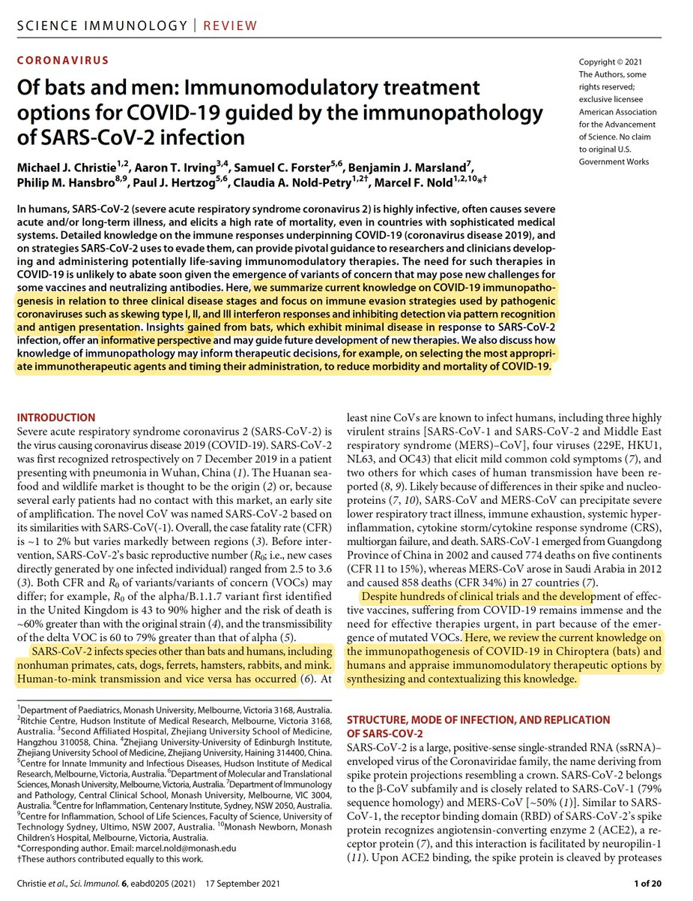</img></a><a href="E_hIHgXVgAMpdy_.jpg"  >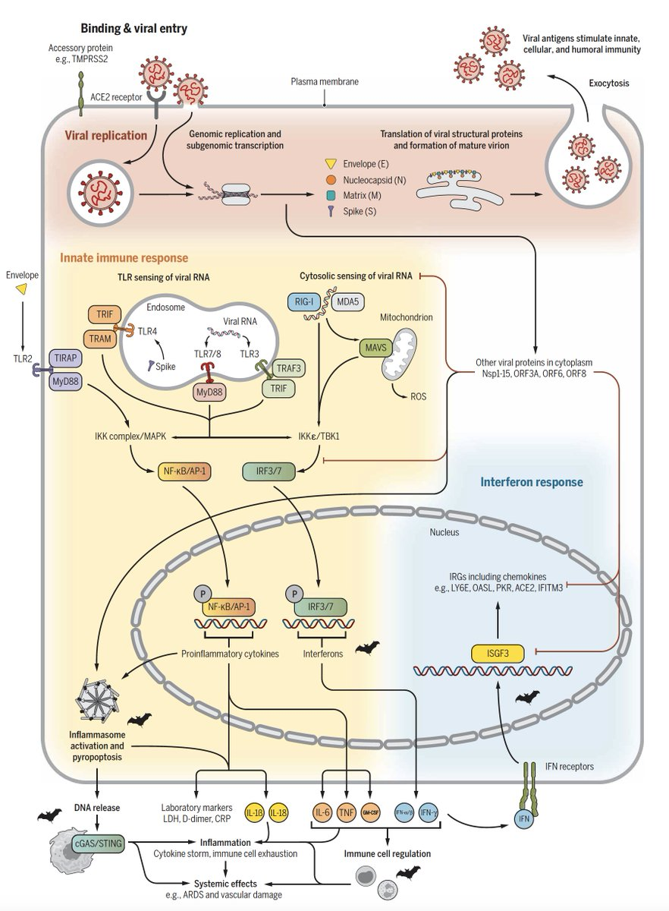</img></a><a href="E_hIKPiVcAUanwj.jpg"  >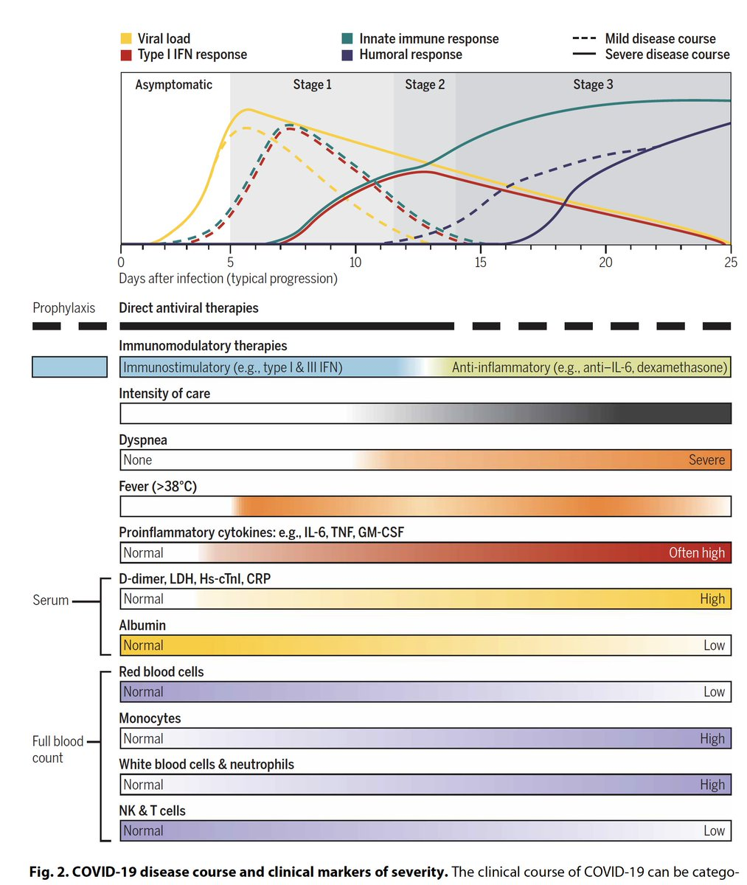</img></a><a href="E_hIMoPVgAAu-e1.jpg"  >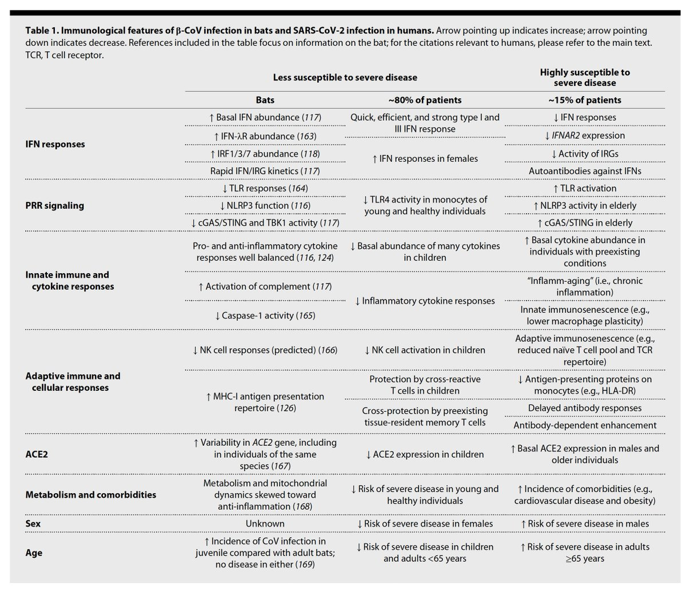</img></a>