+++
title = "Tweets by Eric Topol Sept 18"
Summary = ""
tags = ["Twitter"]
category = "Twitter"
+++

---

<a href="https://twitter.com/erictopol/status/1439040639954403329" target="_blank" rel="noreferer">01:36 UCT</a>

@MaryMacUSA @mehdirhasan It has been documented, likely uncommon but I haven’t seen any data on that important question to quantify that mode of transmission

---

<a href="https://twitter.com/erictopol/status/1439042701995888641" target="_blank" rel="noreferer">01:44 UCT</a>

Today’s FDA Advisory for Pfizer didn’t address the vulnerability of people who received J&amp;J shots. But these data of low antibody levels 👇for J&amp;J suggest high vulnerability—an mRNA vaccine 2nd shot is overdue to be addressed by CDC/FDA and should be supported. https://twitter.com/EricTopol/status/1438919014504296448

---

<a href="https://twitter.com/erictopol/status/1439045221279420417" target="_blank" rel="noreferer">01:54 UCT</a>

Part of this vexing rests with J&amp;J. AFAIK they have not submitted to FDA or published any data on this vital question, and we have been extrapolating from the very  strong immune response and safety from Astra Zeneca 1st shot, mRNA 2nd (better than either vaccine 2 doses)

---

<a href="https://twitter.com/erictopol/status/1439051507291230209" target="_blank" rel="noreferer">02:19 UCT</a>

@CarlosdelRio7 @MedicareGov That was wrong and IMO a mistake of the Advisory Committee, not in alignment with the Israeli compelling data for 60+. But the language of "high-risk" gives an out for anyone 60 or older. Maybe the FDA and ACIP will get this right in the days ahead.

---

<a href="https://twitter.com/erictopol/status/1439231474130042882" target="_blank" rel="noreferer">14:14 UCT</a>

65 years later, different pathogen, what else changed?
Still a vaccine card in 2021 
A need for a booster 5 months later
Yet major reluctance (Roberto’s wording“fuss”) to accept 3rd dose
Unwillingness of large proportion of US population to get any vaccination https://twitter.com/RobertoBurioni/status/1438997920041377800

---

<a href="https://twitter.com/erictopol/status/1439235733458354179" target="_blank" rel="noreferer">14:31 UCT</a>

@BogochIsaac Agree Isaac
https://twitter.com/EricTopol/status/1438974306579484673

---

<a href="https://twitter.com/erictopol/status/1439243980248547332" target="_blank" rel="noreferer">15:04 UCT</a>

Why was the age cutoff of 65 selected by the FDA Advisory Committee instead of clearcut Israeli data showing ~20-fold benefit of a booster in &gt; 1.1 million people age 60+?
https://www.nejm.org/doi/full/10.1056/NEJMoa2114255?query=featured_home
2 US studies show risk age 65+ (no booster)
https://www.cdc.gov/mmwr/volumes/70/wr/mm7037e3.htm?s_cid=mm7037e3_w
No good reason. 

<a href="E_k4qKEVkAAjOR1.jpg"  >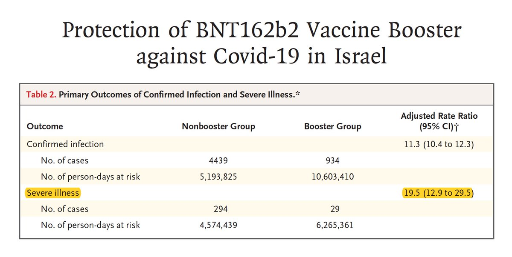</img></a><a href="E_k3I7OVcAsjItV.jpg"  >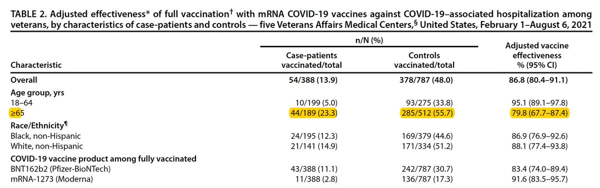</img></a><a href="E_k4ft-VEAUicXg.jpg"  >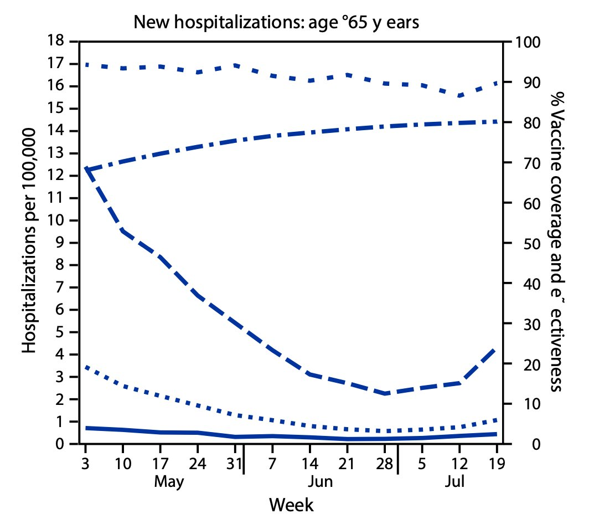</img></a>

---

<a href="https://twitter.com/erictopol/status/1439246636622835718" target="_blank" rel="noreferer">15:15 UCT</a>

Historical perspective of vaccine mandates in the US
https://www.wsj.com/articles/the-long-history-of-vaccine-mandates-in-america-11631890699 @DavidOshinsky 
The case for them in &lt; 60 seconds @mehdirhasan 
https://twitter.com/mehdirhasan/status/1438695474836480002 

<a href="E_k6fgLVgAQa8CW.jpg"  >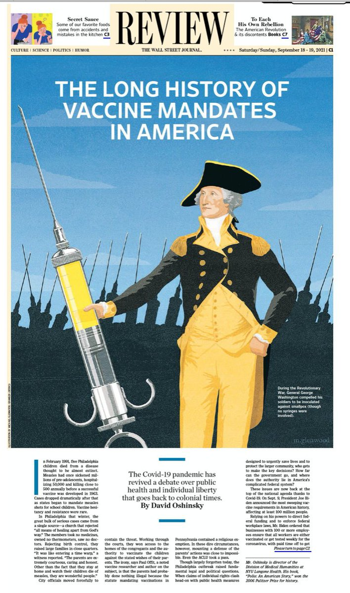</img></a><a href="E_k7IByVkAUaYNp.jpg"  >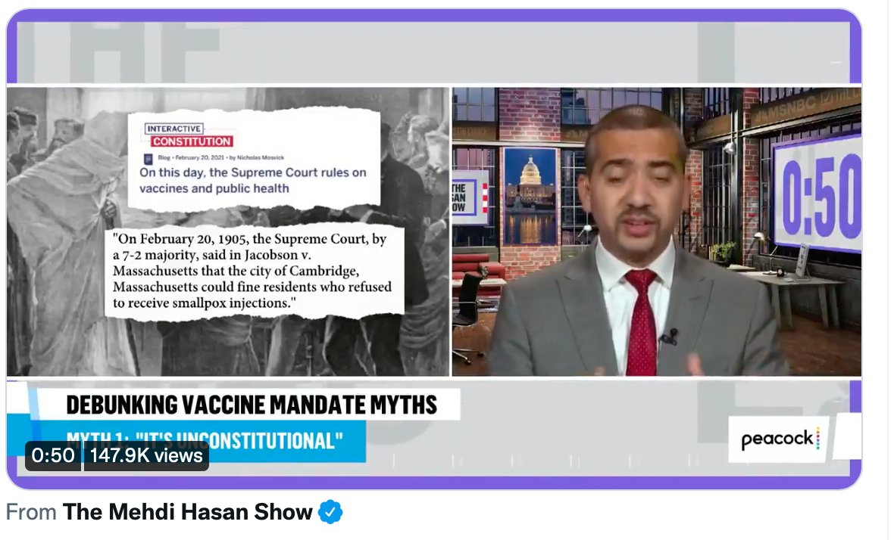</img></a>

---

<a href="https://twitter.com/erictopol/status/1439252274333708289" target="_blank" rel="noreferer">15:37 UCT</a>

What doesn't get enough attention?
2,714 deaths reported yesterday

At least hospitalizations are continuing to decline 

<a href="E_lATxVVgAMfX2O.jpg"  >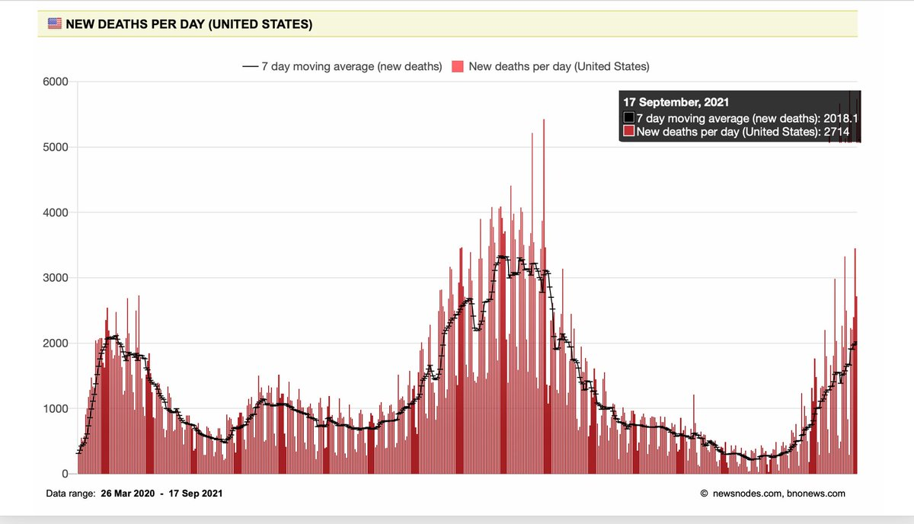</img></a><a href="E_lAJqPVgAUi5HX.jpg"  >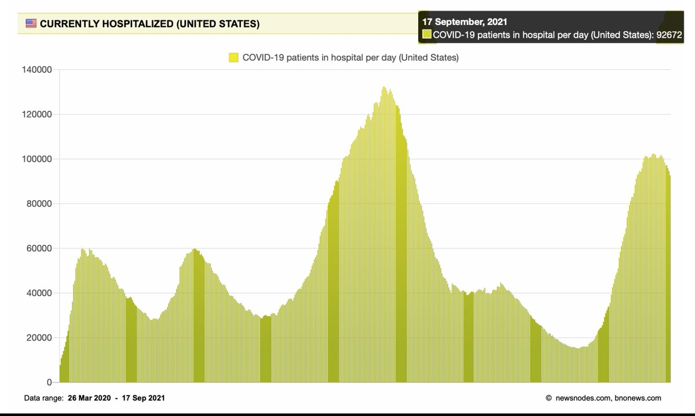</img></a>

---

<a href="https://twitter.com/erictopol/status/1439256235719553027" target="_blank" rel="noreferer">15:53 UCT</a>

Remember the man who brought hydroxychloroquine to the forefront as the imminent cure for the pandemic?
https://www.washingtonpost.com/world/europe/didier-raoult-hydroxychloroquine/2021/09/17/a56c5bd4-1574-11ec-a019-cb193b28aa73_story.html by @rick_n 
It gets worse. An anti-vaxxer to boot. 

<a href="E_lDhJ2UUAUn4kR.jpg"  >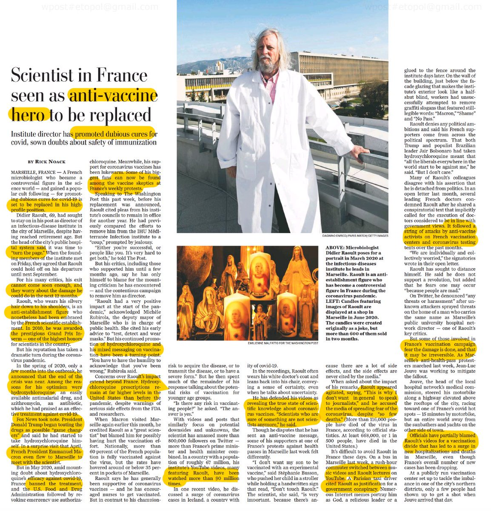</img></a>

---

<a href="https://twitter.com/erictopol/status/1439260647053664257" target="_blank" rel="noreferer">16:10 UCT</a>

Drs.Blackstock, @oni_blackstock and @uche_blackstock, review the critical role of Black musicians and physicians in the wake of the Nicki Minaj maelstrom https://www.washingtonpost.com/opinions/2021/09/17/nicki-minaj-vaccine-tweet-covid-infertility-misinformation/ @PostOpinions 

<a href="E_lF-q6UUAIU4vR.jpg"  >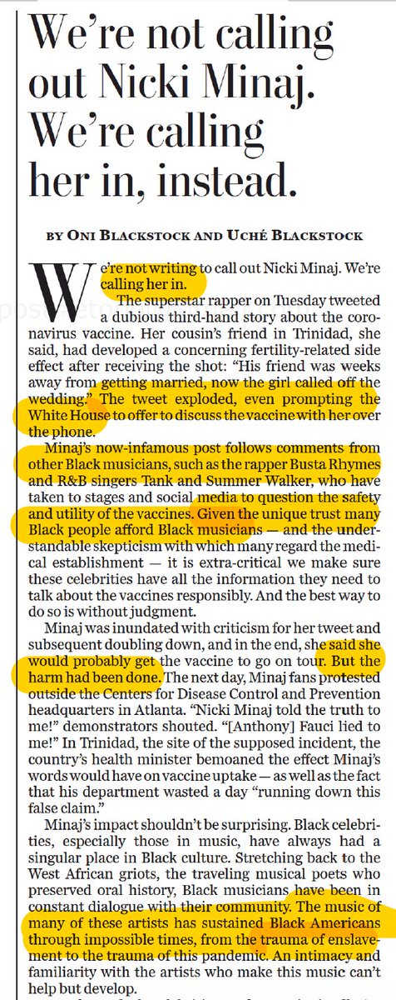</img></a><a href="E_lGhq5UYA0egeg.jpg"  >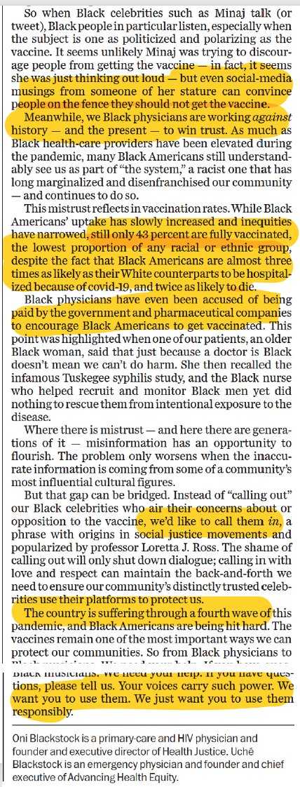</img></a>

---

<a href="https://twitter.com/erictopol/status/1439261462191427585" target="_blank" rel="noreferer">16:14 UCT</a>

@uche_blackstock @oni_blackstock @PostOpinions loved it! 🙏

---

<a href="https://twitter.com/erictopol/status/1439266703427260417" target="_blank" rel="noreferer">16:34 UCT</a>

Mask wars go way back, too.
https://www.nejm.org/media/doi/full/10.1056/NEJMp2112052 @NEJM today  https://twitter.com/EricTopol/status/1439246636622835718

<a href="E_lNBvfVkAIPSz2.jpg"  >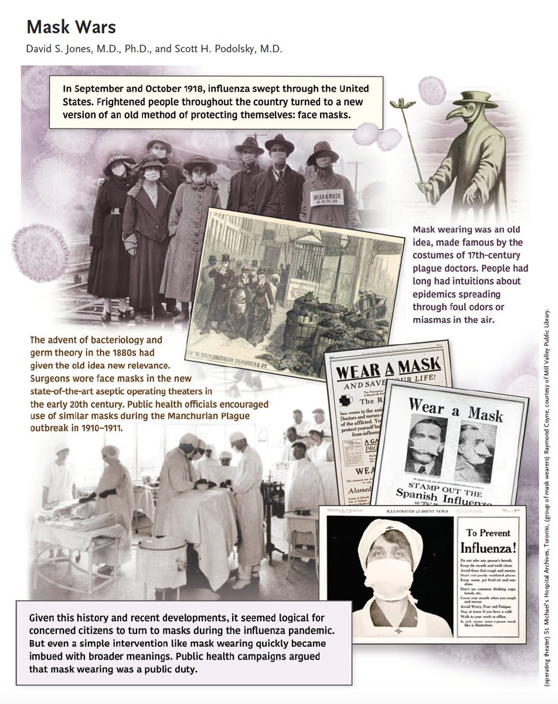</img></a><a href="E_lNDzVVQAITyNq.jpg"  >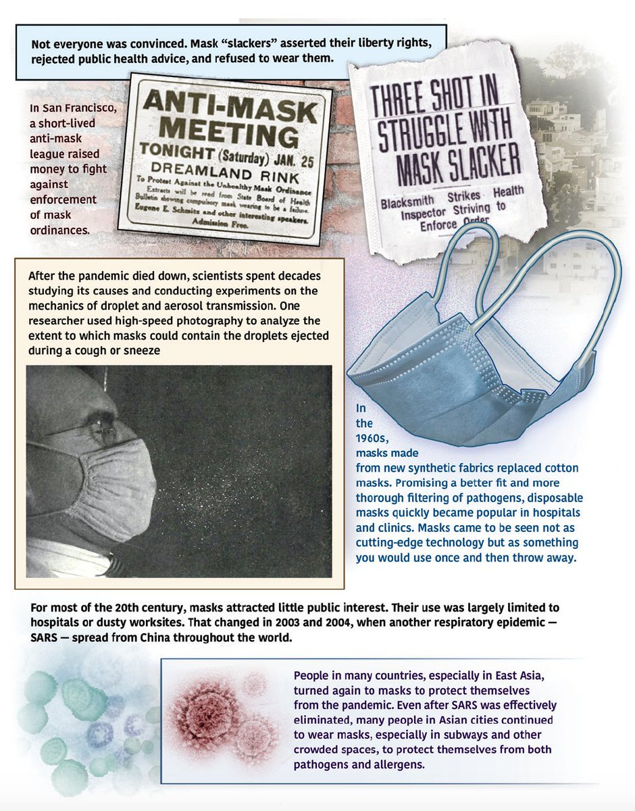</img></a>

---

<a href="https://twitter.com/erictopol/status/1439266984961601542" target="_blank" rel="noreferer">16:36 UCT</a>

@Stephengm99 That's right. Herd effect.

---

<a href="https://twitter.com/erictopol/status/1439269622767767564" target="_blank" rel="noreferer">16:46 UCT</a>

Incredulous.
More than 1,700 health care workers in San Diego are seeking religious exemptions to avoid getting a vaccine.
@sdut 

<a href="E_lPFC_UUAAqEmg.jpg"  >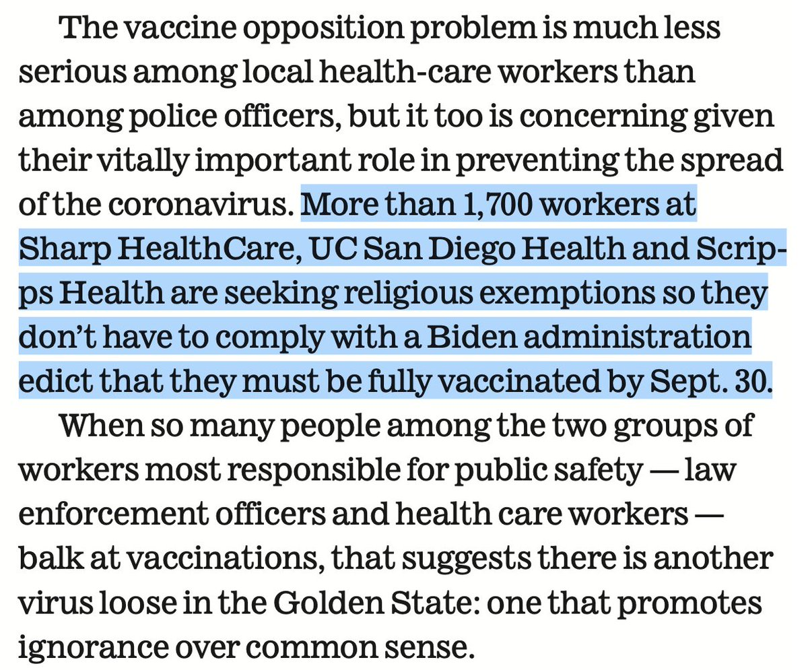</img></a>

---

<a href="https://twitter.com/erictopol/status/1439272535149867012" target="_blank" rel="noreferer">16:58 UCT</a>

@DrXiaoLiu @DrHughHarvey @uhbtrust Nothing like this in the US, Xiao. 👏

---

<a href="https://twitter.com/erictopol/status/1439295340230811649" target="_blank" rel="noreferer">18:28 UCT</a>

For several weeks dating back to July, we have seen protection of vaccination for symptomatic infections drop down from &gt;90% to &lt;40% in Israel which was refuted, attributed to poor analysis, Simpson's paradox, and many other objections to @IsraelMOH reports /2

---

<a href="https://twitter.com/erictopol/status/1439295338792189952" target="_blank" rel="noreferer">18:28 UCT</a>

A @CellCellPress commentary yesterday entitled "Keeping Pace with the #SARSCoV2 Variants" states 
"The evidence so far suggests that effectiveness against hospitalizations and symptomatic illness is highly preserved against Delta" https://www.cell.com/cell/fulltext/S0092-8674(21)01057-6
I'm calling it out. /1

---

<a href="https://twitter.com/erictopol/status/1439295345914114049" target="_blank" rel="noreferer">18:28 UCT</a>

Those reports were since corroborated by others including @KPSCalResearch, @PHE_uk. Qatar and many other. But they were ignored and denied. /3 

<a href="E_ljYZLUYAAqP0X.jpg"  >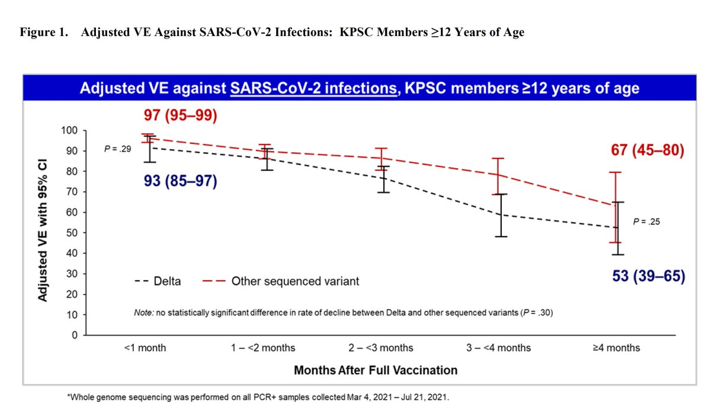</img></a><a href="E_ljaeSUUAIiZIY.jpg"  >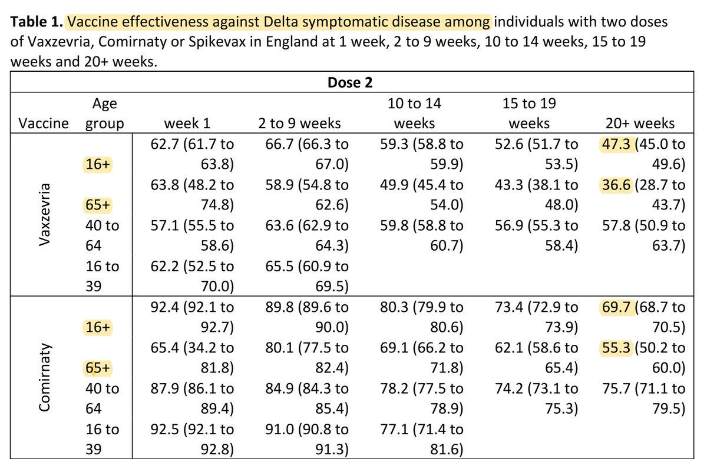</img></a><a href="E_lj7UmUcAAkw7m.jpg"  >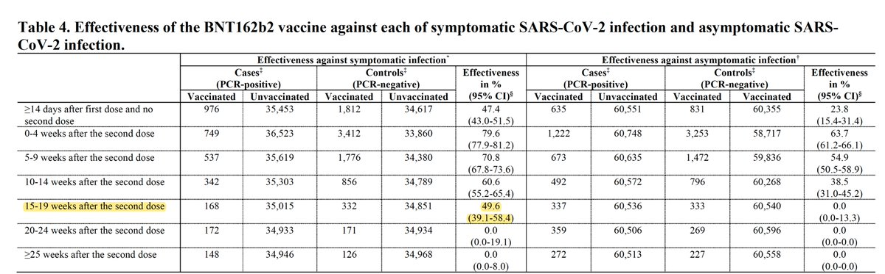</img></a>

---

<a href="https://twitter.com/erictopol/status/1439295350162948098" target="_blank" rel="noreferer">18:28 UCT</a>

This culminated in @TheLancet commentary this week by 2 FDA scientists, @WHO, and others
"To date, none of these studies has provided evidence of substantially declining protection against severe disease." That is pure denial. 
https://www.thelancet.com/journals/lancet/article/PIIS0140-6736(21)02046-8/fulltext /5

---

<a href="https://twitter.com/erictopol/status/1439295348812353539" target="_blank" rel="noreferer">18:28 UCT</a>

Last week 3 @CDCMMWRgov reports highlighted the reduction of vaccination protection against hospitalization by 10-15 per cent points among people age 65+. Just as was seen in Israel. /4

---

<a href="https://twitter.com/erictopol/status/1439295351517696001" target="_blank" rel="noreferer">18:28 UCT</a>

By ignoring/denying data, fully replicated by many independent reports, all that does is detract from public trust and discount the ability for people to process 2 messages: 
1-Vaccines are extremely effective
2-A 3rd dose will be necessary in some to counter the effect of waning

---

<a href="https://twitter.com/erictopol/status/1439298058689212419" target="_blank" rel="noreferer">18:39 UCT</a>

Denialism about any hole in the vaccination story isn't going to get us anywhere. Tell the hard truths. Protect the vaccinated, who have needed to know about this issue since it first surfaced. The anti-vaxxers will distort everything; fear of feeding that is unfounded.

---

<a href="https://twitter.com/erictopol/status/1439300993645092866" target="_blank" rel="noreferer">18:51 UCT</a>

Along these lines, yesterday's CDC report of a statistically significant 14 per cent point drop (91&gt;77) vs hospitalization after 4 months for Pfizer's vaccine, irrespective of age, is notable https://www.cdc.gov/mmwr/volumes/70/wr/mm7038e1.htm?s_cid=mm7038e1_w 

<a href="E_lsDNAVUAEhzHT.jpg"  >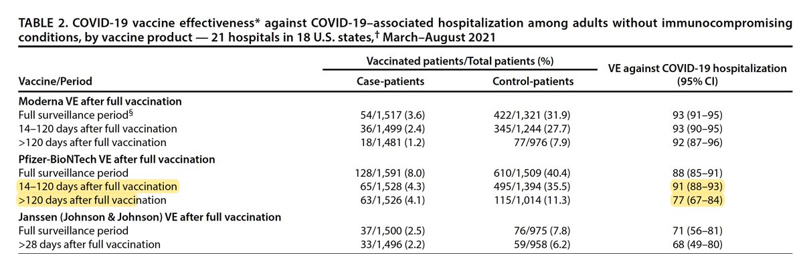</img></a>

---

<a href="https://twitter.com/erictopol/status/1439336871977312257" target="_blank" rel="noreferer">21:13 UCT</a>

Responses to the @US_FDA @Pfizer booster review
https://www.nytimes.com/2021/09/18/world/fda-panel-boosters.html
In alignment w/ @ashishkjha and @DrPaulOffit 
Would have liked to see a data-driven 60+ cutoff, but otherwise a very good outcome

