+++
title = "Tweets by Eric Topol Sept 19"
Summary = ""
tags = ["Twitter"]
category = "Twitter"
+++

---

<a href="https://twitter.com/erictopol/status/1439398078780375042" target="_blank" rel="noreferer">01:16 UCT</a>

These 3 6th grade girls deserve 2 awards, not just one for their impressive invention, but another for standing up to their school board for not requiring masks in order  to receive the first award 
https://www.11alive.com/article/news/health/coronavirus/cobb-county-6th-graders-skip-school-board-recognition-after-mask-request-was-denied/85-2db033ca-c4e6-4fe6-b368-ddc878646946

---

<a href="https://twitter.com/erictopol/status/1439408627534598149" target="_blank" rel="noreferer">01:58 UCT</a>

RT @PeterHotez: So here it is: Since April 100,000 unvaccinated Americans needlessly lost their lives to Covid despite widespread availabil…

---

<a href="https://twitter.com/erictopol/status/1439464229782781958" target="_blank" rel="noreferer">05:39 UCT</a>

Lowest US hospitalizations in a month👍 

<a href="E_oA6QRVQAMi6vq.jpg"  >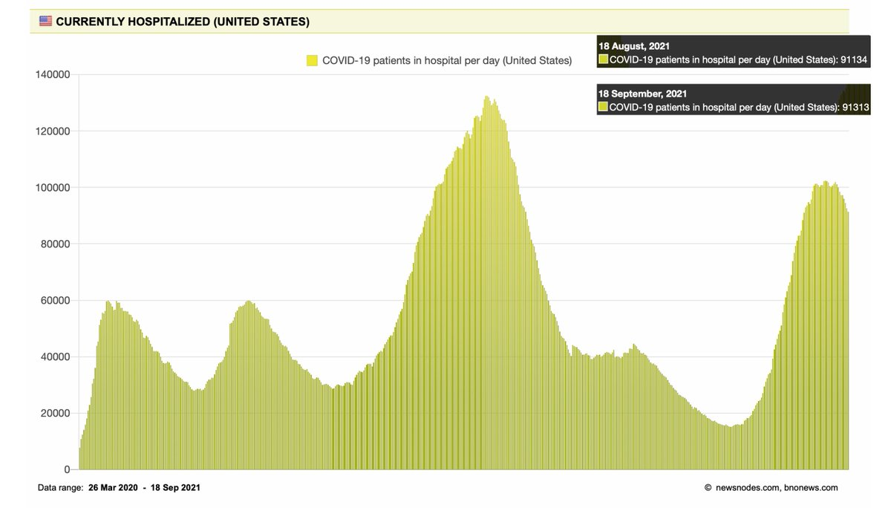</img></a>

---

<a href="https://twitter.com/erictopol/status/1439465336684744706" target="_blank" rel="noreferer">05:44 UCT</a>

@tmprowell @mgmglobal @sdut Not good, but I wonder what are the national data for HCWs claiming religious exemption for getting vaccinated? (isn't that the post you are alluding to?)

---

<a href="https://twitter.com/erictopol/status/1439593002490499073" target="_blank" rel="noreferer">14:11 UCT</a>

@MarionKoopmans @BogochIsaac @PHE_uk There are many other reports besides the more recent @PHE_uk that have demonstrated the rise of breakthroughs during the Delta wave, which of course is intertwined w/ the effect of time from vaccination
UCSD Health https://www.nejm.org/doi/full/10.1056/NEJMc2112981
US nursing homes
https://www.cdc.gov/mmwr/volumes/70/wr/mm7034e3.htm 

<a href="E_p1Cb9VIAQ1Oz-.jpg"  >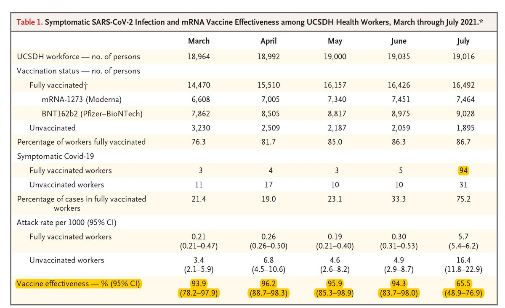</img></a><a href="E_p1EVQUYAgLoDk.jpg"  >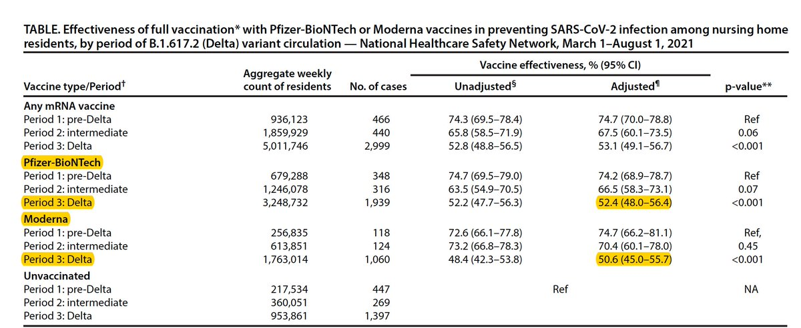</img></a>

---

<a href="https://twitter.com/erictopol/status/1439600816956968969" target="_blank" rel="noreferer">14:42 UCT</a>

Our covid times
@speedbumpcomic 

<a href="E_p9Ku6UUAcZMNz.jpg"  >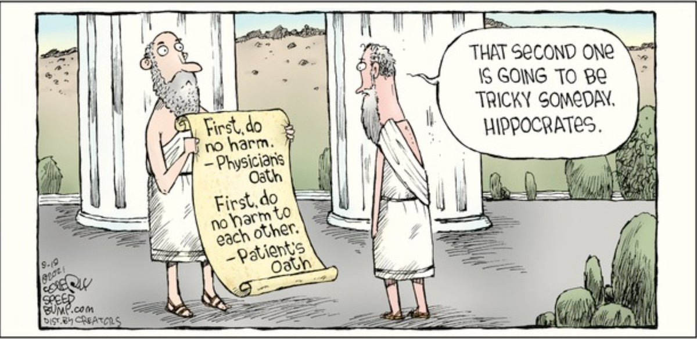</img></a>

---

<a href="https://twitter.com/erictopol/status/1439607177577066502" target="_blank" rel="noreferer">15:07 UCT</a>

How to convince parents that vaccinating their children is worthwhile and safe, including a review of relevant data on covid and vaccines in kids 
https://www.washingtonpost.com/outlook/2021/09/17/pediatrician-coronavirus-vaccine-kids/ by @HumanitiesMD 

<a href="E_qC-coVcAch1zU.jpg"  >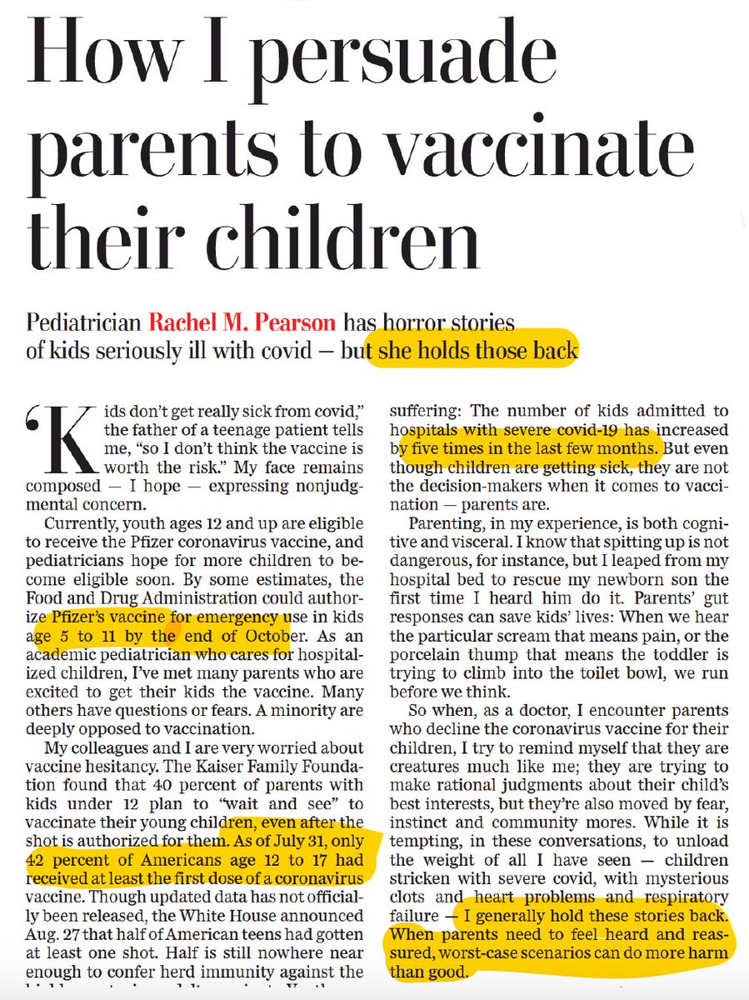</img></a><a href="E_qDASoUYAAR0ru.jpg"  >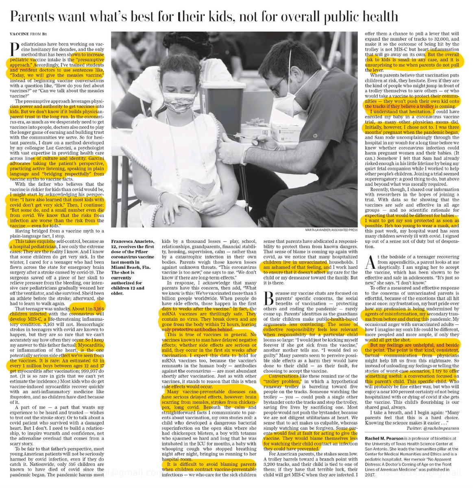</img></a>

---

<a href="https://twitter.com/erictopol/status/1439630765268946950" target="_blank" rel="noreferer">16:41 UCT</a>

Florida is even higher than Mississippi  https://twitter.com/therecount/status/1439582536540332035

<a href="E_qYRxIVQAM4DyU.jpg"  >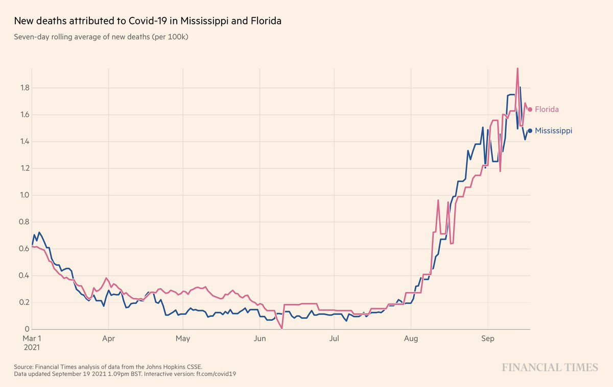</img></a>

---

<a href="https://twitter.com/erictopol/status/1439632569776050176" target="_blank" rel="noreferer">16:48 UCT</a>

@JamesSurowiecki Thanks.  I thought he was referring to the post-vaccination phase
Yes, correct. 

<a href="E_qZ7hLVcAccpJ0.jpg"  >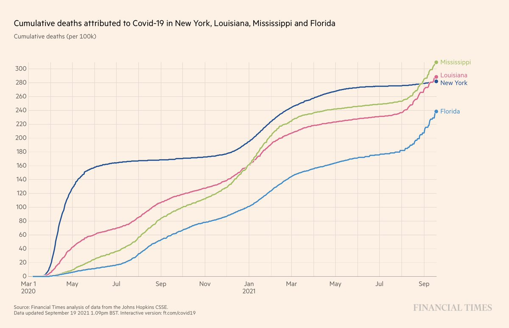</img></a>

---

<a href="https://twitter.com/erictopol/status/1439637137524023305" target="_blank" rel="noreferer">17:06 UCT</a>

An update on how far behind the US is on rapid tests
https://www.wsj.com/articles/limited-covid-19-rapid-testing-in-u-s-hurts-visibility-into-delta-wave-11631882131?mod=searchresults_pos1&page=1 by @Brabbott42 
https://www.statnews.com/2021/09/16/beyond-vaccinopia-larger-role-rapid-tests-fighting-covid/ @statnews @danieloran 

<a href="E_qdzUoVEAE509O.jpg"  >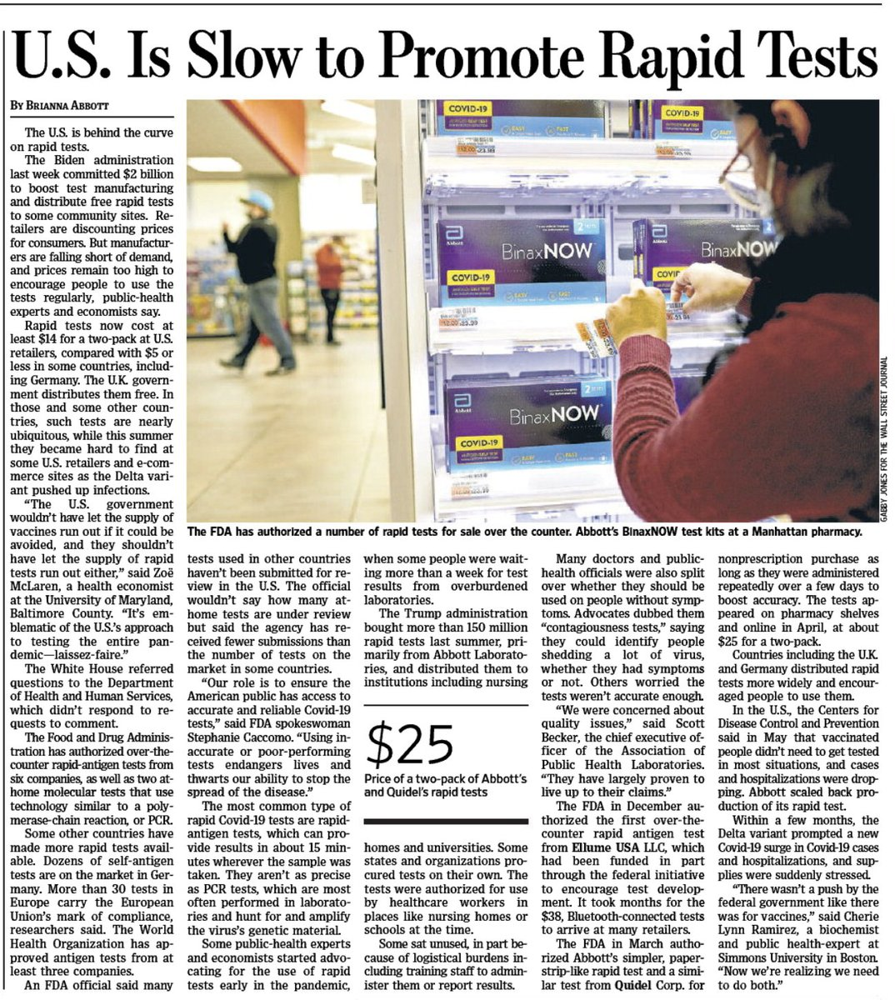</img></a><a href="E_qeIJ5VQAUHvzw.jpg"  >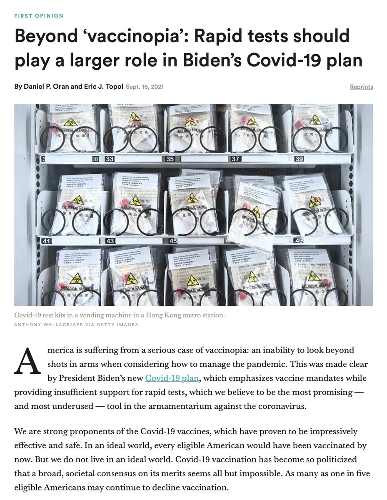</img></a>

---

<a href="https://twitter.com/erictopol/status/1439649776400678913" target="_blank" rel="noreferer">17:57 UCT</a>

And what is it about the immune response in children that gives them an edge?
by @LizSzabo @KHNews https://khn.org/news/article/scientists-examine-kids-unique-immune-systems-as-more-fall-victim-to-covid/ 

<a href="E_qpjunUUAIqx2J.jpg"  >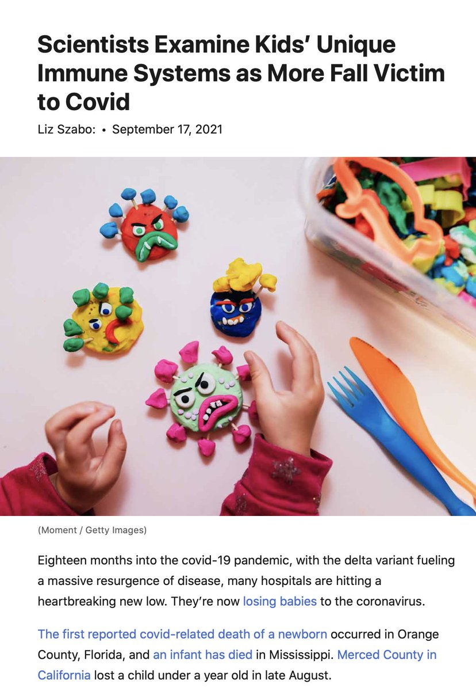</img></a>

---

<a href="https://twitter.com/erictopol/status/1439683237542989825" target="_blank" rel="noreferer">20:10 UCT</a>

The key role @JeremyFarrar has played in the pandemic, his new book SPIKE: the Virus vs the People, and its review by @doctor_oxford (who wanted him to do even more). We just interviewed Jeremy for @Medscape and it'll post this week.
https://www.thelancet.com/journals/lancet/article/PIIS0140-6736(21)02010-9/fulltext @TheLancet 

<a href="E_rH_S0VgAIMlo_.jpg"  >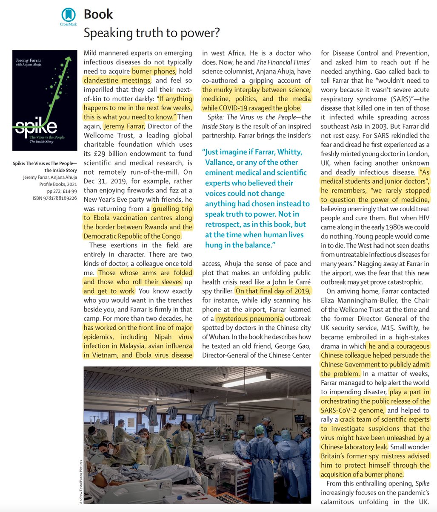</img></a><a href="E_rIBRZVkAASD90.jpg"  >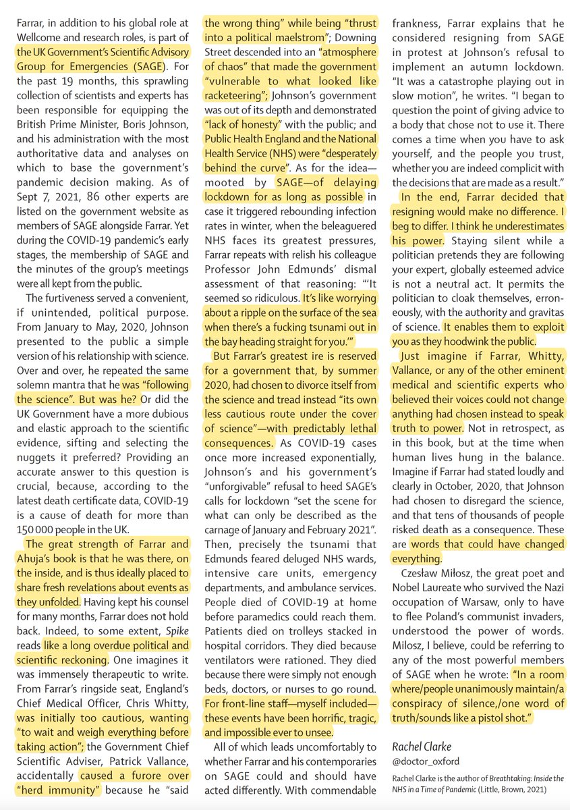</img></a>

---

<a href="https://twitter.com/erictopol/status/1439686817423396864" target="_blank" rel="noreferer">20:24 UCT</a>

@j_g_allen It's a great question, Joseph. Best paper to date @Nature https://www.nature.com/articles/s41586-021-03767-x Unfortunately, the loci identified to date (not fully characterized) have not been informative or led to actionability in order to prevent infection 

<a href="E_rKeLkUYAMTfxU.jpg"  >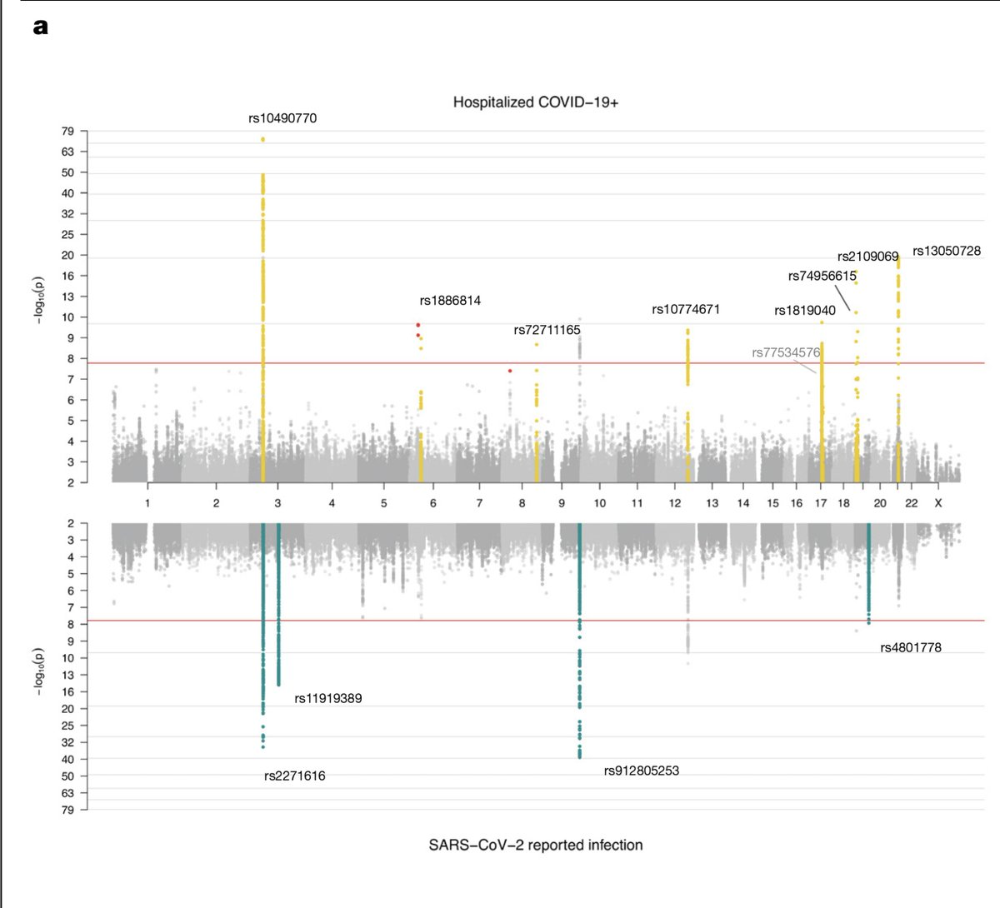</img></a>