+++
title = "Tweets by Eric Topol Sept 20"
Summary = ""
tags = ["Twitter"]
category = "Twitter"
+++

---

<a href="https://twitter.com/erictopol/status/1439749716812595201" target="_blank" rel="noreferer">00:34 UCT</a>

Delta can be daunting to contain.
The situation in Singapore with over 1,000 new cases today and yesterday, 80% of total population fully vaccinated, 1 of top 3 countries in the world, is an important indicator of the challenge. 

<a href="E_sCbSQVgAQ_JZ0.jpg"  >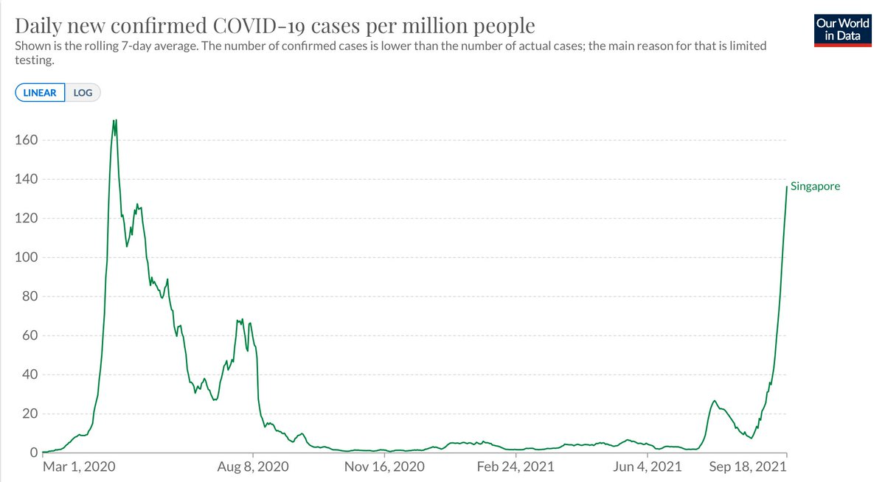</img></a><a href="E_sCdCpVIAArxdL.jpg"  >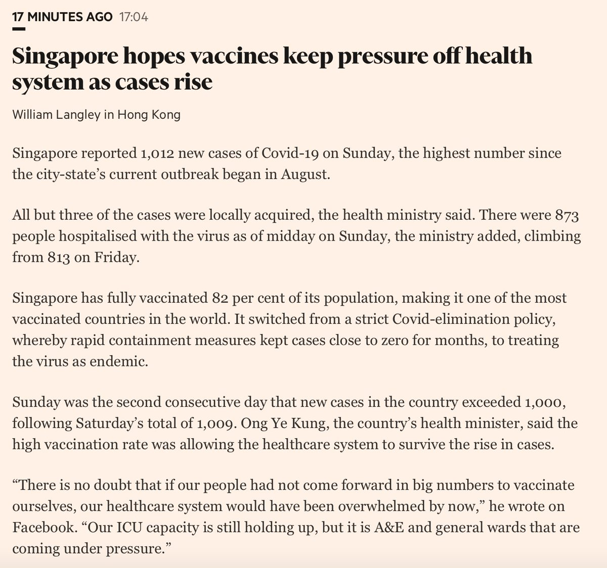</img></a>

---

<a href="https://twitter.com/erictopol/status/1439752534197866498" target="_blank" rel="noreferer">00:45 UCT</a>

Singapore’s booster campaign for people over the age of 60 began Tuesday, 14 September

---

<a href="https://twitter.com/erictopol/status/1439753968565948418" target="_blank" rel="noreferer">00:51 UCT</a>

The primary schools shifted to online https://www.reuters.com/business/healthcare-pharmaceuticals/singapore-reports-935-new-covid-19-cases-highest-since-april-last-year-2021-09-17/

---

<a href="https://twitter.com/erictopol/status/1439763614198493186" target="_blank" rel="noreferer">01:29 UCT</a>

Unlike Israel, Singapore was not a 1st mover, less proportion has waned, attained ~20 per cent points higher fully vaccinated population. Far less natural infection immunity
Israel: 100% Pfizer
Singapore: Pfizer/Moderna, AFAIK spacing by protocol
https:// http://ig.ft.com/coronavirus-vaccine-tracker/?areas=isr&areas=sgp&cumulative=1&doses=full&populationAdjusted=1 

<a href="E_sQWmsUUAQdabE.jpg"  >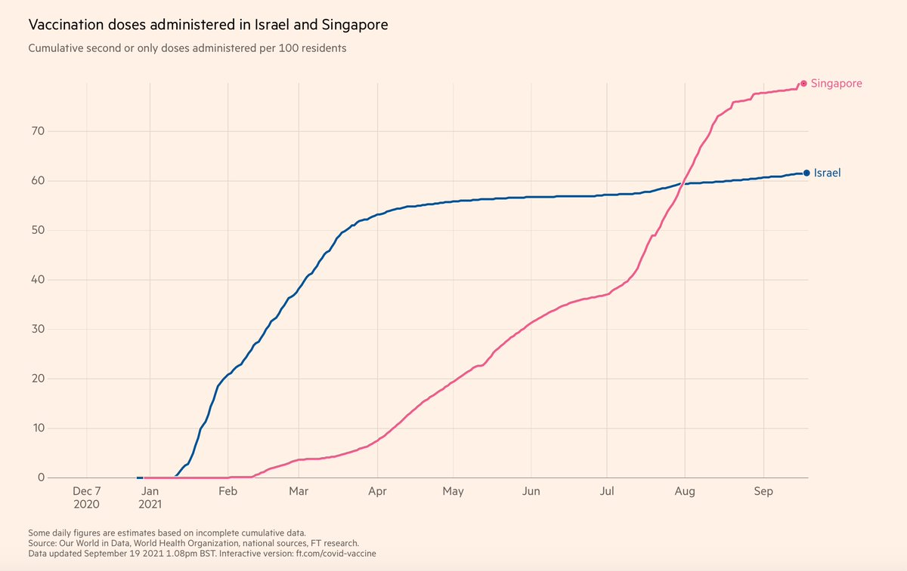</img></a>

---

<a href="https://twitter.com/erictopol/status/1439767286089351168" target="_blank" rel="noreferer">01:44 UCT</a>

This "test-to-stay" strategy is now being used in many US schools
https://www.nytimes.com/2021/09/19/health/coronavirus-school-quarantine-testing.html by @EmilyAnthes 
(not endorsed or recommended by @CDCgov)  https://twitter.com/EricTopol/status/1437942350727184385

<a href="E_sUVbwVQAQIJ70.jpg"  >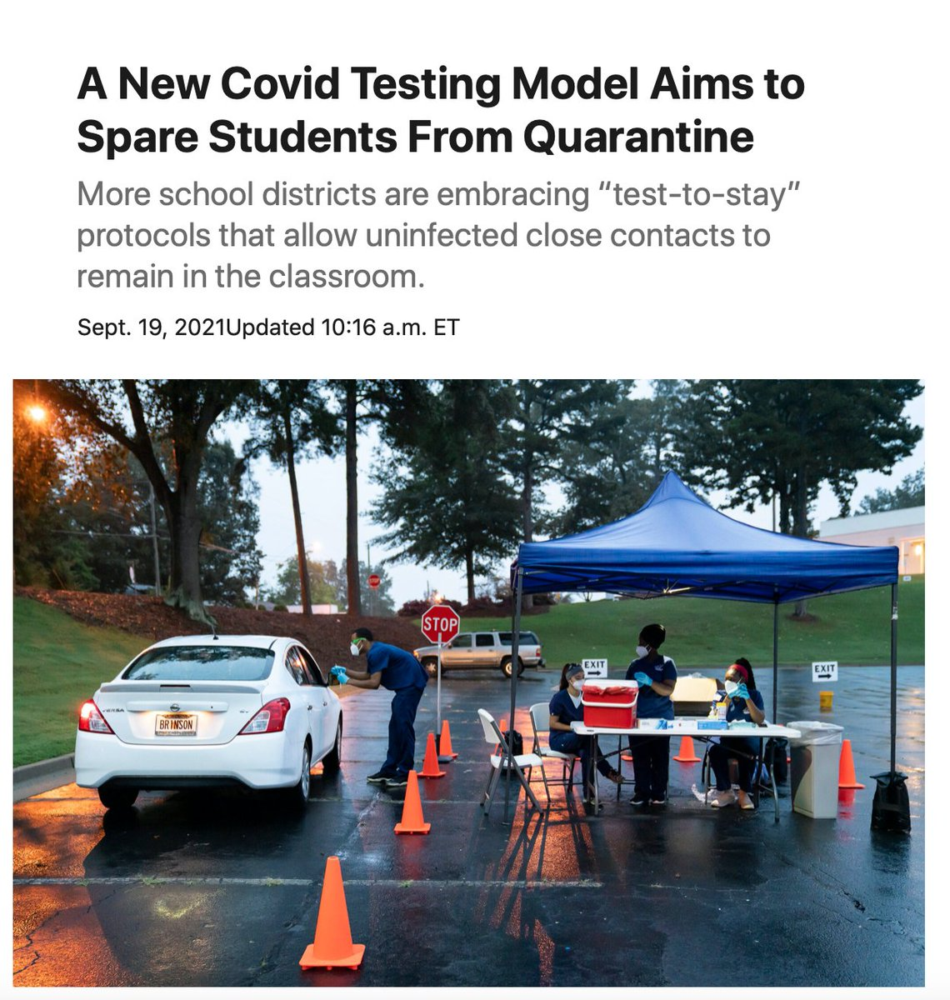</img></a>

---

<a href="https://twitter.com/erictopol/status/1439771092487327747" target="_blank" rel="noreferer">01:59 UCT</a>

The US has now fallen to #45 on the list of countries fully vaccinated and is in rapid further descent 
https://ig.ft.com/coronavirus-vaccine-tracker/?areas=gbr&areas=isr&areas=usa&areas=eue&areas=can&areas=chn&areas=ind&cumulative=1&doses=total&populationAdjusted=1 

<a href="E_sYFmlVIAcmi2t.jpg"  >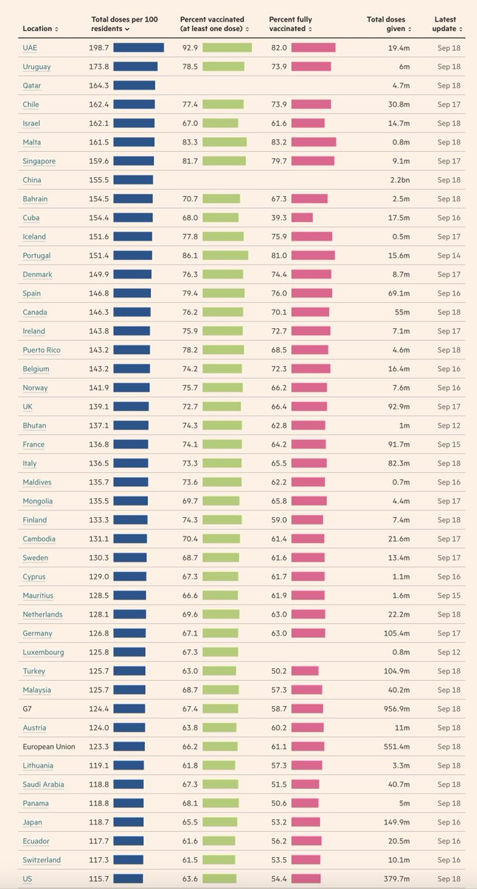</img></a>

---

<a href="https://twitter.com/erictopol/status/1439773102020325377" target="_blank" rel="noreferer">02:07 UCT</a>

Correction: That ranking lost is for % of 1 or more doses, not fully vaccinated.

---

<a href="https://twitter.com/erictopol/status/1439801273579040768" target="_blank" rel="noreferer">03:59 UCT</a>

Today falling below 90,000
Let's keep this going  https://twitter.com/EricTopol/status/1439464229782781958

<a href="E_sy8VpUUAc2I_p.jpg"  >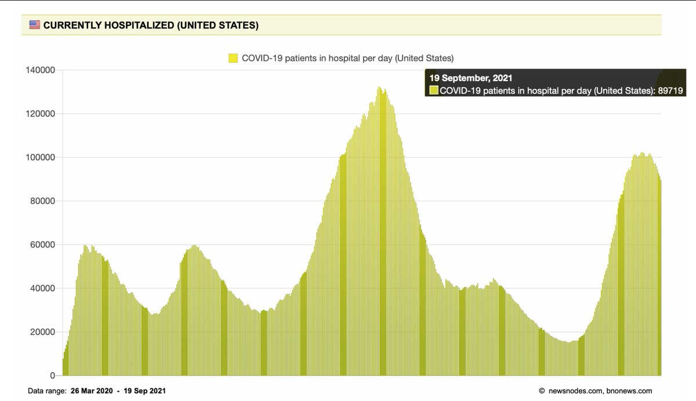</img></a>

---

<a href="https://twitter.com/erictopol/status/1439959238021763086" target="_blank" rel="noreferer">14:26 UCT</a>

Just published @Nature 
Why does Prior covid plus an mRNA vaccine provide such extraordinary protection?
"highly resistant SARS-CoV-2 polymutant spike, or diverse sarbecovirus spike proteins"
https://www.nature.com/articles/s41586-021-04005-0
and more on the path to a pan-sarbecovirus vaccine 

<a href="E_vC5zeVIAIkils.jpg"  >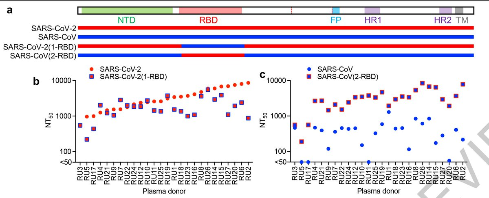</img></a>

---

<a href="https://twitter.com/erictopol/status/1439987814918098947" target="_blank" rel="noreferer">16:20 UCT</a>

I'm so glad to see that Pfizer has data to submit for their vaccine for 5-11 year olds. But any strong assertions about safety, such as for low incidence side-effects like myocarditis, cannot made from a trial of ~1500 children.

---

<a href="https://twitter.com/erictopol/status/1440012359007830017" target="_blank" rel="noreferer">17:57 UCT</a>

RT @Kerrisam379: @EricTopol Thanks for sharing! That’s my daughter 😊

---

<a href="https://twitter.com/erictopol/status/1440043372249378820" target="_blank" rel="noreferer">20:01 UCT</a>

How to cultivate a new #SARSCoV2 variant
https://www.pnas.org/content/118/39/e2114279118 @PNASNews by Emanuel Goldman @Rutgers_NJMS 

<a href="E_wPbRiVIAY44_w.png"  >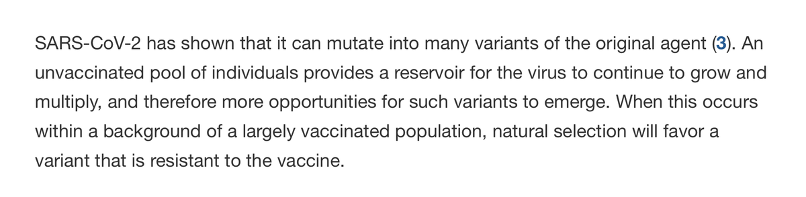</img></a><a href="E_wPeVAUYAIhhq7.jpg"  >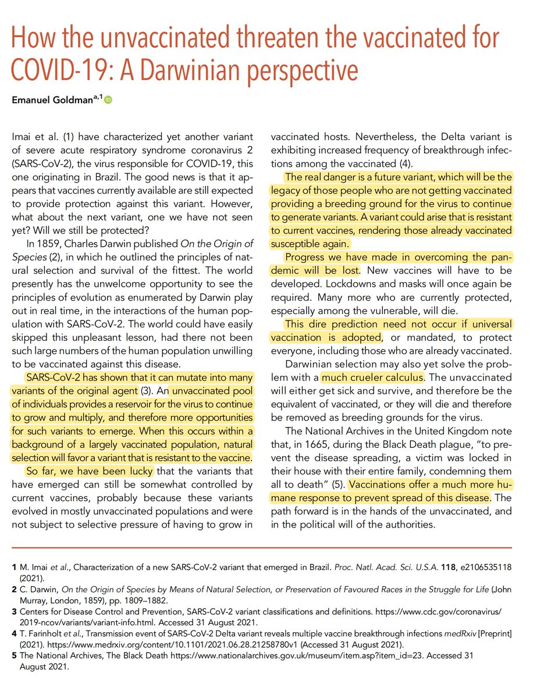</img></a>

---

<a href="https://twitter.com/erictopol/status/1440053924463988743" target="_blank" rel="noreferer">20:43 UCT</a>

This should not have happened.
https://www.ft.com/content/dee94219-a4c6-48f1-9aae-2bbcd11b3fa5
We🇺🇸have the tools in 2020-1 compared with 1918-9 to prevent fatalities, especially with vaccines that have reduced deaths (vs prior waves) by ~90% in many countries throughout the world 

<a href="E_wX9KtUcBAXRuw.jpg"  >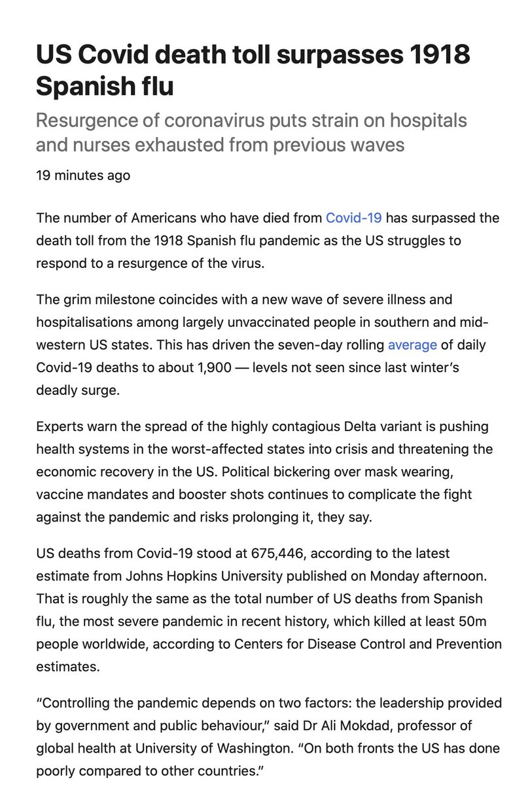</img></a><a href="E_wZH4wVEAUD-ix.jpg"  >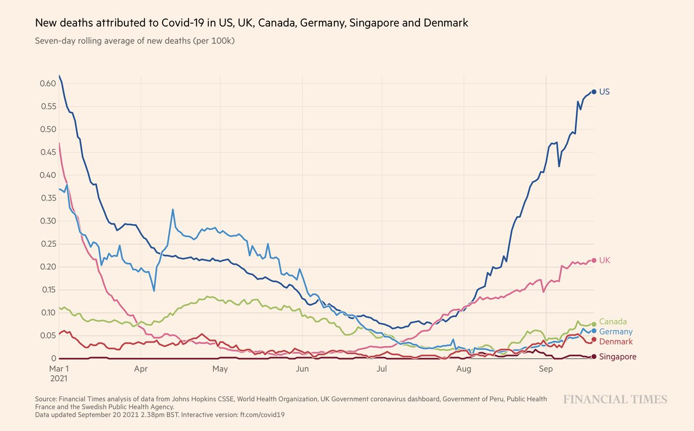</img></a>

---

<a href="https://twitter.com/erictopol/status/1440058642636558338" target="_blank" rel="noreferer">21:01 UCT</a>

More on surpassing the US death toll of the 1918 Pandemic https://www.bloomberg.com/news/articles/2021-09-20/covid-19-toll-in-u-s-is-about-to-surpass-1918-pandemic-deaths?sref=VvJhl47t by @kristenvbrown and @JonathanJLevin w/ my comments 

<a href="E_wdkDuVgAIb9p4.jpg"  >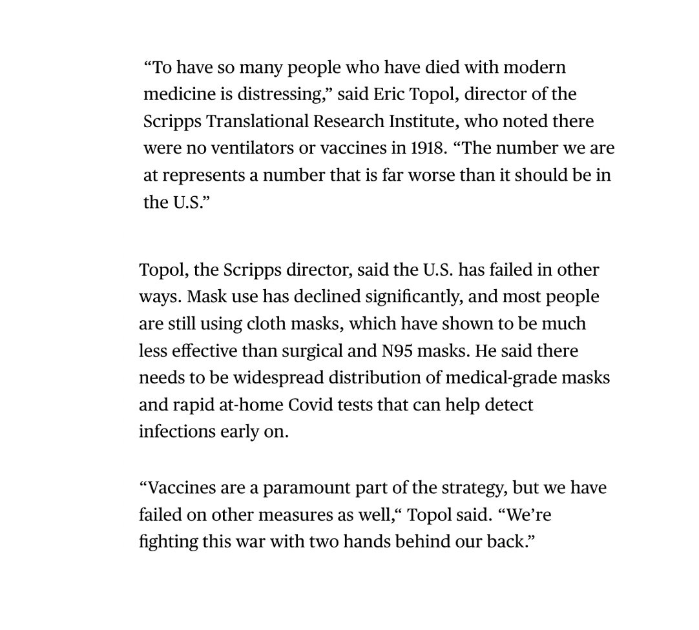</img></a>

---

<a href="https://twitter.com/erictopol/status/1440070890167816196" target="_blank" rel="noreferer">21:50 UCT</a>

The number of lost lives from the pandemic greatly underestimates the years of life lost for each person (avg 9-11 yrs) and their quality-adjusted life years, disproportionately worse for Black and Hispanic populations
https://www.acpjournals.org/doi/full/10.7326/M21-2239 @AnnalsofIM @JulianReif @AnnalsofIM 

<a href="E_wnYGpVIAYyysp.jpg"  >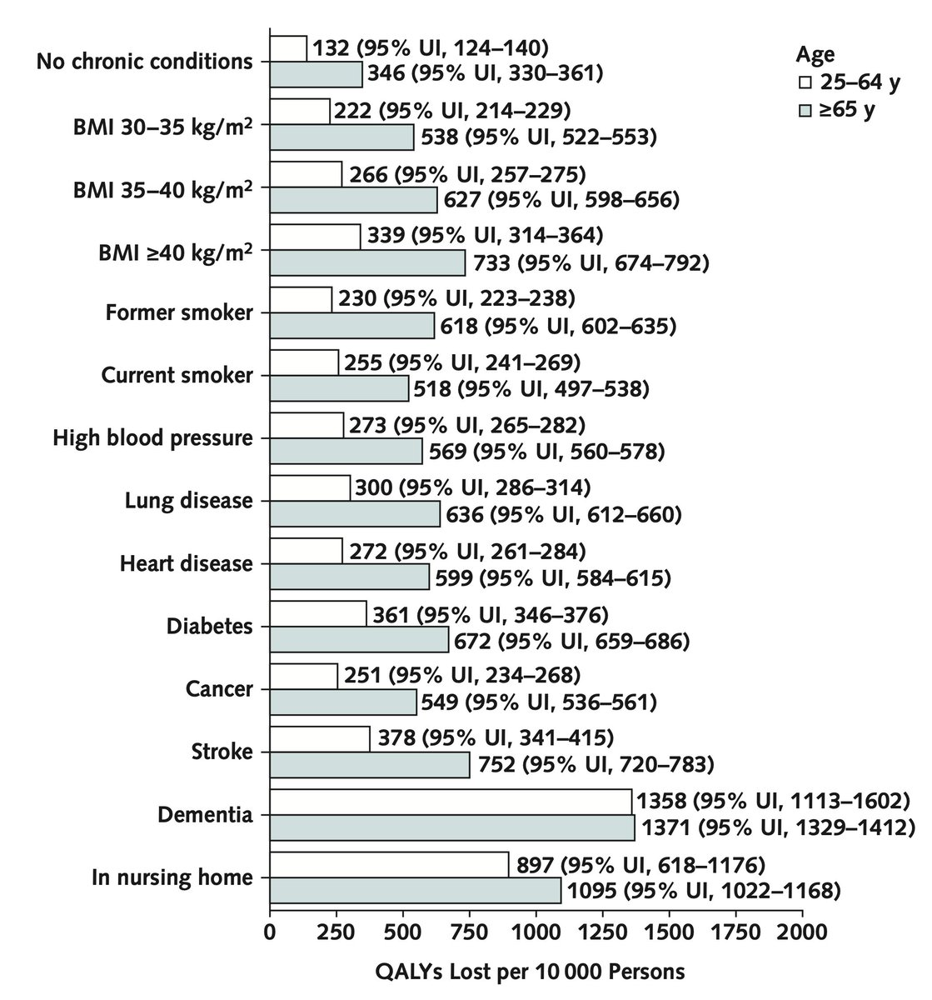</img></a><a href="E_wnZb6UYAU0_1w.jpg"  >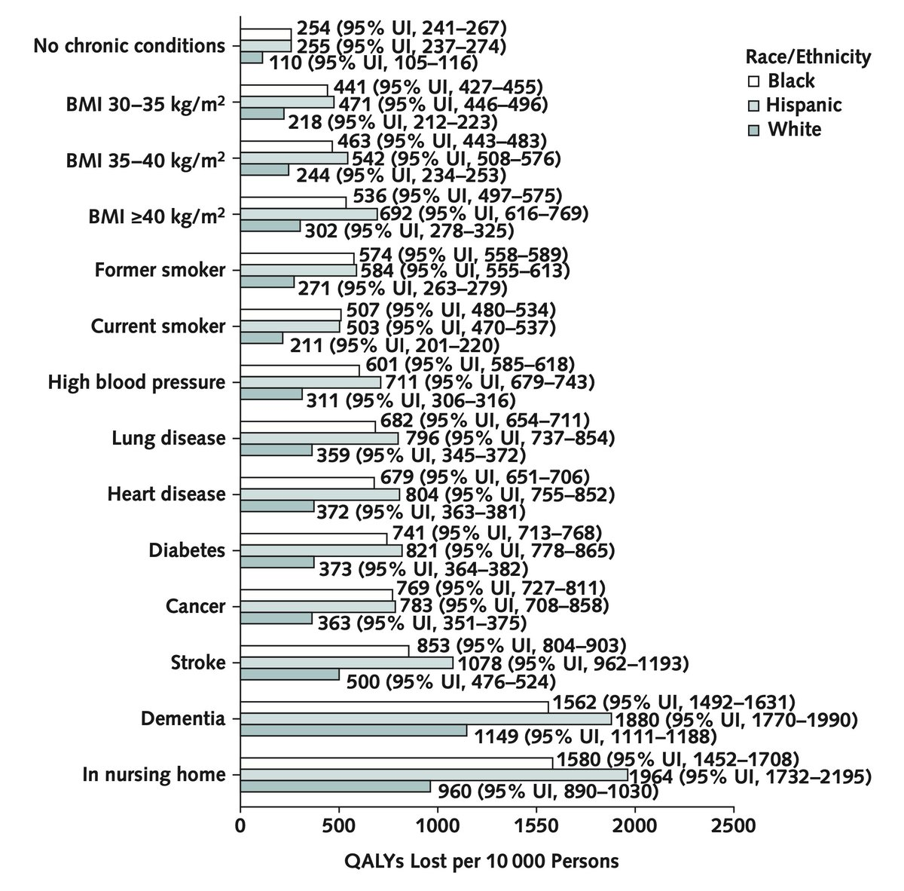</img></a>