+++
title = "Tweets by Eric Topol Sept 22"
Summary = ""
tags = ["Twitter"]
category = "Twitter"
+++

---

<a href="https://twitter.com/erictopol/status/1440484483434618881" target="_blank" rel="noreferer">01:13 UCT</a>

California gets to the lowest cases/capita in the US 👍
Still a ways to go to get to pre-Delta levels and containment 

<a href="E_2guArUcAwpET8.jpg"  >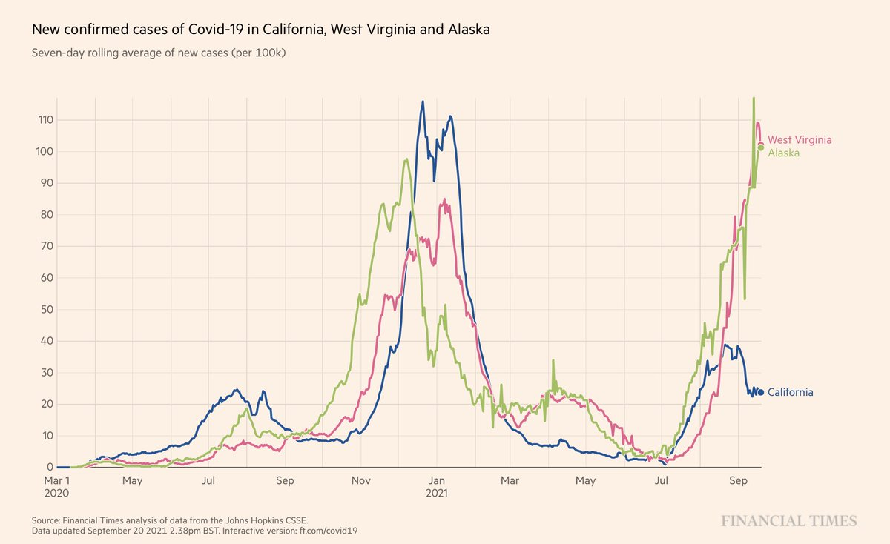</img></a><a href="E_2gvbGVkAcIS2A.jpg"  >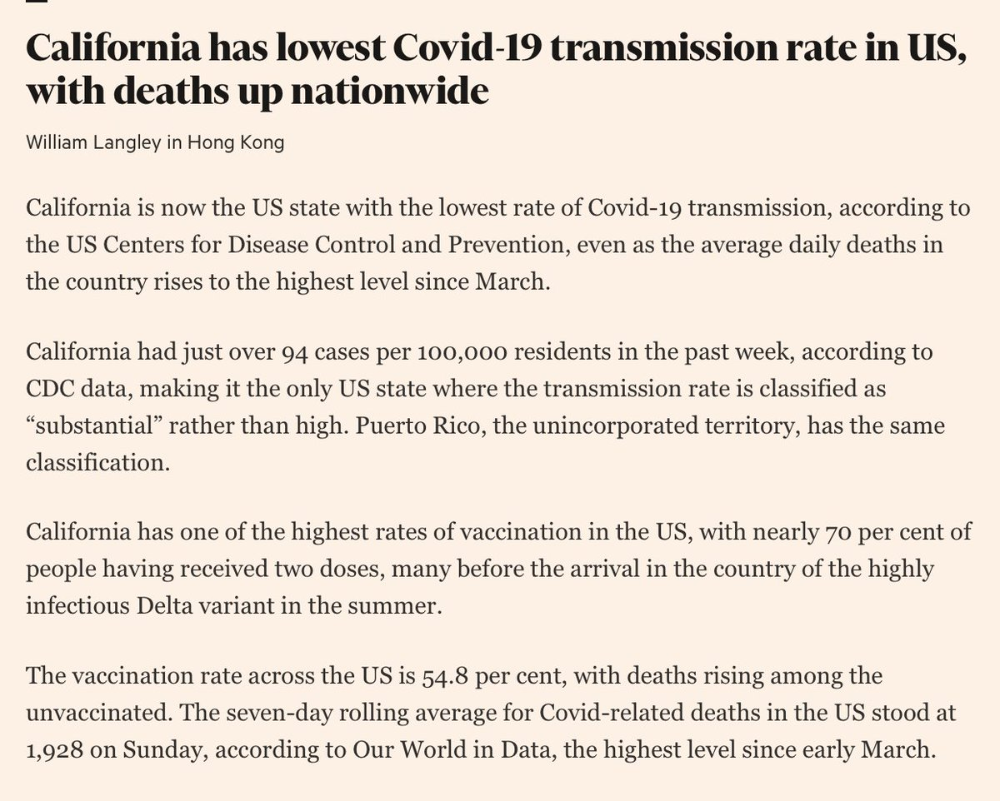</img></a>

---

<a href="https://twitter.com/erictopol/status/1440490316897738752" target="_blank" rel="noreferer">01:37 UCT</a>

The benefit of long spacing of Pfizer vaccine to 16-weeks for an immune response comparable to prior Covid + 1-dose vaccine, with assessment vs Delta and other major variants
 https://www.medrxiv.org/content/10.1101/2021.09.17.21263532v1 

<a href="E_2mF-5UcAQLCjl.png"  >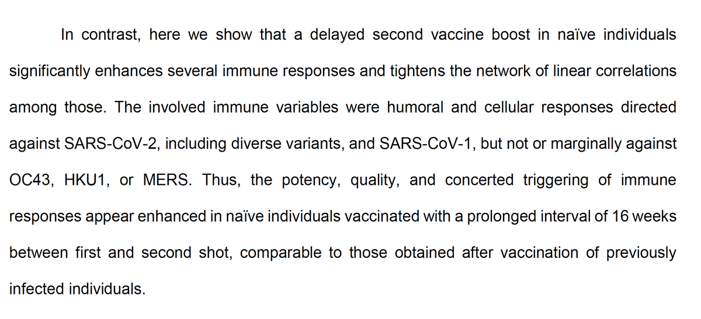</img></a><a href="E_2l_zaVIAQM0Y-.jpg"  >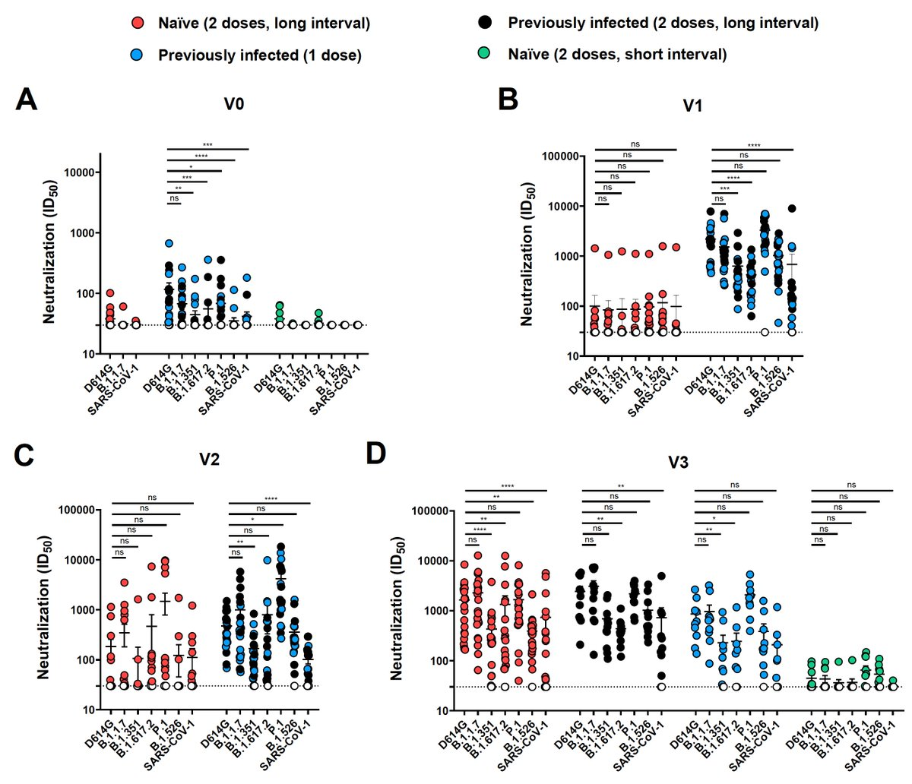</img></a>

---

<a href="https://twitter.com/erictopol/status/1440506136386408451" target="_blank" rel="noreferer">02:40 UCT</a>

New large dataset of US Medicare (age 65+) population subgroup: 2.7 million Pfizer; 2.9 million Moderna vaccinated, w/ ~30,000 breakthrough hospitalizations, via claims 🧵main findings
@Humetrix  https://www.humetrix.com/powerpoint-vaccine.html

---

<a href="https://twitter.com/erictopol/status/1440506142212321280" target="_blank" rel="noreferer">02:40 UCT</a>

1. Definite waning of protection vs hospitalization for those 5-6 months out from vaccination  (odd ratio 2.5X at 6 months) 

<a href="E_2tESbVgAgSzF3.jpg"  >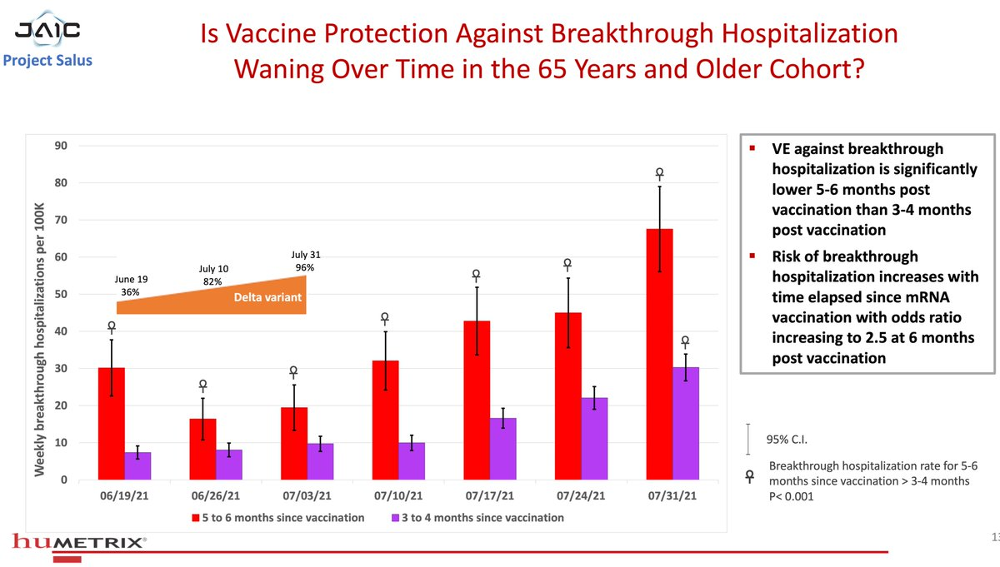</img></a>

---

<a href="https://twitter.com/erictopol/status/1440506149095100430" target="_blank" rel="noreferer">02:40 UCT</a>

2. No significant difference of waning for Pfizer vs Moderna for protection from breakthrough infections 

<a href="E_2tw2xVIAQjhhI.jpg"  >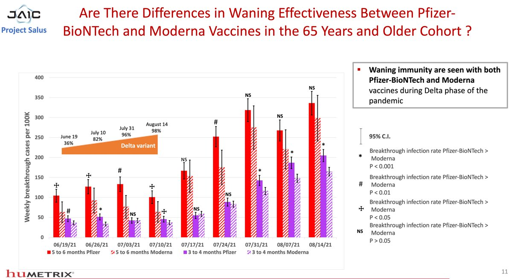</img></a>

---

<a href="https://twitter.com/erictopol/status/1440506155952861193" target="_blank" rel="noreferer">02:40 UCT</a>

3. Breakthrough hospitalizations most in oldest age groups (cumulative 2.6%, of those with infection 20% required hospitalization, 34% ICU) 

<a href="E_2uIViUcAkCb7H.jpg"  >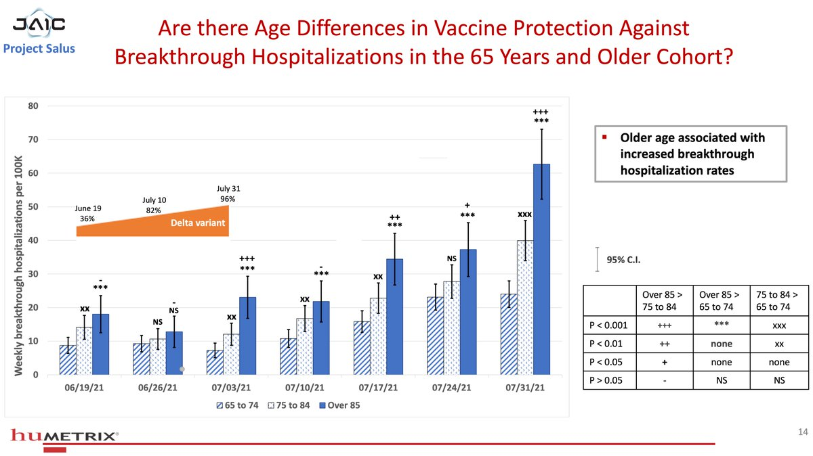</img></a>

---

<a href="https://twitter.com/erictopol/status/1440506158582689798" target="_blank" rel="noreferer">02:40 UCT</a>

4. Crude vaccine effectiveness vs hospitalization = 62%
This may be an underestimate due to this Medicare subgroup with high comorbidity and imputation for unvaccinated via CDC data sources

---

<a href="https://twitter.com/erictopol/status/1440506163246743562" target="_blank" rel="noreferer">02:40 UCT</a>

5. The variables associated with breakthrough hospitalizations
Most notable: Prior covid + vaccine marked protection 

<a href="E_2u_8ZVcAAfjc_.jpg"  >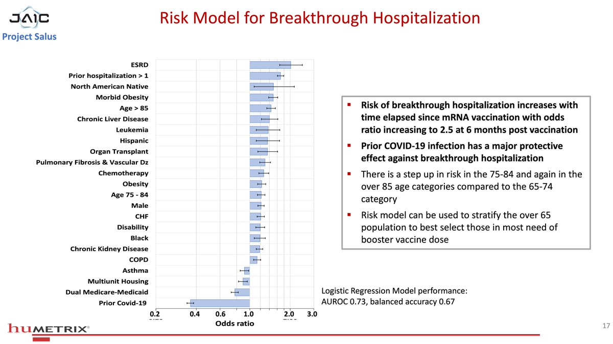</img></a>

---

<a href="https://twitter.com/erictopol/status/1440511101918072838" target="_blank" rel="noreferer">02:59 UCT</a>

As far as I know, this is the largest dataset of vaccinated Americans for breakthrough hospitalizations, w/ data several months out from getting vaccinated, multiple weeks into the 4th Delta wave (with the caveats of an insurance claims resource)

---

<a href="https://twitter.com/erictopol/status/1440516869241278471" target="_blank" rel="noreferer">03:22 UCT</a>

@hjreid @magneticanisot1 That is per week, not per day

---

<a href="https://twitter.com/erictopol/status/1440665424769679368" target="_blank" rel="noreferer">13:12 UCT</a>

This surge in Singapore may be a harbinger of a positive future scenario when a country has 80% of their total population vaccinated: 98% of &gt;13,000 cases were asymptomatic or mild 

<a href="E_5FeKVUYAgdFSc.jpg"  >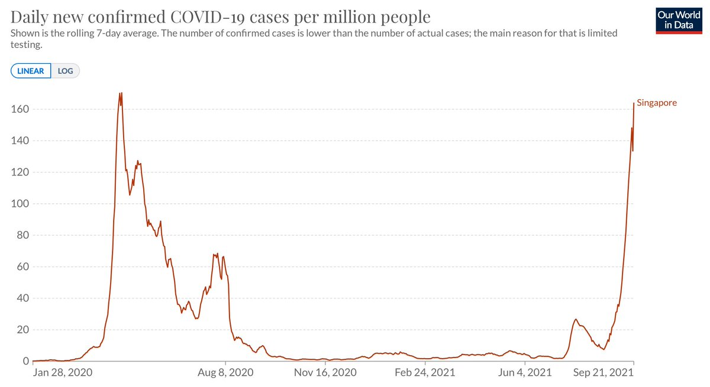</img></a><a href="E_5FgAjUYAQn26O.jpg"  >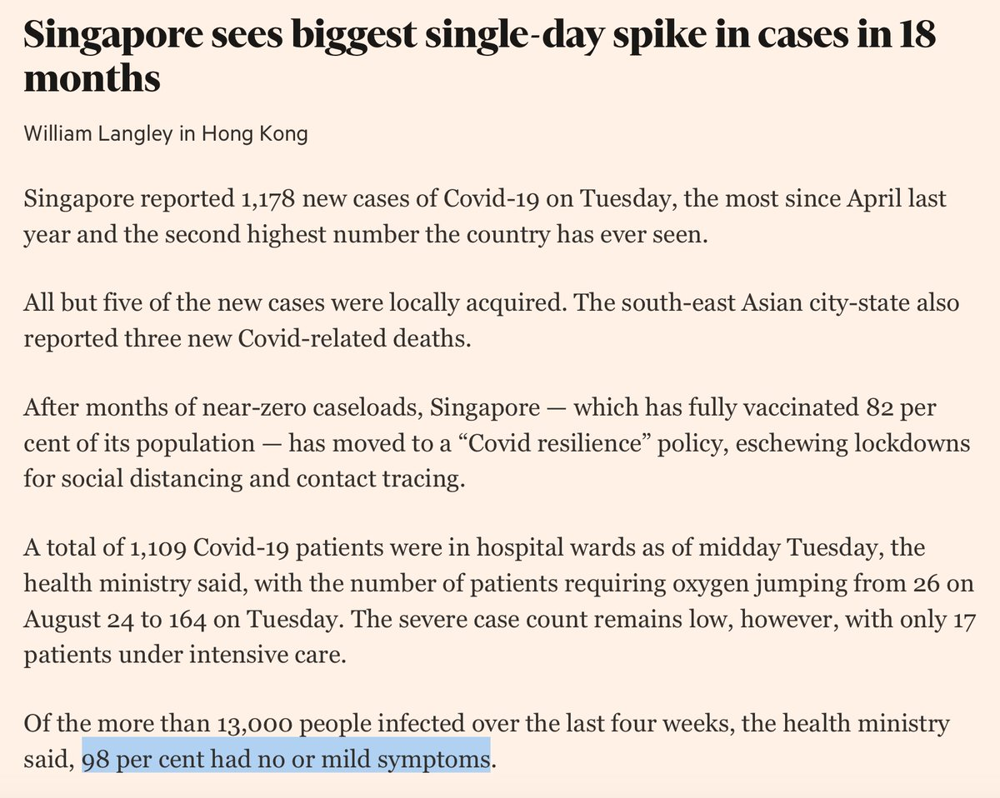</img></a>

---

<a href="https://twitter.com/erictopol/status/1440666919615361028" target="_blank" rel="noreferer">13:18 UCT</a>

I could have started the thread with BREAKING but I've never done that; these data have not been previously made public

---

<a href="https://twitter.com/erictopol/status/1440668295317770248" target="_blank" rel="noreferer">13:24 UCT</a>

@eliowa Right, it's daunting as previously noted.
https://twitter.com/EricTopol/status/1439749716812595201

---

<a href="https://twitter.com/erictopol/status/1440676871746711560" target="_blank" rel="noreferer">13:58 UCT</a>

Some progress on the global vaccination mission
https://www.washingtonpost.com/opinions/2021/09/22/zients-blinken-covid-vaccines-america-world/ by 
@JeffreyZients and @AnthonyBlinken1 @PostOpinions 
https://www.ft.com/content/f0bf2959-2c2a-4085-ba5d-ab445de72c7c @FT @donatopmancini @JamieSmythF 
Several more billion doses needed ASAP for LMIC and especially Africa 

<a href="E_5PbJoUcBYR4or.jpg"  >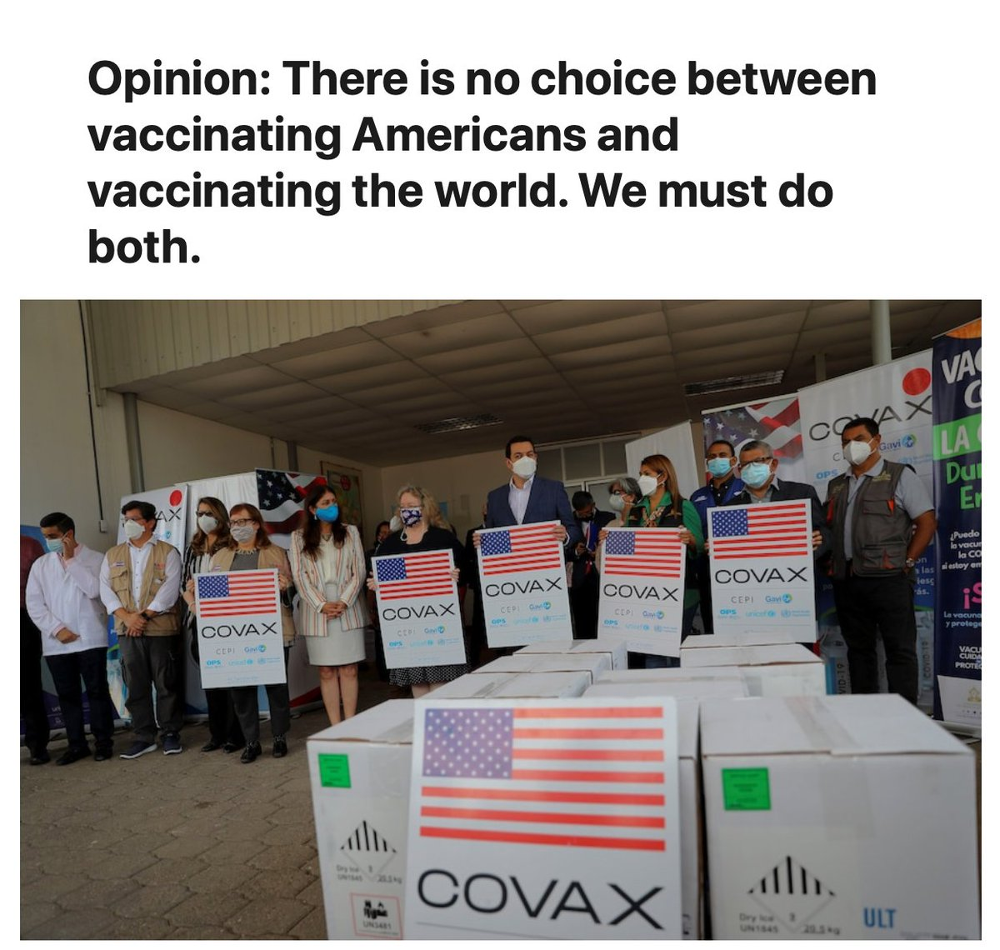</img></a><a href="E_5PdCKVkAISx76.png"  >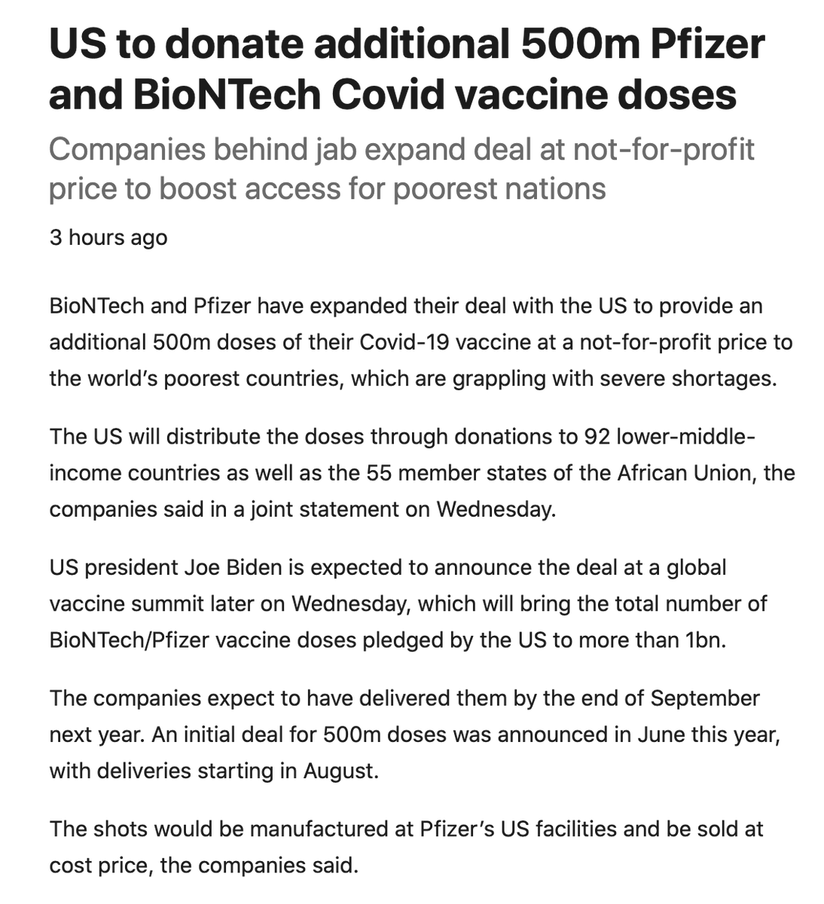</img></a>

---

<a href="https://twitter.com/erictopol/status/1440684596450902020" target="_blank" rel="noreferer">14:29 UCT</a>

More holes in the Ivermectin story: multiple studies that "contain impossible numbers in their results", the 2 most positive studies have been withdrawn and more to come, need for individual patient data
https://www.nature.com/articles/s41591-021-01535-y @NatureMedicine 

<a href="E_5W2teUUAYJpYP.jpg"  >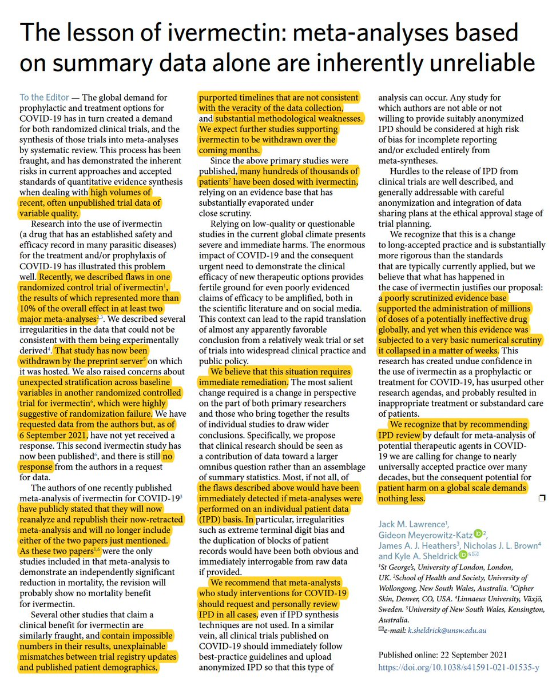</img></a>

---

<a href="https://twitter.com/erictopol/status/1440687378285219860" target="_blank" rel="noreferer">14:40 UCT</a>

On the waning impact of @moderna_tx vaccination over time: people who got their vaccination earlier (e column) had less protection than more recent (p column) in the US Delta wave https://www.medrxiv.org/content/10.1101/2021.09.17.21263624v1 

<a href="E_5ZSqNVQAsyzSR.jpg"  >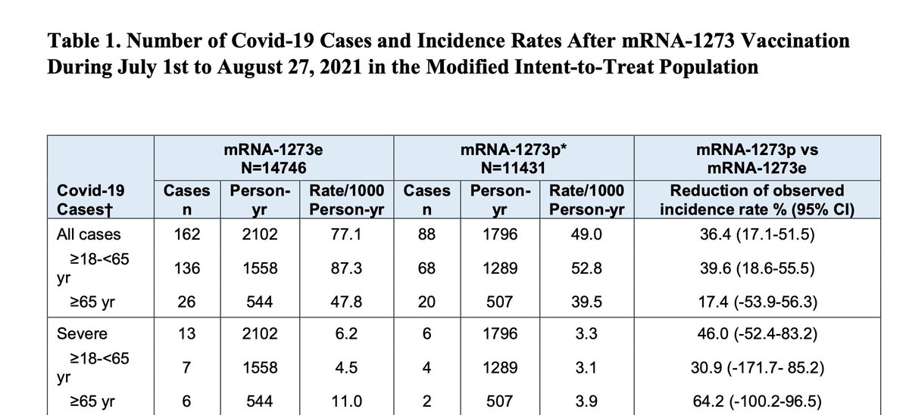</img></a>

---

<a href="https://twitter.com/erictopol/status/1440696717020581903" target="_blank" rel="noreferer">15:17 UCT</a>

Does Moderna have an edge over Pfizer?
https://www.nytimes.com/2021/09/22/health/covid-moderna-pfizer-vaccines.html @apoorva_nyc 
New data from ~148,000 breakthrough cases in 5.6 M 65+ year olds shows both wane, but more favorable trend seen with Moderna throughout
https://twitter.com/EricTopol/status/1440506136386408451 

<a href="E_5g4xxUYAI6Gfc.jpg"  >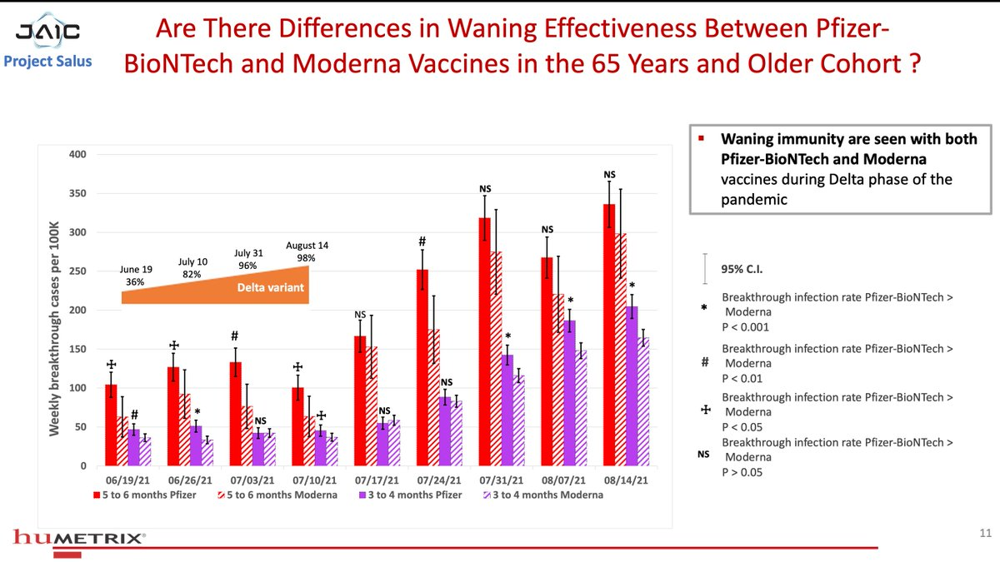</img></a>

---

<a href="https://twitter.com/erictopol/status/1440712294359437326" target="_blank" rel="noreferer">16:19 UCT</a>

Summary of the evidence to support use of Ivermectin for any covid-related indication 

<a href="E_5wLRlUYAUx5UC.png"  ></img></a>

---

<a href="https://twitter.com/erictopol/status/1440731930513661952" target="_blank" rel="noreferer">17:37 UCT</a>

Comparing the current best and worst in the US by cases/population: Puerto Rico vs Alaska
Cases/100,000: 117 vs 9
Fully vaccinated:  65% vs 49%
Hospitalizations/100,000: 9 vs 29
Deaths/100,000 equal 0.27
(lag anticipated with recent AK surge) 

<a href="E_6AiPeVQAMBxyV.jpg"  >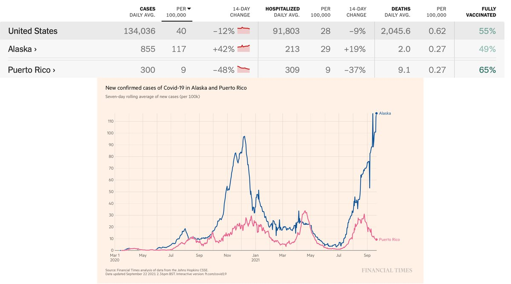</img></a>

---

<a href="https://twitter.com/erictopol/status/1440736270657867785" target="_blank" rel="noreferer">17:54 UCT</a>

Just published @Nature 
May represent the most important successful application of #AI in the pandemic (only a few are on the list) https://www.nature.com/articles/s41586-021-04014-z Reinforcement learning for efficient testing at the Greece border 

<a href="E_6EZdDVUAUz3zc.jpg"  >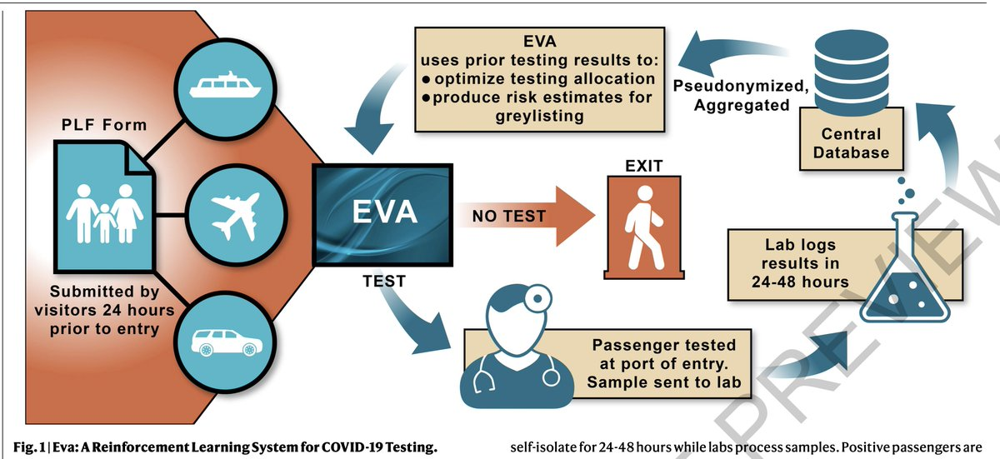</img></a><a href="E_6EbXEVcAc-Dqp.jpg"  >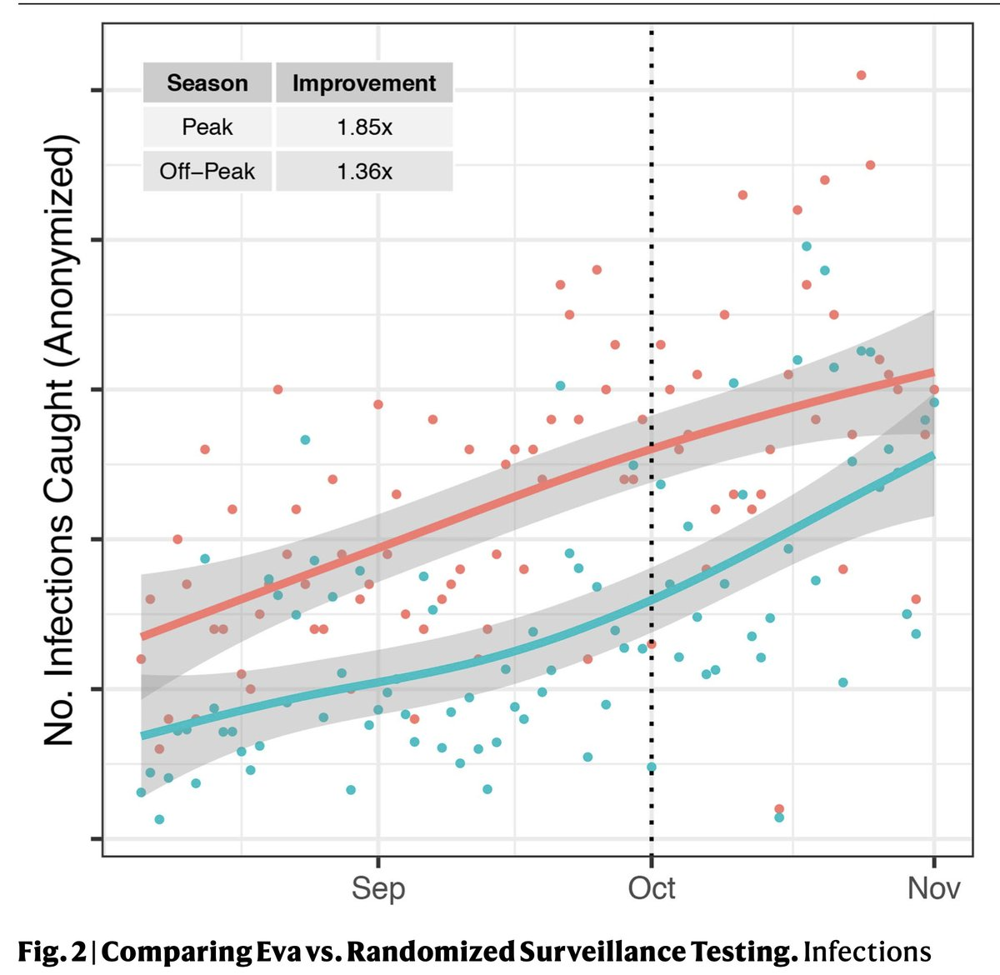</img></a>

---

<a href="https://twitter.com/erictopol/status/1440736277679140867" target="_blank" rel="noreferer">17:54 UCT</a>

Accompanying editorial frames the significance of this algorithm and contextual issues https://www.nature.com/articles/d41586-021-02554-y
@nature 

<a href="E_6FmOWVQAMY2hn.jpg"  >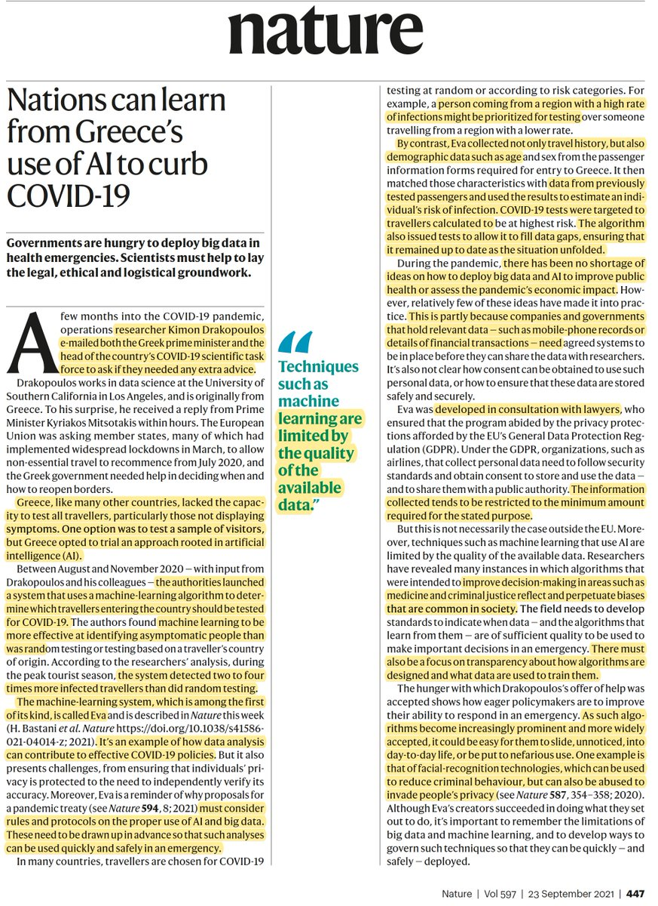</img></a>

---

<a href="https://twitter.com/erictopol/status/1440744922668158982" target="_blank" rel="noreferer">18:28 UCT</a>

"will be remembered as one of the best examples of using data in the fight against COVID-19"
https://www.nature.com/articles/d41586-021-02556-w @NatureNV by @oziadias
Agree 💯 

<a href="E_6NhIFVEAU9srS.jpg"  >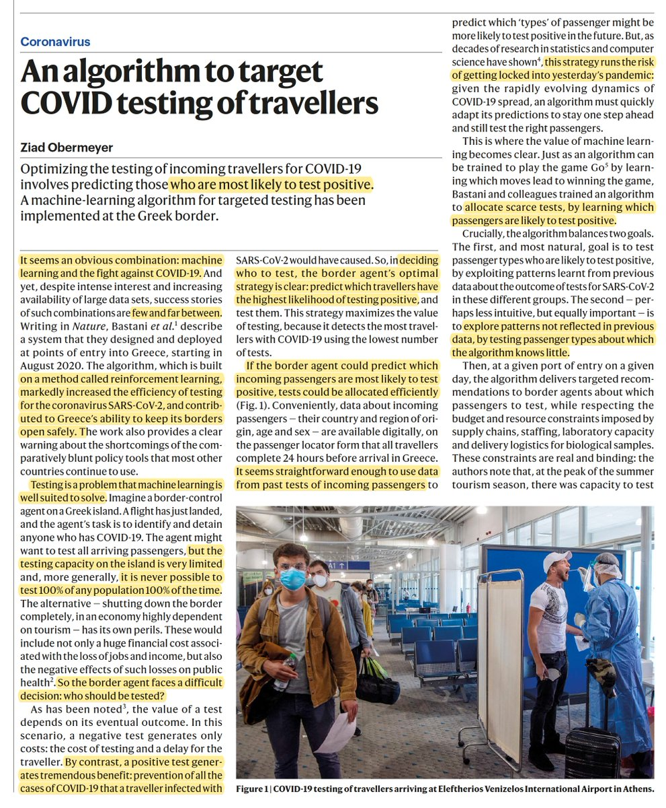</img></a><a href="E_6NimJUcAcppKZ.jpg"  >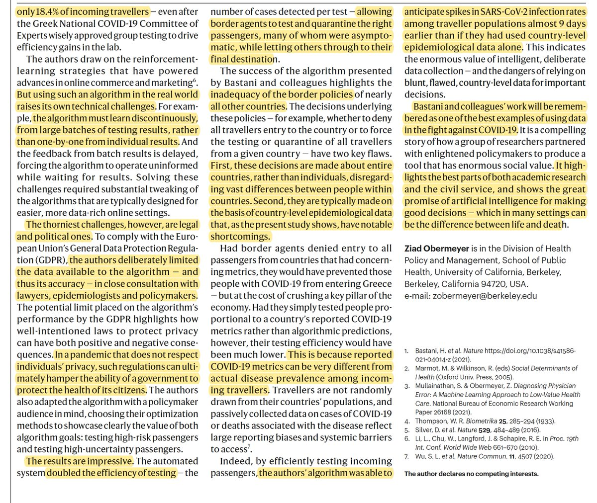</img></a>

---

<a href="https://twitter.com/erictopol/status/1440762043468894217" target="_blank" rel="noreferer">19:36 UCT</a>

Further evidence of Moderna edge vs Pfizer in kidney transplant patients and those undergoing dialysis
https://www.medrxiv.org/content/10.1101/2021.09.15.21263320v1 with significantly higher mean antibody titer response (Figure) and seroconversion rates (65% vs 35% after 1st dose, respectively) 

<a href="E_6cPetVIAgLX0f.png"  >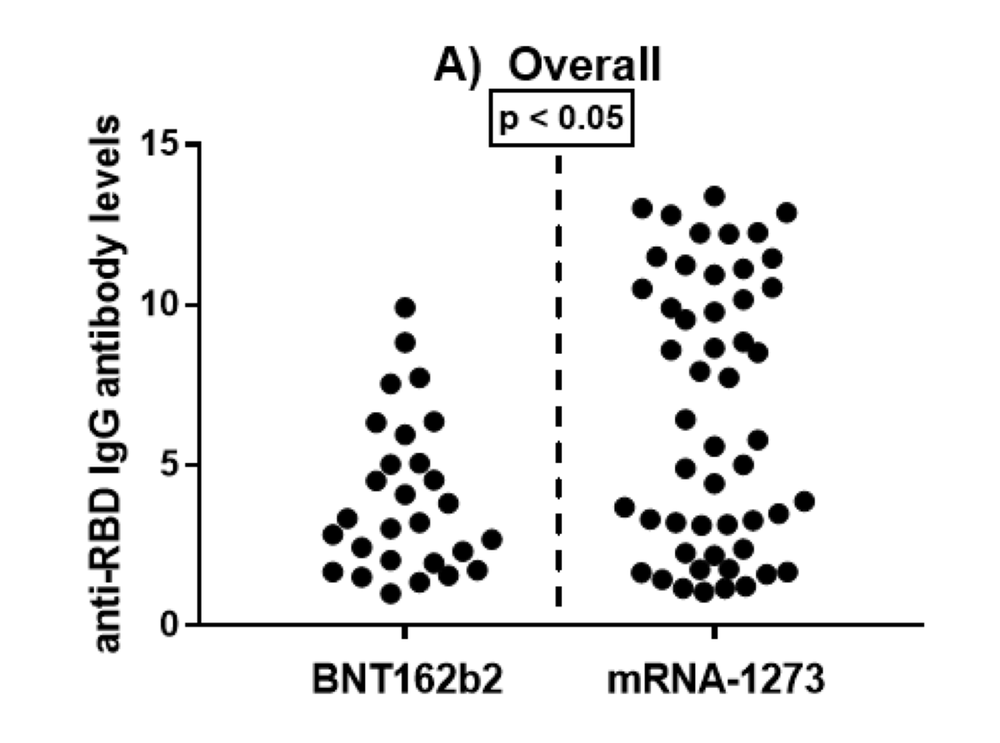</img></a>

---

<a href="https://twitter.com/erictopol/status/1440783180915613699" target="_blank" rel="noreferer">21:00 UCT</a>

New reports @NEJM today support higher vaccine effectiveness (VE) of Moderna over Pfizer, with both providing strong level of protection
1. vs Symptomatic infection in health care personnel
96.3 vs 88.8% (see Table for 95% CI, slight overlap)
 http://www.nejm.org/doi/full/10.1056/NEJMoa2106599 

<a href="E_6tnYCVQAAQ-pf.jpg"  >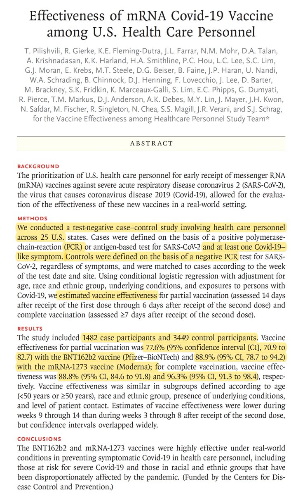</img></a><a href="E_6tpOgUUAIRfsN.jpg"  >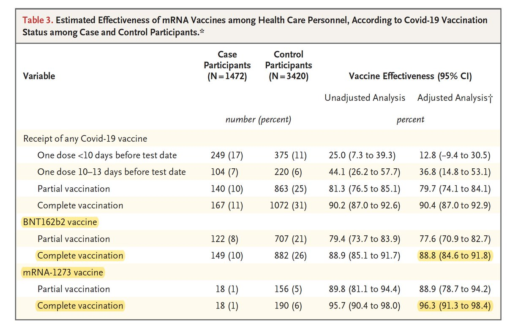</img></a>

---

<a href="https://twitter.com/erictopol/status/1440783187924291584" target="_blank" rel="noreferer">21:00 UCT</a>

2. ~6-Month Follow-Up of Moderna pivotal trial
http://www.nejm.org/doi/full/10.1056/NEJMoa2113017
VE 98.2% vs severe disease (here VE = vaccine efficacy, with a placebo control) 

<a href="E_6t9n1UUAgdwfD.jpg"  >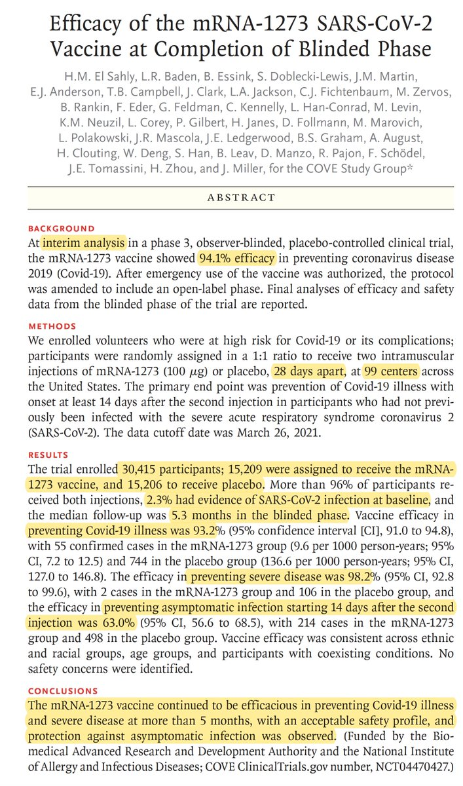</img></a><a href="E_6t_zZUYAIvl89.jpg"  >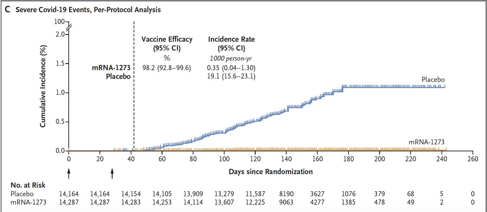</img></a>

---

<a href="https://twitter.com/erictopol/status/1440783193473355776" target="_blank" rel="noreferer">21:00 UCT</a>

Difference between protection, VE for symptomatic infections during extended follow-up of Pfizer and Moderna 
Pfizer data https://www.nejm.org/doi/full/10.1056/NEJMoa2110345 

<a href="E_6uX67UUAAiZmX.jpg"  >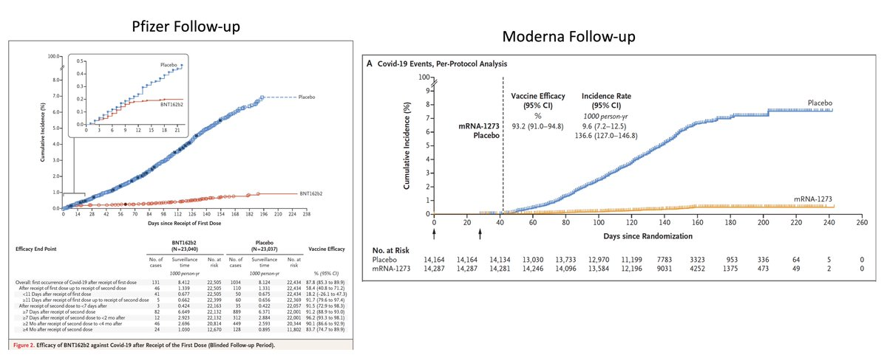</img></a>

---

<a href="https://twitter.com/erictopol/status/1440813400192212997" target="_blank" rel="noreferer">23:00 UCT</a>

If there was one person to ask our present predicament and where we're headed in the pandemic, @JeremyFarrar might indeed be the best suited. Here's our conversation with him  https://www.medscape.com/viewarticle/957150
w/ @cuttingforstone @Medscape w/ transcript

---

<a href="https://twitter.com/erictopol/status/1440824461037477897" target="_blank" rel="noreferer">23:44 UCT</a>

The extraordinary success of the Israeli's vaccination campaign prior to its Delta wave with reduction of infections, hospitalizations, deaths (actual vs projected
https://www.thelancet.com/journals/laninf/article/PIIS1473-3099(21)00566-1/fulltext @TheLancetInfDis @IsraelMOH 

<a href="E_7V7R2VcAQPYFq.jpg"  >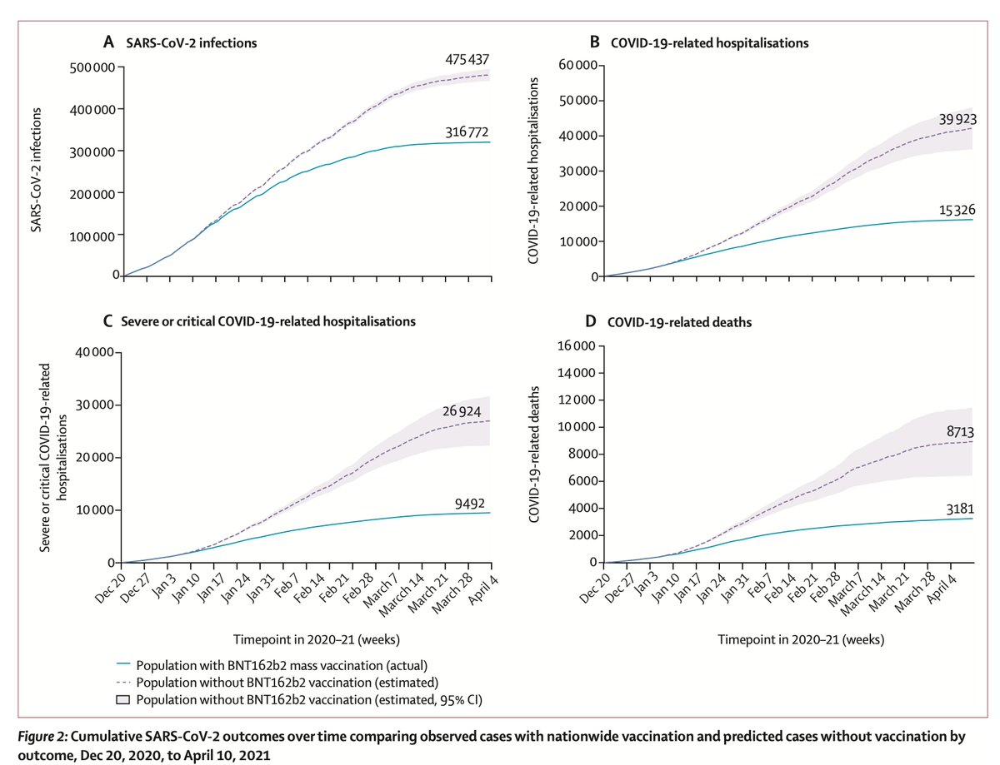</img></a>

---

<a href="https://twitter.com/erictopol/status/1440827047031427074" target="_blank" rel="noreferer">23:55 UCT</a>

In both the US and England covid cases among children are at a record high. Here are the data from England, and a concern about transmission between children and parents https://www.ft.com/content/1b884913-30cb-4b3e-9a2c-643287188387 by @mroliverbarnes @jburnmurdoch @bethanstaton 

<a href="E_7W_lqVQAccFhW.jpg"  >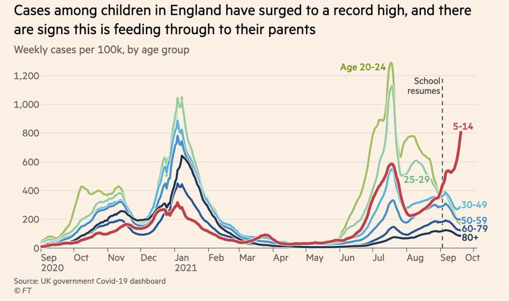</img></a>