+++
title = "Tweets by Eric Topol Sept 23"
Summary = ""
tags = ["Twitter"]
category = "Twitter"
+++

---

<a href="https://twitter.com/erictopol/status/1440854993389588482" target="_blank" rel="noreferer">01:46 UCT</a>

In the past 2 weeks in the US there has been a small ~10% reduction of cases among children, who comprise 26% of all cases
https://www.aap.org/en/pages/2019-novel-coronavirus-covid-19-infections/children-and-covid-19-state-level-data-report/ @hospitals4kids @AmerAcadPeds 

<a href="E_7w7qpVIAUx_Sk.jpg"  >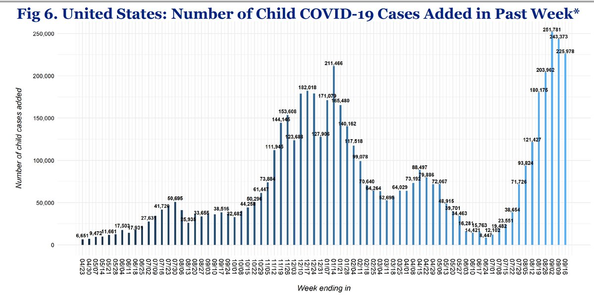</img></a>

---

<a href="https://twitter.com/erictopol/status/1440865811569123329" target="_blank" rel="noreferer">02:29 UCT</a>

The side-by-side graphs are comparing vaccine efficacy (VE) from the original, large trials of Pfizer and Moderna for reduction of symptomatic illness. At the end of the blinded follow-up, there was ~10 per cent absolute difference, VE 83% (Pfizer) vs 93% (Moderna)

---

<a href="https://twitter.com/erictopol/status/1440867121710329865" target="_blank" rel="noreferer">02:34 UCT</a>

RT @joel_mossong: Definitely one of the important papers this year and a future classic. Here's a 🧵 why.

---

<a href="https://twitter.com/erictopol/status/1440890831750066181" target="_blank" rel="noreferer">04:08 UCT</a>

A new @NewYorker piece by @HumanitiesMD, a pediatrician in Texas, provides reassurance about the fate of children with Covid. Beyond that, it is remarkably touching and gripping. 2 sample paragraphs below
https://www.newyorker.com/science/medical-dispatch/when-a-child-is-hospitalized-with-covid 

<a href="E_8RcFCUcAQ8ipj.jpg"  >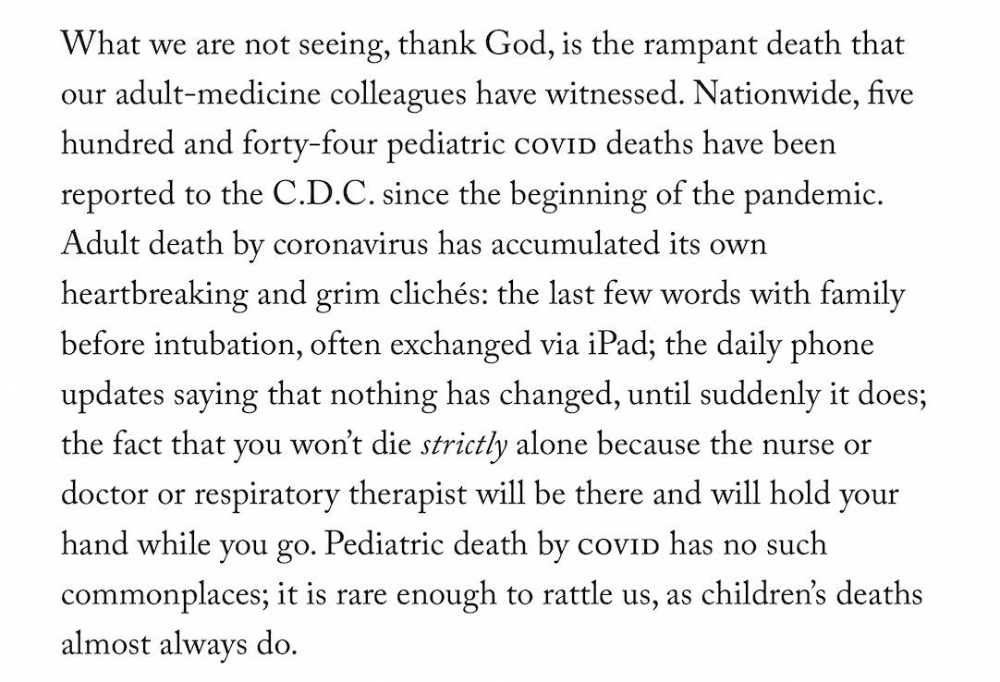</img></a><a href="E_8ReXEUUAADSZG.jpg"  >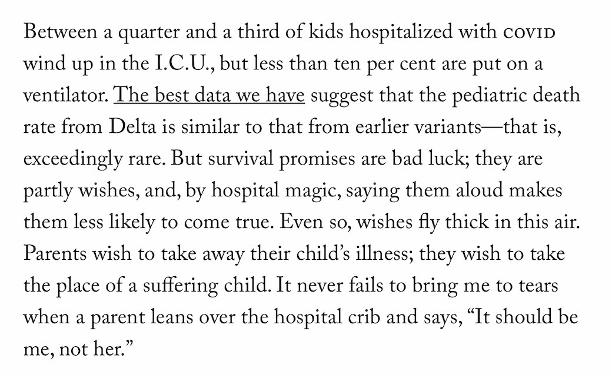</img></a>

---

<a href="https://twitter.com/erictopol/status/1441035122497634311" target="_blank" rel="noreferer">13:42 UCT</a>

RT @EricTopol: New large dataset of US Medicare (age 65+) population subgroup: 2.7 million Pfizer; 2.9 million Moderna vaccinated, w/ ~30,0…

---

<a href="https://twitter.com/erictopol/status/1441043402800304138" target="_blank" rel="noreferer">14:14 UCT</a>

How to make a Delta variant specific vaccine
https://www.wsj.com/articles/covid-19-vaccines-can-be-updated-for-the-delta-variant-heres-how-11632399254 good schematic by @joshulick @acervantesc 

<a href="E_-dT0yVgAkyiLh.jpg"  >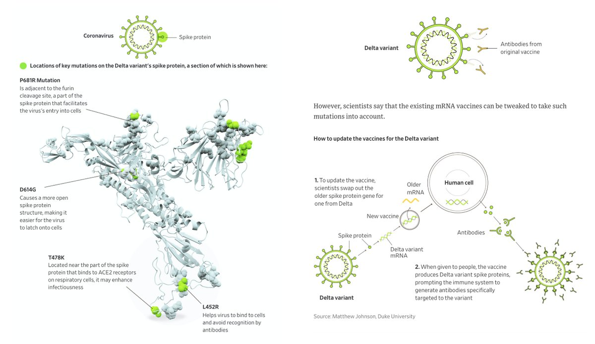</img></a>

---

<a href="https://twitter.com/erictopol/status/1441049745154138120" target="_blank" rel="noreferer">14:40 UCT</a>

In the past 3 weeks, US hospitalizations have declined by 15% from their 4th wave peak
--90% of these were preventable w/vaccination
--marked geographic variability
--still at an extremely high level 

<a href="E_-iBOpVgAQCumi.jpg"  >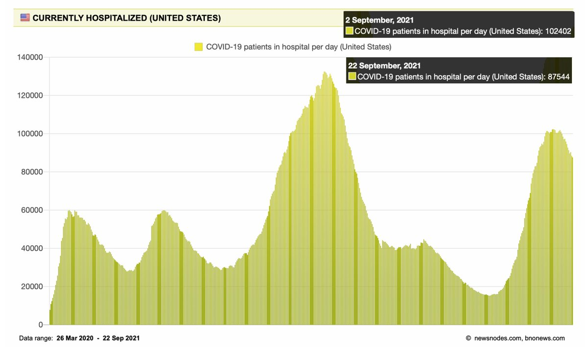</img></a>

---

<a href="https://twitter.com/erictopol/status/1441052116546580492" target="_blank" rel="noreferer">14:49 UCT</a>

The big picture on the pandemic
@JeremyFarrar in conversation
https://www.medscape.com/viewarticle/957150
w/ transcript

---

<a href="https://twitter.com/erictopol/status/1441055777339281413" target="_blank" rel="noreferer">15:04 UCT</a>

Great explainer by @Craig_A_Spencer on the differences of contagiousness between vaccinated and unvaccinated people https://www.theatlantic.com/ideas/archive/2021/09/the-vaccinated-arent-just-as-likely-to-spread-covid/620161/ @TheAtlantic

---

<a href="https://twitter.com/erictopol/status/1441083610321149954" target="_blank" rel="noreferer">16:54 UCT</a>

Just published @NEJM
Finally, the means to accurately quantify kidney function independent of race https://www.nejm.org/doi/full/10.1056/NEJMoa2102953?query=featured_home#article_references 

<a href="E__BUItVUAAq1S0.jpg"  >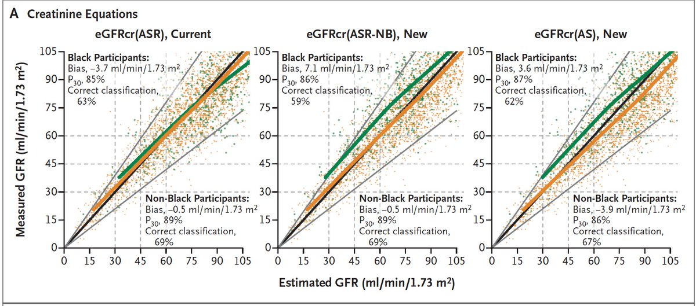</img></a>

---

<a href="https://twitter.com/erictopol/status/1441084891681071111" target="_blank" rel="noreferer">16:59 UCT</a>

The aggressive and very successful New Zealand response to the Delta varaint included the ability to reduce Ro from 6 to 0.6 in just a few days
https://www.health.govt.nz/our-work/diseases-and-conditions/covid-19-novel-coronavirus/covid-19-data-and-statistics/covid-19-source-cases 

<a href="E__Cs5WUcBIQUiQ.jpg"  >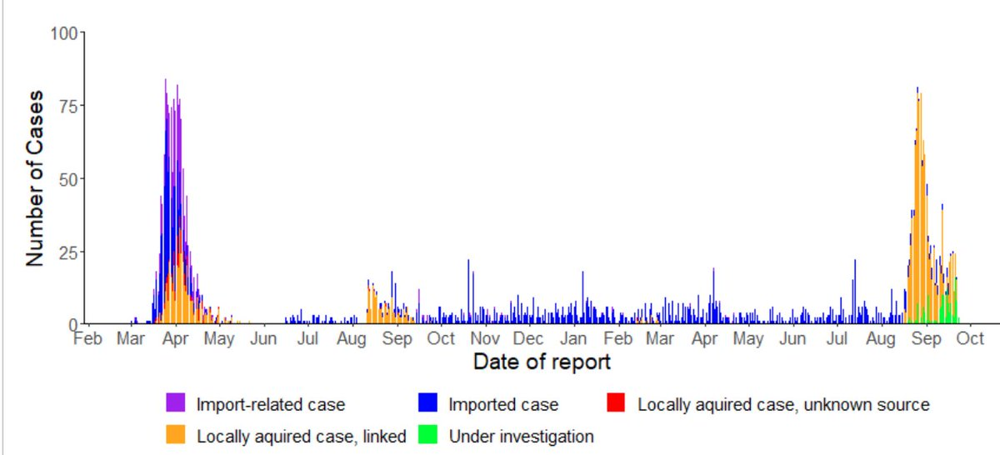</img></a>

---

<a href="https://twitter.com/erictopol/status/1441089264838606857" target="_blank" rel="noreferer">17:17 UCT</a>

RT @kavitapmd: Pretty critical slide presented by @CDCgov staff at  #ACIP - clear benefit in 65+ but it is not a trivial benefit in the 50-…

---

<a href="https://twitter.com/erictopol/status/1441090034396844032" target="_blank" rel="noreferer">17:20 UCT</a>

There is currently only 1 source of data for 3rd dose (booster) vaccine effectiveness, and only 1 vaccine (Israel, Pfizer)
So how does Moderna get an EUA with only data on immune response but without clinical outcomes?

---

<a href="https://twitter.com/erictopol/status/1441099396821622787" target="_blank" rel="noreferer">17:57 UCT</a>

@megtirrell Exactly

---

<a href="https://twitter.com/erictopol/status/1441102800117587974" target="_blank" rel="noreferer">18:10 UCT</a>

A fantastic new @ScienceMagazine issue on human genomics
--@tuuliel and @dgmacarthur on variant to function relationship
--Peter Visscher @PCTGenomics et al on polygenic basis of common diseases
--@jennyErood on legacy of the Human Genome Project
and more
https://www.science.org/doi/10.1126/science.abm1359 

<a href="E__RPj4UUAM7DsR.jpg"  >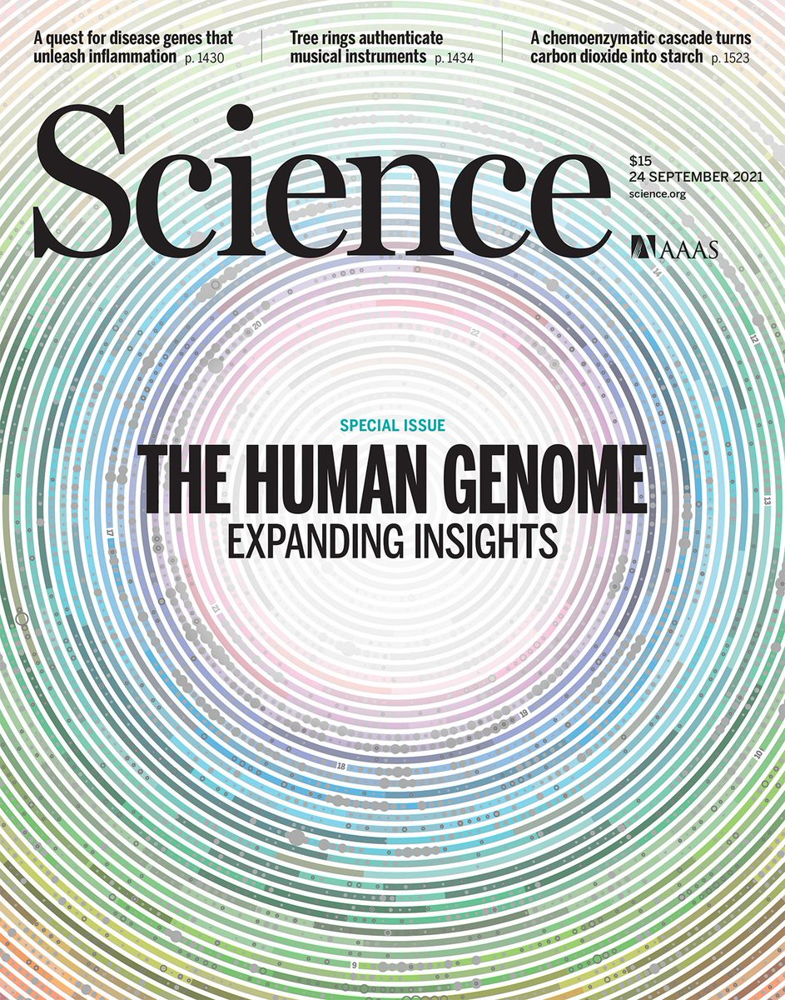</img></a><a href="E__TR1AVUAgKtd6.jpg"  >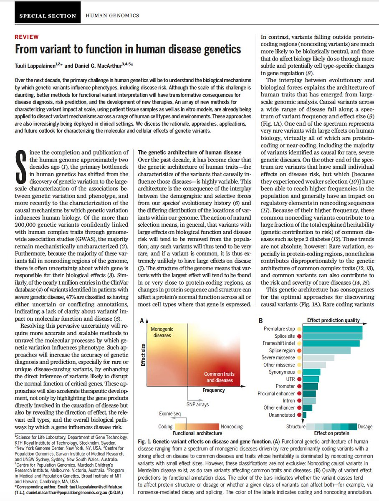</img></a><a href="E__TT9wVIBEDNXb.jpg"  >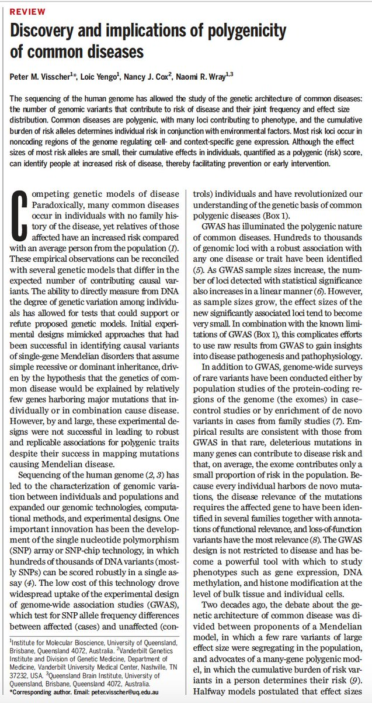</img></a><a href="E__TWGLVIAkAqGI.jpg"  >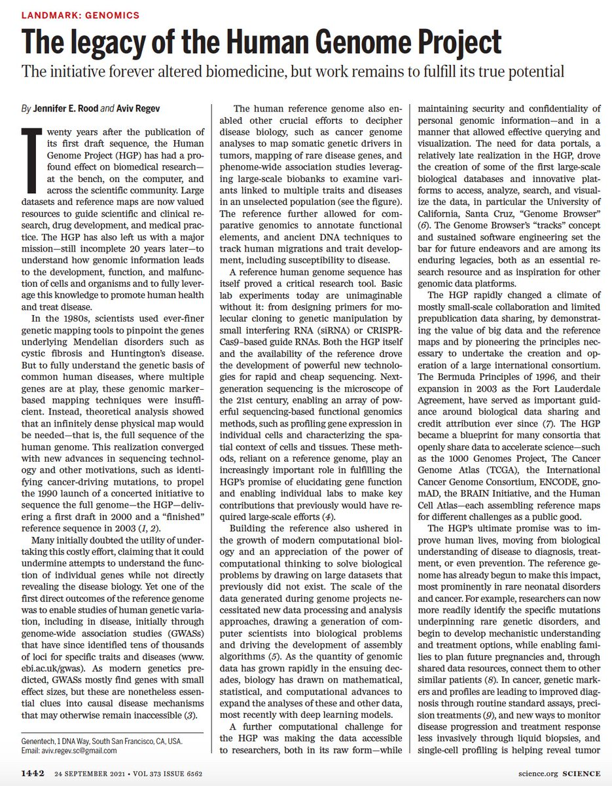</img></a>

---

<a href="https://twitter.com/erictopol/status/1441108309214334977" target="_blank" rel="noreferer">18:32 UCT</a>

Just published @ScienceMagazine
How do we get better antibodies and vaccines vs #SARSCoV2?  A global consortium effort to define all the problematic epitopes that can give our immune response trouble
https://www.science.org/doi/10.1126/science.abh2315
by @EOSaphire and collaborators @ljiresearch 

<a href="E__YA3IUUAoh-XV.png"  >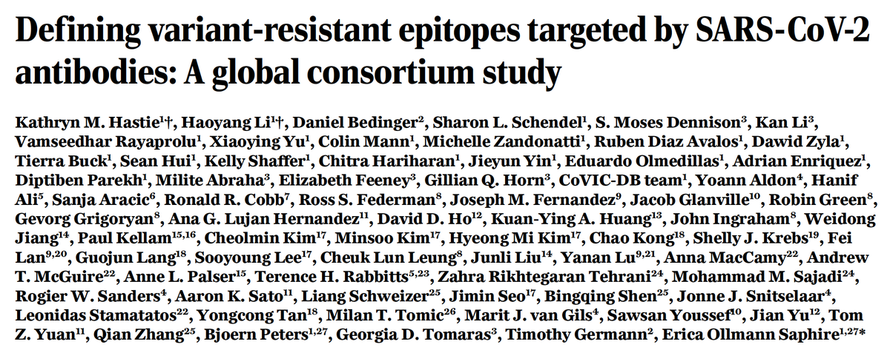</img></a><a href="E__YCo2VUAQYaip.jpg"  >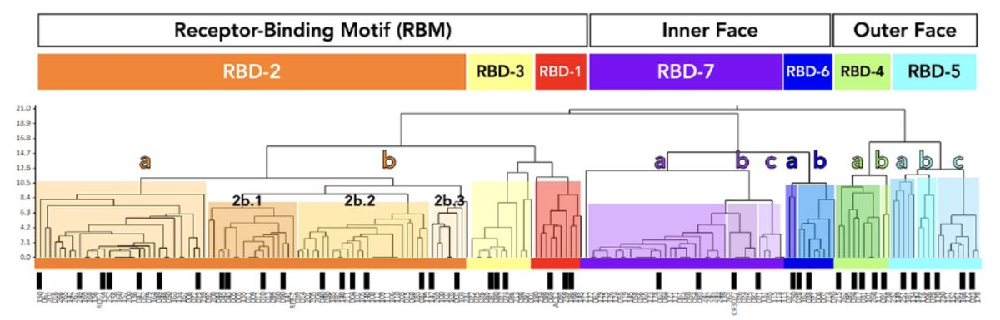</img></a><a href="E__YEjjVQAAMTVJ.jpg"  >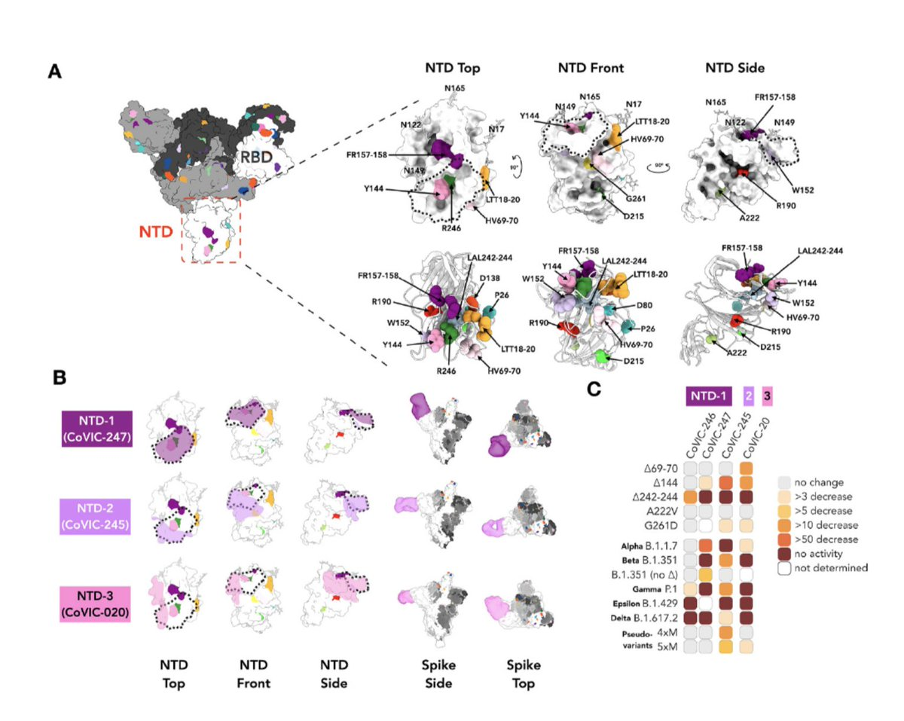</img></a><a href="E__YGg5VUAIaXDp.jpg"  >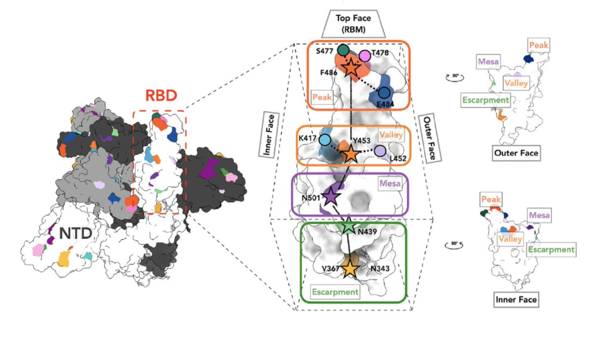</img></a>

---

<a href="https://twitter.com/erictopol/status/1441120123708862464" target="_blank" rel="noreferer">19:19 UCT</a>

First it was LA County public schools;  now likely all California. An important potential precedent
https://www.ft.com/content/e87e092b-543f-4639-816f-d797fe1589a7 

<a href="E__i-dHUYAAdrlF.jpg"  >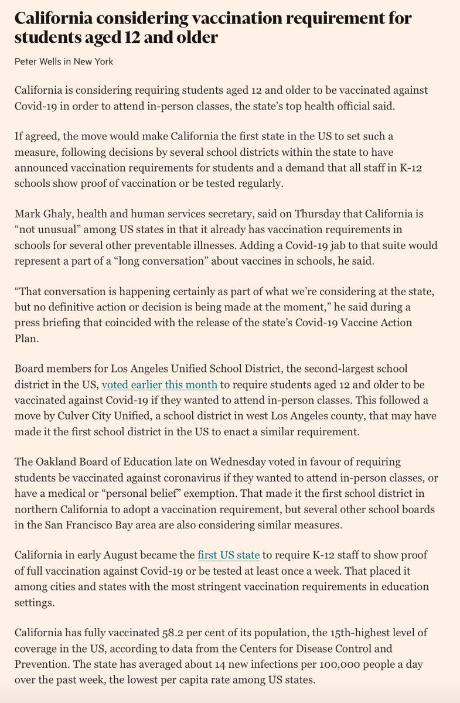</img></a>

---

<a href="https://twitter.com/erictopol/status/1441145466691801091" target="_blank" rel="noreferer">21:00 UCT</a>

This is a big deal.
—FDA admits there are no data for Moderna or J&amp;J
https://www.statnews.com/2021/09/23/covid19-vaccine-boosters-cdc-acip/ and it'll take awhile
—FDA/ACIP: Moderna vaccinees are not eligible for Pfizer boosters.
—That's not a good message for high-risk individuals (age &gt;60, occupational, etc) 8-9 months out 

<a href="E__5lj1VcAURuL8.png"  >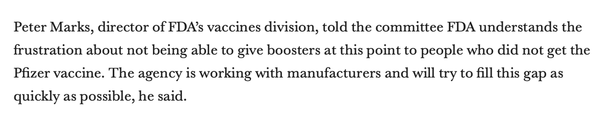</img></a>

---

<a href="https://twitter.com/erictopol/status/1441146019266269186" target="_blank" rel="noreferer">21:02 UCT</a>

In the meantime, we should give Pfizer boosters to Moderna/J&amp;J who fit the high-risk criteria and collect the data! 
Likelihood of the happening........approaches zero.

---

<a href="https://twitter.com/erictopol/status/1441147344368459781" target="_blank" rel="noreferer">21:07 UCT</a>

We are now entering a 3rd shot/booster confusional state in the US with different recommendations between FDA and CDC [the latter ridiculously not supporting healthcare workforce, teachers, etc]. Plus all these uncertainties below.
This is the last thing we need right now. https://twitter.com/EricTopol/status/1441090034396844032

---

<a href="https://twitter.com/erictopol/status/1441163583929290763" target="_blank" rel="noreferer">22:12 UCT</a>

The US timeline for boosters. 
You'd have to work really hard to mess this up this badly and engender this much confusion. 😬 

<a href="FAAKeUGVQAwC9sD.jpg"  >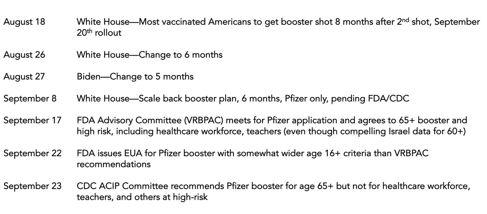</img></a>

---

<a href="https://twitter.com/erictopol/status/1441178581296582665" target="_blank" rel="noreferer">23:12 UCT</a>

Israel is descending from a severe 4th wave; main issue now is the unvaccinated
"17 percent of eligible Israelis who have not received the vaccine account for 60 percent of coronavirus deaths in the past two weeks"
https://www.haaretz.com/israel-news/israel-s-covid-czar-says-17-unvaccinated-a-strain-on-hospitals-1.10234830
@OurWorldInData 

<a href="FAAXN9KVQAEhRFT.jpg"  >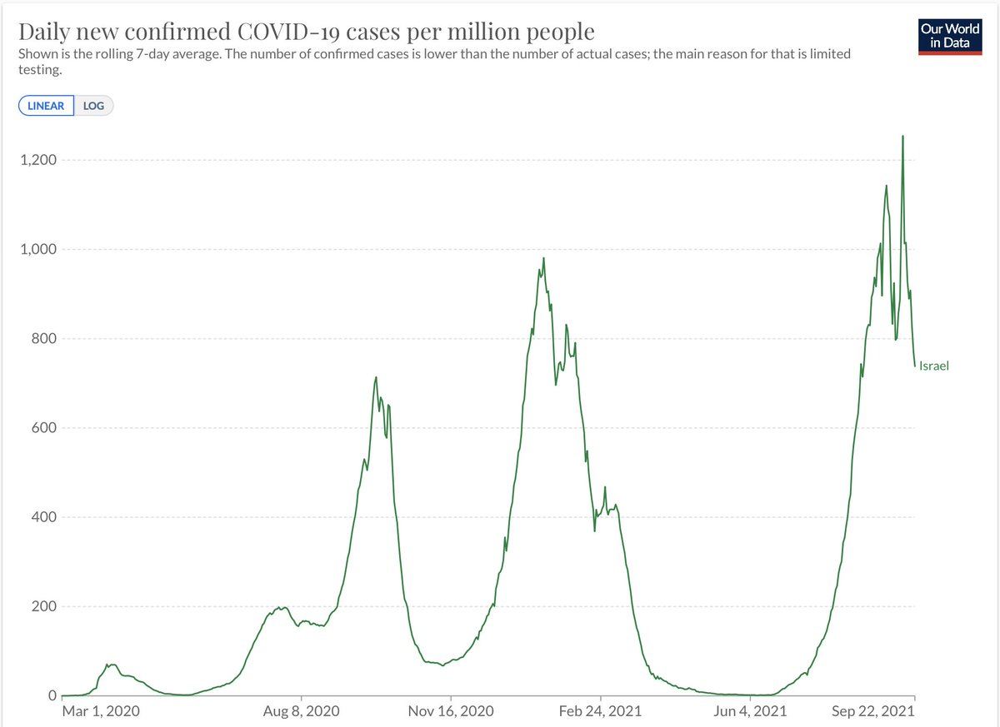</img></a><a href="FAAXPLYUcAUzr7U.jpg"  >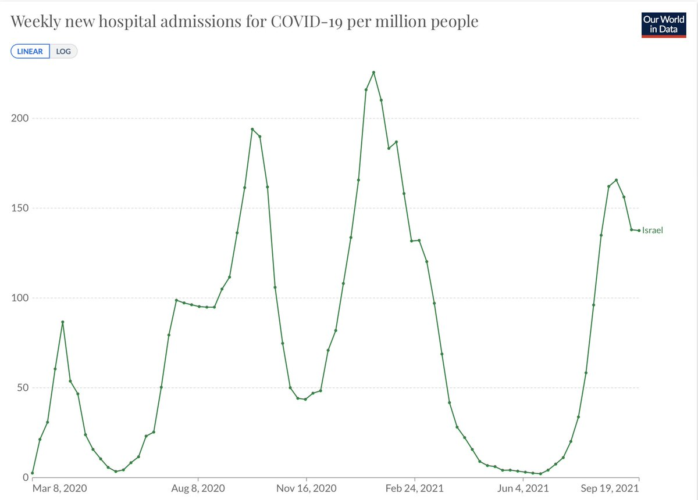</img></a><a href="FAAXQrSVcAUYQW3.jpg"  >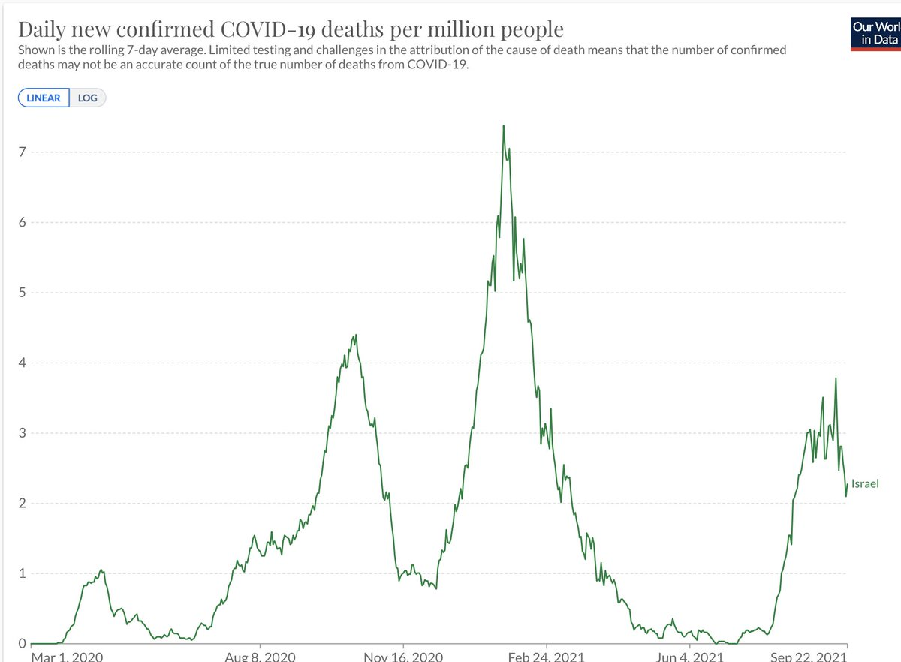</img></a><a href="FAAYCHuUYAMalGn.jpg"  >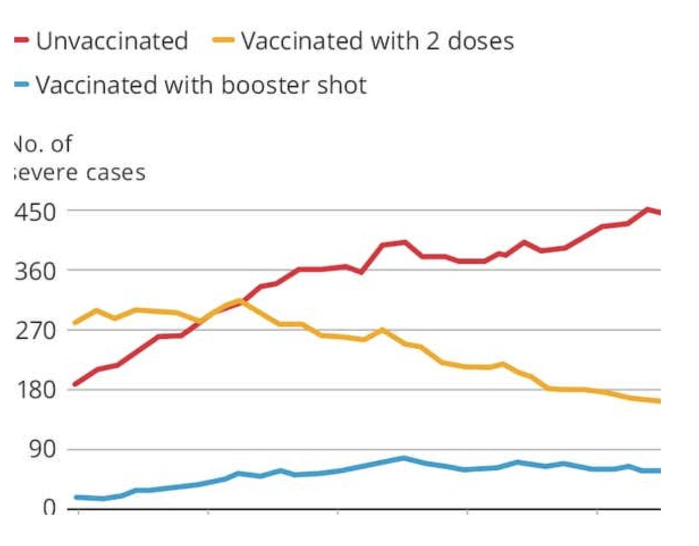</img></a>