+++
title = "Tweets by Eric Topol Sept 25"
Summary = ""
tags = ["Twitter"]
category = "Twitter"
+++

---

<a href="https://twitter.com/erictopol/status/1441567001290285059" target="_blank" rel="noreferer">00:55 UCT</a>

A good milestone achieved today.
If only we could get to 70-75% of total population fully vaccinated; a dozen countries have already done that  https://twitter.com/cyrusshahpar46/status/1441492989558157322

<a href="FAF426XUYAMn7sF.jpg"  >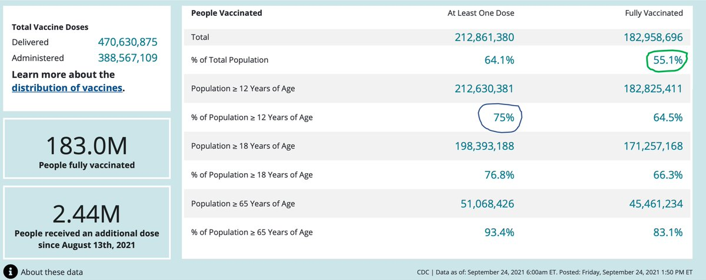</img></a><a href="FAF5ZeJVEAQThKs.jpg"  >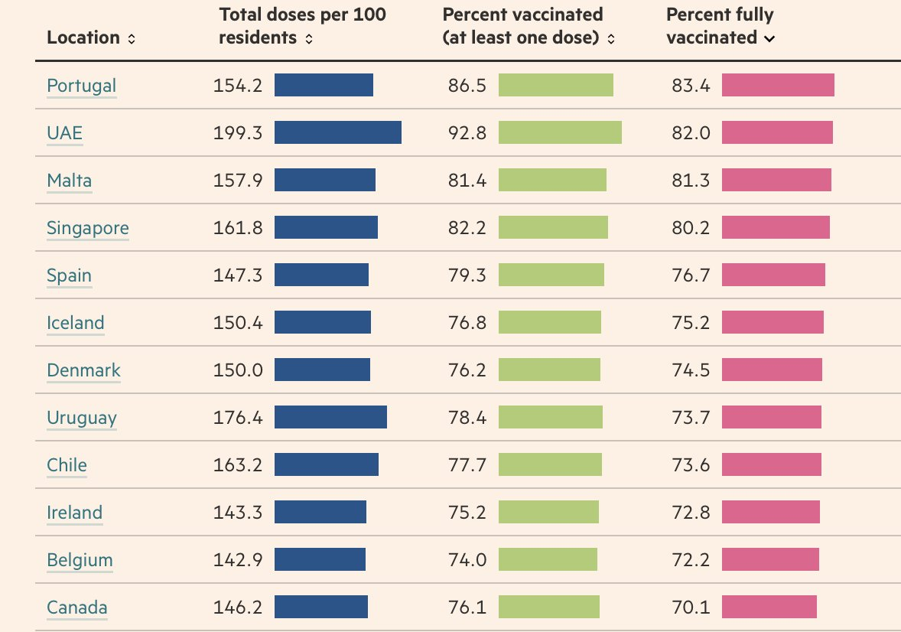</img></a>

---

<a href="https://twitter.com/erictopol/status/1441604633567268865" target="_blank" rel="noreferer">03:25 UCT</a>

US improvement metrics
—18% fewer cases in past week
—Test positivity on the decline
—Hospitalizations lowest in 5 weeks, now &lt; 85,000 

<a href="FAGbfcZVQAIKDVX.jpg"  >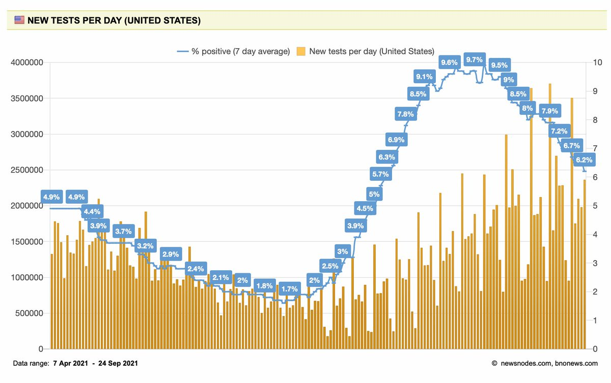</img></a><a href="FAGbg9uVcAghagp.jpg"  >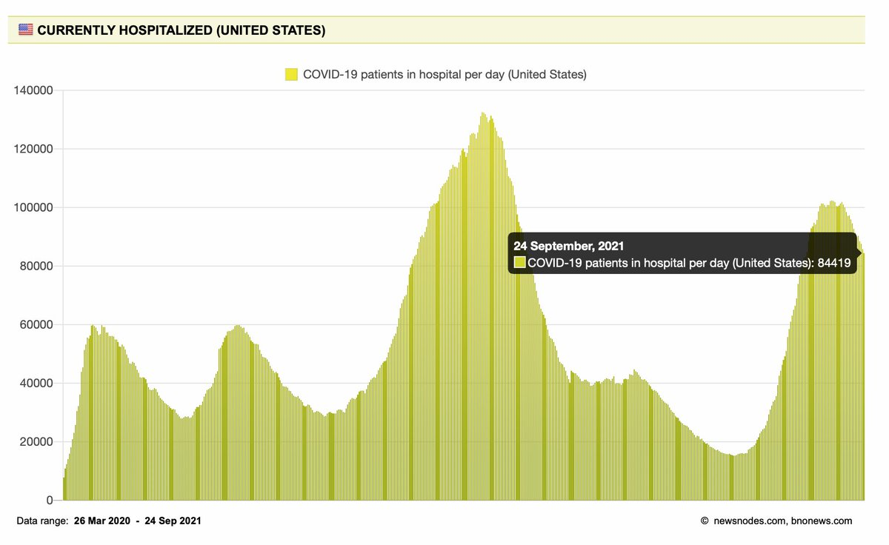</img></a>

---

<a href="https://twitter.com/erictopol/status/1441612301358882816" target="_blank" rel="noreferer">03:55 UCT</a>

If there ever were graphs about people looking like a roller coaster, these would fit the bill

---

<a href="https://twitter.com/erictopol/status/1441781841938161671" target="_blank" rel="noreferer">15:09 UCT</a>

The @CDCDirector made the right call.
https://www.wsj.com/articles/rochelle-walenskys-finest-hour-cdc-fda-janet-woodcock-biden-administration-covid-booster-vaccine-shots-11632511818?mod=opinion_lead_pos1 

<a href="FAI8rmVUcAY9eaa.jpg"  >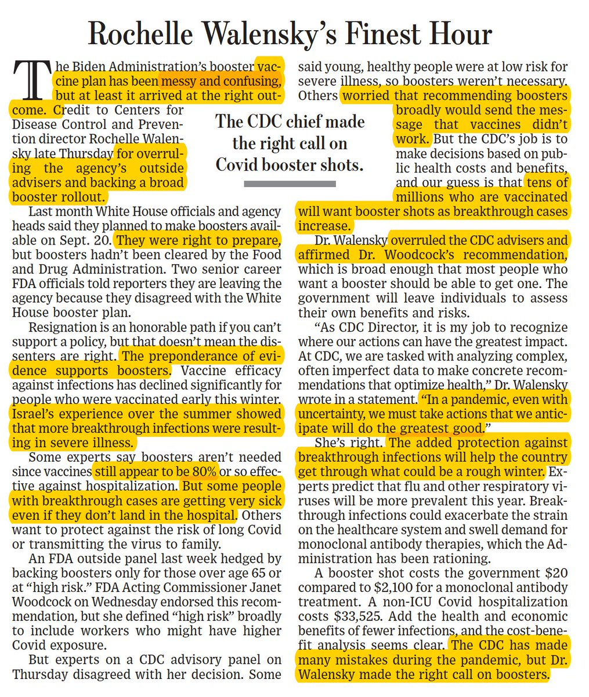</img></a>

---

<a href="https://twitter.com/erictopol/status/1441783539121328129" target="_blank" rel="noreferer">15:15 UCT</a>

Ivermectin poisonings in the US
https://www.ft.com/content/9715bd16-bcb2-4bfc-bbd9-b7316d787698 by @JamieSmythF @FT
"@FoxNews did not respond to a request for comment."

---

<a href="https://twitter.com/erictopol/status/1441801478943887365" target="_blank" rel="noreferer">16:27 UCT</a>

After the damage has been done, a preprint with a denominator off by &gt;25-fold is withdrawn
https://www.cbc.ca/news/health/covid-19-vaccine-study-error-anti-vaxxers-1.6188806
https://www.medrxiv.org/content/10.1101/2021.09.13.21262182v2 

<a href="FAJOHrDVUAAbQpK.jpg"  >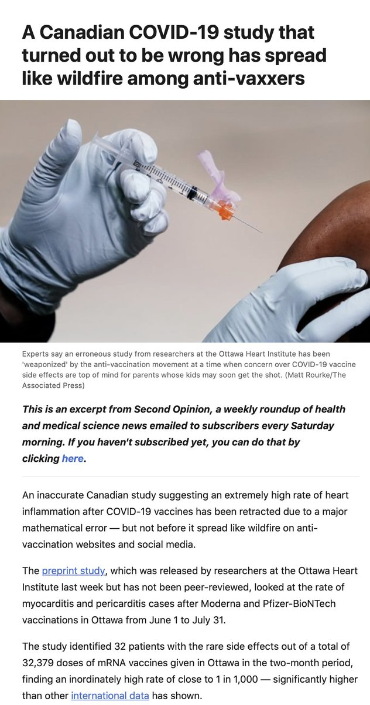</img></a><a href="FAJOJeAVIAMwysu.jpg"  >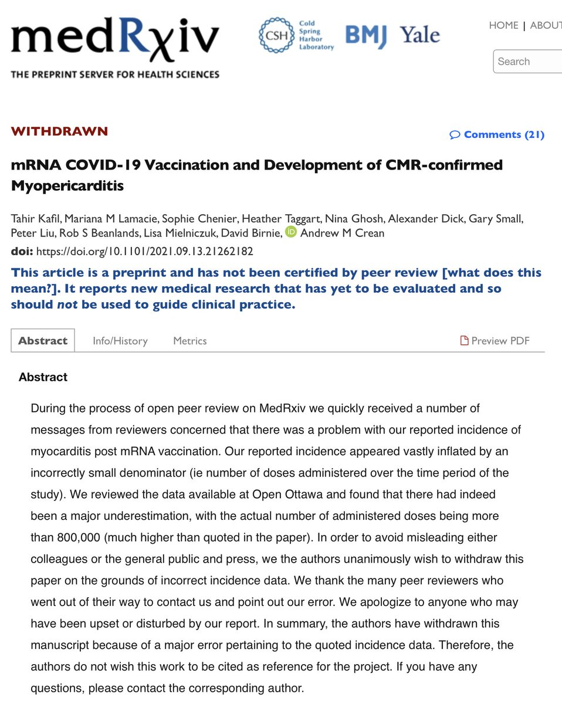</img></a>

---

<a href="https://twitter.com/erictopol/status/1441811340964732931" target="_blank" rel="noreferer">17:06 UCT</a>

The advantage of more plasmablasts, and primary memory B cells with more antigen-binding capacity, attained by Prior Covid plus 1 mRNA vaccine dose compared with 2 mRNA doses
https://www.cell.com/cell-reports/fulltext/S2211-1247(21)01287-0 @CellReports 

<a href="FAJWJekVkAkXTsC.jpg"  >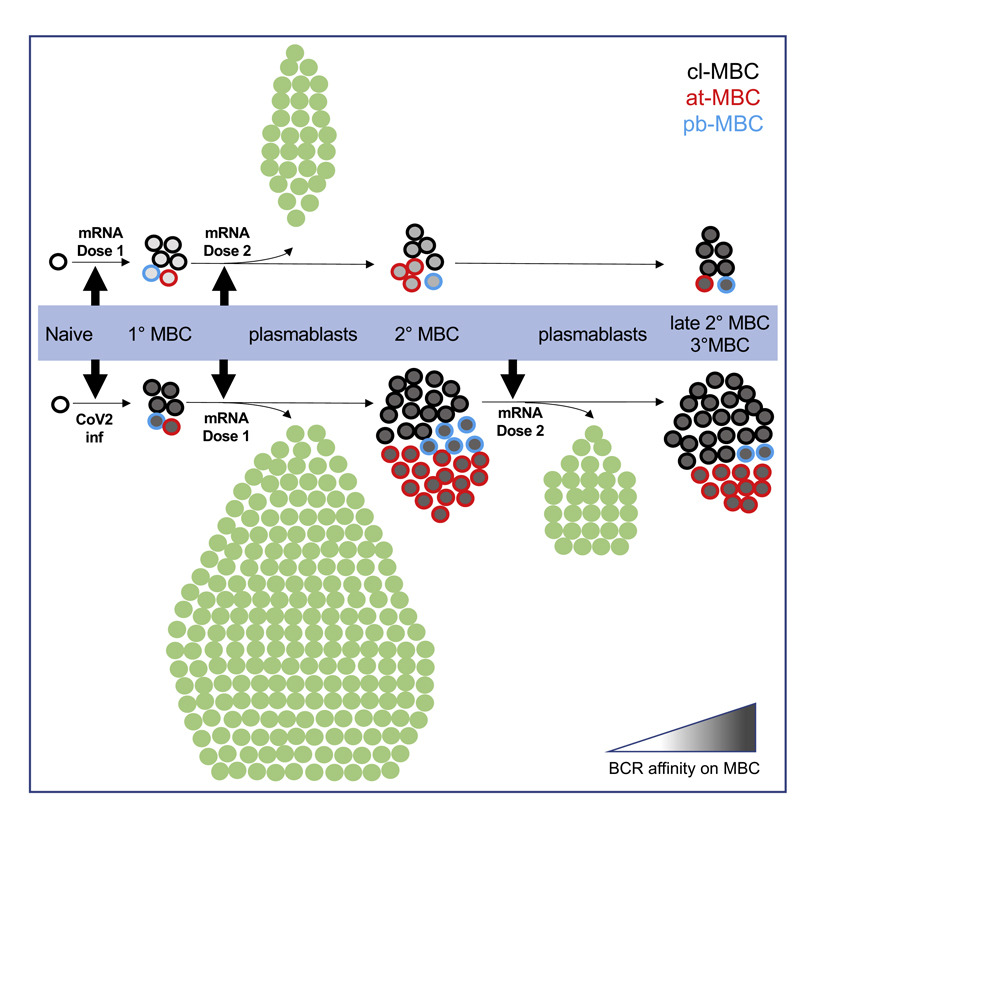</img></a>

---

<a href="https://twitter.com/erictopol/status/1441812930178129922" target="_blank" rel="noreferer">17:12 UCT</a>

A 3rd dose (aka booster) was always envisioned to be necessary for most covid vaccines (as w/ many other vaccines); it was only a matter of when. @bgzimmer on origin of the word "booster"
"Those in favor of giving out extra doses are 'booster boosters.'"
https://www.wsj.com/articles/booster-a-bump-up-from-belowfor-your-immunity-11632435132?mod=searchresults_pos1&page=1 

<a href="FAJYgQtVIAg7nwU.jpg"  >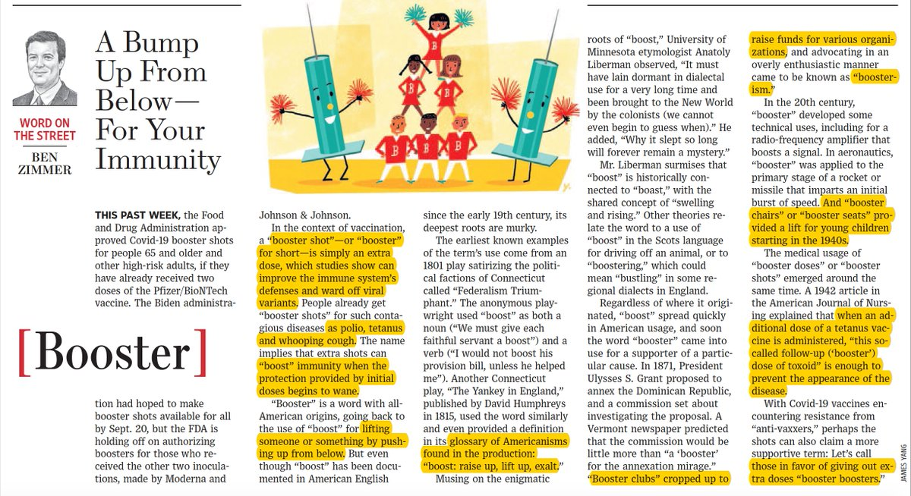</img></a>

---

<a href="https://twitter.com/erictopol/status/1441817837966745608" target="_blank" rel="noreferer">17:32 UCT</a>

The waning of Pfizer and Moderna vaccine protection vs *symptomatic infections* over time in all age groups, slide presented at ACIP @CDCgov meeting by Sara Oliver MD https://www.cdc.gov/vaccines/acip/meetings/downloads/slides-2021-9-23/03-COVID-Oliver.pdf
(this was the primary endpoint for the pivotal trials to approve these vaccines) 

<a href="FAJcZBcVcAMQrMh.jpg"  >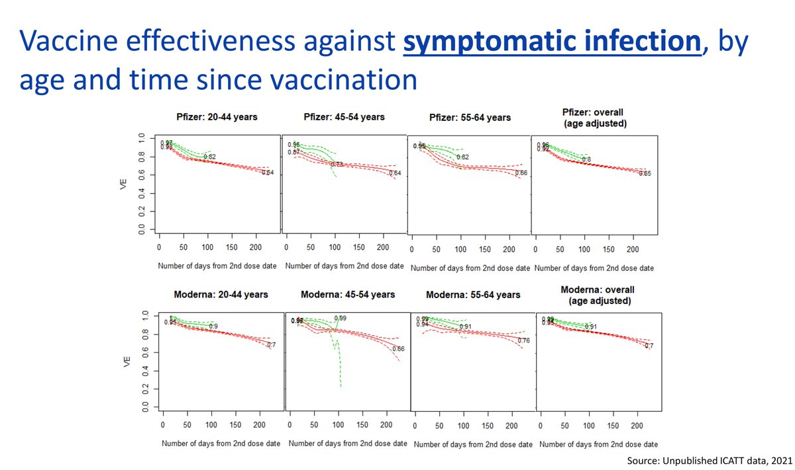</img></a>

---

<a href="https://twitter.com/erictopol/status/1441822941629485059" target="_blank" rel="noreferer">17:52 UCT</a>

Red=Delta (Green=pre-Delta)
It's still early into the period of waning, w/ frequency of exposures increasing over time.
Recall the UK (and other countries) decision to provide 3rd shots irrespective of vaccine to all age 50+ is at odds with FDA/CDC (Pfizer only, age 65+)

---

<a href="https://twitter.com/erictopol/status/1441825712726429700" target="_blank" rel="noreferer">18:03 UCT</a>

Meanwhile we have left the people who got a J&amp;J vaccine stranded with comparatively very low antibody levels 2-6 weeks after dosing, while we've learned such levels are tied to protection
https://www.cdc.gov/mmwr/volumes/70/wr/mm7038e1.htm?s_cid=mm7038e1_w
I think that's now ill-considered. 

<a href="FAJj0tmVcAcNDUw.jpg"  >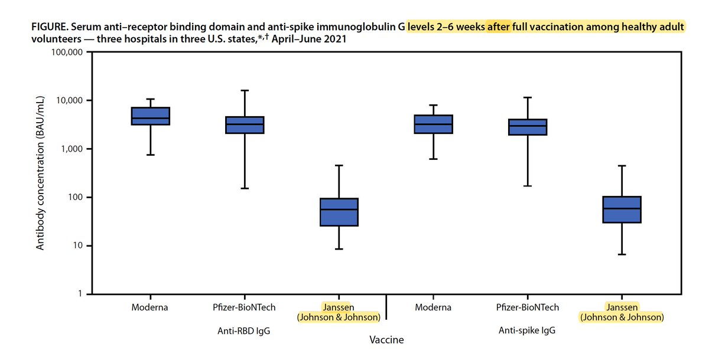</img></a>

---

<a href="https://twitter.com/erictopol/status/1441827832670216196" target="_blank" rel="noreferer">18:11 UCT</a>

It's as if the denialists of waning vs symptomatic infections think this issue will just go away over time, despite this endpoint being an accepted surrogate for hospitalizations. Meanwhile this is putting those not covered by current criteria, but at risk, for #LongCovid, too.

---

<a href="https://twitter.com/erictopol/status/1441831326986870784" target="_blank" rel="noreferer">18:25 UCT</a>

RT @JamesSurowiecki: Canadian study that found an absurdly high myocarditis rate of 1 in 1000 among ppl getting mRNA vaccines was completel…

---

<a href="https://twitter.com/erictopol/status/1441835361181700101" target="_blank" rel="noreferer">18:41 UCT</a>

The transition for COVID-19 from epidemic to endemic phase. Excellent, by Rustom Antia and Elizabeth Halloran @EmoryUniversity @fredhutch 
https://www.cell.com/immunity/fulltext/S1074-7613(21)00404-0#relatedArticles @ImmunityCP 

<a href="FAJss8bVkAAH7uT.jpg"  >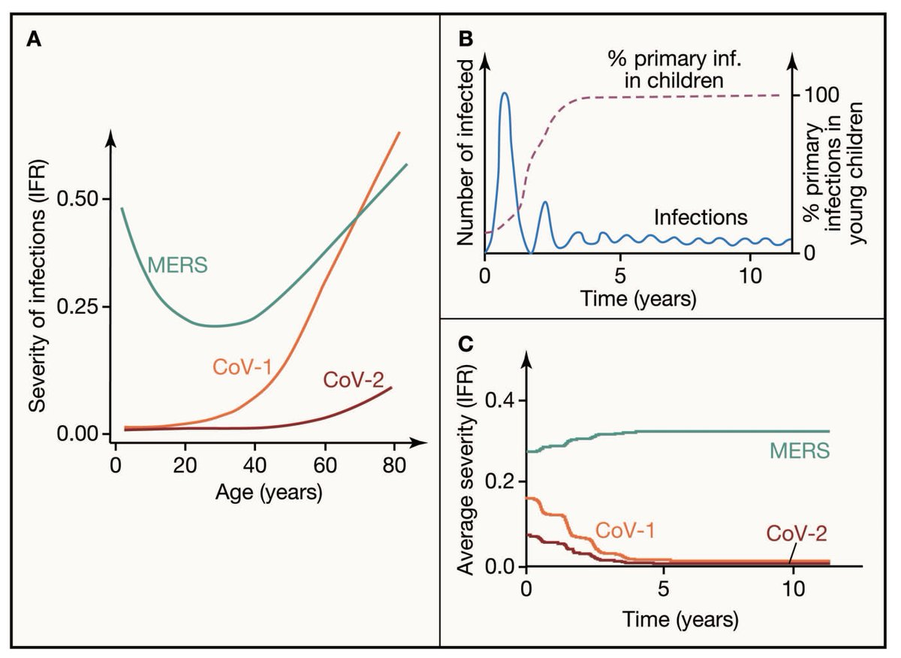</img></a>