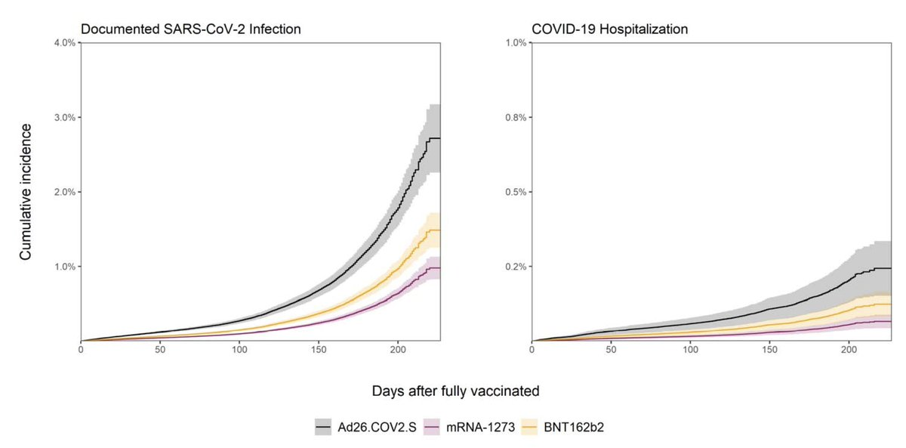
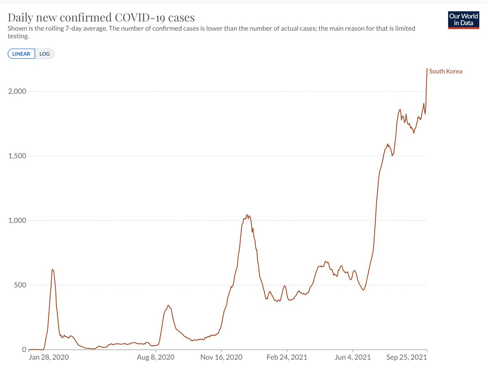

+++
title = "Tweets by Eric Topol Sept 26"
Summary = ""
tags = ["Twitter"]
category = "Twitter"
+++

---

<a href="https://twitter.com/erictopol/status/1442128147290361856" target="_blank" rel="noreferer">14:05 UCT</a>

RT @thehowie: More than 50% of all of Israel &amp; &gt;70% over 60 years have already received a booster shot. Transmission also appears to be sub…

---

<a href="https://twitter.com/erictopol/status/1442157389055070219" target="_blank" rel="noreferer">16:01 UCT</a>

Breakthrough infections and hospitalizations in over 3 million fully vaccinated persons @VeteransHealth, mostly pre-Delta wave
https://www.medrxiv.org/content/10.1101/2021.09.23.21263864v1
J&amp;J vaccine less protection vs hospitalization than mRNA vaccines; Moderna more protective than Pfizer 

<a href="FAOQqMcUYAow_ee.jpg"  ></img></a>

---

<a href="https://twitter.com/erictopol/status/1442170791613763592" target="_blank" rel="noreferer">16:54 UCT</a>

The tragedy in Alaska.
143/100,000 is a new case/population record for any US state in the Delta wave. And higher than any country in the world. 
"A record 217 hospitalizations reported Friday were not part of the data backlog"
 https://www.adn.com/alaska-news/2021/09/24/alaska-reports-nearly-1800-new-covid-19-cases-and-44-deaths-in-part-due-to-backlog/ 

<a href="FAOdXBBVcAkEQtB.jpg"  ></img></a>

---

<a href="https://twitter.com/erictopol/status/1442175271218475016" target="_blank" rel="noreferer">17:12 UCT</a>

The bottom line is masks work ... If you have the ability to choose between a cloth and a surgical mask, go with surgical. But the best mask is one that a person will actually wear and wear correctly.
https://www.nytimes.com/2021/09/26/opinion/do-masks-work-for-covid-prevention.html @nytopinion 

<a href="FAOiDZXUcAAFK6L.jpg"  ></img></a>

---

<a href="https://twitter.com/erictopol/status/1442179314368147456" target="_blank" rel="noreferer">17:28 UCT</a>

+ the latest data for kids in school
https://twitter.com/EricTopol/status/1441455355918049280

---

<a href="https://twitter.com/erictopol/status/1442210687376261120" target="_blank" rel="noreferer">19:33 UCT</a>

South Korea's Delta outbreak. 
With a population of 51.3 million, limited to avg 7 deaths/day (Total population vaccination: 74% 1st dose, 45% 2-doses)
Population-adjusted for US, fatalities would equal 45.
Actual number of US deaths/day, 7-day avg = 2,045
@OurWorldInData 

<a href="FAPCl77VIAUDnL2.jpg"  ></img></a>

---

<a href="https://twitter.com/erictopol/status/1442234836572200969" target="_blank" rel="noreferer">21:09 UCT</a>

"The Prime Minister of South Korea said on Sunday that the nation would soon start administering booster shots to medical workers and people in their 60s and older"
https://www.nytimes.com/2021/09/26/world/south-korea-vaccine-boosters.html

