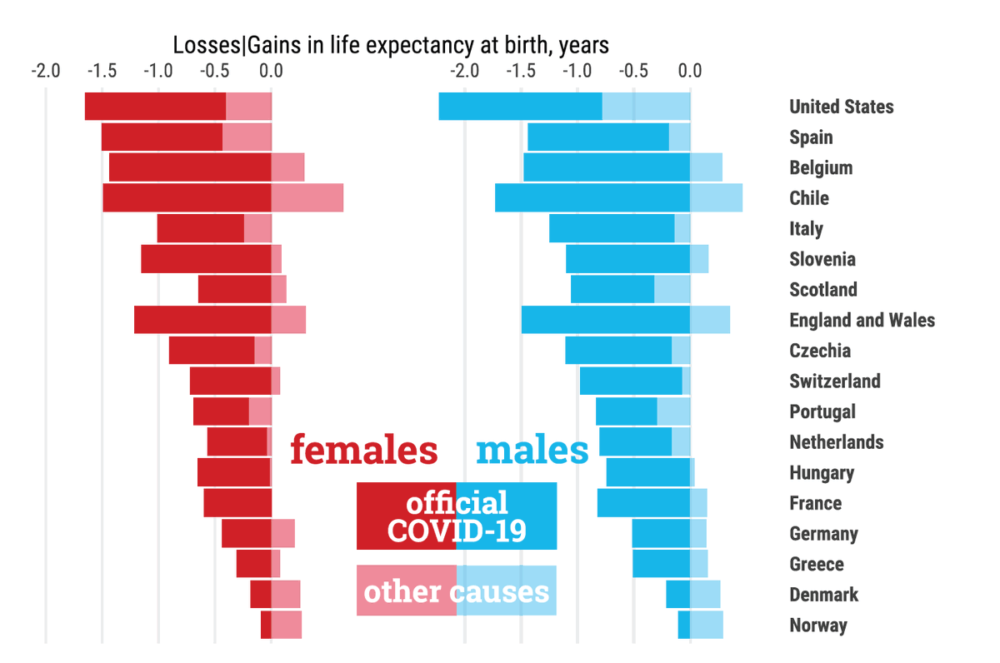
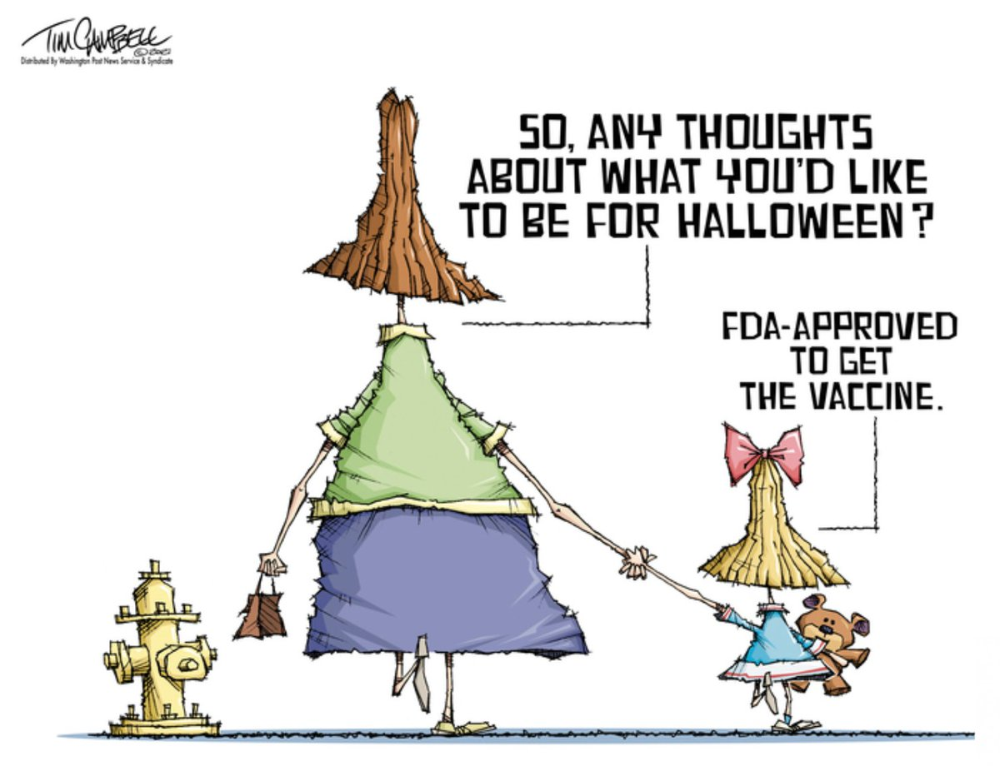
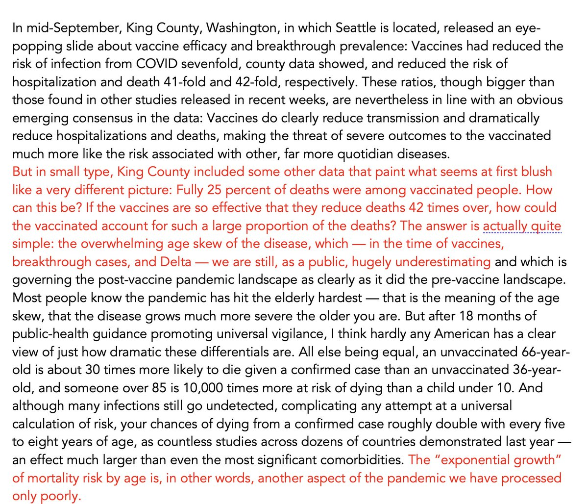
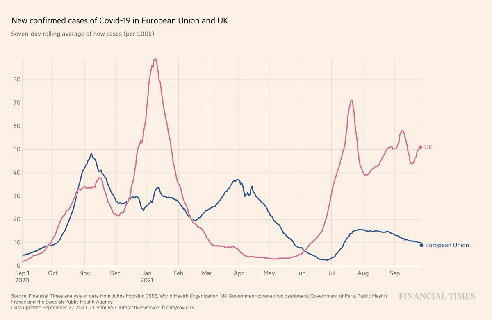
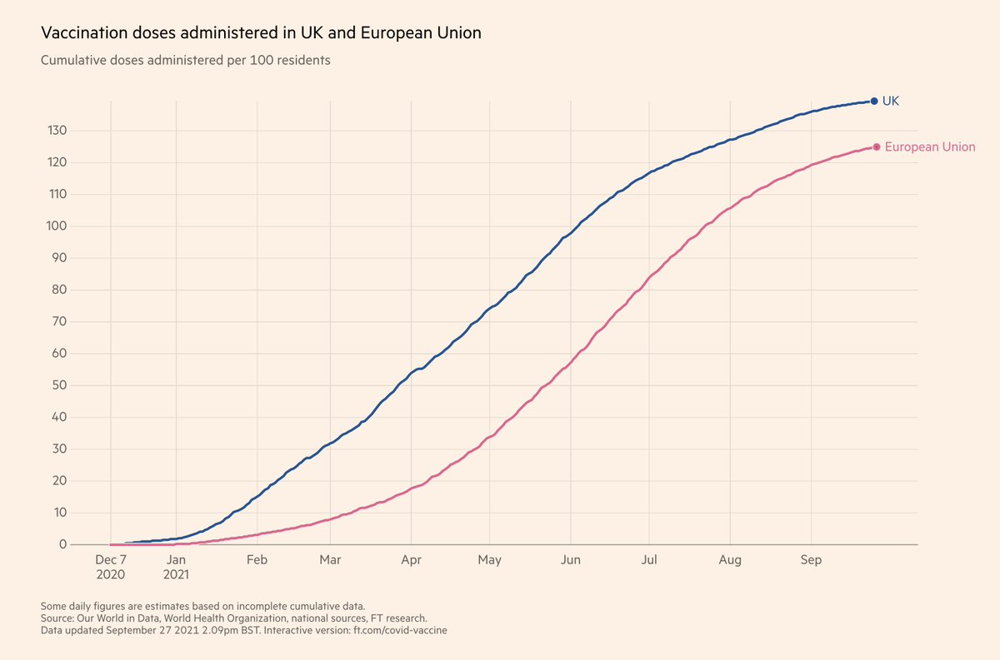
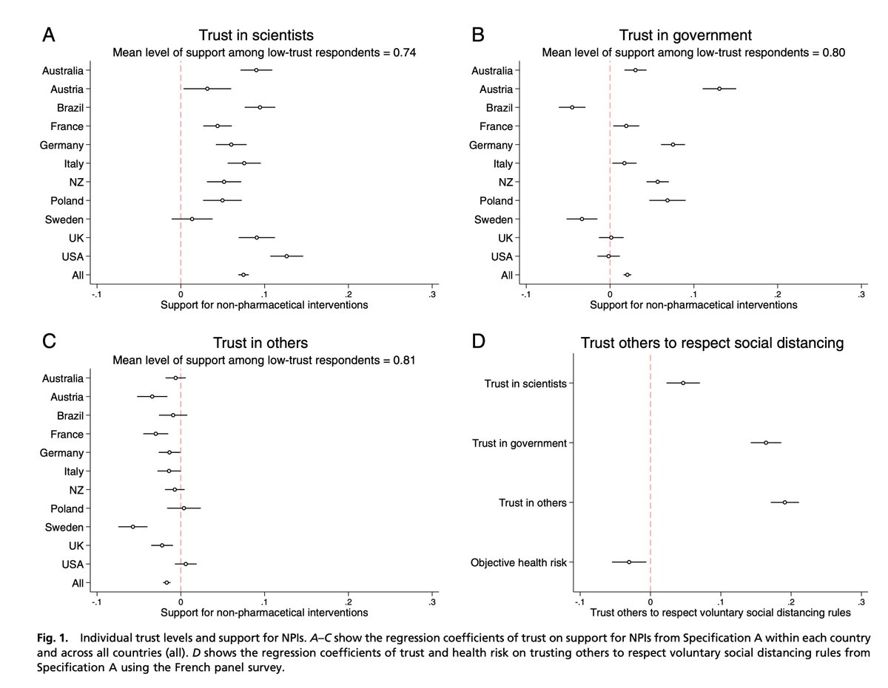
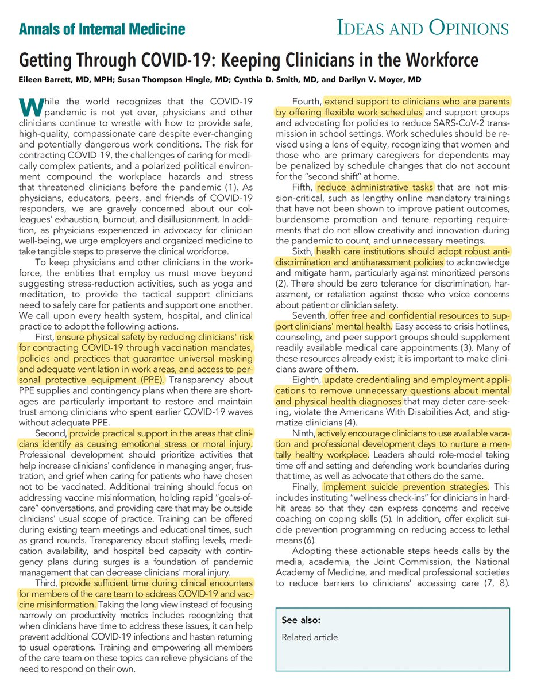

+++
title = "Tweets by Eric Topol Sept 27"
Summary = ""
tags = ["Twitter"]
category = "Twitter"
+++

---

<a href="https://twitter.com/erictopol/status/1442333910369665025" target="_blank" rel="noreferer">03:42 UCT</a>

The Covid-19 pandemic has resulted in the largest loss of life expectancy since World War II, worst among American men
https://academic.oup.com/ije/advance-article/doi/10.1093/ije/dyab207/6375510?searchresult=1 @jm_aburto @UniofOxford @OxfordDemSci @ridhikash07 @melindacmills 

<a href="FAQxxvDVkAEgxGv.png"  ></img></a>

---

<a href="https://twitter.com/erictopol/status/1442479687767183369" target="_blank" rel="noreferer">13:22 UCT</a>

Our covid times :-) 

<a href="FAS3X5SVkAcx80Q.jpg"  ></img></a>

---

<a href="https://twitter.com/erictopol/status/1442510283709169666" target="_blank" rel="noreferer">15:23 UCT</a>

A very insightful piece by ⁦@dwallacewells⁩ ⁦@NYMag⁩ on the exponential growth of mortality risk of age w/ Covid, including breakthrough infections https://apple.news/AG9_6kF0uQH-eKkTI_a7YiQ

---

<a href="https://twitter.com/erictopol/status/1442510624794103809" target="_blank" rel="noreferer">15:25 UCT</a>

"To believe that the vaccinated elderly are perfectly safe is to raise uncomfortable questions about the way we have processed risk by universalizing it" 

<a href="FATThZqVgAA_C8F.jpg"  ></img></a>

---

<a href="https://twitter.com/erictopol/status/1442522344895881228" target="_blank" rel="noreferer">16:11 UCT</a>

@Laurie_Garrett @dwallacewells @NYMag @AppleNews Yes, it's also not available by @nymag so that's why I placed the key text components the subsequent posts.

---

<a href="https://twitter.com/erictopol/status/1442525607426867200" target="_blank" rel="noreferer">16:24 UCT</a>

We still don't know the mechanism for the rare cases of vaccine-induced myocarditis. John Campbells's point of aspirating the syringe, to be sure the needle is not in a vein, and the data he provides here, shouldn't be dismissed
 https://www.youtube.com/watch?v=nBaIRm4610o

---

<a href="https://twitter.com/erictopol/status/1442540287901855749" target="_blank" rel="noreferer">17:23 UCT</a>

@kaitlancollins Glad he's finally gotten his booster, months overdue, especially at age 78

---

<a href="https://twitter.com/erictopol/status/1442546856790093832" target="_blank" rel="noreferer">17:49 UCT</a>

The difference in pattern of the UK and EU
Perhaps, in part, related to first mover disadvantage of being months earlier in vaccination campaign and susceptibility to waning impact 

<a href="FAT0UdsVkAU_x6R.jpg"  ></img></a><a href="FAT0Wy-UcAYVg9D.jpg"  ></img></a>

---

<a href="https://twitter.com/erictopol/status/1442551269139247106" target="_blank" rel="noreferer">18:06 UCT</a>

And it's not over.

---

<a href="https://twitter.com/erictopol/status/1442602660717203466" target="_blank" rel="noreferer">21:30 UCT</a>

Trust in scientists has changed during the pandemic, which varies considerably in the 12 countries studied, and has affected compliance with mitigation measures and vaccination uptake
https://www.pnas.org/content/118/40/e2108576118
@PNASNews 

<a href="FAUnDmFUcAAyB7W.jpg"  ></img></a>

---

<a href="https://twitter.com/erictopol/status/1442604660477476871" target="_blank" rel="noreferer">21:38 UCT</a>

For Covid-19, more than ever before, it's vital to keep clinicians in the US healthcare workforce. These are 10 steps that will help
https://www.acpjournals.org/doi/10.7326/M21-3381
@AnnalsofIM @ACPinternists @EileenBarrettNM @DarilynMoyer 

<a href="FAUowbZVgAcQvjj.jpg"  ></img></a>

---

<a href="https://twitter.com/erictopol/status/1442605180277587970" target="_blank" rel="noreferer">21:40 UCT</a>

The link for this now up @NYMag 
https://nymag.com/intelligencer/2021/09/covid-19-vaccine-status-age-discrimination.html https://twitter.com/EricTopol/status/1442510283709169666

---

<a href="https://twitter.com/erictopol/status/1442636685083222016" target="_blank" rel="noreferer">23:46 UCT</a>

The lung microbiome contributes to an individual's susceptibility to getting severe Covid.
https://www.nature.com/articles/s41564-021-00969-x
Other key factors include inadequate adaptive alveolar immune response and viral burden @NatureMicrobiol

---

<a href="https://twitter.com/erictopol/status/1442638666342432770" target="_blank" rel="noreferer">23:53 UCT</a>

A change in leadership at @US_FDA's Office of Vaccines Research and Review. This was necessitated by the resignation of the 2 FDA scientists who also led a strident opposition to use of 3rd shots  https://www.nytimes.com/2021/09/27/us/politics/fda-vaccine-regulator-peter-marks.html by @noahweiland

