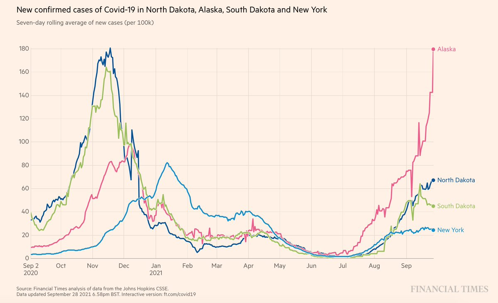
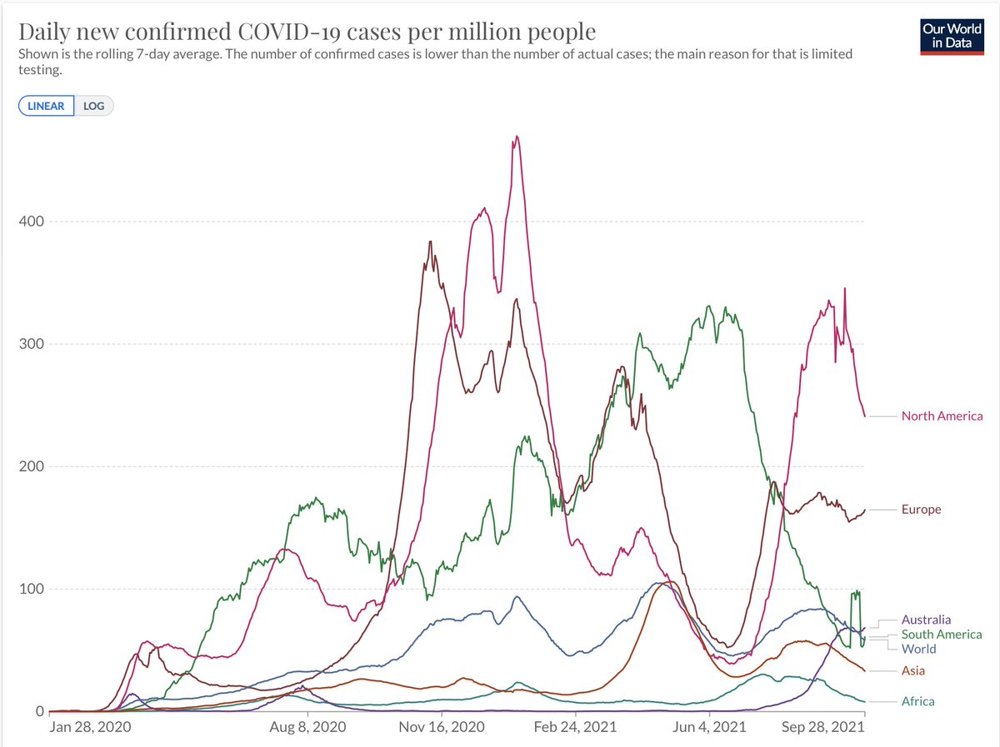
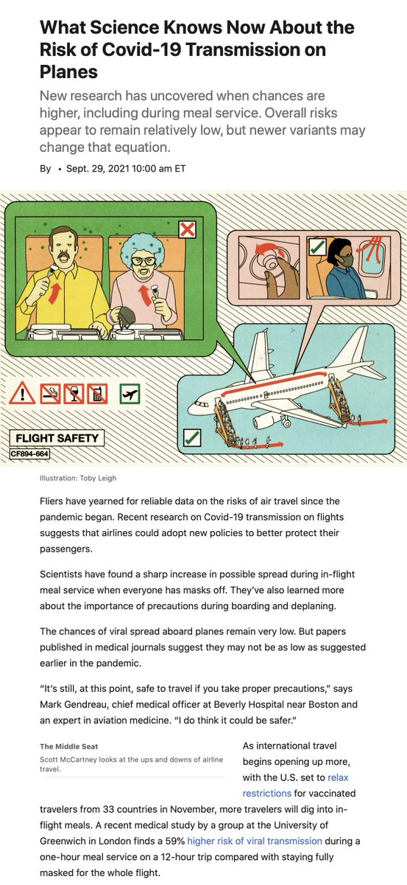
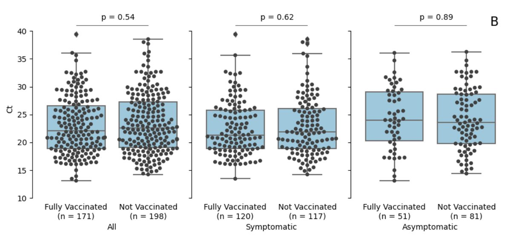
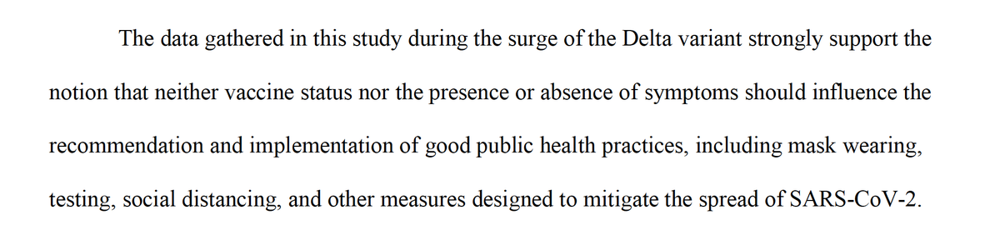
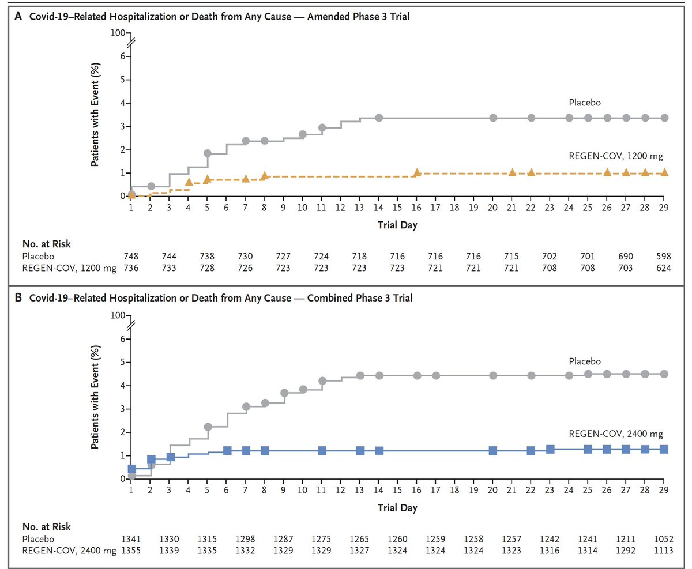
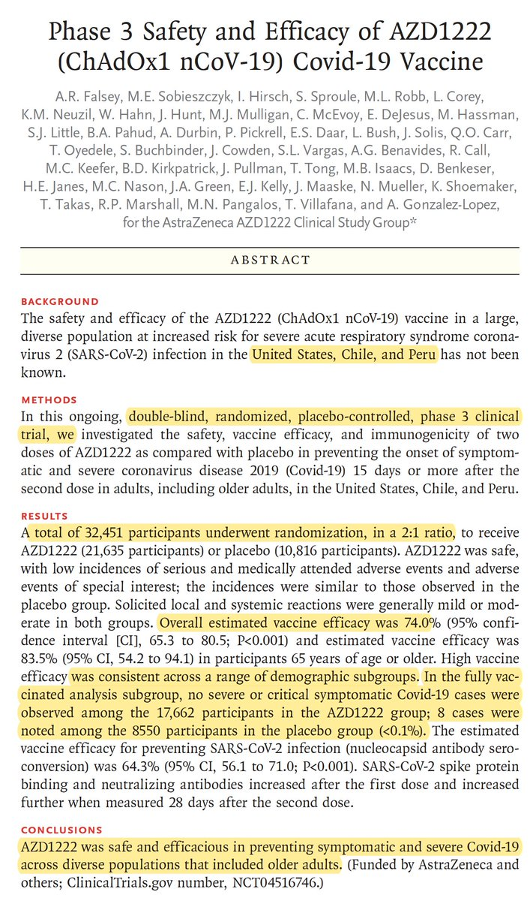
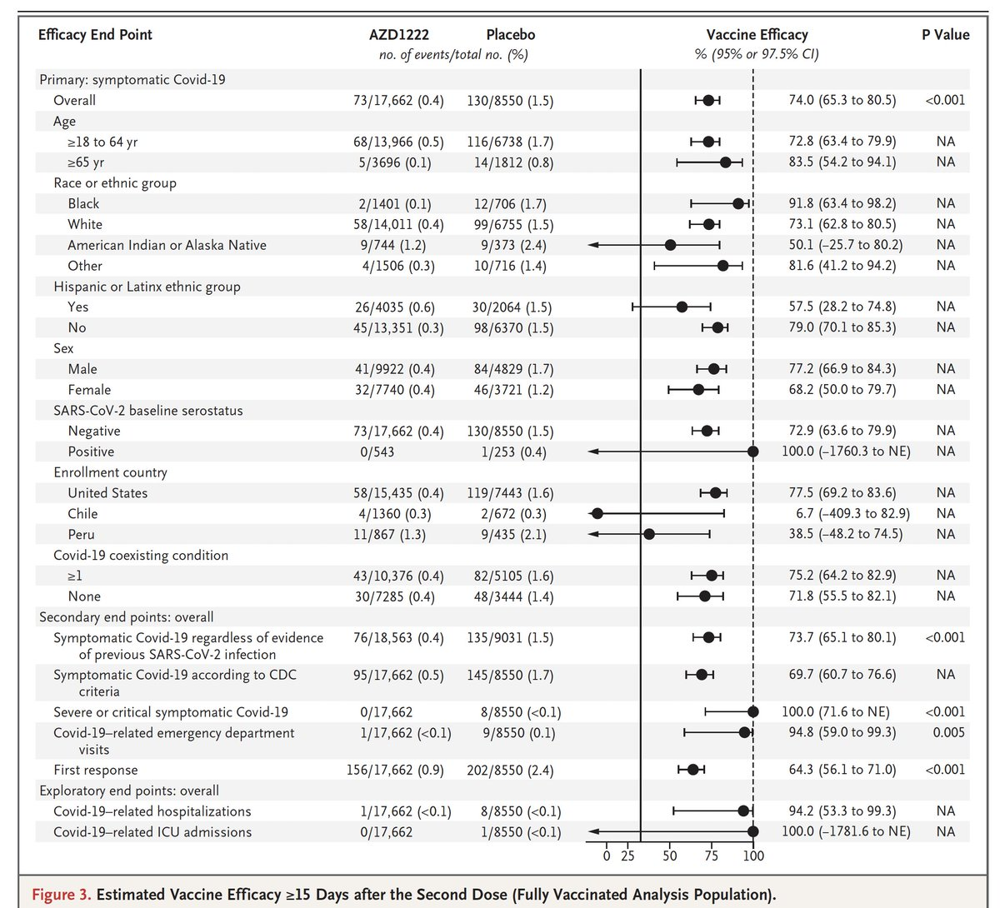
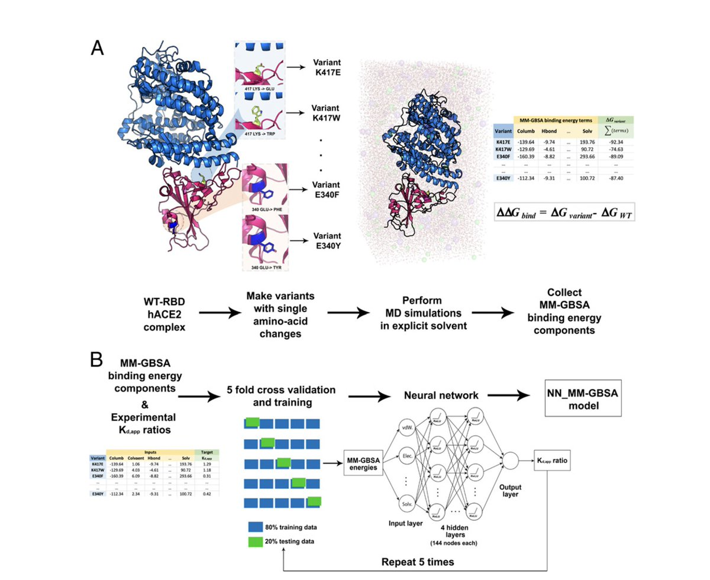

+++
title = "Tweets by Eric Topol Sept 29"
Summary = ""
tags = ["Twitter"]
category = "Twitter"
+++

---

<a href="https://twitter.com/erictopol/status/1443031044840574981" target="_blank" rel="noreferer">01:53 UCT</a>

Now add this to that
https://twitter.com/TheEconomist/status/1443005232938688516

---

<a href="https://twitter.com/erictopol/status/1443043885312184320" target="_blank" rel="noreferer">02:44 UCT</a>

Alaska now has the highest case per capita of any state at any time during the US pandemic 

<a href="FAa4eOXUUAI5YsX.jpg"  ></img></a>

---

<a href="https://twitter.com/erictopol/status/1443222144008159238" target="_blank" rel="noreferer">14:32 UCT</a>

RT @RobertoBurioni: @EricTopol I just gave a lecture on COVID to the residents of my Med School and I presented this picture telling them t…

---

<a href="https://twitter.com/erictopol/status/1443231282062790662" target="_blank" rel="noreferer">15:08 UCT</a>

RT @IanJDickson: The catastrophe in Alaska became national news two weeks ago, I think, when Providence Hospital announced the move to cris…

---

<a href="https://twitter.com/erictopol/status/1443243445061971975" target="_blank" rel="noreferer">15:57 UCT</a>

Descending from Delta. This is as good as the world has looked in many months
@OurWorldInData 

<a href="FAduPdzVcAAy45b.jpg"  ></img></a>

---

<a href="https://twitter.com/erictopol/status/1443248621080563712" target="_blank" rel="noreferer">16:17 UCT</a>

What are the risks of Covid transmission related to air travel? Still much more to learn, may be different with Delta variant. Boarding process and meal service key liabilities
https://www.wsj.com/articles/covid-transmission-flights-planes-recent-research-11632857439?mod=hp_lead_pos13 
“I’m disappointed airlines don’t go for scientific approaches." by @MiddleSeat 

<a href="FAdykPsVIAAeq4n.jpg"  ></img></a>

---

<a href="https://twitter.com/erictopol/status/1443256765466877954" target="_blank" rel="noreferer">16:50 UCT</a>

The title tells the story:  No Significant Difference in Viral Load Between Vaccinated and Unvaccinated, Asymptomatic and Symptomatic Groups Infected with #SARSCoV2 Delta Variant
https://www.medrxiv.org/content/10.1101/2021.09.28.21264262v1 Findings extend prior reports of Delta asymptomatic infections in vaccinated 

<a href="FAd538TVUAMEPpj.jpg"  ></img></a>

---

<a href="https://twitter.com/erictopol/status/1443266213769928704" target="_blank" rel="noreferer">17:27 UCT</a>

PCR cycle threshold (Ct) ≠ transmission liability/risk.
We already know that transmission from vaccinated individuals is low. The magnitude has yet to be quantified. 
But it can happen. That's why their concluding statement is prudent nad helpful 

<a href="FAeC3tiVgAcJW_B.png"  ></img></a>

---

<a href="https://twitter.com/erictopol/status/1443333009940246530" target="_blank" rel="noreferer">21:53 UCT</a>

The Phase 3 randomized, placebo-controlled monoclonal antibody combination trial in outpatients with Covid: marked reduction in risk of hospitalization and death @NEJM https://www.nejm.org/doi/full/10.1056/NEJMoa2108163?query=featured_home 

<a href="FAe-5AxVQAMfUuG.jpg"  ></img></a>

---

<a href="https://twitter.com/erictopol/status/1443336261897392133" target="_blank" rel="noreferer">22:05 UCT</a>

The pivotal trial  of the Astra-Zeneca vaccine in over 32,000 participants, published today @NEJM. 
Vaccine efficacy 74% [95% CI 65,80] vs symptomatic infections; maintained across subgroups, 
age &gt; 65:  84% [54,84] https://www.nejm.org/doi/full/10.1056/NEJMoa2105290?query=featured_home 

<a href="FAfBoKUVUAAPWSb.jpg"  ></img></a><a href="FAfBqpKVUAESk_v.jpg"  ></img></a>

---

<a href="https://twitter.com/erictopol/status/1443343043663306762" target="_blank" rel="noreferer">22:32 UCT</a>

Predicting functional changes from amino acid sequence of #SARSCoV2 spike protein receptor binding domain via training a deep neural network, of potential utility to forecast impact of future variants @PNASNews 
 https://www.pnas.org/content/118/42/e2106480118 #AI 

<a href="FAfIeEwVIAA2Bml.jpg"  ></img></a>