+++
title = "Tweets by Eric Topol Sept 30"
Summary = ""
tags = ["Twitter"]
category = "Twitter"
+++

---

<a href="https://twitter.com/erictopol/status/1443382976591527939" target="_blank" rel="noreferer">01:11 UCT</a>

In today's @NEJM, 120 healthcare workers with breakthrough infections (&gt; 6 months out, Pfizer), 85 (71%) symptomatic, 61% contacts (of those w/likely source) were fully vaccinated, median Ct 22, rapid tests missed many https://www.nejm.org/doi/full/10.1056/NEJMc2113497 

<a href="FAfsT11VcAEhtjf.jpg"  >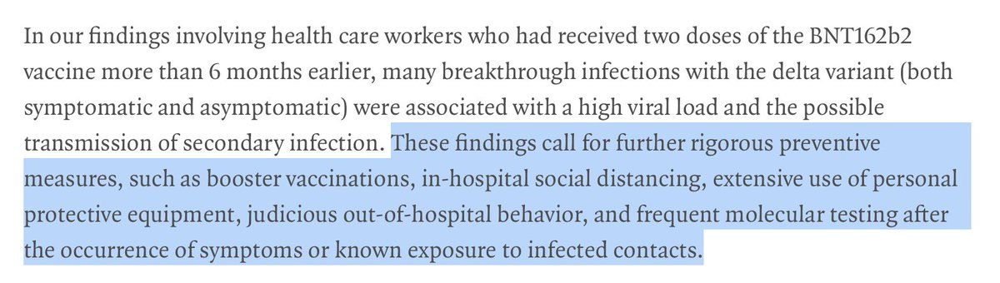</img></a>

---

<a href="https://twitter.com/erictopol/status/1443400288707112960" target="_blank" rel="noreferer">02:20 UCT</a>

@RobinLloyd99 @HelenBranswell @statnews @amymaxmen @Nature Congratulations @HelenBranswell and @amymaxmen 
2 of the very best science journalists getting such well deserved recognition. Thanks for all your extraordinary work!

---

<a href="https://twitter.com/erictopol/status/1443408410012049412" target="_blank" rel="noreferer">02:52 UCT</a>

Good news: US Hospitalizations are declining &gt;1,000 a day, test positivity now &lt; 6% for the first time since July, new cases are down 14% in past week

Bad news: Over 2,300 deaths reported today
https://newsnodes.com/us 

<a href="FAgENqsVkAAYKTG.jpg"  >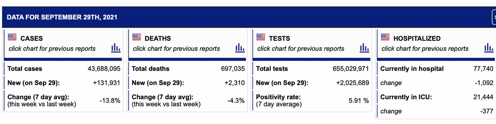</img></a>

---

<a href="https://twitter.com/erictopol/status/1443435447254872070" target="_blank" rel="noreferer">04:40 UCT</a>

Charting the US booster plan, a.k.a. how to model inconsistency
https://www.ft.com/content/0376e5d9-7488-49e8-85e9-a356e6132e1b by @nikasgari @FT  https://twitter.com/EricTopol/status/1441163583929290763

<a href="FAgbbSoUUAEwgEc.jpg"  >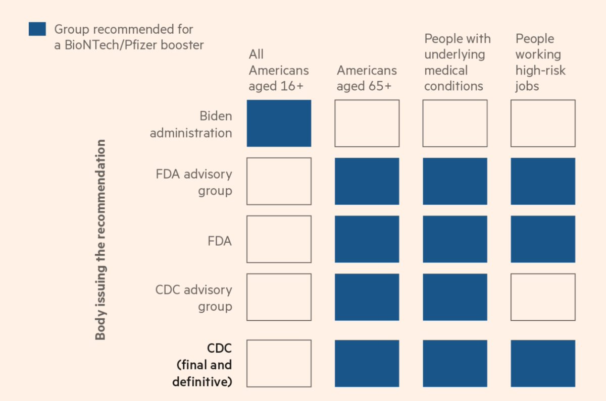</img></a>

---

<a href="https://twitter.com/erictopol/status/1443556780592623622" target="_blank" rel="noreferer">12:42 UCT</a>

In today's @nytimes 
The remarkable work of Drs @PeterHotez and @mebottazzi to help achieve global vaccination  @TexasChildrens 🙏👋👋 

<a href="FAiKO6qVcAQtM_4.jpg"  >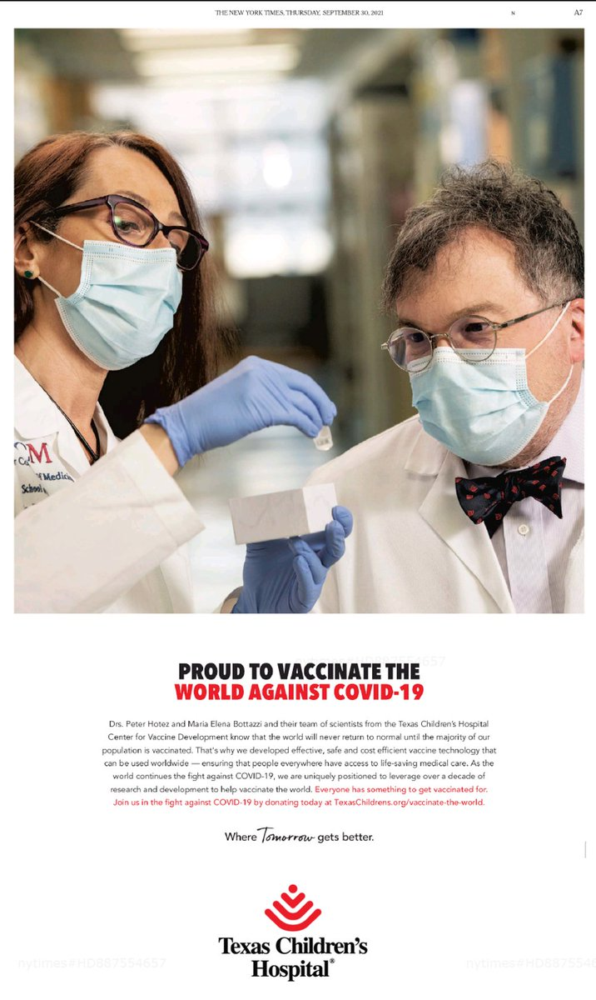</img></a>

---

<a href="https://twitter.com/erictopol/status/1443569357007642635" target="_blank" rel="noreferer">13:32 UCT</a>

Will the Northeast succumb to the US Delta wave?
If Connecticut is the bellwether, it looks like the answer is no, holding strong.
Lowest US state in cases/population (14) with 13% decline and hospitalizations down 19% in past 2 weeks,  test positivity 2.2% and dropping, vax 69% 

<a href="FAiWZTbVQAcS5gC.jpg"  >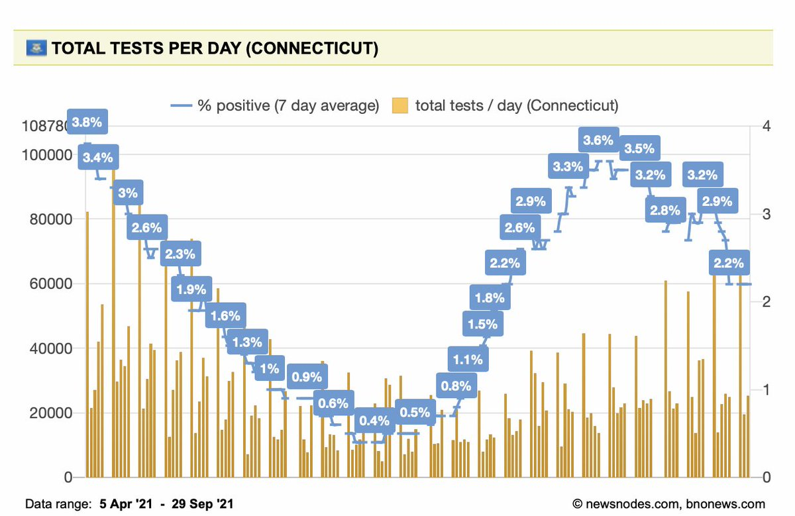</img></a><a href="FAiWblDVIAsKlhq.jpg"  >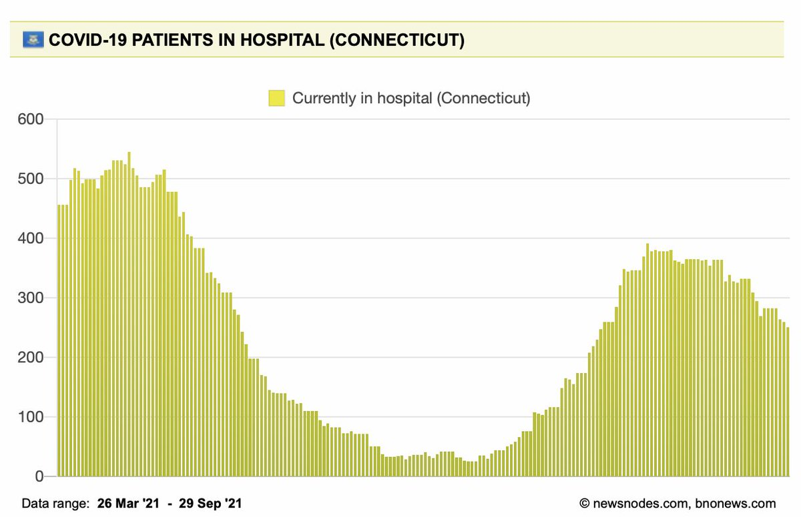</img></a>

---

<a href="https://twitter.com/erictopol/status/1443605872853221382" target="_blank" rel="noreferer">15:57 UCT</a>

Vaccination reduces transmission; the extent appears to vary with the vaccine and the #SARSCoV2 strain
https://www.medrxiv.org/content/10.1101/2021.09.28.21264260v1
Alpha: Pfizer 82%, AZ 63% reduction
Delta: Pfizer  65%, AZ 36% reduction
see preprints for 95% CI, more context and details, such as duration 

<a href="FAi3KziUYAYP_WN.jpg"  >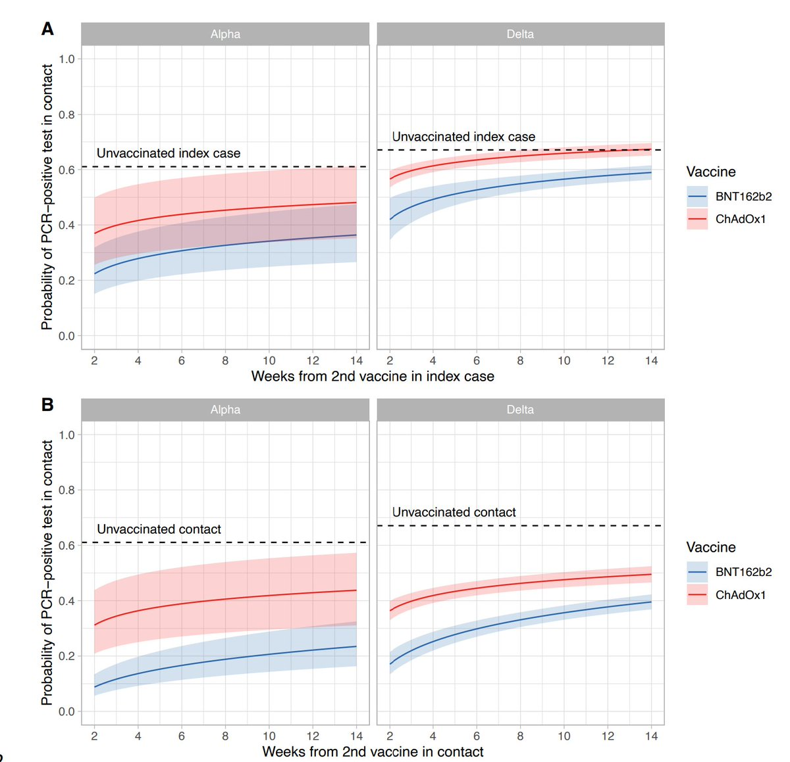</img></a><a href="FAi3aQCUUAoc8g8.jpg"  >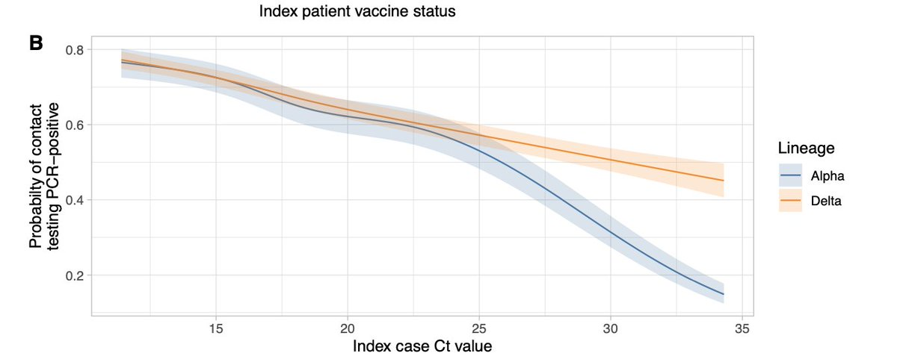</img></a>

---

<a href="https://twitter.com/erictopol/status/1443628481946918912" target="_blank" rel="noreferer">17:27 UCT</a>

The relationship of #SARSCoV2 genomic variant (by sequencing), risk of hospitalization, and reduction by vaccination
https://www.medrxiv.org/content/10.1101/2021.09.29.21264272v1
Beta, Gamma, and Delta infections all increase risk of hospitalization
Vaccination reduces that risk across all major variants
@paredesmig 

<a href="FAjMbFNUYAERykT.jpg"  >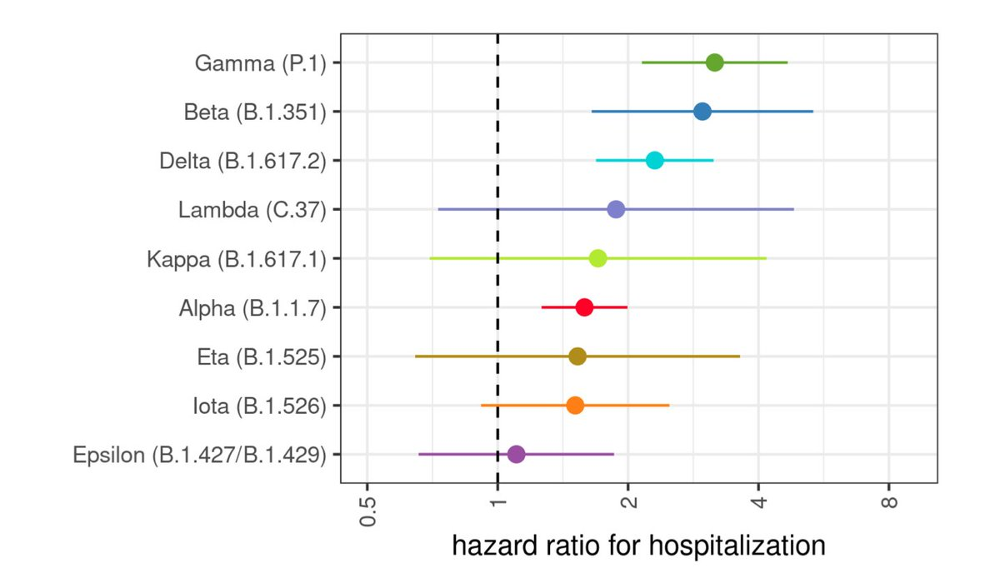</img></a><a href="FAjI7V2VUAEhw6H.jpg"  >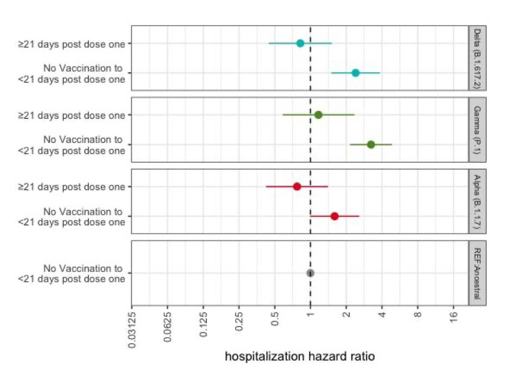</img></a>

---

<a href="https://twitter.com/erictopol/status/1443636451850145794" target="_blank" rel="noreferer">17:58 UCT</a>

We're at 56% US total population fully vaccinated.
We need to get to at least 75% to achieve containment, as has been determined by at least 12 countries (w/ caveats and contingencies)
https://news.yahoo.com/what-is-bidens-vaccination-target-194153503.html
by @alexnazaryan @YahooNews 

<a href="FAjTd2HUYAAy8eE.jpg"  >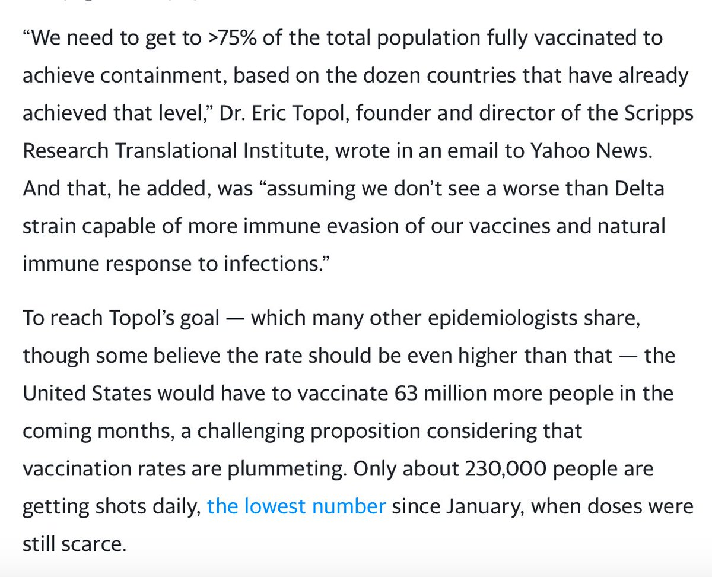</img></a>

---

<a href="https://twitter.com/erictopol/status/1443658514719641613" target="_blank" rel="noreferer">19:26 UCT</a>

Thrilled to see @r_tewhey, our former superstar graduate student @ScrippsRTI @scrippsresearch, now @jacksonlab, getting this prestigious recognition and innovator award  https://twitter.com/genome_gov/status/1443578628906704896

<a href="FAjnmjEUUAAk4Qs.jpg"  >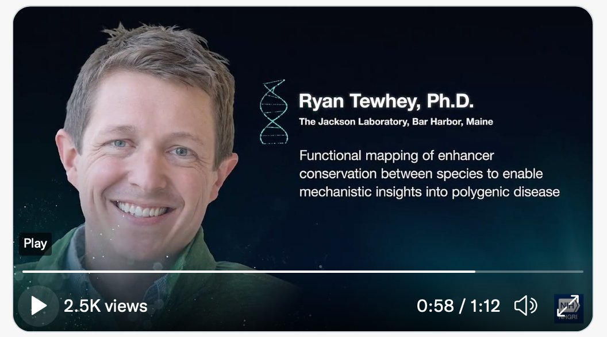</img></a>

---

<a href="https://twitter.com/erictopol/status/1443702187159285784" target="_blank" rel="noreferer">22:19 UCT</a>

Does vaccination reduce the severity and life impact of #LongCovid?  A new preprint study with 455 vaccinated individuals and 455 matched controls supports benefit at 4 months follow-up
https://papers.ssrn.com/sol3/papers.cfm?abstract_id=3932953 

<a href="FAkPPAjVcBEHMBo.jpg"  >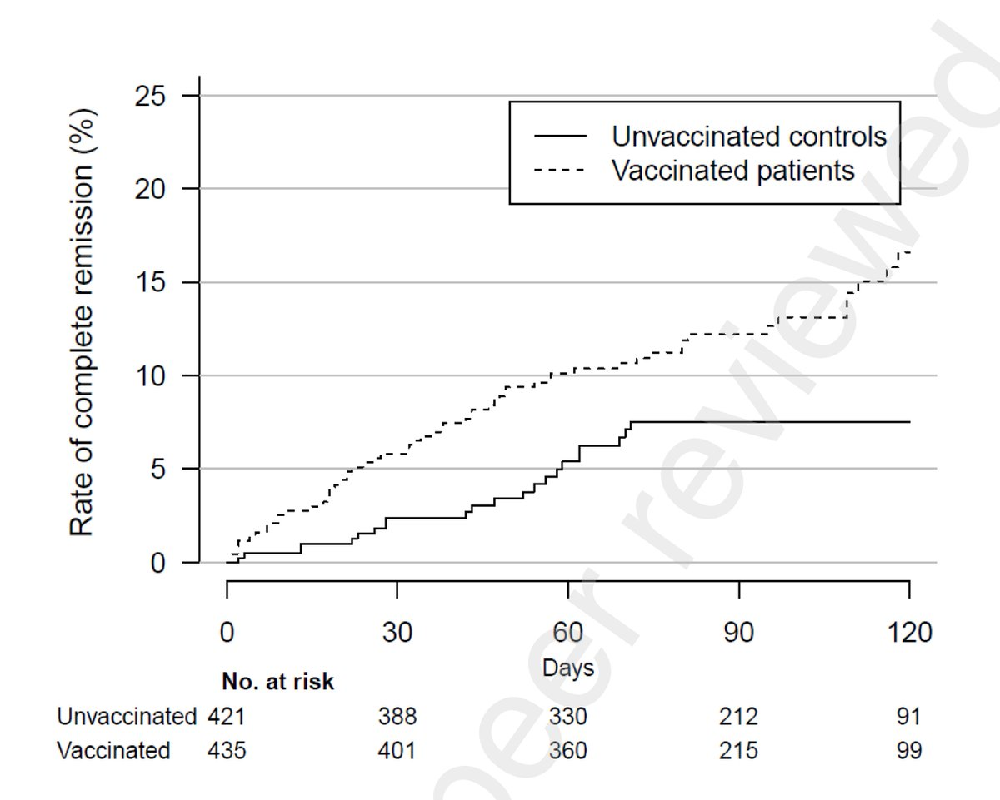</img></a>