+++
title = "Tweets by Eric Topol Oct 01"
Summary = ""
tags = ["Twitter"]
category = "Twitter"
+++

---

<a href="https://twitter.com/erictopol/status/1443747910756093953" target="_blank" rel="noreferer">01:21 UCT</a>

Good progress. Delta descent metrics despite concerns about schools broadly open. https://twitter.com/BNODesk/status/1443741744651280384

---

<a href="https://twitter.com/erictopol/status/1443752872752021510" target="_blank" rel="noreferer">01:41 UCT</a>

RT @AngelsRAmongU: Long story short; everyone in the mentioned study already had long term Covid. Those who were vaccinated, had doubled th…

---

<a href="https://twitter.com/erictopol/status/1443761621839450114" target="_blank" rel="noreferer">02:16 UCT</a>

Such data has been remarkably hard to come by and these findings are certainly encouraging

---

<a href="https://twitter.com/erictopol/status/1443784667291815968" target="_blank" rel="noreferer">03:47 UCT</a>

What's 7 times incalculable?
The number of lost American lives from Covid passed 700,000 tonight 

<a href="FAlaBgVVcAIOEgq.jpg"  >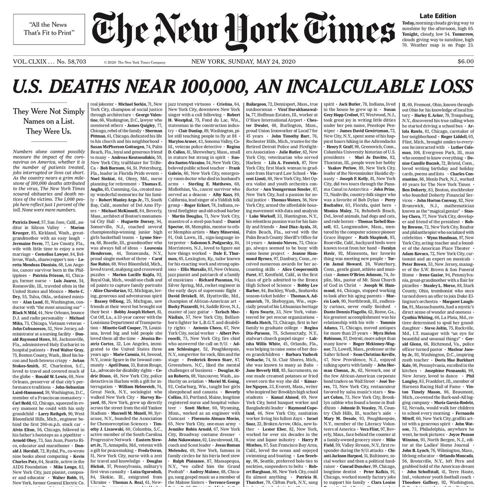</img></a>

---

<a href="https://twitter.com/erictopol/status/1443793844512849922" target="_blank" rel="noreferer">04:24 UCT</a>

@AndrewMcGIsMe @DrChrisMD Well said. So sorry for the loss of your father, @DrChrisMD. He had to have been immensely proud of you.

---

<a href="https://twitter.com/erictopol/status/1443913955202650116" target="_blank" rel="noreferer">12:21 UCT</a>

This could turn out to be one of the most important advances to counter Covid. Molnupiravir, a pill for 5 days (I'll nickname "M-pack") to markedly reduce hospitalization. Await details beyond press release, including safety
https://www.statnews.com/2021/10/01/mercks-antiviral-pill-reduces-hospitalization-of-covid-patients-a-possible-game-changer-for-treatment/ by @matthewherper @statnews 

<a href="FAnPe75VUAILfBF.png"  >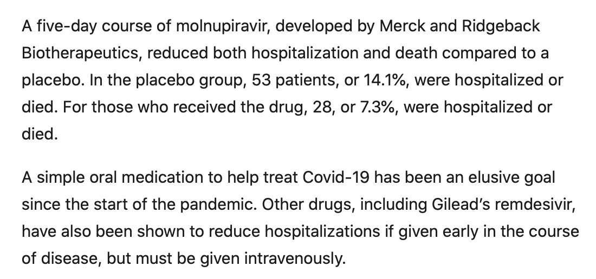</img></a>

---

<a href="https://twitter.com/erictopol/status/1443917044643098630" target="_blank" rel="noreferer">12:33 UCT</a>

Molnupiravir is a broad spectrum anti-viral that achieves "lethal mutagenesis" of #SARSCoV2. Unlike remdesivir, it's a pill, it's not repurposed, had solid data from a Phase 2 trial supporting potency + safety vs Covid https://www.nature.com/articles/s41594-021-00657-8 @nature The mechanism of action 👇 

<a href="FAnSA9ZVQAAYAFC.jpg"  >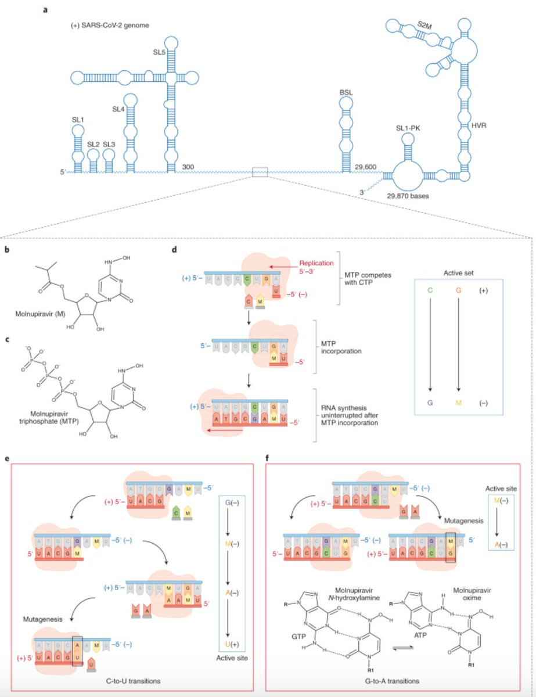</img></a>

---

<a href="https://twitter.com/erictopol/status/1443917688028352516" target="_blank" rel="noreferer">12:36 UCT</a>

The fact that the new clinical trial was stopped by the Data and Safety Monitoring Board early because of overwhelming efficacy, deeming it unethical to proceed, would be considered a Eureka moment in the fight against Covid

---

<a href="https://twitter.com/erictopol/status/1443924633149853697" target="_blank" rel="noreferer">13:03 UCT</a>

A few additional points
—Entry criteria mild to moderate Covid
—8 deaths in the placebo group, 0 w/ M-pack
—Efficacy seen across multiple variants, including Delta
—I have a long history vs Merck (Vioxx) w/ a bias against this company (drug was made by Ridgeback Biotherapuetics)

---

<a href="https://twitter.com/erictopol/status/1443931586471235589" target="_blank" rel="noreferer">13:31 UCT</a>

Our covid times :-)
by @stephanpastis 
Stay positive 

<a href="FAngDg-VUAMJnmL.jpg"  >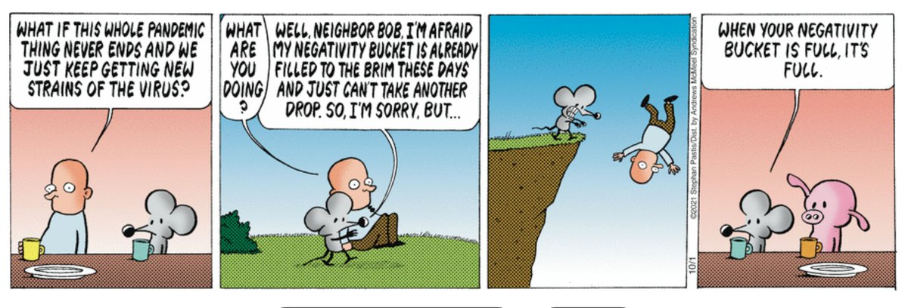</img></a>

---

<a href="https://twitter.com/erictopol/status/1443941931109654529" target="_blank" rel="noreferer">14:12 UCT</a>

Substantial waning of immunity for both neutralizing antibodies and T cell response at 7 months after Pfizer vaccination
https://www.biorxiv.org/content/10.1101/2021.09.30.462488v1 by @SutharLab @EmoryUniversity and collaborators 

<a href="FAnpgaJVcAM3cxt.jpg"  >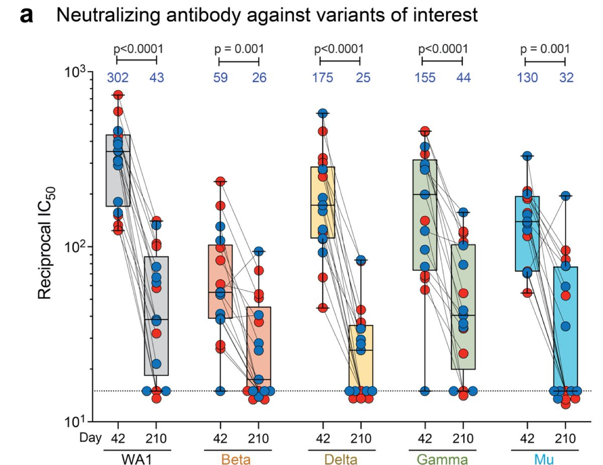</img></a><a href="FAnpEzqVEAAHg2U.jpg"  >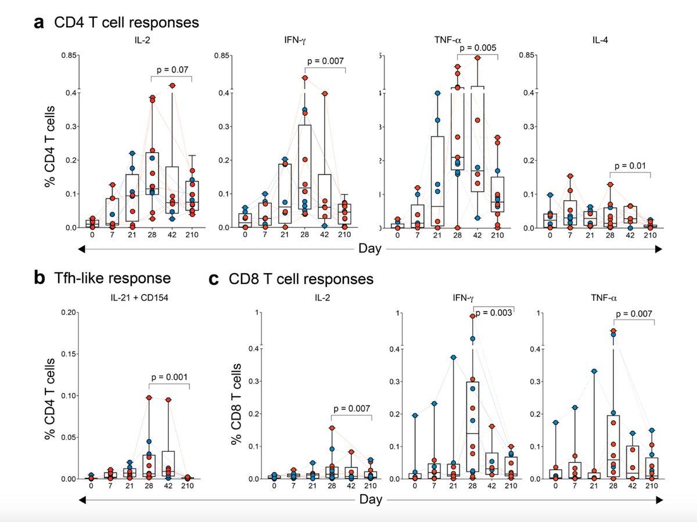</img></a>

---

<a href="https://twitter.com/erictopol/status/1443942714748256259" target="_blank" rel="noreferer">14:15 UCT</a>

@jsnover As a small molecule, eminently scalable and projected to make ~10 million doses in the next few months

---

<a href="https://twitter.com/erictopol/status/1443943055216680960" target="_blank" rel="noreferer">14:17 UCT</a>

"Notably, a significant proportion of vaccinees have neutralizing titers below the detection limit, and suggest a 3rd booster immunization might be warranted to enhance the antibody titers and T cell responses."

---

<a href="https://twitter.com/erictopol/status/1443963542684651528" target="_blank" rel="noreferer">15:38 UCT</a>

A hospital Delta outbreak starting with a Covid patient, infects 41 other: patients, staff (wearing masks), and family, of whom 39 (96%) were fully vaccinated but &gt; 5 months out. Transmission between health care workers
https://www.eurosurveillance.org/content/10.2807/1560-7917.ES.2021.26.39.2100822#html_fulltext 

<a href="FAn8b63UUAQScwh.jpg"  >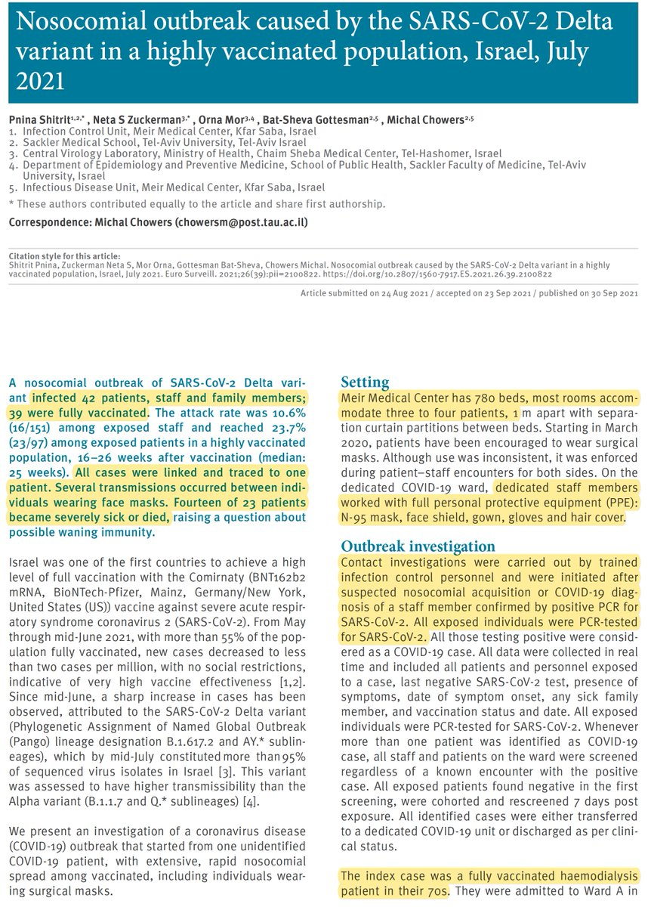</img></a><a href="FAn8eCtVEAMA1ev.jpg"  >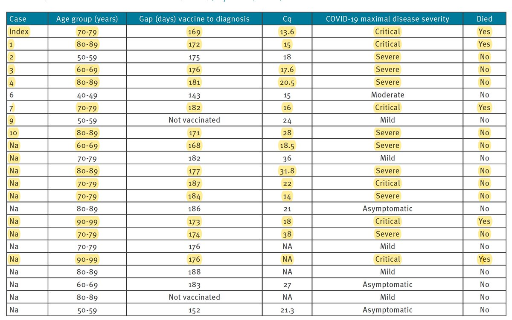</img></a>

---

<a href="https://twitter.com/erictopol/status/1443967707544625153" target="_blank" rel="noreferer">15:55 UCT</a>

Compare this with intravenous monoclonal antibodies in Phase 3 trial @NEJM this wk, a 71% reduction (4.6% vs 1.3%) hospitalization/death for outpatients w/ Covid &lt; 7 days from symptom onset. https://www.nejm.org/doi/full/10.1056/NEJMoa2108163?query=featured_home
M-pack trial much higher risk patients: 14.3% in  placebo group

---

<a href="https://twitter.com/erictopol/status/1443984639773663232" target="_blank" rel="noreferer">17:02 UCT</a>

Inconvenient truth #3: T cell response
https://twitter.com/EricTopol/status/1443941931109654529

---

<a href="https://twitter.com/erictopol/status/1443987901176369155" target="_blank" rel="noreferer">17:15 UCT</a>

Today's news about what appears to be a highly effective pill is welcome, to add to the anti-Covid armamentarium. What is missing, big, and for a long time, is this, and it needs to/can get fixed STAT:
https://www.nytimes.com/2021/10/01/opinion/rapid-tests-covid.html @nytopinion by @michaelmina_lab and Steven Phillips 

<a href="FAoRoukVkAI_eHl.jpg"  >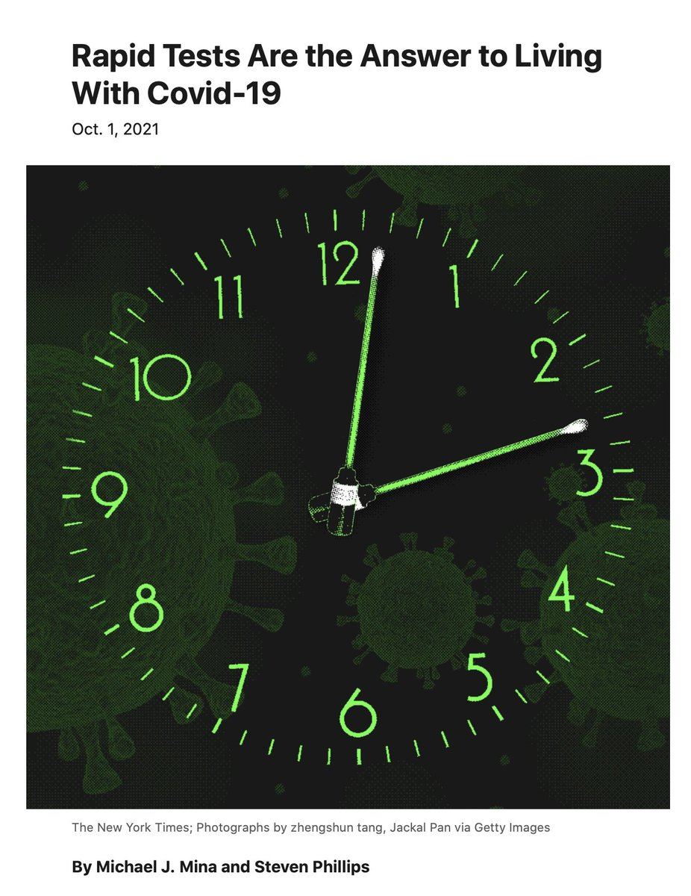</img></a><a href="FAoTCR4VkAEIRdH.jpg"  >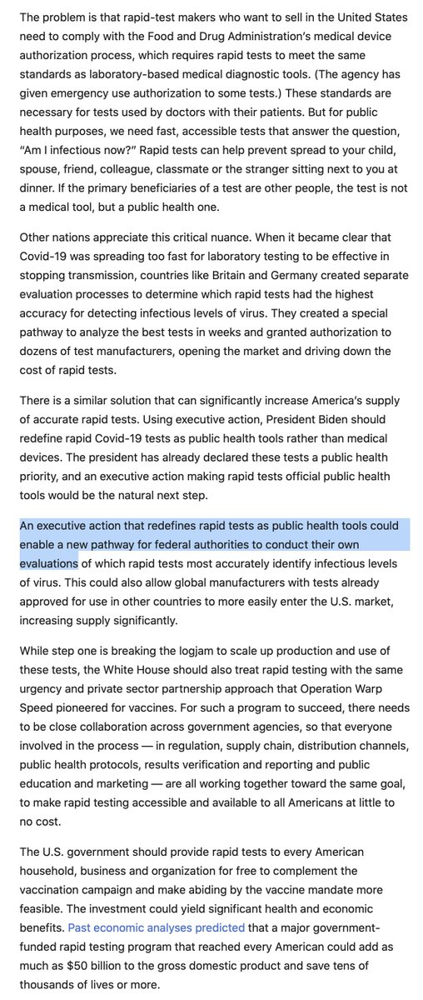</img></a>

---

<a href="https://twitter.com/erictopol/status/1443996282377228290" target="_blank" rel="noreferer">17:48 UCT</a>

2 new @CDCMMWR reports for preventing Covid infections in summer camps, a high-risk setting: 
vaccination, testing, mitigation measures collectively achieved near total protection
https://www.cdc.gov/mmwr/volumes/70/wr/mm7040e1.htm?s_cid=mm7040e1_w (on prevention)
https://www.cdc.gov/mmwr/volumes/70/wr/mm7040e2.htm?s_cid=mm7040e2_w (on risk) 

<a href="FAoaPLkVUAA7ETm.jpg"  >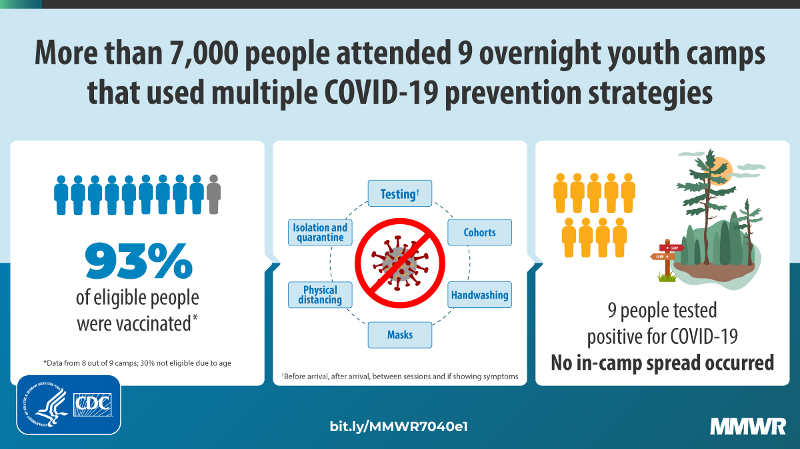</img></a>

---

<a href="https://twitter.com/erictopol/status/1444015638905700353" target="_blank" rel="noreferer">19:05 UCT</a>

More vaccination, less deaths, by state, updated to Sep 29th
https://www.nytimes.com/2021/10/01/us/us-covid-deaths-700k.html
A very strong relationship
Florida remains the big outlier 

<a href="FAosQ2EVcAQaFkQ.jpg"  >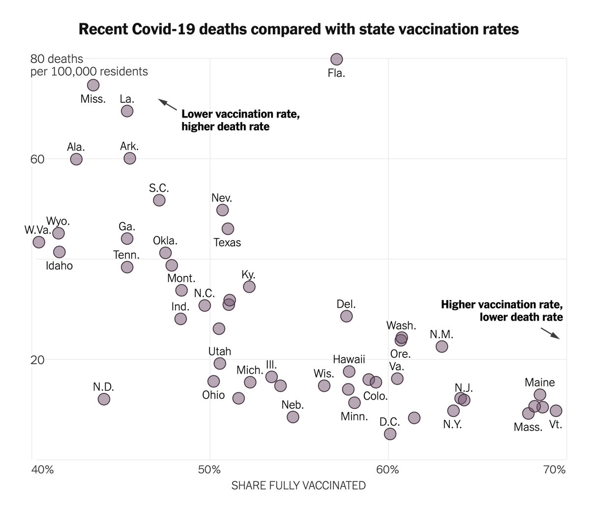</img></a>

---

<a href="https://twitter.com/erictopol/status/1444017551965442054" target="_blank" rel="noreferer">19:13 UCT</a>

It is outrageous that Merck is charging the government $700 per 5-pill pack of this drug. And that the US has not negotiated it down to a fair price.
https://www.nytimes.com/2021/10/01/us/merck-antiviral-pill-covid.html by @RebeccaDRobbins 
That companies continue to gouge in the midst of a pandemic is unconscionable 

<a href="FAotOPcVcAEPMlM.png"  >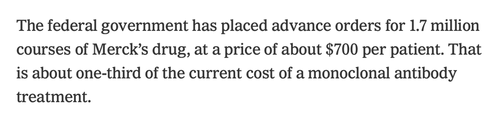</img></a>

---

<a href="https://twitter.com/erictopol/status/1444052418556170241" target="_blank" rel="noreferer">21:31 UCT</a>

Delta and #COVIDisAirborne 
https://www.nytimes.com/2021/10/01/health/coronavirus-aerosols-airborne.html @NYTScience by @apoorva_nyc 
Upgrade masks to counter it
https://www.scientificamerican.com/article/why-we-need-to-upgrade-our-face-masks-and-where-to-get-them/ @sciam by @tanyalewis314 

<a href="FApNnUMVEAMK7PO.jpg"  >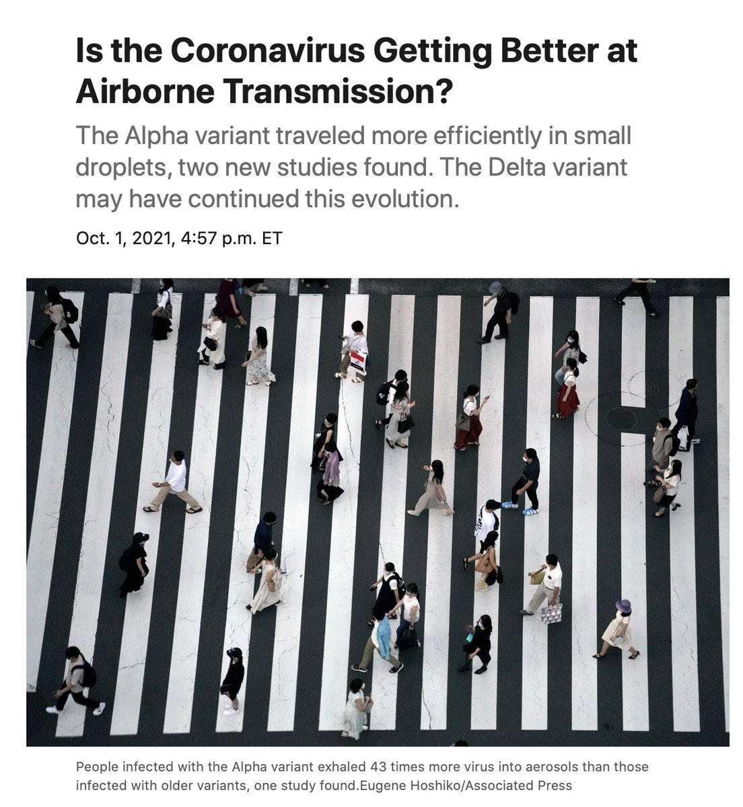</img></a><a href="FApN274UYAEL6Dl.jpg"  >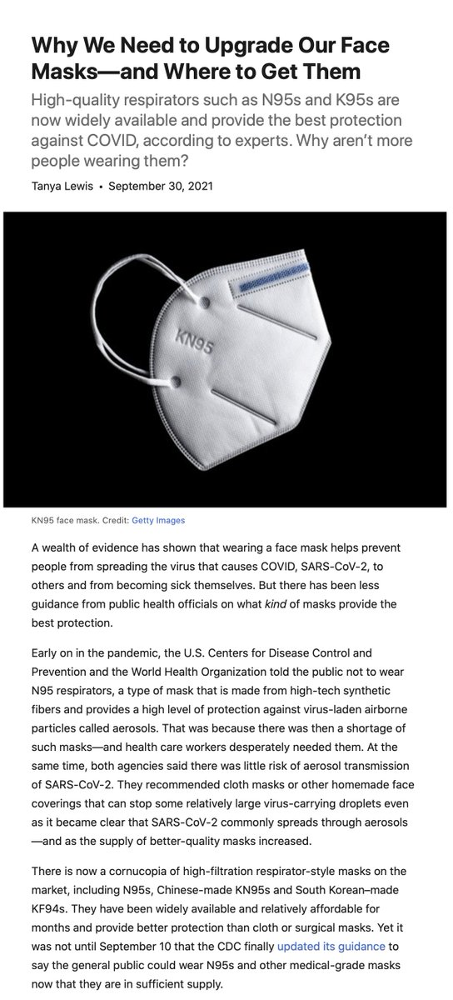</img></a>

---

<a href="https://twitter.com/erictopol/status/1444064049277202432" target="_blank" rel="noreferer">22:17 UCT</a>

Clarification regarding term "reduction"
Data in above post are adjusted odds ratios (aOR)
Alpha: Pfizer 62%, AZ 38% reduction (R)
Delta:  Pfizer 37%, AZ 15%  reduction
Thanks @JamesWard73, pointing out the difference (aOR v R)when the base probability of infection isn't very low

