+++
title = "Tweets by Eric Topol Oct 02"
Summary = ""
tags = ["Twitter"]
category = "Twitter"
+++

---

<a href="https://twitter.com/erictopol/status/1444099662340780032" target="_blank" rel="noreferer">00:39 UCT</a>

Portugal is the country with the highest fully vaccinated population in the world (86%) and 98% age 12+. No Covid restrictions. All Delta. 
Look what happens vs US with 30 per cent points lower fully vaccinated (56%)
https://www.nytimes.com/2021/10/01/world/europe/portugal-vaccination-rate.html @MarcSantoraNYT @RaphaelMinder 

<a href="FAp3_iMVUAIS5HZ.jpg"  >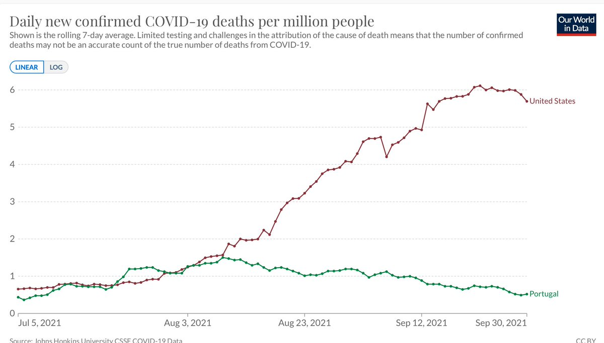</img></a><a href="FAp4D1gVUAMVu35.jpg"  >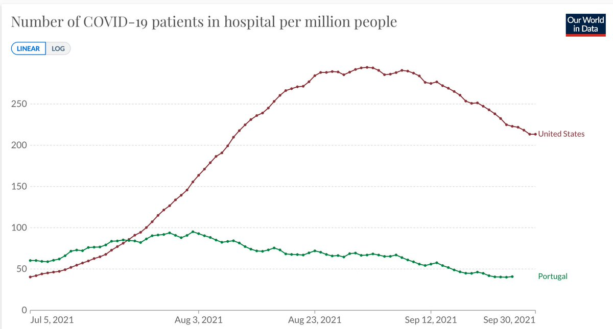</img></a><a href="FAp4Gi8VkAEXEru.jpg"  >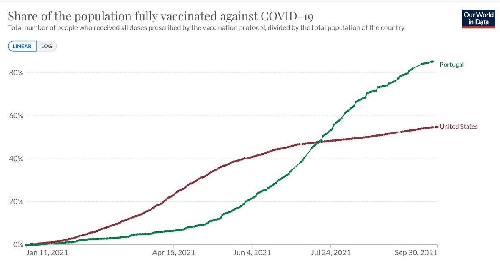</img></a><a href="FAp4H6oVEAMFjtJ.jpg"  >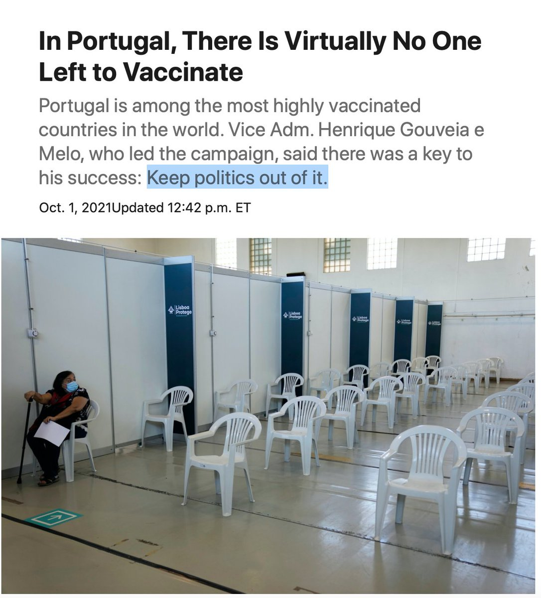</img></a>

---

<a href="https://twitter.com/erictopol/status/1444110873291677698" target="_blank" rel="noreferer">01:23 UCT</a>

Here's the simplified, pragmatic, best translation of this important and unique study, by @DrTomFrieden 
https://twitter.com/DrTomFrieden/status/1444031518146535424

---

<a href="https://twitter.com/erictopol/status/1444320142427504654" target="_blank" rel="noreferer">15:15 UCT</a>

In the United States, 400,000 covid deaths (of 700K) occurred after the 1st vaccines were given. Almost all of the last 200,00 deaths would have been prevented if these people had been vaccinated
https://www.nytimes.com/2021/10/01/us/us-covid-deaths-700k.html @LaurenLeatherby 

<a href="FAtBWR0XsAkT1xW.jpg"  >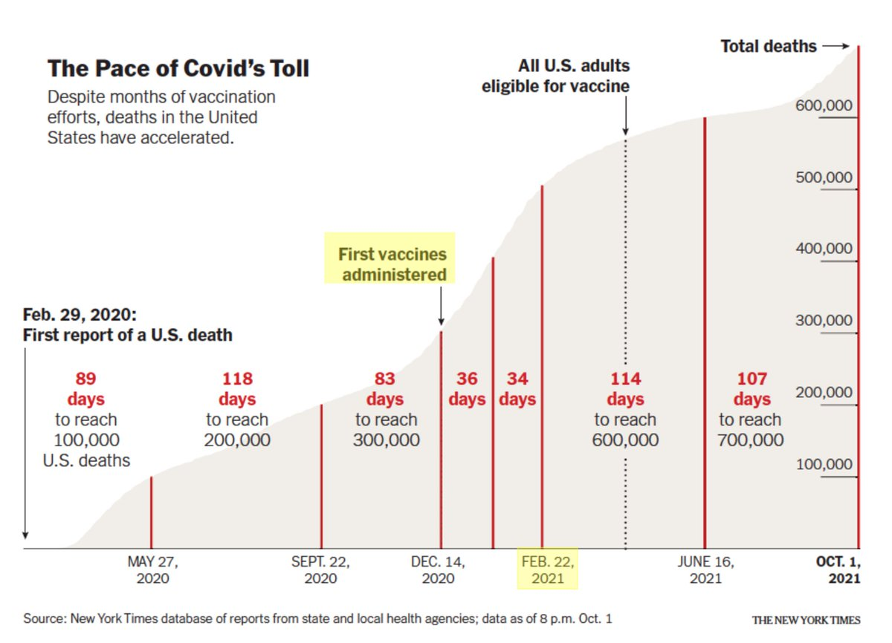</img></a>

---

<a href="https://twitter.com/erictopol/status/1444321489528844294" target="_blank" rel="noreferer">15:20 UCT</a>

The unnecessary loss of lives of young people (age 25-54) were the highest for the pandemic in recent weeks, at a time when vaccines were abundantly available to all 

<a href="FAtCLtsXoAI69fq.jpg"  >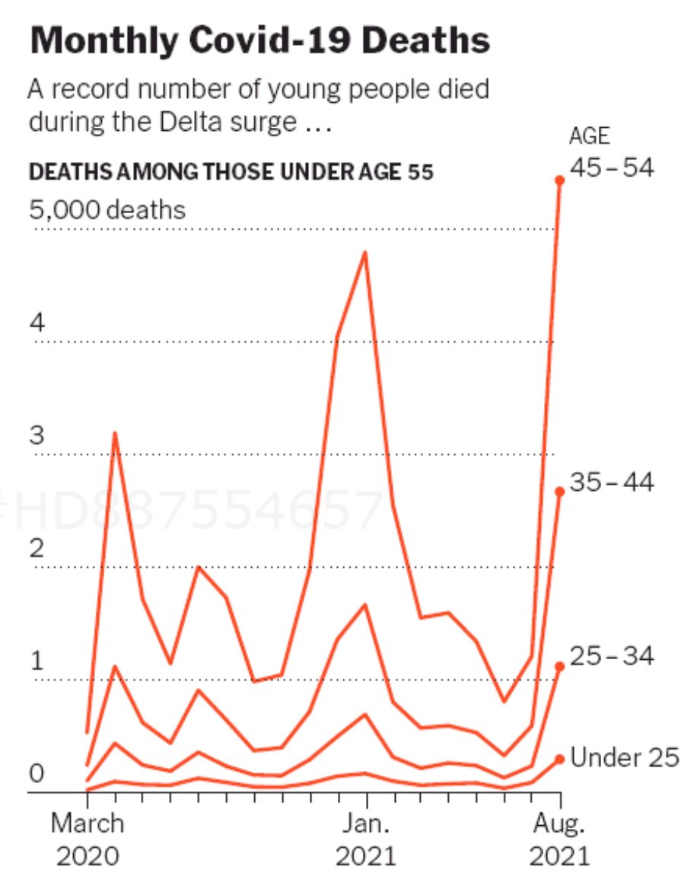</img></a>

---

<a href="https://twitter.com/erictopol/status/1444341158377783299" target="_blank" rel="noreferer">16:39 UCT</a>

The immune response to mRNA vaccination is different from and complementary to that of natural Covid infection https://www.medrxiv.org/content/10.1101/2021.09.30.21264363v1 (FL=full length spike, S1, S2 are subunits of the spike protein, V=visits) vaccine-&gt; broader and more diverse Abs, Covid -&gt; OC43 of S2 Abs 

<a href="FAtTuUrUUAISPKs.jpg"  >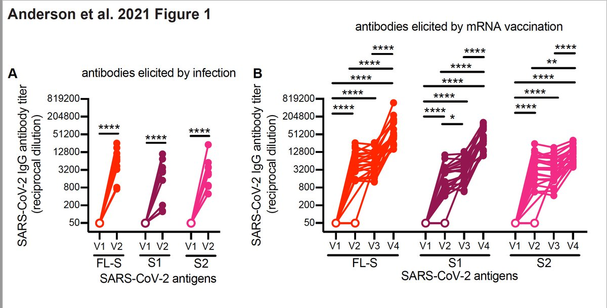</img></a>

---

<a href="https://twitter.com/erictopol/status/1444342099130781696" target="_blank" rel="noreferer">16:42 UCT</a>

For an astute perspective of this study for vaccination potential of treating/reducing the toll of #LongCovid, an outstanding thread by @VirusesImmunity 
https://twitter.com/VirusesImmunity/status/1444306456266825732

---

<a href="https://twitter.com/erictopol/status/1444348353702100993" target="_blank" rel="noreferer">17:07 UCT</a>

In case you were wondering if 3rd shots (boosters) were useful

---

<a href="https://twitter.com/erictopol/status/1444370039243636738" target="_blank" rel="noreferer">18:33 UCT</a>

We will soon have all the tools needed to end the pandemic, if only we had them🌍and were fully used
✓ vaccines
✓ masks + mitigation measures (distancing, ventilation, etc)
✓ pill ("M-pack"+ others) &amp; monoclonal Abs as backup
✓ rapid tests (more important than ever w/a pill)

---

<a href="https://twitter.com/erictopol/status/1444377300217122820" target="_blank" rel="noreferer">19:02 UCT</a>

"While science may aspire to stand on the shoulders of giants, vaccine inequity has trampled on the hopes of the vulnerable"—@AdamJKucharski in his review of @d_spiegel &amp; @anthonybmasters COVID by Numbers new book
https://www.thelancet.com/journals/lancet/article/PIIS0140-6736(21)02128-0/fulltext @TheLancet 

<a href="FAt0nbrVEAICmaH.jpg"  >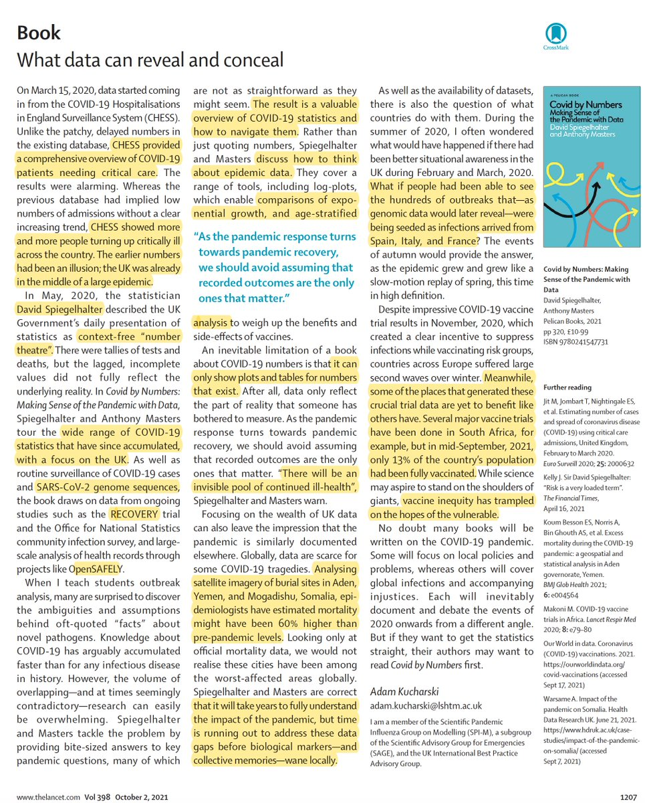</img></a>

---

<a href="https://twitter.com/erictopol/status/1444387380878741511" target="_blank" rel="noreferer">19:42 UCT</a>

Yesterday, the US hospitalizations dropped below 75,000 for the 1st time in over 6 weeks
The fact that's even a milestone of progress, when most of these were preventable, says a lot. 

<a href="FAt-cF0VkAAfa52.jpg"  >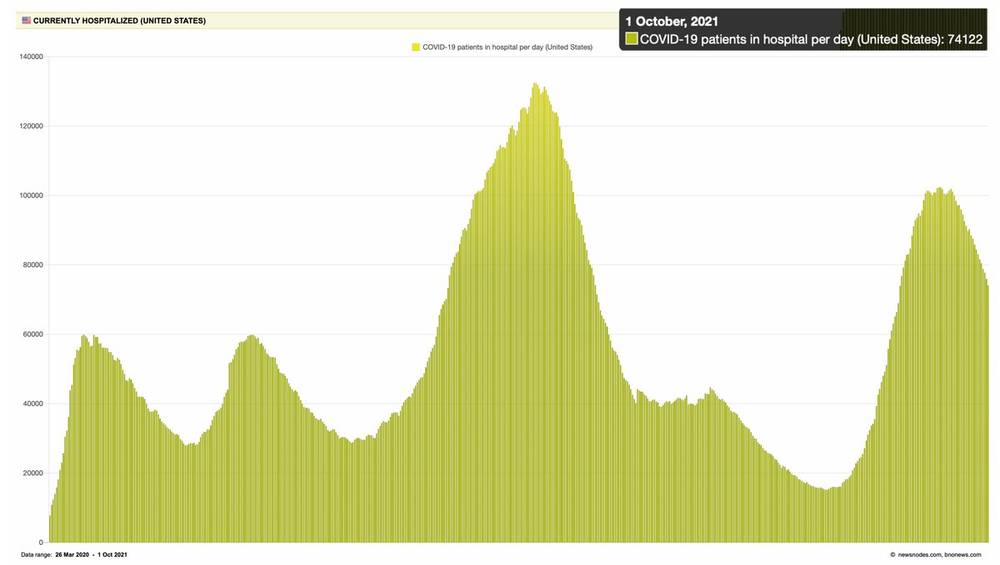</img></a>

---

<a href="https://twitter.com/erictopol/status/1444403434690465792" target="_blank" rel="noreferer">20:46 UCT</a>

The US, now #50, is falling faster on the global vaccination list than on any reduction in cases or hospitalizations. 
https://ig.ft.com/coronavirus-vaccine-tracker/?areas=gbr&areas=isr&areas=usa&areas=eue&areas=can&areas=chn&areas=ind&cumulative=1&doses=total&populationAdjusted=1 

<a href="FAuNGltVUAE0UKf.jpg"  >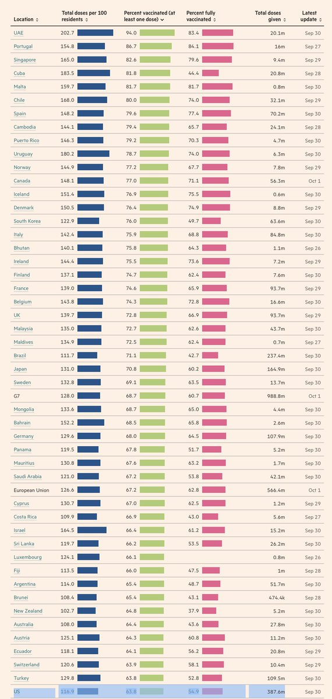</img></a>

---

<a href="https://twitter.com/erictopol/status/1444429565590327299" target="_blank" rel="noreferer">22:30 UCT</a>

RT @JamesSurowiecki: Given that vaccines reduce the risk of death in younger people to almost zero, it's absolutely brutal that 4000 people…

---

<a href="https://twitter.com/erictopol/status/1444433086410747909" target="_blank" rel="noreferer">22:44 UCT</a>

Linear RNA is big, as in mRNA vaccines
Is circular RNA next ?
https://www.bloomberg.com/news/articles/2021-10-01/can-rna-be-altered-scientists-could-bend-strands-into-circles-to-treat-cancer 

<a href="FAungjvVUAAxi09.jpg"  >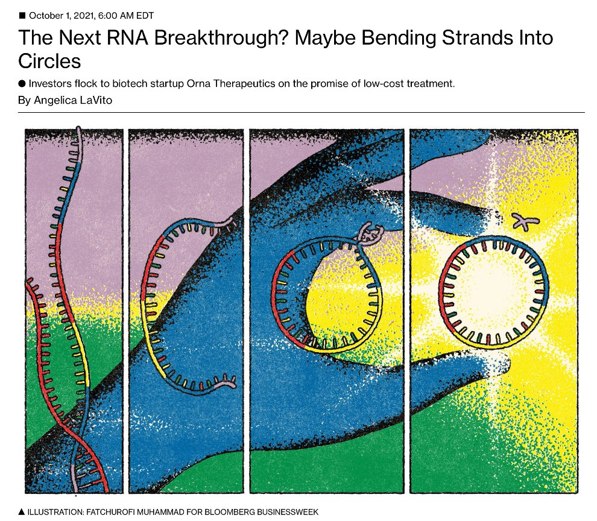</img></a><a href="FAuoKLsVgAITpn5.jpg"  >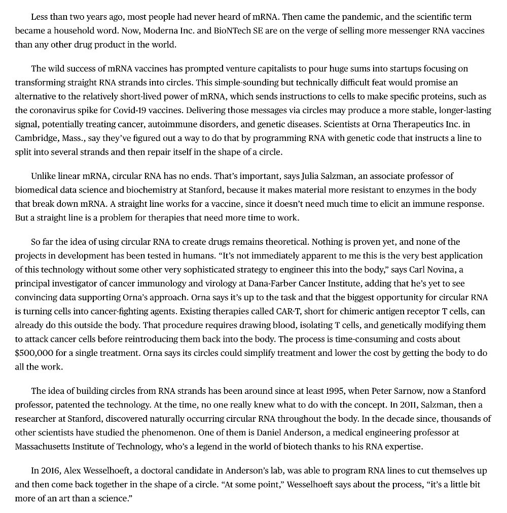</img></a><a href="FAundU7UcAkwvvD.jpg"  >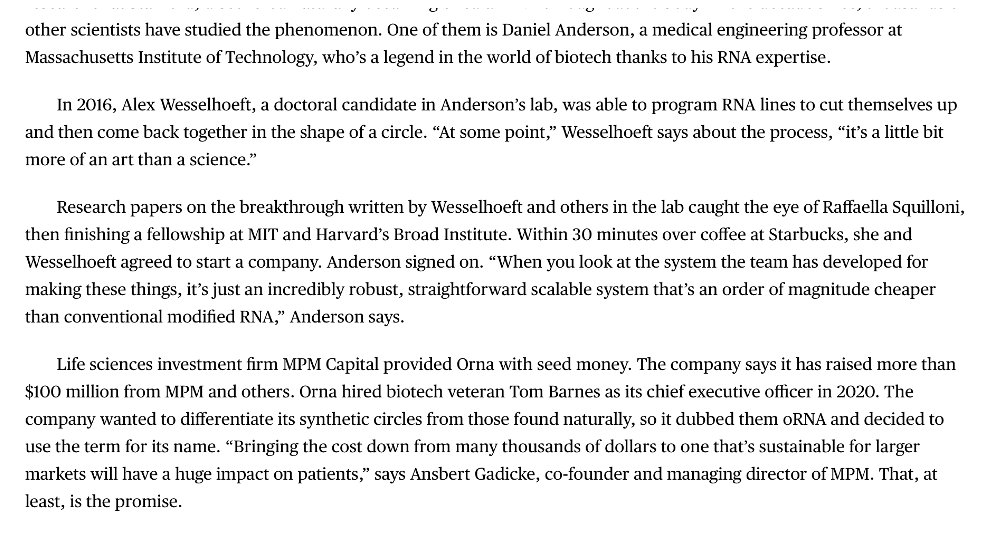</img></a>

---

<a href="https://twitter.com/erictopol/status/1444437801664073729" target="_blank" rel="noreferer">23:03 UCT</a>

RT @garybisbeeshow: Happy Thursday!

Today on the #GaryBisbeeShow, @EricTopol of @scrippsresearch answers lingering questions about COVID-1…

