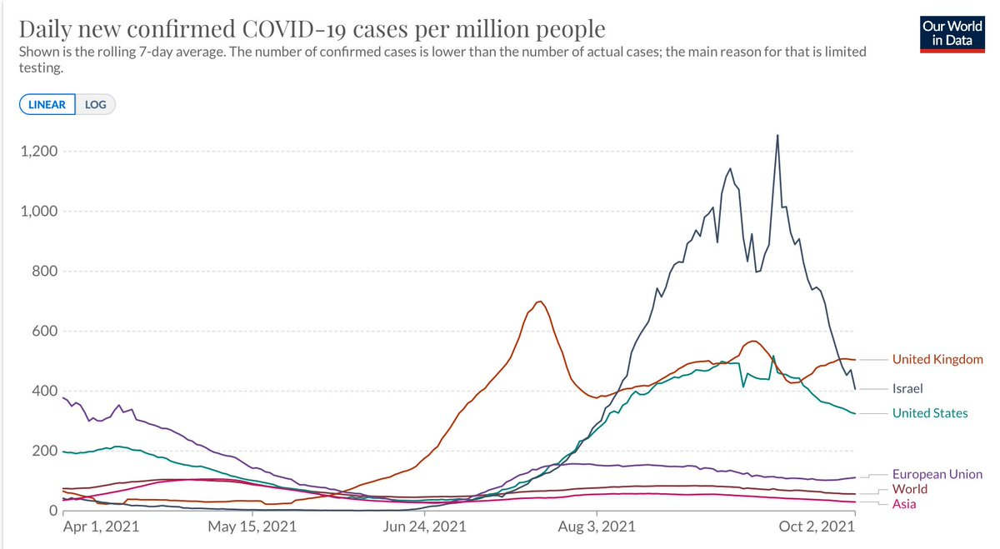
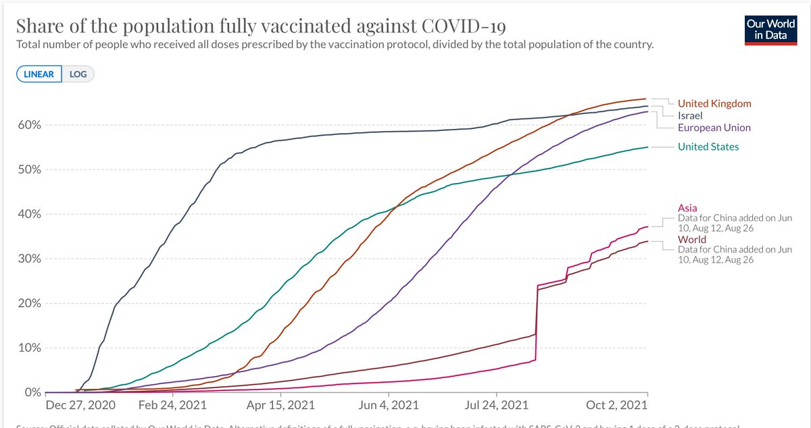
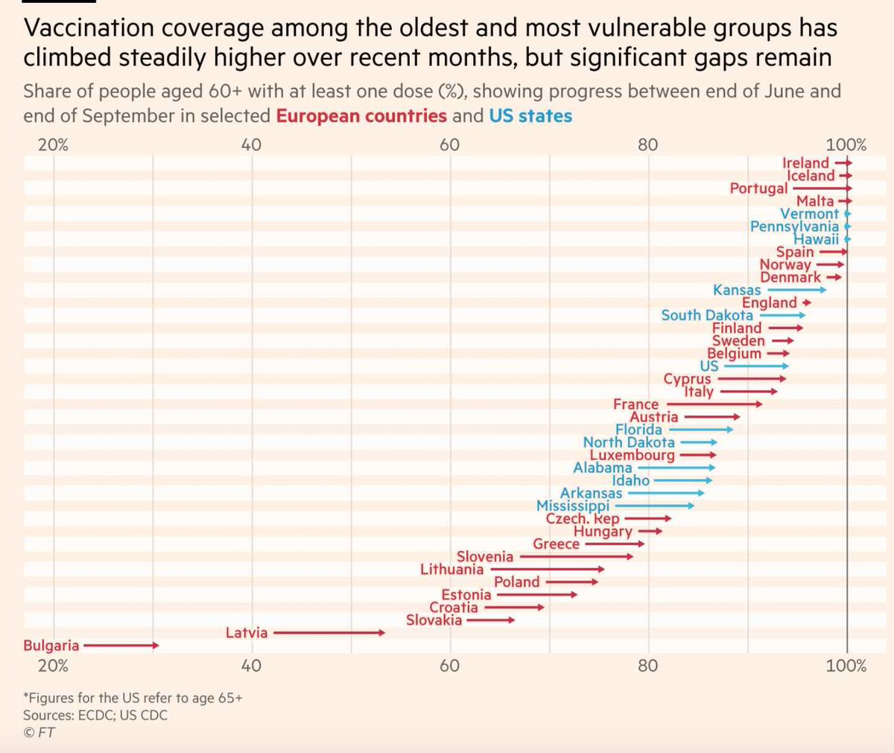
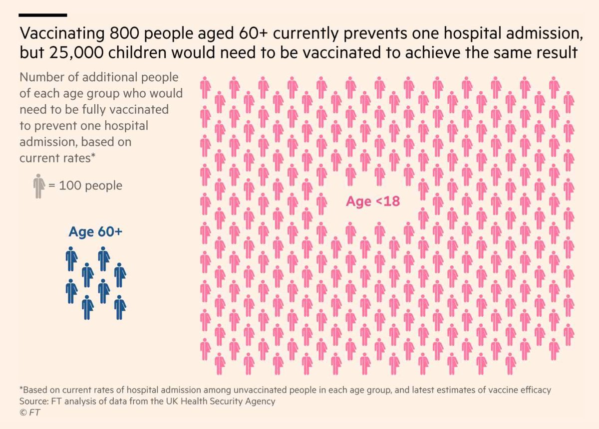
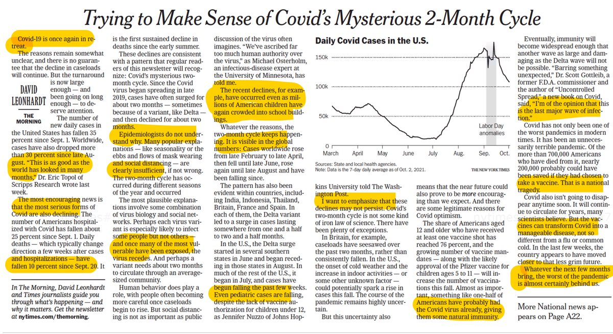
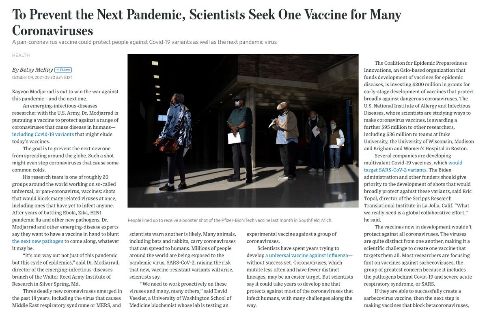
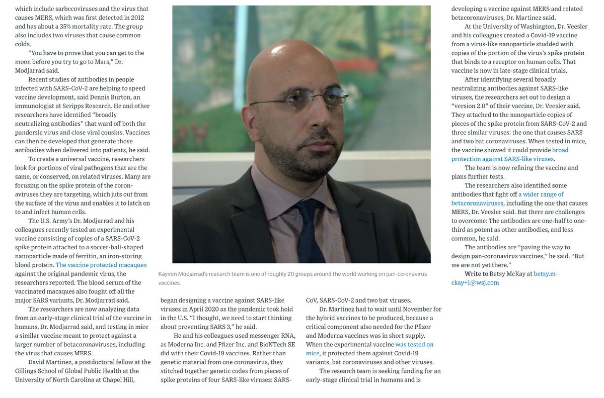
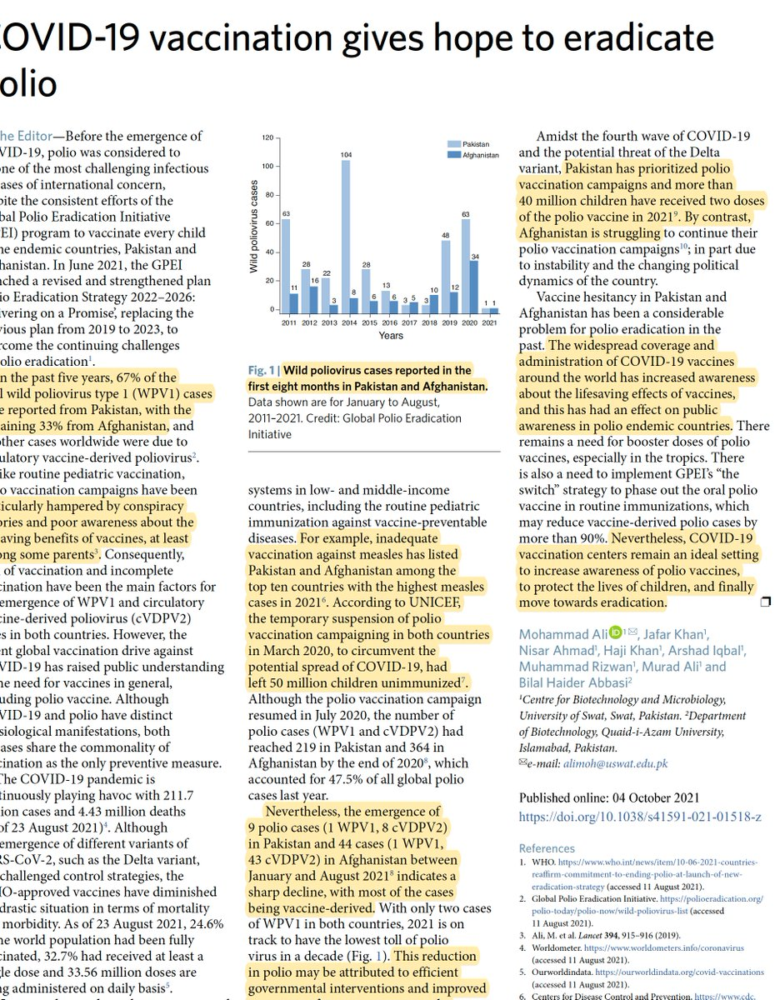
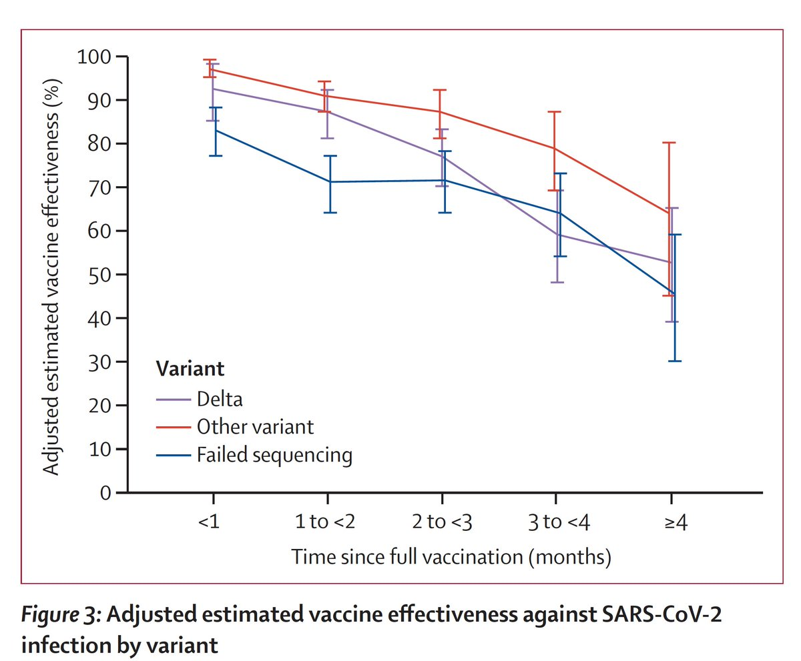
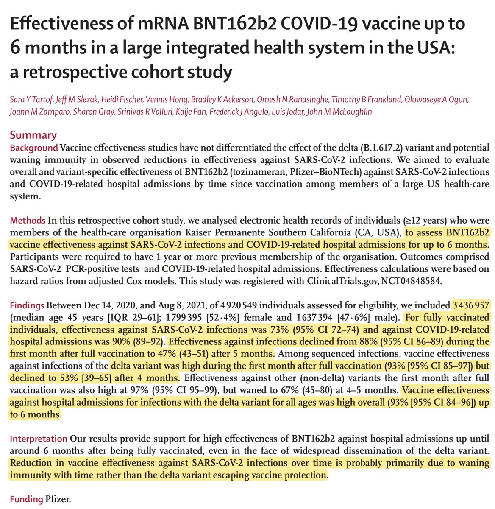

+++
title = "Tweets by Eric Topol Oct 04"
Summary = ""
tags = ["Twitter"]
category = "Twitter"
+++

---

<a href="https://twitter.com/erictopol/status/1444832544571101184" target="_blank" rel="noreferer">01:11 UCT</a>

Why was Israel's 4th, Delta wave such an outlier?
Contributing factors
—Vaccine waning, 1st mover disadvantage
—Delta's hyper-contagiousness
— ~37% of total population unvaccinated 
—Short dose spacing (3 wks) -&gt; less memory B &amp; T cells
— Lower dose mRNA (30 µg vs Moderna 100 µg) 

<a href="FA0RXYIVUAQYALx.jpg"  ></img></a><a href="FA0RarWVkAMjcgT.jpg"  ></img></a>

---

<a href="https://twitter.com/erictopol/status/1444835347108556800" target="_blank" rel="noreferer">01:22 UCT</a>

@JamesSurowiecki Agree on kids. I think they had ~60% fully vaccinated when Delta hit in late June 

<a href="FA0VzNvVUAEFAs-.jpg"  ></img></a>

---

<a href="https://twitter.com/erictopol/status/1444856163720257541" target="_blank" rel="noreferer">02:45 UCT</a>

An extraordinary 90 second video of the hotspots and spread throughout the American pandemic, by @BioTurboNick 
https://www.youtube.com/watch?v=bVqMQSA0LZo

---

<a href="https://twitter.com/erictopol/status/1444898628573687808" target="_blank" rel="noreferer">05:34 UCT</a>

Getting everyone age 60+ vaccinated is mission critical.
Many countries and US states have done that well; many are lagging
https://www.ft.com/content/3439145a-80a4-47ad-9ceb-54a0cb707cf7 @FT 

<a href="FA1PPleVgAsarGB.jpg"  ></img></a>

---

<a href="https://twitter.com/erictopol/status/1444899816299905024" target="_blank" rel="noreferer">05:38 UCT</a>

The &gt;30-fold impact of vaccination for reducing hospitalization for age 60+ vs &lt;18 years 

<a href="FA1QbfrVEAMDCEZ.jpg"  ></img></a>

---

<a href="https://twitter.com/erictopol/status/1445013753569767425" target="_blank" rel="noreferer">13:11 UCT</a>

Not every day your colleague and friend wins a Nobel Prize,
Congrats @ardemp !!! @scrippsresearch https://twitter.com/NobelPrize/status/1444970585709219840

---

<a href="https://twitter.com/erictopol/status/1445025375138975744" target="_blank" rel="noreferer">13:57 UCT</a>

Covid in retreat.
"Whatever this autumn brings, the worst of the pandemic is almost certainly behind us."
https://www.nytimes.com/2021/10/04/briefing/covid-caseload-retreat-us-cases.html @DLeonhardt 

<a href="FA3CRhcVIAcWK0E.jpg"  ></img></a>

---

<a href="https://twitter.com/erictopol/status/1445028767110369281" target="_blank" rel="noreferer">14:11 UCT</a>

The importance of age can't be emphasized enough
https://nymag.com/intelligencer/2021/09/covid-19-vaccine-status-age-discrimination.html by @dwallacewells @NYMag 
"To put it more bluntly: in assessing an individual’s risk of dying from COVID, age appears still as important — and maybe even more important — than vaccination status."

---

<a href="https://twitter.com/erictopol/status/1445032152073064450" target="_blank" rel="noreferer">14:24 UCT</a>

A universal sarbecovirus vaccine. We should be all over this, but we're not. It needs to get top priority and for there to be a global collaborative effort. https://www.wsj.com/articles/to-prevent-the-next-pandemic-scientists-seek-one-vaccine-for-many-coronaviruses-11633339802?st=rympt75tje1xzoh&reflink=article_email_share by @betswrites 

<a href="FA3H7YAVkAIxyW_.jpg"  ></img></a><a href="FA3H9PLUYAoI1xb.jpg"  ></img></a>

---

<a href="https://twitter.com/erictopol/status/1445034499704647684" target="_blank" rel="noreferer">14:34 UCT</a>

@HelenBranswell @DLeonhardt I'm an eternal optimist, Helen, so yes, with the hedge that there's not a worse than Delta out there to take its place. Also superstitious, so I wouldn't have written it or jinxed it 😉

---

<a href="https://twitter.com/erictopol/status/1445047888409608192" target="_blank" rel="noreferer">15:27 UCT</a>

New report on very rare acute myocarditis after mRNA vaccination in age 18+
5.8 cases/million after 2nd dose, 0.8/million 1st dose, all cases fully resolved with conservative management
https://jamanetwork.com/journals/jamainternalmedicine/fullarticle/2784800 @KPSCALnews @KPSCalResearch @JAMAInternalMed

---

<a href="https://twitter.com/erictopol/status/1445082364556709889" target="_blank" rel="noreferer">17:44 UCT</a>

A windfall of Covid vaccines: towards eradication of polio https://www.nature.com/articles/s41591-021-01518-z @NatureMedicine "from increased awareness about the lifesaving effect of vaccines" 

<a href="FA32FeoUcAgr_iH.jpg"  ></img></a>

---

<a href="https://twitter.com/erictopol/status/1445082368188895238" target="_blank" rel="noreferer">17:44 UCT</a>

"Polio vaccination campaigns [in Pakistan and Afghanistan) have been particularly hampered by conspiracy theories and poor awareness about the lifesaving benefits of vaccines"
Sound familiar, USA?

---

<a href="https://twitter.com/erictopol/status/1445104256604770311" target="_blank" rel="noreferer">19:11 UCT</a>

RT @devisridhar: If New Zealand can vaccinate widely, get access to new treatments &amp; open cautiously, they’ll have escaped the pandemic wit…

---

<a href="https://twitter.com/erictopol/status/1445109143476445184" target="_blank" rel="noreferer">19:30 UCT</a>

When the problem in the US is the N getting booster shots markedly exceeds the newly vaccinated, and the latter are very low and desperately need to increase in order to achieve containment
Total/New/Boost (1000s)
Saturday 933/273/379
Sunday  1240/363/545
Monday  985/269/424

---

<a href="https://twitter.com/erictopol/status/1445131183956709380" target="_blank" rel="noreferer">20:58 UCT</a>

RT @YahooFinance: Baylor College of Medicine Dean at the National School of Tropical Medicine Dr. @PeterHotez and Scripps Research Translat…

---

<a href="https://twitter.com/erictopol/status/1445144366159331328" target="_blank" rel="noreferer">21:50 UCT</a>

How often is Covid testing needed to help reduce Delta variant transmission?
Not once per week. Not twice per week.
At least every other day.
With rapid turnaround time.
https://www.medrxiv.org/content/10.1101/2021.10.01.21262806v1

---

<a href="https://twitter.com/erictopol/status/1445154310208122888" target="_blank" rel="noreferer">22:30 UCT</a>

Is it time from vaccination or Delta that drives waning of 💉effectiveness?
New @TheLancet study ~3.4 million @Pfizer vaccinated individuals @KPSCalResearch, with a subgroup of their #SARSCoV2 sequenced, shows persistent waning of effectiveness vs infections across variants /1 

<a href="FA4yjajVQAA5mEm.jpg"  ></img></a>

---

<a href="https://twitter.com/erictopol/status/1445154317778894852" target="_blank" rel="noreferer">22:30 UCT</a>

That decline for Delta was from 93 -&gt; 53% after 4 months.

Vaccine effectiveness vs hospitalization for Delta infections was high— 93% [95% CI 84,96] —at a mean time of 3.4 months from being fully vaccinated 
https://www.thelancet.com/journals/lancet/article/PIIS0140-6736(21)02183-8/fulltext /2 

<a href="FA40Ou5VIBAkBSa.jpg"  ></img></a>