+++
title = "Tweets by Eric Topol Oct 05"
Summary = ""
tags = ["Twitter"]
category = "Twitter"
+++

---

<a href="https://twitter.com/erictopol/status/1445198888365740035" target="_blank" rel="noreferer">01:27 UCT</a>

Obesity and diabetes are risk factors for severe Covid, breakthrough infections, and #LongCovid. A new review  @TheLancetEndo gets into the mechanism and management https://www.thelancet.com/journals/landia/article/PIIS2213-8587(21)00244-8/fulltext
and @Cell_Metabolism on infection of fat cells https://www.cell.com/cell-metabolism/fulltext/S1550-4131(21)00428-9 

<a href="FA5gT7EVkAEwTAH.jpg"  >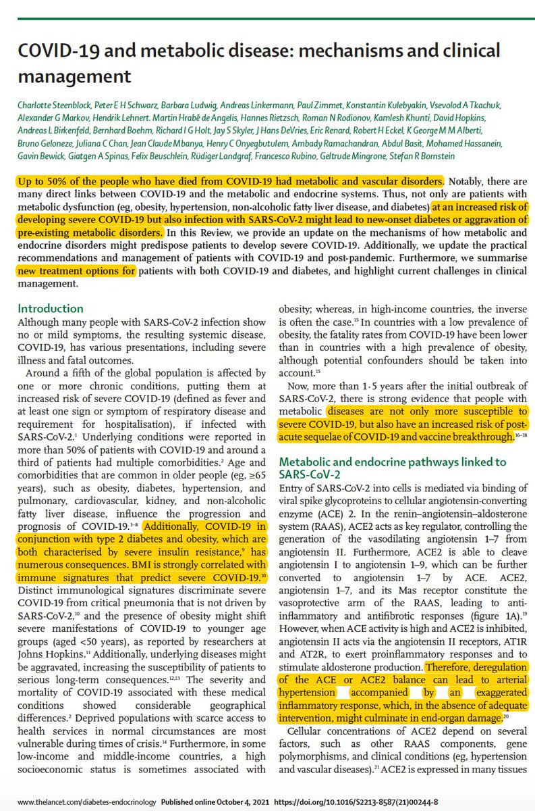</img></a><a href="FA5gVzTUcAcl8wH.jpg"  >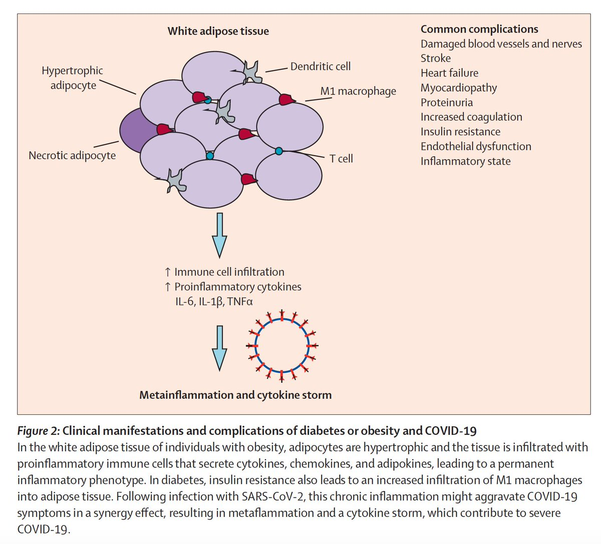</img></a><a href="FA5gX7GVgAElBV0.jpg"  >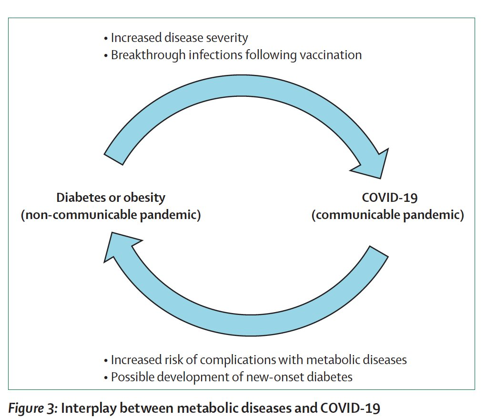</img></a><a href="FA5gZmHVIAAOO6u.jpg"  >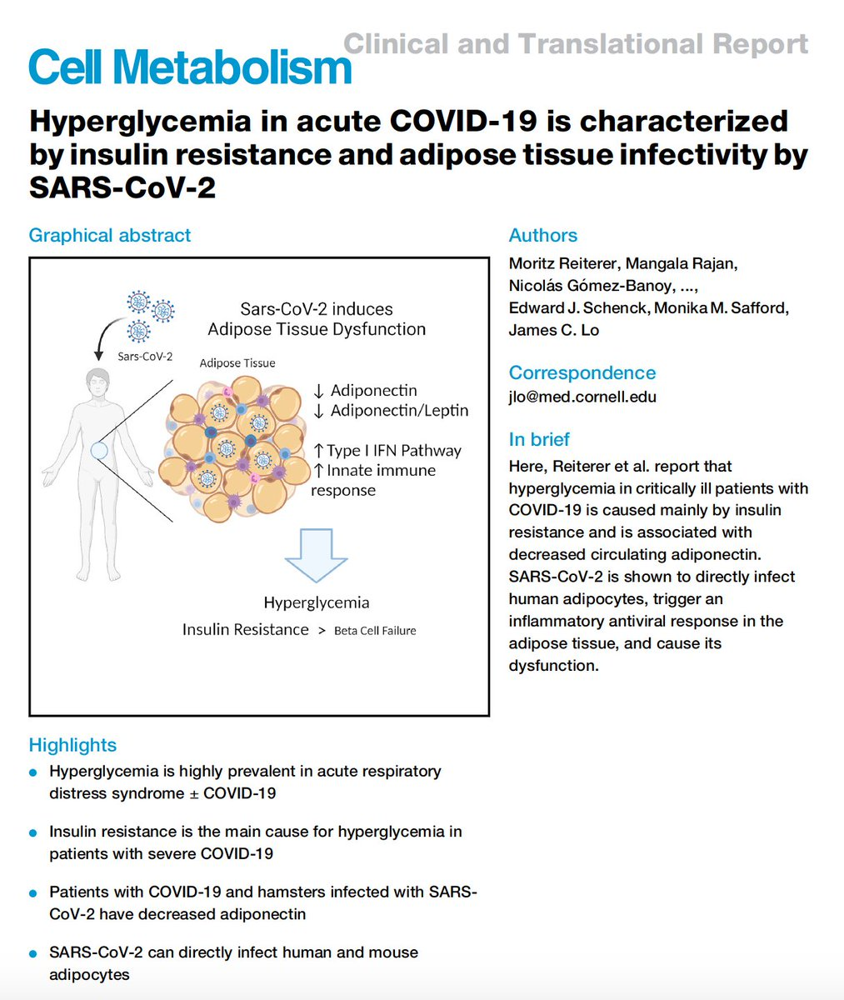</img></a>

---

<a href="https://twitter.com/erictopol/status/1445211701398233089" target="_blank" rel="noreferer">02:18 UCT</a>

Dr. Francis Collins, our @NIHDirector, led @NIH for 12 years &amp; the Human Genome Project @genome_gov, has made immense contributions to biomedicine. I am saddened to see him stepping down, want to express the deepest appreciation for decades of leadership
https://www.politico.com/news/2021/10/04/francis-collins-nih-step-down-515114

---

<a href="https://twitter.com/erictopol/status/1445224263884046338" target="_blank" rel="noreferer">03:08 UCT</a>

Don't look now, but we're about to get below 70,000 hospitalizations &amp; 100,000 new cases/day, for the 1st time in 2 months + lowest test positivity (5.6%) in 3 months
But a LONG way to get this🦠contained
Tens of millions more people need to get vaxxed to help us get &amp; stay there 

<a href="FA52ht4VQAIhF7L.jpg"  >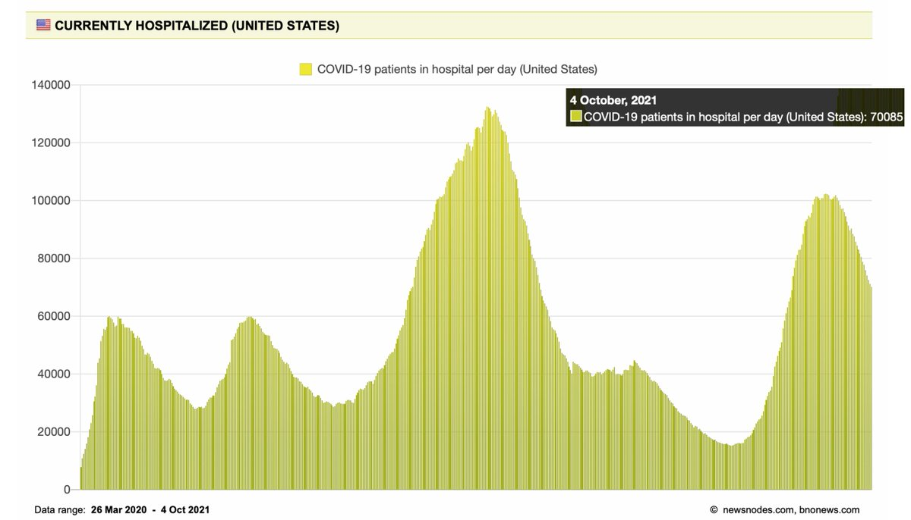</img></a><a href="FA52jWQVcAUbAa1.jpg"  >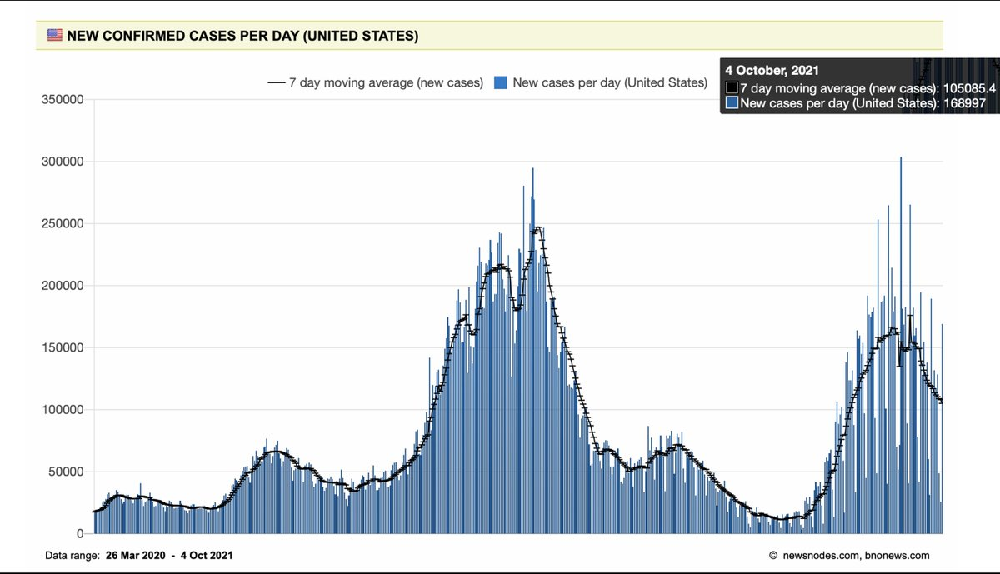</img></a>

---

<a href="https://twitter.com/erictopol/status/1445234911208566785" target="_blank" rel="noreferer">03:50 UCT</a>

@evbro18 Thanks very much!

---

<a href="https://twitter.com/erictopol/status/1445390636430016517" target="_blank" rel="noreferer">14:09 UCT</a>

Our covid times :-)
by @Hilary_Price 

<a href="FA8PGleWUBgMdbJ.jpg"  >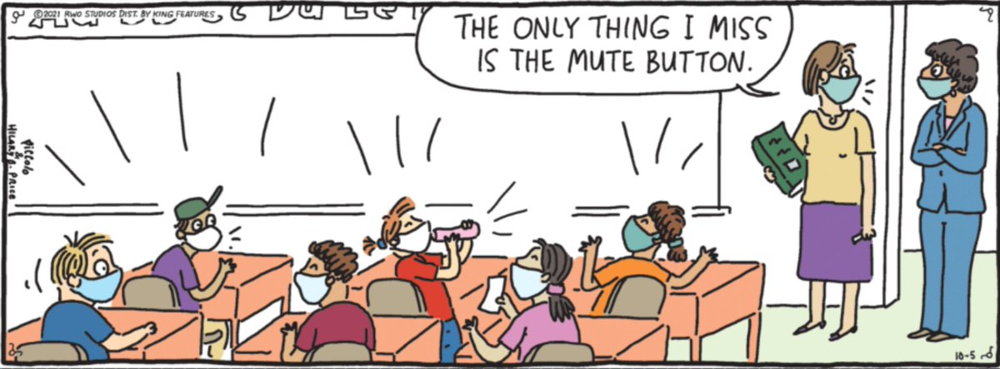</img></a>

---

<a href="https://twitter.com/erictopol/status/1445405726852194305" target="_blank" rel="noreferer">15:09 UCT</a>

My conversation with @kaifulee, one of #AI's leading lights, author of AI Superpowers and AI 2041, on where we are headed with technology in healthcare
https://www.medscape.com/viewarticle/958771
@Medscape with transcript

---

<a href="https://twitter.com/erictopol/status/1445424645478309890" target="_blank" rel="noreferer">16:24 UCT</a>

A new report from Canada adds to those from UK and Denmark on the higher virulence of the Delta variant with a doubling of risk of hospitalization
https://www.cmaj.ca/content/early/2021/10/04/cmaj.211248 @CMAJ 

<a href="FA8t4LZVcAEYTO0.jpg"  >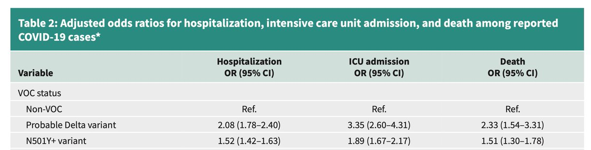</img></a>

---

<a href="https://twitter.com/erictopol/status/1445427015230754819" target="_blank" rel="noreferer">16:33 UCT</a>

The Denmark
https://twitter.com/EricTopol/status/1433923805592756229
and UK reports
https://www.thelancet.com/journals/laninf/article/PIIS1473-3099(21)00475-8/fulltext 

<a href="FA8wKjUVkAAJDhJ.jpg"  >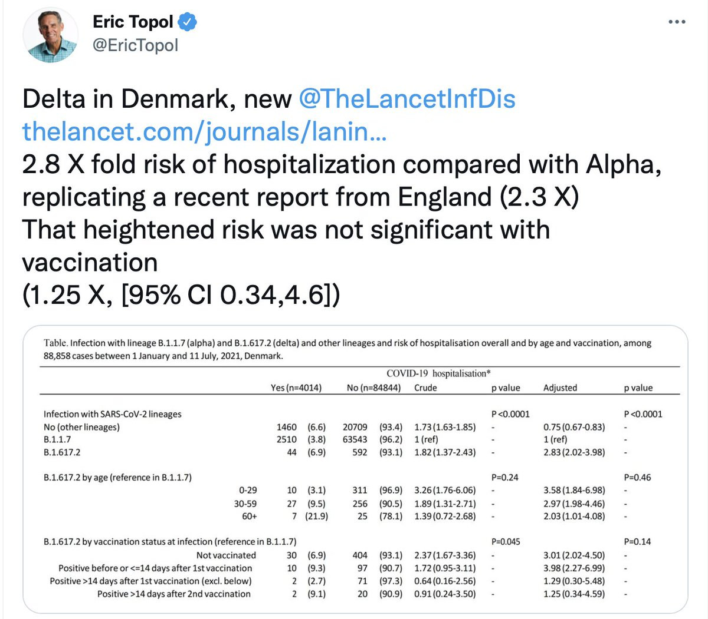</img></a><a href="FA8wMCwUcAA7zi9.jpg"  >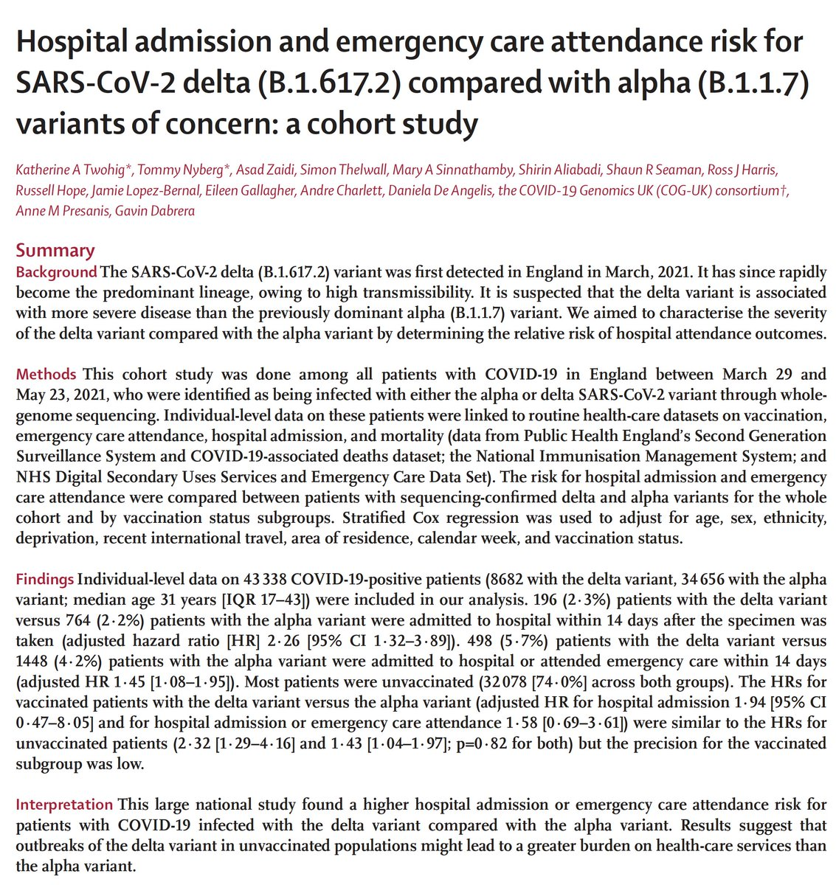</img></a>

---

<a href="https://twitter.com/erictopol/status/1445429636502933508" target="_blank" rel="noreferer">16:44 UCT</a>

The best study we have so far on transmission after vaccination, covered @Nature 
https://www.nature.com/articles/d41586-021-02689-y  https://twitter.com/EricTopol/status/1443605872853221382

<a href="FA8yhltVcAErjq-.jpg"  >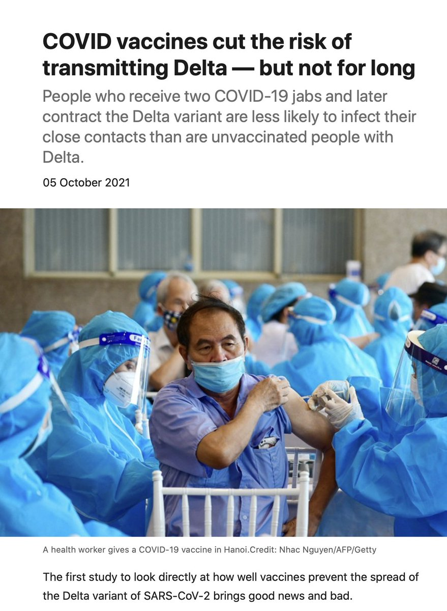</img></a>

---

<a href="https://twitter.com/erictopol/status/1445443502087671809" target="_blank" rel="noreferer">17:39 UCT</a>

Sounding the alarm on the profound racial and ethnic disparities in deaths in the American pandemic
https://www.acpjournals.org/doi/10.7326/M21-2134
@AnnalsofIM by @meredithshiels and colleagues and accompanying editorial @ycommodore @LisaCooperMD 

<a href="FA89VMkVIAIlFKK.jpg"  >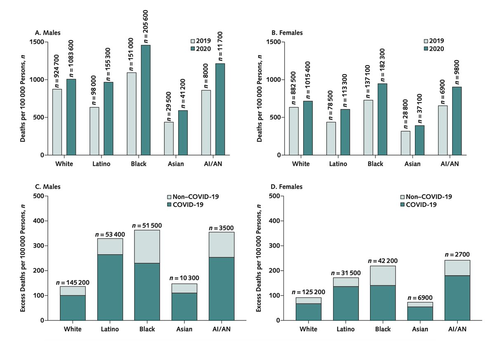</img></a><a href="FA8-v2OVUAs-TdR.jpg"  >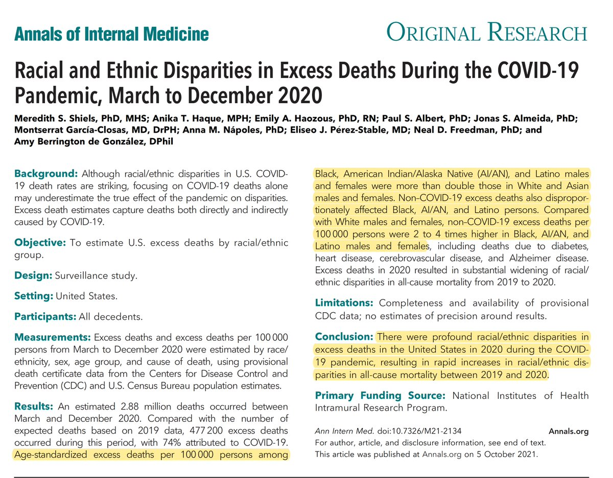</img></a><a href="FA8-xL8UYAI1ogh.jpg"  >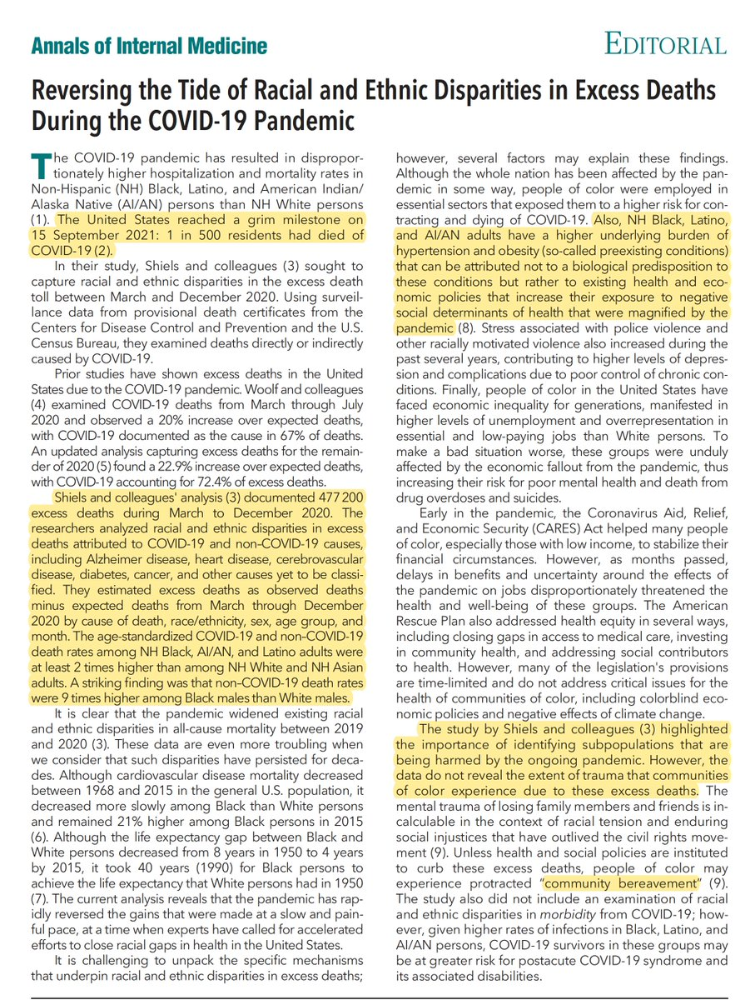</img></a>

---

<a href="https://twitter.com/erictopol/status/1445452852302729225" target="_blank" rel="noreferer">18:16 UCT</a>

RT @ardemp: Best congratulatory email to date: "as far as world-famous Armenians go, Kim Kardashian may have broken the Internet, but you c…

---

<a href="https://twitter.com/erictopol/status/1445463443167797248" target="_blank" rel="noreferer">18:58 UCT</a>

"It is a sign of the most dire civic rot that people base even their approach to personal health on their tribal fealties."
https://www.ft.com/content/20a7d614-3153-45e2-bde8-55a1cc032f6b

---

<a href="https://twitter.com/erictopol/status/1445474539115143170" target="_blank" rel="noreferer">19:42 UCT</a>

The cardiovascular burden of COVID-19 at 1 year follow-up of over 150,000 individuals, in comparison with controls, is substantial https://www.researchsquare.com/article/rs-940278/v1
#LongCovid @DeptVetAffairs by @zalaly and colleagues 

<a href="FA9apE-VQBA59F3.jpg"  >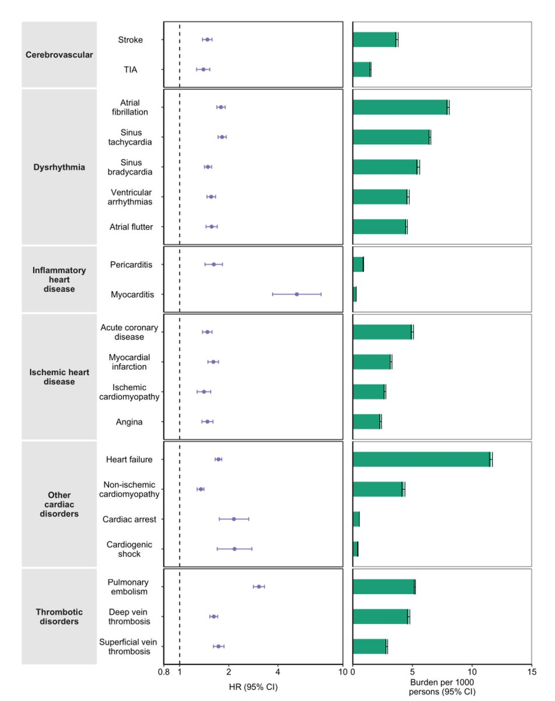</img></a>

---

<a href="https://twitter.com/erictopol/status/1445485454220951552" target="_blank" rel="noreferer">20:26 UCT</a>

Covid vaccinations in the first 5 months among 63 million US Medicare beneficiaries reduced deaths by ~39,000, hospitalizations by 107,000 and ~265,000 fewer cases 
https://aspe.hhs.gov/sites/default/files/documents/8d15a6223df12fcb59de1f031adb1eec/aspe-covid-medicare-vaccine-analysis.pdf @HHSGov 
(and we still have only achieved 84% fully vaccinated of 65+ as of today)

---

<a href="https://twitter.com/erictopol/status/1445486250023002121" target="_blank" rel="noreferer">20:29 UCT</a>

RT @maxonwifi: We're touching on this data and other headlines +  @EricTopol's wise analysis on tonight's @CBSEveningNews.

