+++
title = "Tweets by Eric Topol Oct 06"
Summary = ""
tags = ["Twitter"]
category = "Twitter"
+++

---

<a href="https://twitter.com/erictopol/status/1445583002407301127" target="_blank" rel="noreferer">02:53 UCT</a>

Singapore has been a model country in the pandemic, with a very low case burden, one of the highest fully vaccinated rates (&gt;80% total population) in the world. The recent outbreak to its peak in cases tells us there's no room for Covid complacency
https://covidsitrep.moh.gov.sg 

<a href="FA-8HU1UcAs2Wgm.jpg"  >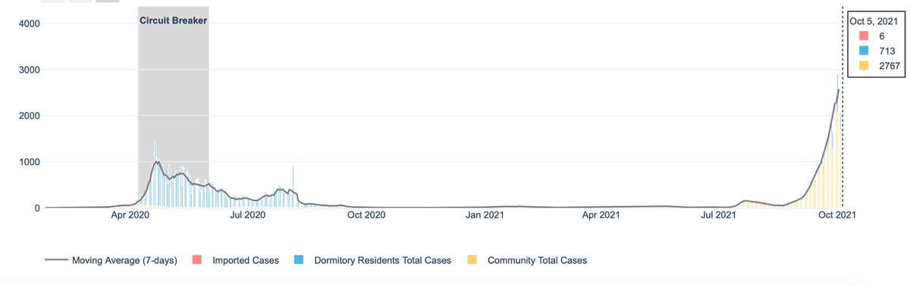</img></a><a href="FA-913PUUA08prP.jpg"  >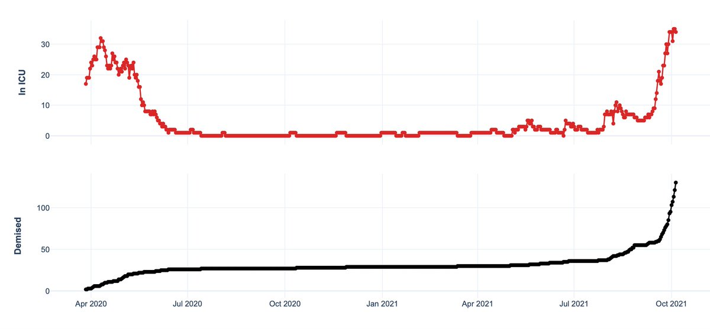</img></a>

---

<a href="https://twitter.com/erictopol/status/1445761386173267970" target="_blank" rel="noreferer">14:42 UCT</a>

The mechanism of Covid toes: role of the type 1 interferon response, IgA autoantibodies and endothelial dysfunction
https://onlinelibrary.wiley.com/doi/full/10.1111/bjd.20707
https://www.theguardian.com/world/2021/oct/06/covid-toe-may-be-side-effect-immune-response-study?CMP=oth_b-aplnews_d-1 

<a href="FBBfbODVkAA4Fpo.jpg"  >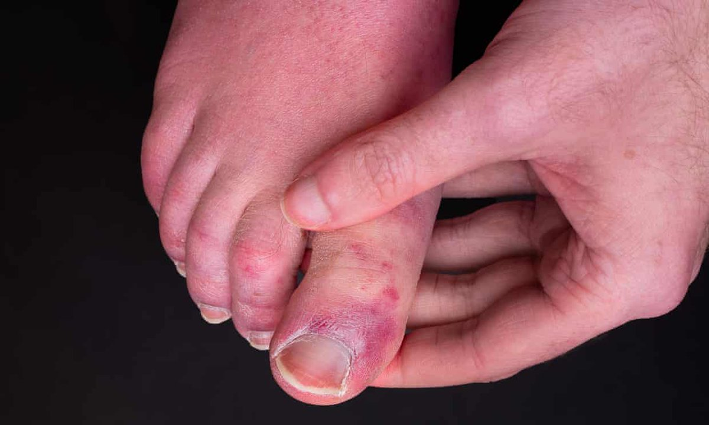</img></a><a href="FBBfc-nVQAggPY5.jpg"  >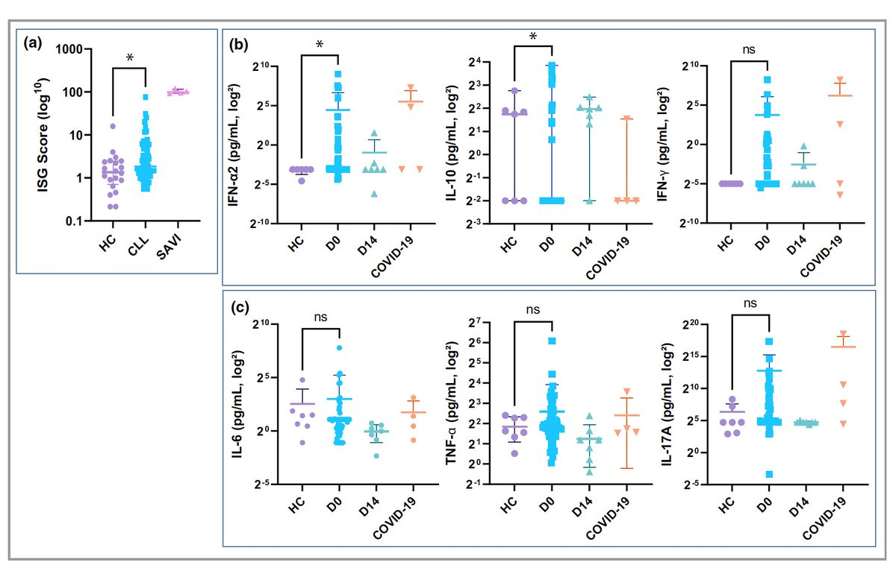</img></a><a href="FBBf8qlUcAA-AhL.jpg"  >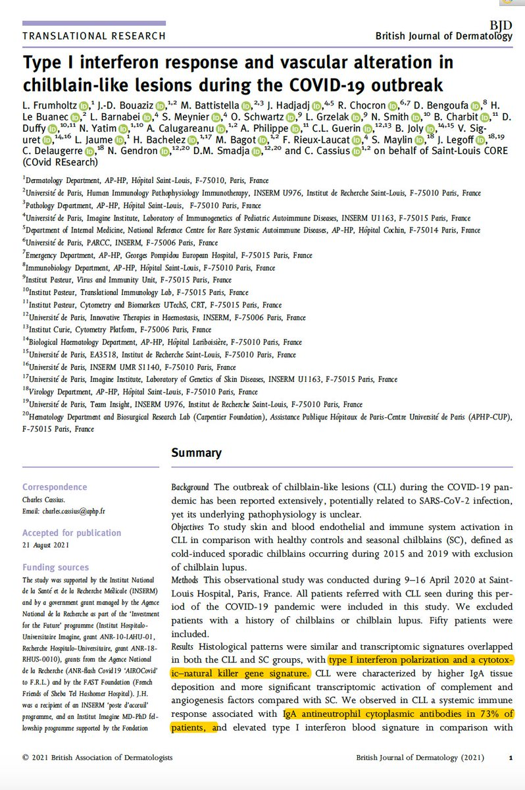</img></a>

---

<a href="https://twitter.com/erictopol/status/1445767216218083352" target="_blank" rel="noreferer">15:05 UCT</a>

The impact of vaccination among more than 1.3 million US veterans through March 2021 (pre-Delta), 2 shots mRNA with controls
Zero deaths
Vaccine effectiveness: 95% vs infections, with or without symptoms, 91% vs hospitalizations
https://jamanetwork.com/journals/jamanetworkopen/fullarticle/2784769 @JAMANetworkOpen

---

<a href="https://twitter.com/erictopol/status/1445770468288450574" target="_blank" rel="noreferer">15:18 UCT</a>

It's about time ✓ 

<a href="FBBoc-NVEAomL62.jpg"  >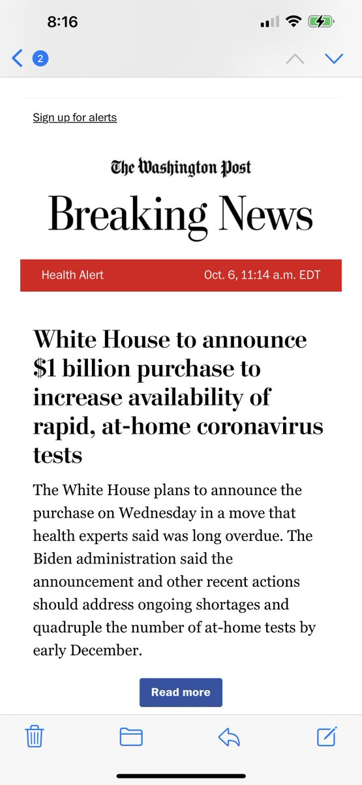</img></a>

---

<a href="https://twitter.com/erictopol/status/1445799409975902219" target="_blank" rel="noreferer">17:13 UCT</a>

Thanks to #AI deep learning we can see inside cells, 3D high-resolution organelles, like never before
Just published @Nature 
https://www.nature.com/articles/s41586-021-03977-3
@avweigel @HHMIJanelia and collaborators 

<a href="FBCCKqvUUAMf986.jpg"  >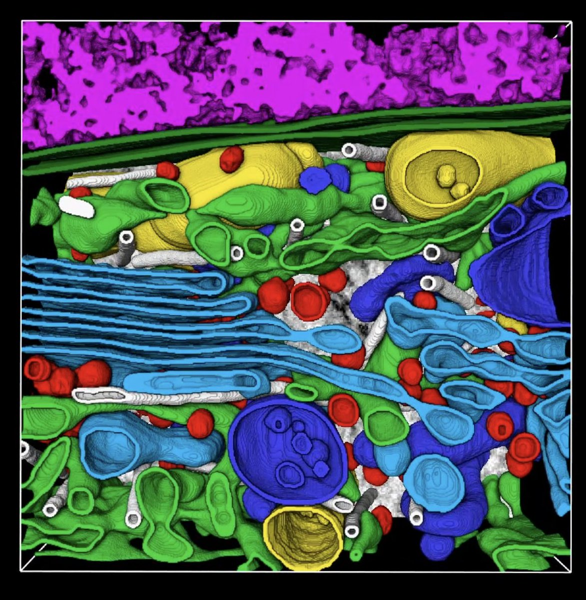</img></a>

---

<a href="https://twitter.com/erictopol/status/1445800058088165376" target="_blank" rel="noreferer">17:16 UCT</a>

From the video in the paper with explanatory thread by @avweigel
https://twitter.com/avweigel/status/1328688972793585664

---

<a href="https://twitter.com/erictopol/status/1445815230974496772" target="_blank" rel="noreferer">18:16 UCT</a>

No one is safe until we all are safe, by Sarah Gilbert @JennerInstitute @NDMOxford @UniofOxford and 
@DrRHatchett @CEPIVaccines
With a forecast of global vaccine supply for 2021
https://www.science.org/doi/10.1126/scitranslmed.abl9900 @ScienceTM a large proportion are Sinopharm and Sinovac from China 

<a href="FBCRFn5VgAcEBxL.jpg"  >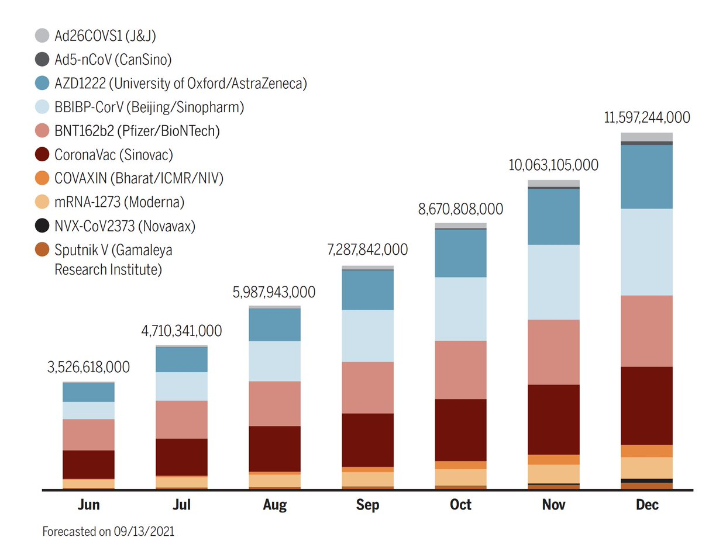</img></a><a href="FBCQ6S_VEAM0SIH.jpg"  >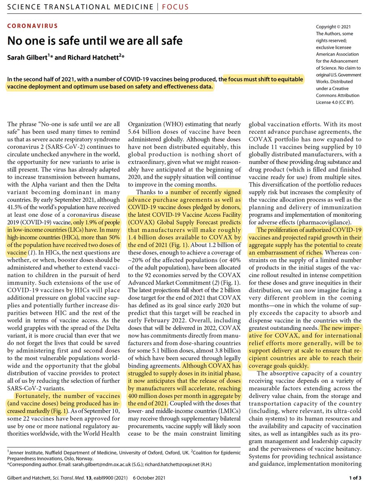</img></a>

---

<a href="https://twitter.com/erictopol/status/1445856967860228102" target="_blank" rel="noreferer">21:02 UCT</a>

Just published @NEJM
Pfizer vaccine waning in Qatar over time among ~115,000 vaccinees + controls
Attrition in protection vs infections, including symptomatic (to 43%, 4 months), + Delta data; well preserved vs hospitalizations
http://www.nejm.org/doi/full/10.1056/NEJMoa2114114 

<a href="FBCzqdkUYAQrxqa.jpg"  >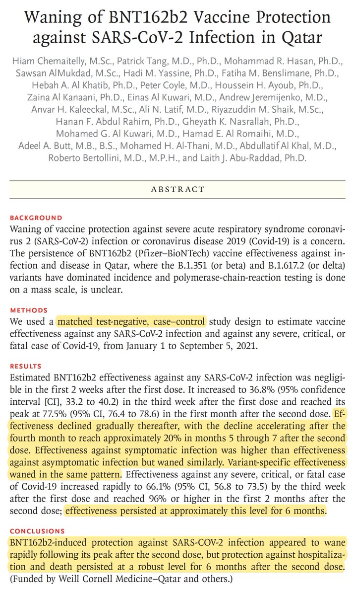</img></a><a href="FBC2SO6UUAUXde1.jpg"  >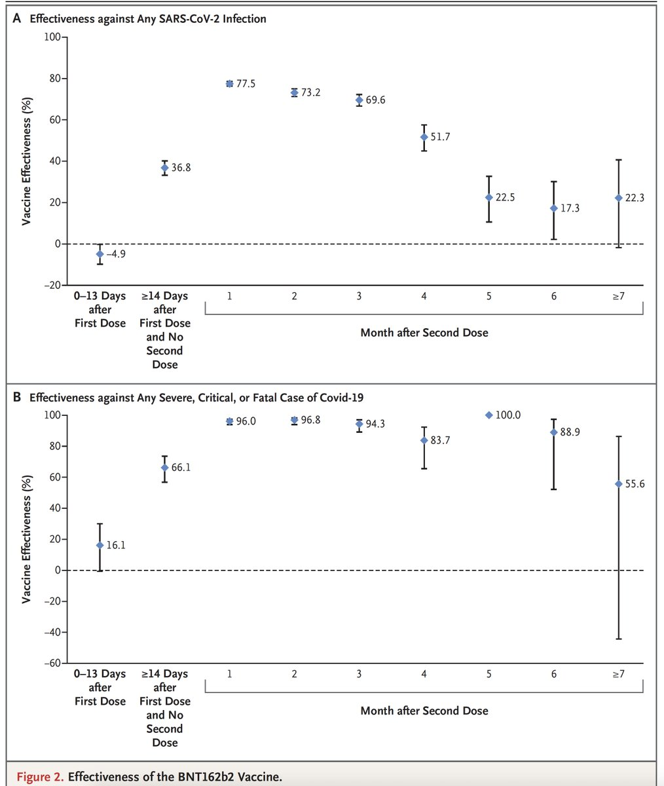</img></a><a href="FBC1L4cVUAYiZw5.png"  >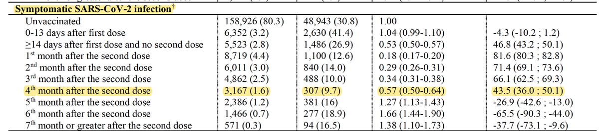</img></a><a href="FBC04AJVEAcq_tp.png"  >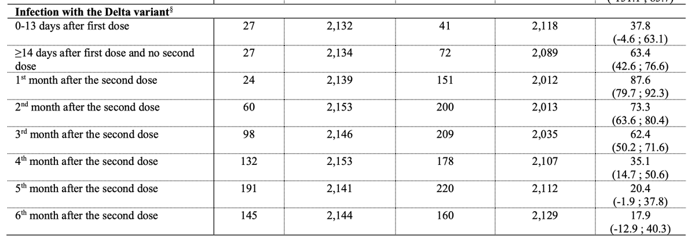</img></a>

---

<a href="https://twitter.com/erictopol/status/1445857506337517568" target="_blank" rel="noreferer">21:04 UCT</a>

Two new @NEJM reports on Pfizer vaccine related myocarditis: very rare (~2 per 100,000) and usually mild; in-depth review of 190 cases, most cases were in males 16-29 years, 2nd dose
http://www.nejm.org/doi/full/10.1056/NEJMoa2110737
https://www.nejm.org/doi/full/10.1056/NEJMoa2109730?query=featured_home 

<a href="FBCwzr2VEAUAdm-.jpg"  >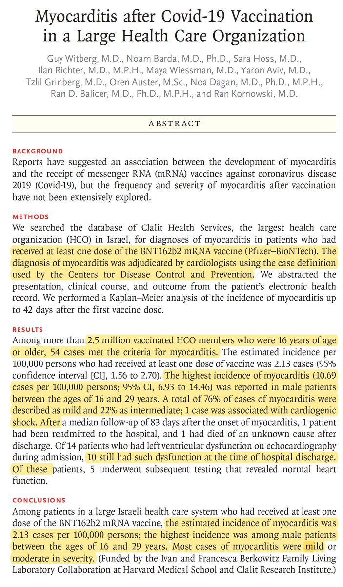</img></a><a href="FBCxT0eVkAMOtr8.jpg"  >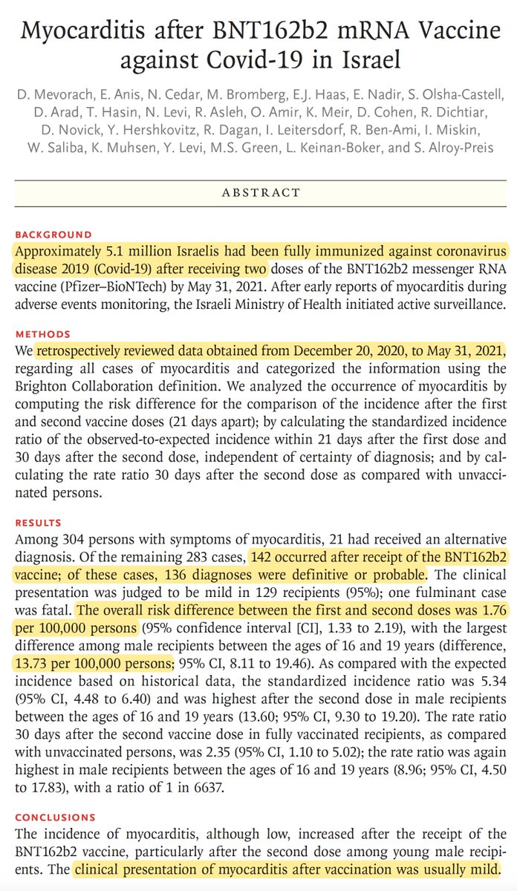</img></a>

---

<a href="https://twitter.com/erictopol/status/1445858726066331651" target="_blank" rel="noreferer">21:09 UCT</a>

A prospective study of antibody response to the Pfizer vaccine in nearly 5,000 people out to 6 months: Significant reductions (both IgG and neutralizing) noted for men, age 65+, and among those immunosuppressed
@NEJM https://www.nejm.org/doi/full/10.1056/NEJMoa2114583?query=featured_home 

<a href="FBC4iJNVUAAbtQn.jpg"  >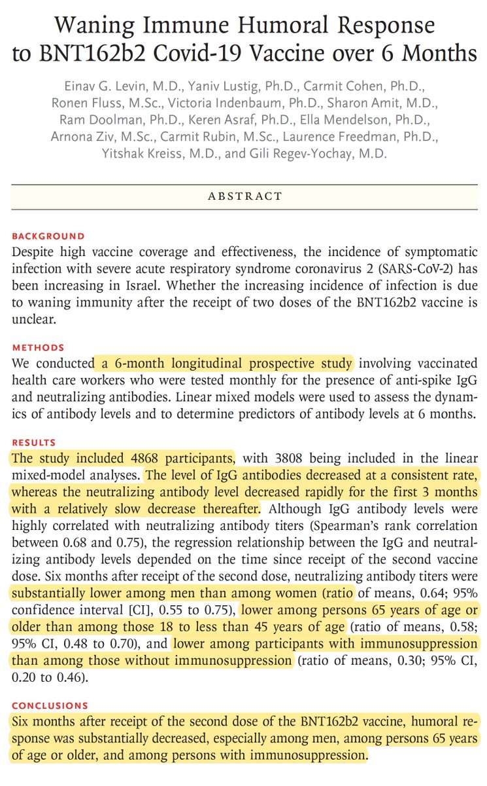</img></a><a href="FBC4kJ5VIAIxR-B.jpg"  >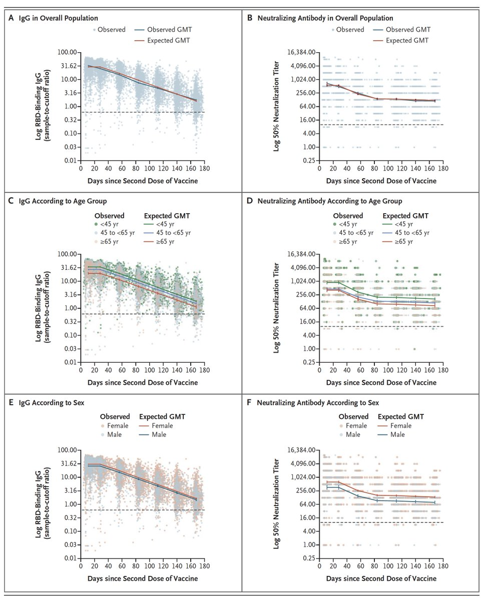</img></a>

---

<a href="https://twitter.com/erictopol/status/1445865410822246407" target="_blank" rel="noreferer">21:35 UCT</a>

Clarification of the reduction of viral RNA load data from a prior report https://www.nejm.org/doi/full/10.1056/NEJMoa2107058 (pre-Delta) showing, by any of 3 methods, marked reduction of viral load among infections in those vaccinated vs unvaccinated https://www.nejm.org/doi/full/10.1056/NEJMc2113575?query=recirc_curatedRelated_article 

<a href="FBC8Gj5VcAcsmfa.jpg"  >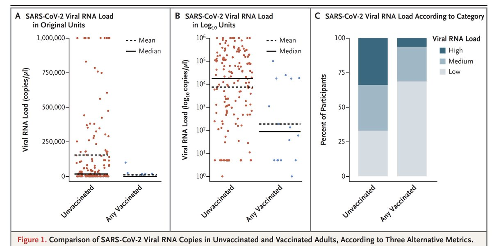</img></a>

---

<a href="https://twitter.com/erictopol/status/1445885442163838978" target="_blank" rel="noreferer">22:55 UCT</a>

Today another case record, but uncoupled with adverse clinical outcomes.  See @sporeMOH or website for details
https://www.moh.gov.sg/news-highlights/details/update-on-local-covid-19-situation-(6-oct-2021)
Over 340,000 people have had 3rd shot boosters 

<a href="FBDPylXUYAAdwjo.jpg"  >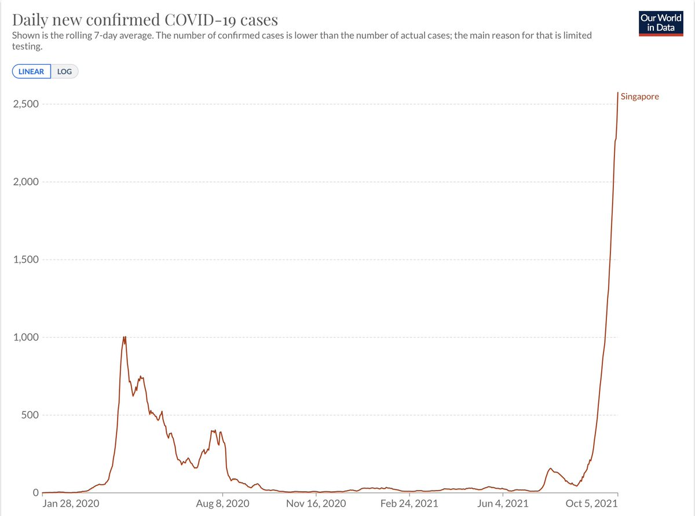</img></a>