+++
title = "Tweets by Eric Topol Oct 07"
Summary = ""
tags = ["Twitter"]
category = "Twitter"
+++

---

<a href="https://twitter.com/erictopol/status/1445936866025304066" target="_blank" rel="noreferer">02:19 UCT</a>

Covid vaccines are essential and have had a profoundly positive impact. 
There's controversy as to whether boosters will be useful for age &lt;60. 
New data highlights significantly less protection vs symptomatic infections and, to a lesser extent,  hospitalizations /1

---

<a href="https://twitter.com/erictopol/status/1445936870634885123" target="_blank" rel="noreferer">02:19 UCT</a>

Summary of the recent data for vaccine effectiveness vs symptomatic infections. At 2 months, this was well over 90% for mRNA vaccines, but by 4-6+ months has declined to between 44-70%.
All ages. 
Data for Pfizer, Moderna, and AZ /2 

<a href="FBD7fWoVQAAZAuk.jpg"  >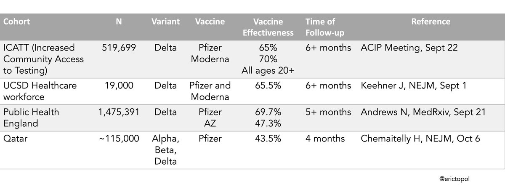</img></a>

---

<a href="https://twitter.com/erictopol/status/1445936878734036997" target="_blank" rel="noreferer">02:19 UCT</a>

These are the recent studies for mRNA vaccine effectiveness (VE) vs hospitalizations. In early months post-vaccination, &gt;90% would be expected. The decline is much less than vs symptomatic infections and more pronounced in age 65+ /4 

<a href="FBD9TN6UYAU8-G2.jpg"  >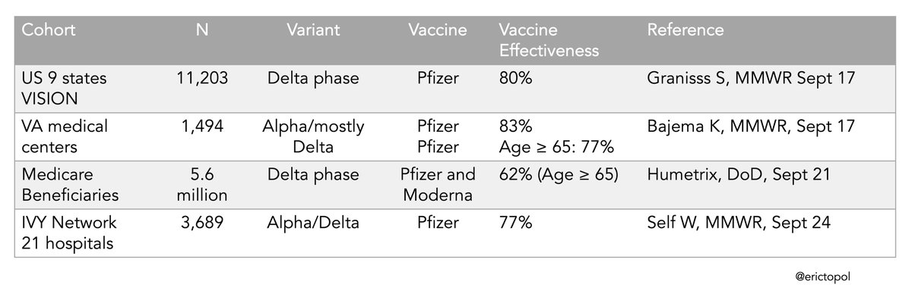</img></a>

---

<a href="https://twitter.com/erictopol/status/1445936876012015623" target="_blank" rel="noreferer">02:19 UCT</a>

The Qatar data were just published @NEJM
https://twitter.com/EricTopol/status/1445856967860228102
Here are the ICATT data (age &lt;65), presented at the recent CDC ACIP meeting /3 

<a href="FBD8LwSUYAA70Ms.jpg"  >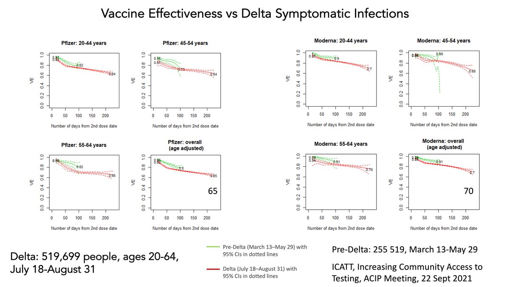</img></a>

---

<a href="https://twitter.com/erictopol/status/1445936880889958400" target="_blank" rel="noreferer">02:19 UCT</a>

Whether symptomatic infections are important to suppress, the 1° endpoint of the 💉clinical trials, is now the crux of the debate. These can be pretty severe, at the brink of hospitalization, &amp; pose  a risk for #LongCovid. There's also a risk for them to transmit, but it's low /5

---

<a href="https://twitter.com/erictopol/status/1446102060215128077" target="_blank" rel="noreferer">13:16 UCT</a>

Concern on this last point, #LongCovid, and this decision
https://www.wsj.com/articles/long-covid-concerns-help-fuel-biden-administrations-broad-booster-push-11633604401 by @StephArmour1 @felschwartz w/ @PeterHotez commentary /6 

<a href="FBGVnQzVkAIWytQ.jpg"  >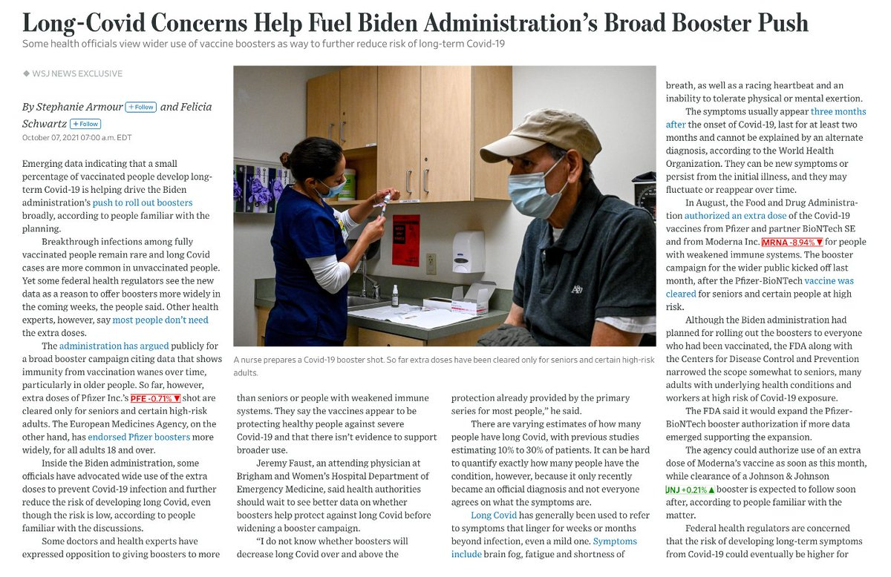</img></a><a href="FBGVp9bUUAEQJXU.png"  >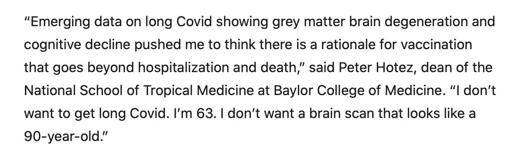</img></a>

---

<a href="https://twitter.com/erictopol/status/1446109517024948236" target="_blank" rel="noreferer">13:45 UCT</a>

Just published @Nature 
The limitations of current mRNA booster shots for generating breadth of memory B cells and implications for reliance on high neutralizing antibodies (and comparison with vaccination after prior Covid) https://www.nature.com/articles/s41586-021-04060-7
@NussenzweigL 

<a href="FBGbxUfUcAcZv9V.jpg"  >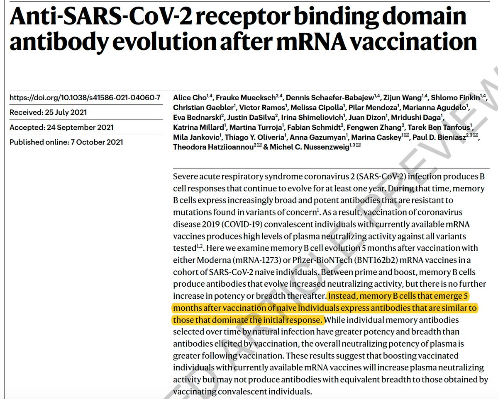</img></a><a href="FBGb2H0VEAAnxTF.jpg"  >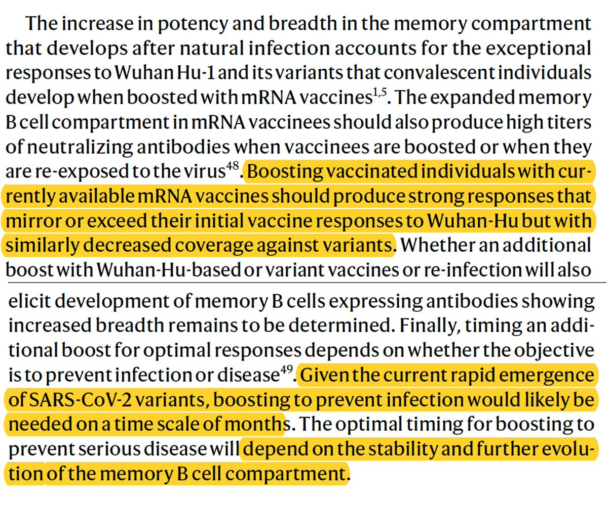</img></a>

---

<a href="https://twitter.com/erictopol/status/1446111354234966024" target="_blank" rel="noreferer">13:53 UCT</a>

"Portable air filters effectively remove #SARSCoV2 particles from the air — the first such evidence in a real-world setting"
#COVIDisAirborne the value of inexpensive high-efficiency particulate air (HEPA) filters
https://www.nature.com/articles/d41586-021-02669-2 @nature 

<a href="FBGeag5VcA486Rh.jpg"  >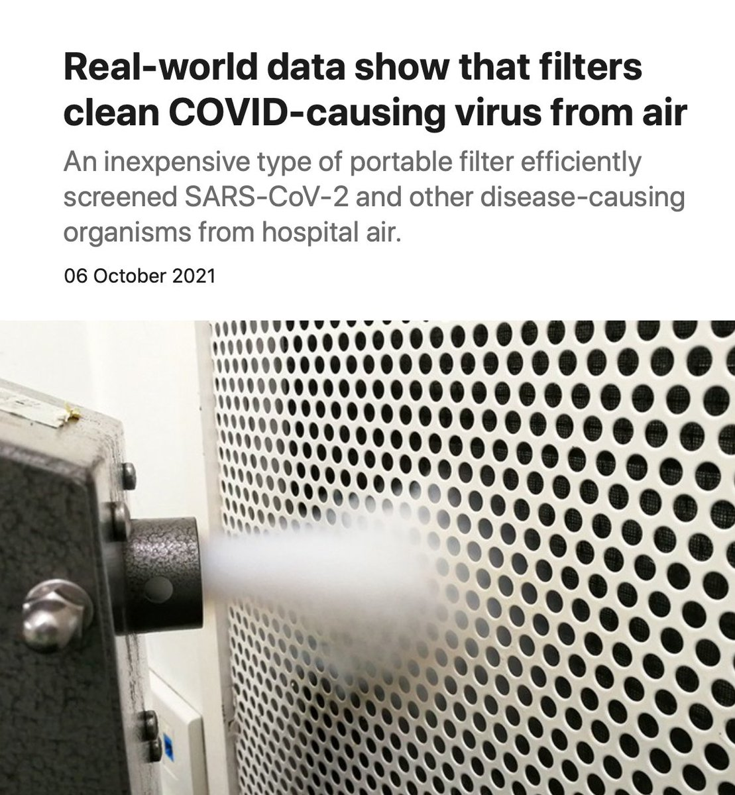</img></a>

---

<a href="https://twitter.com/erictopol/status/1446113081126309903" target="_blank" rel="noreferer">14:00 UCT</a>

Here's the link to the preprint from which this summary is based
https://www.medrxiv.org/content/10.1101/2021.09.16.21263684v1

---

<a href="https://twitter.com/erictopol/status/1446145254575407111" target="_blank" rel="noreferer">16:07 UCT</a>

A new report by @ONS on #LongCovid is particularly troubling with respect to prevalence, duration and severity of symptoms
https://www.ons.gov.uk/peoplepopulationandcommunity/healthandsocialcare/conditionsanddiseases/bulletins/prevalenceofongoingsymptomsfollowingcoronaviruscovid19infectionintheuk/7october2021#main-points 

<a href="FBG9LYuVcAUPIy7.png"  >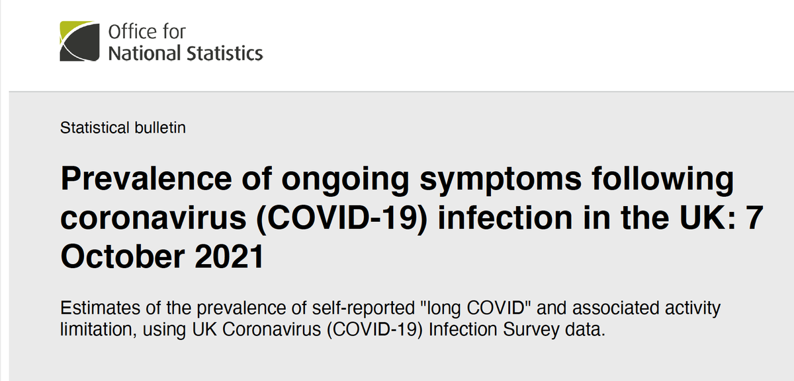</img></a><a href="FBG9NTeVUAYytuA.png"  >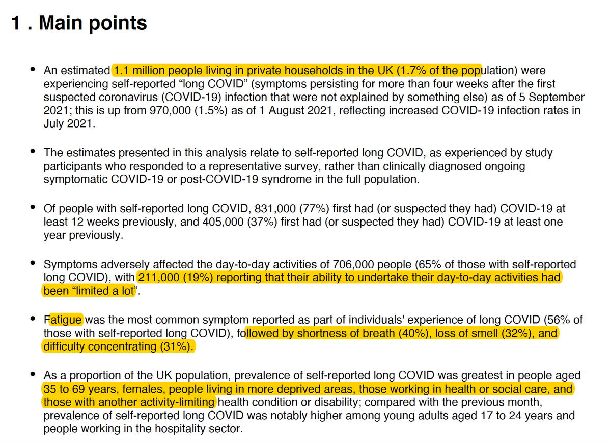</img></a>

---

<a href="https://twitter.com/erictopol/status/1446146863023865869" target="_blank" rel="noreferer">16:14 UCT</a>

Deleted. 

<a href="FBG-4cyUYAYdZed.jpg"  ></img></a>

---

<a href="https://twitter.com/erictopol/status/1446177864659832844" target="_blank" rel="noreferer">18:17 UCT</a>

Onto endemicity
https://www.science.org/doi/10.1126/science.acx9290
by @kakape @ScienceMagazine 
Denmark, and other countries with very high vaccination rates are making the transition as vaccines "defanged" the 🦠
w/ @JeremyFarrar @DFisman @trvrb @LoneSimonsen2 

<a href="FBHZiZ_VEAsoLjB.png"  >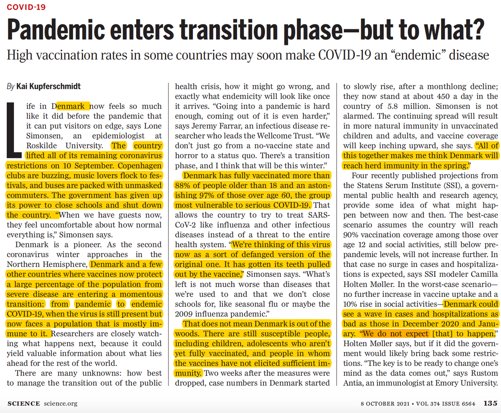</img></a><a href="FBHZj2CUcAIq0jJ.jpg"  >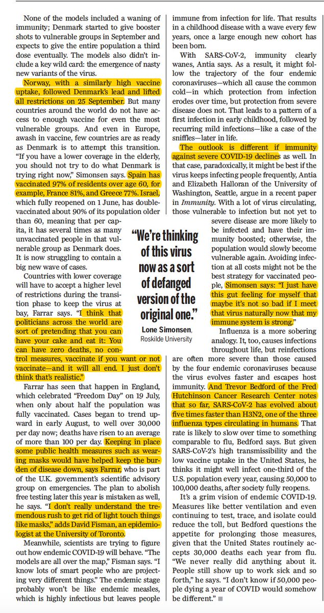</img></a>

---

<a href="https://twitter.com/erictopol/status/1446221075801522207" target="_blank" rel="noreferer">21:09 UCT</a>

New from Israel on booster restoration of Pfizer vaccine effectiveness across all age groups
"Across all age groups, rates of confirmed infection and severe illness were substantially lower among those who received a booster dose of the BNT162b2 vaccine"
https://www.medrxiv.org/content/10.1101/2021.10.07.21264626v1 

<a href="FBIB8OLVQCUQ7W4.jpg"  >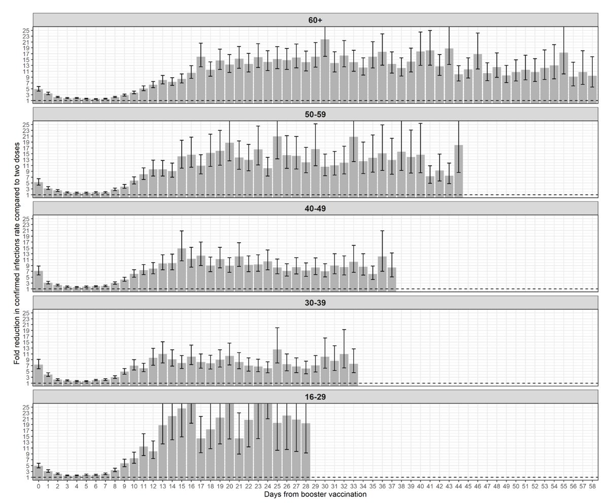</img></a>

---

<a href="https://twitter.com/erictopol/status/1446222771042729999" target="_blank" rel="noreferer">21:15 UCT</a>

More details on magnitude of protection from severe illness (all ages) and death (60+) 

<a href="FBIDkKAVQBgixkd.jpg"  >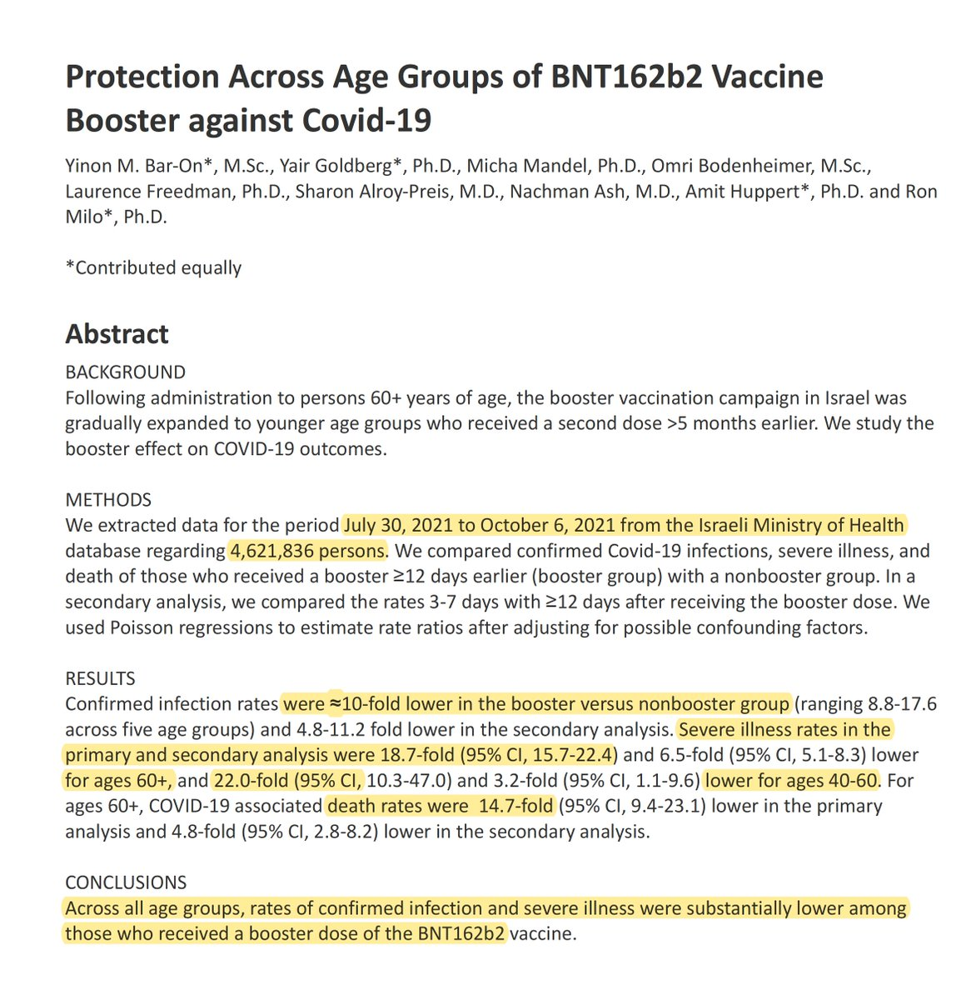</img></a>

---

<a href="https://twitter.com/erictopol/status/1446235488629637121" target="_blank" rel="noreferer">22:06 UCT</a>

@schrep Thanks for your message, Mike.  Maybe some day if @Facebook is ever rebooted to do good.

---

<a href="https://twitter.com/erictopol/status/1446248941960318981" target="_blank" rel="noreferer">22:59 UCT</a>

It took 150 years. But we're moving from that to this.
https://www.thelancet.com/journals/lancet/article/PIIS0140-6736(21)02149-8/fulltext @TheLancet @chrispiech @Stanford @scrippsresearch #AI 

<a href="FBIbGkrVEAEQtlN.jpg"  ></img></a><a href="FBIbKtzUUAALlhG.jpg"  >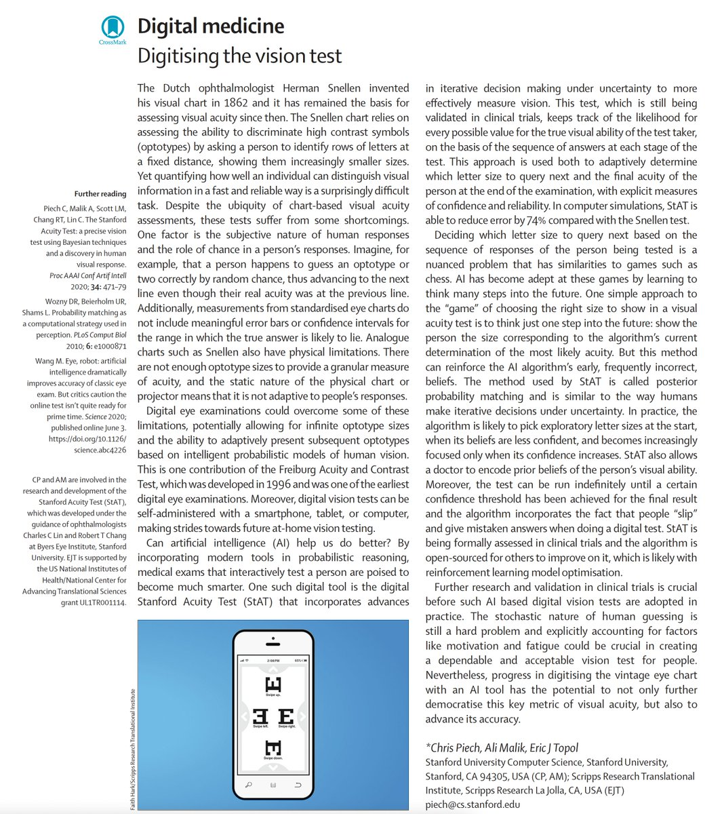</img></a>

---

<a href="https://twitter.com/erictopol/status/1446262783910158336" target="_blank" rel="noreferer">23:54 UCT</a>

These 3rd shot data are compelling.
Beyond protection vs deaths in age 60+ (graph), vs severe illness in younger age groups
But those biased against the usefulness of boosters will continue to put them aside, while over time the gradient of benefit will augment.  https://twitter.com/EricTopol/status/1446221075801522207

<a href="FBInUY3VEAEkXYM.jpg"  ></img></a>