+++
title = "Tweets by Eric Topol Oct 08"
Summary = ""
tags = ["Twitter"]
category = "Twitter"
+++

---

<a href="https://twitter.com/erictopol/status/1446265484349902865" target="_blank" rel="noreferer">00:05 UCT</a>

@BogochIsaac No. But I wouldn't keep discounting the importance of preventing symptomatic infections as you apparently do.
https://twitter.com/BogochIsaac/status/1445930272587878403

---

<a href="https://twitter.com/erictopol/status/1446283472587280388" target="_blank" rel="noreferer">01:17 UCT</a>

RT @DFisman: gonna go out on a limb here and say it's a 3 dose vaccine.  That's all.  Not rocket science.

---

<a href="https://twitter.com/erictopol/status/1446300801710706693" target="_blank" rel="noreferer">02:25 UCT</a>

New US milestone: back down below 100,000 cases (7-day average) for the first time in over 2 months 

<a href="FBJKyX-VIAYM_ex.jpg"  >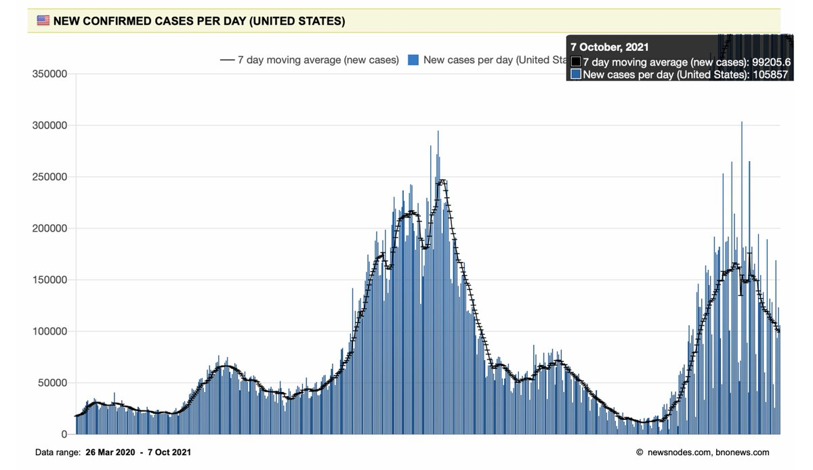</img></a>

---

<a href="https://twitter.com/erictopol/status/1446312562778279937" target="_blank" rel="noreferer">03:12 UCT</a>

What if Texas and Florida had vaccinated at the level of New England by July 31st?
https://www.thelancet.com/journals/laninf/article/PIIS1473-3099(21)00620-4/fulltext
Prevention of:
Deaths: Texas 6,353, Florida 16,235
Hospitalizations: Texas 37,587, Florida 61,327
@Pratha_Sah @Alison_Galvani @YaleSPH @PeterHotez  @TheLancetInfDis 

<a href="FBJS7ebVQAIPKoA.jpg"  >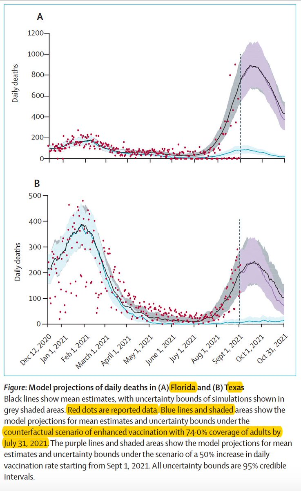</img></a>

---

<a href="https://twitter.com/erictopol/status/1446486174361522181" target="_blank" rel="noreferer">14:42 UCT</a>

The Delta wave deaths in the US and Canada
and a 17 per cent point difference in fully vaccinated of total population 

<a href="FBLy8BdVQAAokzv.jpg"  >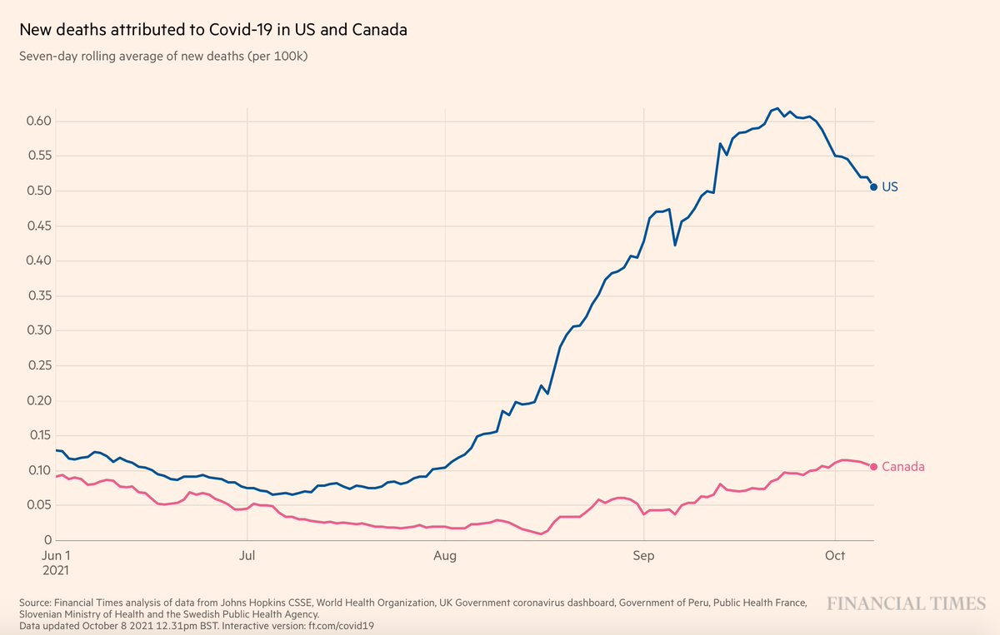</img></a><a href="FBLzbBUVIAYc35M.jpg"  >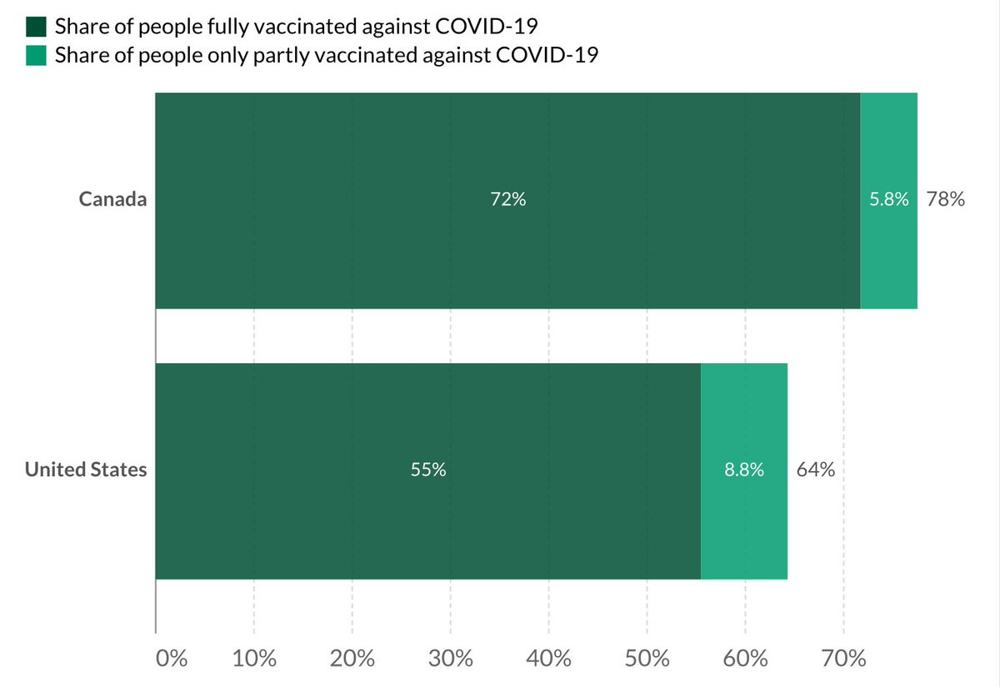</img></a>

---

<a href="https://twitter.com/erictopol/status/1446489484057452554" target="_blank" rel="noreferer">14:55 UCT</a>

On Francis Collins, our @NIHDirector 
https://www.washingtonpost.com/opinions/2021/10/07/francis-collins-nih-covid-science-faith-truth/
"..Such energy and ambition could be combined with such gentleness of spirit. We’re accustomed to the convergence of brilliance and arrogance. In Collins, restless genius is other-centered." --@MJGerson @PostOpinions💯 

<a href="FBL1uedVQAcw8i-.jpg"  >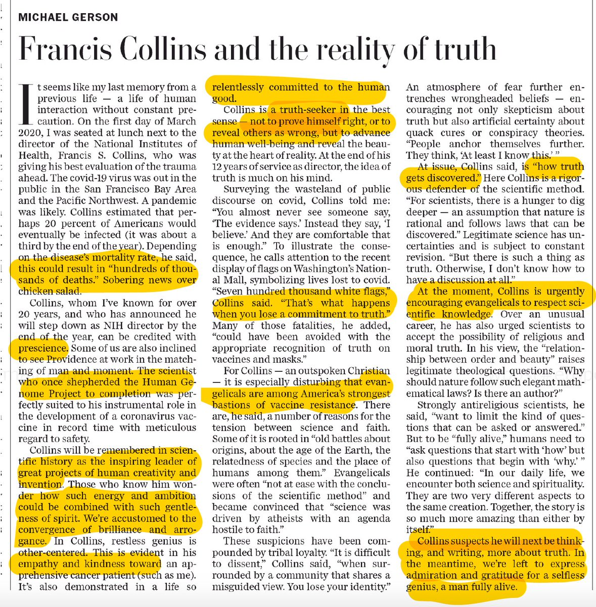</img></a>

---

<a href="https://twitter.com/erictopol/status/1446490809130373129" target="_blank" rel="noreferer">15:00 UCT</a>

RT @zeynep: @EricTopol So the US doesn't just have large numbers of unvaccinated, we have them embedded in a clustered network structure th…

---

<a href="https://twitter.com/erictopol/status/1446508341925011460" target="_blank" rel="noreferer">16:10 UCT</a>

Succinct summary @Nature 
https://www.nature.com/articles/d41586-021-02740-y

---

<a href="https://twitter.com/erictopol/status/1446545123681050624" target="_blank" rel="noreferer">18:36 UCT</a>

While we await vaccines to be approved for children, what is the best way to prevent Covid for them?
Adults getting vaccinated
https://www.researchsquare.com/article/rs-958479/v1 

<a href="FBMo8ovVIAEedJp.jpg"  >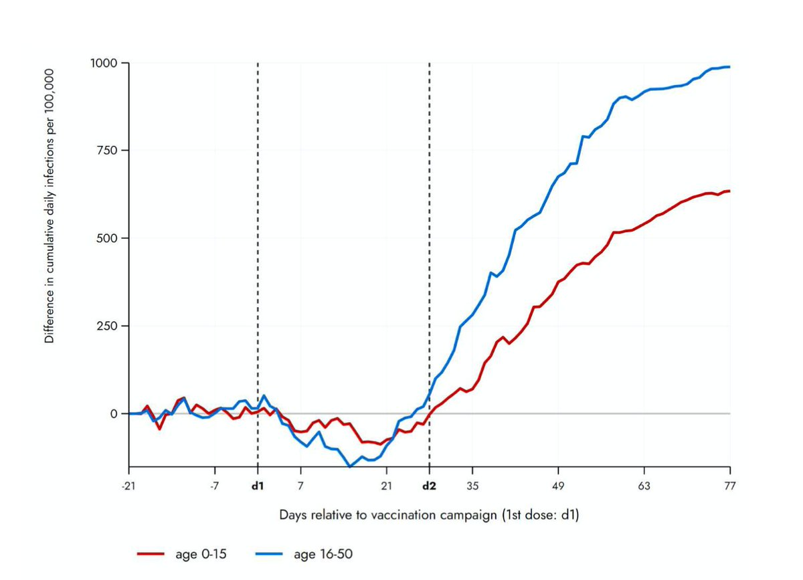</img></a>

---

<a href="https://twitter.com/erictopol/status/1446555038319398913" target="_blank" rel="noreferer">19:16 UCT</a>

Delta wave deaths in the US and Germany 

<a href="FBMx3m7VcAM_wYN.jpg"  >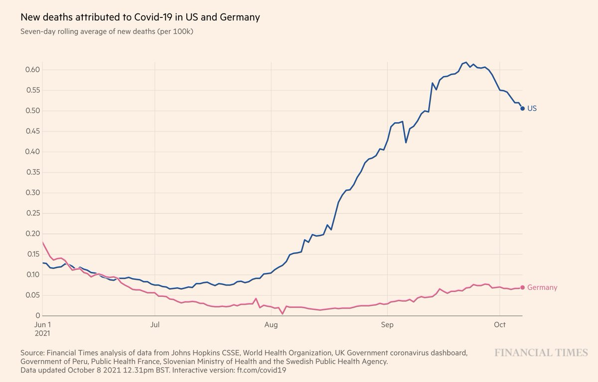</img></a>

---

<a href="https://twitter.com/erictopol/status/1446561380367171585" target="_blank" rel="noreferer">19:41 UCT</a>

More on this, by US states
https://www.washingtonpost.com/education/2021/10/04/kids-covid-cases-tennessee/ by @laurameckler and @dtkeating @PostGraphics 

<a href="FBM35-EVEAA-CxC.jpg"  >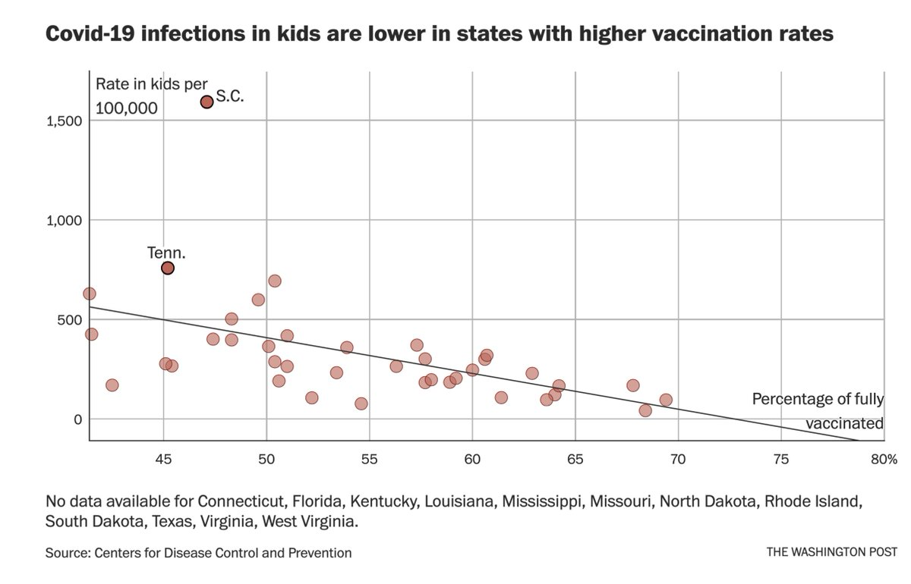</img></a>

---

<a href="https://twitter.com/erictopol/status/1446566338768502785" target="_blank" rel="noreferer">20:01 UCT</a>

The comprehensive list of #SARSCoV2 variants that have competed with Delta 

<a href="FBM8UN_VIAYo6hS.jpg"  ></img></a>

---

<a href="https://twitter.com/erictopol/status/1446567090748411906" target="_blank" rel="noreferer">20:04 UCT</a>

And we need to keep it that way by containing Delta globally ......so there isn't an entry on this list.

---

<a href="https://twitter.com/erictopol/status/1446590072854249473" target="_blank" rel="noreferer">21:35 UCT</a>

A gene variant (OAS1) recently report to be associated with severe Covid
https://www.science.org/doi/10.1126/science.abj3624
@ScienceMagazine 
is now also shown to be associated with Alzheimer's disease
https://academic.oup.com/brain/advance-article/doi/10.1093/brain/awab337/6382473 

<a href="FBNRgq2UUAUl0z-.png"  >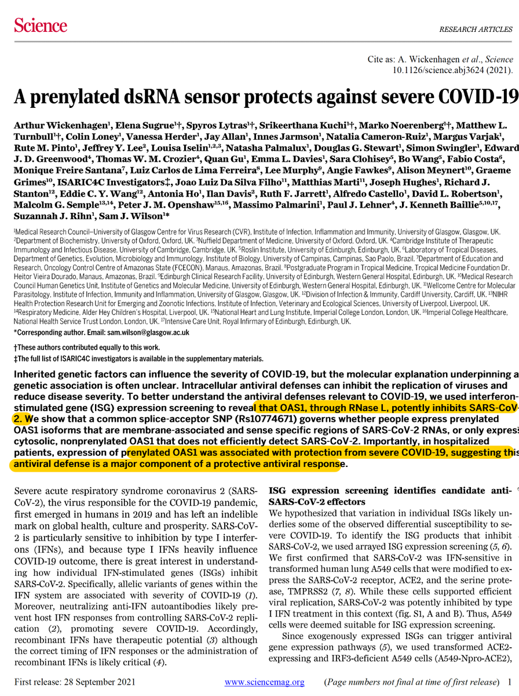</img></a><a href="FBNRikTVUAAn6d2.jpg"  >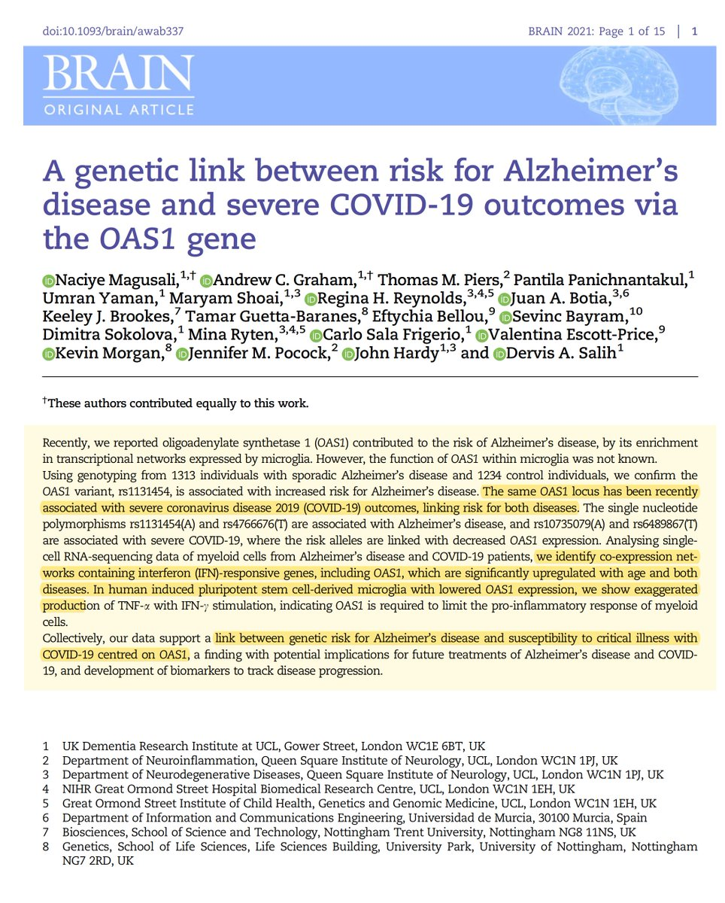</img></a>

---

<a href="https://twitter.com/erictopol/status/1446607100595998723" target="_blank" rel="noreferer">22:43 UCT</a>

Just published @TheLancet
The profound hit of the pandemic on mental health, anxiety and depression, across 204 countries, and especially among women and younger people
https://www.thelancet.com/journals/lancet/article/PIIS0140-6736(21)02143-7/fulltext 

<a href="FBNg6fgUYAY00a9.png"  >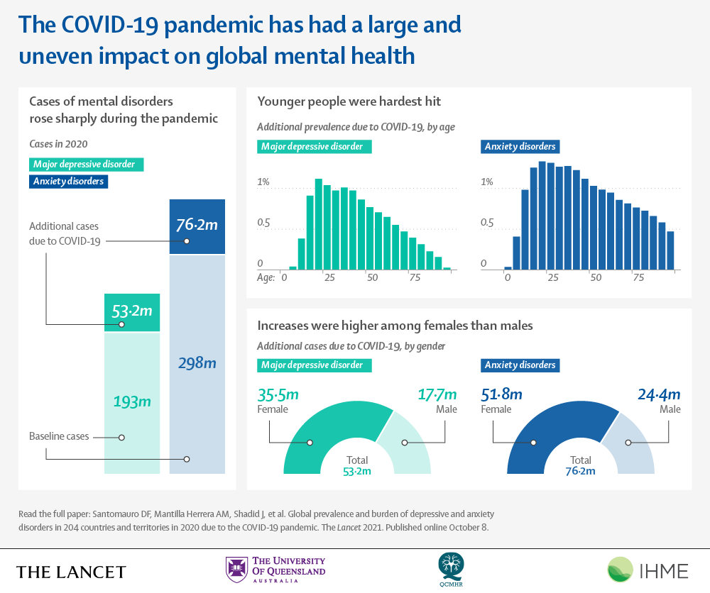</img></a><a href="FBNhaG_VgAMNWcM.jpg"  >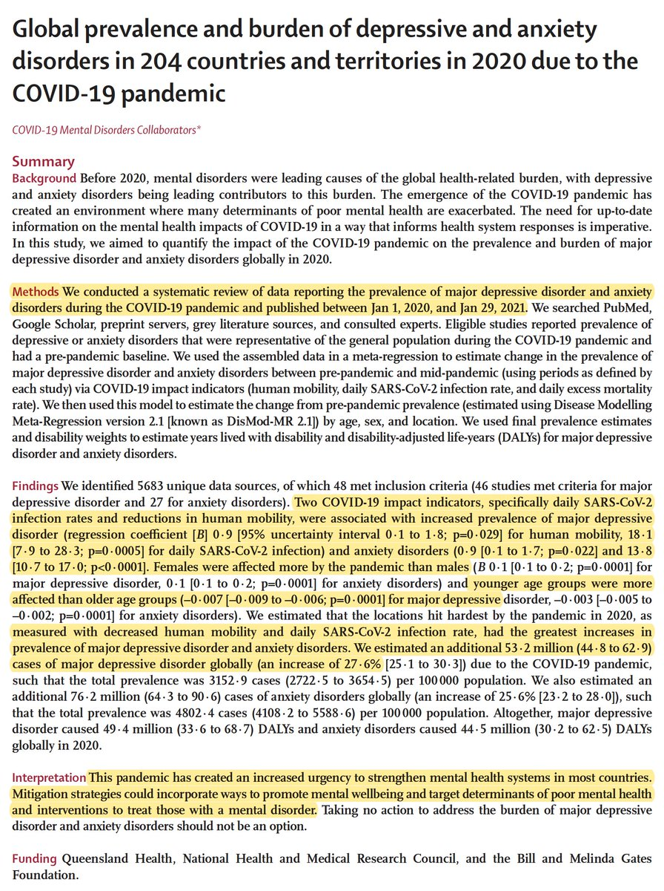</img></a><a href="FBNhba1UYAEg_kr.jpg"  >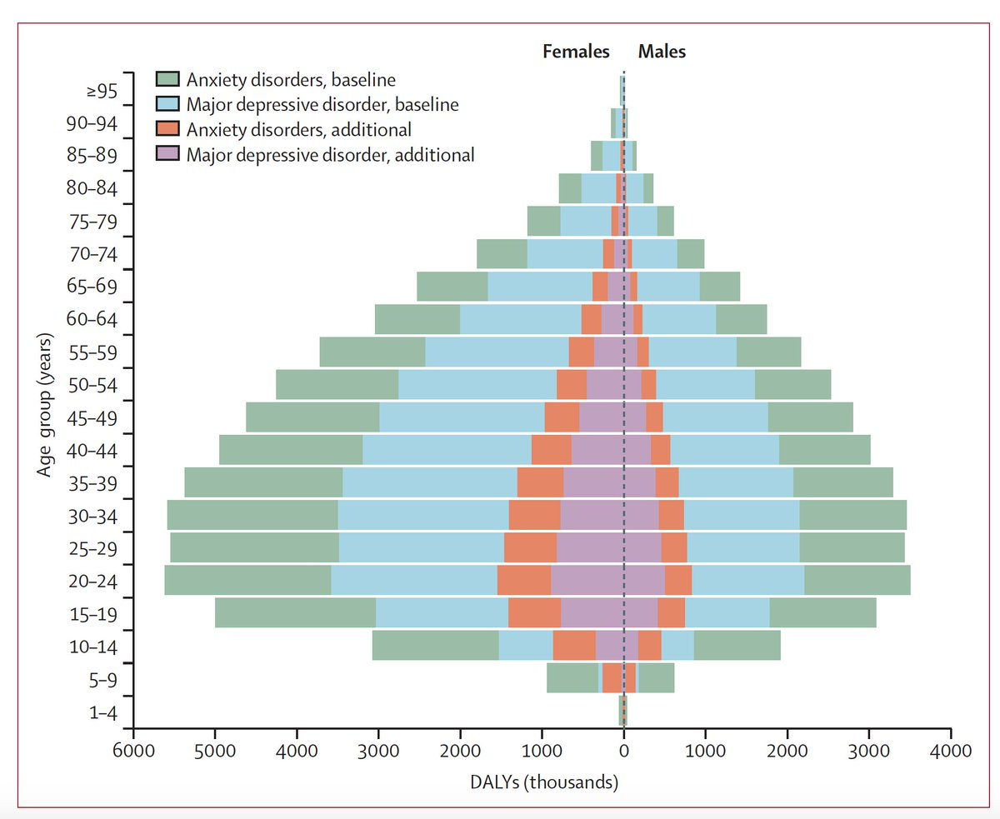</img></a><a href="FBNhc7IUYAEqsdF.jpg"  >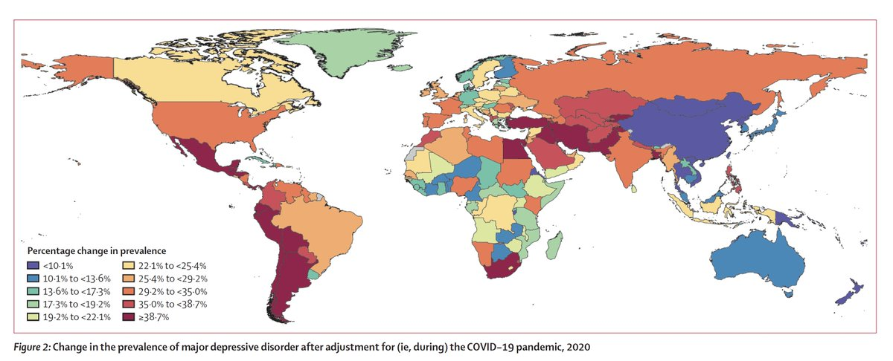</img></a>