+++
title = "Tweets by Eric Topol Oct 11"
Summary = ""
tags = ["Twitter"]
category = "Twitter"
+++

---

<a href="https://twitter.com/erictopol/status/1447353845475004419" target="_blank" rel="noreferer">00:10 UCT</a>

@drninashapiro @PeterHotez Right, we don't even have such national data after the 2nd dose.

---

<a href="https://twitter.com/erictopol/status/1447550032077414421" target="_blank" rel="noreferer">13:09 UCT</a>

When covid vaccination data are impossible 
1. &gt;100% of people vaccinated
https://www.ft.com/content/125fbaf8-175a-4e2e-852a-9995ca5176b2 

<a href="FBa59heVcAI3QI6.jpg"  >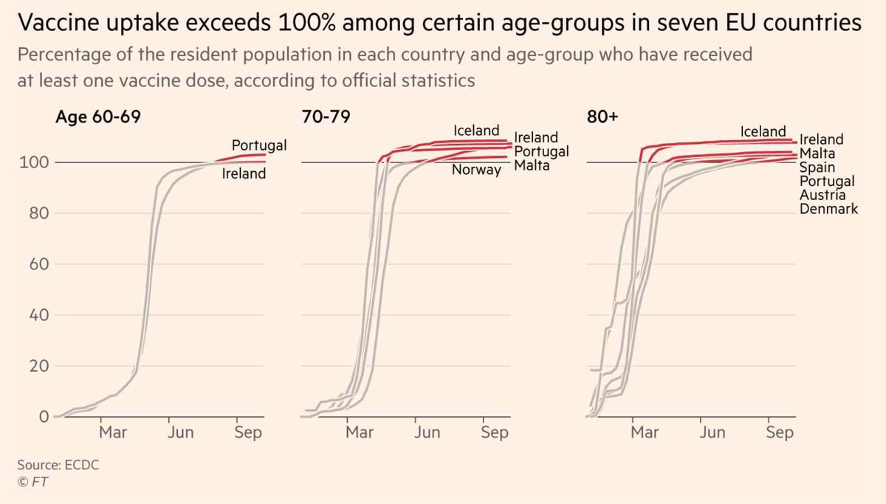</img></a>

---

<a href="https://twitter.com/erictopol/status/1447550036582141960" target="_blank" rel="noreferer">13:09 UCT</a>

2. When the number of people vaccinated far exceeds the resident population, which helps explain the Florida outlier issue (% vaccinated vs death rate) 

<a href="FBa6lQ3VUAIwmb5.jpg"  >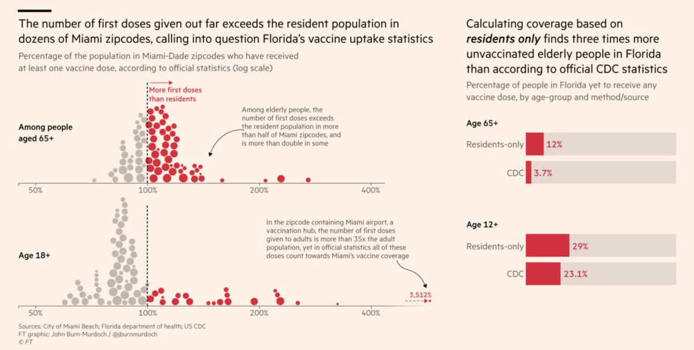</img></a>

---

<a href="https://twitter.com/erictopol/status/1447551481637314563" target="_blank" rel="noreferer">13:15 UCT</a>

Our covid times :-) 

<a href="FBa8RO6VIAMw1Nx.jpg"  >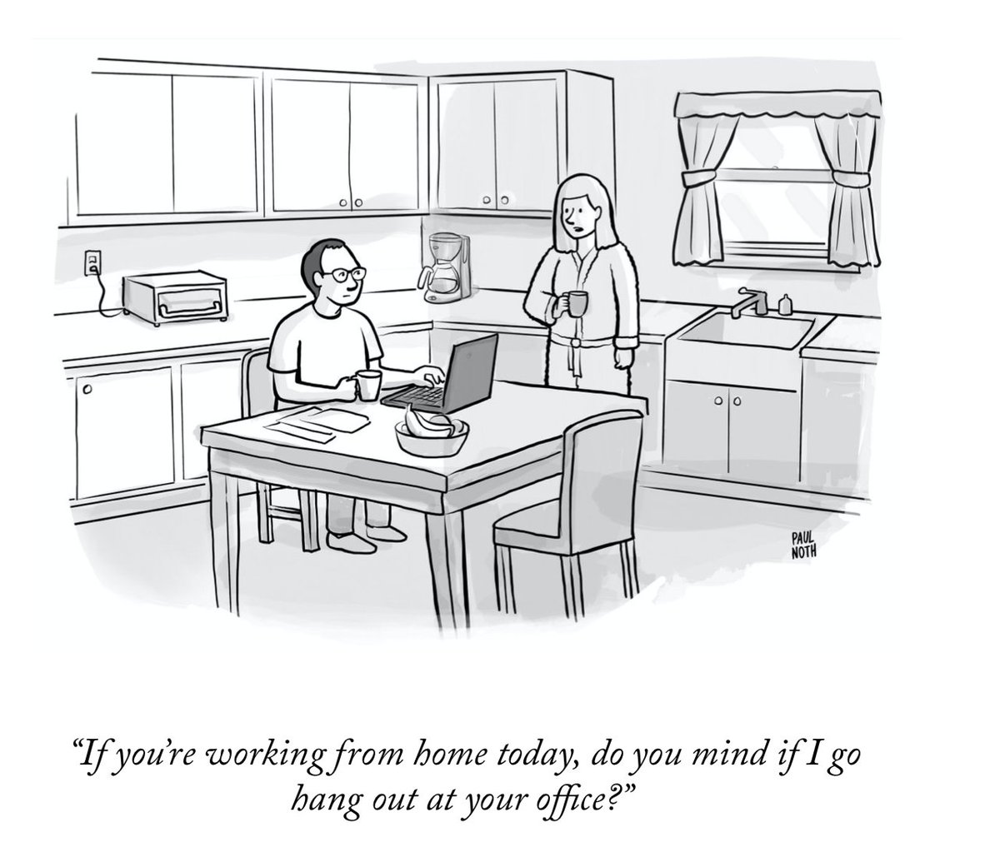</img></a><a href="FBa8TR2UUAAKLsj.png"  >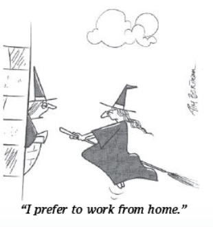</img></a>

---

<a href="https://twitter.com/erictopol/status/1447554223105708035" target="_blank" rel="noreferer">13:26 UCT</a>

The Phase 3 randomized trial of the @Novavax protein vaccine in ~30,000 participants (2:1 randomization) in the US and Mexico with overall efficacy &gt;90% vs symptomatic infections
https://www.medrxiv.org/content/10.1101/2021.10.05.21264567v1
new @medrxivpreprint 

<a href="FBa-ZivVIAAq__N.jpg"  >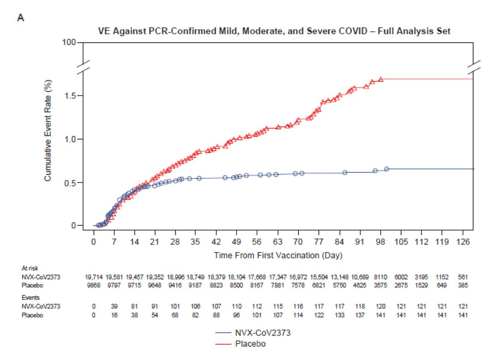</img></a>

---

<a href="https://twitter.com/erictopol/status/1447568436645675019" target="_blank" rel="noreferer">14:23 UCT</a>

RT @TheLancet: Digitising the vision test—a look into the future? 👁️

@chrispiech, Ali Malik, and @EricTopol explore the potential of digit…

---

<a href="https://twitter.com/erictopol/status/1447576124939112451" target="_blank" rel="noreferer">14:53 UCT</a>

7. Supporting the last point, preventing deaths 

<a href="FBbSroKUcAI8rhx.jpg"  >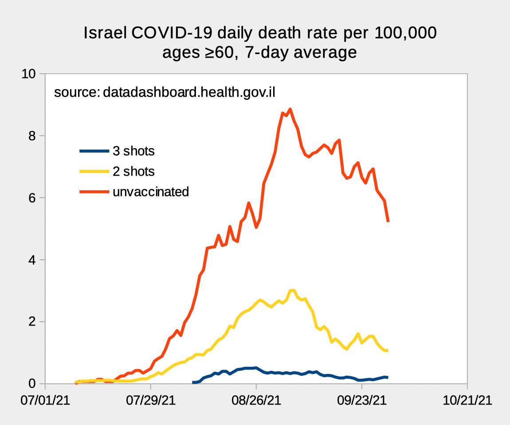</img></a>

---

<a href="https://twitter.com/erictopol/status/1447585910321659912" target="_blank" rel="noreferer">15:32 UCT</a>

Importance of the family Covid immunity bubble: a study of over 800,000 families shows a 45 to 97% reduced risk for infection as the number of family members with vaccination or prior Covid increased
@JAMAInternalMed 
https://jamanetwork.com/journals/jamainternalmedicine/fullarticle/2785141 

<a href="FBbTKKXVQAEE1uJ.jpg"  >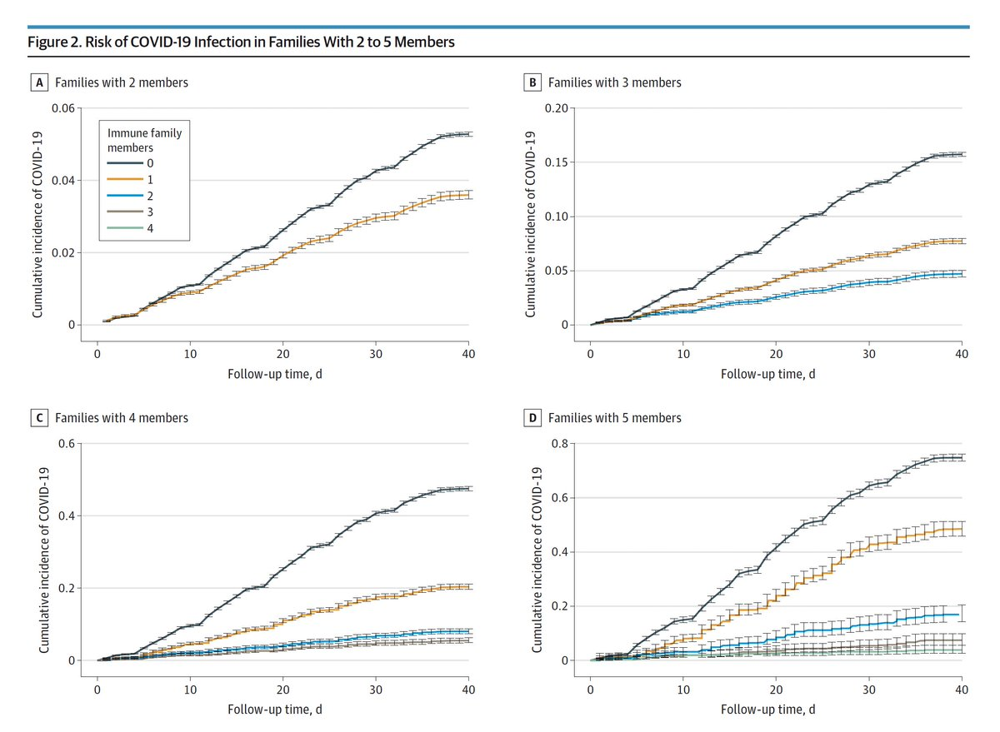</img></a>

---

<a href="https://twitter.com/erictopol/status/1447587238158606343" target="_blank" rel="noreferer">15:37 UCT</a>

RT @TalKopan: Wow, this is welcome news for parents

---

<a href="https://twitter.com/erictopol/status/1447593088105390085" target="_blank" rel="noreferer">16:01 UCT</a>

Just published @Nature 
Impact of variants, including Delta (B.1.617.2), on neutralizing antibody levels in vaccinated health care workers, with or w/o prior Covid
https://www.nature.com/articles/s41586-021-04085-y
@VirusesImmunity @YaleIBIO @carolilucas
Support for 💉boosters in people w/o prior infection 

<a href="FBbhl5OVgAEUOjb.jpg"  >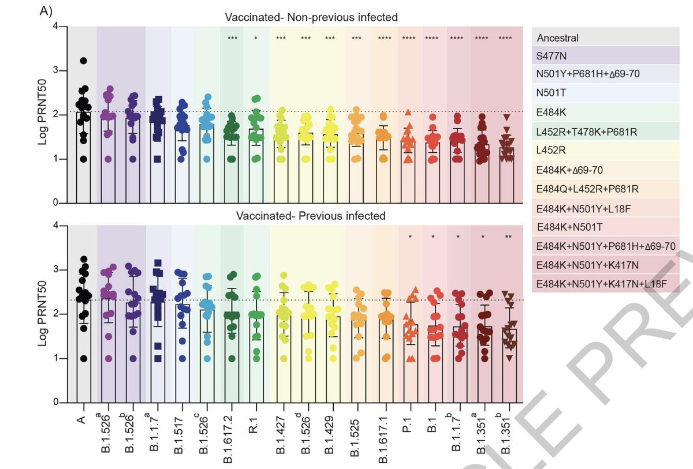</img></a>

---

<a href="https://twitter.com/erictopol/status/1447597310075031556" target="_blank" rel="noreferer">16:17 UCT</a>

Is the worst of the US pandemic over? The good news is the 20% reduction cases and hospitalizations in the past 2 weeks, but the levels are still very high. And there's a shift in where deaths are occurring.
https://www.ft.com/content/55a8e7b2-0abb-4eb4-8e82-726dc2ba13e1 graph by @caitlinsgilbert @FT
@JamieSmythF 

<a href="FBbkfYzVEAcmQJF.jpg"  >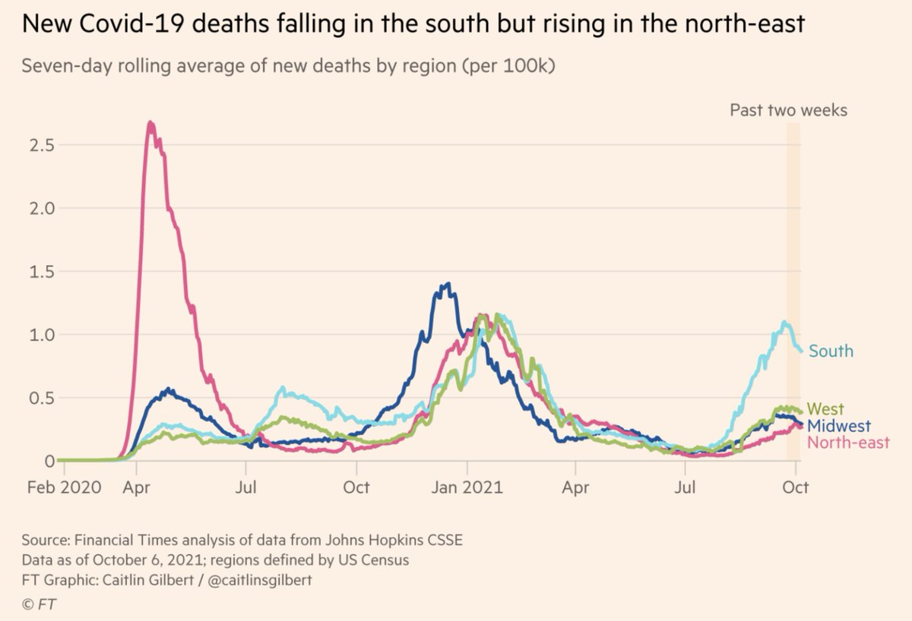</img></a>

---

<a href="https://twitter.com/erictopol/status/1447628626933862400" target="_blank" rel="noreferer">18:22 UCT</a>

Three different post-Delta wave patterns in countries with high vaccination rates, relative to the US (examples)
1.  Full descent (to date): UAE, Spain, Portugal
2. Unsteady: UK, Denmark (at very different case levels)
3. Flare-up: Singapore
@OurWorldInData 

<a href="FBcBsvdVkAQMwip.jpg"  >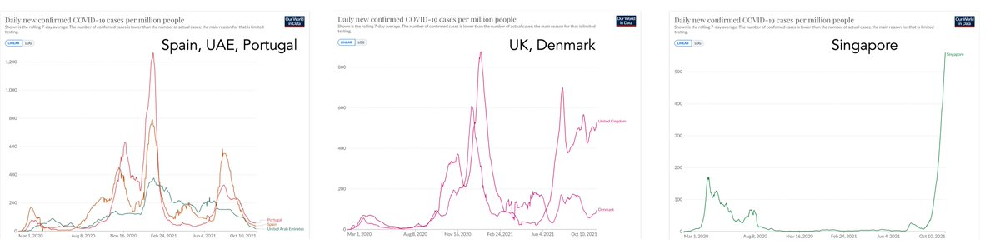</img></a>

---

<a href="https://twitter.com/erictopol/status/1447651632309669890" target="_blank" rel="noreferer">19:53 UCT</a>

The hope for the US is to follow pattern 1, but the reality is more likely to be 2, owing to fully vaccinated rate 56%, compared with countries up to 30 per cent points higher (examples in pattern 1) of their total population 

<a href="FBcWpRUVgAU4g5J.jpg"  >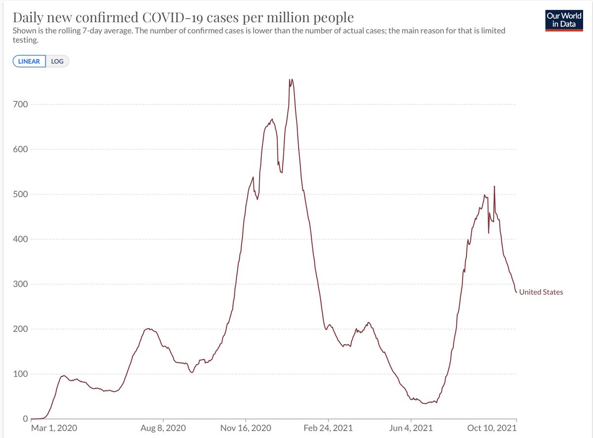</img></a><a href="FBcXe7rVIAMB1xo.jpg"  >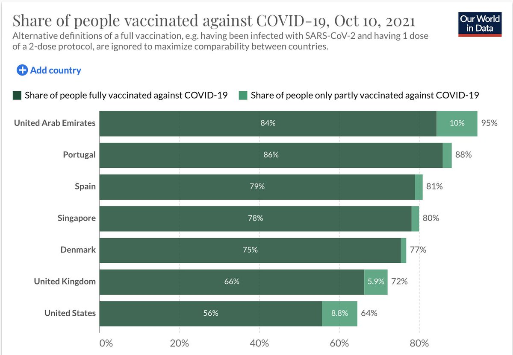</img></a>

---

<a href="https://twitter.com/erictopol/status/1447674308680040450" target="_blank" rel="noreferer">21:23 UCT</a>

"Hey, #AI, please process over 100,000 climate change studies and tell me what you've got"
"Over 80% of the planet, 85% of people, are already impacted and here's the map"
https://www.nature.com/articles/s41558-021-01168-6 @NatureClimate 

<a href="FBcr_DvVUAExY8e.jpg"  >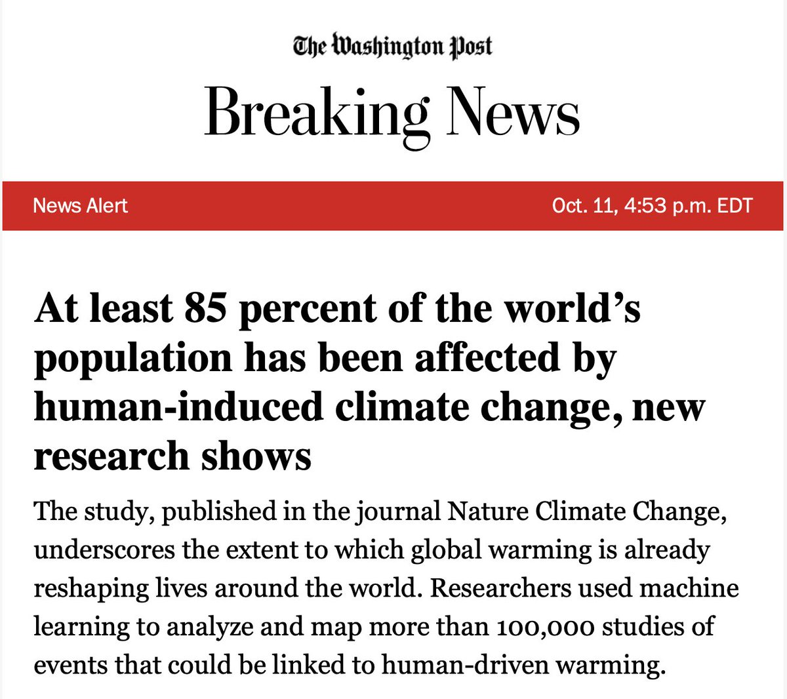</img></a><a href="FBcr5fYVgAAuJTA.jpg"  >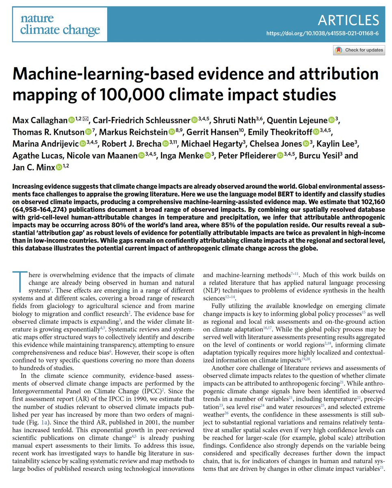</img></a><a href="FBcr7DYVcAICk2m.jpg"  >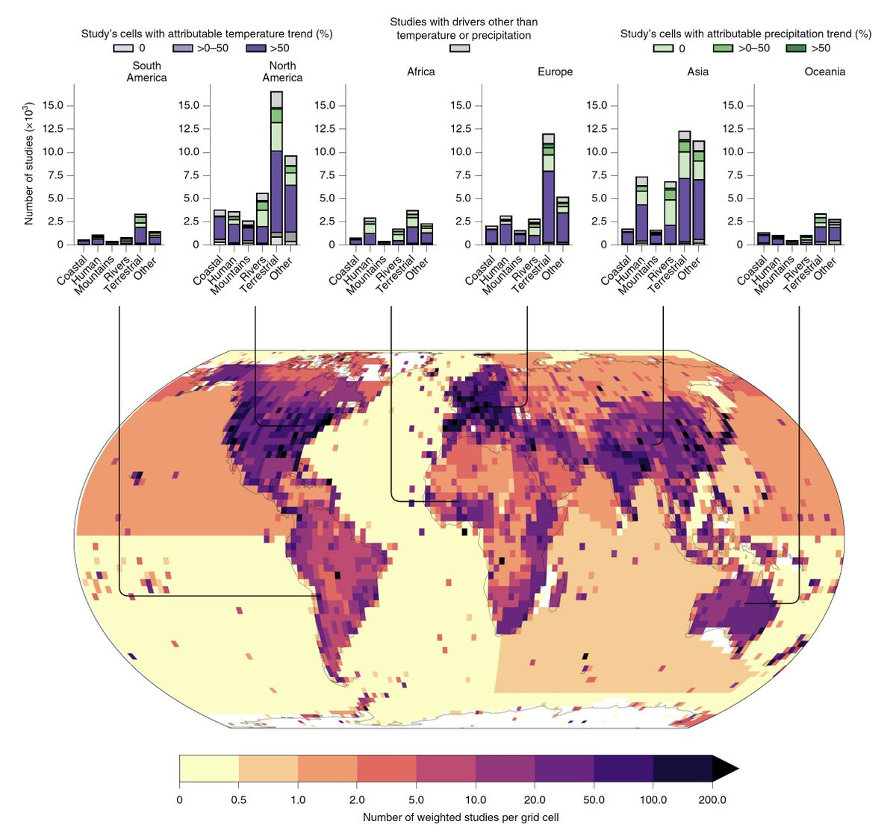</img></a>

---

<a href="https://twitter.com/erictopol/status/1447711106424664066" target="_blank" rel="noreferer">23:49 UCT</a>

The anti-spike IgG antibody immune response in 346 healthcare workers (median age 67) induced by a 3rd shot/booster Pfizer vaccine @LancetMicrobe https://www.thelancet.com/journals/lanmic/article/PIIS2666-5247(21)00272-X/fulltext 

<a href="FBdM41GVcAEBd6u.jpg"  >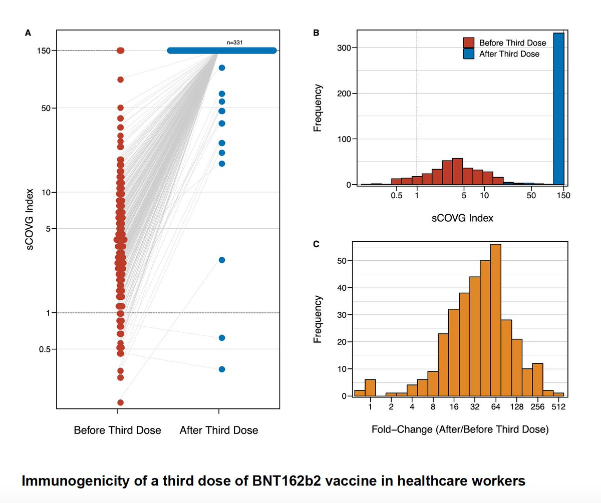</img></a>