+++
title = "Tweets by Eric Topol Oct 12"
Summary = ""
tags = ["Twitter"]
category = "Twitter"
+++

---

<a href="https://twitter.com/erictopol/status/1447714993831505922" target="_blank" rel="noreferer">00:05 UCT</a>

It's a good sign when California is on a roll 
--First time test positivity has gotten below 2% in &gt; 3 months (now 1.9%)
--Hospitalizations to lowest level in &gt; 2 months 

<a href="FBdRCuQVEAEeMVd.jpg"  >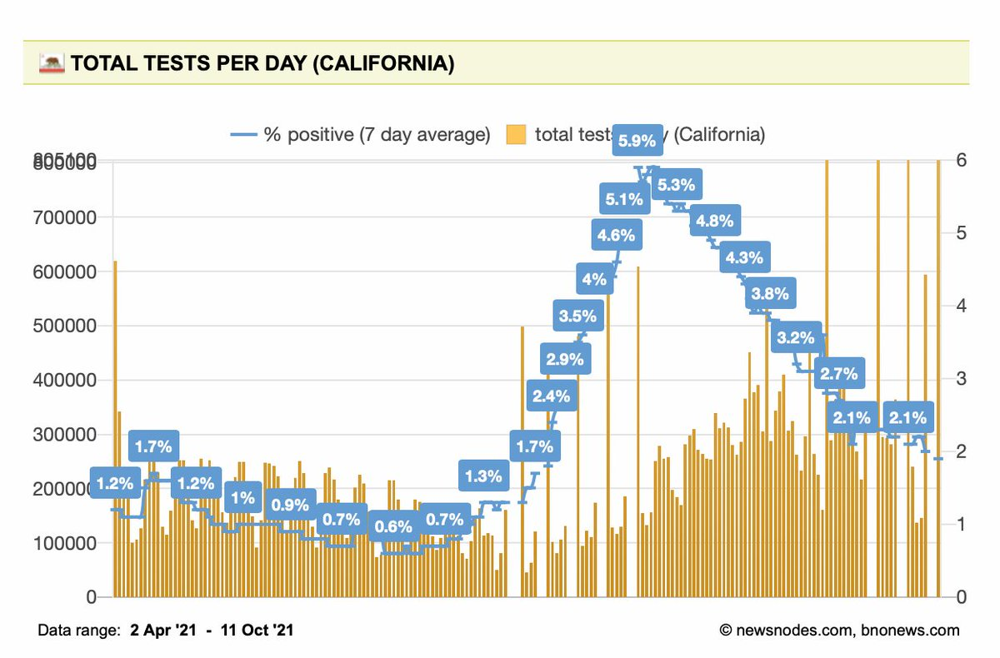</img></a><a href="FBdQtvjVEAItPwr.jpg"  >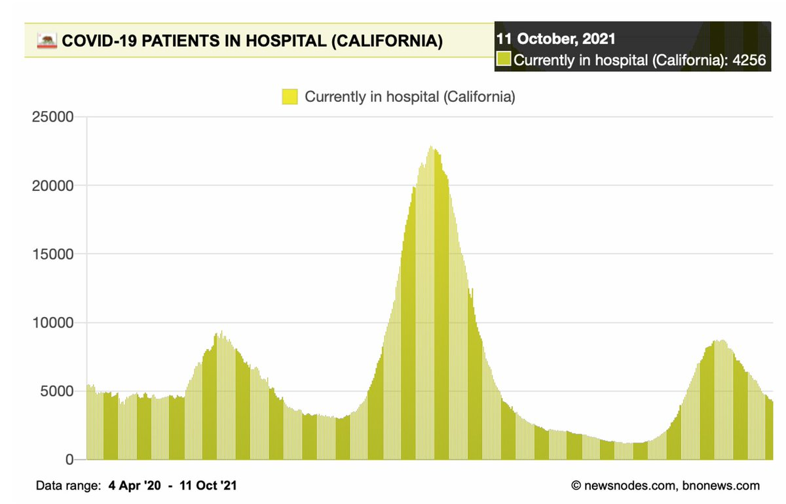</img></a>

---

<a href="https://twitter.com/erictopol/status/1447753366440841217" target="_blank" rel="noreferer">02:37 UCT</a>

An extensive new study (N=267) of the immune response to prior Covid and mRNA vaccination, over time, and to Delta. While prior Covid induces a durable antibody and memory B cell response, Delta poses a challenge (yet another reason why 💉adds well)
https://www.biorxiv.org/content/10.1101/2021.10.08.463699v1 

<a href="FBdzrsDVQAEoafn.jpg"  >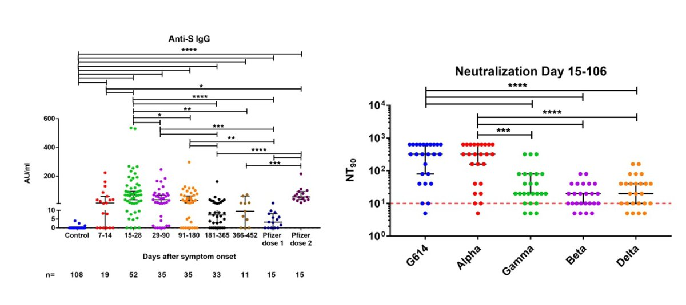</img></a>

---

<a href="https://twitter.com/erictopol/status/1447925993243652103" target="_blank" rel="noreferer">14:03 UCT</a>

What data does @moderna_tx have to support its 50 ug booster dose? @US_FDA briefing documents provide immune response data across age groups but no evidence of restoration of clinical effectiveness https://www.fda.gov/media/152953/download 

<a href="FBgQhZOXoAMBLg0.png"  >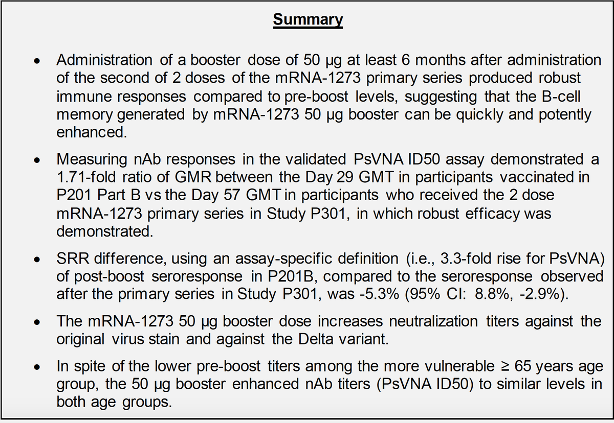</img></a>

---

<a href="https://twitter.com/erictopol/status/1447928390703517698" target="_blank" rel="noreferer">14:13 UCT</a>

The same amended criteria given for Pfizer's emergency authorization are what Moderna is requesting. This will be an interesting VRBPAC meeting that essentially leverages effectiveness data from another vaccine (which I support) vs purists who will claim clinicaldata are lacking 

<a href="FBgSAU9WYAIu6cU.png"  >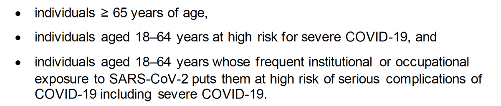</img></a>

---

<a href="https://twitter.com/erictopol/status/1447934140884652047" target="_blank" rel="noreferer">14:36 UCT</a>

@zeynep Yes, of course, but that isn't what the VRBPAC meeting and FDA approval are about

---

<a href="https://twitter.com/erictopol/status/1447936531835072535" target="_blank" rel="noreferer">14:45 UCT</a>

I sure hope so, but this isn't resolved yet
https://www.wsj.com/articles/new-clues-emerge-about-whether-vaccines-can-help-fight-long-covid-11633957200?mod=searchresults_pos1&page=1 @rddysum 
A @MountSinaiNYC study was negative for vaccination improving #LongCovid https://papers.ssrn.com/sol3/papers.cfm?abstract_id=3936501  https://twitter.com/EricTopol/status/1443702187159285784

<a href="FBgZW0AWYAg8hAm.jpg"  >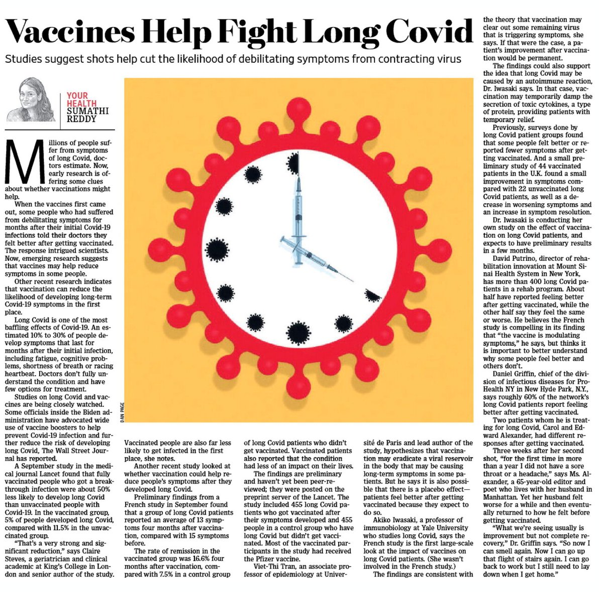</img></a>

---

<a href="https://twitter.com/erictopol/status/1447950463265955845" target="_blank" rel="noreferer">15:41 UCT</a>

If anything were to convey the risk of Covid in unvaccinated pregnant women and the marked benefit of vaccination, this should
https://www.nytimes.com/2021/10/11/world/pregnant-women-covid-vaccine.html?searchResultPosition=2
by @CoraEngelbrecht 

<a href="FBgm4myVUAc6Sw_.jpg"  >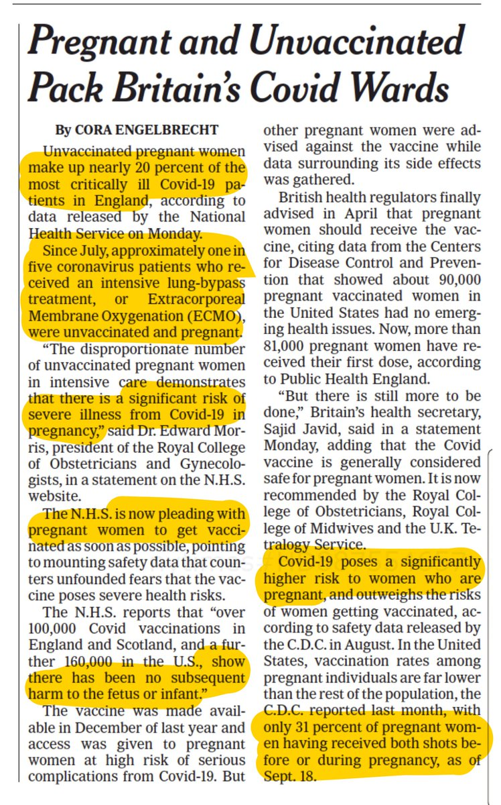</img></a>

---

<a href="https://twitter.com/erictopol/status/1447952119386886144" target="_blank" rel="noreferer">15:47 UCT</a>

This is a big turnaround. So much for the aspirin prevention of heart attack and stroke story
https://www.washingtonpost.com/lifestyle/2021/10/12/low-dose-aspirin-heart-attack-stroke/ 

<a href="FBgou9BUYAEhc7c.jpg"  >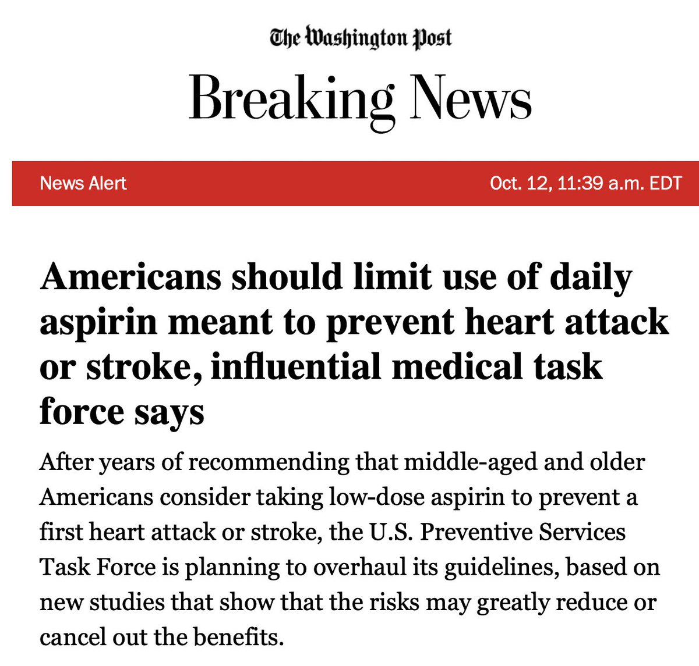</img></a>

---

<a href="https://twitter.com/erictopol/status/1447962786311520261" target="_blank" rel="noreferer">16:30 UCT</a>

The unusual FDA reviewer staff response
https://www.wsj.com/articles/fda-staff-dont-take-position-on-moderna-covid-19-booster-11634054284?mod=djemalertNEWS @felschwartz and @Loftus 

<a href="FBgyTgtUUAckbZI.jpg"  >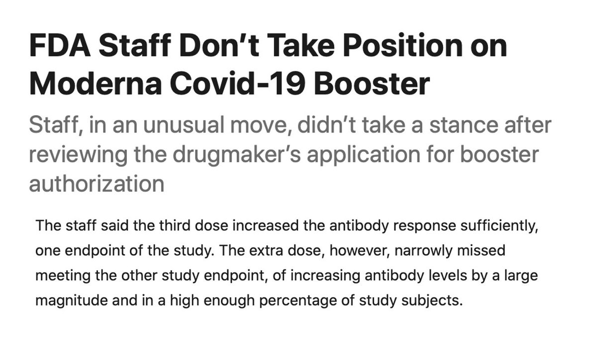</img></a>

---

<a href="https://twitter.com/erictopol/status/1447985846137745410" target="_blank" rel="noreferer">18:01 UCT</a>

The J&amp;J booster data for FDA review this week, like Moderna, has evidence for the immune response but without clinical effectiveness
https://www.fda.gov/media/152954/download 

<a href="FBhHaQSVQAMqfNd.jpg"  >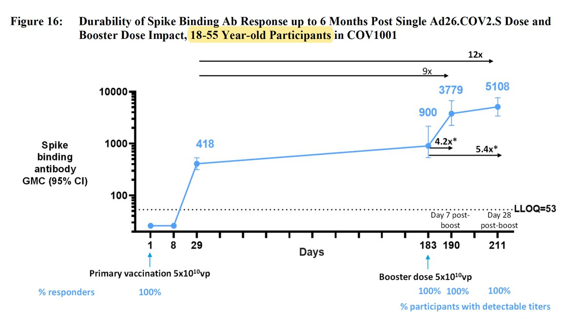</img></a><a href="FBhHcNMVUAE9smZ.jpg"  >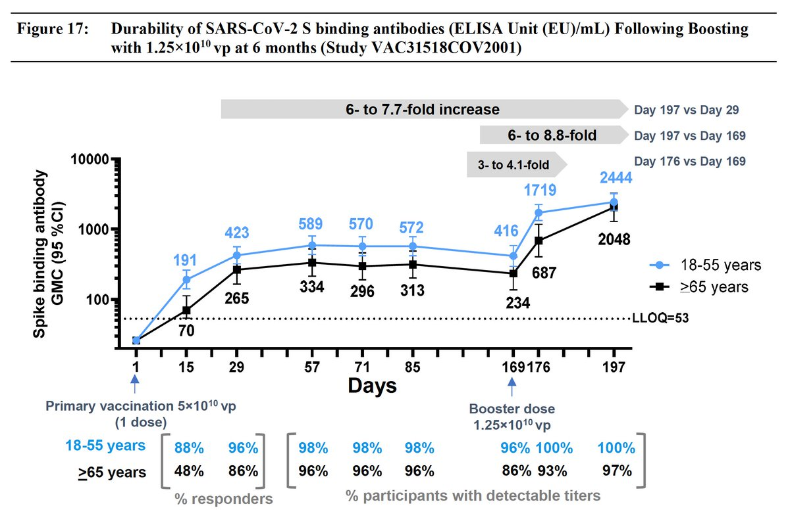</img></a>

---

<a href="https://twitter.com/erictopol/status/1447996579147771905" target="_blank" rel="noreferer">18:44 UCT</a>

The "M-pack" of Molnupiravir is 40 pills 
(2 pills, 4 times a day, for 5 days)
And it costs ($712) 40 times more than it costs to make it ($17.74)
https://theintercept.com/2021/10/05/covid-pill-drug-pricing-merck-ridgeback/
https://scholar.harvard.edu/files/melissabarber/files/estimated_cost-based_generic_prices_for_molnupiravir_for_the_treatment_of_covid-19_infection.pdf 

<a href="FBhP-MoUcAIpeVv.png"  >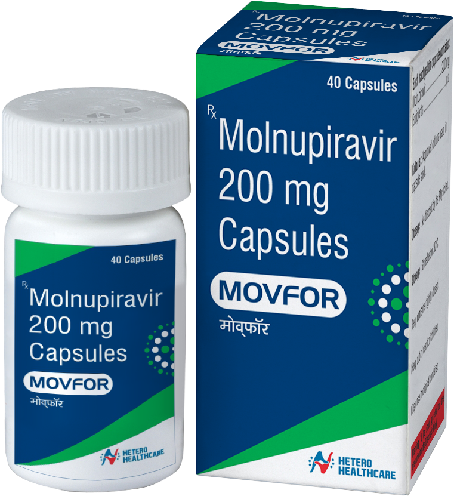</img></a>

---

<a href="https://twitter.com/erictopol/status/1447998758961168387" target="_blank" rel="noreferer">18:53 UCT</a>

Correction: 4 pills, twice a day, for 5 days

---

<a href="https://twitter.com/erictopol/status/1448006700665999364" target="_blank" rel="noreferer">19:24 UCT</a>

A US county-level analysis of opening K-12 schools and Covid risk
"These findings support policies that promote masking and other precautionary measures at schools and giving vaccine priority to education workers"
https://www.pnas.org/content/118/42/e2103420118
@PNASNews by @VC31415 @hkasahar 

<a href="FBhZGSmUcAAVpau.jpg"  >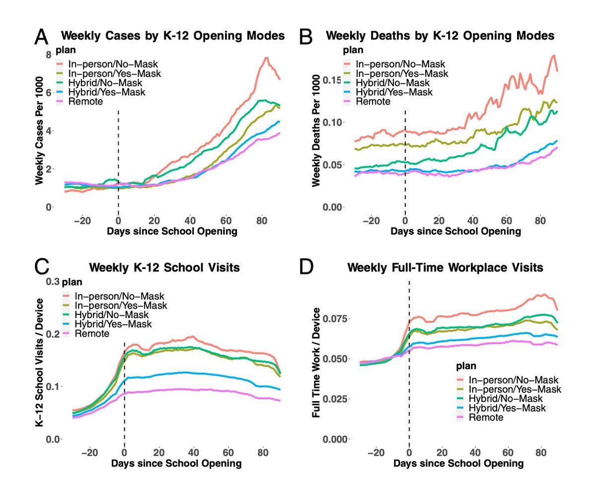</img></a>

---

<a href="https://twitter.com/erictopol/status/1448035440162840577" target="_blank" rel="noreferer">21:18 UCT</a>

In June, Israel got down to 1 case per million people/day (10 total). After reckoning with Delta, they're in sharp descent, and headed there, again.
@OurWorldInData 

<a href="FBh0J9YUYAAal9L.jpg"  >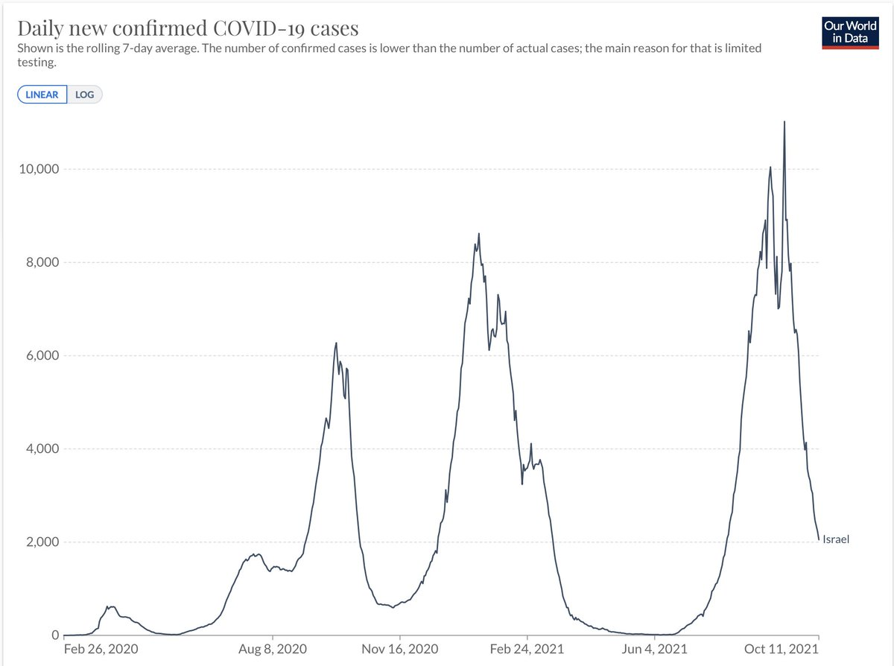</img></a><a href="FBh0S29VQAM8CYE.jpg"  >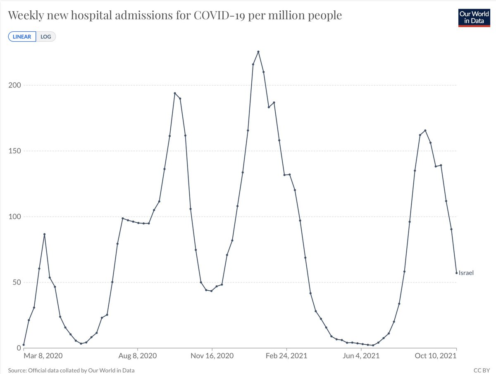</img></a>

---

<a href="https://twitter.com/erictopol/status/1448039393541853184" target="_blank" rel="noreferer">21:34 UCT</a>

It's pathetic that it took over 3 years from publications @NEJM for the US Preventive task Force to come out with this new guidance
https://mobile.twitter.com/erictopol/status/1041329892942462976?lang=ca

---

<a href="https://twitter.com/erictopol/status/1448045599450796034" target="_blank" rel="noreferer">21:59 UCT</a>

How can you be the country that made the 1st Covid vaccines, did clinical trials at warp speed with 95% efficacy and remarkable safety, has more than enough shots for every resident, yet be 52nd on the list, and continuing to fall? 
https://ig.ft.com/coronavirus-vaccine-tracker/?areas=gbr&areas=isr&areas=usa&areas=eue&areas=can&areas=chn&areas=ind&cumulative=1&doses=total&populationAdjusted=1 @FT 

<a href="FBh7gqdVEAA6cgd.jpg"  >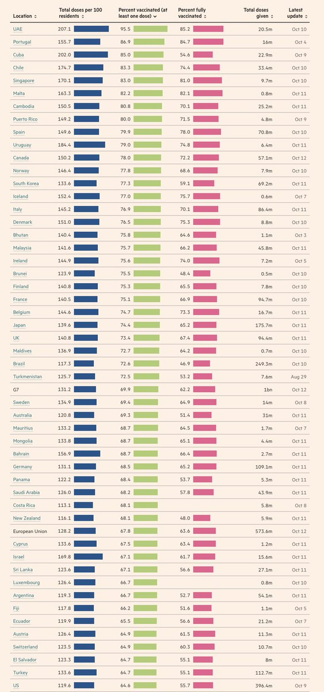</img></a>

---

<a href="https://twitter.com/erictopol/status/1448074569403846659" target="_blank" rel="noreferer">23:54 UCT</a>

The UK's vaccination campaign uncoupled its rise on cases from hospitalizations and deaths https://www.ft.com/content/dac75674-3d6b-4eaa-b3fe-51af3b7b0f40 by @martinwolf_ @FT 

<a href="FBiWIbUXoAgUPHL.jpg"  >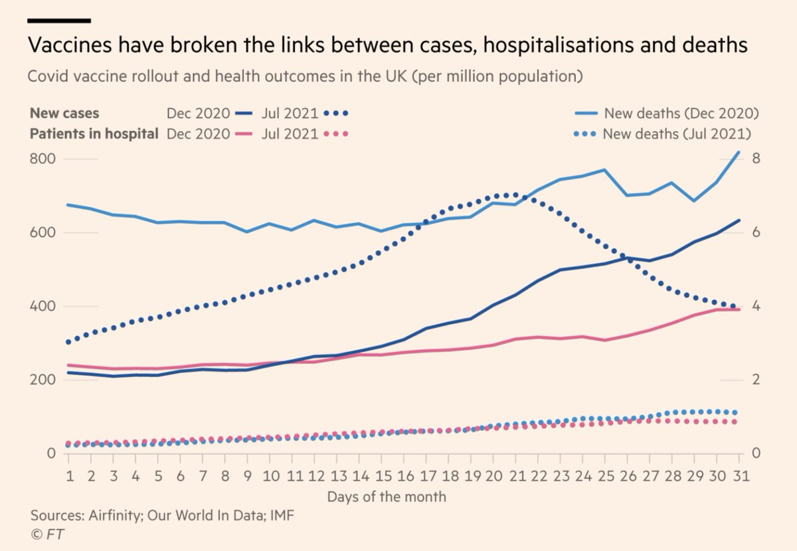</img></a>

---

<a href="https://twitter.com/erictopol/status/1448074577452666882" target="_blank" rel="noreferer">23:54 UCT</a>

The new UK report on its pandemic management "ranks as one of its most important public health failures" /2
https://www.nytimes.com/live/2021/10/12/world/covid-delta-variant-vaccines?type=styln-live-updates&label=coronavirus%20updates&index=0#britain-covid-response 

<a href="FBiWbAZX0AMb19D.jpg"  >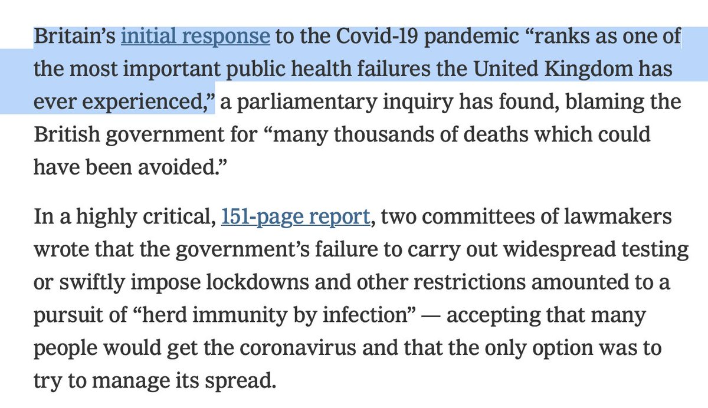</img></a><a href="FBiWkaDWQAMZi-p.jpg"  >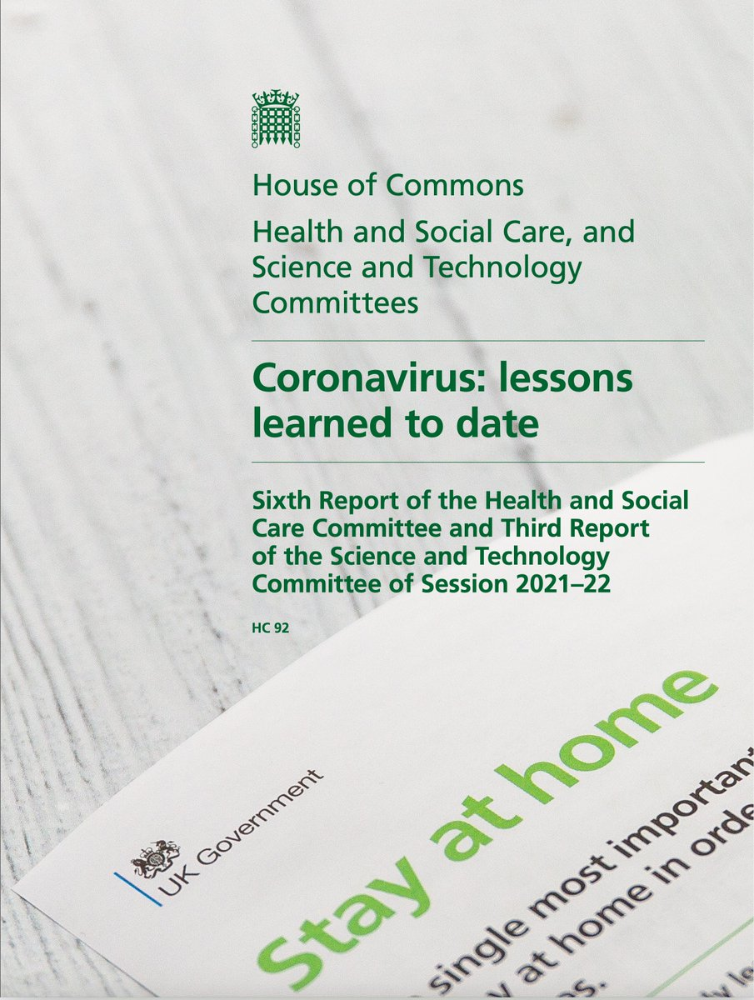</img></a>

---

<a href="https://twitter.com/erictopol/status/1448074585207971852" target="_blank" rel="noreferer">23:54 UCT</a>

But the US did worse with vaccinations, with respect to minimal uncoupling of 4th wave cases vs hospitalizations and deaths (both ~70% of 3rd wave, prior to vaccines) 

<a href="FBiXUxjWUAM7NI3.jpg"  >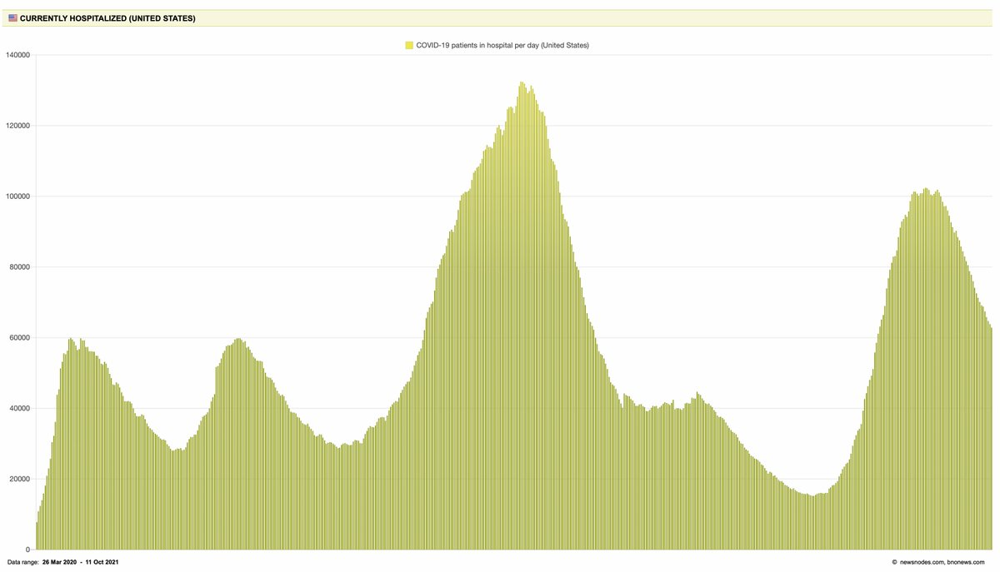</img></a><a href="FBiXXDQXsAMN2-w.jpg"  >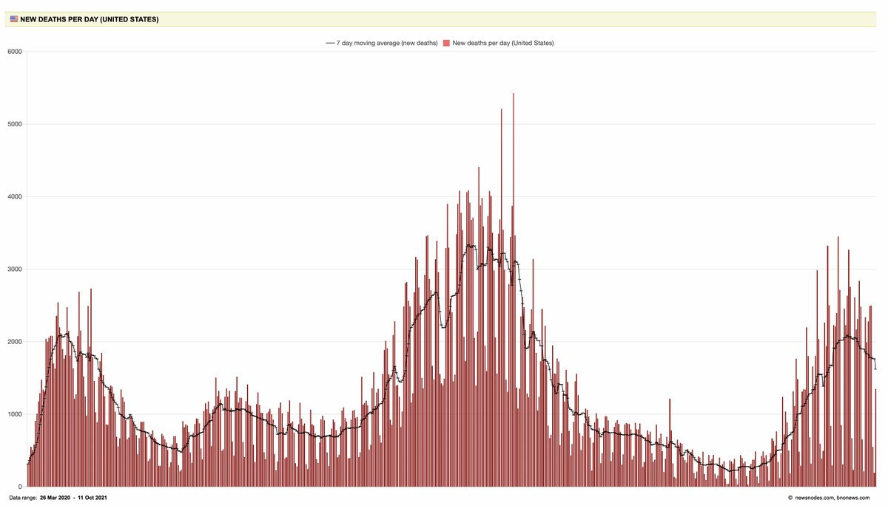</img></a>