+++
title = "Tweets by Eric Topol Oct 13"
Summary = ""
tags = ["Twitter"]
category = "Twitter"
+++

---

<a href="https://twitter.com/erictopol/status/1448128040916058118" target="_blank" rel="noreferer">03:26 UCT</a>

RT @oni_blackstock: Because we’re a country that values individualism instead of the common good.

---

<a href="https://twitter.com/erictopol/status/1448284038100230144" target="_blank" rel="noreferer">13:46 UCT</a>

We'll likely look back on the pandemic as the beginning of the mRNA intervention era, not just for infectious diseases, but cancer, autoimmune conditions, heart disease, organ repair and more https://www.ft.com/content/1f7f349f-d9e0-4b10-aa03-f411328f52ea by @nikasgari @ian_bott_artist 

<a href="FBlVOi4VUAoH5A4.jpg"  >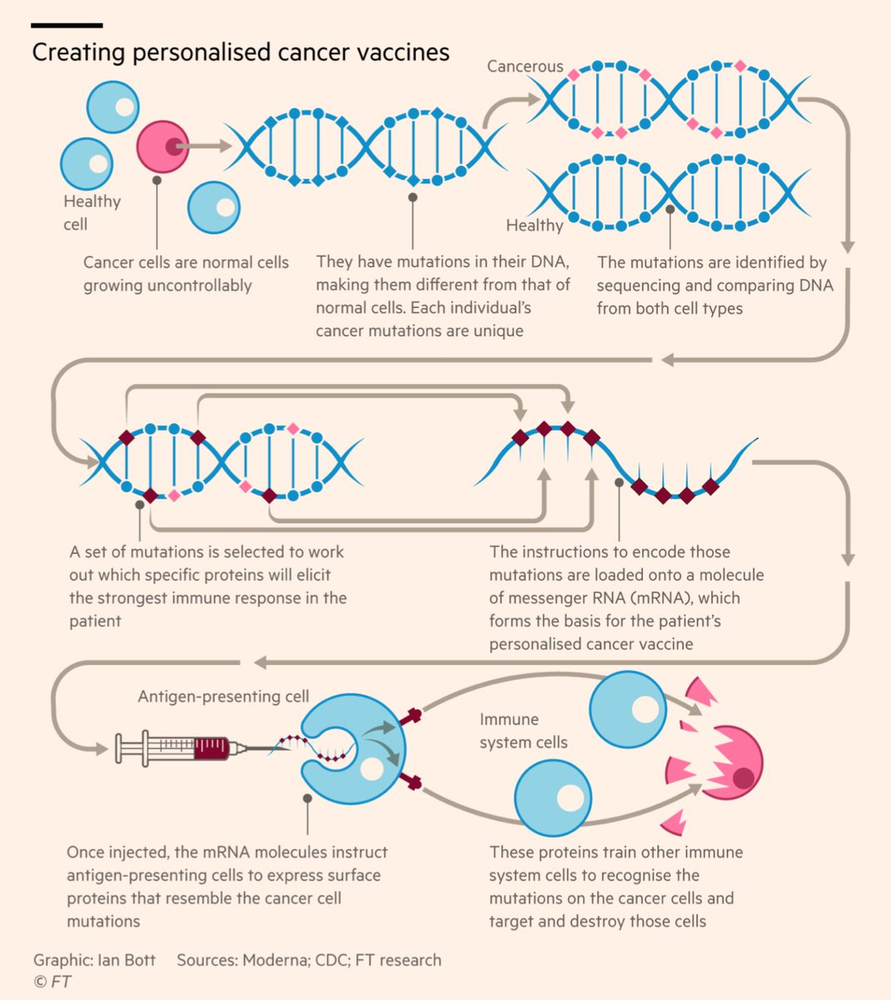</img></a>

---

<a href="https://twitter.com/erictopol/status/1448285304633192450" target="_blank" rel="noreferer">13:51 UCT</a>

After all #SARSCoV2 has done to us, somehow the idea of mutating it to death has a nice ring to it
https://www.nature.com/articles/d41586-021-02783-1 @nature
https://www.statnews.com/2021/10/13/molnupiravir-merck-covid-pill-how-it-works/ @HoganAlex @statnews

---

<a href="https://twitter.com/erictopol/status/1448293949752238093" target="_blank" rel="noreferer">14:26 UCT</a>

The J&amp;J vaccine in people with prior Covid induces an enhanced immune response https://www.cell.com/cell-host-microbe/fulltext/S1931-3128(21)00465-0 @cellhostmicrobe @UCT_news 

<a href="FBleqepUYAELQl5.jpg"  >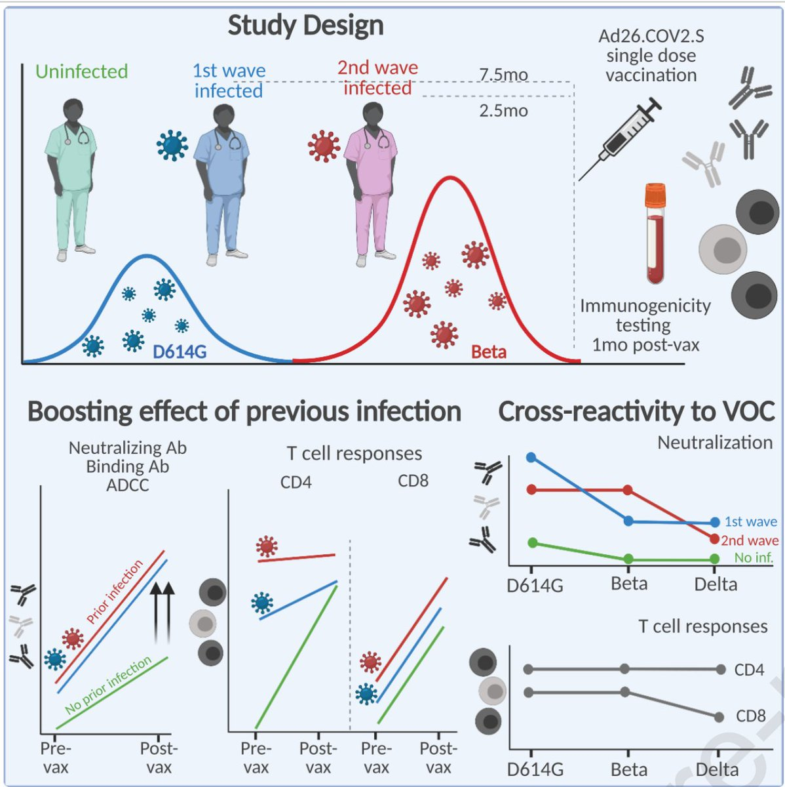</img></a>

---

<a href="https://twitter.com/erictopol/status/1448306666831683591" target="_blank" rel="noreferer">15:16 UCT</a>

@lmaocomeonman I have no conflict of interest with any vaccine manufacturer. Period.

---

<a href="https://twitter.com/erictopol/status/1448309462763139076" target="_blank" rel="noreferer">15:27 UCT</a>

Important editorial @nature on scientists being attacked and what needs to be done about it
https://www.nature.com/articles/d41586-021-02757-3
https://www.nature.com/articles/d41586-021-02741-x
in case anyone thinks it's straightforward and easy to communicate science during the pandemic 

<a href="FBltcsyVkAAvtdG.jpg"  >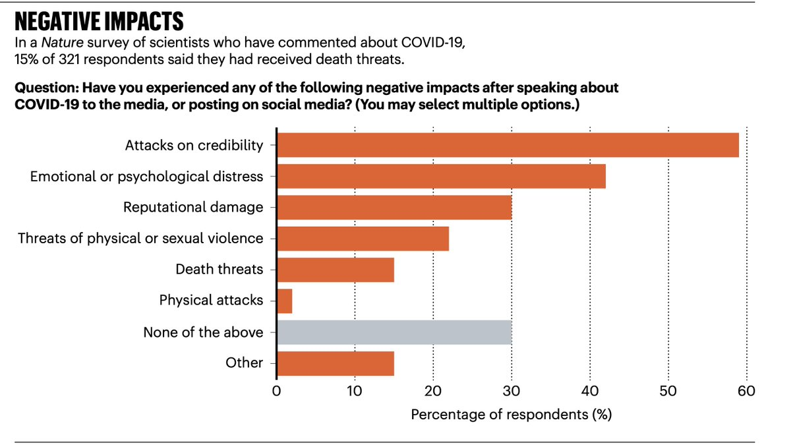</img></a><a href="FBlteM6UcAIknY2.jpg"  >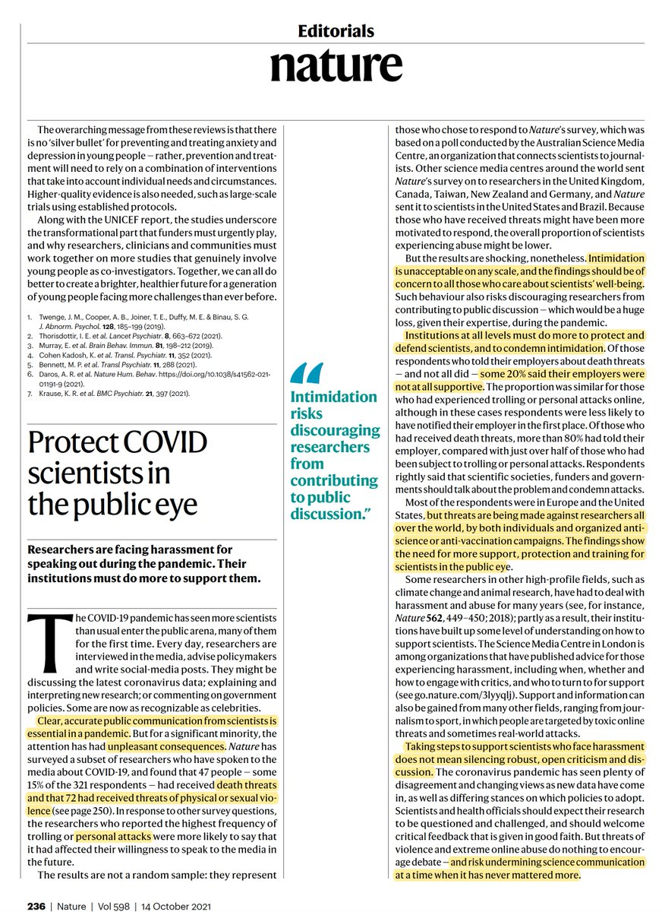</img></a>

---

<a href="https://twitter.com/erictopol/status/1448339713627070468" target="_blank" rel="noreferer">17:27 UCT</a>

Note my friend @PeterHotez pictured below, who has been a leading force taking on anti-science and paid a heavy price with such threats 

<a href="FBmGxvzVgAACM6u.jpg"  >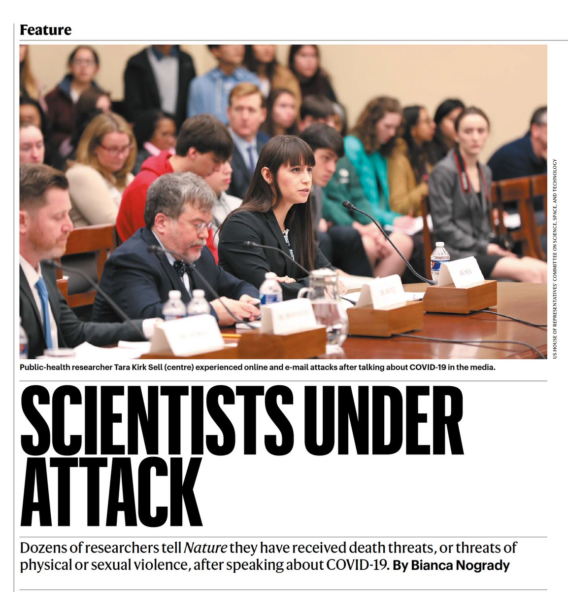</img></a>

---

<a href="https://twitter.com/erictopol/status/1448341734807654401" target="_blank" rel="noreferer">17:35 UCT</a>

A big mix and match vaccine report in 458 participants with Pfizer, Moderna, J&amp;J, then getting another vaccine 12 weeks later: markedly increased neutralizing antibody response by mixing (up to 76-fold) w/ these 9 combinations (Figure)
https://www.medrxiv.org/content/10.1101/2021.10.10.21264827v1 (not Delta strain) 

<a href="FBmKc1OVIAEPu8R.jpg"  >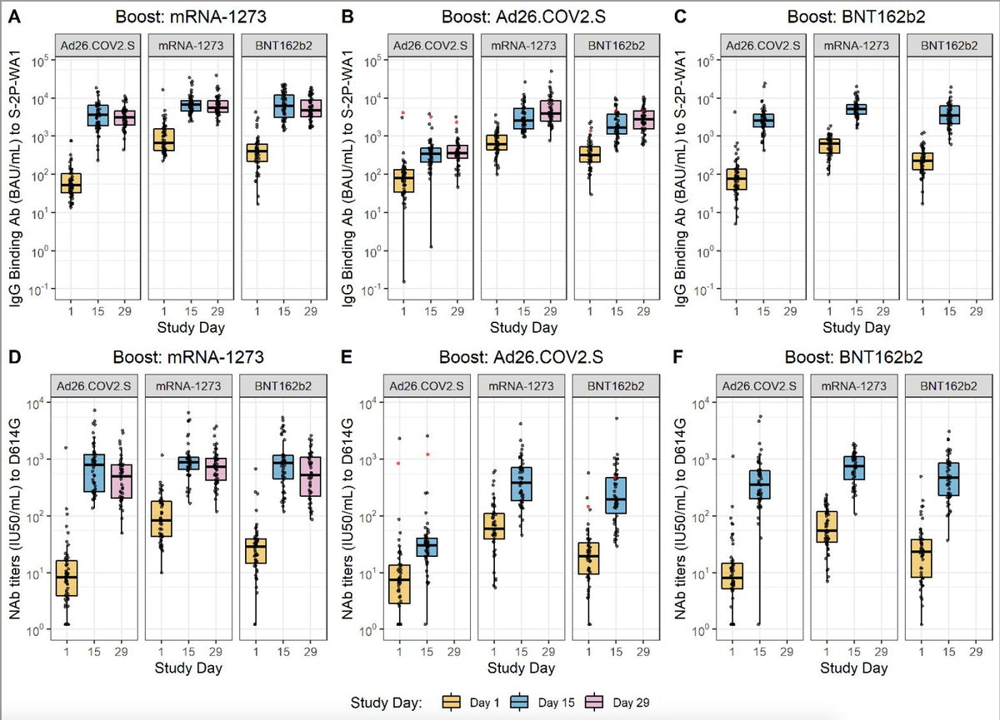</img></a>

---

<a href="https://twitter.com/erictopol/status/1448344719478517761" target="_blank" rel="noreferer">17:47 UCT</a>

A new systematic data review on #LongCovid from over 250,000 people, 2100 studies indicates a very high frequency and duration of symptoms that can be debilitating
@JAMANetworkOpen 
https://jamanetwork.com/journals/jamanetworkopen/fullarticle/2784918 

<a href="FBmNgLSVgAc0HJx.jpg"  >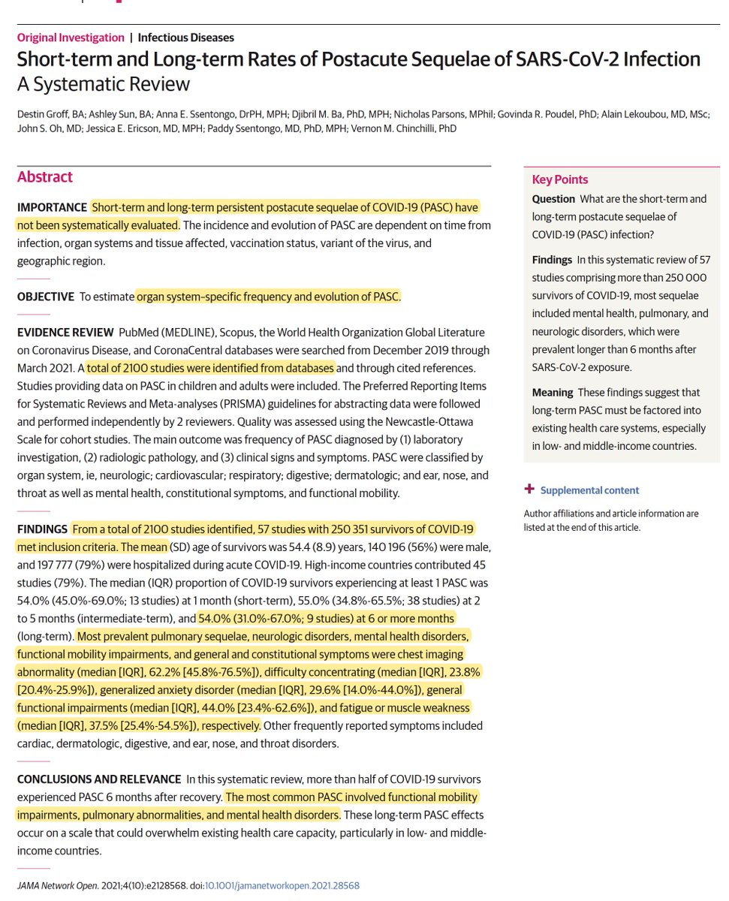</img></a><a href="FBmNi1yVQAQBJPu.jpg"  >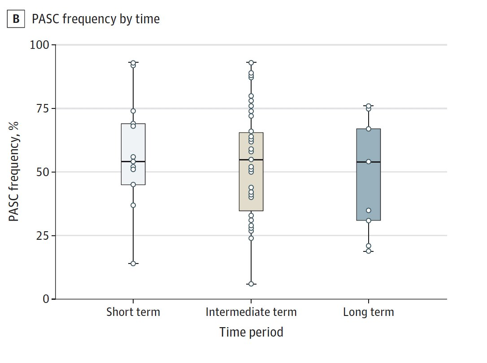</img></a><a href="FBmNkhGVUAEYAKm.jpg"  >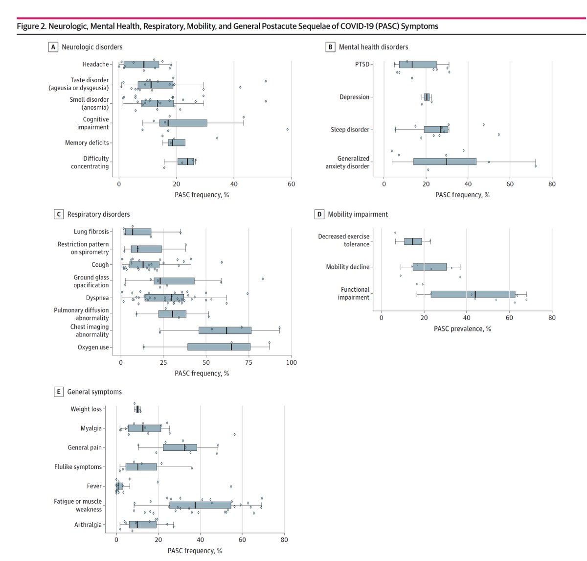</img></a><a href="FBmNlwdVIAQz3Bf.jpg"  >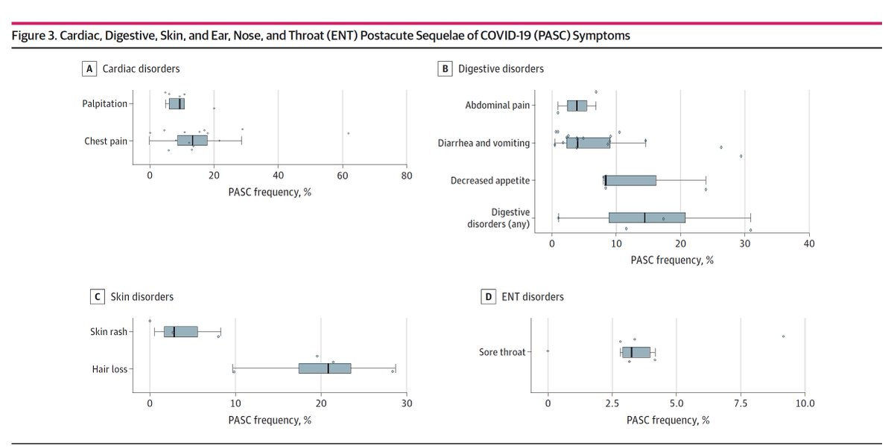</img></a>

---

<a href="https://twitter.com/erictopol/status/1448353685965131779" target="_blank" rel="noreferer">18:23 UCT</a>

The big takeaway from this dataset is the response to J&amp;J vaccine with a Moderna or Pfizer booster, taking that vaccine with low levels of neutralizing antibodies to close to parity with the mRNAs
(also worked in reverse, J&amp;J boost to mRNA, middle panel) 

<a href="FBmVmwgUUAUR8WO.jpg"  >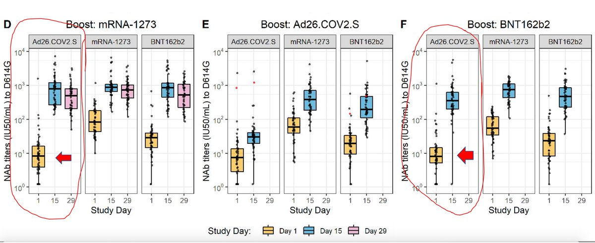</img></a>

---

<a href="https://twitter.com/erictopol/status/1448377065208614912" target="_blank" rel="noreferer">19:56 UCT</a>

@Bob_Wachter I think the people who started with J&amp;J would do well to get an mRNA shot as their 2nd (better than a 2nd J&amp;J on the basis of neutralizing antibody response)
Otherwise, it looks like the mRNAs are pretty interchangeable, so whatever is convenient for the example you gave

---

<a href="https://twitter.com/erictopol/status/1448421038711214083" target="_blank" rel="noreferer">22:51 UCT</a>

A few add’l points:
1. 100 μg dose of Moderna booster used here is not (2X) 50 μg proposed by their EUA for FDA tomorrow
2. In prior reports, Astra Zeneca 1st, then mRNA had superior levels of nAbs over mRNA 2 doses, not seen here w/ J&amp;J 
3. Assessments were w/ D614G, not Delta

---

<a href="https://twitter.com/erictopol/status/1448424830592643076" target="_blank" rel="noreferer">23:06 UCT</a>

There have been over 4 million #SARSCoV2 genomes sequenced. And there have only been 4 variants of concern (VoC), culminating with Delta. A 5th VoC that would compete with Delta is something we do not want to see: the need to contain the virus globally.

---

<a href="https://twitter.com/erictopol/status/1448429087307882496" target="_blank" rel="noreferer">23:22 UCT</a>

If you wanted to see more data on vaccine efficacy in pregnancy, just published, ~90% reduction of severe or critical COVID, h/t @neel_shah 
https://journals.lww.com/greenjournal/Fulltext/9900/Maternal_Outcomes_After_Severe_Acute_Respiratory.320.aspx 

<a href="FBnaX8tVUAAtz_n.jpg"  >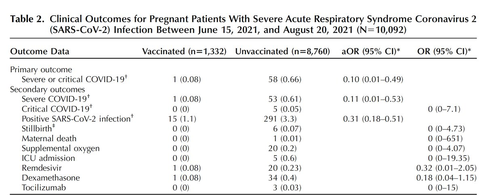</img></a>