+++
title = "Tweets by Eric Topol Oct 14"
Summary = ""
tags = ["Twitter"]
category = "Twitter"
+++

---

<a href="https://twitter.com/erictopol/status/1448483231385358337" target="_blank" rel="noreferer">02:58 UCT</a>

Minnesota hospitalizations are now &gt;80% of peak, before vaccinations, at near capacity, with highest current case growth rate in the US (35% past 2 weeks)
https://www.nytimes.com/2021/10/13/world/minnesota-hospitals-capacity-virus-surge.html
"every element of our health system is incredibly stressed”
59% population vaxx rate 

<a href="FBoJ0YkVcAEo2Hz.jpg"  >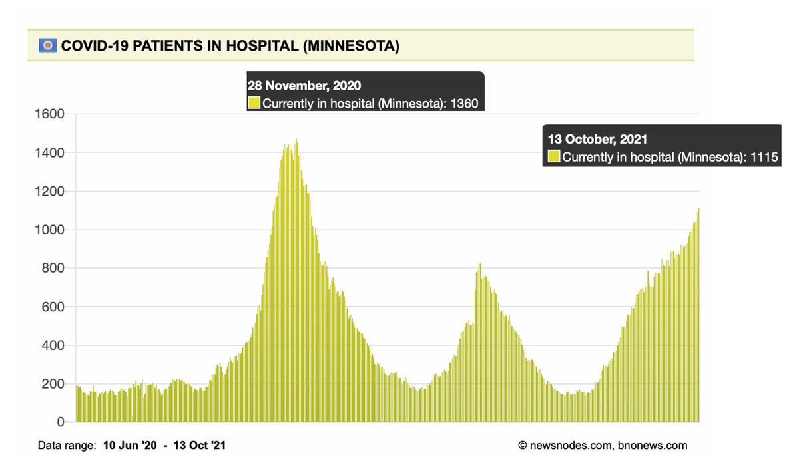</img></a><a href="FBoKfnxUcAQ3LPM.jpg"  >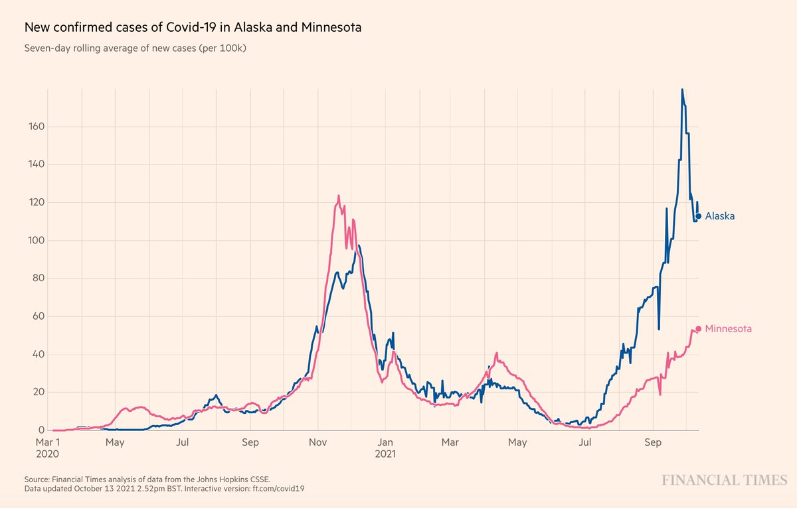</img></a>

---

<a href="https://twitter.com/erictopol/status/1448490704645214209" target="_blank" rel="noreferer">03:27 UCT</a>

Here are data for neutralization with AZ, then Pfizer, showing that was superior vs 2 AZ or 2 Pfizer doses for Alpha &amp; Beta variants
https://www.thelancet.com/journals/lanres/article/PIIS2213-2600(21)00357-X/fulltext
Preprint today: look at neutralization not binding Abs; yes Moderna -&gt; more boost than Pfizer to J&amp;J, but w/ 100 μg dose 

<a href="FBoRWuoVgAUaXZ2.jpg"  >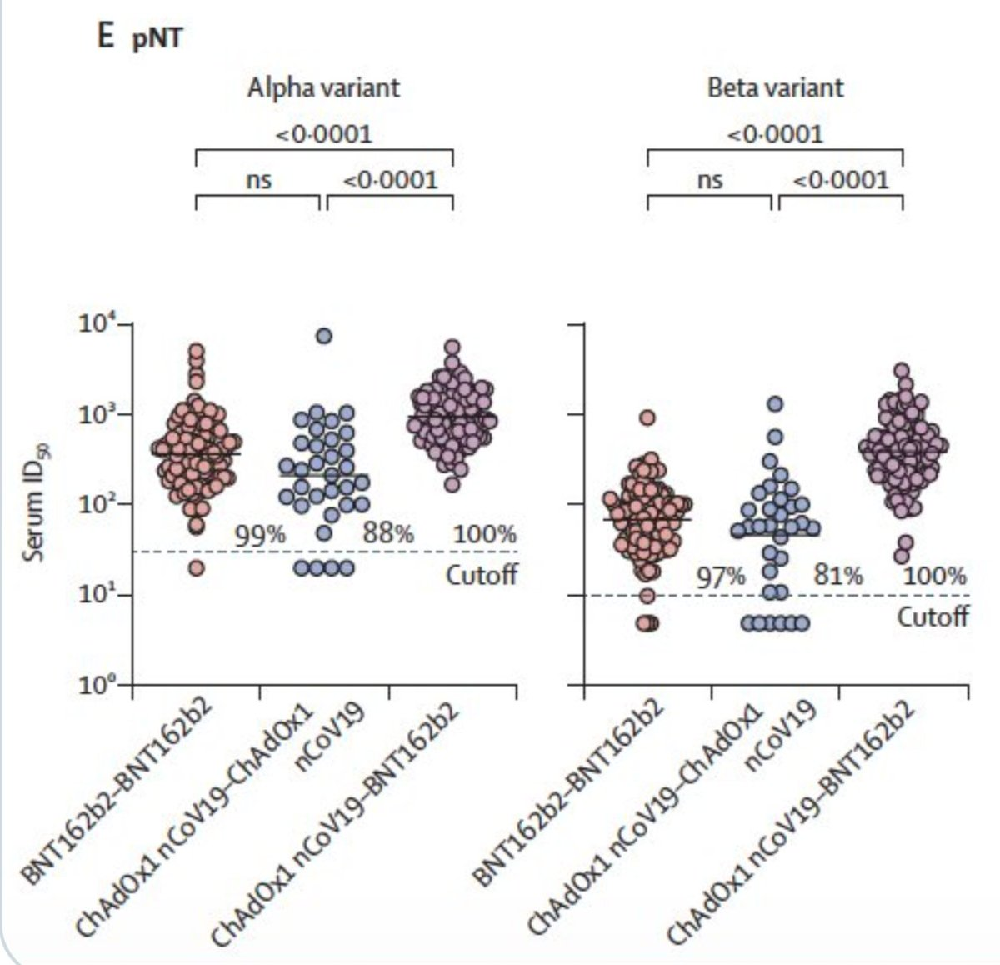</img></a>

---

<a href="https://twitter.com/erictopol/status/1448497484959944710" target="_blank" rel="noreferer">03:54 UCT</a>

@StevenSternberg Much appreciated, Steve 🙏

---

<a href="https://twitter.com/erictopol/status/1448535098274373633" target="_blank" rel="noreferer">06:24 UCT</a>

The new mix and match study makes the headline for tomorrow
https://www.nytimes.com/2021/10/13/health/johnson-vaccine-booster-fda.html by @carlzimmer @noahweiland 

<a href="FBo6OpvUYAEZ9-f.jpg"  >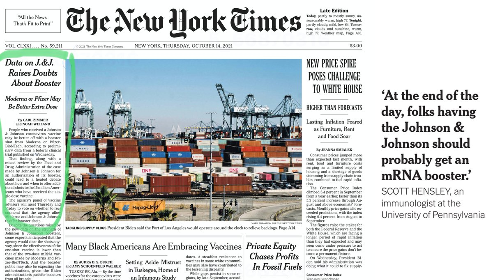</img></a>

---

<a href="https://twitter.com/erictopol/status/1448657643665387533" target="_blank" rel="noreferer">14:31 UCT</a>

Will the Moderna and J&amp;J boosters get approved (EUA) today and tomorrow?
Likely yes, but their datasets are woefully deficient
https://www.ft.com/content/94c3ee7e-98a1-49c5-9fc7-4daedac311d7 @jamiesmythF @FT 
https://www.wsj.com/articles/johnson-johnson-covid-19-booster-shot-bolsters-immune-defense-fda-staff-say-11634137515?mod=searchresults_pos1&page=1 @Loftus @felschwartz 

<a href="FBqqMryVEAIGXPn.jpg"  >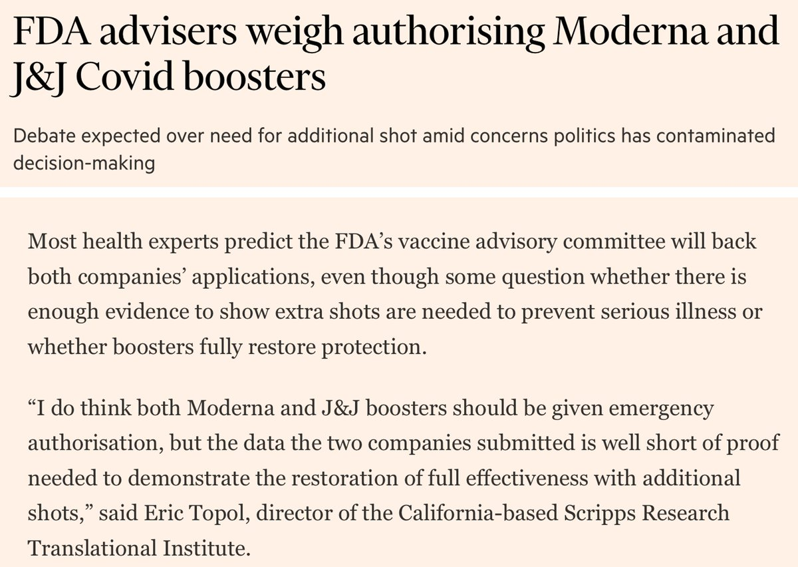</img></a><a href="FBqqPYzVQAkJc0_.jpg"  >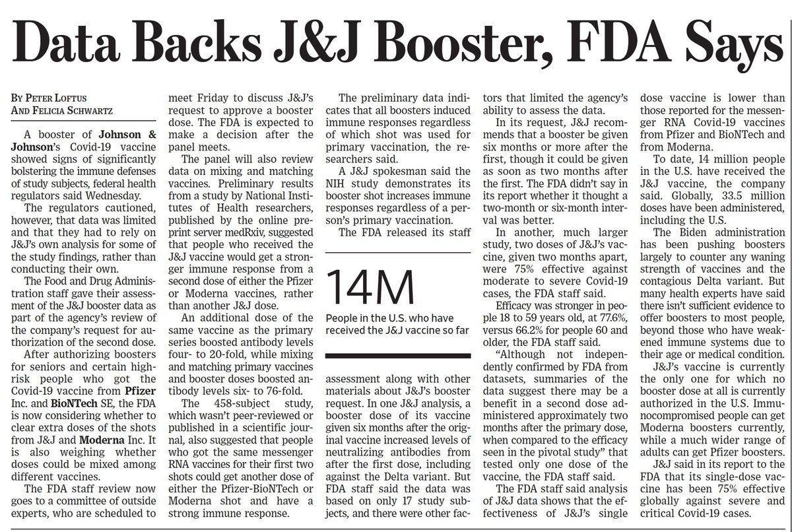</img></a>

---

<a href="https://twitter.com/erictopol/status/1448662794887327752" target="_blank" rel="noreferer">14:51 UCT</a>

Just published @NatureMedicine
The decline of vaccine effectiveness vs infections and lower Ct (higher viral loads); impact of the Delta variant compared with Alpha 
 https://www.nature.com/articles/s41591-021-01548-7 

<a href="FBquqZrVkAAaHIl.jpg"  >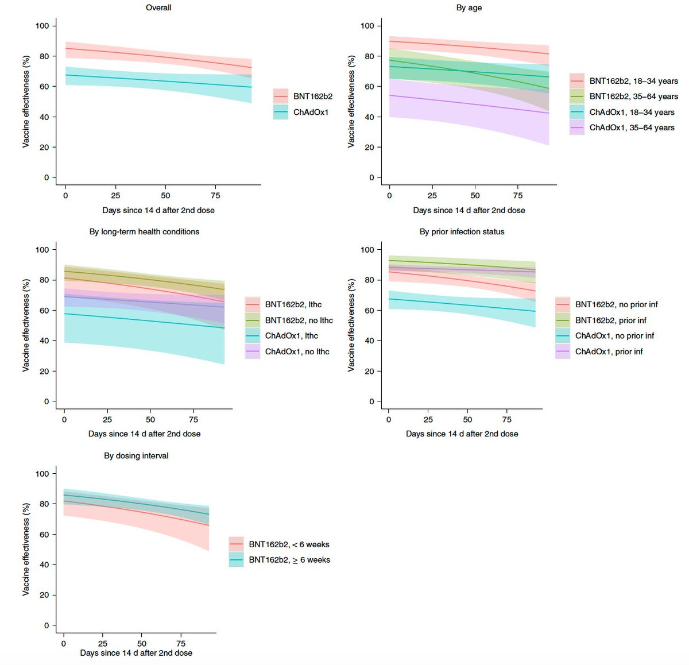</img></a>

---

<a href="https://twitter.com/erictopol/status/1448671814180167685" target="_blank" rel="noreferer">15:27 UCT</a>

Towards covid endemicity: as more vaccinations and infections proceed, the less hospitalizations and deaths 
https://www.economist.com/briefing/2021/10/14/how-the-world-learns-to-live-with-covid-19 @TheEconomist 

<a href="FBq27xiVkAEp_hM.jpg"  >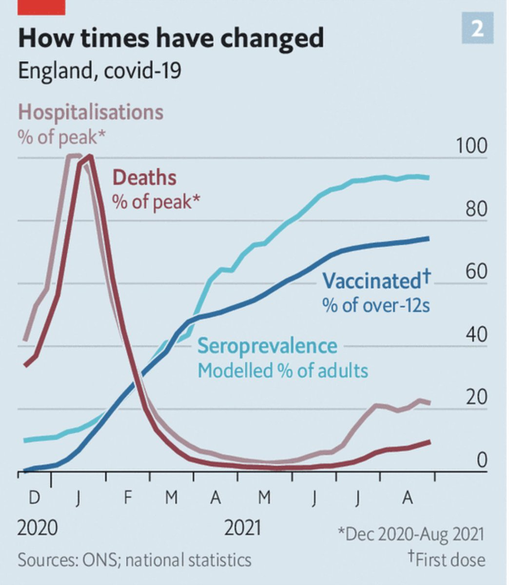</img></a>

---

<a href="https://twitter.com/erictopol/status/1448682991467708416" target="_blank" rel="noreferer">16:11 UCT</a>

RT @DrLeanaWen: Dramatic results from Israel, as presented at FDA advisory committee meeting: Boosters reduce severe disease in all age gro…

---

<a href="https://twitter.com/erictopol/status/1448684859661053953" target="_blank" rel="noreferer">16:19 UCT</a>

How #AI and rapid whole genome sequencing is transforming the diagnosis of sick newborns https://genomemedicine.biomedcentral.com/articles/10.1186/s13073-021-00965-0 @RadyGenomics @radychildrens @ribozyme @FabricGenomics 

<a href="FBrC7EXVkA48LYA.png"  >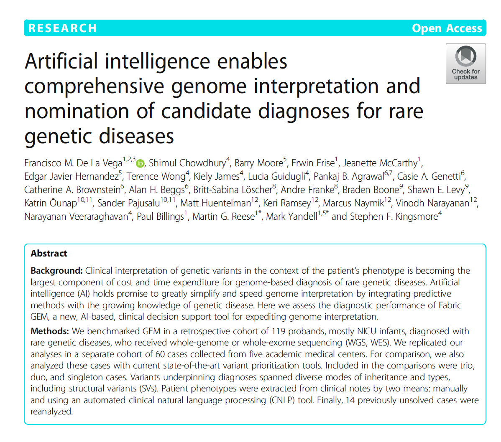</img></a>

---

<a href="https://twitter.com/erictopol/status/1448686866555817988" target="_blank" rel="noreferer">16:27 UCT</a>

The benefit of the Pfizer boosters across all age groups (vs infections in 16+, vs severe disease 40+), presented @US_FDA today as background for consideration of other vaccine boosters
https://www.fda.gov/media/153086/download 

<a href="FBrEewwVIA4A4yW.jpg"  >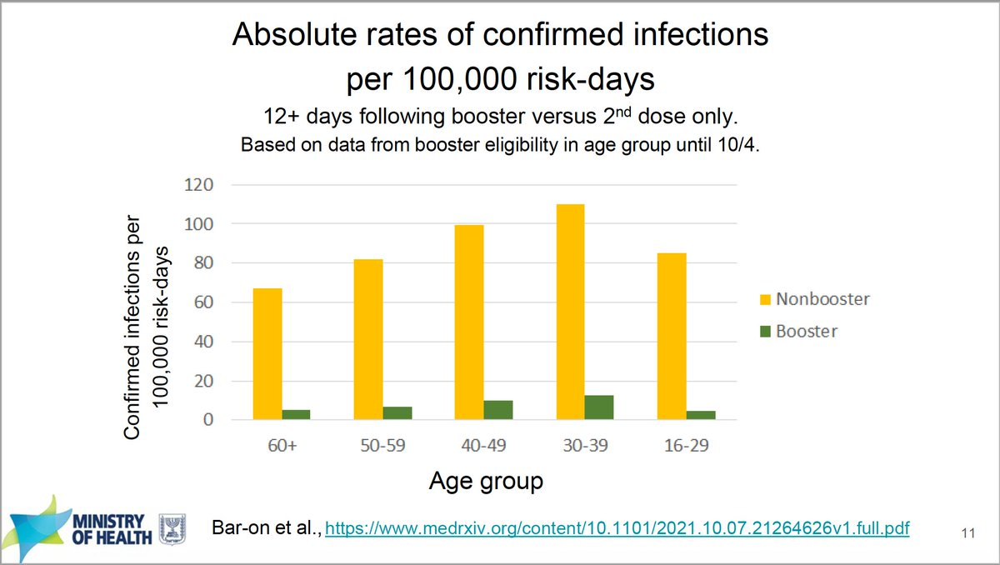</img></a><a href="FBrFBUKVIAMDTZ2.jpg"  >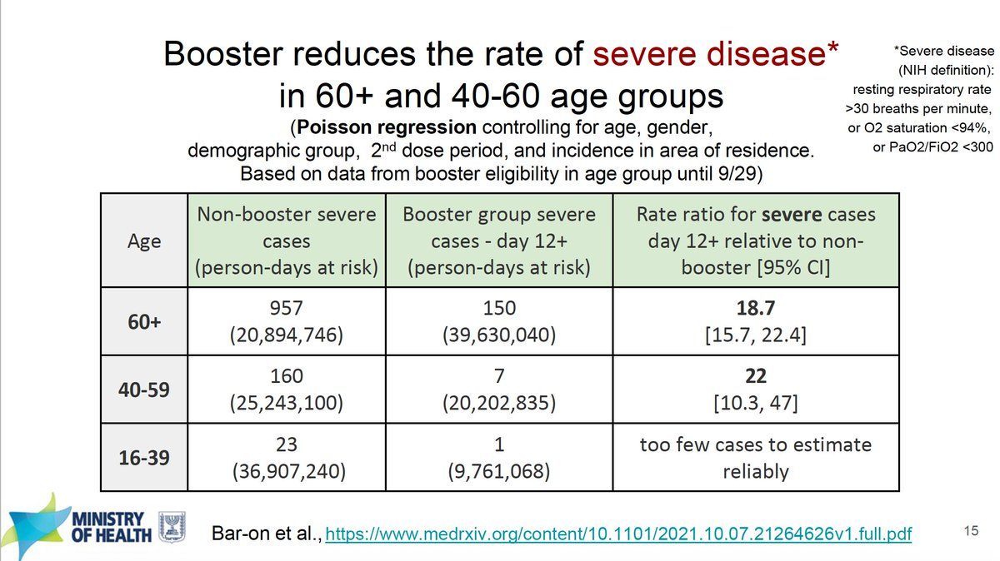</img></a>

---

<a href="https://twitter.com/erictopol/status/1448689204435689482" target="_blank" rel="noreferer">16:36 UCT</a>

The @WhiteHouse, @POTUS bringing back my friend @califf001 to run the @US_FDA 
https://www.washingtonpost.com/health/2021/10/14/fda-commissioner-califf/

---

<a href="https://twitter.com/erictopol/status/1448701355187576840" target="_blank" rel="noreferer">17:24 UCT</a>

I find this hard to believe
"Sputnik Light demonstrates higher efficacy against Delta variant than many two-shot vaccines."
 https://www.medrxiv.org/content/10.1101/2021.10.08.21264715v1

---

<a href="https://twitter.com/erictopol/status/1448704842227060743" target="_blank" rel="noreferer">17:38 UCT</a>

A new approach for giving intravenous infusions of monoclonal antibodies for Covid: home delivery https://jamanetwork.com/journals/jamanetworkopen/fullarticle/2784998

---

<a href="https://twitter.com/erictopol/status/1448719949459968025" target="_blank" rel="noreferer">18:38 UCT</a>

During the Delta wave in India, a 27% rate of reinfection in a cohort
https://www.science.org/doi/10.1126/science.abj9932 
@ScienceMagazine "as judged by increased antibody concentration after a previous decline"
Finding again reflects prior Covid incomplete protection vs Delta, as many studies reinforce

---

<a href="https://twitter.com/erictopol/status/1448723471198933011" target="_blank" rel="noreferer">18:52 UCT</a>

Just out @ScienceMagazine 
The memory B and T cell response to mRNA vaccines is quite durable and functional for at least 6 months, and for all the major variants, including Delta. 
https://www.science.org/doi/10.1126/science.abm0829
(A very reassuring finding in light of short dose spacing of 3-4 weeks) 

<a href="FBrlw0zVkAETpy3.png"  >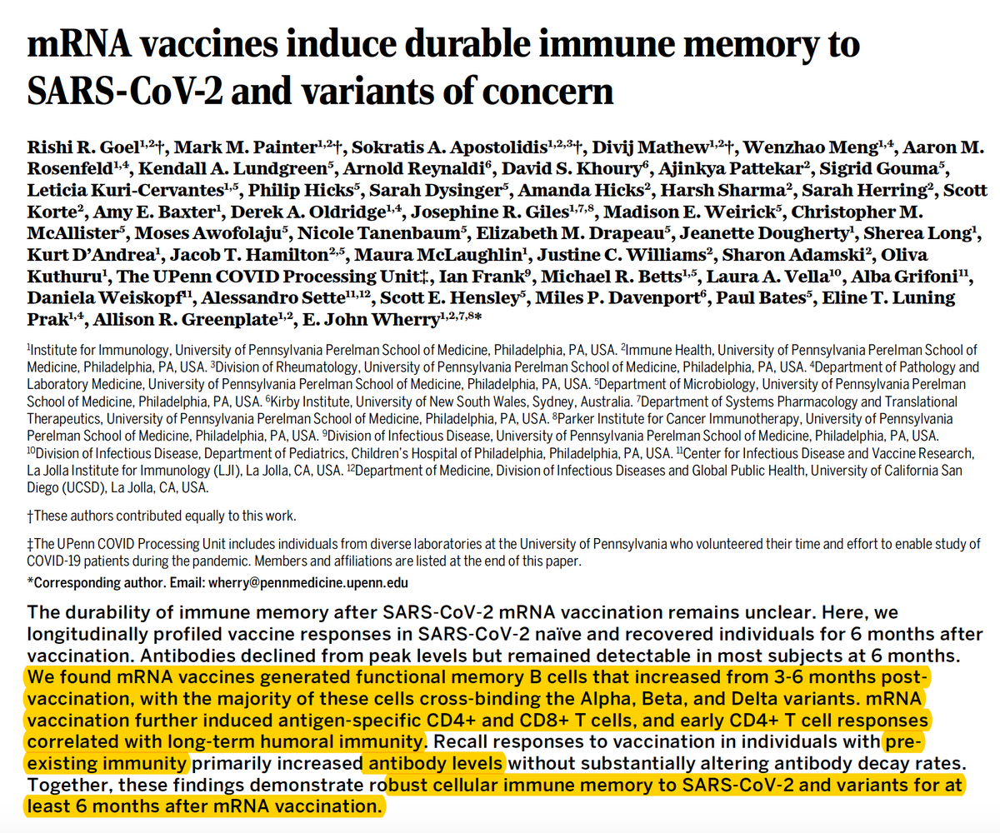</img></a><a href="FBrmEqhVUAstf6A.jpg"  >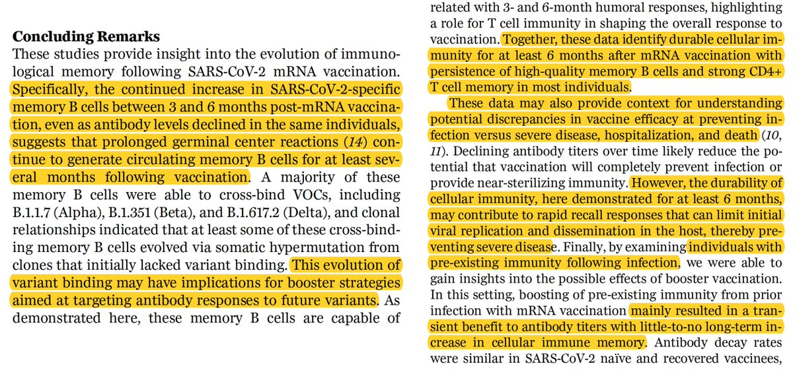</img></a>

---

<a href="https://twitter.com/erictopol/status/1448751528915857432" target="_blank" rel="noreferer">20:44 UCT</a>

So you want to do genome editing more efficiently and at scale, for 1000s of bases? Cure tyrosinemia in mice?
A very big 3-fer day for @davidrliu's prime editing 
https://www.cell.com/cell/fulltext/S0092-8674(21)01065-5
https://www.nature.com/articles/s41587-021-01025-z @JShendure 
https://www.nature.com/articles/s41587-021-01026-y @xue_lab
https://www.statnews.com/2021/10/14/new-crispr-tools-could-fix-diseases-caused-by-large-dna-rearrangements-scientists-report/ 

<a href="FBr-Mo1VcAIy6aU.jpg"  >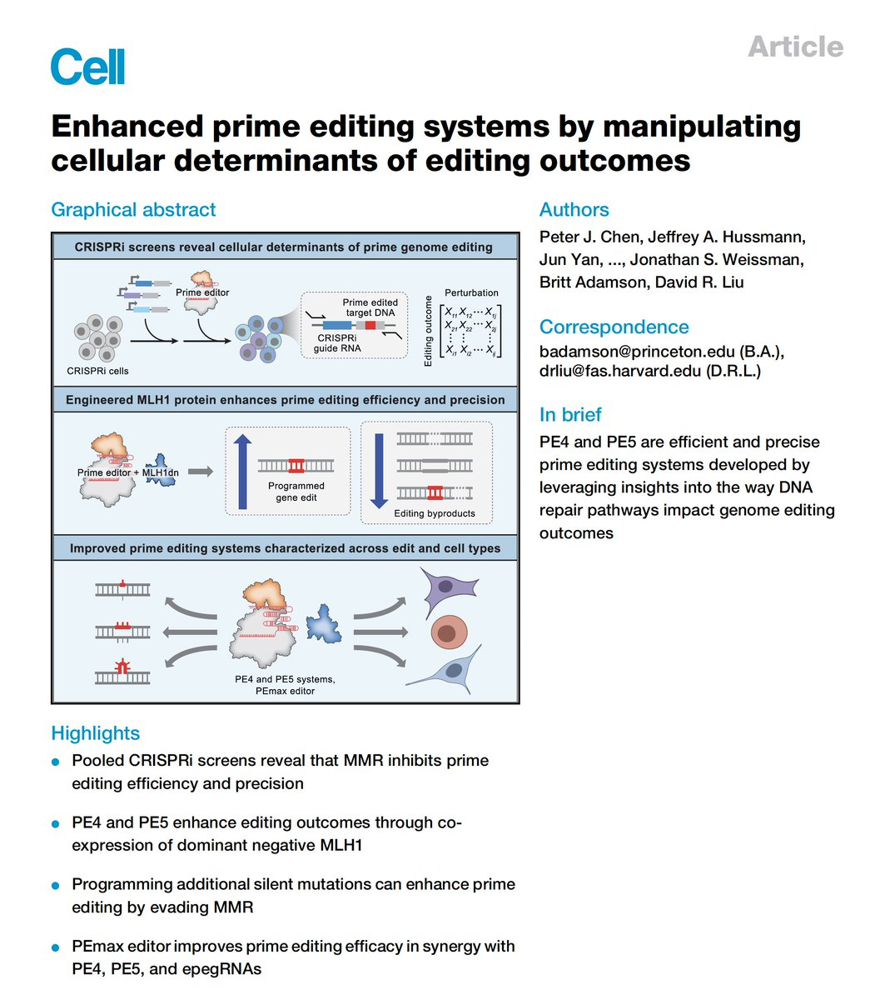</img></a><a href="FBr-cU9VcBUxmo6.jpg"  >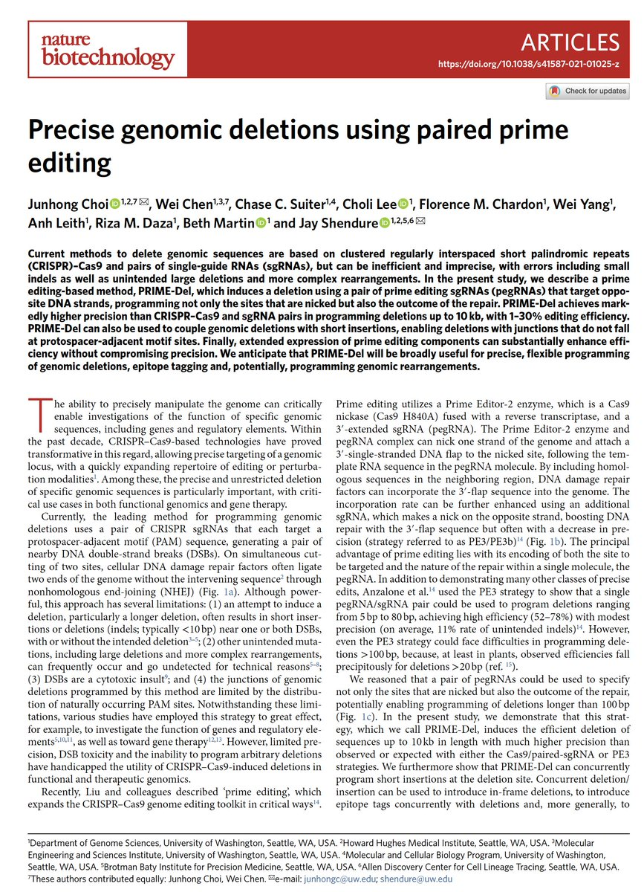</img></a><a href="FBr-kJRVcA4-PmQ.jpg"  >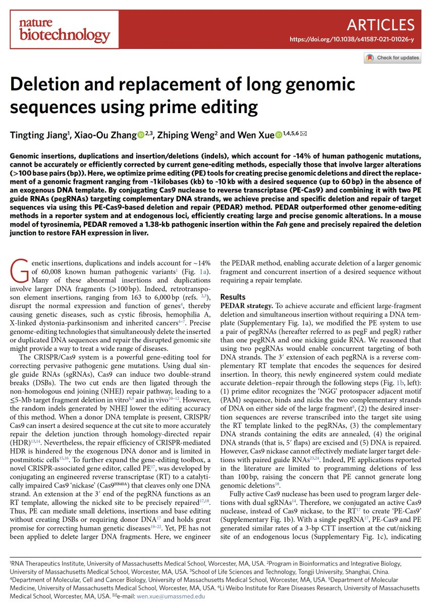</img></a><a href="FBr-p49VcB4m90y.jpg"  >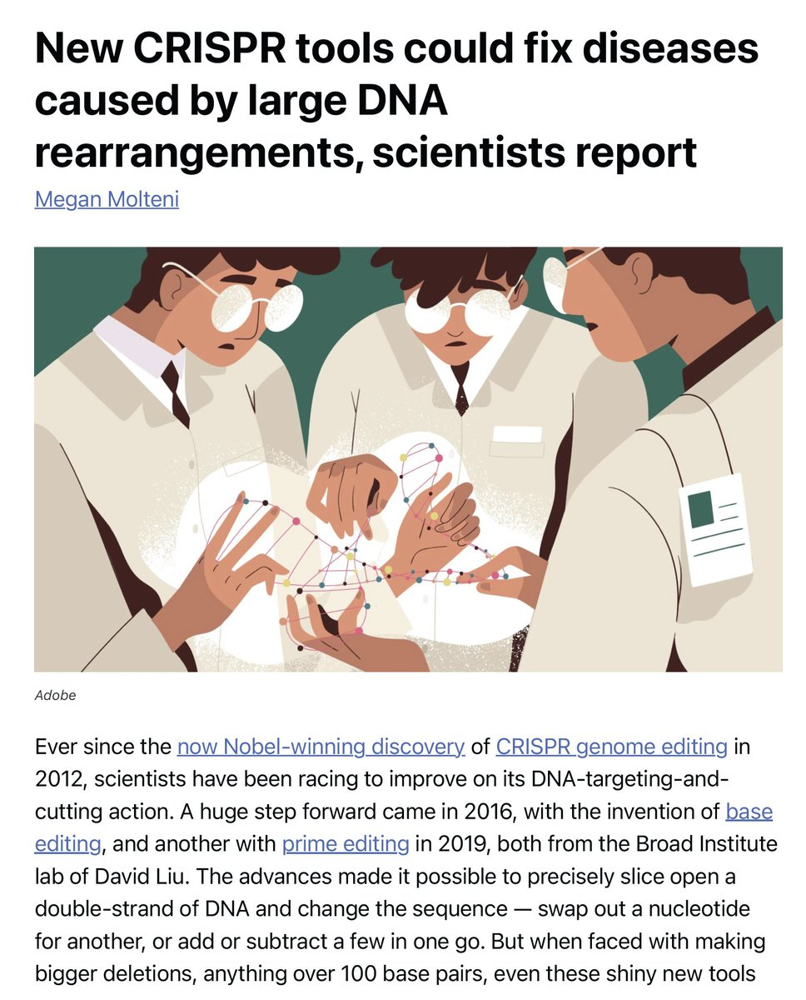</img></a>

---

<a href="https://twitter.com/erictopol/status/1448765258659602438" target="_blank" rel="noreferer">21:38 UCT</a>

In July, many maintained there was no attrition of vaccine effectiveness (VE) vs symptomatic infections or severe disease. Denial of Israeli data.
That continued for months.
In October, all vaccines are getting approvals for boosters to prevent VE attrition in people at high risk

---

<a href="https://twitter.com/erictopol/status/1448767746284535817" target="_blank" rel="noreferer">21:48 UCT</a>

Beyond the mRNAs (Pfizer and Moderna), Astra Zeneca, and J&amp;J, the Chinese vaccines, Sinopharm and Coronavac, are also following suit
https://www.nature.com/articles/d41586-021-02796-w @Nature

---

<a href="https://twitter.com/erictopol/status/1448769555946344448" target="_blank" rel="noreferer">21:55 UCT</a>

Calling out this concern of VE decline, intended to amp up protection in vaccinees, was met with major backlash
https://twitter.com/erictopol/status/1425492860619481098?lang=en
https://twitter.com/erictopol/status/1439295338792189952?lang=en

---

<a href="https://twitter.com/erictopol/status/1448773692729618454" target="_blank" rel="noreferer">22:12 UCT</a>

A new study from the Netherlands on Delta transmission to household contacts, w/ or w/o vaccination, adds to the one below. Delta spread is harder to suppress.
https://www.medrxiv.org/content/10.1101/2021.10.14.21264959v1  Same group reported 73% VE vs transmission to unvaccinated household contacts for Alpha  https://twitter.com/EricTopol/status/1445429636502933508

<a href="FBsSc79UUAAOybV.png"  >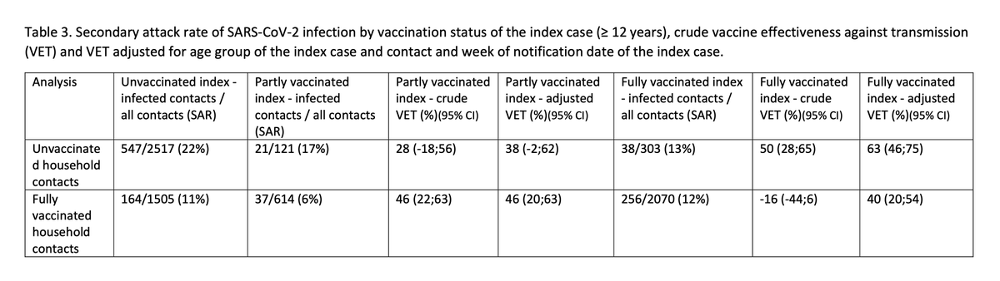</img></a>

---

<a href="https://twitter.com/erictopol/status/1448780330345791488" target="_blank" rel="noreferer">22:38 UCT</a>

Putting the malaria vaccine in perspective
https://www.thelancet.com/journals/lancet/article/PIIS0140-6736(21)02235-2/fulltext @TheLancet 
today's cover 

<a href="FBsZ6MJUcAAiKnF.jpg"  >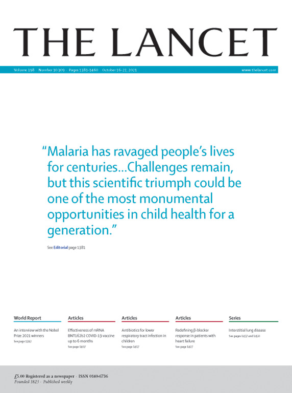</img></a><a href="FBsZ83DVIAEMkQa.jpg"  >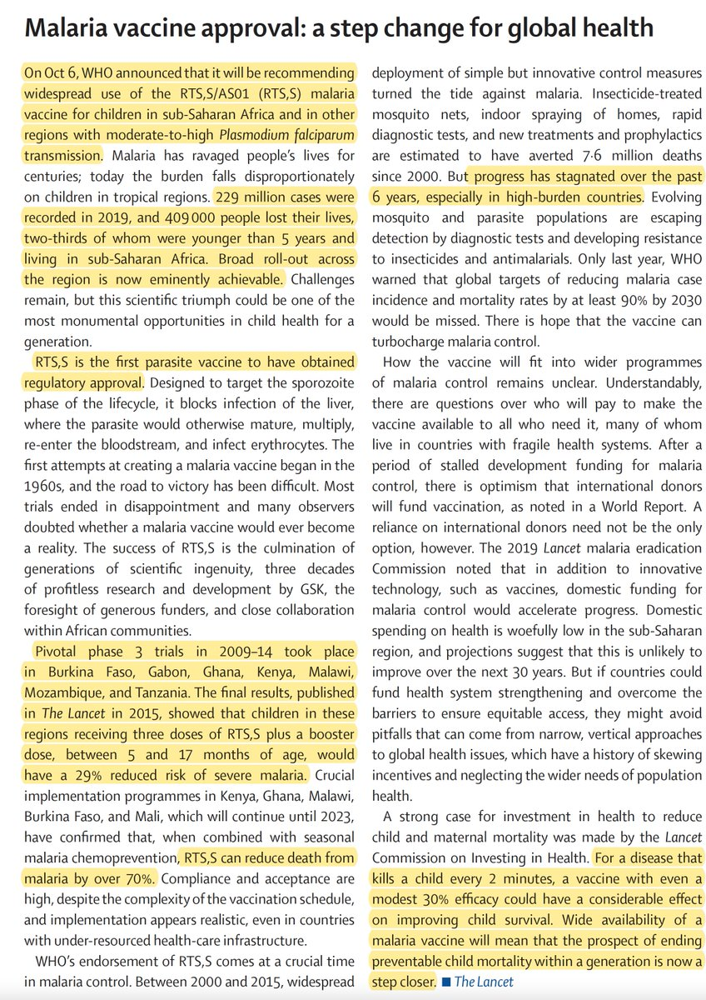</img></a>

---

<a href="https://twitter.com/erictopol/status/1448790416900255756" target="_blank" rel="noreferer">23:18 UCT</a>

Assessing the potential beneficial impact of statins on Covid mortality in Sweden https://journals.plos.org/plosmedicine/article?id=10.1371/journal.pmed.1003820 @PLOSMedicine 
" a modest negative association" with hazard ratio of 0.88 [95% CI 0.79, 0.97] 

<a href="FBsiclWUcAEAQ0u.jpg"  >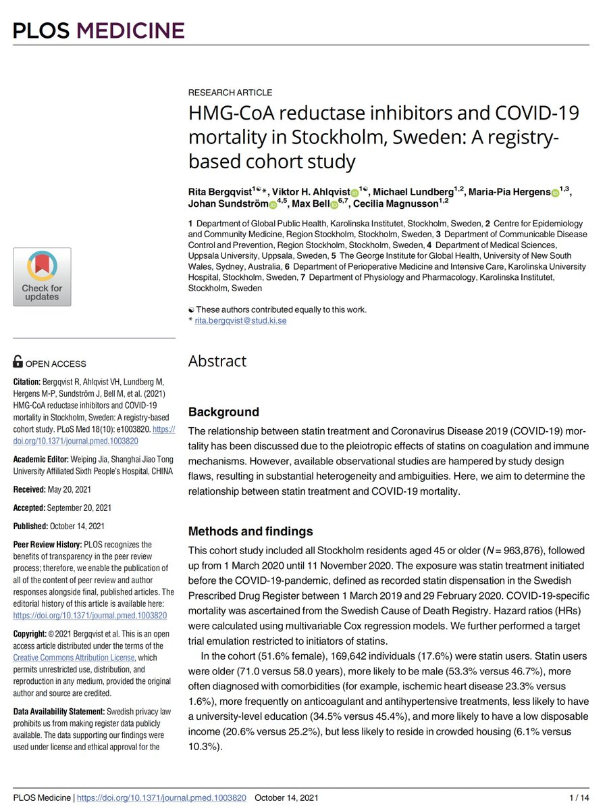</img></a><a href="FBsid5JUcAEXFzy.jpg"  >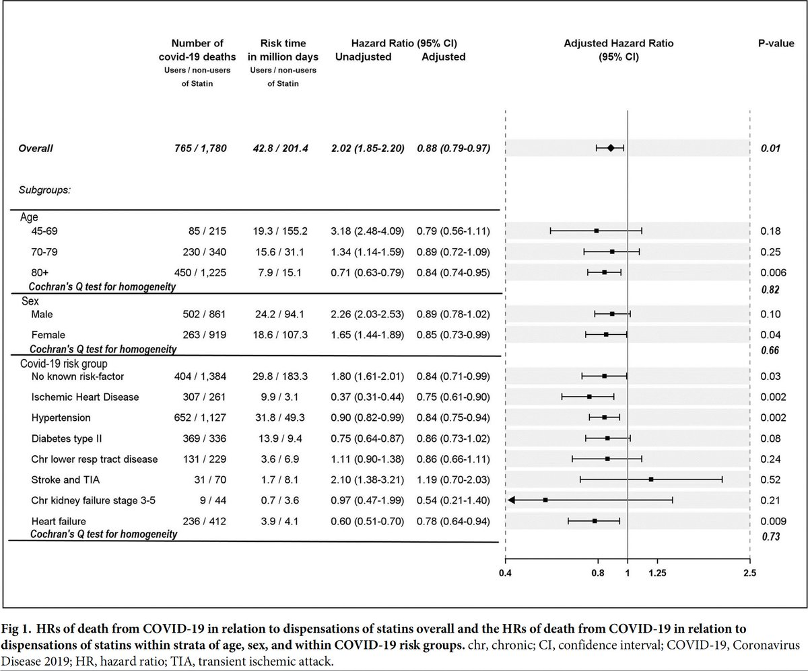</img></a>