+++
title = "Tweets by Eric Topol Oct 15"
Summary = ""
tags = ["Twitter"]
category = "Twitter"
+++

---

<a href="https://twitter.com/erictopol/status/1448815262522773520" target="_blank" rel="noreferer">00:57 UCT</a>

New on breakthrough infections in 620,000 Veterans
"Vaccine protection declined by mid-August 2021, decreasing from 91.9% in March to 53.9%"
http://medrxiv.org/cgi/content/short/2021.10.13.21264966 highest reduction with J&amp;J vaccine 

<a href="FBs5hzPVEAIfT_Z.jpg"  >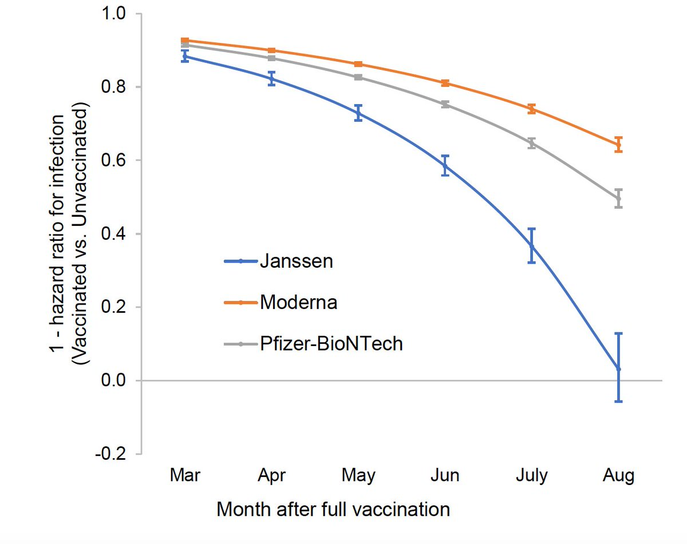</img></a>

---

<a href="https://twitter.com/erictopol/status/1448817199645298705" target="_blank" rel="noreferer">01:05 UCT</a>

Coverage and my commentary @washingtonpost on the @US_FDA Commissioner nomination 
https://www.washingtonpost.com/health/2021/10/14/fda-commissioner-califf/
by @tylerpager @ddiamond @yabutaleb7 

<a href="FBs7Y2rVkBQJomn.jpg"  >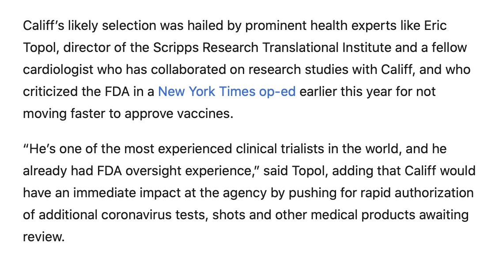</img></a>

---

<a href="https://twitter.com/erictopol/status/1448822230087995432" target="_blank" rel="noreferer">01:25 UCT</a>

@davidjlynch Yes. Based on these and other reports, much broader booster recommendations for those who had a J&amp;J vaccine. And with an mRNA 2nd shot, ideally 

<a href="FBs__2kVkAEAtlB.jpg"  >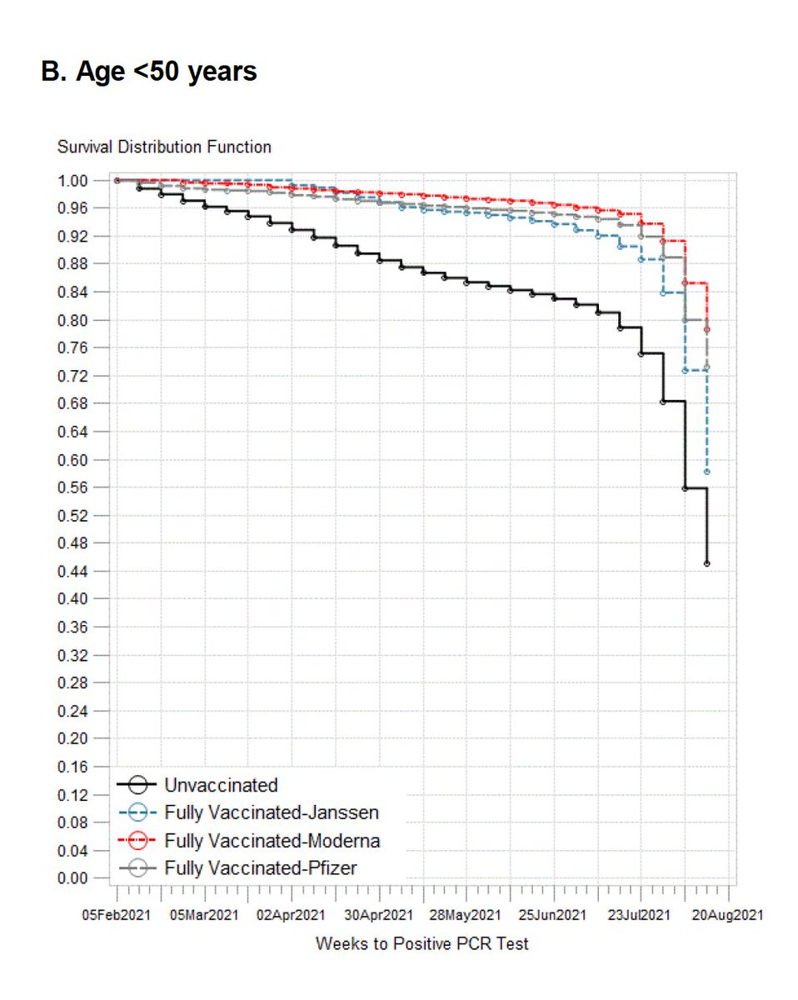</img></a>

---

<a href="https://twitter.com/erictopol/status/1448823486005145604" target="_blank" rel="noreferer">01:30 UCT</a>

@davidjlynch The cutoff should have been 60. That's where there is strong evidence and the FDA, CDC advisory committees  ignored that

---

<a href="https://twitter.com/erictopol/status/1448826680043212802" target="_blank" rel="noreferer">01:42 UCT</a>

For the 1st time, the @CDCgov is now posting national data on vaccination status for hospitalization and death, and by age 👍🙏
https://covid.cdc.gov/covid-data-tracker/#rates-by-vaccine-status
Here are data for death during the Delta wave
Unvaccinated &gt; 11-fold risk of dying
h/t @cyrusshahpar46 TY @HHSGov @WHCOS 

<a href="FBtDF64VgAIgq_3.jpg"  >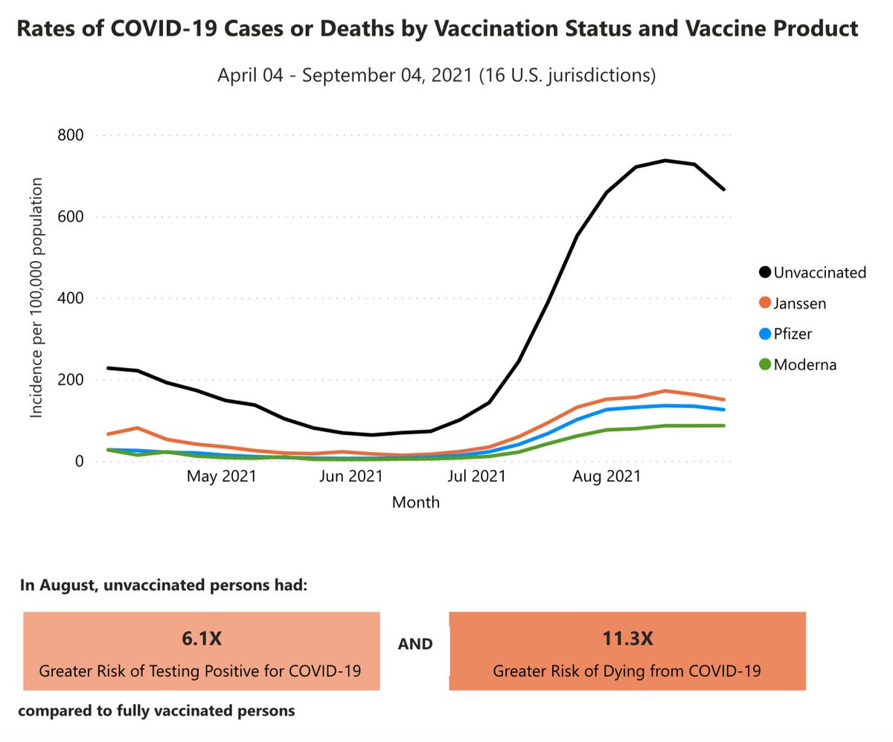</img></a>

---

<a href="https://twitter.com/erictopol/status/1448829511659753477" target="_blank" rel="noreferer">01:54 UCT</a>

Deaths only graph, by vaccine, and by age group, over time 

<a href="FBtGrUgVcAUEITb.jpg"  >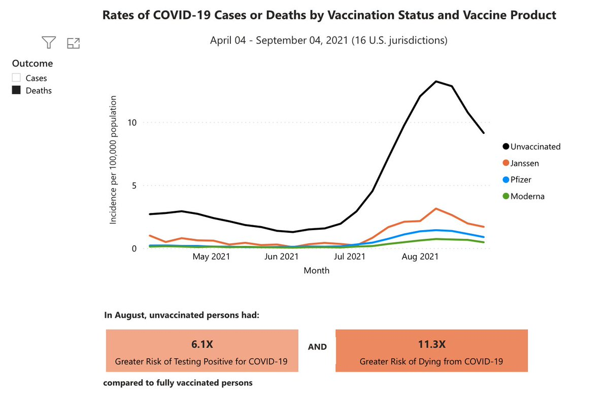</img></a><a href="FBtGnWCUcAU4JiL.jpg"  >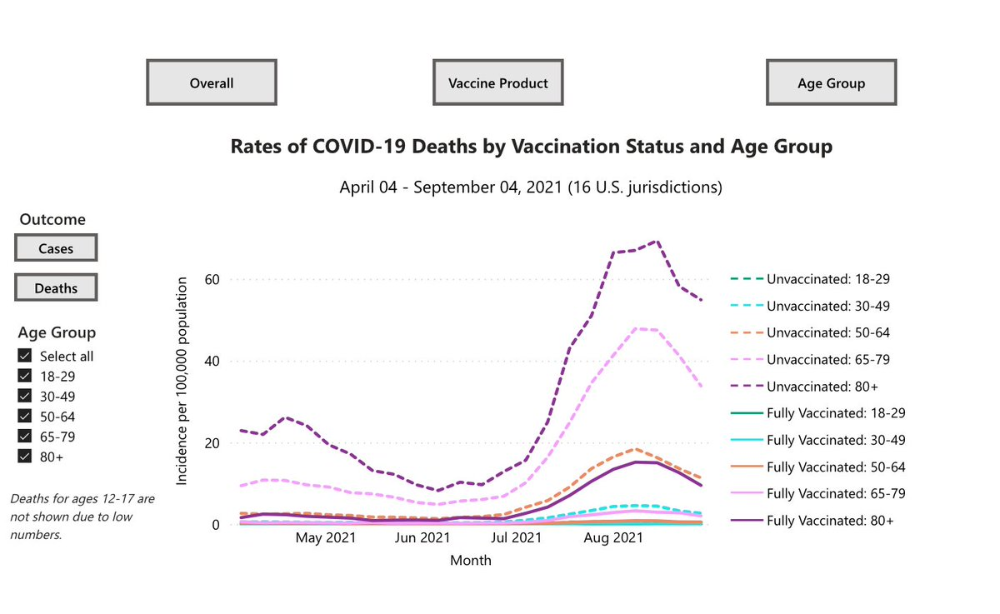</img></a>

---

<a href="https://twitter.com/erictopol/status/1448997468117426182" target="_blank" rel="noreferer">13:01 UCT</a>

Just published @NEJM
Neutralizing antibody levels and T cells response out to 8 months for Pfizer, Moderna and J&amp;J vaccines 
http://www.nejm.org/doi/full/10.1056/NEJMc2115596
Moderna highest antibody response; J&amp;J while lower doesn't fall off and best CD8 T-cell response at 8 months 

<a href="FBvdcpDVIAA2sX9.jpg"  >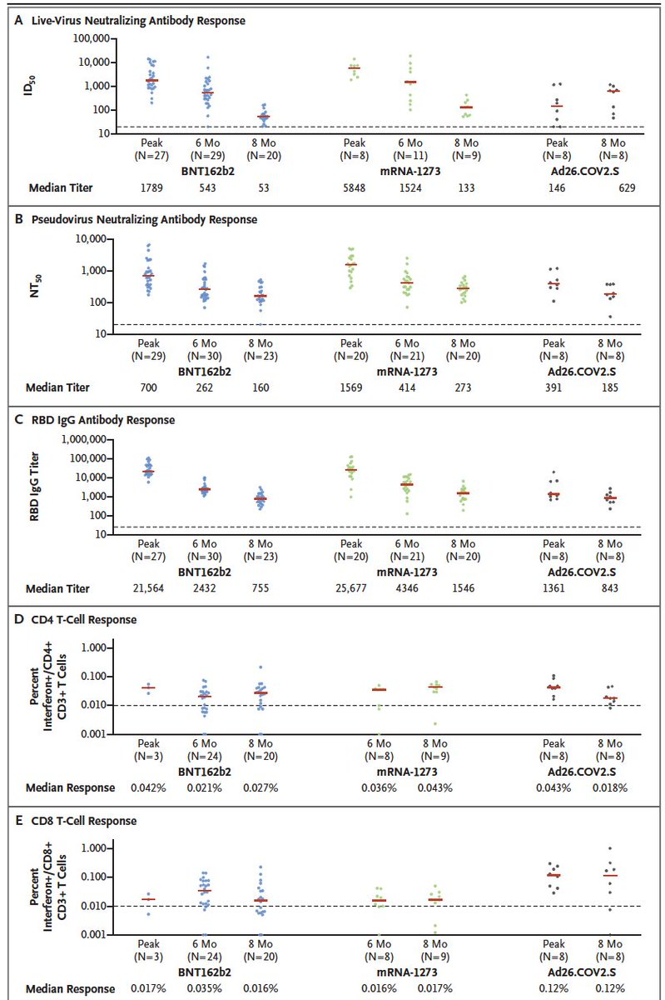</img></a>

---

<a href="https://twitter.com/erictopol/status/1449011413997875201" target="_blank" rel="noreferer">13:56 UCT</a>

In the US, test positivity has fallen below 5% for the first time in &gt; 3 months, hospitalizations are about to get below 60,000, and cases (7-day avg) &lt; 90,000.
That's all good, but in June test + was &lt;2%, hospitalizations &lt;15,000, cases &lt;12,000. 
A long way to go. 

<a href="FBvqbbsVUAQDhCx.jpg"  >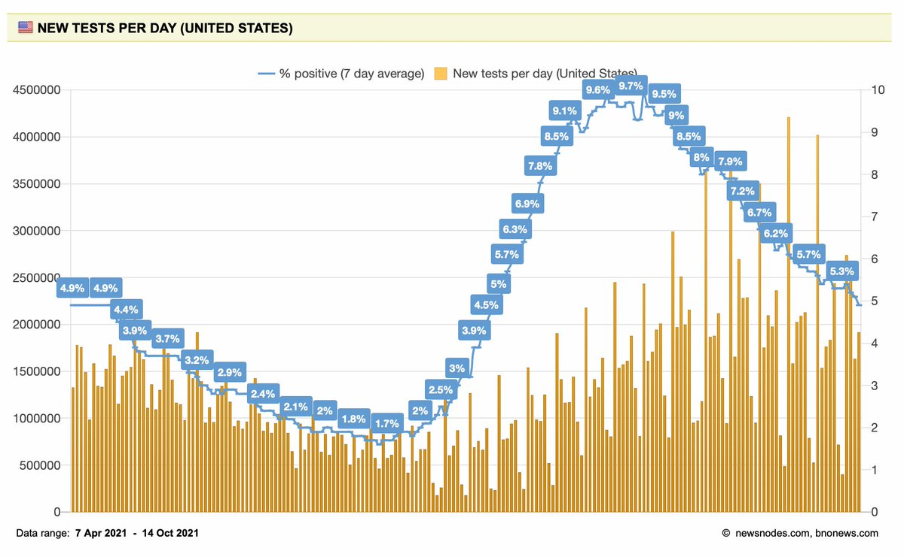</img></a><a href="FBvqc9-VEAgGgee.jpg"  >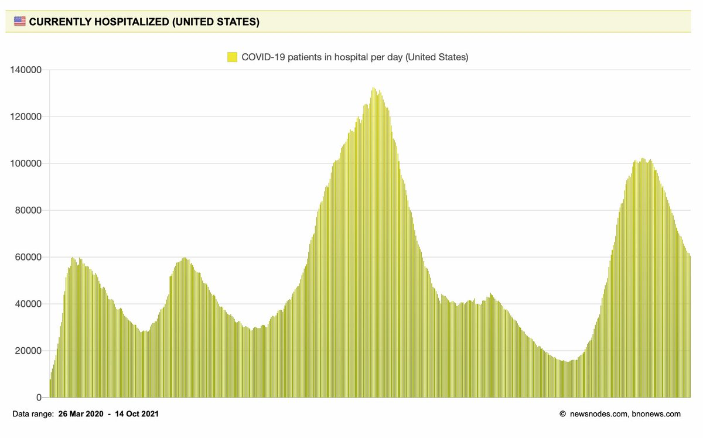</img></a>

---

<a href="https://twitter.com/erictopol/status/1449013026766553088" target="_blank" rel="noreferer">14:03 UCT</a>

The US population is far less vaccinated than the UK, by more than 11 per cent points
The UK was descending and now heading back up towards their Delta peak 

<a href="FBvtE28VEAcHdIT.jpg"  >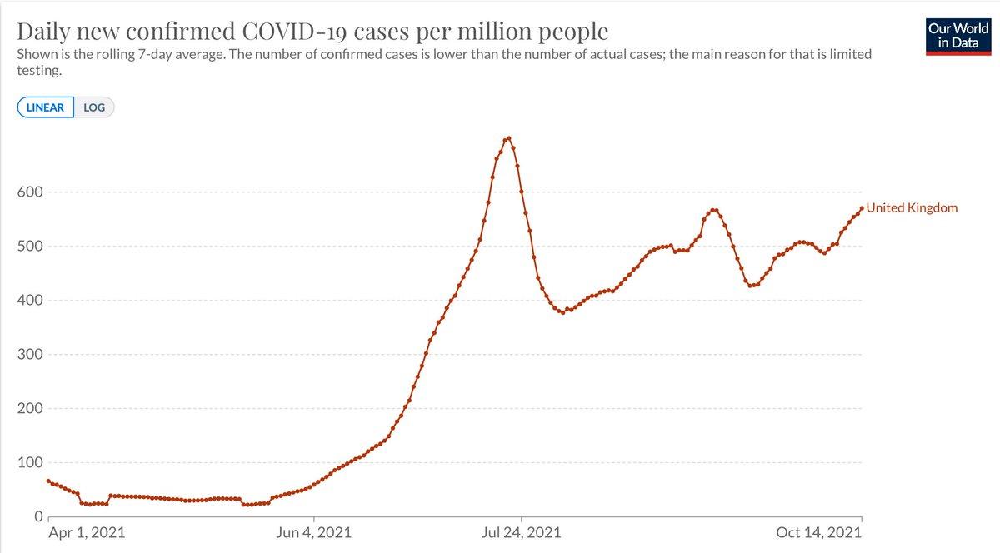</img></a>

---

<a href="https://twitter.com/erictopol/status/1449014494441533442" target="_blank" rel="noreferer">14:09 UCT</a>

The high Infection rate among children is a significant  problem for both countries
https://twitter.com/chrischirp/status/1448969941143724050
https://www.nbcnews.com/news/us-news/data-shows-more-children-are-getting-sick-dying-covid-n1281616 

<a href="FBvudL0VUAUd2pT.png"  >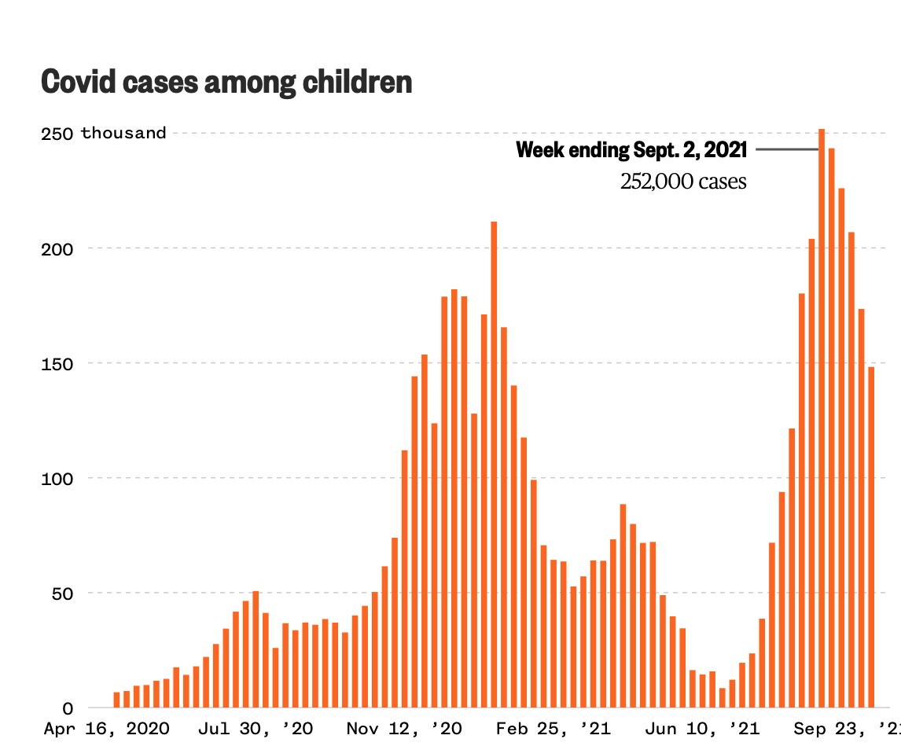</img></a>

---

<a href="https://twitter.com/erictopol/status/1449018441449365510" target="_blank" rel="noreferer">14:24 UCT</a>

New data from NIH mix and match study: strong antibody response induced vs Delta for all additional vaccine (Pfizer, Moderna, J&amp;J) shots
https://www.fda.gov/media/153128/download 

<a href="FBvyPDiVcAAebUG.jpg"  >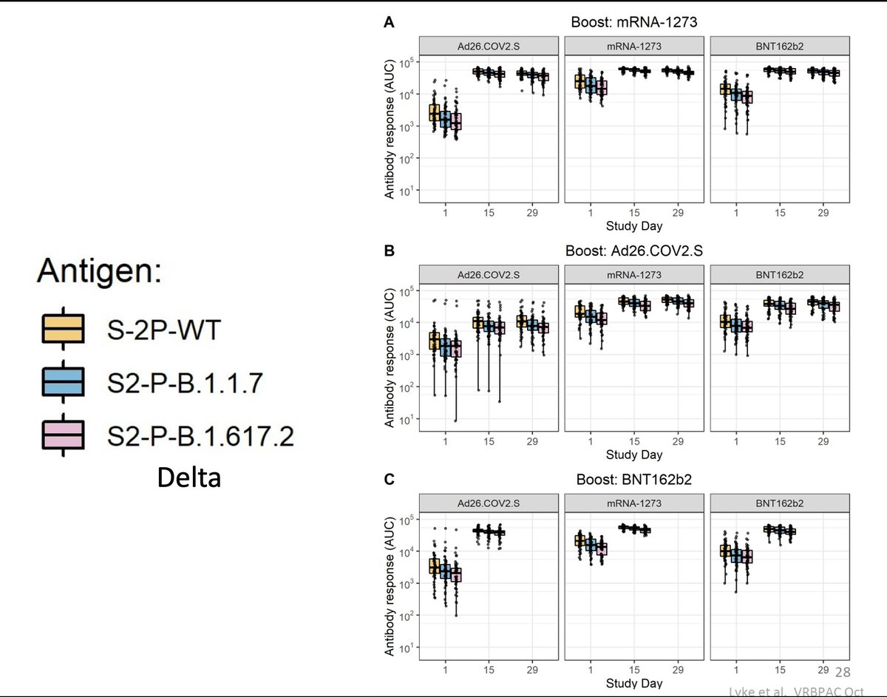</img></a>

---

<a href="https://twitter.com/erictopol/status/1449033122041909251" target="_blank" rel="noreferer">15:23 UCT</a>

This week brought a major change in recommendations for taking or avoiding low dose aspirin for prevention of heart attacks and strokes. It's confusing, but cleared up by @taraparkerpope @nythealth https://www.nytimes.com/article/aspirin-recommendation-explained.html

---

<a href="https://twitter.com/erictopol/status/1449037109667401737" target="_blank" rel="noreferer">15:39 UCT</a>

How medicine is practiced
You're about to deliver a baby. Does your obstetrician used the evidence base to decide on whether to do a C-section?
No. It's largely driven by the last patient
https://www.science.org/doi/10.1126/science.abc9818
https://www.science.org/doi/10.1126/science.abl5647
@ScienceMagazine @vini_singh_ 

<a href="FBwCh0FVUAUPOc2.jpg"  >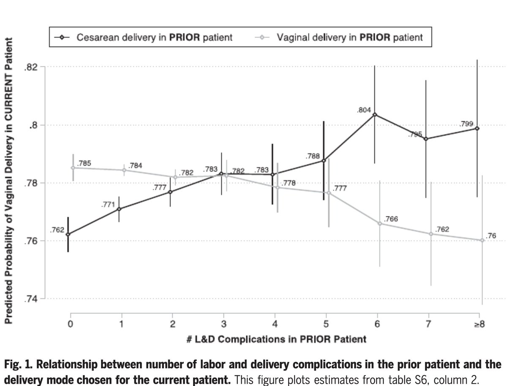</img></a>

---

<a href="https://twitter.com/erictopol/status/1449039345269161994" target="_blank" rel="noreferer">15:47 UCT</a>

How do you get Super-Immunity vs Covid?
Prior covid plus a vaccine shot
https://www.nature.com/articles/d41586-021-02795-x by @ewencallaway @Nature 
(PS: you don't want to get Covid, but in case you did) 

<a href="FBwFid3VIAA2JFH.jpg"  >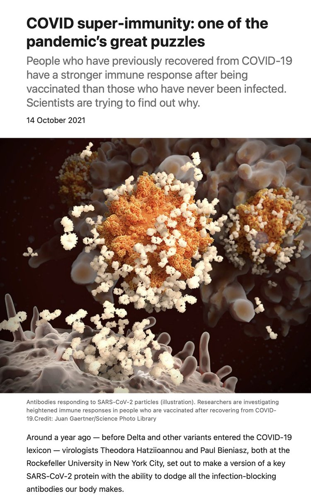</img></a>

---

<a href="https://twitter.com/erictopol/status/1449080027354570756" target="_blank" rel="noreferer">18:29 UCT</a>

@vini_singh_ @ScienceMagazine OK, thanks. The accompanying editorial to your paper certainly led me to that perspective (as highlighted). But understand "largely" is too strong, and I'm fine to reduce to "one of the factors."  It is, however, disconcerting and the issue transcends decisions beyond delivery 

<a href="FBwpxSQVIAISfFl.jpg"  >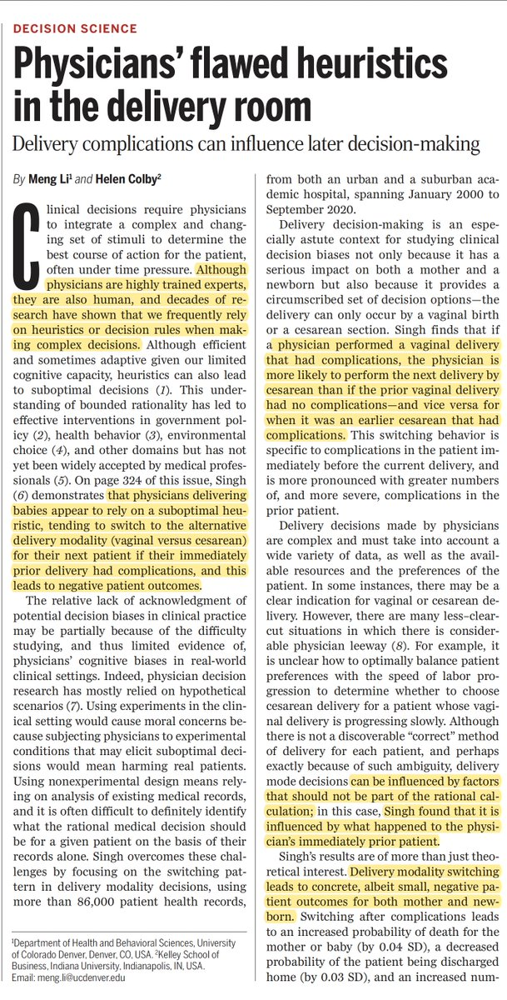</img></a><a href="FBwqE93VkAIQ88H.jpg"  >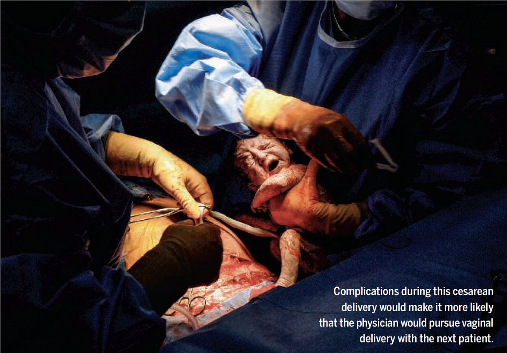</img></a>

---

<a href="https://twitter.com/erictopol/status/1449083814538473472" target="_blank" rel="noreferer">18:44 UCT</a>

Great summary by @HelenBranswell and @matthewherper of today's meeting
The idea of "one and done" for J&amp;J or boosting it only with J&amp;J (rather than mixing with mRNA as 2nd dose) didn't go over well today  https://twitter.com/HelenBranswell/status/1449066049320718341

<a href="FBwtjXcVkAQ02K5.jpg"  >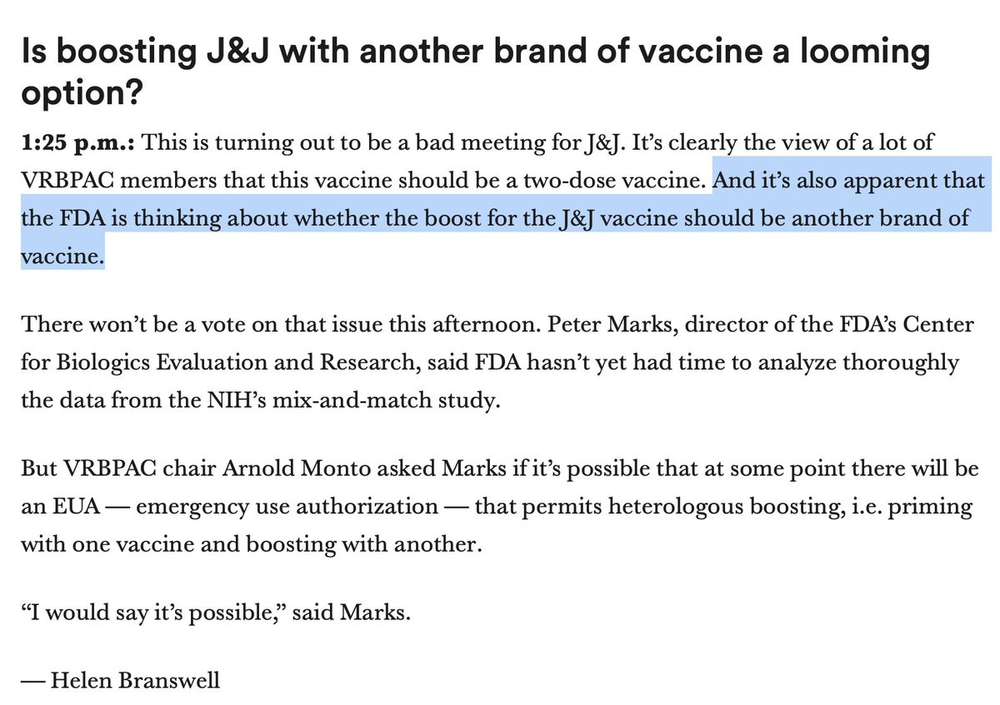</img></a>

---

<a href="https://twitter.com/erictopol/status/1449087721222250498" target="_blank" rel="noreferer">19:00 UCT</a>

For best practices in managing the Delta wave, the US would have done well to consult Puerto Rico
US 26 cases/100,000 people, 19/100K hospitalized 57% vaccinated  
PR 3 cases/100,000 people, 3/100K hospitalized, 68% vaccinated 

<a href="FBwxA8SUcAAwBFz.jpg"  >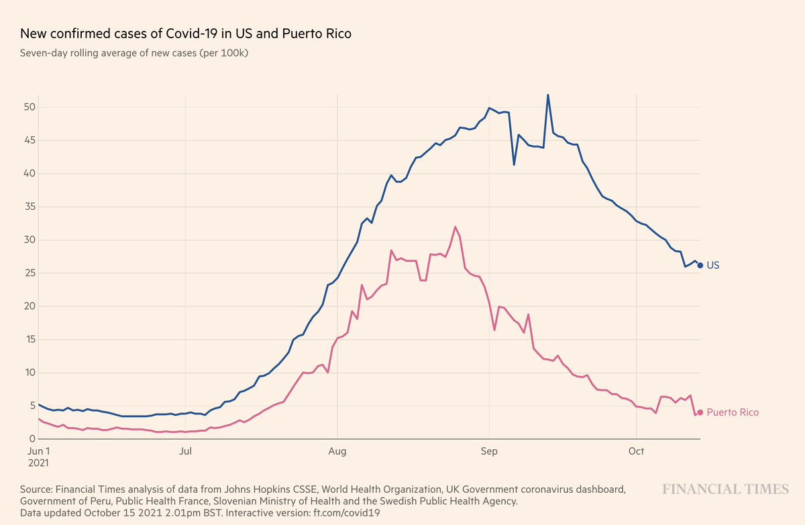</img></a><a href="FBwxD4WUUAEhfLg.jpg"  >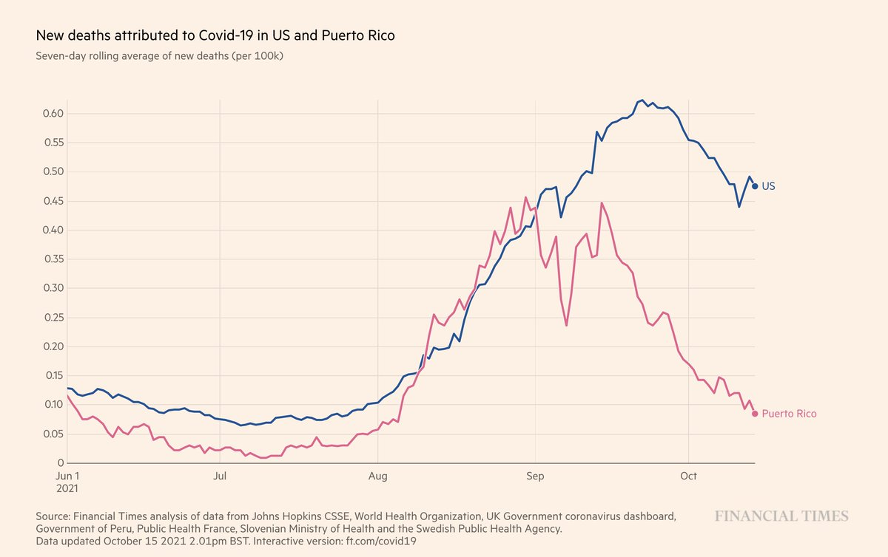</img></a>