+++
title = "Tweets by Eric Topol Oct 16"
Summary = ""
tags = ["Twitter"]
category = "Twitter"
+++

---

<a href="https://twitter.com/erictopol/status/1449195552743198727" target="_blank" rel="noreferer">02:08 UCT</a>

Our covid times :-(
by @MatttDavies 

<a href="FByTlqSUUAIN2ER.jpg"  >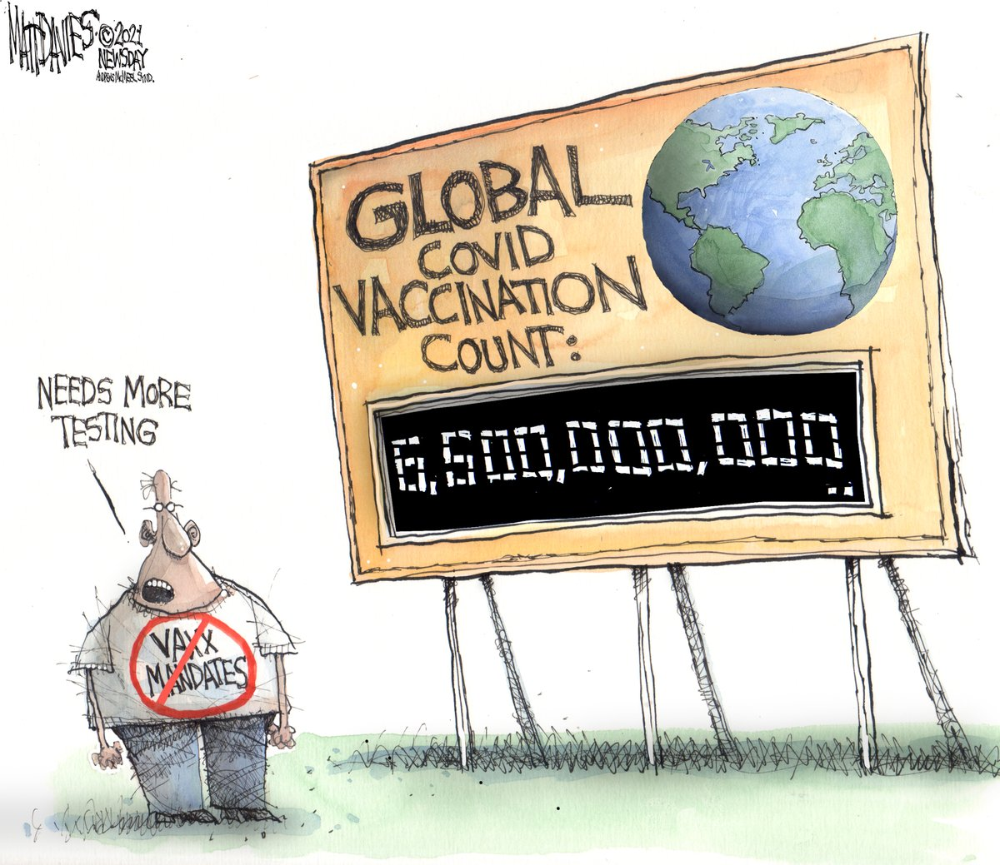</img></a>

---

<a href="https://twitter.com/erictopol/status/1449384982896525314" target="_blank" rel="noreferer">14:41 UCT</a>

Why does the UK currently have 6-fold hospital admissions and a 3-fold higher death rate compared with Europe?
https://www.ft.com/content/34582534-4510-4d45-bcba-2f9e04005309 @FT @mroliverbarnes @jburnmurdoch @danieldombey 
Among possible explanations, two that stand out are less use of mitigation measures /1 

<a href="FB0-UXPVcAE5zGR.jpg"  >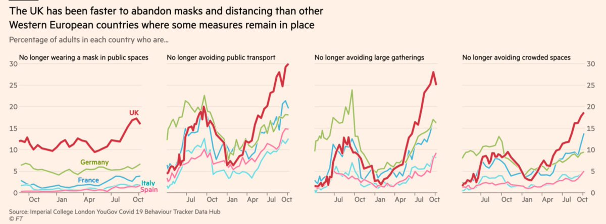</img></a>

---

<a href="https://twitter.com/erictopol/status/1449384988059725826" target="_blank" rel="noreferer">14:41 UCT</a>

And less vaccination of kids, age 12-17 

<a href="FB0-ytqUcAMvGt_.jpg"  >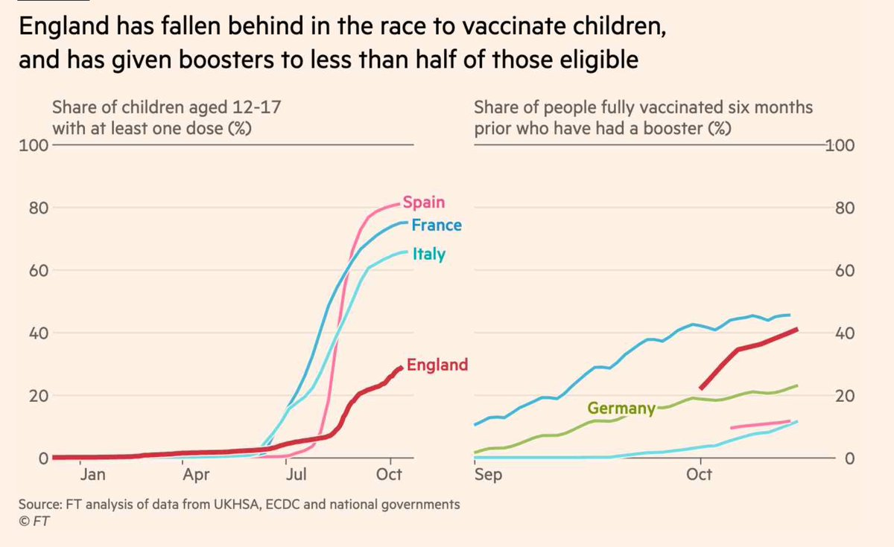</img></a>

---

<a href="https://twitter.com/erictopol/status/1449387883811381254" target="_blank" rel="noreferer">14:52 UCT</a>

More reliance on Astra Zeneca vaccines offered as another possible contributing factor 

<a href="FB1ChhqUYAMaLUJ.jpg"  >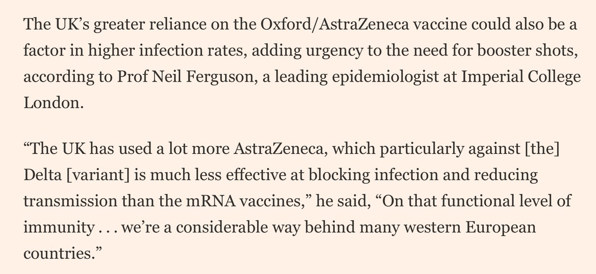</img></a>

---

<a href="https://twitter.com/erictopol/status/1449419195456704513" target="_blank" rel="noreferer">16:57 UCT</a>

Yesterday the FDA Advisory committee recommended that the 15 million Americans who have had J&amp;J vaccines, more than 2 months out, get a 2nd shot.
There are some significant issues with this that could have been prevented /1 

<a href="FB1X5ePVkAQejqC.jpg"  >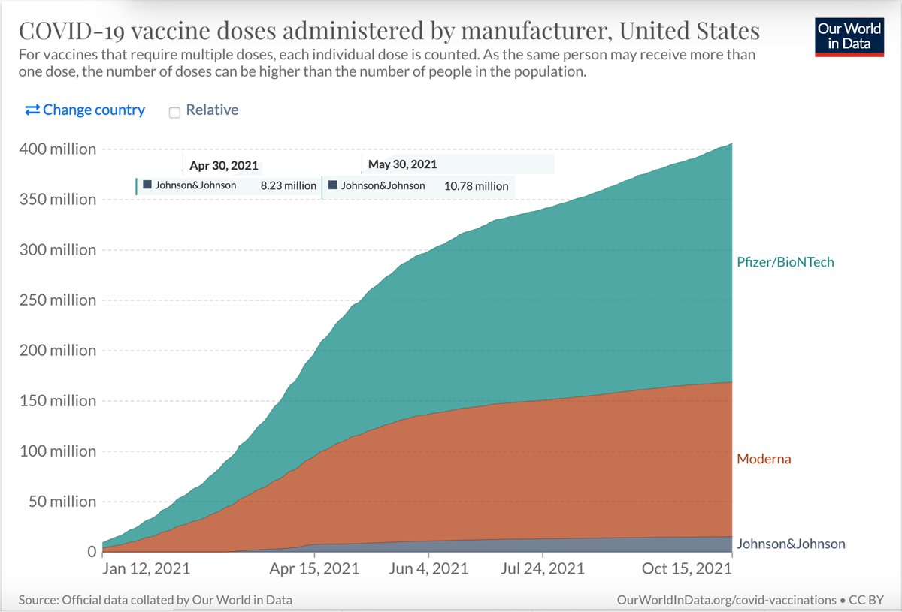</img></a>

---

<a href="https://twitter.com/erictopol/status/1449419198334078978" target="_blank" rel="noreferer">16:57 UCT</a>

By May 1, there were over 8 million people 5.5 months out
By June 1, the number rose to nearly 11 million people 4.5 months out
Yet data have consistently been showing attrition of protection vs infections for this vaccine, this week in 620,000 US Veterans /2 

<a href="FB1X-xYVIAIhmTk.jpg"  >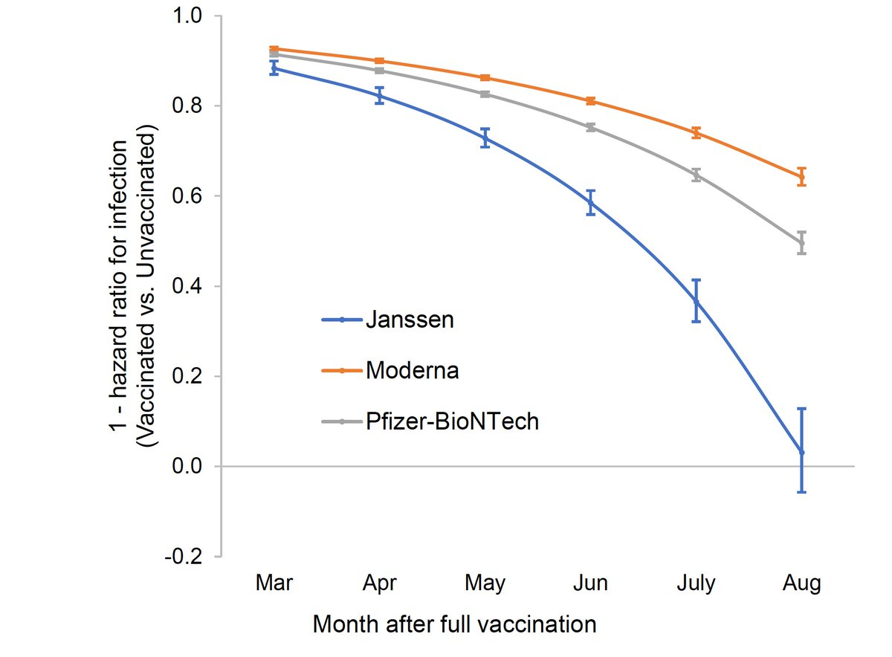</img></a>

---

<a href="https://twitter.com/erictopol/status/1449419204218613762" target="_blank" rel="noreferer">16:57 UCT</a>

This is the only Covid vaccine that was positioned as "one and done." J&amp;J is the largest healthcare company in the world, yet research to back that up was undone until recently.
Single dose: 70% protection vs symptomatic infection
2-dose: 94% protection /3
https://www.fda.gov/media/153129/download 

<a href="FB1acZ8UUAUeJ1x.jpg"  >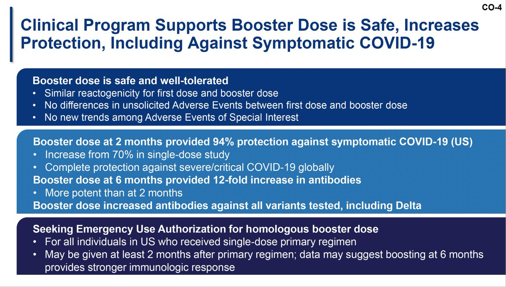</img></a>

---

<a href="https://twitter.com/erictopol/status/1449419212833755142" target="_blank" rel="noreferer">16:57 UCT</a>

A grand total of 17 people were studied for impact on  spike protein binding antibody levels (not even neutralization Abs) at 6 months /5 

<a href="FB1chKiUYAAVpb2.jpg"  >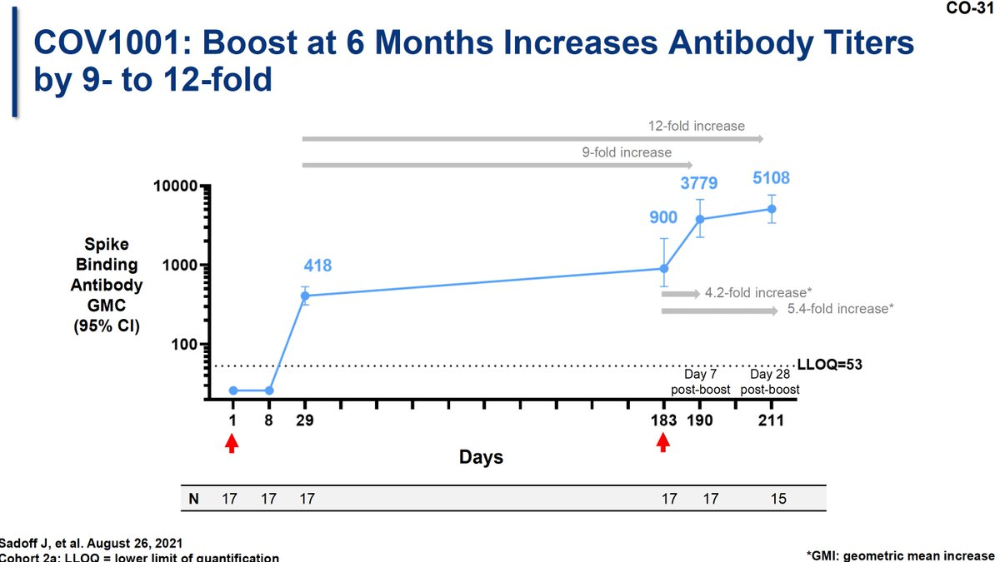</img></a>

---

<a href="https://twitter.com/erictopol/status/1449419210342293511" target="_blank" rel="noreferer">16:57 UCT</a>

To start with, the 1-shot 70% efficacy vs. symptomatic infections was considerably lower than the mRNA vaccines (95%), the primary endpoint of all Covid vaccine trials, and a proxy for protection vs hospitalizations and deaths 
2-shots brought it to parity in the US at 94% /4 

<a href="FB1bTbkVUAAfCWy.jpg"  >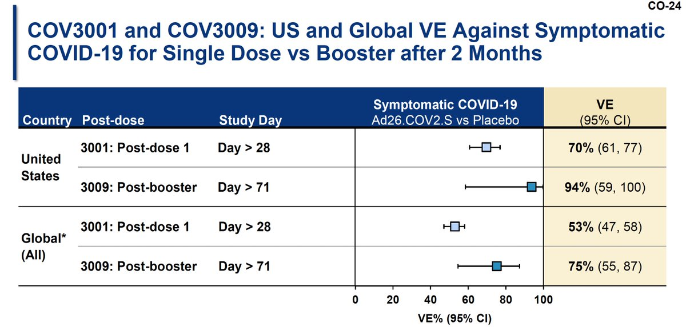</img></a>

---

<a href="https://twitter.com/erictopol/status/1449419220626800645" target="_blank" rel="noreferer">16:57 UCT</a>

How could this happen? 15 million Americans potentially left vulnerable and still no formal approval for a 2nd shot
1. J&amp;J did insufficient and late in coming research to backup their "one and done" assertion
2. The poor US tracking of data obscured detection of this issue 
/7

---

<a href="https://twitter.com/erictopol/status/1449419217996898305" target="_blank" rel="noreferer">16:57 UCT</a>

Parenthetically, the antibody level increase from the 2nd J&amp;J shot at 2 months were small relative to a booster with an mRNA vaccine (50-70 fold, 1 month)/6 

<a href="FB1d-MCVUAA4_GA.jpg"  >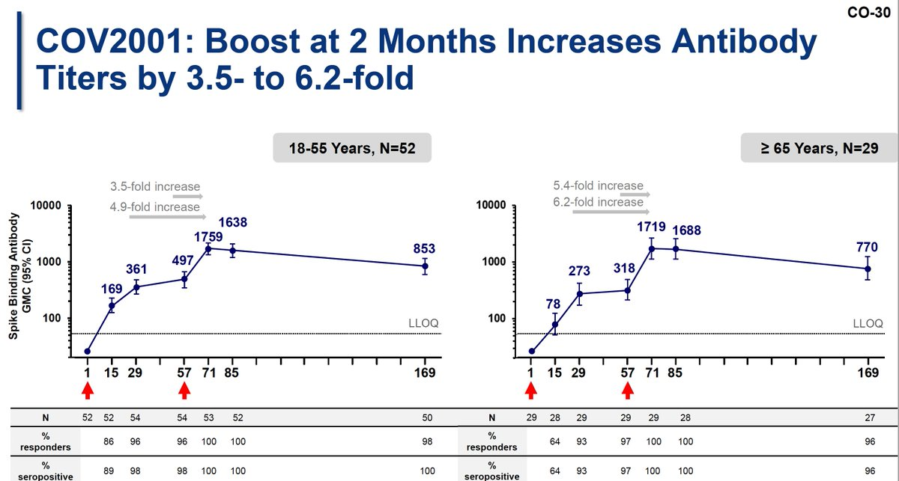</img></a><a href="FB1dxo_VcAI4G14.jpg"  >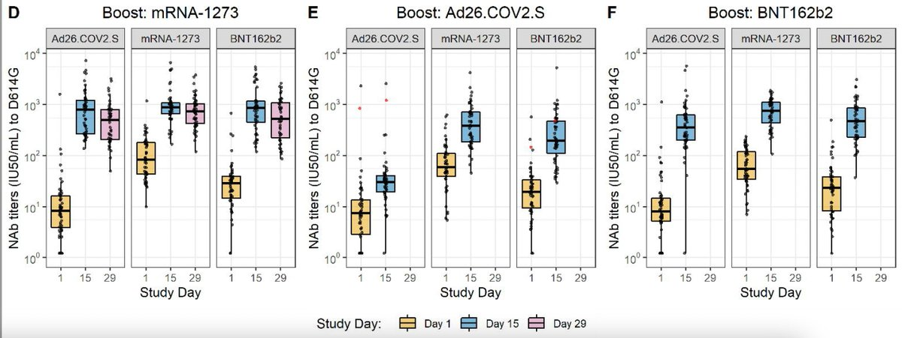</img></a>

---

<a href="https://twitter.com/erictopol/status/1449426542157647873" target="_blank" rel="noreferer">17:26 UCT</a>

Singapore has begun the descent from its Delta wave, which took its toll beyond a high case burden
https://covidsitrep.moh.gov.sg
@OurWorldInData 

<a href="FB1lsVTUcAI0R7N.jpg"  >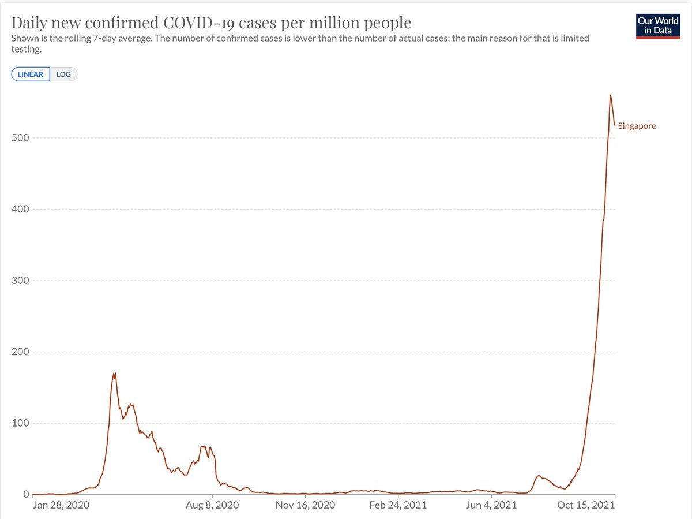</img></a><a href="FB1k89cVkAgwLZe.jpg"  >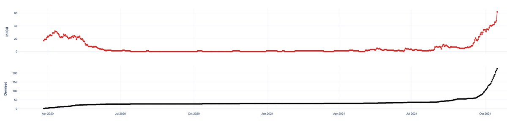</img></a>

---

<a href="https://twitter.com/erictopol/status/1449437421754404864" target="_blank" rel="noreferer">18:09 UCT</a>

Just published at @CellCellPress 
The pivotal importance of vaccine dose spacing. Comparison of a median 3.3 week vs 10.1 week spacing for the Pfizer vaccine shows longer lag yields much higher neutralizing antibody and CD4+ T cell response
https://www.cell.com/cell/fulltext/S0092-8674(21)01221-6#relatedArticles Delta example👇 

<a href="FB1uMKmVUAMe1iZ.jpg"  >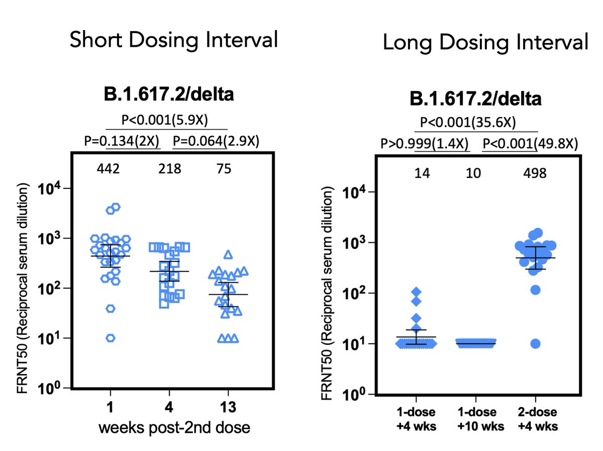</img></a>

---

<a href="https://twitter.com/erictopol/status/1449454401949601792" target="_blank" rel="noreferer">19:17 UCT</a>

We've known about the lapses in antibody levels and reduced protection vs hospitalization for some time, but left these people (who typically had no choice and were told all vaccines were equivalent) susceptible over a prolonged period 

<a href="FB1-occUUAMsB3b.jpg"  >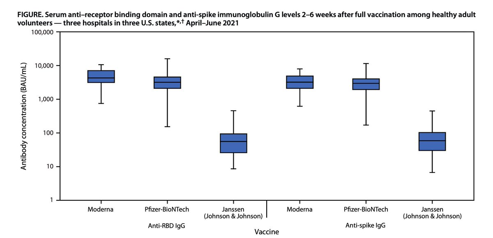</img></a><a href="FB1-p1vVkAEk1il.jpg"  >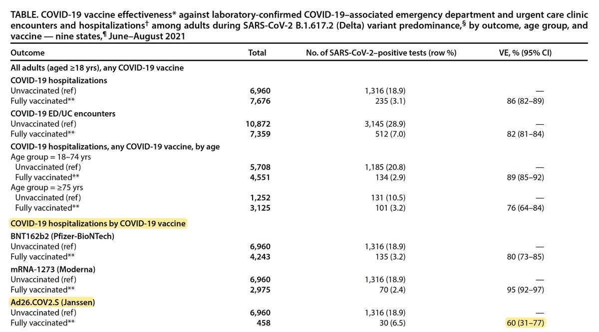</img></a>