+++
title = "Tweets by Eric Topol Oct 17"
Summary = ""
tags = ["Twitter"]
category = "Twitter"
+++

---

<a href="https://twitter.com/erictopol/status/1449758312686178305" target="_blank" rel="noreferer">15:24 UCT</a>

Until now, the only clinical proof of booster shot effectiveness came from Israel with Pfizer. New data from the UK, in the 1st group (half) boosted age 80+, w/ multiple vaccines, showing benefit vs hospitalization
by @tomhcalver @thesundaytimes https://www.thetimes.co.uk/article/covid-booster-uptake-among-the-over-80s-could-be-too-sluggish-to-prevent-overcrowded-hospitals-5mw2w0jm9 

<a href="FB6QtyGVkAwcTIm.jpg"  >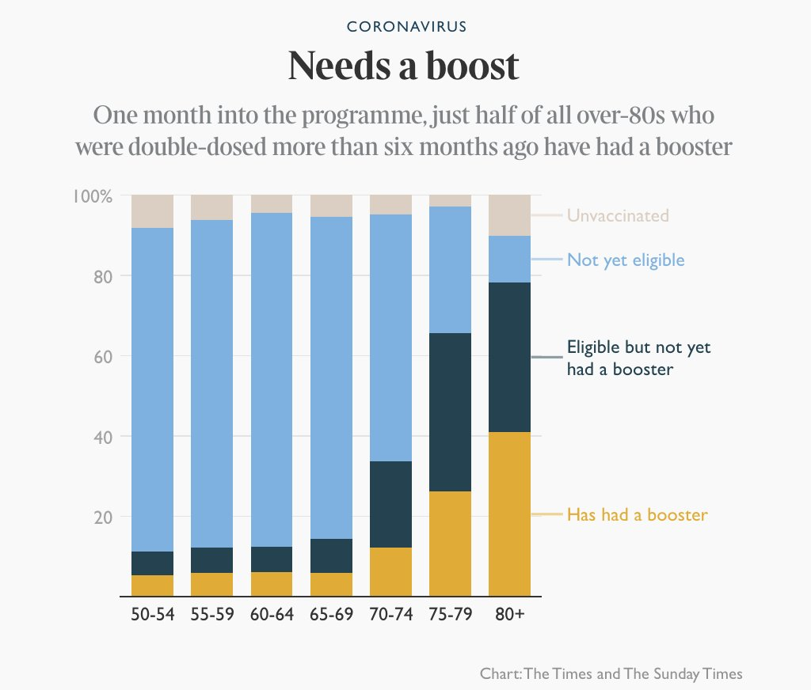</img></a><a href="FB6RfntVkAAq-po.jpg"  >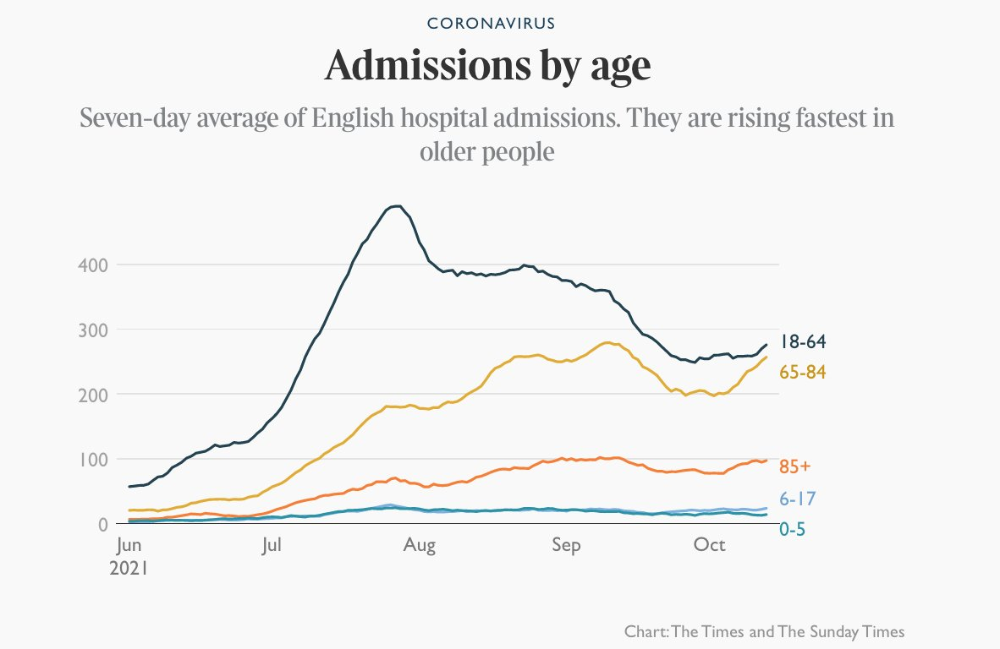</img></a>

---

<a href="https://twitter.com/erictopol/status/1449788735436967941" target="_blank" rel="noreferer">17:25 UCT</a>

Why did the US &amp; Israel have similar patterns and some of the worst Delta waves in the world w/r to hospitalizations and deaths per capita (US worse) ?
—large % population (~40-50%) left unvaccinated
—early movers, enhanced immunity waning
—short-spacing mRNA vaccines, 3-4 wks 

<a href="FB6tm_JVIAAjW4z.jpg"  >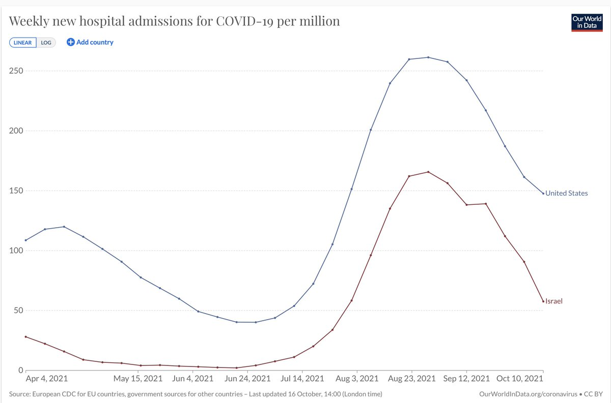</img></a><a href="FB6tqLyVkAg-3iK.jpg"  >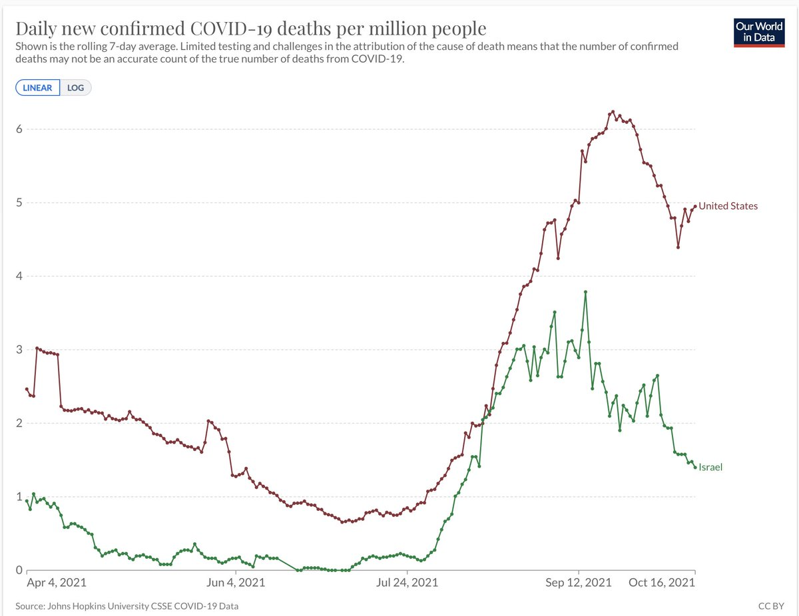</img></a>

---

<a href="https://twitter.com/erictopol/status/1449811598462242819" target="_blank" rel="noreferer">18:56 UCT</a>

Another potential explanation is that the UK vaccinated earlier than rest of Europe, and therefore has manifest more waning of protection, especially among older people
Graphs by @jburnmurdoch 

<a href="FB7Dg7PUYAUh-KG.png"  >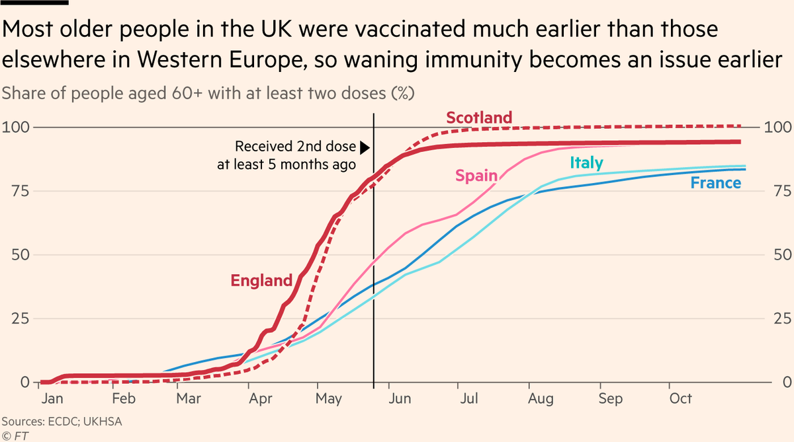</img></a><a href="FB7DvXbUcAA6DM4.png"  >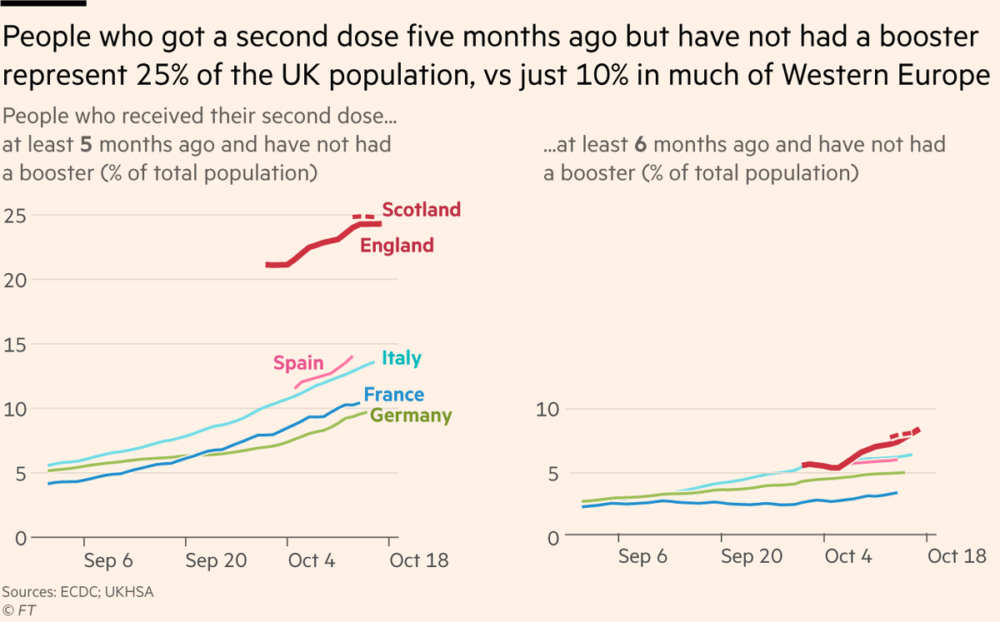</img></a>

---

<a href="https://twitter.com/erictopol/status/1449827103168339968" target="_blank" rel="noreferer">19:58 UCT</a>

Agree we need functional data for AY.4.
But this lineage is in decline in the US (14 -&gt; 7%), and worldwide, which certainly suggests it isn't capable of competing with Delta 
https://outbreak.info/situation-reports?pango=B.1.621
Many other reasons for UK situation https://twitter.com/EricTopol/status/1449384982896525314  https://twitter.com/ScottGottliebMD/status/1449803423906418691

<a href="FB7Re87UcAAsZYU.jpg"  >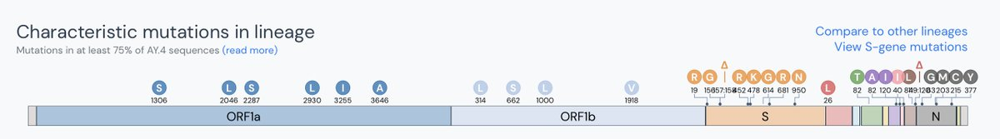</img></a><a href="FB7RglqVkAA3Ep1.jpg"  >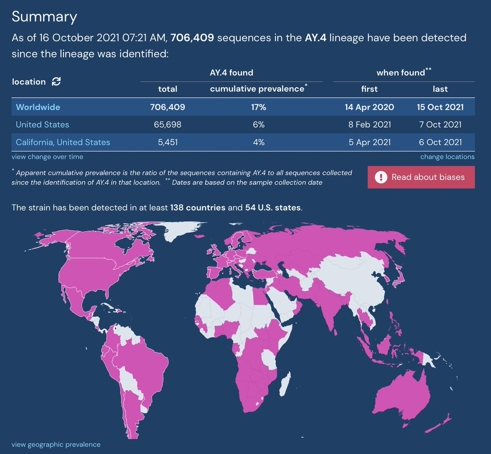</img></a><a href="FB7RiGlUYAEEdAR.jpg"  >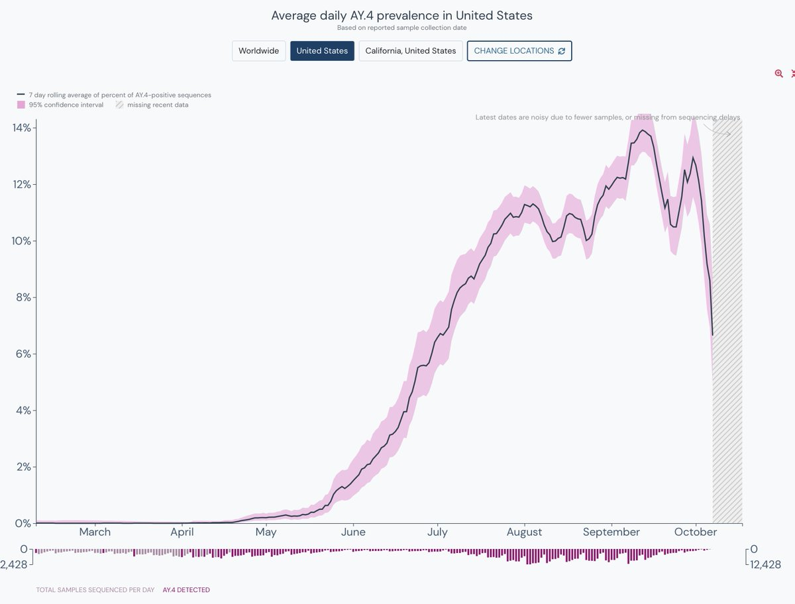</img></a><a href="FB7RyLtVQAIdnCe.jpg"  >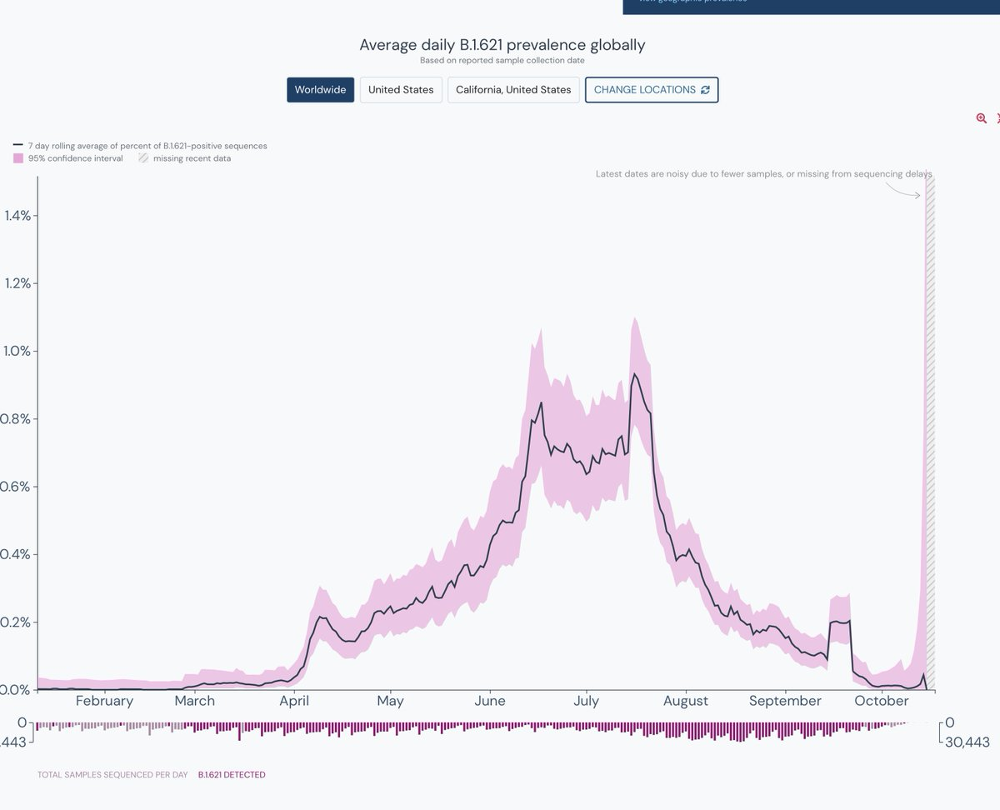</img></a>

---

<a href="https://twitter.com/erictopol/status/1449835654179799041" target="_blank" rel="noreferer">20:32 UCT</a>

@ScottGottliebMD Yes on uncertainty. Here's more on S:Y145H
http://outbreak.info 

<a href="FB7ZlhkVcAEdUwF.jpg"  >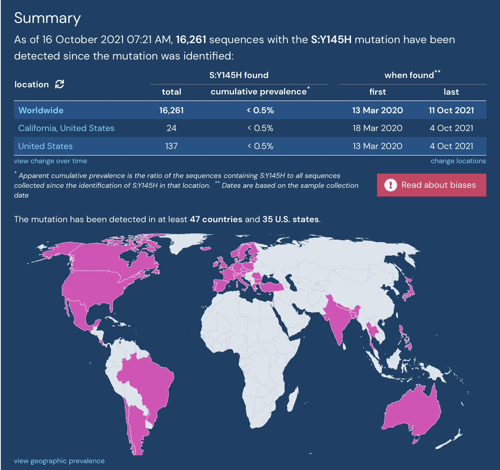</img></a><a href="FB7ZY6gVEAMDift.jpg"  >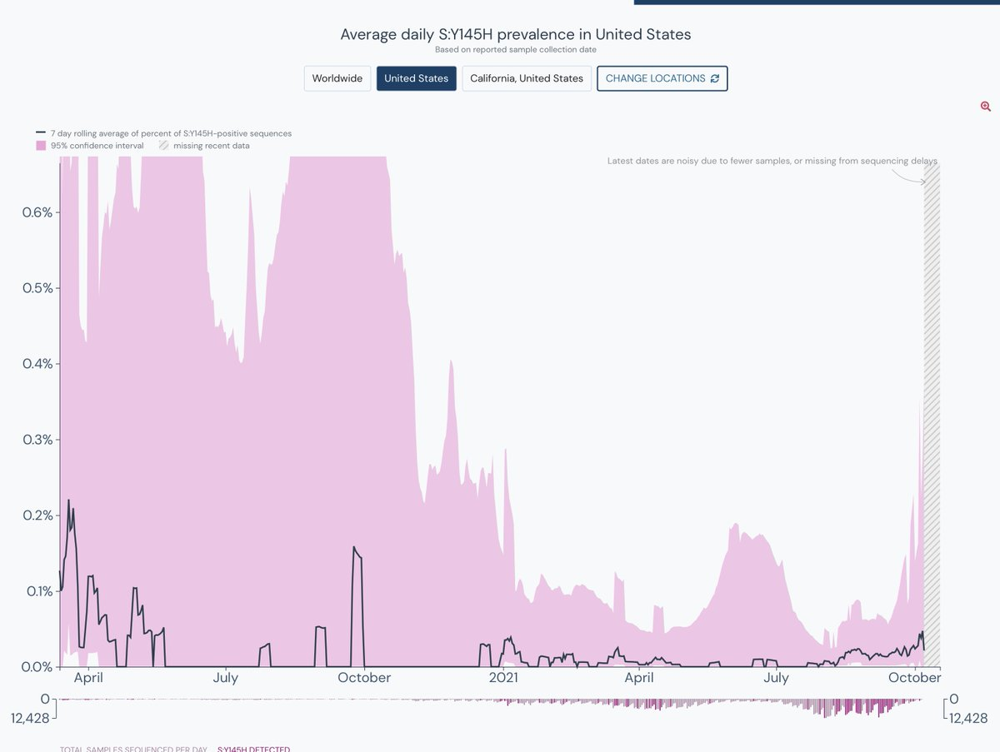</img></a><a href="FB7ZauVVcAE4Rfh.jpg"  >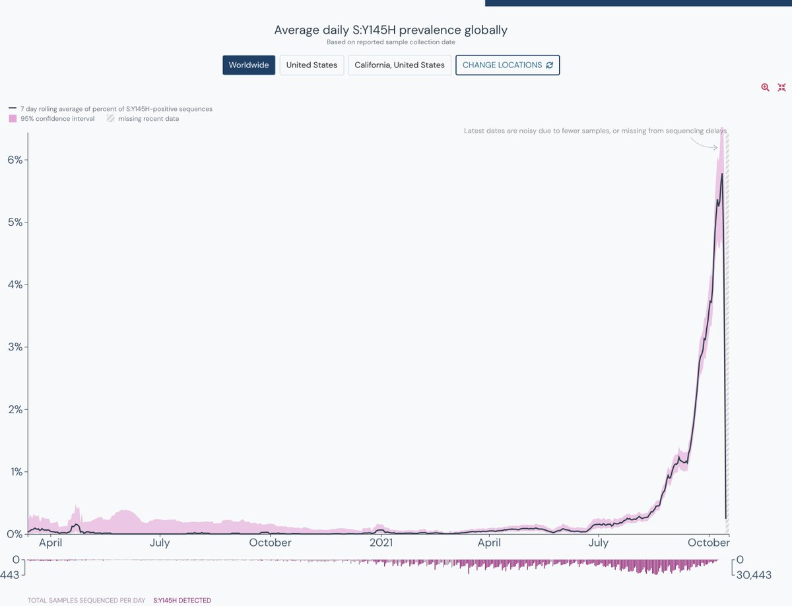</img></a>