+++
title = "Tweets by Eric Topol Oct 19"
Summary = ""
tags = ["Twitter"]
category = "Twitter"
+++

---

<a href="https://twitter.com/erictopol/status/1450266361435807745" target="_blank" rel="noreferer">01:03 UCT</a>

Is it waning over time or the Delta variant that accounts for some decline of vaccine protection?
Studies provide mixed evidence; they are tightly intertwined, difficult to fully parse, likely both contribute
https://www.medrxiv.org/content/10.1101/2021.10.17.21265101v1
https://www.medrxiv.org/content/10.1101/2021.10.08.21264595v1
https://www.thelancet.com/journals/lancet/article/PIIS0140-6736(21)02183-8/fulltext

---

<a href="https://twitter.com/erictopol/status/1450292899690659845" target="_blank" rel="noreferer">02:49 UCT</a>

Remember the small clinical trials that suggested colchicine would have big benefit for Covid? Well, a large one, with over 11,000 patients randomized, published today showed a nil effect for all endpoints https://www.thelancet.com/journals/lanres/article/PIIS2213-2600(21)00435-5/fulltext #RECOVERY 

<a href="FCB4lRRUcAI8AIB.jpg"  >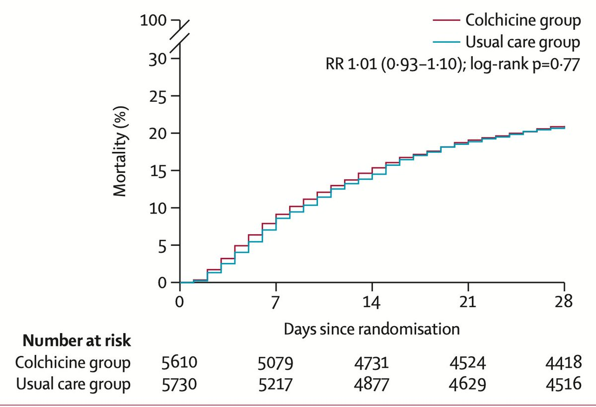</img></a>

---

<a href="https://twitter.com/erictopol/status/1450295783794880515" target="_blank" rel="noreferer">03:00 UCT</a>

@jennifergardy @gatesfoundation @AnitaZaidi Congratulations, Jennifer, for this richly deserved recognition!

---

<a href="https://twitter.com/erictopol/status/1450442757483368455" target="_blank" rel="noreferer">12:44 UCT</a>

RT @NIHDirector: Pleased to join a panel with @EricTopol &amp; @DrLeanaWen today during the @MilkenInstitute 2021 Global Conference. Watch at 3…

---

<a href="https://twitter.com/erictopol/status/1450448664254566404" target="_blank" rel="noreferer">13:08 UCT</a>

Is there a worse version of the🦠 than Delta to come?
https://www.washingtonpost.com/health/2021/10/18/coronavirus-mutations/
by @JoelAchenbach @bbguari @asteckelberg w/ @BillHanage @EricLander46 
The chances for that will be greatly reduced if it is globally contained 

<a href="FCEE97_VEAURlOt.jpg"  >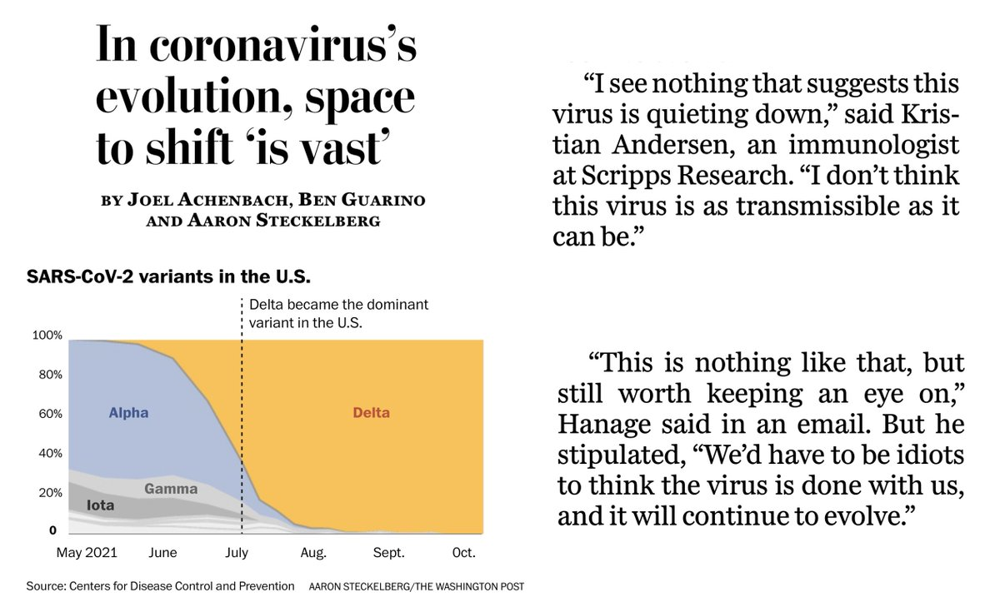</img></a>

---

<a href="https://twitter.com/erictopol/status/1450450271054680065" target="_blank" rel="noreferer">13:14 UCT</a>

"I hope that Covid-19 has catalyzed a shift in thinking about the air we breathe."—@linseymarr @nytopinion #COVIDisAirborne and what you can to do about it
https://www.nytimes.com/2021/10/19/opinion/covid-flu-air-transmission.html 

<a href="FCEIQKCVEAQkfLB.jpg"  >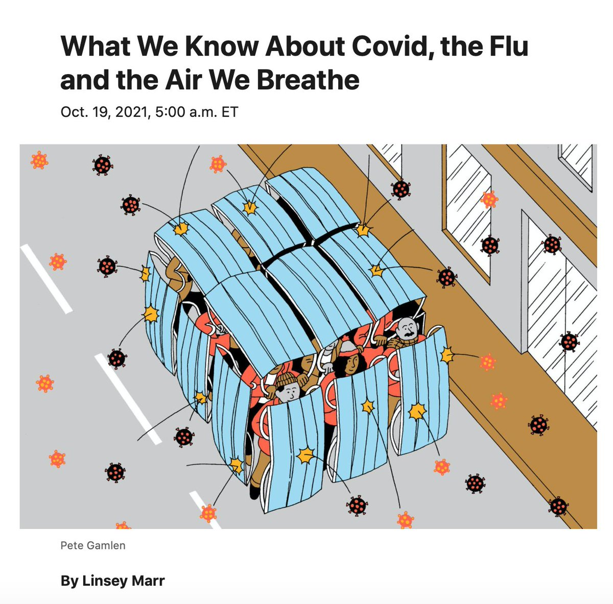</img></a>

---

<a href="https://twitter.com/erictopol/status/1450451076767883268" target="_blank" rel="noreferer">13:17 UCT</a>

Yeah, it deserves a headline 

<a href="FCEJgDjVEAAZd-Q.jpg"  >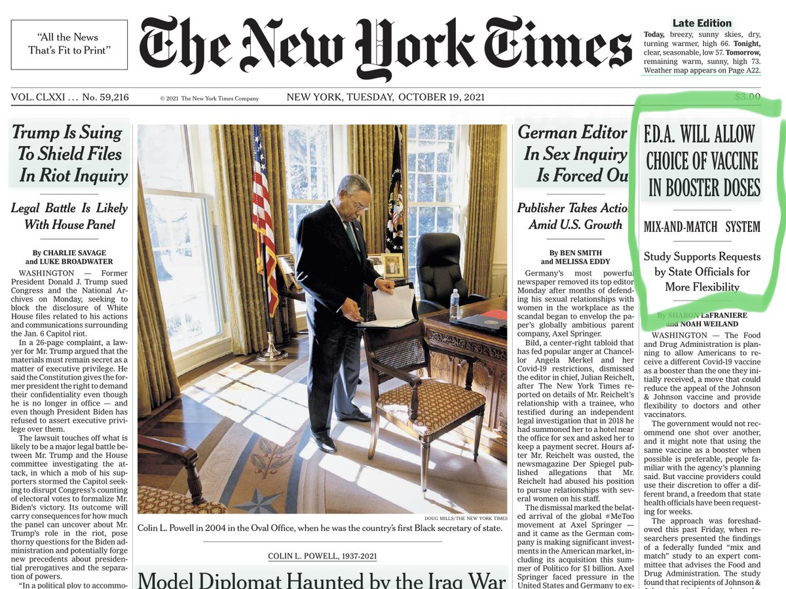</img></a>

---

<a href="https://twitter.com/erictopol/status/1450455831309209600" target="_blank" rel="noreferer">13:36 UCT</a>

"I saw it on the Twitter" ;-)
by @stephanpastis 

<a href="FCEN1M1UUAAzKfu.jpg"  >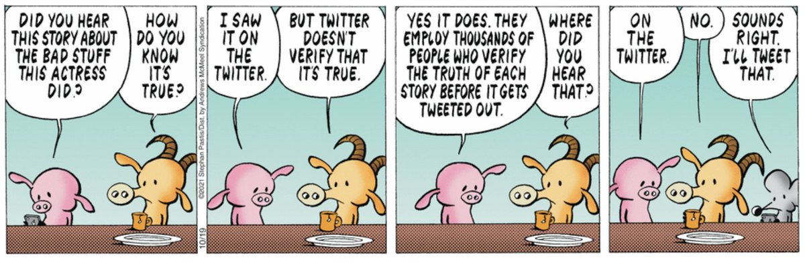</img></a>

---

<a href="https://twitter.com/erictopol/status/1450460870836998152" target="_blank" rel="noreferer">13:56 UCT</a>

The tragedy unfolding in Russia's Delta wave, with only 1/3rd population vaccinated and new records of cases and deaths each day https://www.nytimes.com/2021/10/18/world/europe/russia-virus-vaccine.html?searchResultPosition=1 by @VALERIEin140 
w/ many common threads to US on lack of government trust and social responsibility, + misinformation 

<a href="FCERR_2UcAAMNyz.jpg"  >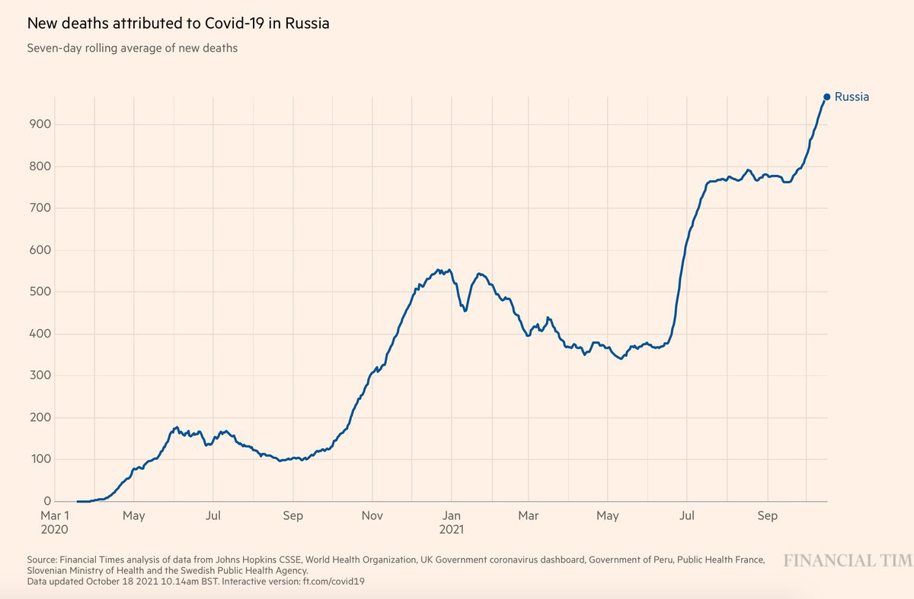</img></a><a href="FCERUMQXMAAwGeL.jpg"  >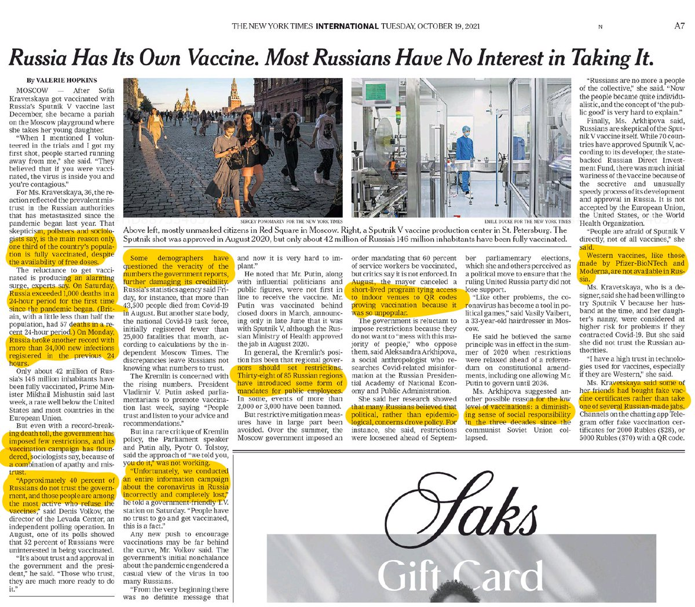</img></a>

---

<a href="https://twitter.com/erictopol/status/1450475410328850435" target="_blank" rel="noreferer">14:54 UCT</a>

Just published @ScienceTM 
With blunting of the immune response, why it is so important for pregnant women to get a Covid vaccine
 https://www.science.org/doi/10.1126/scitranslmed.abm2070 w/ @ScienceVisuals 

<a href="FCEfegbXsAYEkXr.jpg"  >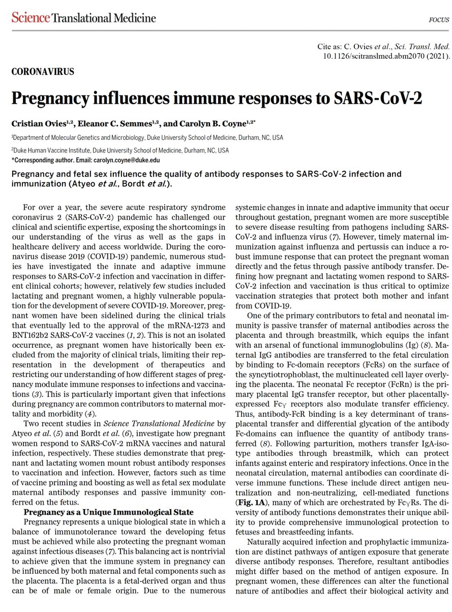</img></a><a href="FCEffxNXMAQJceh.jpg"  >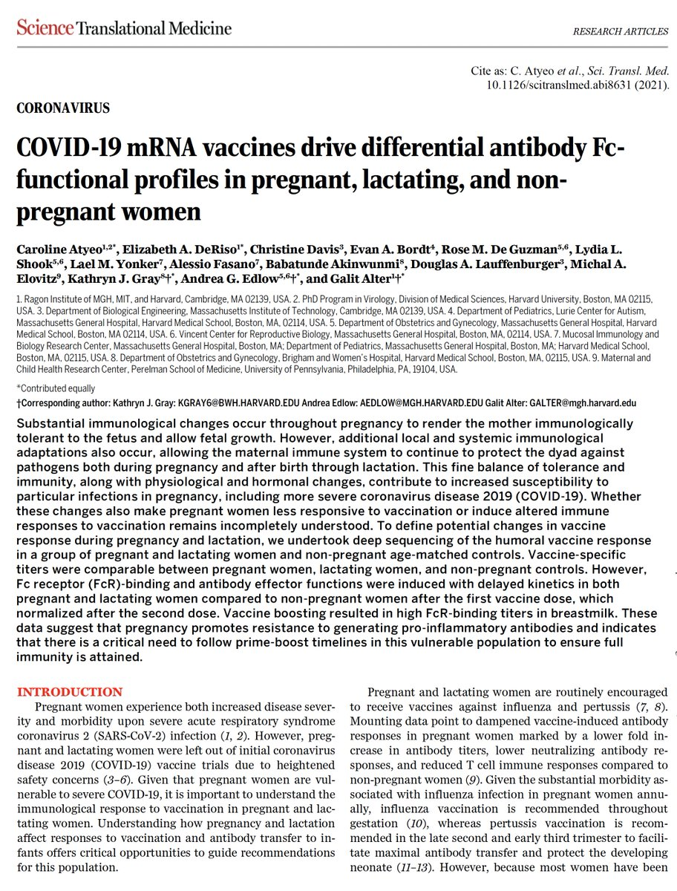</img></a><a href="FCEfhBSWUAok6Sc.jpg"  >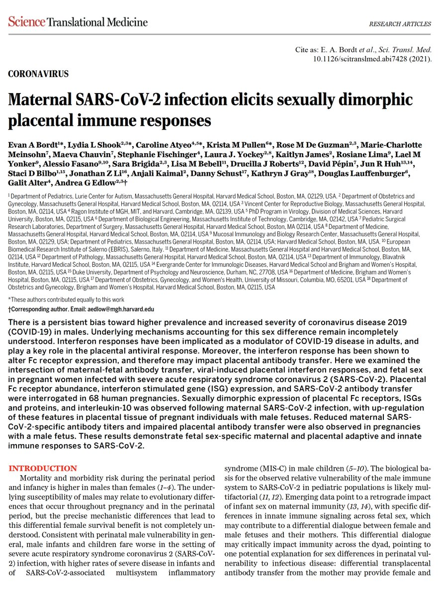</img></a><a href="FCEfm9BUcAA079k.jpg"  >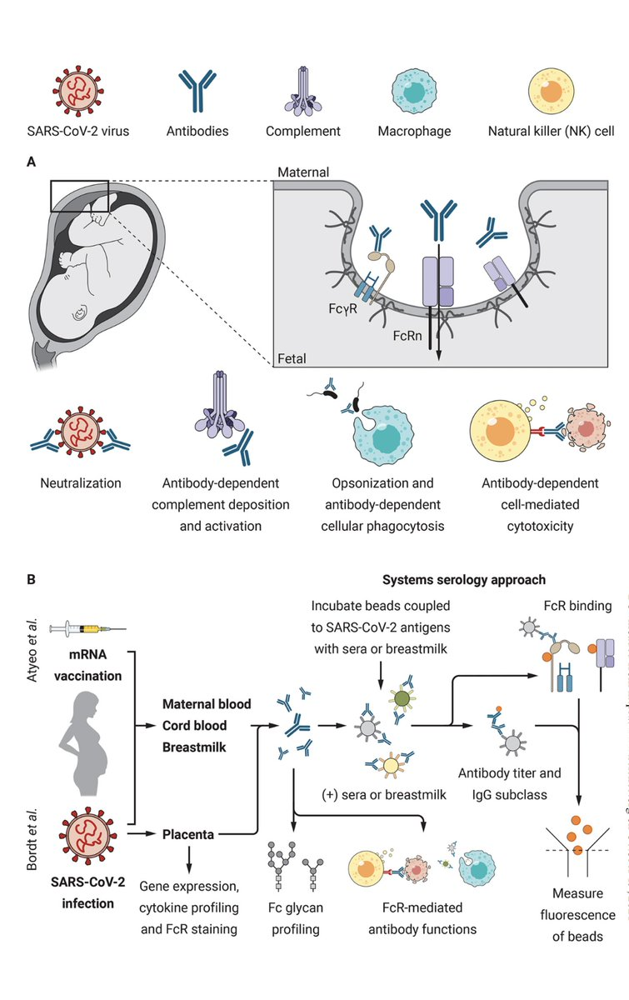</img></a>

---

<a href="https://twitter.com/erictopol/status/1450478390994108416" target="_blank" rel="noreferer">15:06 UCT</a>

The adage is "It's a 'scariant' until proven otherwise."
https://www.nytimes.com/2021/04/13/opinion/coronavirus-variants-not-all-scary.html @nytopinion 
As with AY.4.2, we still don't know that it has functional significance 

<a href="FCEh88dVEAEOd3u.jpg"  >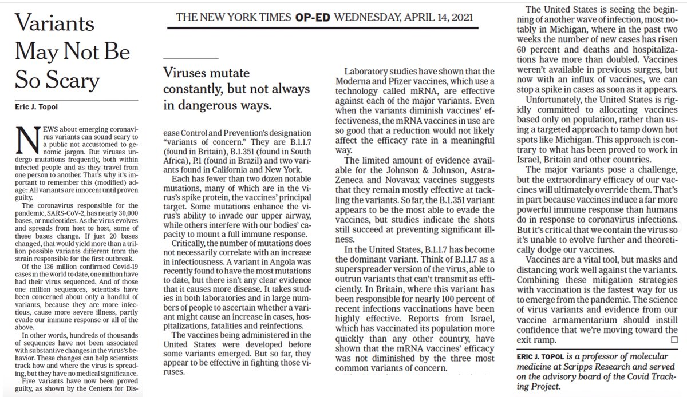</img></a>

---

<a href="https://twitter.com/erictopol/status/1450514184744013826" target="_blank" rel="noreferer">17:28 UCT</a>

How humor and memes help coping with the pandemic
https://www.apa.org/pubs/journals/releases/ppm-ppm0000371.pdf by @JessMyrick @PSUBellisario @nicholasejh
https://www.usatoday.com/story/life/health-wellness/2021/10/19/covid-memes-decrease-stress-help-us-cope-pandemic-study/8519742002/ by @darylaustinUT @USATODAY 

<a href="FCFBxLdXMAMNXv9.jpg"  >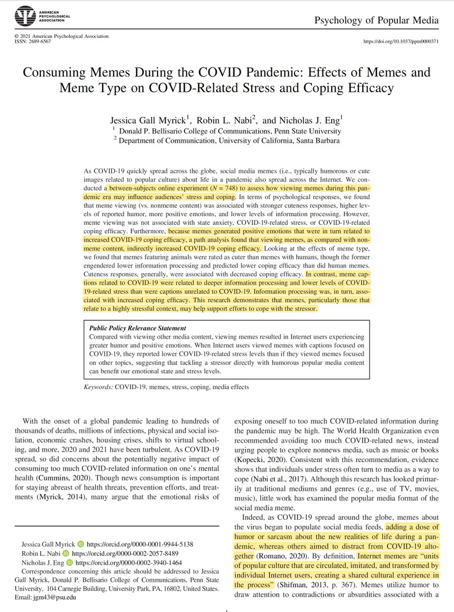</img></a><a href="FCFCkFIXoAkMnBf.jpg"  >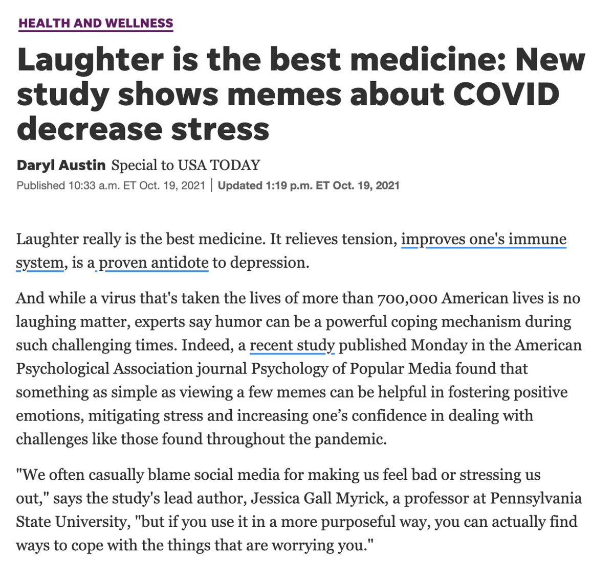</img></a>

---

<a href="https://twitter.com/erictopol/status/1450517285572018183" target="_blank" rel="noreferer">17:40 UCT</a>

@andrewrsorkin Probably not, but it would be good to get clinical data beyond this 1-month neutralizing antibody response, and with Delta

---

<a href="https://twitter.com/erictopol/status/1450520000595312644" target="_blank" rel="noreferer">17:51 UCT</a>

Indeed, the UK rise of AY.4.2 may have been a sequencing technical artifact https://twitter.com/arambaut/status/1450516707311853571

---

<a href="https://twitter.com/erictopol/status/1450520359552180225" target="_blank" rel="noreferer">17:52 UCT</a>

@akageleiry @andrewrsorkin Yes, but this is with 100 μg, not the 50 μg approved for 3rd dose Moderna

---

<a href="https://twitter.com/erictopol/status/1450521688576167938" target="_blank" rel="noreferer">17:58 UCT</a>

Vaccinations for teens is remarkably effective and safe, as determined by a new @CDCMMWR report
https://www.cdc.gov/mmwr/volumes/70/wr/mm7042e1.htm?s_cid=mm7042e1_w
Please help get teenagers vaccinated 

<a href="FCFJnqtWEAINqRw.jpg"  ></img></a><a href="FCFJwmkXMAsZE_X.png"  >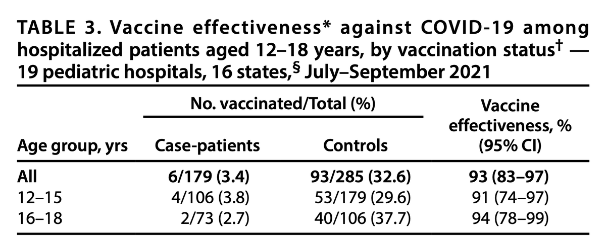</img></a>

---

<a href="https://twitter.com/erictopol/status/1450559027256061953" target="_blank" rel="noreferer">20:26 UCT</a>

The problem w/ "natural immunity"to Covid is that there's nothing natural about getting Covid. 
Yes, if you got it unnaturally there's a variable degree of immunity built. That variability + Delta sets the foundation: 
Prior 🦠 + 💉 = &gt; protection than any 2-dose 💉

---

<a href="https://twitter.com/erictopol/status/1450560108925050883" target="_blank" rel="noreferer">20:30 UCT</a>

The @CDCgov needs to change vaccination cards to reflect that confirmed Prior Covid is equivalent to 1-dose of a vaccine. There is no excuse for their continuing to ignore what is now a well-established body of evidence.

---

<a href="https://twitter.com/erictopol/status/1450566515992920068" target="_blank" rel="noreferer">20:56 UCT</a>

The US Supreme Court has just ruled favorably on mandates for healthcare workers in Maine
https://twitter.com/adamgoldmanNYT/status/1450560749844193288
But those required to get vaccinated for work, and have confirmation of prior Covid, should, if they so choose, be able to get credit for having had 1-dose equivalent

---

<a href="https://twitter.com/erictopol/status/1450572763119292418" target="_blank" rel="noreferer">21:21 UCT</a>

Today is the 1st time in several weeks:
—Alaska has dropped below 100 cases/100,000 people
and
—No state is above that threshold
(Montana, on the rise, is getting close)
https://www.nytimes.com/interactive/2021/us/covid-cases.html 

<a href="FCF3rpEVcAEYGFQ.jpg"  >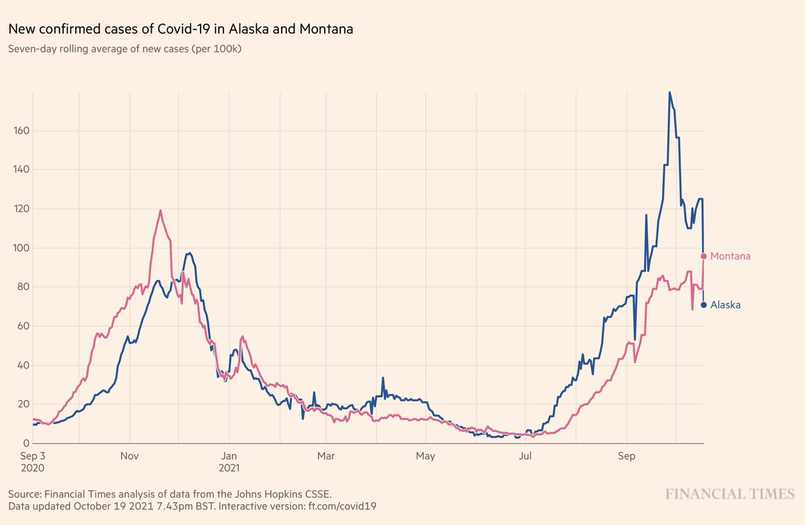</img></a>

---

<a href="https://twitter.com/erictopol/status/1450581092344365060" target="_blank" rel="noreferer">21:54 UCT</a>

In the annals of speculation, the claim that monoclonal antibodies would have saved Colin Powell's life, from a company that makes them
https://www.ft.com/content/a65136a1-90c5-4488-a63b-f8d50fd20e2d @kiranstacey @JamieSmythF 
Reminder: a substantial minority of patients in the mAb clinical trials failed to respond 

<a href="FCF-aHdVUAATXUW.jpg"  >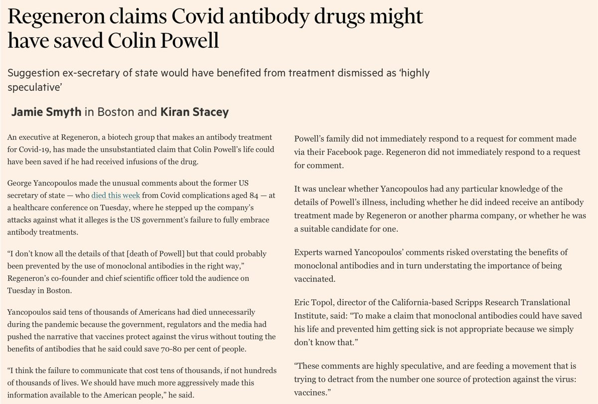</img></a>

---

<a href="https://twitter.com/erictopol/status/1450589101544009729" target="_blank" rel="noreferer">22:26 UCT</a>

@JeremyFarrar Many lessons, warnings (will any be heeded?), as we face the likelihood of replicating the UK experience as an early vaxx mover country, plenty of waning, little to no mitigation, woefully inadequate vaccination &amp; here, etc

