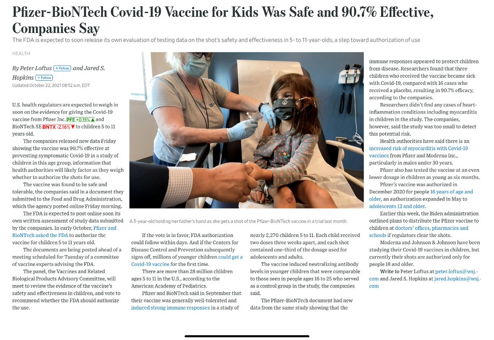
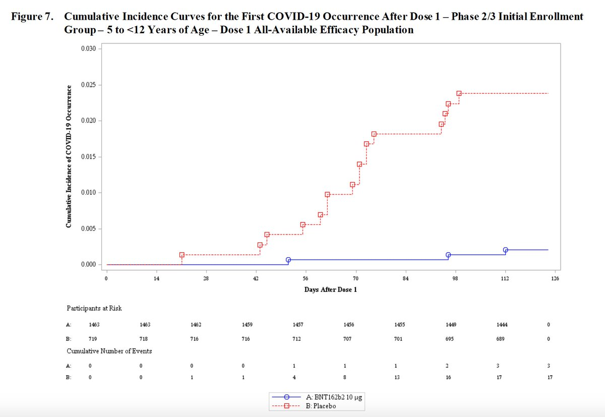
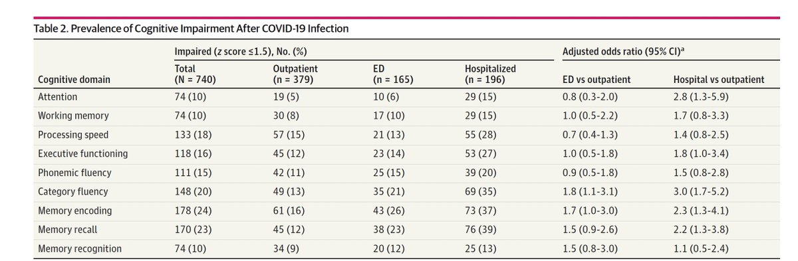
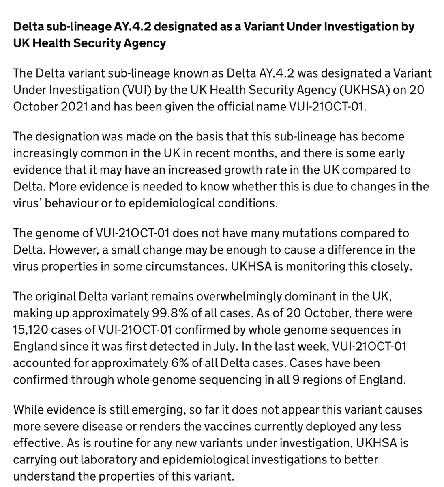
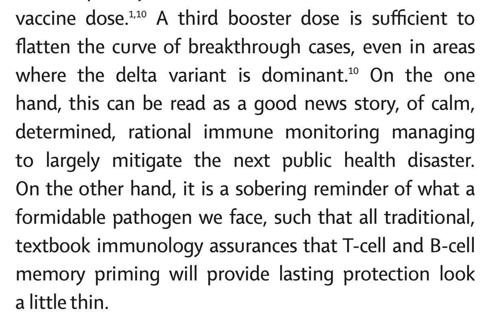

+++
title = "Tweets by Eric Topol Oct 22"
Summary = ""
tags = ["Twitter"]
category = "Twitter"
+++

---

<a href="https://twitter.com/erictopol/status/1451384089894789127" target="_blank" rel="noreferer">03:05 UCT</a>

RT @leonidkruglyak: @EricTopol That’s 95.6% effective as compared to two doses + placebo! 🤯

---

<a href="https://twitter.com/erictopol/status/1451550539200696320" target="_blank" rel="noreferer">14:06 UCT</a>

In over 2200 children ages 5-11, a placebo-controlled trial of a dose of 10 μg, 1/3 of adults, showed 90.7% efficacy of Pfizer's vaccine (3 cases in vaccine, 16 in placebo)
https://www.wsj.com/articles/fda-review-of-pfizer-covid-19-vaccine-for-kids-expected-11634900401?st=3bpmcxcvlr1xchn&reflink=desktopwebshare_twitter @loftus @JaredSHopkins 

<a href="FCTw4-SUUAwU_SA.jpg"  ></img></a>

---

<a href="https://twitter.com/erictopol/status/1451558477243973635" target="_blank" rel="noreferer">14:38 UCT</a>

Here's the event curve from the FDA briefing documents 
https://www.fda.gov/media/153409/download 

<a href="FCT4bz3UUAslAcT.jpg"  ></img></a>

---

<a href="https://twitter.com/erictopol/status/1451569056209723395" target="_blank" rel="noreferer">15:20 UCT</a>

An assessment of Covid's impact on cognitive function in 740 individuals finds "a relatively high frequency of cognitive impairment several months after patients contracted COVID-19"
https://jamanetwork.com/journals/jamanetworkopen/fullarticle/2785388 @JAMANetworkOpen 

<a href="FCUB6rgVgAAkMuq.jpg"  ></img></a>

---

<a href="https://twitter.com/erictopol/status/1451571948408868865" target="_blank" rel="noreferer">15:31 UCT</a>

The latest from the UK on AY.4.2 ("Delta plus"), 6% of cases in past week, designated a variant under investigation (which is below variant of interest or concern categories)
https://www.gov.uk/government/news/covid-19-variants-identified-in-the-uk 

<a href="FCUEU9SUcAIC2cB.png"  ></img></a>

---

<a href="https://twitter.com/erictopol/status/1451573438196305920" target="_blank" rel="noreferer">15:37 UCT</a>

After almost 2 years of Covid, the overwhelming fixation on hospitalizations and deaths as the only important outcomes for getting infected is untenable.
Deliberately ignoring #LongCovid and its functional impairment will not make it go away.

---

<a href="https://twitter.com/erictopol/status/1451582304153866242" target="_blank" rel="noreferer">16:12 UCT</a>

From the commentary on this review
https://www.thelancet.com/action/showPdf?pii=S2213-2600%2821%2900458-6 

<a href="FCUOUmFVIAE6H5U.png"  ></img></a>

---

<a href="https://twitter.com/erictopol/status/1451593635816869888" target="_blank" rel="noreferer">16:57 UCT</a>

A prospective study before vaccination shows frontline and essential workers have a higher risk of Covid infections than health care personnel (yet they are far less vaccinated)
https://jamanetwork.com/journals/jama-health-forum/fullarticle/2785400 @JAMAHealthForum

