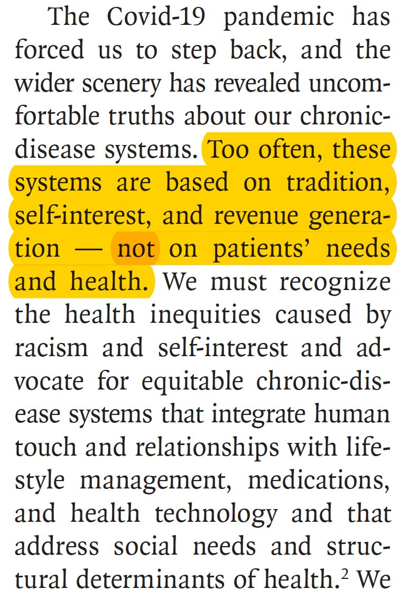
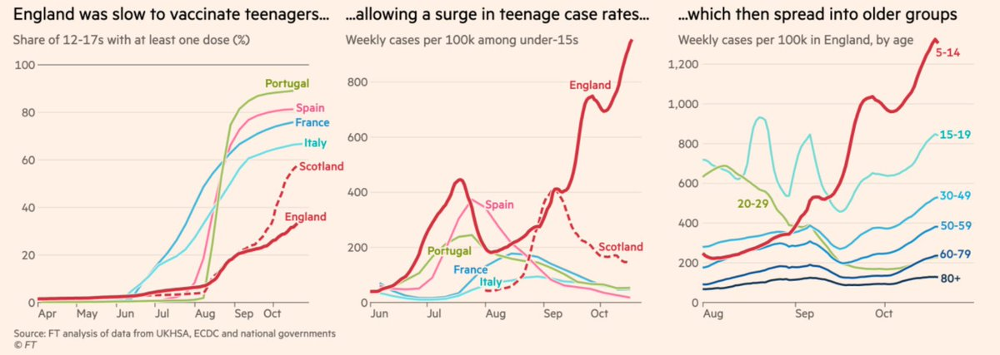
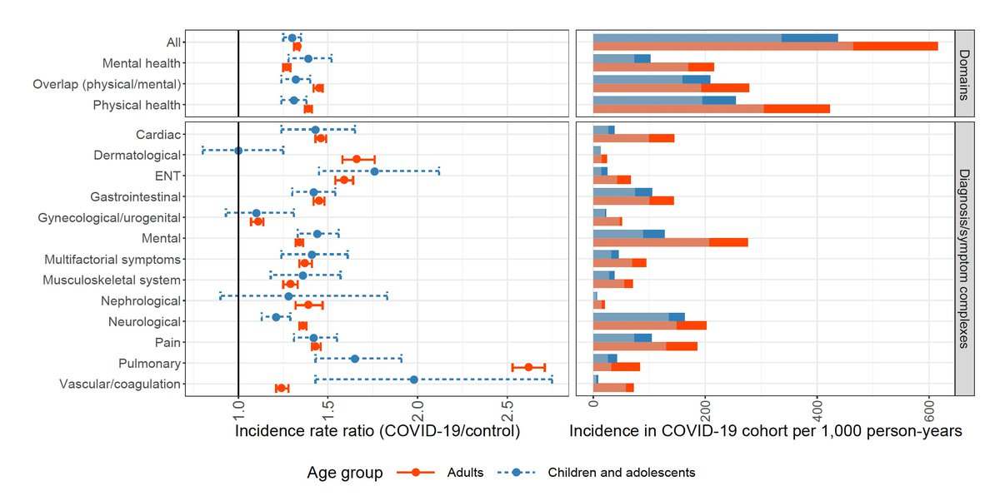

+++
title = "Tweets by Eric Topol Oct 23"
Summary = ""
tags = ["Twitter"]
category = "Twitter"
+++

---

<a href="https://twitter.com/erictopol/status/1451746378103738368" target="_blank" rel="noreferer">03:04 UCT</a>

RT @tuuliel: This is the best news we've had in a while. 3rd dose is our next weapon against this virus, and it's a great one 🤺 . It will h…

---

<a href="https://twitter.com/erictopol/status/1451913278871932929" target="_blank" rel="noreferer">14:07 UCT</a>

Just out @NEJM 
"Uncomfortable Truths — What Covid-19 Has Revealed about Chronic-Disease Care in America"
and what to do about it
https://www.nejm.org/doi/full/10.1056/NEJMp2112063?query=WB&cid=NEJM%20Weekend%20Briefing,%20October%2023,%202021%20DM401431_NEJM_Subscriber&bid=682395402 by @MarshallChinMD @UChicago 

<a href="FCY7ZtQVQAAsg7D.jpg"  ></img></a>

---

<a href="https://twitter.com/erictopol/status/1451916283138621449" target="_blank" rel="noreferer">14:19 UCT</a>

What happens when teens are not vaccinated
https://www.ft.com/content/1f57838a-24d2-40d5-b314-2d8345a6e001 

<a href="FCY-FA5UYAIJM4s.jpg"  ></img></a>

---

<a href="https://twitter.com/erictopol/status/1451926435409530886" target="_blank" rel="noreferer">15:00 UCT</a>

Features of #LongCovid among &gt;157,000 adults and children with Covid infections with matched controls
http://medrxiv.org/cgi/content/short/2021.10.21.21265133 Lower absolute incidence in children and teens but impact statistically significant across all age groups 

<a href="FCZGgfsVcAQzVe4.jpg"  ></img></a>