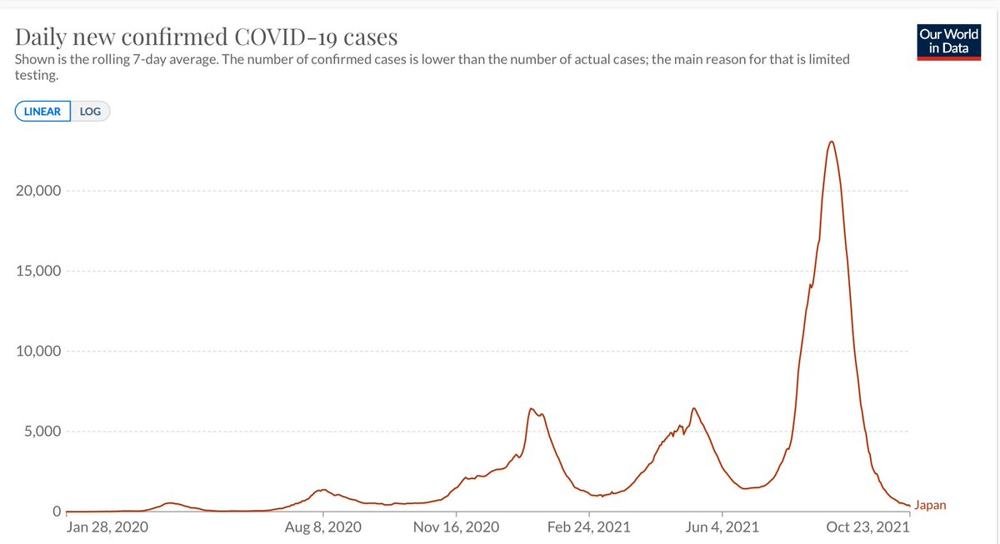
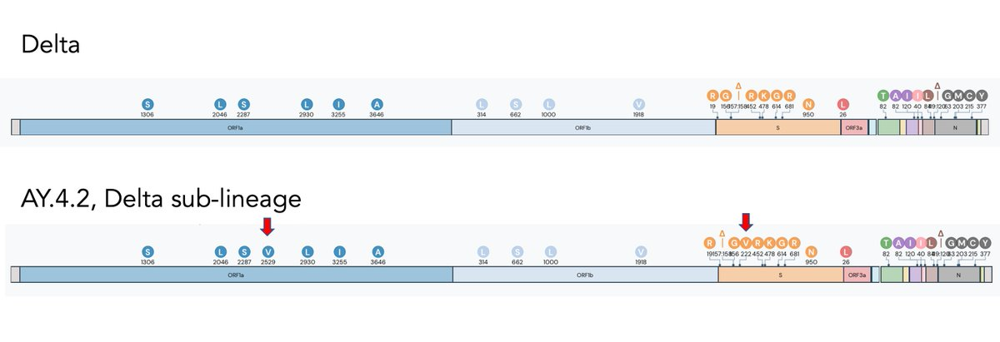

+++
title = "Tweets by Eric Topol Oct 24"
Summary = ""
tags = ["Twitter"]
category = "Twitter"
+++

---

<a href="https://twitter.com/erictopol/status/1452308678430924812" target="_blank" rel="noreferer">16:19 UCT</a>

Japan fully contained after its worst surge related to Delta, 💉 quickly rose to now 78% of total population w/ ≥ 1 dose, test positivity went from 25% to 1%, cases &gt;23,000 to &lt;400. 
Everything is open, no restrictions except use of masks. The mood is celebratory
It can be done. 

<a href="FCeh2dRXsBQzgIH.jpg"  ></img></a>

---

<a href="https://twitter.com/erictopol/status/1452331681889804293" target="_blank" rel="noreferer">17:50 UCT</a>

The Delta variant sub-lineage AY.4.2, also known as "Delta plus," has aroused concern with its sequence found in ~10% of recent UK cases. Here are the mutation maps of both, notable for minimal difference at 2 sites (red arrows)
http://outbreak.info 

<a href="FCe3cucWYAsma5e.jpg"  ></img></a>