+++
title = "Tweets by Eric Topol Oct 25"
Summary = ""
tags = ["Twitter"]
category = "Twitter"
+++

---

<a href="https://twitter.com/erictopol/status/1452462144134414337" target="_blank" rel="noreferer">02:28 UCT</a>

Can digital technologies improve health?
A new 50-page report commissioned by @TheLancet and @FT, with particular attention to reducing inequities 
https://www.thelancet.com/commissions/governing-health-futures-2030 

<a href="FCgtsrKVIAUN5SB.jpg"  >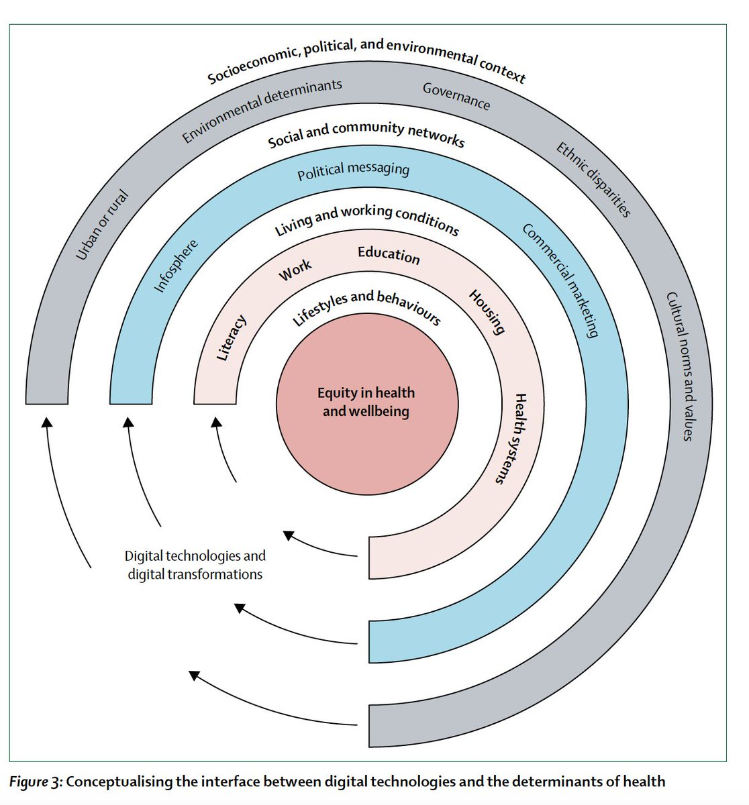</img></a><a href="FCgtuktVEAAPNil.jpg"  >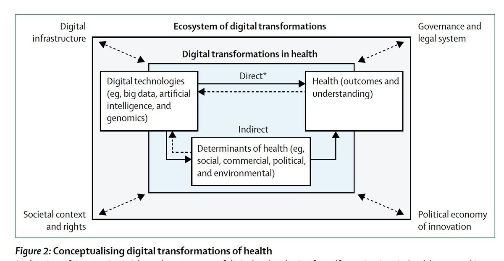</img></a><a href="FCgtwHfUcAEGBkt.jpg"  >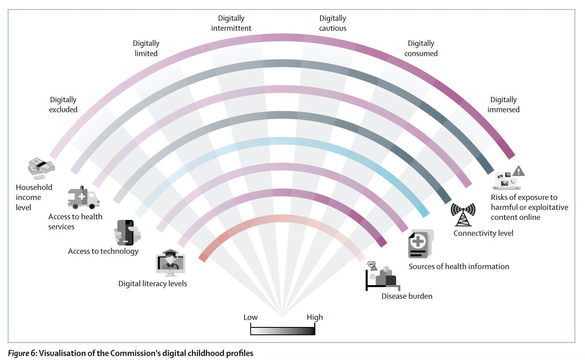</img></a><a href="FCgukZPVcAUGO75.jpg"  >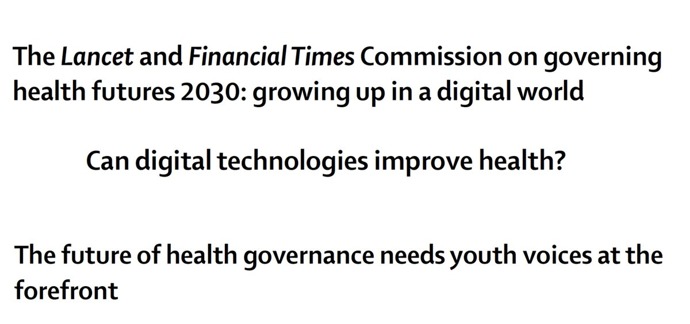</img></a>

---

<a href="https://twitter.com/erictopol/status/1452628882322952192" target="_blank" rel="noreferer">13:31 UCT</a>

Human devolution :-)
by @stephanpastis 

<a href="FCjGNMgVgAEerHz.jpg"  >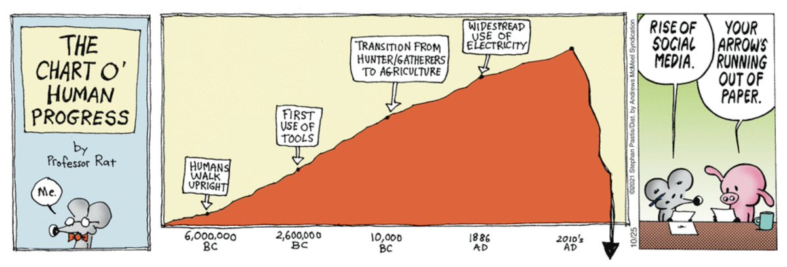</img></a>

---

<a href="https://twitter.com/erictopol/status/1452652288678322179" target="_blank" rel="noreferer">15:04 UCT</a>

Pockets of very high vulnerability
In San Diego County (2nd largest in California) there are many spots with very low vaccination rates @sdut @sdutgraphics, representative of across the US 

<a href="FCjJsv4VEAk4d7q.jpg"  >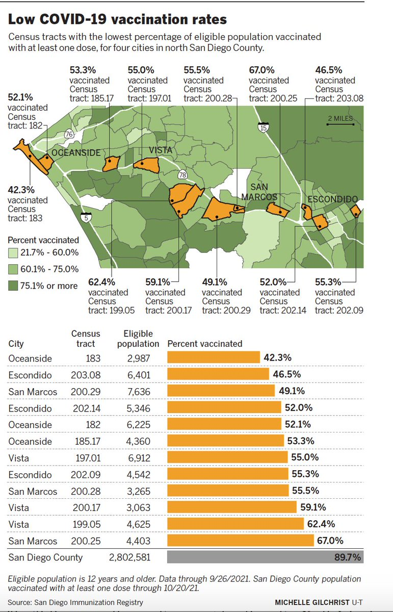</img></a>

---

<a href="https://twitter.com/erictopol/status/1452656784749907970" target="_blank" rel="noreferer">15:22 UCT</a>

Just published @Nature 
Covid community transmission was occurring in Europe and the US in January 2020 and only 1-3% of cases were getting detected in March; international travel a key driver
https://www.nature.com/articles/s41586-021-04130-w
@jessicadavis_ @alexvespi @NUnetsi 

<a href="FCjeSVJVgAAW6bx.jpg"  >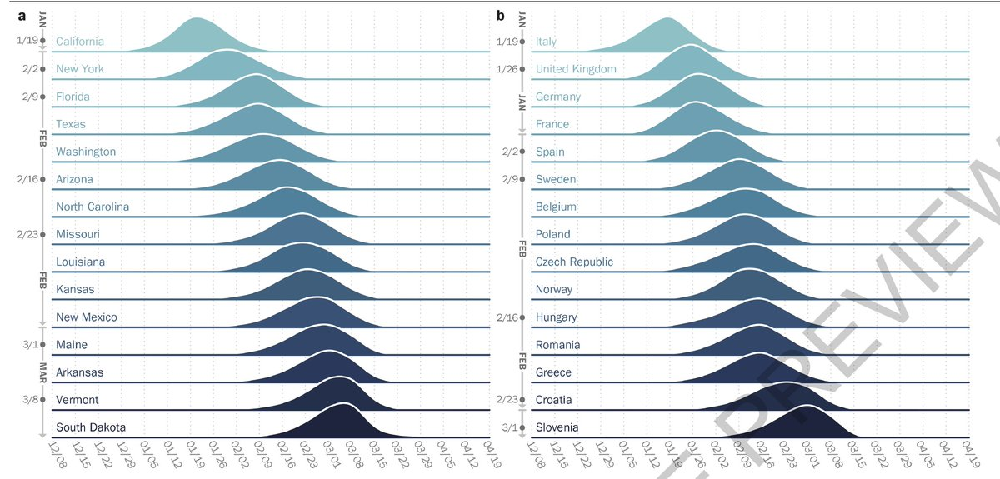</img></a>

---

<a href="https://twitter.com/erictopol/status/1452662324691542019" target="_blank" rel="noreferer">15:44 UCT</a>

One year after mRNA (Moderna) vaccination, memory B cells kick in to protect against Covid pneumonia, but there is a brief delay that sets up the opportunity for lung disease to occur. Delta challenge in the macaque model
https://www.biorxiv.org/content/10.1101/2021.10.23.465542v1 by @Matthew_Gagne_ and colleagues

---

<a href="https://twitter.com/erictopol/status/1452665945877463046" target="_blank" rel="noreferer">15:58 UCT</a>

A case series of 3 teens with recent Covid who presented and were hospitalized with neuropsychiatric symptoms and found to have #SARSCoV2 antibodies in their cerebrospinal fluid
https://jamanetwork.com/journals/jamaneurology/fullarticle/2785032 @JAMANeuro by @CMBartley and colleagues
@UCSFChildrens @UCSFMedicine 

<a href="FCjntrhUUAEURgf.jpg"  >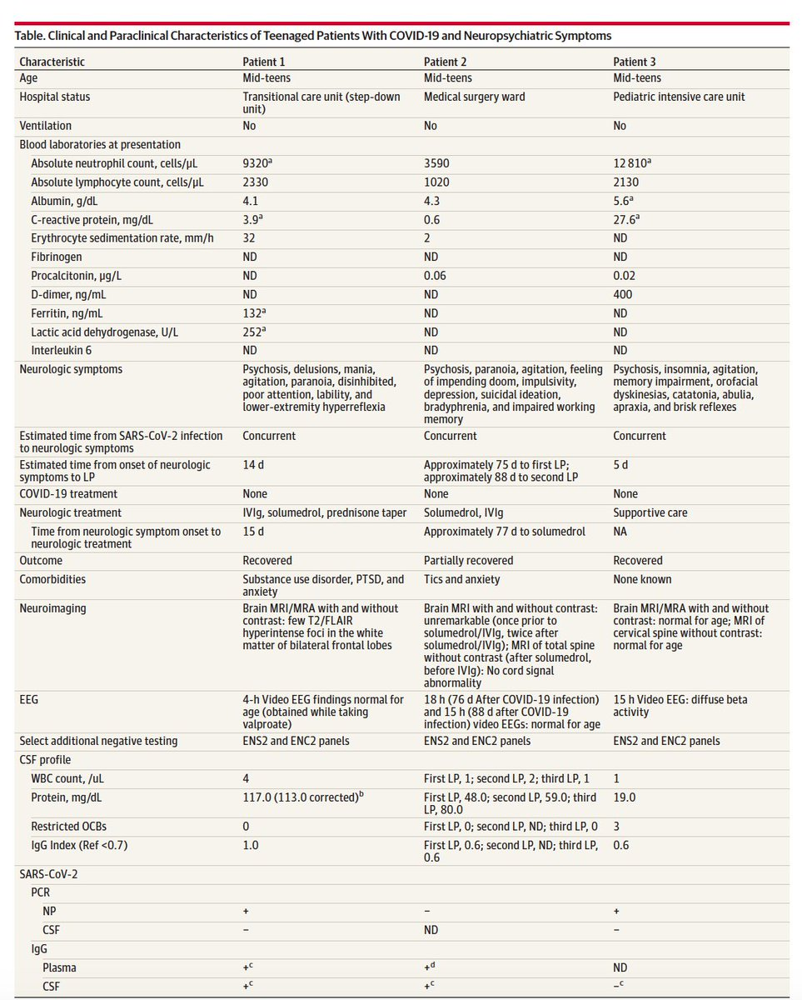</img></a>

---

<a href="https://twitter.com/erictopol/status/1452715493651988480" target="_blank" rel="noreferer">19:15 UCT</a>

"Mask-wearing at the heart of the great British Covid divide"
Sounds familiar.
https://www.ft.com/content/b25d1ac3-b35e-453c-918e-731e2f214131 @FT 

<a href="FCkU0r6VgAAaeJx.jpg"  >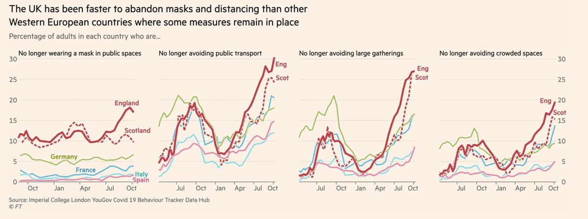</img></a>

---

<a href="https://twitter.com/erictopol/status/1452749379001933824" target="_blank" rel="noreferer">21:30 UCT</a>

mRNA vaccines beyond Covid: potential path for protection from Zika, Rabies, Malaria, Ebola, HIV and more
https://www.chemistryworld.com/features/mrna-vaccines-for-covid-and-beyond/4014420.article by @Clare_Sansom

---

<a href="https://twitter.com/erictopol/status/1452760330736525315" target="_blank" rel="noreferer">22:13 UCT</a>

Clearance of #SARSCoV2 for post-vaccination Covid in health care workers who were symptomatic was 11 days (mean) compared to those without symptoms of only 1 day
https://www.acpjournals.org/doi/10.7326/M21-3486 @AnnalsofIM 

<a href="FCk9AILVcAEg35l.jpg"  >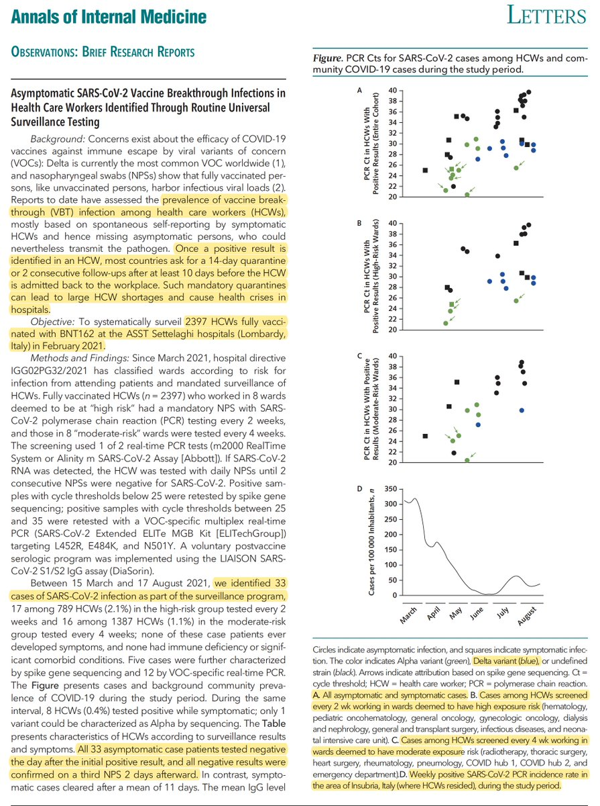</img></a><a href="FCk9WmhVQAAwT52.jpg"  >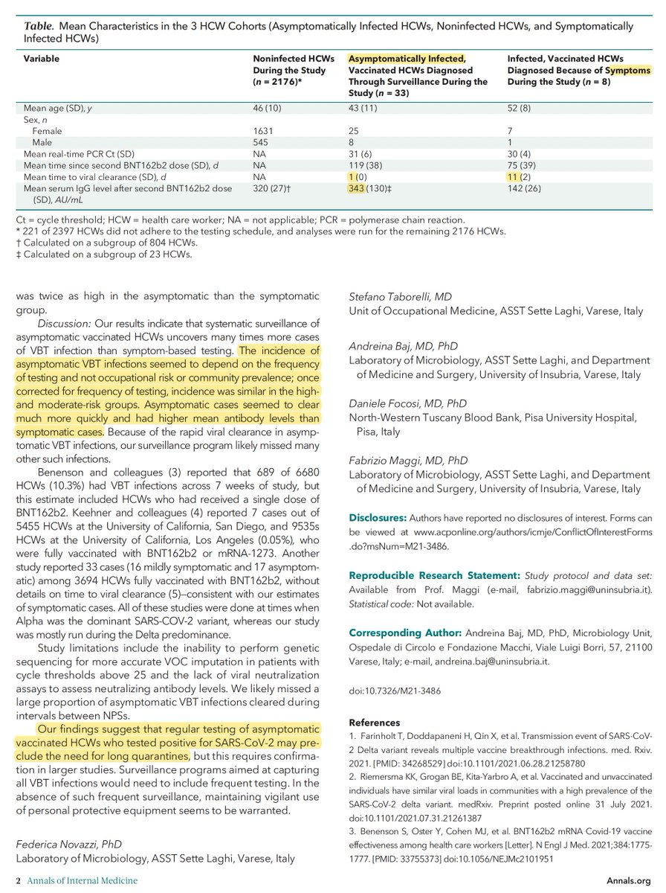</img></a>

---

<a href="https://twitter.com/erictopol/status/1452771490445758467" target="_blank" rel="noreferer">22:58 UCT</a>

@KizzyPhD @Matthew_Gagne_ I wish. You’re funny. Congrats to both of you for this important work that helps to explain so much and could never have been performed in people 🙏

