+++
title = "Tweets by Eric Topol Oct 26"
Summary = ""
tags = ["Twitter"]
category = "Twitter"
+++

---

<a href="https://twitter.com/erictopol/status/1452797405334687749" target="_blank" rel="noreferer">00:41 UCT</a>

That doesn't look good ;-)
https://www.newyorker.com/magazine/2021/11/01/how-patrick-soon-shiong-made-his-fortune-before-buying-the-la-times @NewYorker 

<a href="FCleSfoUUAQQqOr.png"  >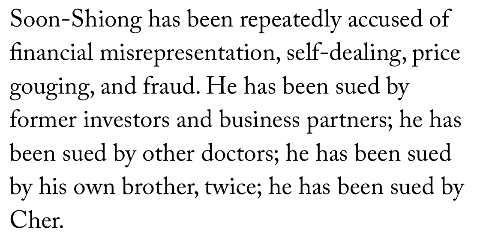</img></a>

---

<a href="https://twitter.com/erictopol/status/1452838410746400769" target="_blank" rel="noreferer">03:24 UCT</a>

The last time US hospitalizations were down to ~50,000 was in July. Progress 👍 

<a href="FCmEwS5VUAoLrCC.jpg"  >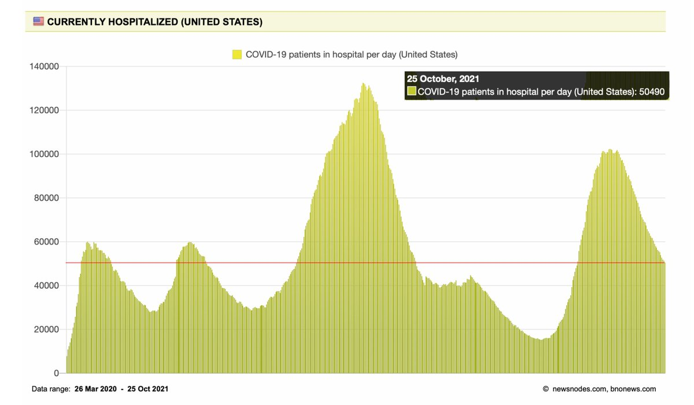</img></a>

---

<a href="https://twitter.com/erictopol/status/1452844173258752004" target="_blank" rel="noreferer">03:46 UCT</a>

Federal advisors on boosters who think there isn't adequate evidence and "the decision would be viewed by anxious Americans who might conclude mistakenly that the vaccines are ineffective"
https://www.nytimes.com/2021/10/25/health/covid-boosters-cdc-fda.html
The evidence is clearcut. And the vaccines are remarkably effective 

<a href="FCmJkqFVIAEjqsI.jpg"  ></img></a>

---

<a href="https://twitter.com/erictopol/status/1453002389989077009" target="_blank" rel="noreferer">14:15 UCT</a>

The evidence from a 10,000 person randomized trial across all age groups
https://twitter.com/erictopol/status/1451170313492852740
As if people who are vaccinated can't handle 2 messages and "anxious Americans" wouldn't get even more anxious if they had a serious breakthrough infection 

<a href="FCoZA5OXIBgdcHB.jpg"  >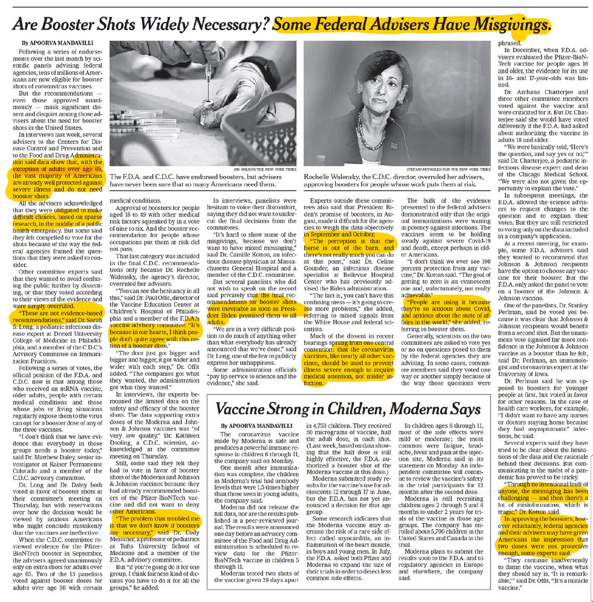</img></a>

---

<a href="https://twitter.com/erictopol/status/1453006743974334490" target="_blank" rel="noreferer">14:32 UCT</a>

Just published @ScienceTM 
Why do certain young, healthy people get severe Covid?
An exhaustive, deep search identifies potential genes/pathways to explain, including ADAM9
https://www.science.org/doi/10.1126/scitranslmed.abj7521 #AI @RaphaelCarapito and colleagues 

<a href="FCoctTzXEAcQz46.jpg"  >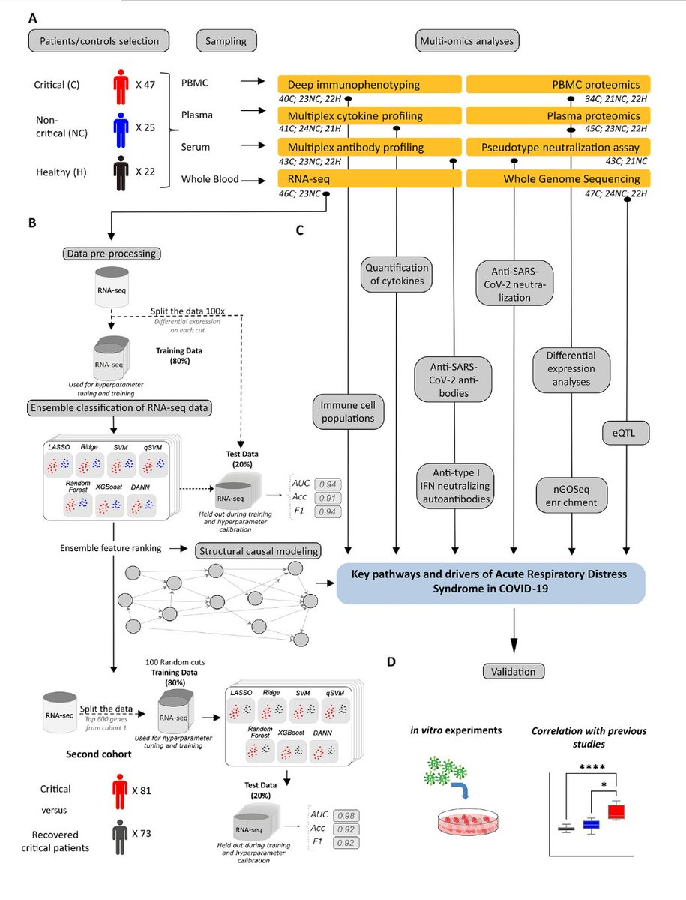</img></a>

---

<a href="https://twitter.com/erictopol/status/1453012289989214209" target="_blank" rel="noreferer">14:55 UCT</a>

The doctors, such as the World Doctors Alliance, who belong in the Hall of Shame, spreading false Covid conspiratorial information, propelled via @Facebook 
https://www.washingtonpost.com/politics/2021/10/20/meet-doctors-group-spreading-covid-conspiracy-theories-plain-sight-facebook/ @viaCristiano 

<a href="FCjO8LtVkAEc52v.jpg"  >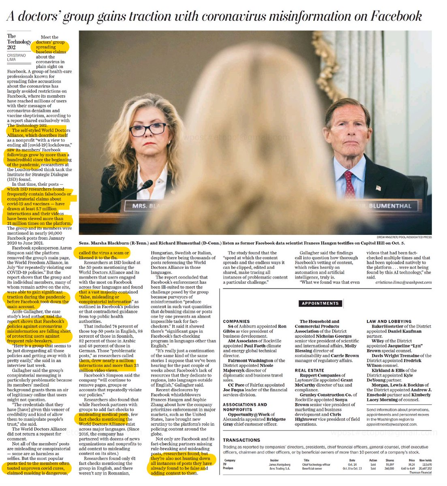</img></a>

---

<a href="https://twitter.com/erictopol/status/1453020018757623815" target="_blank" rel="noreferer">15:25 UCT</a>

Just out @ScienceMagazine 
Why is the Delta variant so hyper-contagious?
https://www.science.org/doi/10.1126/science.abl9463
For one, it gets into cells via membrane fusion more efficiently, faster, and at lower levels of its receptor;
insights via structural biology, cryo-EM 

<a href="FCopze2UcAASkHb.jpg"  >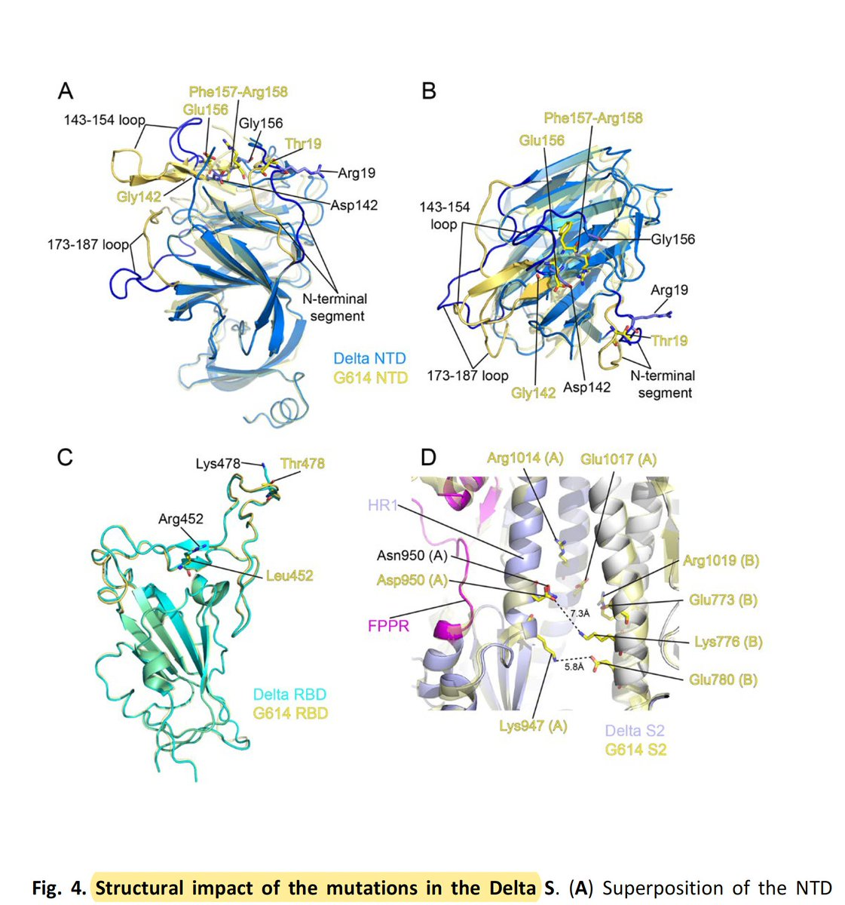</img></a>

---

<a href="https://twitter.com/erictopol/status/1453024521628241928" target="_blank" rel="noreferer">15:43 UCT</a>

Young children, age 5/6-11, and vaccination dose of mRNA
Pfizer used 10 μg in their trial of 2,270 children w/ 90.7% efficacy vs symptomatic infections
Moderna used 50 μg in their trial of 4,753 children
Wondering about this 5X mRNA dose; both trials small for v rare side effects 

<a href="FCosN8UVkAcAU2E.jpg"  >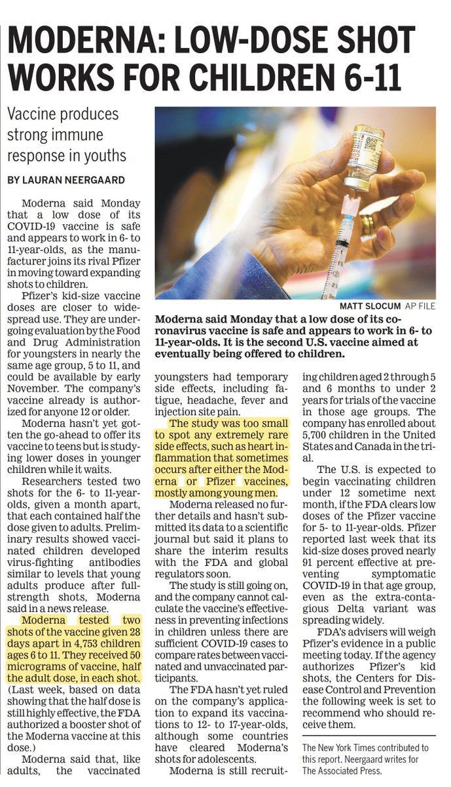</img></a><a href="FCosgEdVIAIKAXt.jpg"  ></img></a>

---

<a href="https://twitter.com/erictopol/status/1453043708945780741" target="_blank" rel="noreferer">16:59 UCT</a>

Another issue:
We have learned that vaccine dose spacing 8-12 weeks induces a better immune response than short (3-4 week spacing). Why hasn't this been incorporated in the new trials and roll out?

---

<a href="https://twitter.com/erictopol/status/1453047896685768705" target="_blank" rel="noreferer">17:16 UCT</a>

The event curve for symptomatic infections in the age 5-11 Pfizer trial presented at FDA today (2 doses given, 3 weeks apart)
https://www.fda.gov/media/153513/download 

<a href="FCpDSV-VcAgvPR1.jpg"  >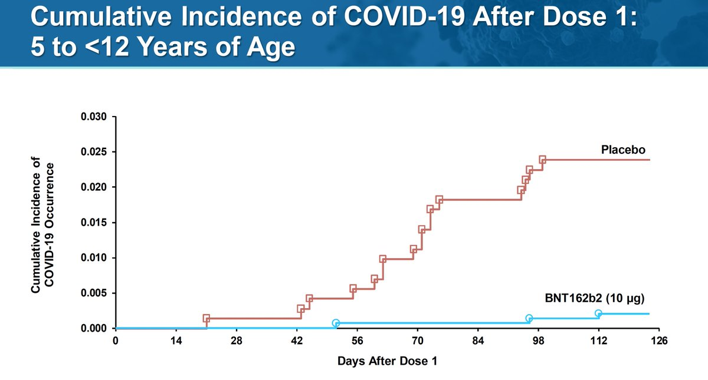</img></a>

---

<a href="https://twitter.com/erictopol/status/1453071114788167681" target="_blank" rel="noreferer">18:48 UCT</a>

As the world turns...
Only 1 continent is currently on the rise with Covid: Europe @OurWorldInData 
England's cases are in decline 👍
https://www.ft.com/content/40b15836-a668-4750-99b6-6183425411c2
But Central and Eastern Europe are soaring
https://www.ft.com/content/06b30dfb-998e-443f-a2bd-41f0b2ca4ab9 

<a href="FCpYc9BUUAEuWqj.jpg"  >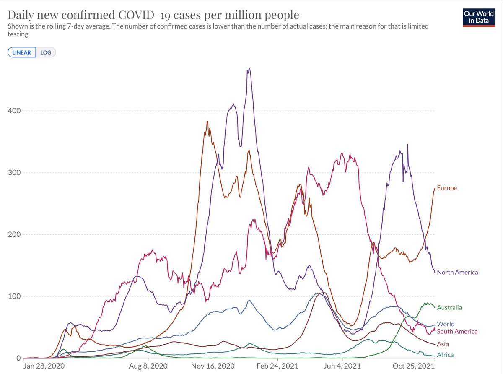</img></a><a href="FCpYNZdVgAM_ABa.jpg"  >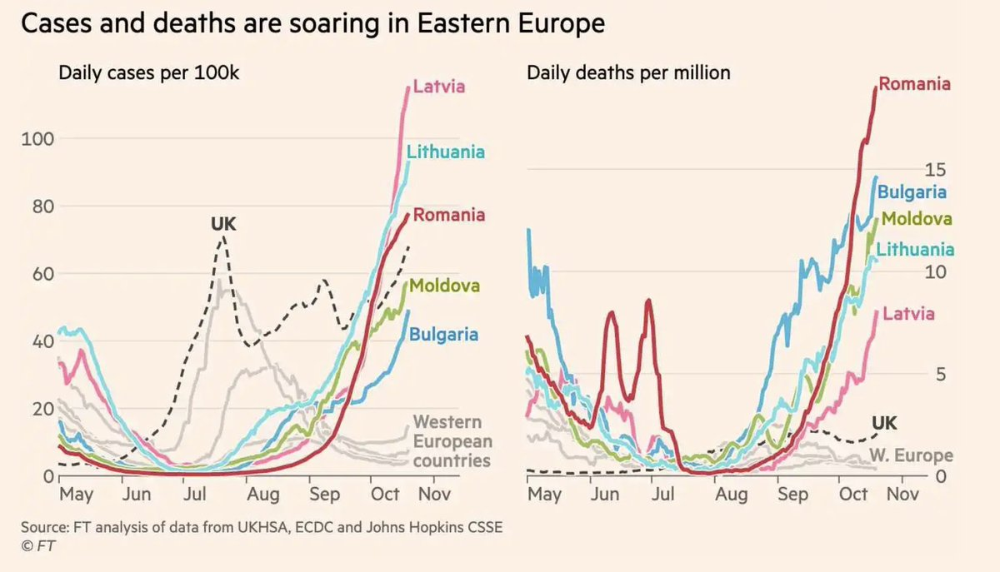</img></a><a href="FCpYO21VgAEHqKK.jpg"  >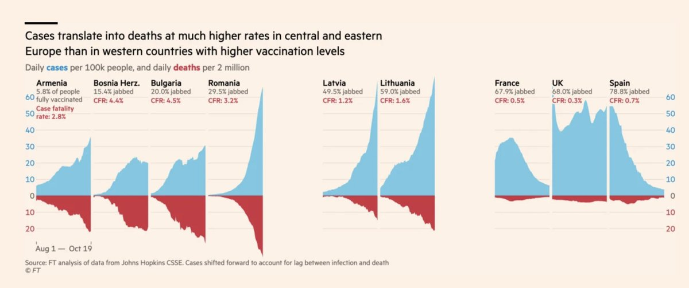</img></a>

---

<a href="https://twitter.com/erictopol/status/1453097949156630529" target="_blank" rel="noreferer">20:35 UCT</a>

Just in: Vote of the advisory panel 17-0 in favor of approval of Pfizer vaccine for ages 5-11

---

<a href="https://twitter.com/erictopol/status/1453121950893555712" target="_blank" rel="noreferer">22:10 UCT</a>

The 2 extremes of the US pandemic are not on its Mainland: Alaska and Puerto Rico
Alaska: back up to 140 cases/100,000 people, 31 hospitalizations/100K, 52% vaccinated 
Highest case/capita of any country or state in the world

Puerto Rico: 3 hospitalizations/100K, 69% vaccinated 

<a href="FCqGlByUcAU5uD5.jpg"  >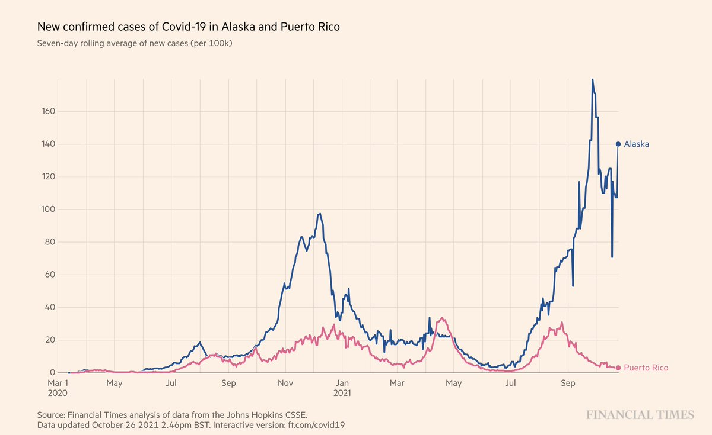</img></a><a href="FCqFJCcUYAM1vZN.jpg"  >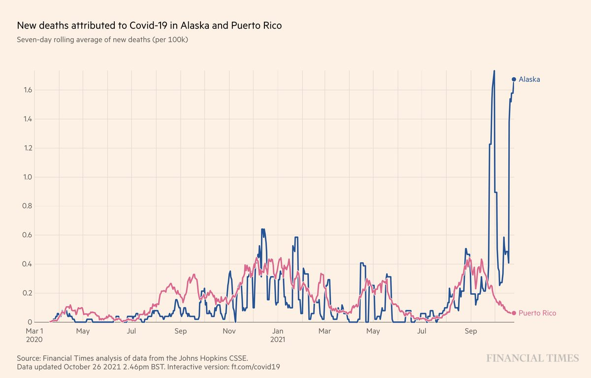</img></a>

---

<a href="https://twitter.com/erictopol/status/1453124039141036032" target="_blank" rel="noreferer">22:19 UCT</a>

What happens to the Ivermectin story when you take out fraud and high risk of bias (ROB)?
https://www.researchsquare.com/article/rs-1003006/v1 

<a href="FCqIlEHUYAM8mvw.jpg"  >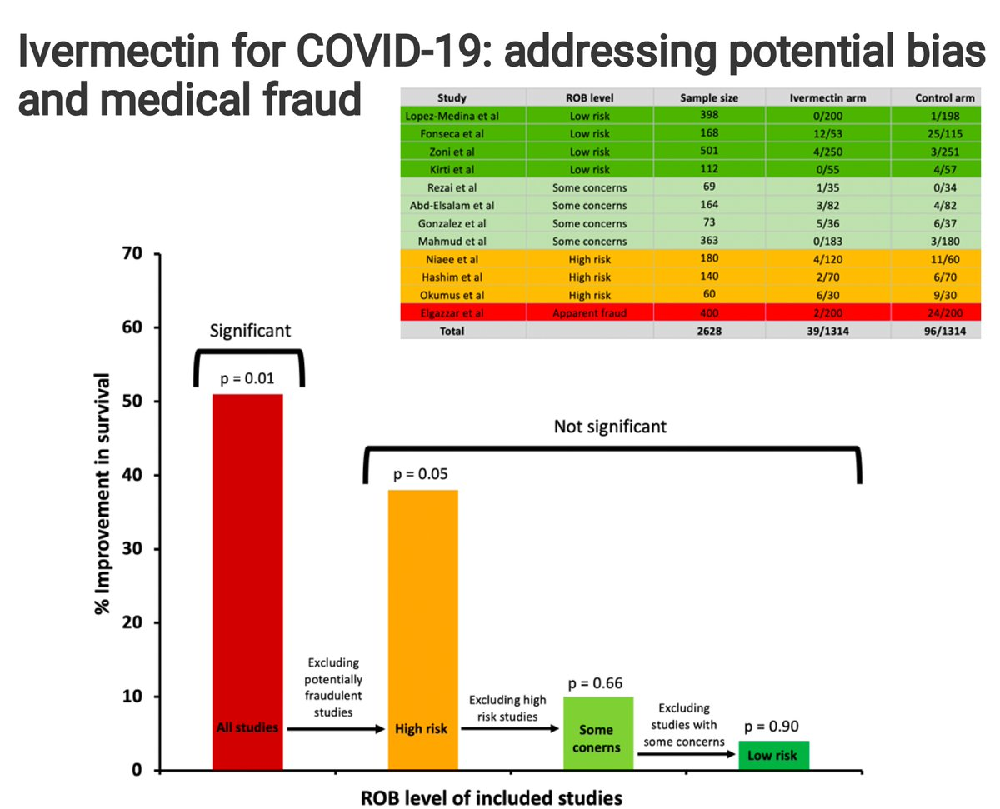</img></a>