+++
title = "Tweets by Eric Topol Oct 27"
Summary = ""
tags = ["Twitter"]
category = "Twitter"
+++

---

<a href="https://twitter.com/erictopol/status/1453153076165021696" target="_blank" rel="noreferer">00:14 UCT</a>

'The benefit of a third [booster] dose in reducing transmission is sizeable and increases with vaccine coverage and contact rates among individuals."
https://www.medrxiv.org/content/10.1101/2021.10.25.21265500v1 by @billy_gardner_ and @DiseaseEcology 

<a href="FCqihsfUYAMSLLl.jpg"  >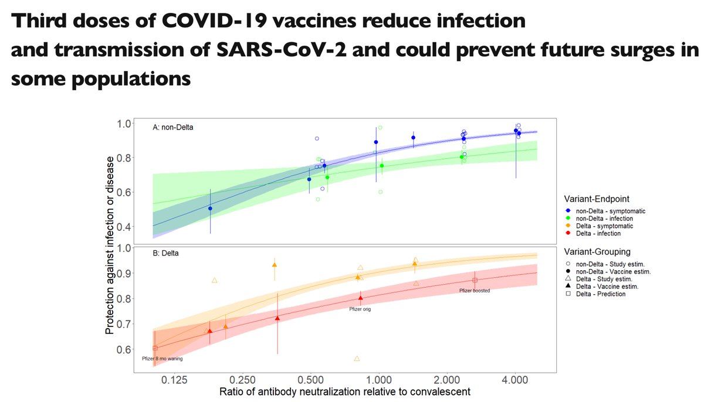</img></a>

---

<a href="https://twitter.com/erictopol/status/1453197380665241601" target="_blank" rel="noreferer">03:10 UCT</a>

Not quite, but soon :-) 

<a href="FCrLSCUVgAcdp3m.jpg"  >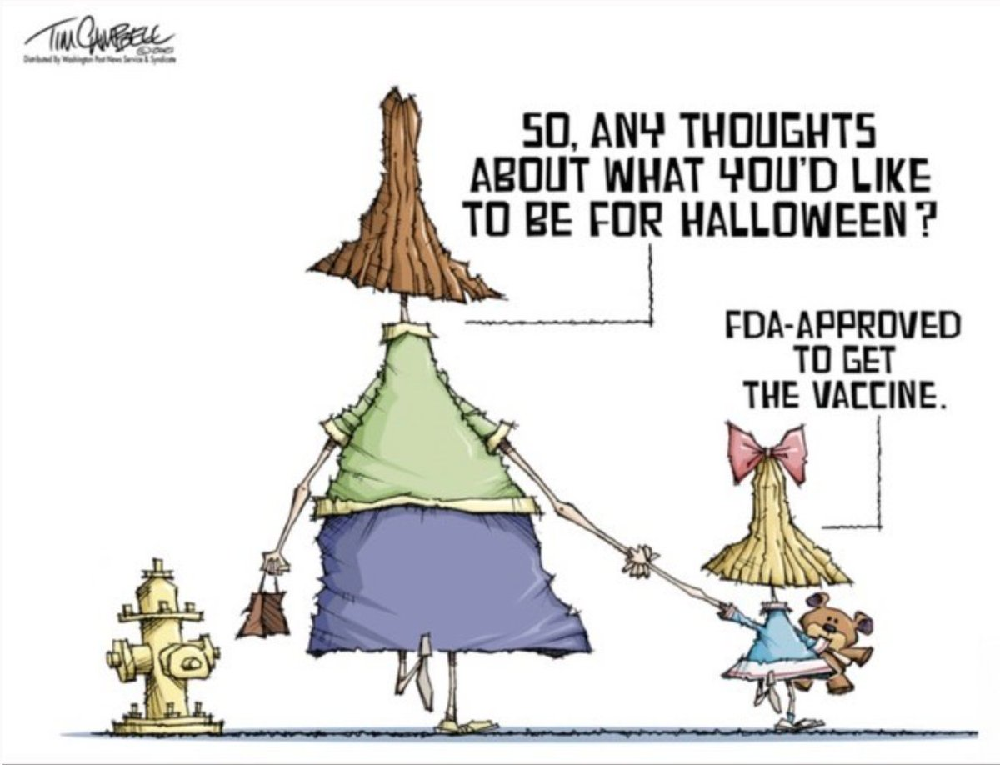</img></a>

---

<a href="https://twitter.com/erictopol/status/1453203245057208329" target="_blank" rel="noreferer">03:33 UCT</a>

RT @EricTopol: Young children, age 5/6-11, and vaccination dose of mRNA
Pfizer used 10 μg in their trial of 2,270 children w/ 90.7% efficac…

---

<a href="https://twitter.com/erictopol/status/1453366353709002759" target="_blank" rel="noreferer">14:21 UCT</a>

Natural killer (NK) cells and our defense vs Covid
Their levels are correlated with rapid decline in viral load at the the beginning of an infection, not observed for B and T cells; dysfunctional NKs found with severe Covid
https://www.nature.com/articles/d41586-021-02778-y @NatureNV

---

<a href="https://twitter.com/erictopol/status/1453369956951674889" target="_blank" rel="noreferer">14:36 UCT</a>

It there's not a worse than Delta to come, the US pandemic may go down as 4 waves
With the 4th one resembling the 3rd, taking months to get down to a low case burden 

<a href="FCtniuDVIAAGN-q.jpg"  >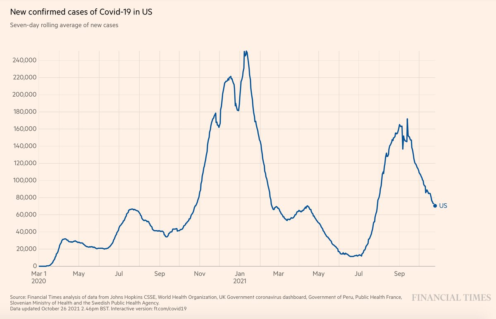</img></a>

---

<a href="https://twitter.com/erictopol/status/1453388094099443712" target="_blank" rel="noreferer">15:48 UCT</a>

Just published @NatureCancer 
2 reports on the immune response (antibody and T cell) to vaccination in 585 patients with cancer, indicating the challenge of variants and hematologic malignancies 
https://www.nature.com/articles/s43018-021-00275-9
https://www.nature.com/articles/s43018-021-00275-9 

<a href="FCt4UJSVcAcO75q.jpg"  >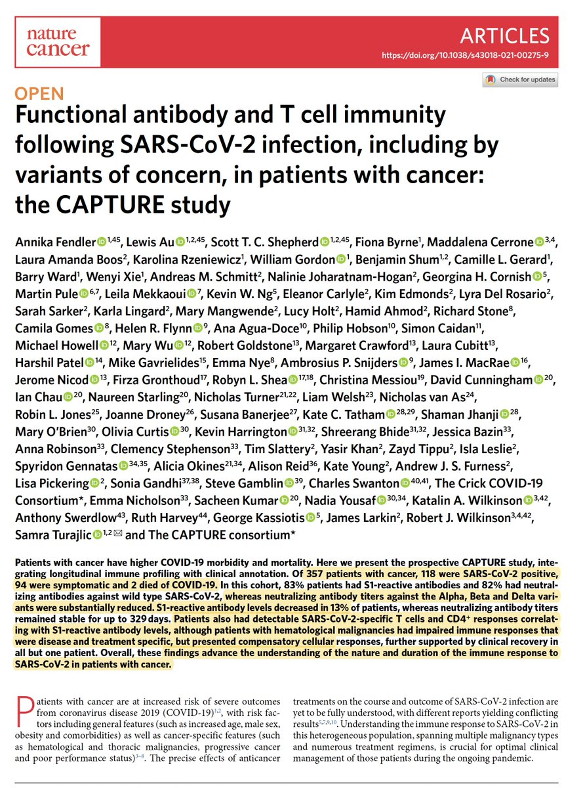</img></a><a href="FCt4WFHVEAMiuVa.jpg"  >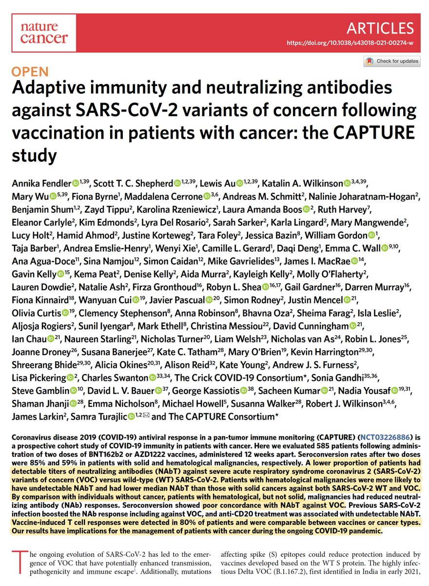</img></a>

---

<a href="https://twitter.com/erictopol/status/1453393548749926411" target="_blank" rel="noreferer">16:09 UCT</a>

2 new @NatureMedicine papers
First from half of US public school data
"Schools can open for in-person learning during the pandemic with minimal contribution to sustained community incidence of infections, provided other public safety measures are adopted."
https://www.nature.com/articles/s41591-021-01563-8 

<a href="FCt9EUrVUAMMdsn.jpg"  >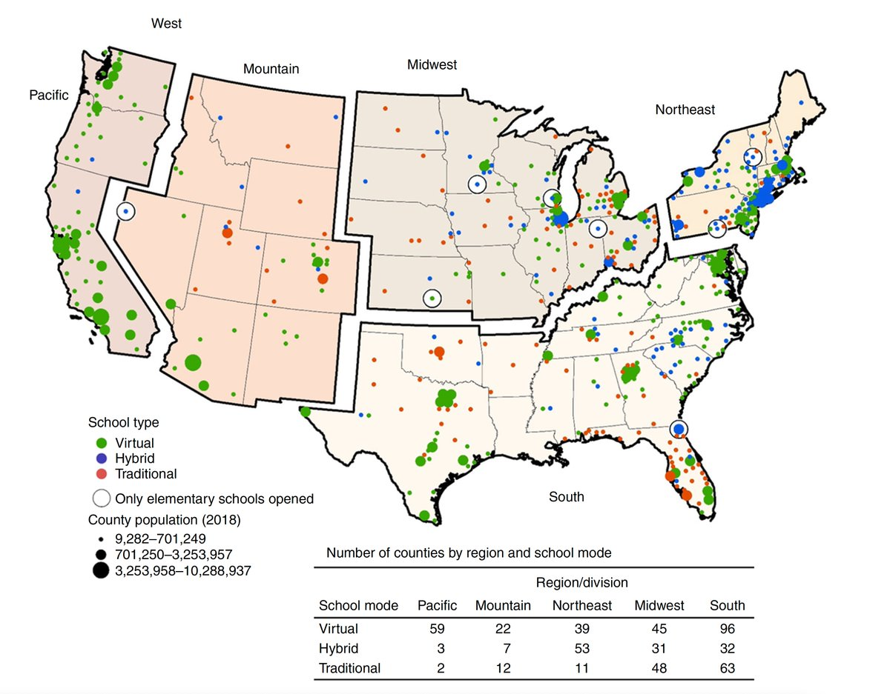</img></a>

---

<a href="https://twitter.com/erictopol/status/1453393556438065153" target="_blank" rel="noreferer">16:10 UCT</a>

2nd from Japan
"We do not find any evidence that school closures in Japan reduced the spread of COVID-19."
https://www.nature.com/articles/s41591-021-01571-8 

<a href="FCt9oy2VEAMKg7e.jpg"  >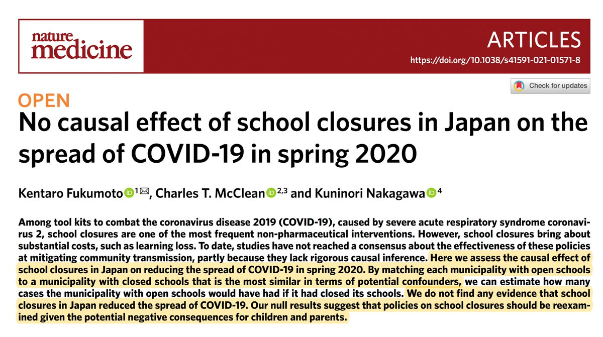</img></a>

---

<a href="https://twitter.com/erictopol/status/1453410073745641478" target="_blank" rel="noreferer">17:15 UCT</a>

@drninashapiro @Bob_Wachter As far as AY.4.2, I'm not concerned 
https://assets.publishing.service.gov.uk/government/uploads/system/uploads/attachment_data/file/1028113/Technical_Briefing_26.pdf 

<a href="FCuMuzWVcAgEs8K.png"  >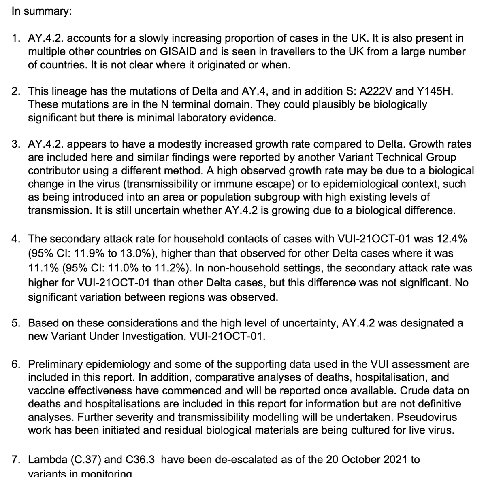</img></a>

---

<a href="https://twitter.com/erictopol/status/1453418397388050433" target="_blank" rel="noreferer">17:48 UCT</a>

Data for vaccination protecting from #LongCovid are mixed. A new study of &gt;10,000 breakthrough infections, with matched controls, followed to 6 months suggests lack of protection. Yet another reason to prevent them.
https://www.medrxiv.org/content/10.1101/2021.10.26.21265508v1

---

<a href="https://twitter.com/erictopol/status/1453421832032247809" target="_blank" rel="noreferer">18:02 UCT</a>

As US schools opened, kids hospital admissions "plunged". 
Counter to many predictions
https://www.bloomberg.com/news/articles/2021-10-26/pediatric-covid-hospital-visits-plunge-in-u-s-as-schools-reopen?utm_campaign=KHN%3A%20First%20Edition&utm_medium=email&_hsmi=175573134&_hsenc=p2ANqtz-_Uj6yMM087VcEHwpQnca8nGKHPGc-ZYwdS_pV_xAtlNq7y5L-hDkLVGAhVfdDbwRFtcg6dRfe3Bf3XcGjFvAWXGeTqTA&utm_content=175573134&utm_source=hs_email 

<a href="FCuWwkHVcAATCH3.jpg"  >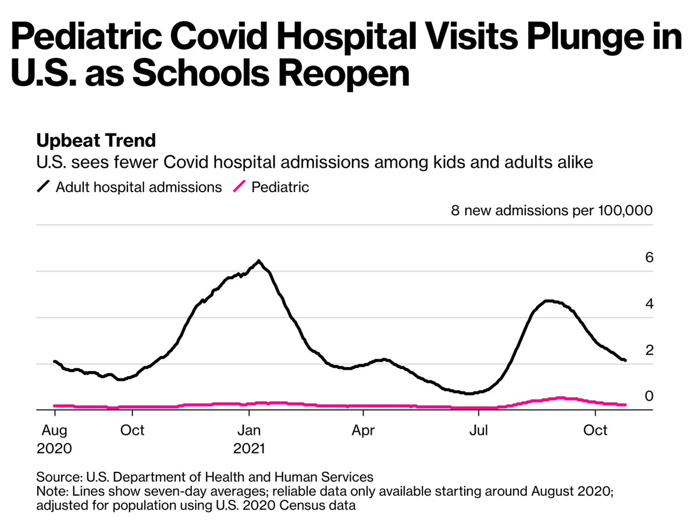</img></a>

---

<a href="https://twitter.com/erictopol/status/1453435345517760513" target="_blank" rel="noreferer">18:56 UCT</a>

How many #SARSCoV2 virions are needed to seed an infection from an infector to infectee (the viral transmission bottleneck size)?
1-3 
(not on the order of 1000 as previously published)
@ScienceTM by @KatiaKoelle and  @m_a_martin
https://www.science.org/doi/10.1126/scitranslmed.abh1803

---

<a href="https://twitter.com/erictopol/status/1453438080564686851" target="_blank" rel="noreferer">19:06 UCT</a>

The perception of invincibility to Covid is associated with lack of need for vaccination, not only for the individual (as would be expected), but also at the community level (survey data across 51 countries and over 218,000 people)
@PLOSONE https://journals.plos.org/plosone/article?id=10.1371/journal.pone.0258432

---

<a href="https://twitter.com/erictopol/status/1453466829263806465" target="_blank" rel="noreferer">21:01 UCT</a>

The waning of Covid vaccination immunity during the Delta wave in Israel, among 5.8 million people, published @NEJM today http://www.nejm.org/doi/full/10.1056/NEJMoa2114228
Protection vs severe Covid for age 60+ (1.3 million people) markedly reduced for those vaccinated 6 months earlier 

<a href="FCvALVkVUAYKhMf.jpg"  >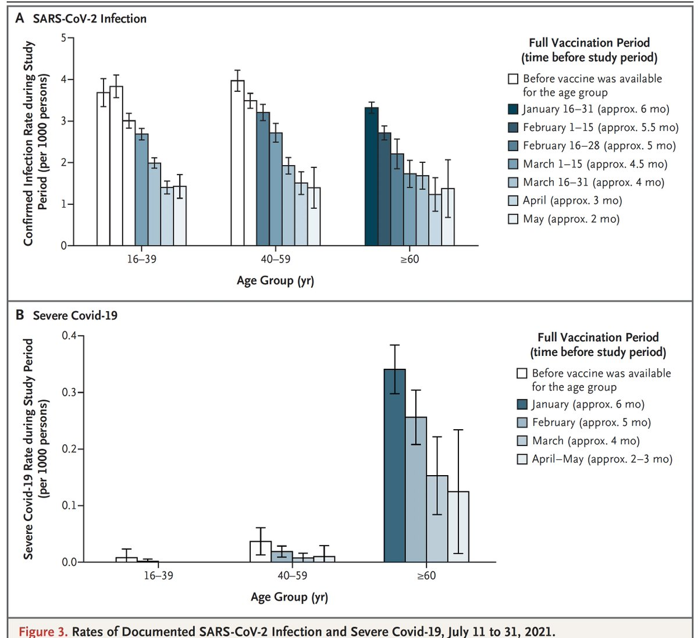</img></a>

---

<a href="https://twitter.com/erictopol/status/1453486657173213185" target="_blank" rel="noreferer">22:19 UCT</a>

Updated data by age and sex for myocarditis related to  Covid or mRNA vaccination in Israel, significantly higher for Covid-induced https://www.nejm.org/doi/full/10.1056/NEJMc2115045
@NEJM by @ClalitResearch @RanBalicer @noambard 

<a href="FCvRM8EVEAI3_Uu.jpg"  >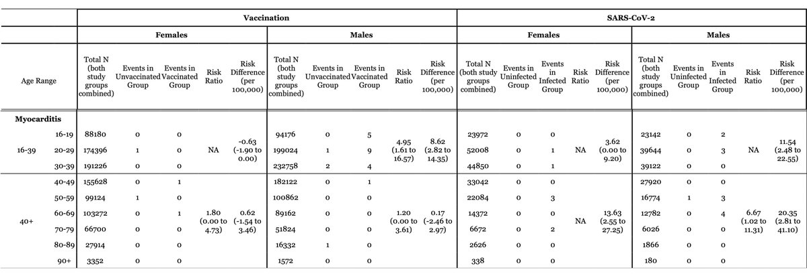</img></a>

---

<a href="https://twitter.com/erictopol/status/1453489593668366339" target="_blank" rel="noreferer">22:31 UCT</a>

Just out @LancetGH
A randomized, placebo-controlled trial of fluvoxamine, a repurposed antidepressant pill (~$4/10 day course; mechanism unknown), led to improved outcomes for early treatment in high-risk patients with Covid
 https://www.thelancet.com/journals/langlo/article/PIIS2214-109X(21)00448-4/fulltext 

<a href="FCvTj2GVQAMsny3.jpg"  >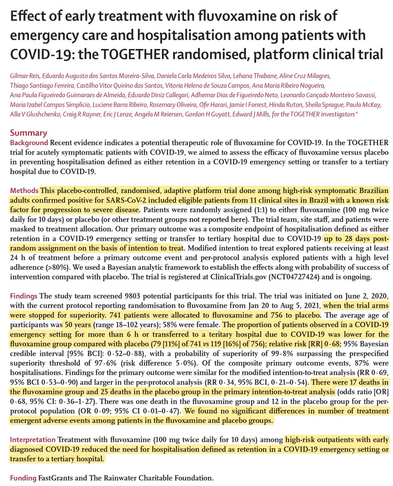</img></a>

---

<a href="https://twitter.com/erictopol/status/1453506074871431169" target="_blank" rel="noreferer">23:37 UCT</a>

This is what a real breakthrough infection report should look like. Thanks Oregon https://www.oregon.gov/oha/covid19/Documents/DataReports/Breakthrough-Case-Report.pdf
People &lt; age 60 are not "immune" from hospitalizations and deaths
J&amp;J&gt;Pfizer&gt;Moderna
Currently ~1/4 of cases
We still do not have this for the US, let alone most states 

<a href="FCvjxkqVIAA0vck.jpg"  >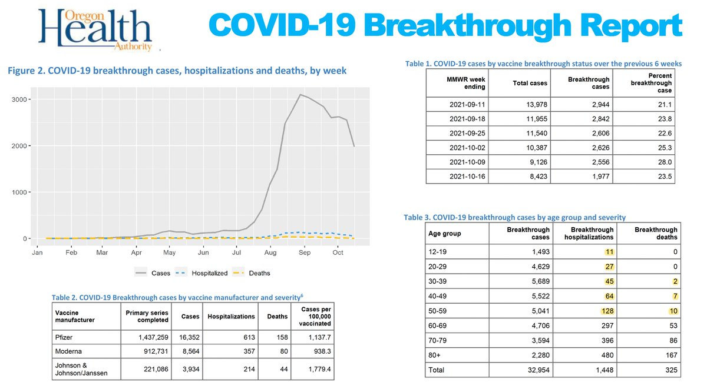</img></a>