+++
title = "Tweets by Eric Topol Oct 28"
Summary = ""
tags = ["Twitter"]
category = "Twitter"
+++

---

<a href="https://twitter.com/erictopol/status/1453519018875187201" target="_blank" rel="noreferer">00:28 UCT</a>

Confronting the #SARSCoV2 endemic reality
https://www.nytimes.com/2021/10/27/opinion/covid-forever-endemic-plans.html by @KatherineEban @nytopinion w/ @JeremyFarrar @mtosterholm @darakass @AliHMokdad and me
There's a lot we can do to keep the🦠in check

---

<a href="https://twitter.com/erictopol/status/1453552102391750659" target="_blank" rel="noreferer">02:40 UCT</a>

In contrast, the US has only posted such data once, now 2 months outdated, and represent only ~30% of the country
https://covid.cdc.gov/covid-data-tracker/#rates-by-vaccine-status @CDCgov 

<a href="FCwNPuUUUAIOxuO.jpg"  >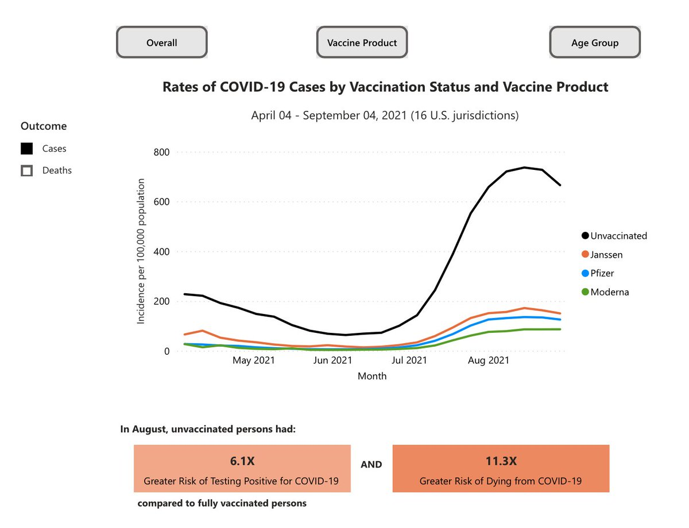</img></a>

---

<a href="https://twitter.com/erictopol/status/1453554876886122500" target="_blank" rel="noreferer">02:51 UCT</a>

If the US ever produced and published an up-to-date, informative report, it would be a real breakthrough 
Hello @HHSgov @WHCOVIDResponse @CDCgov

---

<a href="https://twitter.com/erictopol/status/1453719895665827840" target="_blank" rel="noreferer">13:46 UCT</a>

The case for not recognizing Prior Covid plus a vaccine (hybrid immunity) as equivalent to fully vaccinated is indefensible. Many countries have made that their health policy, but not the US. @ThalinCharlotte is on it @nytopinion https://www.nytimes.com/2021/10/28/opinion/covid-vaccine-hybrid-natural-immunity.html 

<a href="FCymESbUUAwcfVH.jpg"  >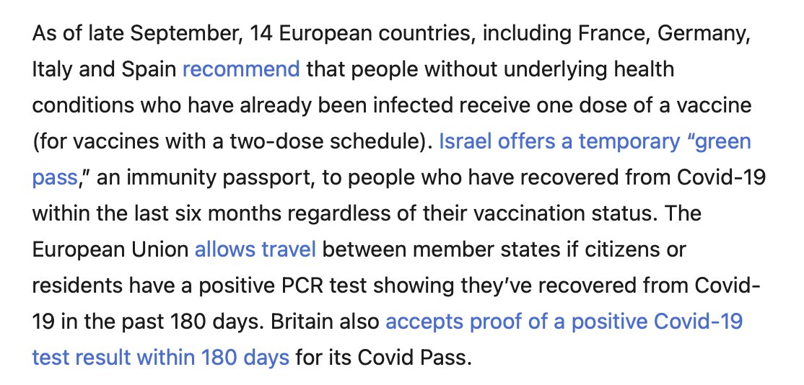</img></a><a href="FCymQ7pVgAADYLM.jpg"  >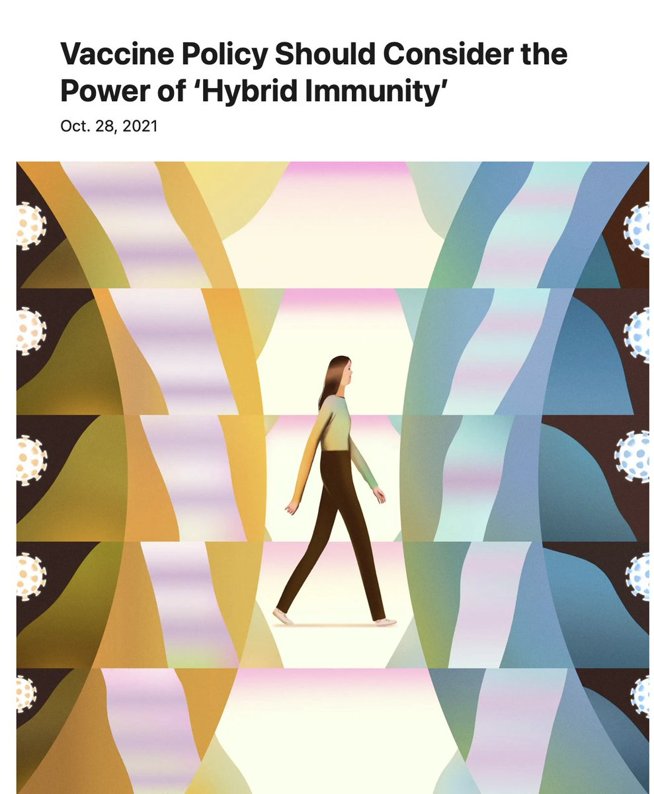</img></a>

---

<a href="https://twitter.com/erictopol/status/1453753424483258368" target="_blank" rel="noreferer">16:00 UCT</a>

A new, rigorous and important study of Covid transmission—with or without prior vaccination—in 621 people with mild infections
Just published @TheLancetInfDis 
https://www.thelancet.com/lancet/article/s1473309921006484
Vaccination reduced spread, but it still occurred in household contacts (unvaxx 38%, vaxx 25%) 

<a href="FCy_1WSVQAMIpYp.jpg"  >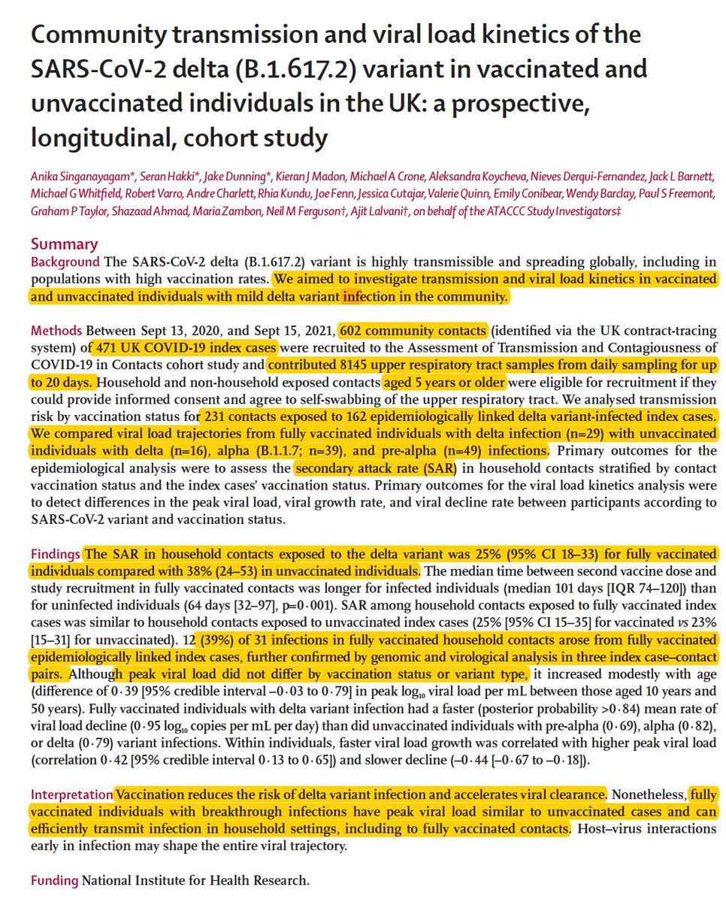</img></a><a href="FCzAwHLVUAY-lNi.jpg"  >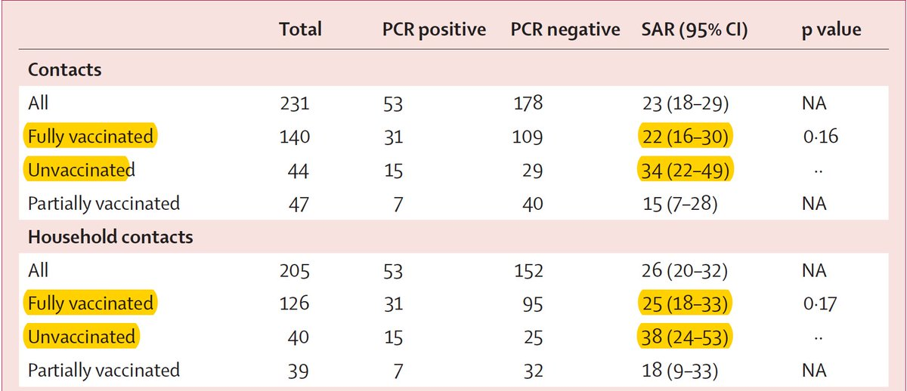</img></a>

---

<a href="https://twitter.com/erictopol/status/1453753926994391040" target="_blank" rel="noreferer">16:02 UCT</a>

Viral load was assessed from 8145 respiratory tract samples for up to 20 days, irrespective of symptoms

The peak load (Delta variant) was similar for unvaccinated vs vaccinated cases, but faster clearance in the latter

All breakthrough cases were mild

---

<a href="https://twitter.com/erictopol/status/1453754488875995143" target="_blank" rel="noreferer">16:04 UCT</a>

From the accompanying editorial
https://www.thelancet.com/pb-assets/Lancet/pdfs/s1473309921006903.pdf
“This study unfortunately also highlights that the vaccine effect on reducing transmission is minimal in the context of Delta variant circulation”

---

<a href="https://twitter.com/erictopol/status/1453763854169612311" target="_blank" rel="noreferer">16:41 UCT</a>

Something we cannot get enough of in science
https://www.nature.com/articles/s41562-021-01203-8
@NatureHumBehav 
 "We provide a set of recommendations on how to increase intellectual humility in research articles"
Thanks to @RinkHoekstra and @siminevazire

---

<a href="https://twitter.com/erictopol/status/1453767573187694595" target="_blank" rel="noreferer">16:56 UCT</a>

An in-depth assessment of the immune system for aged vs young individuals, with varying severity of Covid infections, shows marked differences in the cellular, chemokine and cytokine response
https://www.nature.com/articles/s43587-021-00127-2
@NatureAging 

<a href="FCzRyLLVEAYtvgH.jpg"  >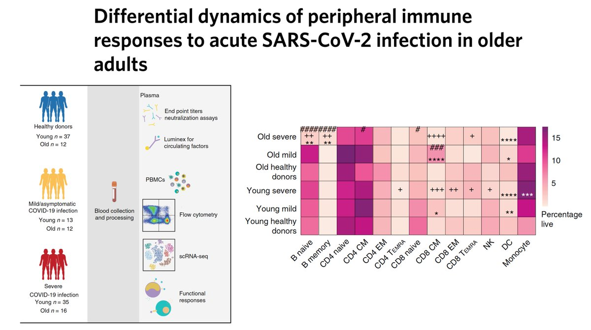</img></a>

---

<a href="https://twitter.com/erictopol/status/1453776380831830016" target="_blank" rel="noreferer">17:31 UCT</a>

Impact of time from vaccination in the study 

<a href="FCzZ1SdVIAIKtYc.png"  >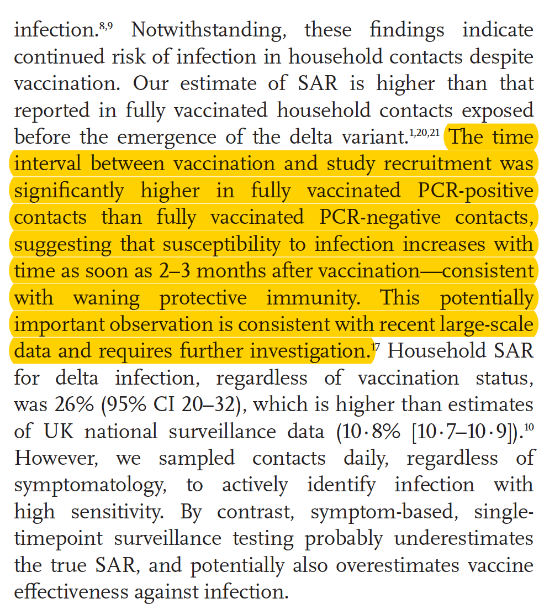</img></a>

---

<a href="https://twitter.com/erictopol/status/1453783110072422400" target="_blank" rel="noreferer">17:57 UCT</a>

India peaked in May with its Delta wave (the initial one in the world) and has since been steady and back to baseline for months.
52% of the population has now had at least one dose of vaccine. Extensive prior Covid.
If this holds over time, it's a good sign. 

<a href="FCzfjX3VkAAT5yw.jpg"  >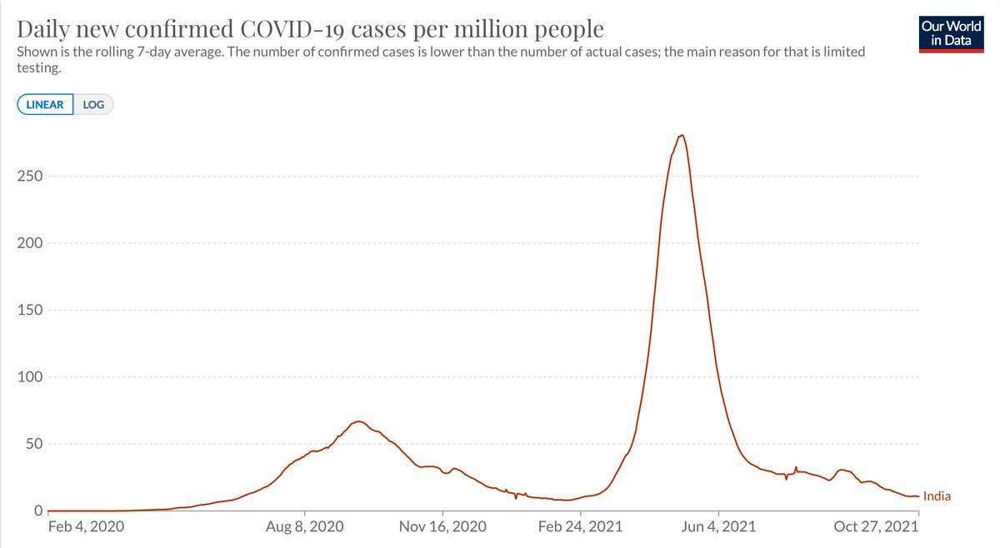</img></a>

---

<a href="https://twitter.com/erictopol/status/1453822923479732226" target="_blank" rel="noreferer">20:36 UCT</a>

A key @US_FDA leader, Dr. Peter Marks, who came up with the Operation Warp Speed idea, has an essay on lessons learned during the pandemic, acknowledging the strain and inability to keep up w/ non-pandemic stuff
https://www.nature.com/articles/s41591-021-01559-4 @NatureMedicine 

<a href="FC0D6O2UUAABsIL.jpg"  >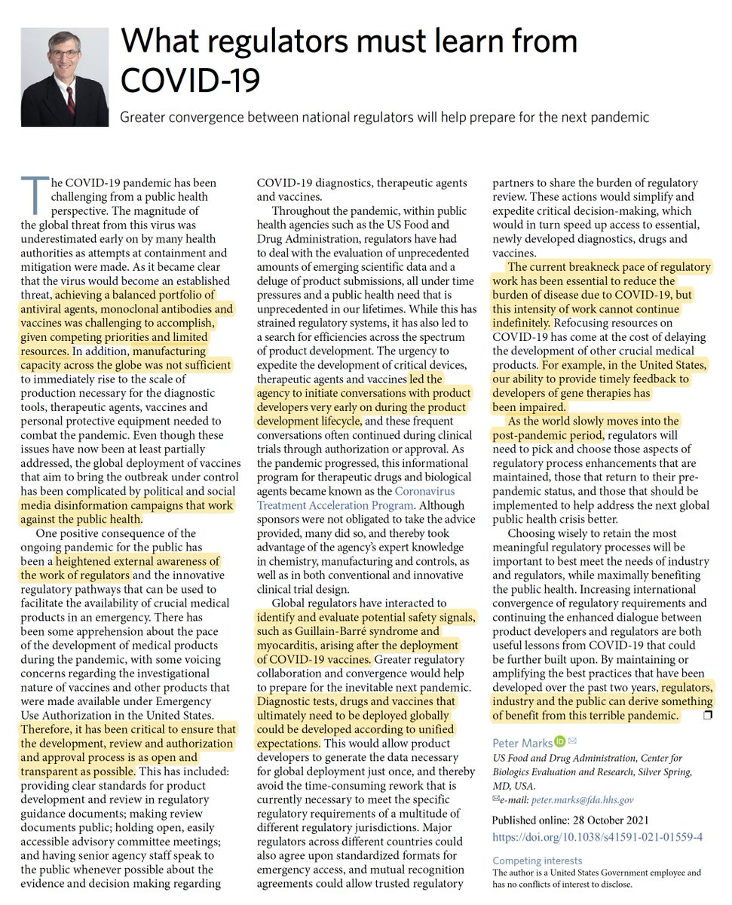</img></a>

---

<a href="https://twitter.com/erictopol/status/1453824583061020673" target="_blank" rel="noreferer">20:42 UCT</a>

When you have very limited data, nearly 2 months old, you can keep analyzing the same dataset (while the Delta wave didn't stop on Sept 4th)
https://www.nytimes.com/interactive/2021/10/28/us/covid-breakthrough-cases.html

---

<a href="https://twitter.com/erictopol/status/1453828830758531074" target="_blank" rel="noreferer">20:59 UCT</a>

The science of sleep @ScienceMagazine 
We typically don't get enough yet our health depends on it.
https://www.science.org/toc/science/current
w/ @ScienceVisuals 

<a href="FC0Iz3dUcAgtDgT.jpg"  >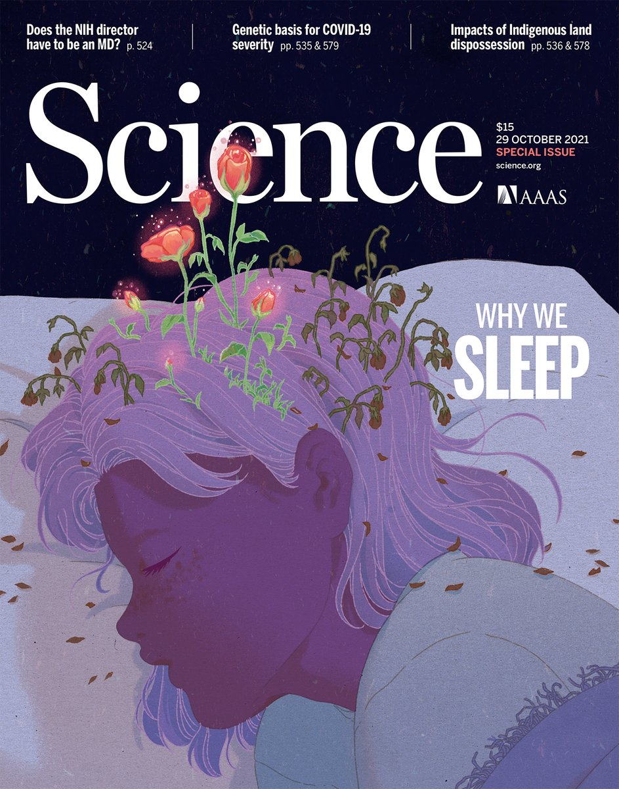</img></a><a href="FC0JfXjaUAAN2VA.jpg"  >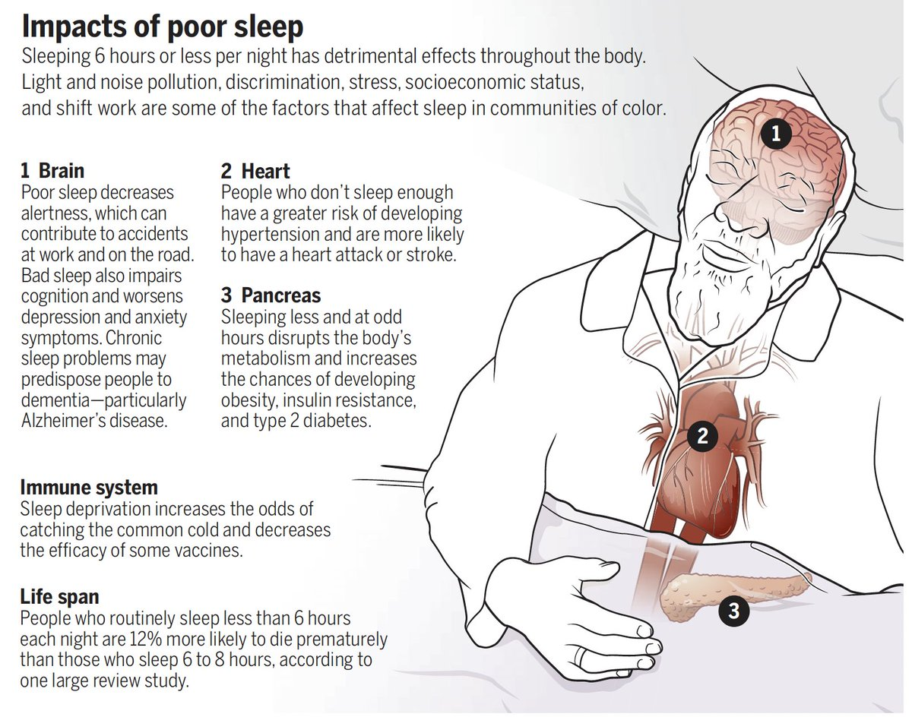</img></a><a href="FC0I3zmUcAEkkdR.jpg"  >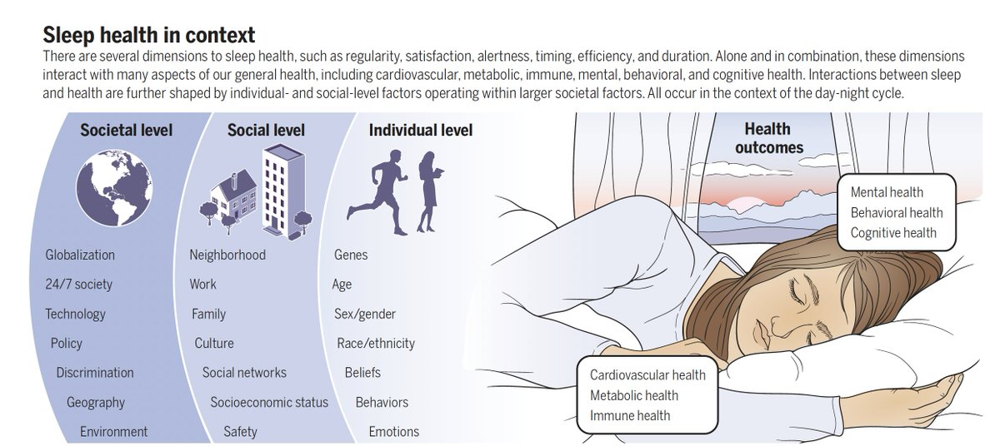</img></a><a href="FC0I5qtUcAgXkBB.jpg"  >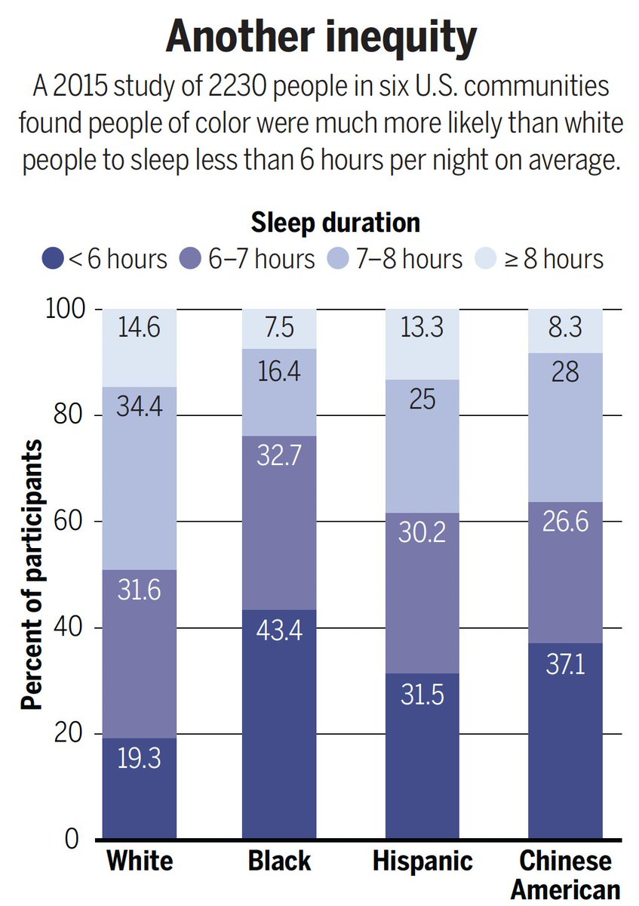</img></a>

---

<a href="https://twitter.com/erictopol/status/1453837932511432704" target="_blank" rel="noreferer">21:35 UCT</a>

The kid vaccine effect in the US, simulated, is big
https://www.nature.com/articles/d41586-021-02947-z
@nature by @maxdkozlov 

<a href="FC0RvQAakAAop_z.jpg"  >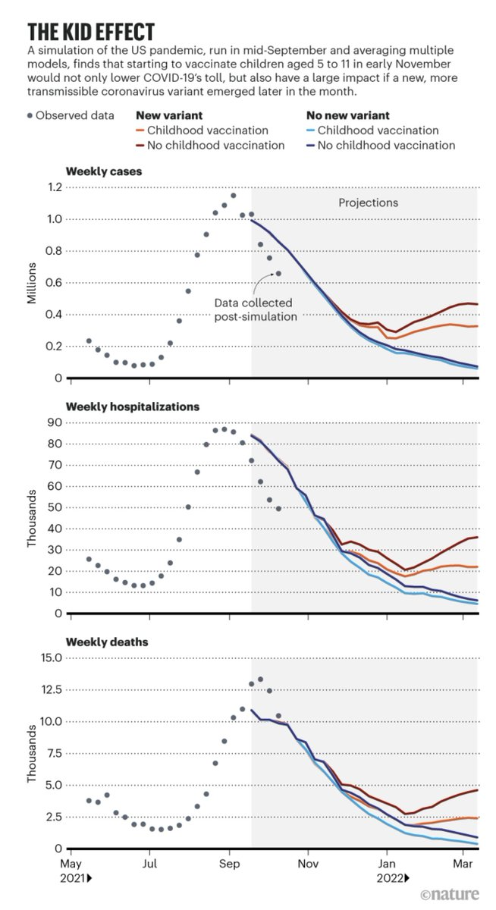</img></a>

---

<a href="https://twitter.com/erictopol/status/1453861047316598796" target="_blank" rel="noreferer">23:07 UCT</a>

Breakthrough Covid deaths from fully vaccinated status are very rare, 0.007% for Scotland country-wide; most of the 236 deaths occurred in people older than 75 years who had multiple comorbidities
https://www.thelancet.com/journals/lancet/article/PIIS0140-6736(21)02316-3/fulltext @TheLancet 

<a href="FC0mlGUVkAY3BVA.jpg"  >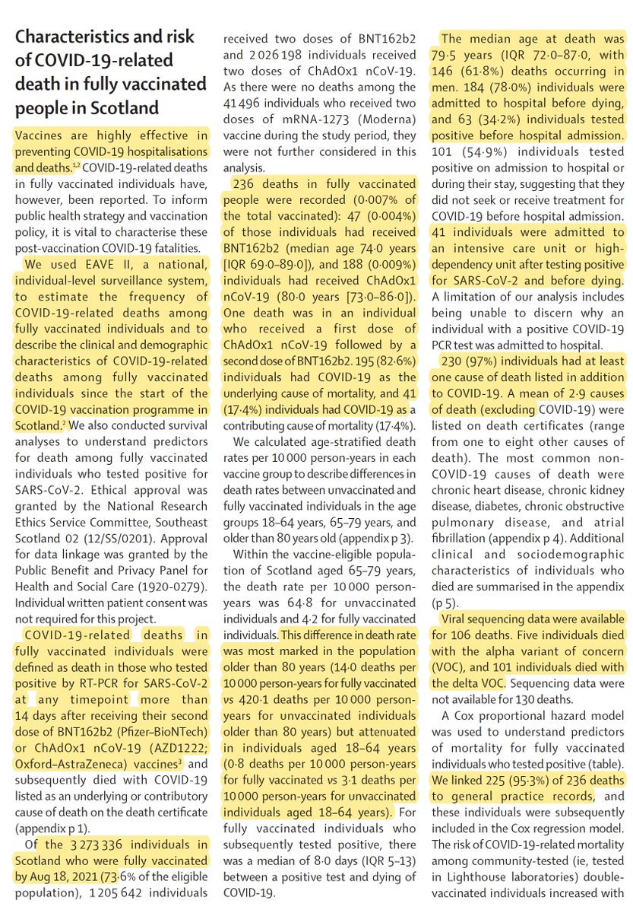</img></a>

---

<a href="https://twitter.com/erictopol/status/1453868290195869698" target="_blank" rel="noreferer">23:36 UCT</a>

@binge_tweeter @Nature @maxdkozlov Thank you for your kindness. It's people like you who make my day, every day, so enjoyable.

---

<a href="https://twitter.com/erictopol/status/1453868738340548612" target="_blank" rel="noreferer">23:38 UCT</a>

"Patients with multiple myeloma frequently present with substantial immune impairment and an increased risk for [Covid] infections and infection-related mortality."
https://www.thelancet.com/journals/lanhae/article/PIIS2352-3026(21)00278-7/fulltext @TheLancetHaem A review by 36 experts. Of relevance to the recent passing of Colin Powell 

<a href="FC0p4fqVkAEp-Rb.jpg"  >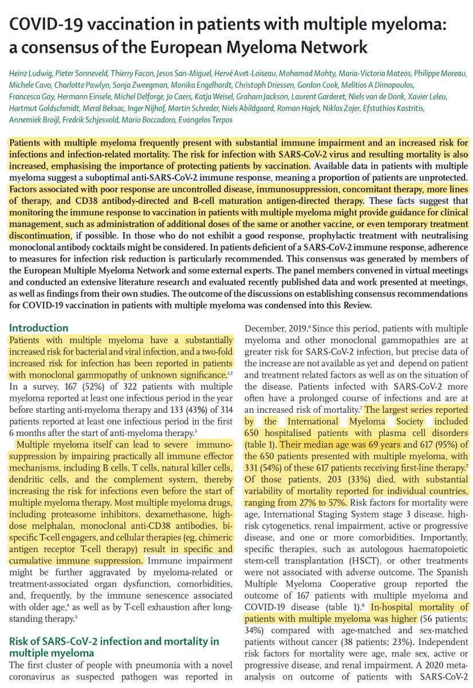</img></a>