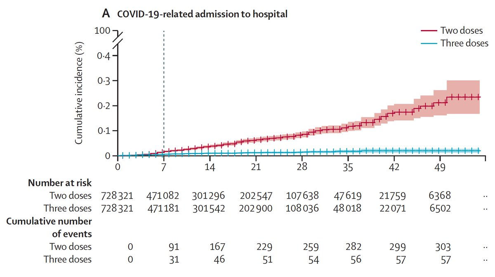
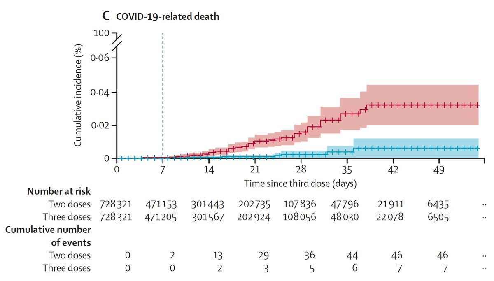
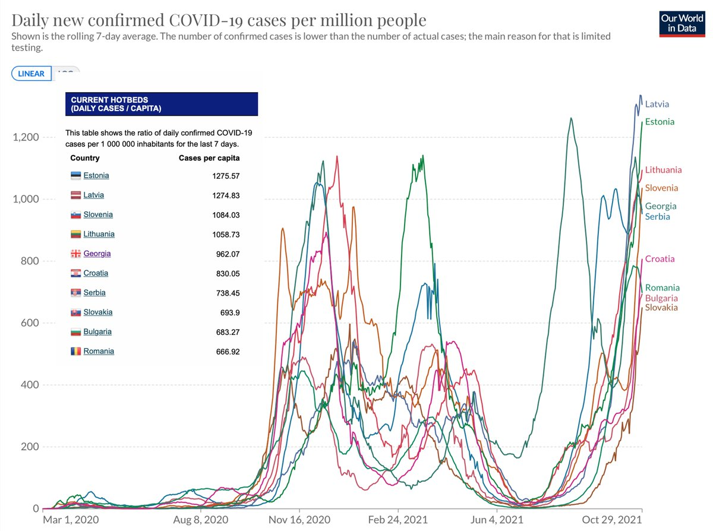
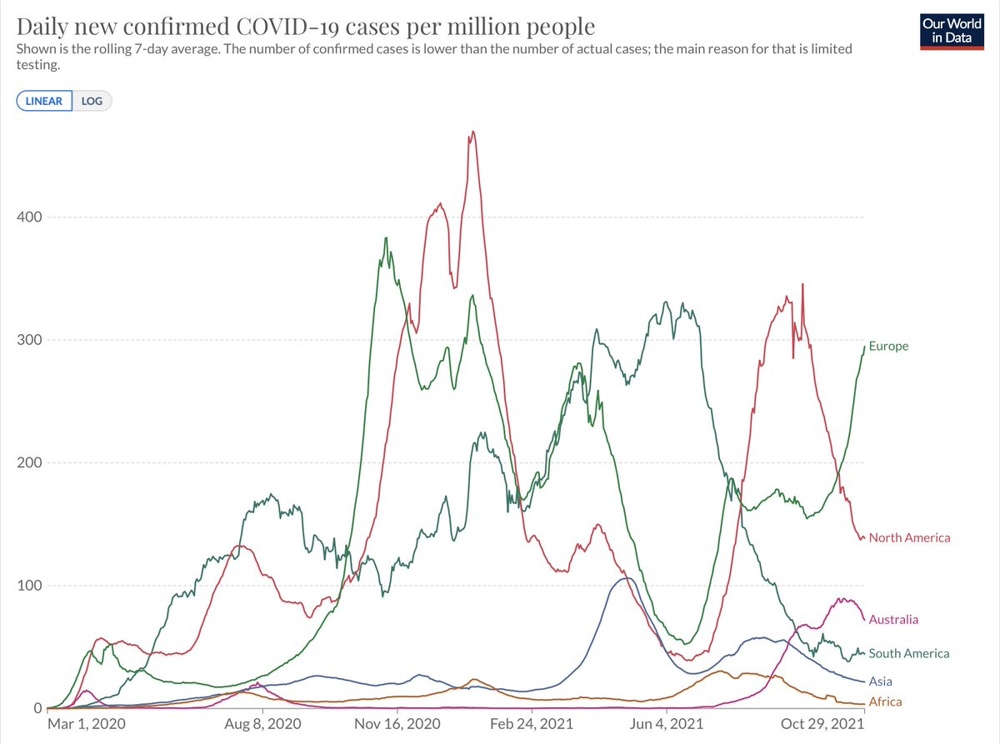
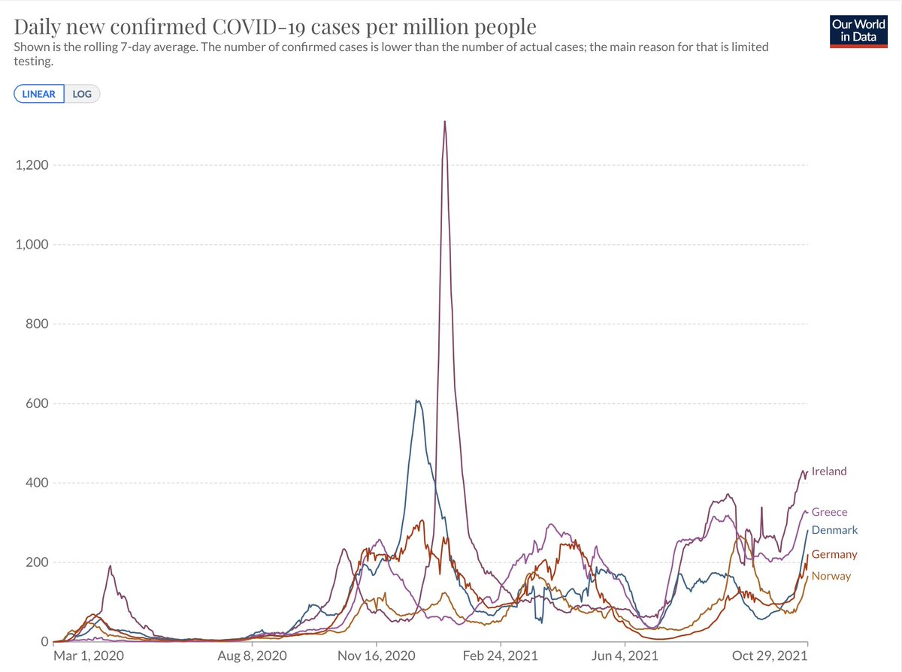
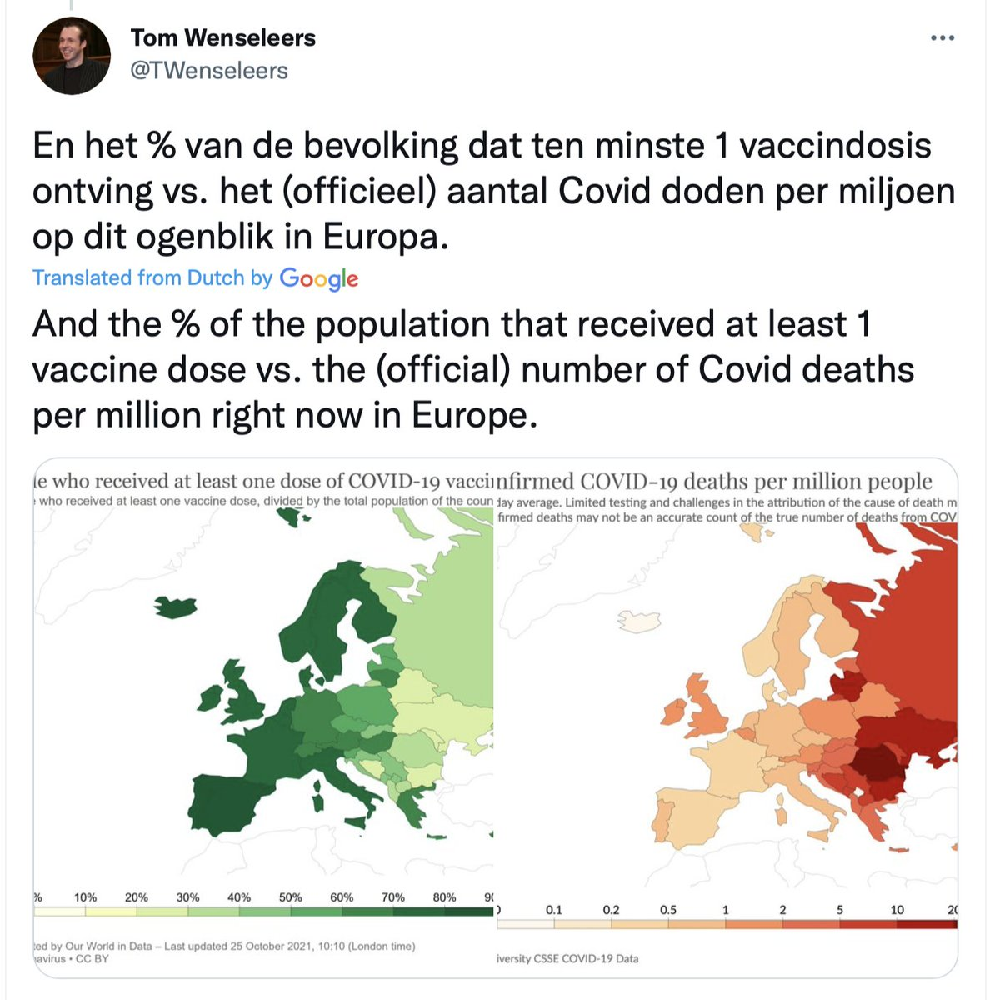
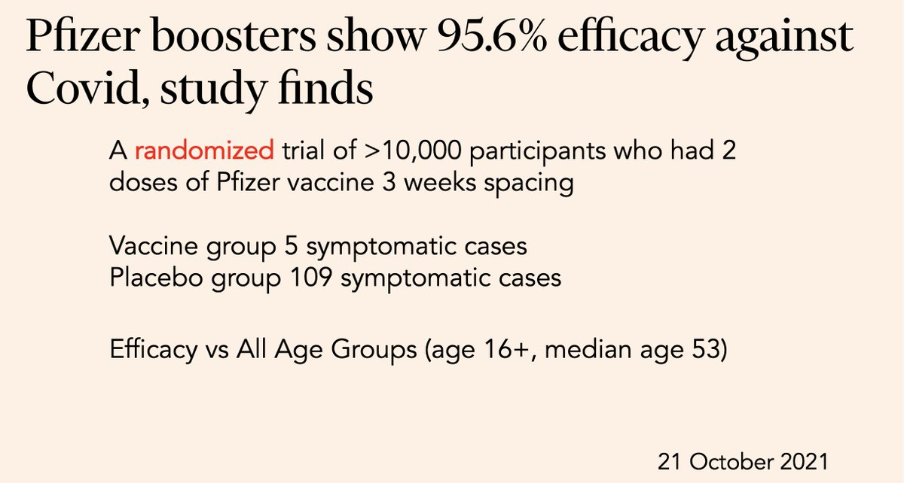
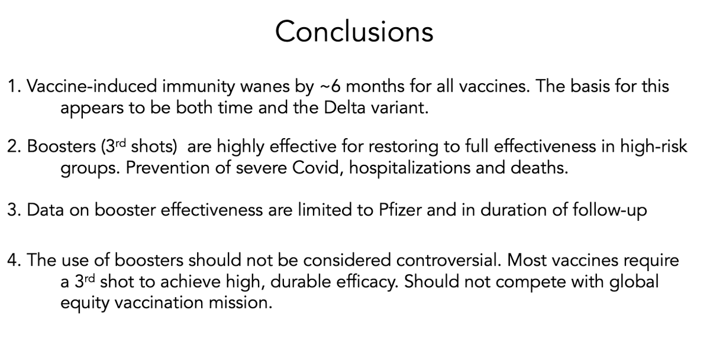
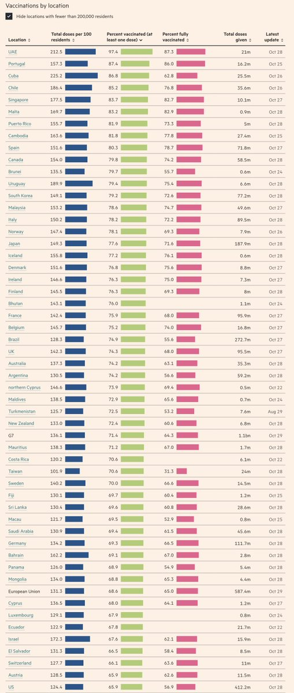
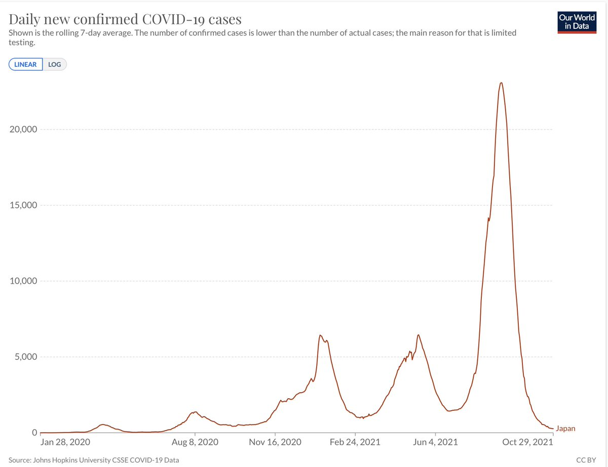

+++
title = "Tweets by Eric Topol Oct 30"
Summary = ""
tags = ["Twitter"]
category = "Twitter"
+++

---

<a href="https://twitter.com/erictopol/status/1454471300047462404" target="_blank" rel="noreferer">15:32 UCT</a>

Adding to the body of data for booster shot effectiveness, a new @TheLancet report of over 728,000 people w/ 3 shots vs &gt;728,000 matched controls (2 shots):
93% reduction of Covid hospitalizations
https://www.thelancet.com/journals/lancet/article/PIIS0140-6736(21)02249-2/fulltext 

<a href="FC9Q0l5VgAwLcag.jpg"  ></img></a>

---

<a href="https://twitter.com/erictopol/status/1454471304816435213" target="_blank" rel="noreferer">15:32 UCT</a>

And 81% reduction of deaths 

<a href="FC9RYfgUcAs2bbp.jpg"  ></img></a>

---

<a href="https://twitter.com/erictopol/status/1454499588069474305" target="_blank" rel="noreferer">17:24 UCT</a>

The top 10 countries for covid cases/capital globally are all in Eastern Europe 

<a href="FC9q9uTVQAQooVK.jpg"  ></img></a>

---

<a href="https://twitter.com/erictopol/status/1454499586265862151" target="_blank" rel="noreferer">17:24 UCT</a>

There's currently one continental outlier: Europe
@OurWorldInData 

<a href="FC9pj5jVkAAbLvC.jpg"  ></img></a>

---

<a href="https://twitter.com/erictopol/status/1454499592595120130" target="_blank" rel="noreferer">17:25 UCT</a>

While there has been an increase in cases in several Western European countries, it is small (per capita) relative to the previous group 

<a href="FC9rY0EVIAULIXZ.jpg"  ></img></a>

---

<a href="https://twitter.com/erictopol/status/1454501732751314948" target="_blank" rel="noreferer">17:33 UCT</a>

Relationship of vaccinations and deaths in Europe via 
@TWenseleers 
https://twitter.com/TWenseleers/status/1452592274848862209 

<a href="FC9te5kVcAIfya5.jpg"  ></img></a>

---

<a href="https://twitter.com/erictopol/status/1454506863039373315" target="_blank" rel="noreferer">17:53 UCT</a>

The new report adds to many previous ones, including the &gt;10,000 participant randomized trial, summarized below) and my conclusions based on all of the data thus presented from the @CIDRAP program yesterday 

<a href="FC9yFGPVIAUM3Rn.jpg"  ></img></a><a href="FC9yRNGVUAE40xs.png"  ></img></a>

---

<a href="https://twitter.com/erictopol/status/1454516454057857024" target="_blank" rel="noreferer">18:32 UCT</a>

A single-dose skin patch protein subunit Covid vaccine more effective than shots, including vs variants, in an experimental model
https://www.science.org/doi/10.1126/sciadv.abj8065
@ScienceAdvances 
So much potential for even better vaccines, including nasal/oral for mucosal immunity and pan-sarbecovirus

---

<a href="https://twitter.com/erictopol/status/1454521931932209152" target="_blank" rel="noreferer">18:53 UCT</a>

While the US reported giving a record &gt;1 million boosters today @CDCgov, it continues to fall in % population vaccinated, the primary goal. Now 54th on the list
https://ig.ft.com/coronavirus-vaccine-tracker/?areas=gbr&areas=isr&areas=usa&areas=eue&areas=can&areas=chn&areas=ind&cumulative=1&doses=total&populationAdjusted=1 

<a href="FC9_XNnVkA0Qt6v.jpg"  ></img></a>

---

<a href="https://twitter.com/erictopol/status/1454526190438400000" target="_blank" rel="noreferer">19:10 UCT</a>

Today, the lowest level of cases in Japan in over 15 months. Test positivity &lt; 0.6%. 

<a href="FC-DRZBVUAI0p9l.jpg"  ></img></a>

---

<a href="https://twitter.com/erictopol/status/1454581995275649024" target="_blank" rel="noreferer">22:52 UCT</a>

RT @AliNouriPhD: 📌UK study: ~1 in 4 people who were infected &amp; tested PCR positive for COVID19 did NOT go on to develop IgG antibodies. Par…

---

<a href="https://twitter.com/erictopol/status/1454589826922008582" target="_blank" rel="noreferer">23:23 UCT</a>

The gift that keeps on giving.
The more people who are vaccinated, including children age 5 to 11, the more people who are protected, well beyond the vaccinee.

