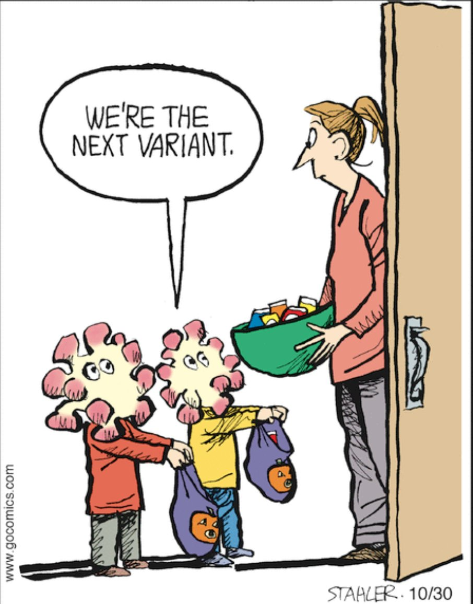
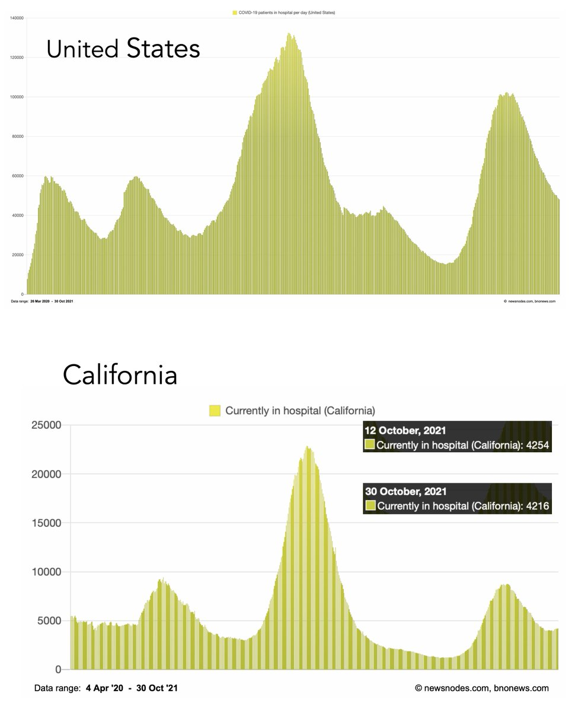
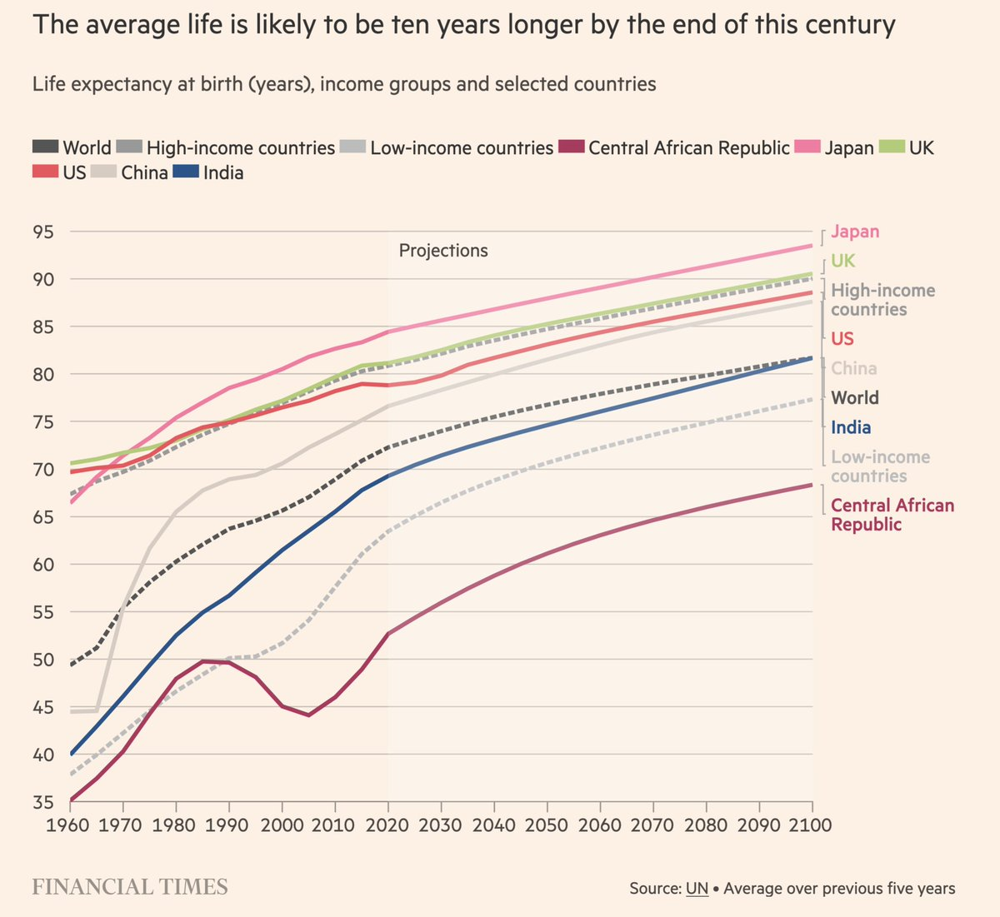
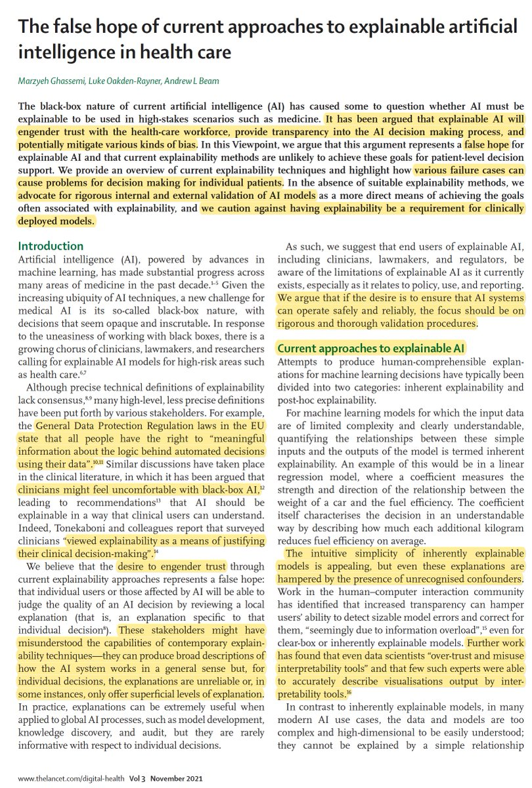
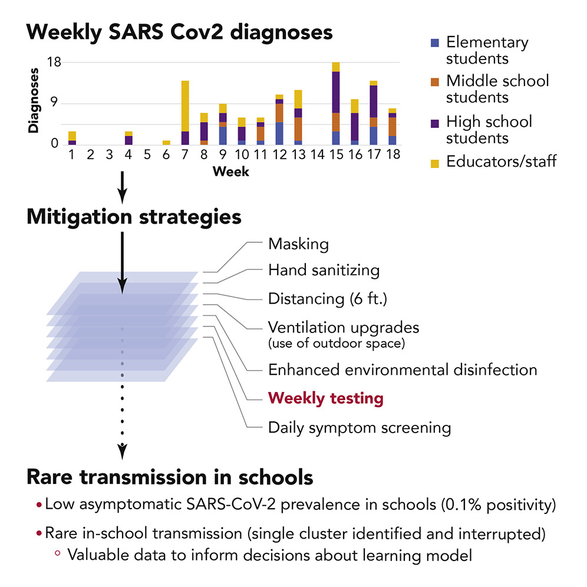

+++
title = "Tweets by Eric Topol Oct 31"
Summary = ""
tags = ["Twitter"]
category = "Twitter"
+++

---

<a href="https://twitter.com/erictopol/status/1454805172681527298" target="_blank" rel="noreferer">13:39 UCT</a>

Our covid times :-)
Happy #halloween2021 

<a href="FDCBAf9VkAUMvzX.jpg"  ></img></a>

---

<a href="https://twitter.com/erictopol/status/1454859634196422667" target="_blank" rel="noreferer">17:15 UCT</a>

Will the US continues its steady descent, now well below 50,000 hospitalizations? Or hit a plateau as has occurred in California in recent weeks?
We have the tools to achieve containment, to at the least get to pre-Delta levels seen at the end of June 

<a href="FDCq3R1UYA4iXPn.jpg"  ></img></a>

---

<a href="https://twitter.com/erictopol/status/1454869111817654279" target="_blank" rel="noreferer">17:53 UCT</a>

A new @FT essay by @anjahuja asks "Can we defeat death?" 
No, but we can extend healthspan. The US is poorly positioned, currently the lowest life expectancy of all 38 @OECD countries
https://www.ft.com/content/60d9271c-ae0a-4d44-8b11-956cd2e484a9 

<a href="FDC7GsZVcAUdj2Z.jpg"  ></img></a>

---

<a href="https://twitter.com/erictopol/status/1454873714206527492" target="_blank" rel="noreferer">18:11 UCT</a>

Many have argued how vital it is to have explainable #AI for #healthcare. Here's an effective counter, emphasizing the false hope, and better ways to engender trust, especially at the individual level
https://www.thelancet.com/journals/landig/article/PIIS2589-7500(21)00208-9/fulltext @LancetDigitalH @MarzyehGhassemi @DrLukeOR @AndrewLBeam 

<a href="FDC_3nvVcAAbVaI.jpg"  ></img></a>

---

<a href="https://twitter.com/erictopol/status/1454910426571935751" target="_blank" rel="noreferer">20:37 UCT</a>

A new prospective study of K-12 school students and staff that demonstrates the very low frequency of asymptomatic Covid in a US public school system, pre-vaccination, with multi-mitigation measures
https://www.cell.com/cell-reports-medicine/fulltext/S2666-3791(21)00320-7 @CellRepMed @CellPressNews 

<a href="FDDhH2iVcAYcB-U.jpg"  ></img></a>