+++
title = "Tweets by Eric Topol Nov 01"
Summary = ""
tags = ["Twitter"]
category = "Twitter"
+++

---

<a href="https://twitter.com/erictopol/status/1454978354285723653" target="_blank" rel="noreferer">01:07 UCT</a>

@SusanCHull Much appreciated, Susan 🙏

---

<a href="https://twitter.com/erictopol/status/1455174161618272263" target="_blank" rel="noreferer">14:05 UCT</a>

Is Singapore the new Israel, with respect to experiencing  a severe Delta wave?
With 80% fully vaccinated, the virus is still finding the unvaccinated https://sg.news.yahoo.com/covid19-singapore-3163-cases-13-deaths-152053756.html?guccounter=1&guce_referrer=aHR0cHM6Ly93d3cuZ29vZ2xlLmNvbS8&guce_referrer_sig=AQAAAD6fyjHlx6SQmGUm-E_N4XPPMadnSUFpgGrZrxExx16kL_nVPyUpnC4lMh-UAjO36rCJrZmCPBGmkifBMyhWixvYE05uRmSQYd_NyuhRGCFbUKy0TYSWpbEzAJmgVAdQrK8pfXVnfKhLcJeYFlC-bYW0Xw7F0_lOiWRxH5-aUrvb
In contrast to Israel, little prior Covid 

<a href="FDHQ3EjVUAgESiS.jpg"  >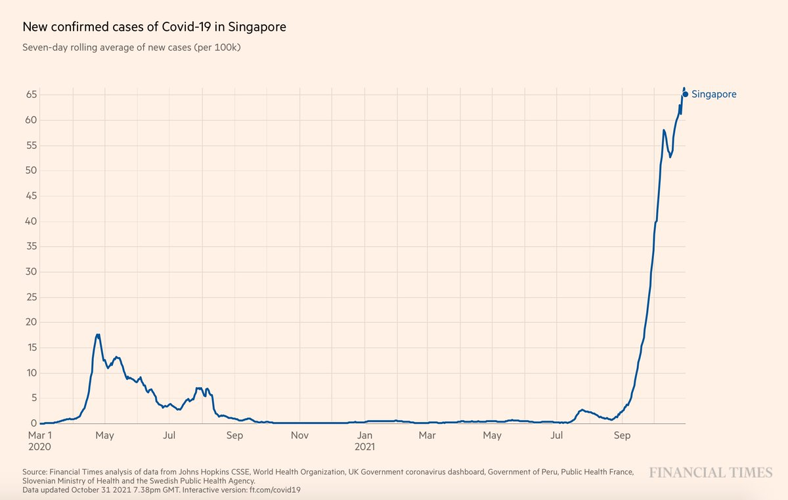</img></a>

---

<a href="https://twitter.com/erictopol/status/1455174164386488325" target="_blank" rel="noreferer">14:05 UCT</a>

Not just cases; a rise in deaths, hospitalizations, ICU admissions https://covidsitrep.moh.gov.sg 

<a href="FDHQlgaVIAIX9K8.jpg"  >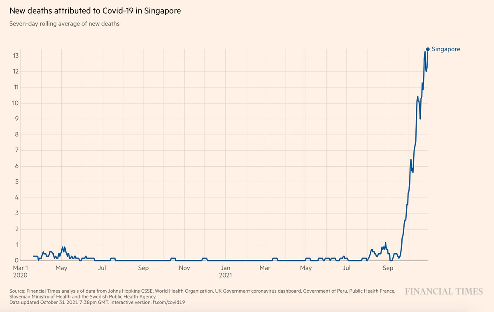</img></a>

---

<a href="https://twitter.com/erictopol/status/1455176240541749249" target="_blank" rel="noreferer">14:13 UCT</a>

Our covid times, WFH :-) 

<a href="FDHTC1XVcAYAMEY.jpg"  >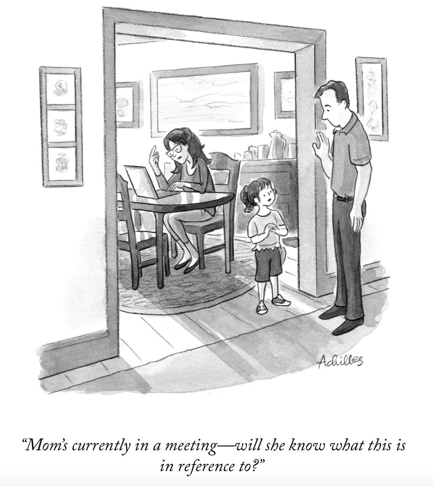</img></a>

---

<a href="https://twitter.com/erictopol/status/1455178930923601924" target="_blank" rel="noreferer">14:24 UCT</a>

Above the fold today on the @CDCgov breakthrough data @nytgraphics 
Delta wave post-vaccination infections similar range ~150/100,000 across age groups; deaths in advanced age 

<a href="FDHVOibUYAEj-Jr.jpg"  >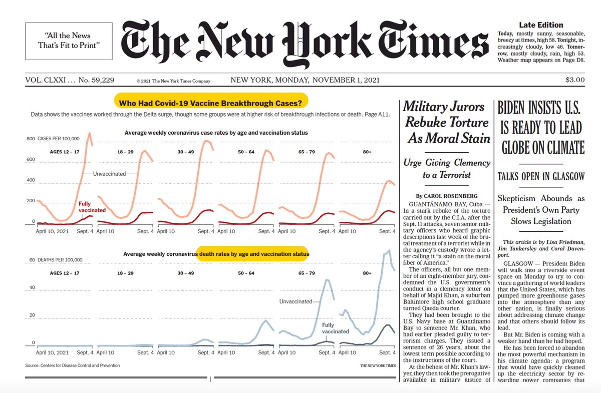</img></a>

---

<a href="https://twitter.com/erictopol/status/1455183089886384128" target="_blank" rel="noreferer">14:40 UCT</a>

Amazing. After the profound Covid devastation in Florida, the worst in the United States, he wants the media to give the governor credit for now having a low case rate. 
https://www.wsj.com/articles/media-ignore-florida-covid-coronavirus-vaccination-herd-immunity-desantis-ladapo-11635707152?mod=Searchresults_pos1&page=1 

<a href="FDHZE8LVgAIA3OS.png"  >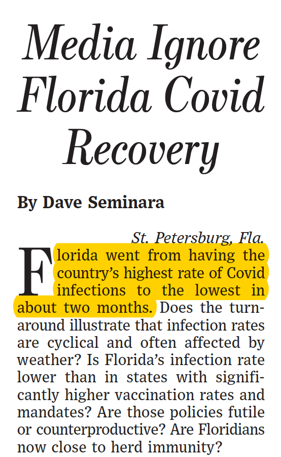</img></a>

---

<a href="https://twitter.com/erictopol/status/1455187983548628997" target="_blank" rel="noreferer">15:00 UCT</a>

RT @ONS: The age-adjusted risk of deaths involving #COVID19 was 32 times greater in unvaccinated people than in fully vaccinated individual…

---

<a href="https://twitter.com/erictopol/status/1455189352980516869" target="_blank" rel="noreferer">15:05 UCT</a>

@kianchungong @DrWilliamKu Thank you. Supporting the assertion that the virus is finding the unvaccinated, accounting for most of the serious and deadly outcomes in the Singapore Delta outbreak

---

<a href="https://twitter.com/erictopol/status/1455204878083526656" target="_blank" rel="noreferer">16:07 UCT</a>

The critical role of conspiracy theorists have had in shaping the pandemic by exploiting and twisting COVID science
https://www.nature.com/articles/s41562-021-01217-2
@NatureHumBehav @APPCPenn and propagated by @FoxNews. And what should be done about it. 

<a href="FDHs2lzVgAYlXLN.jpg"  >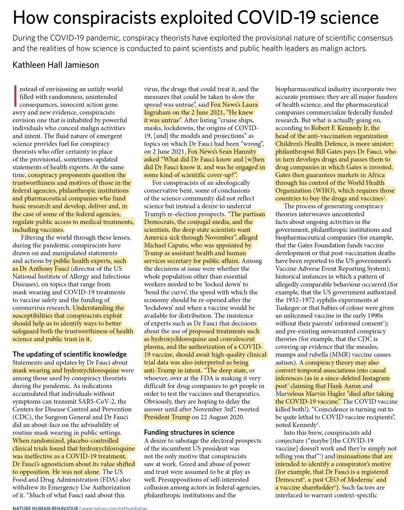</img></a><a href="FDHs3_ZUUAkP4fQ.jpg"  >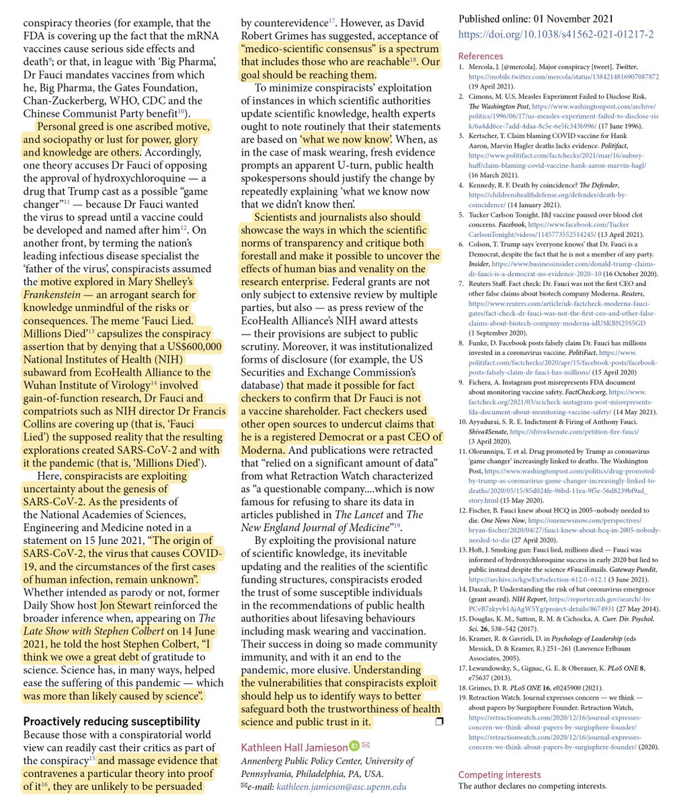</img></a>

---

<a href="https://twitter.com/erictopol/status/1455230698978041856" target="_blank" rel="noreferer">17:50 UCT</a>

You can seen how the unvaccinated are largely accounting for the severe disease outcomes in the Singaporean Delta wave
via @kianchungong 

<a href="FDIEf8VVkAAwh1W.png"  >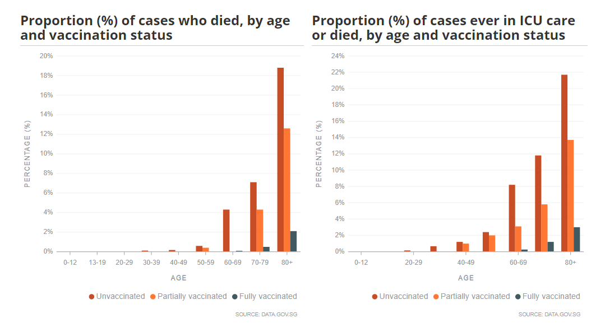</img></a>

---

<a href="https://twitter.com/erictopol/status/1455231848775237635" target="_blank" rel="noreferer">17:54 UCT</a>

If you've had Covid, the secret for not getting it again
https://jamanetwork.com/journals/jama/fullarticle/2785918?guestAccessKey=6ee768d4-0daf-47a1-8177-ab636e03c6d3&utm_source=For_The_Media&utm_medium=referral&utm_campaign=ftm_links&utm_content=tfl&utm_term=110121 @JAMA_current 

<a href="FDIFWddUUAAU2J-.jpg"  >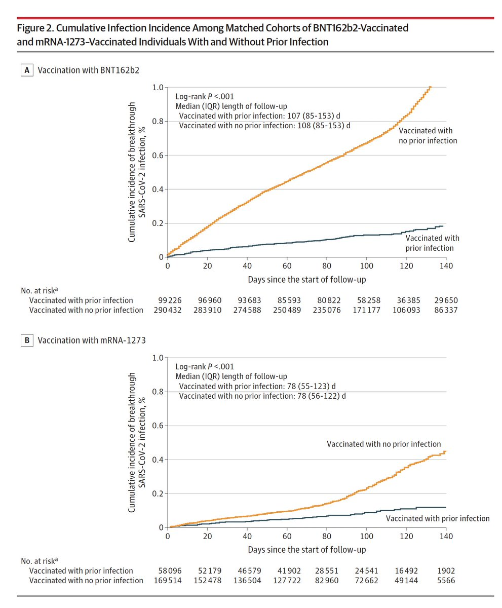</img></a>

---

<a href="https://twitter.com/erictopol/status/1455233087881703425" target="_blank" rel="noreferer">17:59 UCT</a>

Reminder: Antibodies to #SARSCoV2 🦠 wane with Prior Covid ("natural immunity") over time, just not as much as without previous infection
https://jamanetwork.com/journals/jama/fullarticle/2785919?guestAccessKey=d6d49995-b0f4-4849-bcb5-1a486171137a&utm_source=For_The_Media&utm_medium=referral&utm_campaign=ftm_links&utm_content=tfl&utm_term=110121 @JAMA_current 

<a href="FDIGmnSVUAI4iQu.jpg"  >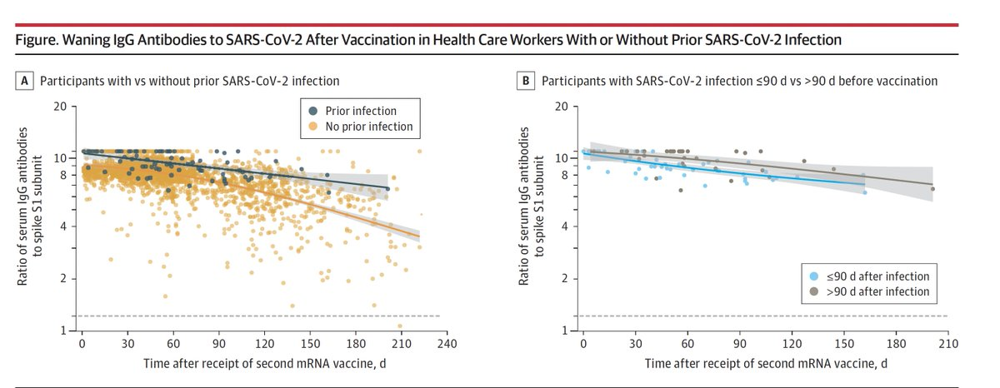</img></a>

---

<a href="https://twitter.com/erictopol/status/1455262869369491458" target="_blank" rel="noreferer">19:58 UCT</a>

Here's the commentary on this paper
https://www.nature.com/articles/s41586-021-04130-w
@NatureNV 
The graphs are striking. The red are reported (so small in number they had to be magnified) while the gray bars are the Covid cases missed (estimated). 

<a href="FDIhpOFVkAMT8-d.jpg"  >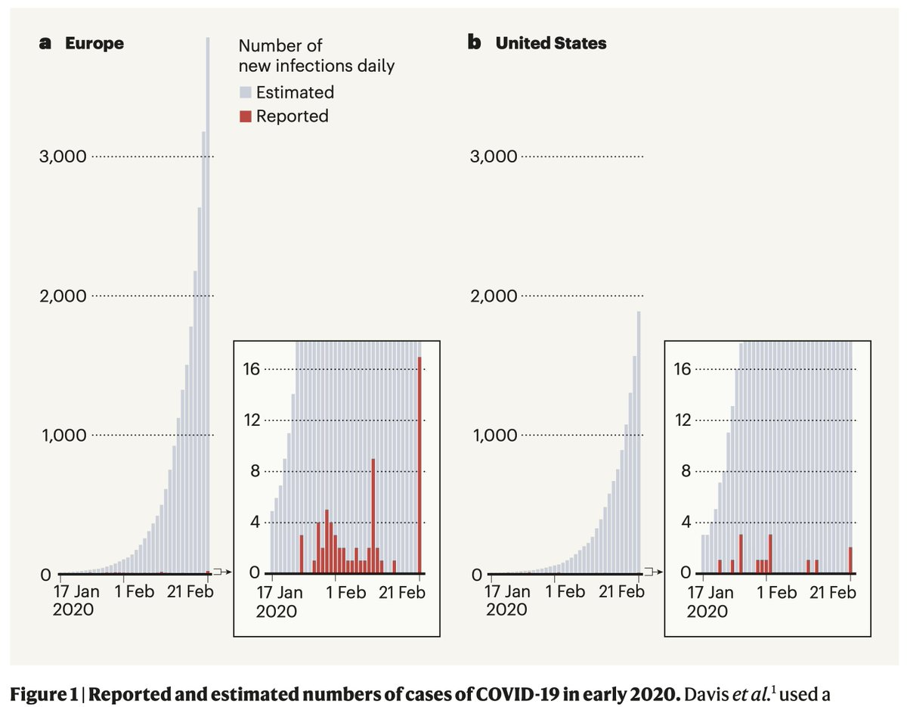</img></a>

---

<a href="https://twitter.com/erictopol/status/1455284233736318979" target="_blank" rel="noreferer">21:22 UCT</a>

"Is 90% efficacy good, Natasha?"
"It's fucking amazing. Absolutely amazing, I blurted, feeling a wave of relief and joy."—@natashaloder
https://www.nature.com/articles/d41586-021-02996-4
@Nature review of 2 books (authors @bborrell and @GZuckerman) on the race to develop Covid vaccines 
@kkariko @sbancel 

<a href="FDIz2q1VcAE8FF-.jpg"  >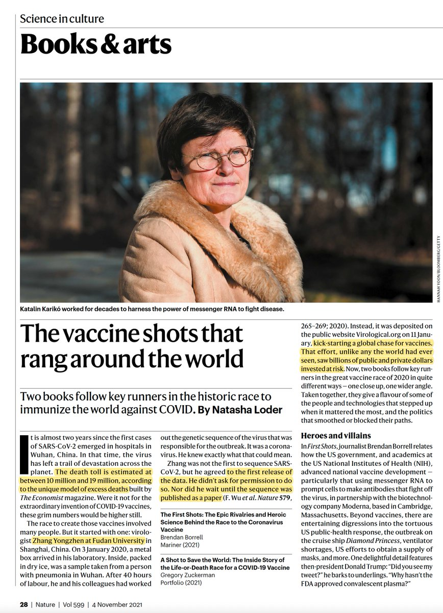</img></a><a href="FDIz5cRUUAAUtEo.jpg"  >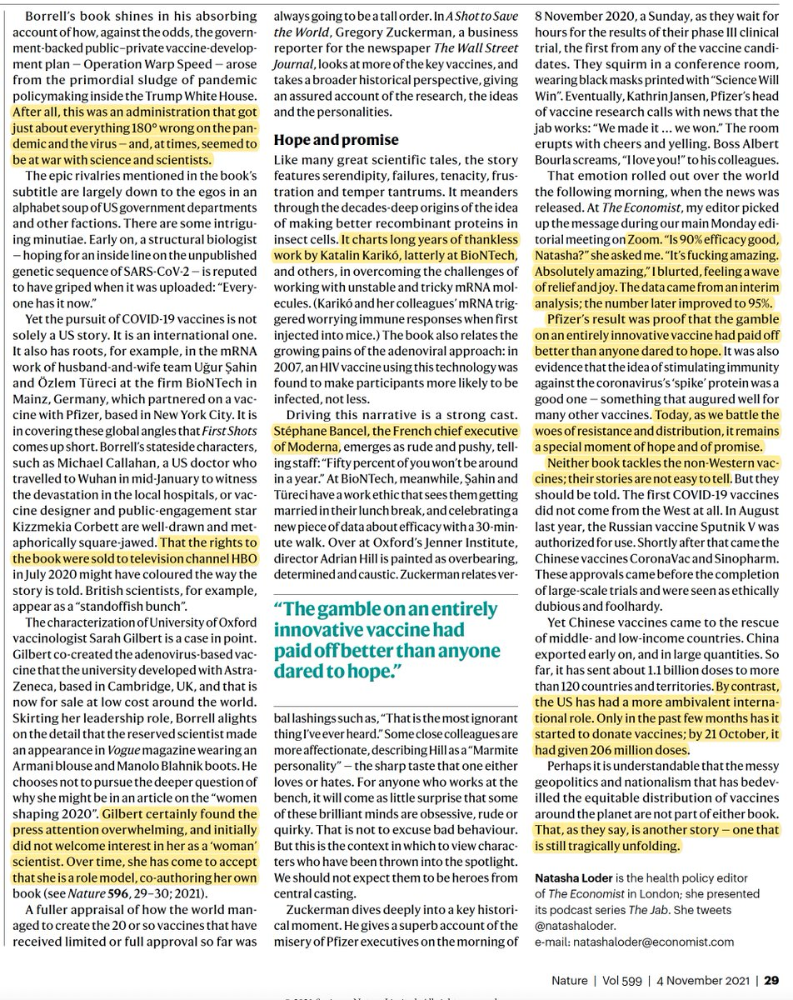</img></a>

---

<a href="https://twitter.com/erictopol/status/1455285252331507714" target="_blank" rel="noreferer">21:26 UCT</a>

This week the US will start vaccinations for children age 5-11. We spoke with @HumanitiesMD, a pediatrician-scientist-author who has written extensively on this topic (@NewYorker, @PostOpinions) on her views and suggestions  https://www.medscape.com/viewarticle/960620
@Medscape w/ @cuttingforstone

---

<a href="https://twitter.com/erictopol/status/1455285956857061376" target="_blank" rel="noreferer">21:29 UCT</a>

This is what I have to deal with each day. And people wonder why I don't read most responses to posts. At least this one didn't include expletives. https://twitter.com/noondeed/status/1455285326872596481

